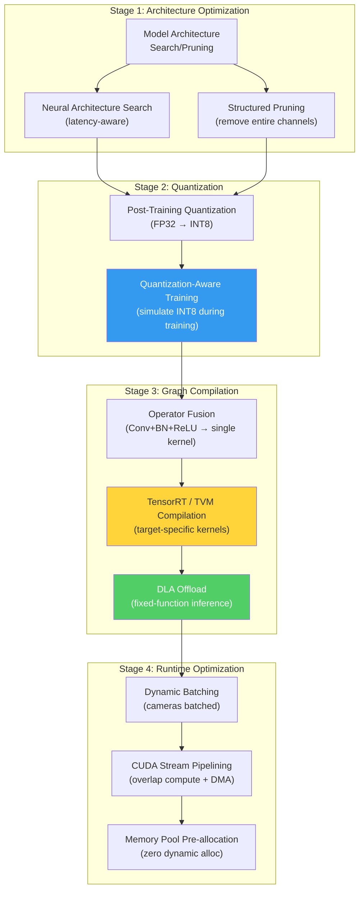
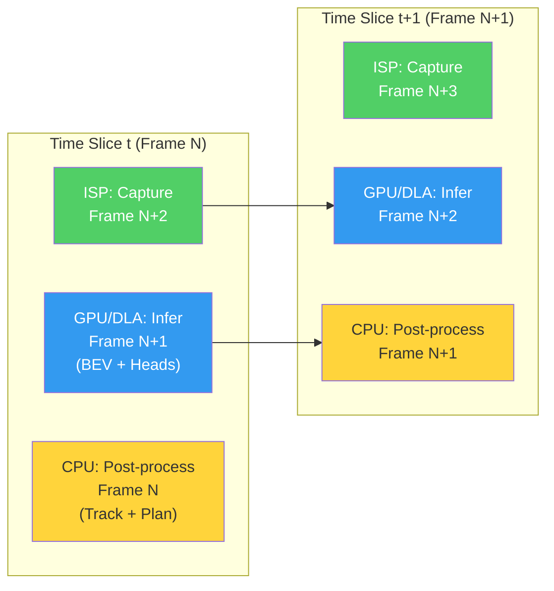

# 10. Edge Inference and Hardware Accelerators 🔴

> **The Problem:** Your BEV transformer has 120 million parameters and requires 85 TOPS (Tera Operations Per Second) to process 8 cameras at 30 frames per second. In the cloud, you run it on an NVIDIA A100 GPU consuming 300W and costing $3.50/hour. In the car, you have a System-on-Chip (SoC) with a 20W thermal budget, no active liquid cooling, and it must operate from -40°C to +85°C ambient temperature while simultaneously running the infotainment system, instrument cluster, telematics, and seven other ECUs on the same power bus. You cannot put a data center GPU in a vehicle. You must **compile, quantize, fuse, and optimize** the neural network until it fits within the compute, memory, and power envelope of automotive-grade silicon — without sacrificing the detection accuracy that keeps people alive.

---

## 10.1 The Automotive Compute Landscape (2026)

### Available System-on-Chips

| SoC | Vendor | NPU TOPS (INT8) | GPU TOPS (FP16) | CPU | Power (TDP) | Process | ASIL Rating | Price (Volume) |
|-----|--------|-----------------|-----------------|-----|-------------|---------|-------------|----------------|
| NVIDIA DRIVE Orin | NVIDIA | 275 (DLA) | 170 (Ampere GPU) | 12× Arm A78AE | 45W | 7nm | ASIL-D (lockstep CPU) | $200–$400 |
| NVIDIA DRIVE Thor | NVIDIA | 1,000+ (DLA) | 500+ (Blackwell GPU) | Grace CPU | 100W | 4nm | ASIL-D | $400–$800 |
| Mobileye EyeQ6H | Mobileye | 176 (XNN) | — | 16× MIPS | 20W | 7nm | ASIL-B(D) | $100–$200 |
| Qualcomm Snapdragon Ride | Qualcomm | 200 (Hexagon NPU) | 120 (Adreno GPU) | 8× Kryo CPU | 35W | 5nm | ASIL-B(D) | $150–$300 |
| Tesla FSD HW4 | Tesla (Samsung) | ~300 (custom NPU) | – | 12× A78AE | 72W | 7nm | ASIL-D (redundant) | Internal only |

### The Compute Budget Breakdown

For a typical L2+ system on DRIVE Orin:

```
Total available: 275 TOPS (INT8 DLA) + 170 TOPS (FP16 GPU)
  ── Perception (BEV + heads):     120 TOPS │ 44% of DLA
  ── Prediction (motion forecast):   30 TOPS │ 11% of DLA
  ── Planning (learned component):   15 TOPS │  5% of DLA
  ── Parking (APA):                  20 TOPS │  7% of DLA
  ── Driver monitoring (DMS):        15 TOPS │  5% of DLA
  ── Surround view stitching:        10 TOPS │  4% of DLA
  ── Reserve/headroom:               65 TOPS │ 24% of DLA  ← NEVER touch this
                                    ────────
  Total allocated:                  275 TOPS

If you exceed the budget, the SoC thermally throttles.
When it throttles, inference latency increases from 42ms to 120ms.
At 120 km/h, you just drove 2.6 meters blind.
The SoC thermal throttling killed someone.
```

---

## 10.2 The Optimization Stack: From Research to Edge

Converting a research model to edge deployment requires a multi-stage optimization pipeline. Each stage trades some accuracy for major latency and memory reduction.



### Optimization Impact Summary

| Optimization | Latency Reduction | Memory Reduction | Accuracy Impact |
|-------------|-------------------|------------------|-----------------|
| Structured pruning (30%) | 25–35% | 30% | -0.5% mAP |
| FP32 → FP16 (mixed precision) | 40–50% | 50% | -0.1% mAP |
| FP16 → INT8 (PTQ) | 60–70% | 75% | -1.5% mAP |
| FP16 → INT8 (QAT) | 60–70% | 75% | -0.3% mAP |
| Operator fusion (TensorRT) | 20–30% (on top of above) | 10–20% | 0% (lossless) |
| DLA offload | 10–15% (frees GPU) | — | 0% (lossless) |
| **Cumulative** | **~8× end-to-end speedup** | **~4× memory reduction** | **-0.8% mAP (with QAT)** |

---

## 10.3 Quantization: The Most Impactful Optimization

Quantization converts model weights and activations from 32-bit floating point (FP32) to lower precision (FP16, INT8, or INT4). This is the single most impactful optimization for edge inference.

### FP32 vs. INT8: The Math

A standard convolution operation:

$$y = \sum_{i} w_i \cdot x_i + b$$

In FP32, each multiply-accumulate (MAC) takes one cycle on the FPU. In INT8, the same MAC executes in one cycle on the integer unit — but the integer unit has **4× the throughput** because it processes 4× more operations per cycle (SIMD vectorization) and uses **4× less memory bandwidth**.

| Property | FP32 | FP16 | INT8 |
|----------|------|------|------|
| Bits per value | 32 | 16 | 8 |
| Dynamic range | ±3.4×10³⁸ | ±65,504 | -128 to +127 |
| TOPS on Orin DLA | 34 | 138 | 275 |
| Memory bandwidth | 1× | 2× effective | 4× effective |
| Typical accuracy loss | Baseline | -0.1% | -0.3% to -2.0% |

### Post-Training Quantization (PTQ) vs. Quantization-Aware Training (QAT)

```python
# 💥 RESEARCH APPROACH: Naive post-training quantization
# Quick but accuracy loss can be severe for sensitive models

def naive_ptq(model, calibration_data, num_batches=100):
    """
    Post-Training Quantization: collect activation statistics,
    compute scale/zero-point, and quantize weights.

    💥 Problem: Outlier activations in transformer attention layers
    cause the quantization range to be too wide, crushing most values
    into a few INT8 bins. Result: 3-5% mAP drop.
    """
    # Collect min/max activation statistics
    hooks = {}
    for name, module in model.named_modules():
        if isinstance(module, (nn.Conv2d, nn.Linear)):
            hooks[name] = ActivationObserver()
            module.register_forward_hook(hooks[name])

    # Run calibration data through the model
    model.eval()
    with torch.no_grad():
        for i, batch in enumerate(calibration_data):
            if i >= num_batches:
                break
            model(batch)

    # Compute scale and zero-point per layer
    for name, module in model.named_modules():
        if name in hooks:
            obs = hooks[name]
            # 💥 Using simple min/max → outliers dominate the range
            scale = (obs.max_val - obs.min_val) / 255.0
            zero_point = round(-obs.min_val / scale)
            module.weight.data = torch.clamp(
                torch.round(module.weight.data / scale) + zero_point,
                0, 255
            ).to(torch.uint8)

    return model
    # 💥 Result: 3.2% mAP drop because attention layer outliers
    #    compress the dynamic range for all other values
```

```python
# ✅ PRODUCTION APPROACH: Quantization-Aware Training with percentile calibration
# Train the model with simulated quantization — learns to be robust to INT8

import torch
import torch.nn as nn
from torch.quantization import QuantStub, DeQuantStub

class QuantizationAwareBEVModel(nn.Module):
    """
    BEV model with fake quantization inserted during training.
    The forward pass simulates INT8 arithmetic, allowing the model
    to learn weights that are robust to quantization noise.
    """
    def __init__(self, base_model):
        super().__init__()
        self.quant = QuantStub()
        self.base_model = base_model
        self.dequant = DeQuantStub()

    def forward(self, images, intrinsics, extrinsics):
        # Simulate INT8 on input
        images = self.quant(images)
        # Forward through model with fake-quantized weights
        output = self.base_model(images, intrinsics, extrinsics)
        # Back to FP32 for loss computation
        output = self.dequant(output)
        return output


def qat_training_loop(model, train_loader, calibration_loader, epochs=5):
    """
    QAT Training procedure:
    1. Start from a fully-trained FP32 model
    2. Insert fake quantization nodes
    3. Fine-tune for a few epochs with the driving loss
    4. Export the quantized model for TensorRT
    """
    # Configure QAT with percentile calibration (not min/max)
    # Percentile (99.99%) ignores outliers that destroy INT8 range
    qconfig = torch.quantization.QConfig(
        activation=torch.quantization.FakeQuantize.with_args(
            observer=torch.quantization.MovingAveragePerChannelMinMaxObserver,
            quant_min=0, quant_max=255,
            dtype=torch.quint8,
            reduce_range=False,
        ),
        weight=torch.quantization.FakeQuantize.with_args(
            observer=torch.quantization.MovingAveragePerChannelMinMaxObserver,
            quant_min=-128, quant_max=127,
            dtype=torch.qint8,
        ),
    )

    model.qconfig = qconfig
    torch.quantization.prepare_qat(model, inplace=True)

    optimizer = torch.optim.AdamW(model.parameters(), lr=1e-5)  # Low LR for fine-tuning

    for epoch in range(epochs):
        model.train()
        for batch in train_loader:
            output = model(batch['images'], batch['intrinsics'], batch['extrinsics'])
            loss = compute_driving_loss(output, batch['labels'])
            optimizer.zero_grad()
            loss.backward()
            optimizer.step()

        # Evaluate with actual INT8 inference
        int8_model = torch.quantization.convert(model.eval(), inplace=False)
        metrics = evaluate(int8_model, calibration_loader)
        print(f"Epoch {epoch}: INT8 mAP = {metrics['mAP']:.1f}%")

    # Final conversion to INT8
    quantized_model = torch.quantization.convert(model.eval())
    return quantized_model

# ✅ Result: Only 0.3% mAP drop instead of 3.2%
# The model learned to avoid outlier activations during QAT
```

---

## 10.4 TensorRT Compilation: Graph-Level Optimization

TensorRT is NVIDIA's inference compiler that transforms a PyTorch/ONNX model into an optimized execution plan for a specific GPU/DLA target.

### What TensorRT Does

```
Input: ONNX graph (generic, portable)
  Conv2d → BatchNorm → ReLU → Conv2d → BatchNorm → ReLU → Add

TensorRT Output: Optimized engine (target-specific)
  FusedConvBNReLU → FusedConvBNReLU → Add
  (single kernel, one memory read/write instead of six)
```

### Operator Fusion Examples

| Before Fusion | After Fusion | Speedup | Why |
|--------------|-------------|---------|-----|
| Conv → BN → ReLU | ConvBNReLU (1 kernel) | 2–3× | Eliminates 2 intermediate memory writes |
| Conv → Add → ReLU | ConvAddReLU (1 kernel) | 1.5–2× | Skip connection fused into conv |
| MatMul → Scale → Softmax | FlashAttention (1 kernel) | 3–5× | Attention computed in SRAM, no HBM round-trips |
| Transpose → Conv → Transpose | ConvWithLayout (1 kernel) | 2× | Eliminates memory layout shuffles |

### DLA (Deep Learning Accelerator) Offload

NVIDIA's DLA is a fixed-function inference engine on Orin — separate from the GPU. It runs standard layers (Conv, BN, ReLU, Pooling, Elementwise) at maximum efficiency but **cannot** run everything:

| Layer Type | DLA Support | Fallback |
|-----------|-------------|----------|
| Conv2d, DepthwiseConv | ✅ Full | — |
| BatchNorm, LayerNorm | ✅ Fused with conv | — |
| ReLU, SiLU, GELU | ✅ / ⚠️ (SiLU approximated) | GPU |
| Standard Attention | ❌ | GPU |
| Deformable Attention | ❌ | GPU |
| Resize/Upsample | ✅ (nearest only) | GPU (bilinear) |
| Custom ops | ❌ | GPU (TensorRT plugin) |

**Production strategy:** Run the backbone (90% of compute) on DLA, run attention-based BEV encoder on GPU. This frees the GPU for planning and visualization overlays.

```
// ✅ PRODUCTION: TensorRT build configuration for BEV model on Orin

// Build the TensorRT engine with mixed DLA + GPU execution
trtexec \
  --onnx=bev_model_qat_int8.onnx \
  --saveEngine=bev_model_orin.engine \
  --int8 \
  --fp16 \                           # Fallback precision for non-INT8 layers
  --useDLACore=0 \                   # Primary DLA core for backbone
  --allowGPUFallback \               # Layers DLA can't run fall back to GPU
  --workspace=2048 \                 # 2GB workspace for kernel autotuning
  --inputIOFormats=fp16:chw \        # Input in FP16 CHW format (ISP output)
  --outputIOFormats=fp16:chw \       # Output in FP16 for post-processing
  --minShapes=images:1x8x3x640x960 \    # Minimum batch (1 sample, 8 cams)
  --optShapes=images:1x8x3x640x960 \    # Optimal (single-sample inference)
  --maxShapes=images:1x8x3x640x960 \    # Maximum (no dynamic batching)
  --timingCacheFile=orin_timing.cache \  # Cache kernel timings for reproducibility
  --builderOptimizationLevel=5           # Maximum optimization (slow build, fast run)
```

---

## 10.5 Memory Management: Zero Dynamic Allocation

In a safety-critical real-time system, `malloc()` is the enemy. Dynamic memory allocation has:

1. **Non-deterministic latency:** A `malloc` call can take 1μs or 100μs depending on heap fragmentation.
2. **Fragmentation risk:** After hours of operation, the heap may be fragmented enough that a valid allocation fails — even with sufficient total free memory.
3. **OOM risk:** A single allocation failure in the perception pipeline means no detections for one frame.

### The Production Approach: Pre-allocated Memory Pools

```rust
// ✅ PRODUCTION: Pre-allocated inference memory pool (Rust)
// All memory is allocated at system startup and never freed during operation.

/// A fixed-size memory pool for inference tensors.
/// Pre-allocates all GPU and CPU memory at boot time.
/// Zero malloc calls during real-time inference loop.
pub struct InferenceMemoryPool {
    /// GPU memory pool for TensorRT intermediate activations
    gpu_workspace: cuda::DeviceBuffer<u8>,

    /// CPU-pinned memory for DMA transfers (camera → GPU)
    pinned_input_buffers: Vec<cuda::PinnedBuffer<u8>>,

    /// CPU-pinned memory for DMA transfers (GPU → CPU for post-processing)
    pinned_output_buffers: Vec<cuda::PinnedBuffer<u8>>,

    /// Pre-allocated detection output buffer (max 512 detections × 32 bytes)
    detection_buffer: Box<[Detection3D; 512]>,

    /// Pre-allocated occupancy grid (200 × 200 × 16 voxels × 1 byte)
    occupancy_buffer: Box<[u8; 200 * 200 * 16]>,

    /// Double-buffered: while one frame is being processed on GPU,
    /// the CPU processes the previous frame's results
    active_buffer: usize,
}

impl InferenceMemoryPool {
    /// Allocate all memory at system startup. This is the ONLY allocation.
    pub fn new(trt_engine: &TensorRtEngine) -> Result<Self, MemoryError> {
        let workspace_size = trt_engine.max_workspace_size(); // ~500 MB

        let num_cameras = 8;
        let frame_size = 3 * 640 * 960 * 2; // FP16: 3 channels × H × W × 2 bytes

        let input_buffers: Vec<_> = (0..2) // Double buffer
            .map(|_| cuda::PinnedBuffer::alloc(num_cameras * frame_size))
            .collect::<Result<Vec<_>, _>>()?;

        let output_size = trt_engine.max_output_size();
        let output_buffers: Vec<_> = (0..2)
            .map(|_| cuda::PinnedBuffer::alloc(output_size))
            .collect::<Result<Vec<_>, _>>()?;

        Ok(Self {
            gpu_workspace: cuda::DeviceBuffer::alloc(workspace_size)?,
            pinned_input_buffers: input_buffers,
            pinned_output_buffers: output_buffers,
            detection_buffer: Box::new([Detection3D::default(); 512]),
            occupancy_buffer: Box::new([0u8; 200 * 200 * 16]),
            active_buffer: 0,
        })
    }

    /// Get the input buffer for the current frame.
    /// Alternates between two buffers for double-buffering.
    pub fn current_input(&mut self) -> &mut cuda::PinnedBuffer<u8> {
        &mut self.pinned_input_buffers[self.active_buffer]
    }

    /// Get the output buffer for the current frame.
    pub fn current_output(&mut self) -> &mut cuda::PinnedBuffer<u8> {
        &mut self.pinned_output_buffers[self.active_buffer]
    }

    /// Swap buffers after a frame is submitted. No allocation occurs.
    pub fn swap(&mut self) {
        self.active_buffer = 1 - self.active_buffer;
    }
}
```

---

## 10.6 The Inference Pipeline: Putting It All Together

The complete inference pipeline is a multi-stage pipelined system where data capture, GPU inference, and CPU post-processing overlap in time.



### Pipelining Latency vs. Throughput

| Metric | Without Pipelining | With 3-Stage Pipeline | Improvement |
|--------|-------------------|----------------------|-------------|
| **Throughput** | $\frac{1}{T_{\text{ISP}} + T_{\text{GPU}} + T_{\text{CPU}}}$ = $\frac{1}{5 + 25 + 8}$ = 26 fps | $\frac{1}{\max(T_{\text{ISP}}, T_{\text{GPU}}, T_{\text{CPU}})}$ = $\frac{1}{25}$ = 40 fps | **1.5×** |
| **Latency** | 38 ms (serial) | 38 ms (same) | Same |
| **GPU utilization** | 66% ($\frac{25}{38}$) | 100% | **+34%** |

### The Complete Inference Controller

```rust
// ✅ PRODUCTION: Multi-stage pipelined inference controller (Rust)

use std::sync::mpsc;
use std::thread;
use std::time::{Duration, Instant};

/// Pipeline stage messages
enum PipelineMsg {
    /// Raw camera frames captured by ISP
    CapturedFrame {
        frame_id: u64,
        camera_data: CameraFrameSet,  // 8 cameras, pinned memory
        capture_timestamp: Instant,
    },
    /// Neural network inference complete
    InferenceResult {
        frame_id: u64,
        detections: DetectionArray,
        occupancy: OccupancyGrid,
        bev_features: BevFeatureMap,
        inference_timestamp: Instant,
    },
}

pub struct InferencePipeline {
    capture_thread: thread::JoinHandle<()>,
    inference_thread: thread::JoinHandle<()>,
    postprocess_thread: thread::JoinHandle<()>,
}

impl InferencePipeline {
    pub fn start(
        trt_engine: TensorRtEngine,
        memory_pool: InferenceMemoryPool,
        camera_driver: CameraDriver,
        tracker: MultiObjectTracker,
        deadline_monitor: PerceptionDeadlineMonitor,
    ) -> Self {
        let (capture_tx, capture_rx) = mpsc::sync_channel::<PipelineMsg>(2);
        let (inference_tx, inference_rx) = mpsc::sync_channel::<PipelineMsg>(2);

        // Stage 1: Camera capture (ISP hardware + DMA)
        let capture_thread = thread::Builder::new()
            .name("perception-capture".into())
            .spawn(move || {
                set_realtime_priority(90);  // High priority, but below safety monitor
                let mut frame_id: u64 = 0;

                loop {
                    let camera_data = camera_driver.capture_synchronized();
                    let _ = capture_tx.send(PipelineMsg::CapturedFrame {
                        frame_id,
                        camera_data,
                        capture_timestamp: Instant::now(),
                    });
                    frame_id += 1;
                }
            })
            .expect("Failed to spawn capture thread");

        // Stage 2: GPU/DLA inference (TensorRT)
        let inference_thread = thread::Builder::new()
            .name("perception-inference".into())
            .spawn(move || {
                set_realtime_priority(85);
                let mut pool = memory_pool;

                while let Ok(PipelineMsg::CapturedFrame {
                    frame_id, camera_data, capture_timestamp
                }) = capture_rx.recv() {
                    // Copy camera data to GPU (async DMA)
                    let input_buf = pool.current_input();
                    input_buf.copy_from_host(&camera_data.as_bytes());

                    // Run TensorRT inference (GPU + DLA)
                    let output_buf = pool.current_output();
                    trt_engine.enqueue(input_buf, output_buf);
                    trt_engine.synchronize();  // Wait for GPU completion

                    // Parse outputs from raw buffer
                    let detections = DetectionArray::from_buffer(output_buf, 0);
                    let occupancy = OccupancyGrid::from_buffer(output_buf, detections.byte_size());
                    let bev_features = BevFeatureMap::from_buffer(
                        output_buf,
                        detections.byte_size() + occupancy.byte_size(),
                    );

                    pool.swap();  // Double-buffer swap, no allocation

                    let _ = inference_tx.send(PipelineMsg::InferenceResult {
                        frame_id,
                        detections,
                        occupancy,
                        bev_features,
                        inference_timestamp: Instant::now(),
                    });
                }
            })
            .expect("Failed to spawn inference thread");

        // Stage 3: CPU post-processing (tracking, planning interface)
        let postprocess_thread = thread::Builder::new()
            .name("perception-postprocess".into())
            .spawn(move || {
                set_realtime_priority(80);
                let mut tracker = tracker;
                let mut deadline_monitor = deadline_monitor;

                while let Ok(PipelineMsg::InferenceResult {
                    frame_id, detections, occupancy, bev_features,
                    inference_timestamp,
                }) = inference_rx.recv() {
                    let postprocess_start = Instant::now();

                    // Multi-object tracking (Hungarian assignment + Kalman filter)
                    let tracked_objects = tracker.update(&detections);

                    // Package perception output for planner
                    let perception_output = PerceptionOutput {
                        frame_id,
                        tracked_objects,
                        occupancy,
                        bev_features,
                        timestamp: postprocess_start,
                    };

                    // Publish to planner via shared memory (zero-copy)
                    publish_perception_output(&perception_output);

                    // Monitor perception end-to-end latency
                    let total_latency = postprocess_start.elapsed()
                        + (postprocess_start - inference_timestamp);
                    let mode = deadline_monitor.report_latency(total_latency);

                    match mode {
                        SystemMode::EmergencyStop => {
                            trigger_emergency_stop();
                            break;
                        }
                        SystemMode::Degraded { reason, .. } => {
                            notify_planner_degraded(reason);
                        }
                        SystemMode::Normal => {}
                    }
                }
            })
            .expect("Failed to spawn postprocess thread");

        Self {
            capture_thread,
            inference_thread,
            postprocess_thread,
        }
    }
}
```

---

## 10.7 Thermal Management: The Silent Killer

The SoC's compute capacity is a function of its temperature. An NVIDIA Orin can sustain 275 INT8 TOPS at 85°C junction temperature. At 95°C, it throttles to 200 TOPS. At 105°C, it shuts down to prevent permanent damage.

### Thermal Budget

```
Vehicle thermal environment (worst case):
  Ambient:             45°C (Arizona summer, parked in sun)
  Under-hood delta:    +15°C (solar loading on roof-mounted compute box)
  Heatsink → junction: +25°C (passive cooling limit)
  ─────────────────────────
  Junction temp:       85°C  → Full power, no throttle
  
  Add traffic jam (low airflow): +10°C
  ─────────────────────────
  Junction temp:       95°C  → THROTTLED to 73% power
  ─────────────────────────
  Your 42ms inference is now 58ms.
  Your 24fps perception is now 17fps.
  Your safety monitors trigger degraded mode.
```

### Production Thermal Management Strategy

| Strategy | Implementation | Effect |
|----------|---------------|--------|
| **Power-aware scheduling** | Monitor SoC temperature; reduce inference resolution from 200×200 BEV to 100×100 at 85°C | Reduces power 30%, sacrifices far-range |
| **Compute offloading** | Move non-critical tasks (surround view, dashcam recording) to a secondary SoC | Frees 20W thermal headroom |
| **Frequency governor** | Cap GPU clock at 80% in high-temp conditions, before thermal throttle kicks in | Predictable degradation vs. unpredictable throttle |
| **Active cooling** | Liquid cooling loop shared with battery thermal management | Maintains <80°C junction in all conditions (adds $100 BOM, 200g weight) |

```rust
// ✅ PRODUCTION: Thermal-aware inference quality controller

pub struct ThermalController {
    temperature_thresholds: ThermalThresholds,
    current_config: InferenceConfig,
}

pub struct ThermalThresholds {
    normal_max_c: f32,       // 80°C — full power
    degraded_max_c: f32,     // 88°C — reduce quality gracefully
    critical_max_c: f32,     // 95°C — minimum viable inference
}

pub struct InferenceConfig {
    bev_resolution: (u32, u32),  // BEV grid size
    temporal_frames: u32,         // Number of past frames for temporal fusion
    num_task_heads: u32,          // Some heads can be disabled under pressure
}

impl ThermalController {
    pub fn adjust_for_temperature(&mut self, junction_temp_c: f32) -> InferenceConfig {
        if junction_temp_c < self.temperature_thresholds.normal_max_c {
            // Full power — maximum quality
            self.current_config = InferenceConfig {
                bev_resolution: (200, 200),
                temporal_frames: 4,
                num_task_heads: 4, // detection + segmentation + occupancy + prediction
            };
        } else if junction_temp_c < self.temperature_thresholds.degraded_max_c {
            // Reduce resolution and temporal context
            self.current_config = InferenceConfig {
                bev_resolution: (100, 100),  // 4× fewer voxels
                temporal_frames: 2,           // Reduce temporal aggregation
                num_task_heads: 3,            // Disable map segmentation head
            };
            log::warn!(
                "Thermal degraded mode: {}°C, reduced BEV to 100×100",
                junction_temp_c
            );
        } else {
            // Critical — minimum viable perception
            self.current_config = InferenceConfig {
                bev_resolution: (50, 50),   // 16× fewer voxels, forward-only
                temporal_frames: 1,          // No temporal fusion
                num_task_heads: 1,           // Detection only
            };
            log::error!(
                "Thermal CRITICAL: {}°C, minimum perception mode",
                junction_temp_c
            );
        }
        self.current_config.clone()
    }
}
```

---

## 10.8 Benchmarking: The Production Performance Matrix

Every model candidate must pass a comprehensive performance gate before deployment:

| Gate | Metric | L2+ Requirement | L3 Requirement |
|------|--------|-----------------|----------------|
| **Latency P50** | Median inference time | ≤ 35 ms | ≤ 25 ms |
| **Latency P99** | 99th percentile inference time | ≤ 50 ms | ≤ 35 ms |
| **Latency P99.9** | 99.9th percentile (thermal spikes) | ≤ 65 ms | ≤ 45 ms |
| **Throughput** | Sustained fps over 10 minutes | ≥ 20 fps | ≥ 30 fps |
| **GPU memory** | Peak allocated GPU memory | ≤ 3 GB | ≤ 4 GB |
| **CPU memory** | Peak RSS on CPU | ≤ 1 GB | ≤ 1.5 GB |
| **Power draw** | Sustained power (SoC only) | ≤ 30W | ≤ 45W |
| **Thermal headroom** | Minutes to throttle at 45°C ambient | ≥ 60 min | ≥ 120 min |
| **3D detection mAP** | Mean Average Precision (nuScenes val) | ≥ 58% | ≥ 63% |
| **Depth MAE at 30m** | Mean Absolute Error | ≤ 2.0 m | ≤ 1.5 m |

If any single gate fails, the model **does not ship**. There is no "we'll fix it in the next OTA." The consequence of shipping an under-performing perception model is not a software bug — it is a fatality.

---

> **Key Takeaways**
>
> 1. **Quantization-Aware Training is mandatory.** Post-training quantization loses 2–5% mAP on transformer-based models due to outlier activations. QAT recovers most of this loss by teaching the model to tolerate INT8 noise during training.
>
> 2. **TensorRT operator fusion is free performance.** A well-fused model runs 20–30% faster than a naively compiled one with zero accuracy loss. Always profile the TensorRT layer-by-layer report to find un-fused operators.
>
> 3. **Zero dynamic allocation is a hard requirement.** Every byte of GPU and CPU memory used during inference must be pre-allocated at startup. A single `malloc` in the hot path introduces non-deterministic latency that can cascade into a deadline miss.
>
> 4. **Pipeline everything.** Camera capture, GPU inference, and CPU post-processing should overlap in time. This turns a 38ms serial pipeline into 25ms-per-frame throughput — the difference between 26fps and 40fps.
>
> 5. **Design for thermal throttling.** Your SoC will overheat in exactly the conditions where you need maximum performance (traffic jam, direct sunlight, surface temperatures exceeding 50°C). Build graceful degradation into the inference pipeline, not as an afterthought.
>
> 6. **The performance gate is a safety gate.** A model that is 0.5% more accurate but 15% slower may be the more dangerous model. Latency and accuracy are inseparable in autonomous driving — optimize both jointly.
