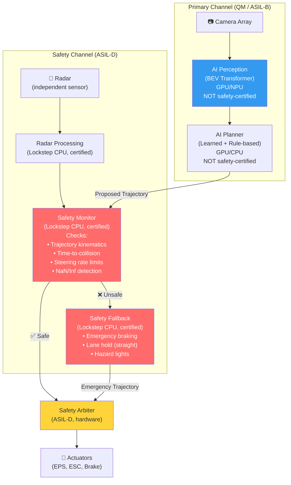
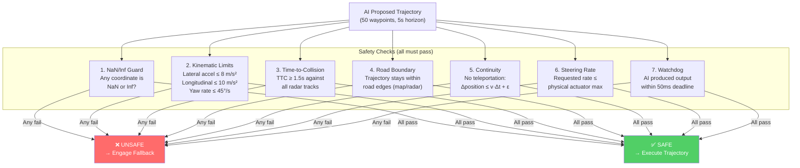
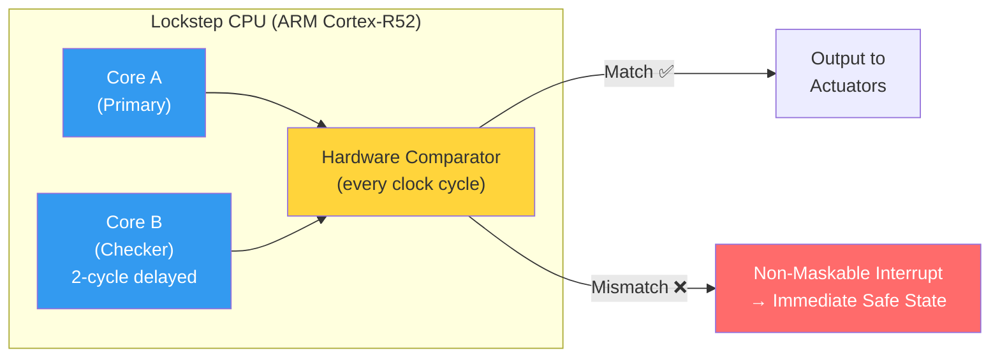
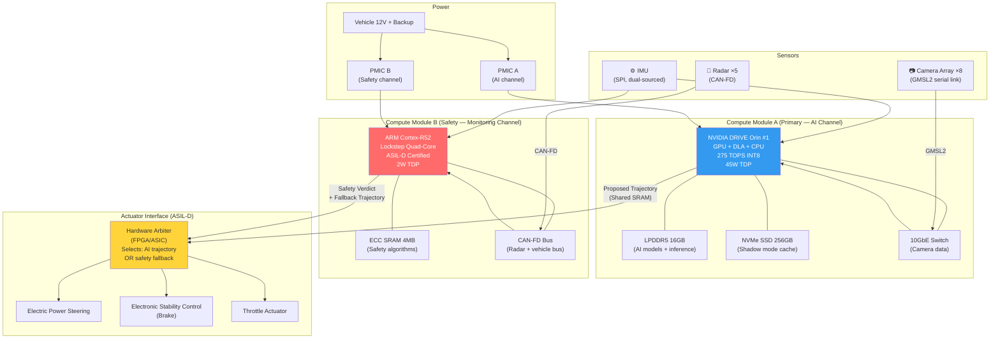

# 11. Functional Safety (ISO 26262) and Redundancy 🔴

> **The Problem:** Your neural network outputs a steering angle of 87° at 120 km/h on a straight highway. A floating-point NaN propagated through the softmax layer in the BEV transformer, producing garbage activations that cascaded into the trajectory head. The resulting trajectory commands the vehicle to swerve full-lock into oncoming traffic. The Model Predictive Controller dutifully tracks this trajectory because it was told to. In 400 milliseconds, the vehicle has crossed the center line and is now head-on with a truck. Three people are dead. A `NaN` killed them. **Functional safety is the engineering discipline that ensures software failures — including the mathematically certain failure of neural networks — never propagate to physical harm.** ISO 26262 is not a checkbox. It is the difference between a product recall and a mass-casualty event.

---

## 11.1 ISO 26262: The Automotive Safety Standard

ISO 26262 is the international standard for functional safety of road vehicles. It defines a risk-based approach: the higher the risk of a hazard, the more rigorous the engineering process required to mitigate it.

### ASIL Classification (Automotive Safety Integrity Level)

Every potential hazard is rated along three dimensions:

| Dimension | Rating | Definition |
|-----------|--------|------------|
| **Severity (S)** | S0–S3 | S0=no injury, S1=light injury, S2=severe/survival probable, S3=life-threatening/fatal |
| **Exposure (E)** | E0–E4 | E0=incredible, E1=very low, E2=low, E3=medium, E4=high |
| **Controllability (C)** | C0–C3 | C0=controllable, C1=simply controllable, C2=normally controllable, C3=difficult/uncontrollable |

The ASIL level is determined by combining these three ratings:

| | C1 | C2 | C3 |
|---|---|---|---|
| **S1, E1** | QM | QM | QM |
| **S1, E2** | QM | QM | QM |
| **S1, E3** | QM | QM | ASIL-A |
| **S1, E4** | QM | ASIL-A | ASIL-B |
| **S2, E1** | QM | QM | QM |
| **S2, E2** | QM | QM | ASIL-A |
| **S2, E3** | QM | ASIL-A | ASIL-B |
| **S2, E4** | ASIL-A | ASIL-B | ASIL-C |
| **S3, E1** | QM | QM | ASIL-A |
| **S3, E2** | QM | ASIL-A | ASIL-B |
| **S3, E3** | ASIL-A | ASIL-B | ASIL-C |
| **S3, E4** | ASIL-B | ASIL-C | **ASIL-D** |

**QM** = Quality Management (no special safety requirements). **ASIL-D** = highest rigor.

### ASIL Classification for ADAS/AD Functions

| Function | Severity | Exposure | Controllability | ASIL | Rationale |
|----------|----------|----------|-----------------|------|-----------|
| Automated Emergency Braking (AEB) | S3 (fatal if fails to brake) | E4 (always active) | C3 (driver cannot override in time) | **ASIL-D** | Failure = collision at full speed |
| Lane Keeping Assist (LKA) | S3 (head-on if leaves lane) | E4 (highway driving) | C2 (driver can correct within 1s) | **ASIL-C** | Driver is supervision fallback |
| Adaptive Cruise Control (ACC) | S2 (rear-end if fails) | E4 (always active) | C2 (driver can brake) | **ASIL-B** | Moderate severity, driver can act |
| Parking Assist | S1 (low speed) | E3 (when parking) | C1 (driver can stop) | **ASIL-A** | Low speed, low severity |
| Surround View Display | S0 (display only) | E4 | C0 | **QM** | No vehicle control |

---

## 11.2 The Redundant Architecture: ASIL Decomposition

The fundamental ISO 26262 principle for autonomous driving: **no single point of failure may lead to a hazardous event.**

The neural network running on the GPU/NPU is inherently non-deterministic, non-certifiable, and will fail. You cannot certify a 120M-parameter neural network to ASIL-D. But you don't need to — you can **decompose** the safety requirement.

### ASIL Decomposition: AI + Safety Monitor = ASIL-D

ISO 26262 allows decomposition of a safety requirement into two independent elements with lower ASIL ratings, provided their independence is guaranteed:

$$\text{ASIL-D} = \text{ASIL-B(D)} + \text{ASIL-B(D)}$$

Where the **(D)** suffix means "developed with ASIL-D independence requirements."

In practice:

| Component | ASIL Rating | Responsibility | Certification Path |
|-----------|-------------|----------------|-------------------|
| **AI Perception + Planning** (GPU/NPU) | QM–ASIL-B | Propose trajectory based on camera perception | ML validation (not formal certification) |
| **Safety Monitor + Fallback** (lockstep CPU) | ASIL-D | Verify trajectory is physically safe; execute emergency fallback if not | Formally verified, MISRA-compliant C/Rust |
| **Combined System** | ASIL-D | System-level safety goal achieved through independence | ASIL decomposition argument |



### The Independence Requirement

The AI channel and safety channel must be **hardware-independent**:

| Independence Aspect | Requirement | Implementation |
|--------------------|-------------|----------------|
| **Compute** | Different processing units | AI on GPU/NPU; Safety on lockstep ARM Cortex-R52 |
| **Power supply** | Independent voltage regulators | PMIC A (GPU rail) and PMIC B (Safety CPU rail) |
| **Clock source** | Independent oscillators | GPU uses PLL A; Safety CPU uses crystal oscillator B |
| **Memory** | Separate memory controllers + banks | GPU uses LPDDR5 Bank 0-3; Safety CPU uses dedicated SRAM or LPDDR5 Bank 4-7 |
| **Software** | No shared libraries, no shared OS | AI runs Linux; Safety runs AUTOSAR Classic on certified RTOS |
| **Communication** | Hardware-mediated, one-directional where possible | AI writes proposed trajectory to shared SRAM; Safety reads it. Safety never writes to AI memory. |
| **Sensor input** | At least one independent sensor per channel | AI: cameras. Safety: radar (works in rain, darkness, sensor degradation) |

---

## 11.3 The Safety Monitor: Formal Verification of AI Output

The safety monitor is a small, deterministic, formally verifiable program that inspects the AI's proposed trajectory and decides: **safe or unsafe?**

### What the Safety Monitor Checks



### The Safety Monitor Implementation (ASIL-D Rust)

```rust
// ✅ PRODUCTION: ASIL-D Safety Monitor
// This code runs on a lockstep ARM Cortex-R52 with ECC SRAM.
// Every function is formally verified. No dynamic allocation.
// No floating-point (uses fixed-point Q16.16 arithmetic).
// No standard library (bare-metal, #![no_std]).

#![no_std]
#![no_main]

use core::panic::PanicInfo;

/// Fixed-point Q16.16 arithmetic for deterministic computation.
/// No floating-point unit available on safety CPU.
#[derive(Clone, Copy, Debug, PartialEq, Eq, PartialOrd, Ord)]
#[repr(transparent)]
pub struct Fixed32(i32);

impl Fixed32 {
    pub const ZERO: Self = Fixed32(0);
    pub const ONE: Self = Fixed32(1 << 16);
    pub const MAX: Self = Fixed32(i32::MAX);

    pub const fn from_int(n: i16) -> Self {
        Fixed32((n as i32) << 16)
    }

    /// Create from a value with 3 decimal places: from_milli(1500) = 1.500
    pub const fn from_milli(n: i32) -> Self {
        // n * 65536 / 1000, using integer arithmetic to avoid overflow
        Fixed32(((n as i64 * 65536) / 1000) as i32)
    }

    pub const fn abs(self) -> Self {
        if self.0 < 0 {
            Fixed32(-self.0)
        } else {
            self
        }
    }

    /// Saturating multiplication (no overflow → panic)
    pub fn saturating_mul(self, rhs: Self) -> Self {
        let result = (self.0 as i64 * rhs.0 as i64) >> 16;
        if result > i32::MAX as i64 {
            Self::MAX
        } else if result < i32::MIN as i64 {
            Fixed32(i32::MIN)
        } else {
            Fixed32(result as i32)
        }
    }

    /// Is this value NaN-equivalent? (impossible in fixed-point, but we check
    /// for the sentinel value that the AI channel writes when it produces NaN)
    pub fn is_sentinel(&self) -> bool {
        self.0 == i32::MIN // 0x80000000 is the "NaN sentinel"
    }
}

/// A single waypoint in the proposed trajectory.
/// Received from AI channel via shared memory.
#[repr(C)]
#[derive(Clone, Copy)]
pub struct SafetyWaypoint {
    pub x_m: Fixed32,         // meters, ego-centric
    pub y_m: Fixed32,         // meters, ego-centric
    pub heading_rad: Fixed32, // radians (Q16.16)
    pub speed_m_s: Fixed32,   // m/s
    pub timestamp_ms: u32,    // milliseconds from now
}

/// Radar track from the safety-independent radar channel.
#[repr(C)]
#[derive(Clone, Copy)]
pub struct RadarTrackSafety {
    pub range_m: Fixed32,
    pub range_rate_m_s: Fixed32, // negative = approaching
    pub azimuth_rad: Fixed32,
    pub valid: bool,
}

/// Safety check result — no allocation, no strings, just a code.
#[derive(Clone, Copy, Debug, PartialEq, Eq)]
#[repr(u8)]
pub enum SafetyVerdict {
    Safe = 0,
    NanDetected = 1,
    ExcessiveLateralAccel = 2,
    ExcessiveLongitudinalAccel = 3,
    ExcessiveYawRate = 4,
    InsufficientTTC = 5,
    TrajectoryOutOfBounds = 6,
    TrajectoryContinuityViolation = 7,
    ExcessiveSteeringRate = 8,
    WatchdogTimeout = 9,
}

/// Safety limits — compile-time constants, never modified at runtime.
pub struct SafetyLimits {
    pub max_lateral_accel: Fixed32,       // 8.0 m/s²
    pub max_longitudinal_accel: Fixed32,  // 5.0 m/s² (acceleration)
    pub max_longitudinal_decel: Fixed32,  // 10.0 m/s² (braking)
    pub max_yaw_rate: Fixed32,            // 0.785 rad/s (45°/s)
    pub min_ttc: Fixed32,                 // 1.5 seconds
    pub max_position_jump: Fixed32,       // max Δ per step (v*dt + 0.5m tolerance)
    pub max_steering_rate: Fixed32,       // 8.7 rad/s (500°/s actuator limit)
    pub watchdog_deadline_ms: u32,        // 50 ms
}

impl SafetyLimits {
    pub const fn production() -> Self {
        Self {
            max_lateral_accel: Fixed32::from_int(8),
            max_longitudinal_accel: Fixed32::from_int(5),
            max_longitudinal_decel: Fixed32::from_int(10),
            max_yaw_rate: Fixed32::from_milli(785),    // 0.785 rad/s
            min_ttc: Fixed32::from_milli(1500),         // 1.5 s
            max_position_jump: Fixed32::from_milli(500), // 0.5 m tolerance
            max_steering_rate: Fixed32::from_milli(8700), // 8.7 rad/s
            watchdog_deadline_ms: 50,
        }
    }
}

/// The core safety verification function.
/// This function MUST execute in under 200μs and MUST be deterministic.
/// It is formally verified using CBMC (C Bounded Model Checker) via FFI.
pub fn verify_trajectory(
    waypoints: &[SafetyWaypoint],
    num_waypoints: usize,
    ego_speed_m_s: Fixed32,
    radar_tracks: &[RadarTrackSafety],
    num_radar_tracks: usize,
    last_ai_output_ms: u32,
    current_time_ms: u32,
    limits: &SafetyLimits,
) -> SafetyVerdict {
    // CHECK 0: Watchdog — did the AI produce output in time?
    let elapsed = current_time_ms.wrapping_sub(last_ai_output_ms);
    if elapsed > limits.watchdog_deadline_ms {
        return SafetyVerdict::WatchdogTimeout;
    }

    // CHECK 1: NaN/sentinel detection on every field of every waypoint
    for i in 0..num_waypoints {
        let wp = &waypoints[i];
        if wp.x_m.is_sentinel()
            || wp.y_m.is_sentinel()
            || wp.heading_rad.is_sentinel()
            || wp.speed_m_s.is_sentinel()
        {
            return SafetyVerdict::NanDetected;
        }
    }

    // CHECK 2-4: Kinematic limits between consecutive waypoints
    for i in 1..num_waypoints {
        let prev = &waypoints[i - 1];
        let curr = &waypoints[i];
        let dt_ms = curr.timestamp_ms.saturating_sub(prev.timestamp_ms);
        if dt_ms == 0 {
            continue; // Skip duplicate timestamps
        }
        let dt = Fixed32::from_milli(dt_ms as i32);

        // Velocity change → acceleration
        let dv = Fixed32(curr.speed_m_s.0 - prev.speed_m_s.0);
        let accel = Fixed32((dv.0 as i64 * Fixed32::ONE.0 as i64 / dt.0 as i64) as i32);

        // Longitudinal acceleration check
        if accel.0 > limits.max_longitudinal_accel.0 {
            return SafetyVerdict::ExcessiveLongitudinalAccel;
        }
        if accel.abs().0 > limits.max_longitudinal_decel.0 {
            return SafetyVerdict::ExcessiveLongitudinalAccel;
        }

        // Heading change → yaw rate
        let dheading = Fixed32(curr.heading_rad.0 - prev.heading_rad.0);
        let yaw_rate = Fixed32((dheading.0 as i64 * Fixed32::ONE.0 as i64 / dt.0 as i64) as i32);
        if yaw_rate.abs().0 > limits.max_yaw_rate.0 {
            return SafetyVerdict::ExcessiveYawRate;
        }

        // Lateral acceleration: a_lat = v² * κ ≈ v * yaw_rate
        let lat_accel = curr.speed_m_s.saturating_mul(yaw_rate.abs());
        if lat_accel.0 > limits.max_lateral_accel.0 {
            return SafetyVerdict::ExcessiveLateralAccel;
        }

        // CHECK 5: Continuity (no teleportation)
        let dx = Fixed32(curr.x_m.0 - prev.x_m.0);
        let dy = Fixed32(curr.y_m.0 - prev.y_m.0);
        // distance² = dx² + dy² (avoid square root in fixed-point)
        let dist_sq = dx.saturating_mul(dx).0.saturating_add(dy.saturating_mul(dy).0);
        let max_dist = ego_speed_m_s.saturating_mul(dt);
        let max_dist_with_tol = Fixed32(max_dist.0.saturating_add(limits.max_position_jump.0));
        let max_dist_sq = max_dist_with_tol.saturating_mul(max_dist_with_tol);
        if dist_sq > max_dist_sq.0 {
            return SafetyVerdict::TrajectoryContinuityViolation;
        }
    }

    // CHECK 3 (continued): Time-to-collision with radar tracks
    if num_waypoints > 0 {
        let first_wp = &waypoints[0];
        for j in 0..num_radar_tracks {
            let track = &radar_tracks[j];
            if !track.valid {
                continue;
            }
            // TTC = range / closing_speed (only if closing)
            if track.range_rate_m_s.0 < 0 {
                // Closing: range_rate is negative
                let closing_speed = Fixed32(-track.range_rate_m_s.0);
                if closing_speed.0 > 0 {
                    // TTC = range / closing_speed
                    let ttc = Fixed32(
                        (track.range_m.0 as i64 * Fixed32::ONE.0 as i64
                            / closing_speed.0 as i64) as i32,
                    );
                    if ttc.0 < limits.min_ttc.0 {
                        return SafetyVerdict::InsufficientTTC;
                    }
                }
            }
        }
    }

    SafetyVerdict::Safe
}

/// Emergency fallback trajectory: straight-line deceleration.
/// No neural network. No camera. No perception. Pure physics.
/// This code is the last line of defense.
pub fn compute_emergency_trajectory(
    ego_speed_m_s: Fixed32,
    ego_heading_rad: Fixed32,
    output: &mut [SafetyWaypoint; 10],
) {
    let decel = Fixed32::from_int(-8); // -8 m/s² (comfortable emergency braking)
    let dt = Fixed32::from_milli(100);  // 100ms per waypoint

    let mut speed = ego_speed_m_s;
    let mut distance_accumulated = Fixed32::ZERO;

    for i in 0..10 {
        // v = v0 + a*t
        speed = Fixed32(speed.0 + decel.saturating_mul(dt).0);
        if speed.0 < 0 {
            speed = Fixed32::ZERO;
        }

        // d = v * dt
        let step_distance = speed.saturating_mul(dt);
        distance_accumulated = Fixed32(distance_accumulated.0 + step_distance.0);

        // Straight line along current heading (no steering)
        // x = d * cos(heading), y = d * sin(heading)
        // Using lookup table for cos/sin in fixed-point (not shown)
        output[i] = SafetyWaypoint {
            x_m: fixed_cos(ego_heading_rad).saturating_mul(distance_accumulated),
            y_m: fixed_sin(ego_heading_rad).saturating_mul(distance_accumulated),
            heading_rad: ego_heading_rad, // Maintain current heading
            speed_m_s: speed,
            timestamp_ms: (i as u32 + 1) * 100,
        };
    }
}

#[panic_handler]
fn panic(_info: &PanicInfo) -> ! {
    // On panic, immediately trigger emergency braking via hardware watchdog.
    // The hardware watchdog is a separate circuit that asserts the brake line
    // if the safety CPU stops servicing it within 10ms.
    unsafe {
        // Stop feeding the watchdog → hardware triggers emergency brake
        core::arch::asm!("wfi"); // Wait for interrupt (halt CPU)
    }
    loop {}
}
```

---

## 11.4 Lockstep Processing: Detecting Hardware Faults

The safety CPU uses **lockstep execution** — two identical processor cores execute the same instructions in parallel, and a hardware comparator checks that their outputs match on every clock cycle.

### How Lockstep Works



### What Lockstep Detects

| Fault Type | Example | Detection | Coverage |
|-----------|---------|-----------|----------|
| **Permanent hardware fault** | A transistor stuck-at-1 in the ALU | Core A and Core B produce different results | >99% |
| **Transient fault (SEU)** | Cosmic ray flips a bit in a register | One core affected, other is not | >99% (different timing) |
| **Common-mode fault** | Both cores receive wrong clock frequency | **NOT DETECTED** — this is why you need diverse sensors | ~0% |
| **Software bug** | Off-by-one error in safety check | **NOT DETECTED** — lockstep only catches hardware faults | ~0% |

Lockstep catches **hardware** faults. Software correctness requires **formal verification** and **diverse redundancy** (independent implementations on independent hardware).

---

## 11.5 The Dual-Compute Architecture: Production Topology

A production L2+/L3 system uses at least two physically separate compute modules:



### The Hardware Arbiter

The hardware arbiter is the final gatekeeper. It is implemented in an FPGA or ASIC — not software — to eliminate the possibility of software faults in the arbitration logic.

| Arbiter Logic | Condition | Action |
|--------------|-----------|--------|
| **Normal** | Safety verdict = SAFE, AI trajectory received within deadline | Forward AI trajectory to actuators |
| **AI Timeout** | No AI trajectory within 50ms | Forward Safety fallback trajectory |
| **Safety Override** | Safety verdict ≠ SAFE | Forward Safety fallback trajectory, ignore AI |
| **Dual Failure** | Both AI and Safety fail to produce output within 100ms | **Hardware-level emergency brake** (direct relay to ESC) |
| **Power Loss (AI)** | AI channel PMIC reports undervoltage | Safety channel takes full control |
| **Power Loss (Safety)** | Safety channel PMIC reports undervoltage | AI continues with maximum caution; vehicle alerts driver to take over |

---

## 11.6 Failure Mode and Effects Analysis (FMEA)

ISO 26262 requires a systematic analysis of every component's failure modes and their effects on vehicle safety.

### FMEA Extract: Neural Network Failures

| Component | Failure Mode | Effect | Severity | Detection Method | ASIL | Mitigation |
|-----------|-------------|--------|----------|-----------------|------|------------|
| BEV Transformer | NaN propagation from softmax overflow | Garbage trajectory, potential swerve into oncoming traffic | S3 | Safety monitor NaN check (Check 1) | D | Safety fallback + emergency braking |
| 3D Detection Head | Missed detection (false negative) | Vehicle does not react to obstacle | S3 | Radar cross-check (independent sensor) | D | Radar-based TTC triggers independent braking |
| 3D Detection Head | Phantom detection (false positive) | Unnecessary braking on highway | S2 | Temporal consistency check (object must persist >3 frames) | B | Planner requires multi-frame confirmation |
| Motion Prediction | Predicted trajectory is wildly wrong | Planner reacts to non-existent future collision | S2 | Safety monitor kinematic bounds check | B | Prediction bounded by physics (max accel) |
| GPU/NPU | Hardware fault (bit flip in SRAM) | Corrupted activations → unpredictable output | S3 | GPU ECC + output checksum monitored by safety CPU | D | Trigger ASIL-D fallback on ECC error |
| Camera ISP | Stuck frame (same image repeated) | Perception frozen, obstacles not updated | S3 | Frame sequence counter check + timestamp monotonicity | D | Switch to radar-only perception |
| Camera | Lens obscured (mud, snow, sun glare) | Degraded/lost camera input | S3 | Image quality metric (entropy, saturation) | C | Graceful degradation: use remaining cameras + radar |
| TensorRT Engine | Inference takes >50ms (thermal throttle) | Stale perception, delayed reaction | S2 | Watchdog timer on inference output | C | Thermal management + degraded inference mode |

---

## 11.7 Software Development Process: ASIL-D Rigor

Writing safety-critical code is fundamentally different from writing application software. ISO 26262 Part 6 specifies requirements for each ASIL level:

### Development Methods by ASIL

| Method | ASIL-A | ASIL-B | ASIL-C | ASIL-D |
|--------|--------|--------|--------|--------|
| Requirements traceability | Recommended | Recommended | Highly recommended | **Mandatory** |
| Coding guidelines (MISRA/Rust safety) | Recommended | Highly recommended | **Mandatory** | **Mandatory** |
| Static analysis | Recommended | Highly recommended | **Mandatory** | **Mandatory** |
| Unit testing (statement coverage) | Recommended | **Mandatory** | **Mandatory** | **Mandatory** |
| Unit testing (branch coverage) | — | Recommended | **Mandatory** | **Mandatory** |
| Unit testing (MC/DC coverage) | — | — | Recommended | **Mandatory** |
| Integration testing | Recommended | **Mandatory** | **Mandatory** | **Mandatory** |
| Formal verification | — | — | Recommended | **Highly recommended** |
| Code review (by independent reviewer) | Recommended | **Mandatory** | **Mandatory** | **Mandatory** |
| Safety manual | — | Recommended | **Mandatory** | **Mandatory** |

### Why Rust for Safety-Critical Code

| Property | C (MISRA-C) | Rust (no_std, safe subset) |
|----------|------------|--------------------------|
| Memory safety | Rules-based (MISRA rules, enforced by static analysis) | Compiler-enforced (borrow checker) |
| Data races | Prevention requires discipline + external tools | Impossible in safe Rust (compile-time guarantee) |
| Undefined behavior | Pervasive (out-of-bounds, use-after-free, signed overflow) | Only in `unsafe` blocks (auditable surface area) |
| Null pointer dereference | Common source of defects | No null pointers (`Option<T>` instead) |
| Integer overflow | Undefined behavior in C | Panics in debug, wraps in release (configurable, predictable) |
| Certification status (2026) | Mature (ISO 26262 toolchain qualified) | Emerging (Ferrocene compiler ISO 26262 qualified since 2024) |
| Ecosystem maturity | Decades of ASIL-D software in production | Growing; first ASIL-D Rust systems shipping 2025–2026 |

```rust
// ✅ Comparison: A safety check in MISRA-C vs. Rust

// --- MISRA-C approach ---
// Requires 15+ MISRA rules to prevent undefined behavior.
// Static analyzer (Polyspace, LDRA) must verify compliance.
//
// /* MISRA C:2012 Rule 10.1: Operands shall not be of an inappropriate type */
// /* MISRA C:2012 Rule 14.3: Controlling expression shall not be invariant */
// /* MISRA C:2012 Rule 21.3: stdlib memory allocation shall not be used */
//
// int32_t check_ttc(const radar_track_t* track, int32_t min_ttc_ms) {
//     if (track == NULL) { return -1; }           /* Rule 11.5: no void* cast */
//     if (track->range_rate_mm_s >= 0) { return 0; }
//     int32_t closing = -track->range_rate_mm_s;  /* potential overflow! */
//     if (closing == 0) { return 0; }              /* div-by-zero guard */
//     int32_t ttc_ms = (track->range_mm * 1000) / closing;/* potential overflow! */
//     return (ttc_ms < min_ttc_ms) ? 1 : 0;
// }

// ✅ Rust approach — the compiler prevents the dangerous patterns by construction.
// No MISRA rules needed; the type system IS the rule set.

/// Check time-to-collision for a radar track.
/// Returns `true` if the track is on a collision course below the TTC threshold.
///
/// # Safety Argument
/// - No null pointers: `track` is a reference, not a pointer.
/// - No integer overflow: `checked_div` and `saturating_mul` used explicitly.
/// - No undefined behavior: all operations are defined for all input values.
pub fn check_ttc(track: &RadarTrackSafety, min_ttc: Fixed32) -> bool {
    // Only check closing objects (negative range rate)
    if track.range_rate_m_s.0 >= 0 {
        return false;
    }

    let closing_speed = Fixed32(-track.range_rate_m_s.0);
    if closing_speed.0 == 0 {
        return false; // Not closing
    }

    // TTC = range / closing_speed (fixed-point division with overflow check)
    let ttc_raw = (track.range_m.0 as i64)
        .checked_mul(Fixed32::ONE.0 as i64)
        .and_then(|numerator| numerator.checked_div(closing_speed.0 as i64));

    match ttc_raw {
        Some(ttc) if (ttc as i32) < min_ttc.0 => true,  // Collision imminent
        _ => false,  // Safe or overflow (conservatively safe)
    }
}
```

---

## 11.8 Validation: Proving the System Is Safe

Building a safe system is not enough — you must **prove** it is safe. ISO 26262 requires validation at both the component and system level.

### The Validation Pyramid

| Level | Method | Coverage | Typical Volume |
|-------|--------|----------|---------------|
| **Unit tests** | Test each safety function with boundary values | MC/DC coverage ≥ 100% on safety-critical code | ~5,000 test cases |
| **Integration tests** | Test AI + Safety Monitor interaction | All FMEA failure modes injected | ~2,000 fault injection tests |
| **SIL (Software-in-the-Loop)** | Run full stack in simulation with injected sensor data | 10M+ virtual miles, all operational scenarios | ~10M miles |
| **HIL (Hardware-in-the-Loop)** | Run on actual SoC with simulated sensors | Timing validation, thermal testing | ~1M miles equivalent |
| **Closed-course testing** | Real vehicle, controlled environment | Edge cases too dangerous for public roads | ~50K miles |
| **Public road testing** | Real vehicle, real traffic | Final validation, with safety driver | ~500K miles |
| **Shadow Mode fleet** | Millions of vehicles, silent evaluation | Billions of miles of passive validation | ~1B miles |

### Fault Injection Testing

Every failure mode in the FMEA must be injected and the system's response verified:

```rust
// ✅ PRODUCTION: Fault injection test for NaN propagation

#[cfg(test)]
mod safety_fault_injection_tests {
    use super::*;

    /// Inject NaN into the AI trajectory output.
    /// Verify: Safety monitor detects it and engages fallback.
    #[test]
    fn test_nan_in_trajectory_triggers_fallback() {
        let limits = SafetyLimits::production();
        let ego_speed = Fixed32::from_int(30); // 30 m/s ≈ 108 km/h

        // Construct a trajectory where waypoint 3 has NaN (sentinel value)
        let mut waypoints = [SafetyWaypoint {
            x_m: Fixed32::from_int(0),
            y_m: Fixed32::from_int(0),
            heading_rad: Fixed32::ZERO,
            speed_m_s: Fixed32::from_int(30),
            timestamp_ms: 0,
        }; 10];

        for i in 0..10 {
            waypoints[i].x_m = Fixed32::from_int(i as i16 * 3);
            waypoints[i].timestamp_ms = (i as u32 + 1) * 100;
        }

        // INJECT FAULT: NaN sentinel in waypoint 3's x coordinate
        waypoints[3].x_m = Fixed32(i32::MIN); // NaN sentinel

        let radar_tracks = [];
        let verdict = verify_trajectory(
            &waypoints, 10, ego_speed, &radar_tracks, 0,
            0, 10, // AI output 10ms ago
            &limits,
        );

        assert_eq!(verdict, SafetyVerdict::NanDetected,
            "Safety monitor MUST detect NaN sentinel and return NanDetected");
    }

    /// Inject physically impossible lateral acceleration.
    /// Verify: Safety monitor rejects the trajectory.
    #[test]
    fn test_excessive_lateral_accel_triggers_fallback() {
        let limits = SafetyLimits::production();
        let ego_speed = Fixed32::from_int(30);

        let mut waypoints = [SafetyWaypoint {
            x_m: Fixed32::ZERO,
            y_m: Fixed32::ZERO,
            heading_rad: Fixed32::ZERO,
            speed_m_s: Fixed32::from_int(30),
            timestamp_ms: 0,
        }; 10];

        // Normal straight trajectory for first 4 waypoints
        for i in 0..10 {
            waypoints[i].x_m = Fixed32::from_int(i as i16 * 3);
            waypoints[i].timestamp_ms = (i as u32 + 1) * 100;
        }

        // INJECT FAULT: Sudden 90° heading change at waypoint 5
        // This implies infinite lateral acceleration
        waypoints[5].heading_rad = Fixed32::from_milli(1571); // π/2 rad = 90°

        let radar_tracks = [];
        let verdict = verify_trajectory(
            &waypoints, 10, ego_speed, &radar_tracks, 0,
            0, 10,
            &limits,
        );

        assert!(
            verdict == SafetyVerdict::ExcessiveYawRate
                || verdict == SafetyVerdict::ExcessiveLateralAccel,
            "Safety monitor MUST detect impossible heading change. Got: {:?}",
            verdict
        );
    }

    /// Inject watchdog timeout (AI channel frozen).
    /// Verify: Safety monitor detects timeout and engages fallback.
    #[test]
    fn test_watchdog_timeout_triggers_fallback() {
        let limits = SafetyLimits::production();
        let ego_speed = Fixed32::from_int(30);

        let waypoints = [SafetyWaypoint {
            x_m: Fixed32::ZERO,
            y_m: Fixed32::ZERO,
            heading_rad: Fixed32::ZERO,
            speed_m_s: Fixed32::from_int(30),
            timestamp_ms: 100,
        }; 10];

        let radar_tracks = [];

        // AI output was 200ms ago — well beyond the 50ms deadline
        let verdict = verify_trajectory(
            &waypoints, 10, ego_speed, &radar_tracks, 0,
            0,    // last AI output at t=0
            200,  // current time: t=200ms → 200ms elapsed
            &limits,
        );

        assert_eq!(verdict, SafetyVerdict::WatchdogTimeout,
            "Safety monitor MUST detect watchdog timeout for stale AI output");
    }

    /// Inject radar-detected closing object with low TTC.
    /// Verify: Safety monitor triggers emergency response.
    #[test]
    fn test_insufficient_ttc_triggers_fallback() {
        let limits = SafetyLimits::production();
        let ego_speed = Fixed32::from_int(30);

        // Normal trajectory (AI thinks road is clear)
        let mut waypoints = [SafetyWaypoint {
            x_m: Fixed32::ZERO,
            y_m: Fixed32::ZERO,
            heading_rad: Fixed32::ZERO,
            speed_m_s: Fixed32::from_int(30),
            timestamp_ms: 0,
        }; 10];
        for i in 0..10 {
            waypoints[i].x_m = Fixed32::from_int(i as i16 * 3);
            waypoints[i].timestamp_ms = (i as u32 + 1) * 100;
        }

        // INJECT: Radar sees a stationary object 25m ahead, ego closing at 30 m/s
        // TTC = 25/30 = 0.83s < 1.5s threshold
        let radar_tracks = [RadarTrackSafety {
            range_m: Fixed32::from_int(25),
            range_rate_m_s: Fixed32::from_int(-30), // closing at 30 m/s
            azimuth_rad: Fixed32::ZERO,               // dead ahead
            valid: true,
        }];

        let verdict = verify_trajectory(
            &waypoints, 10, ego_speed, &radar_tracks, 1,
            0, 10,
            &limits,
        );

        assert_eq!(verdict, SafetyVerdict::InsufficientTTC,
            "Safety monitor MUST detect closing radar object with TTC < 1.5s");
    }
}
```

---

## 11.9 Summary: The Safety Architecture at a Glance

| Layer | Component | ASIL | Technology | Failure Response |
|-------|----------|------|------------|-----------------|
| **Sensor** | 8 cameras | QM | GMSL2 serial link | Degrade to remaining cameras + radar |
| **Sensor** | 5 radars | ASIL-B | CAN-FD | Independent perception for TTC |
| **Sensor** | IMU (dual) | ASIL-B | SPI, dual-sourced | Cross-check between two IMUs |
| **Compute (AI)** | NVIDIA Orin GPU/DLA | QM | LPDDR5 + NVMe | Safety channel takes over |
| **Compute (Safety)** | ARM Cortex-R52 lockstep | ASIL-D | ECC SRAM | Hardware watchdog triggers brake |
| **Software (AI)** | BEV Transformer + Planner | QM | Linux, PyTorch/TensorRT | Output rejected by safety monitor |
| **Software (Safety)** | Safety monitor + fallback | ASIL-D | AUTOSAR/bare-metal, Rust | Formal verification, 100% MC/DC |
| **Arbiter** | Hardware trajectory selector | ASIL-D | FPGA/ASIC | Defaults to brake-only safe state |
| **Actuator** | EPS, ESC, throttle | ASIL-D | CAN-FD, dual-circuit brakes | Mechanical fallback (manual steering column) |
| **Power** | Dual PMIC + backup battery | ASIL-B | Independent voltage rails | 30s backup power for safe stop |

---

> **Key Takeaways**
>
> 1. **You cannot certify a neural network to ASIL-D.** But you don't need to. ASIL decomposition allows you to wrap an uncertified AI in a certified safety envelope, achieving system-level ASIL-D compliance.
>
> 2. **The safety monitor is the simplest, most critical code in the system.** It uses fixed-point arithmetic, no dynamic allocation, no floating point, and no standard library. It must be formally verifiable and execute in under 200μs.
>
> 3. **Redundancy means independent.** Shared memory, shared power supply, shared clock, or shared software libraries between the AI and safety channels destroy the independence argument and invalidate the ASIL decomposition.
>
> 4. **Radar is the safety sensor, not LiDAR.** Radar works in rain, fog, darkness, and direct sunlight. It provides independent range and velocity measurements that the camera-based AI cannot manipulate or confuse. This is why even "vision-only" vehicles still have radar on the safety channel.
>
> 5. **Every failure mode must be tested.** The FMEA is not a document — it is a test plan. Every row in the FMEA table maps to a fault injection test that proves the safety system detects the failure and engages the correct response. If you can imagine a failure mode that isn't tested, your system is not safe.
>
> 6. **A `NaN` killed three people** is not a hypothetical. It is the failure mode that functional safety exists to prevent. The safety monitor's NaN check — a single comparison against a sentinel value — is potentially the most important line of code in the entire vehicle.
