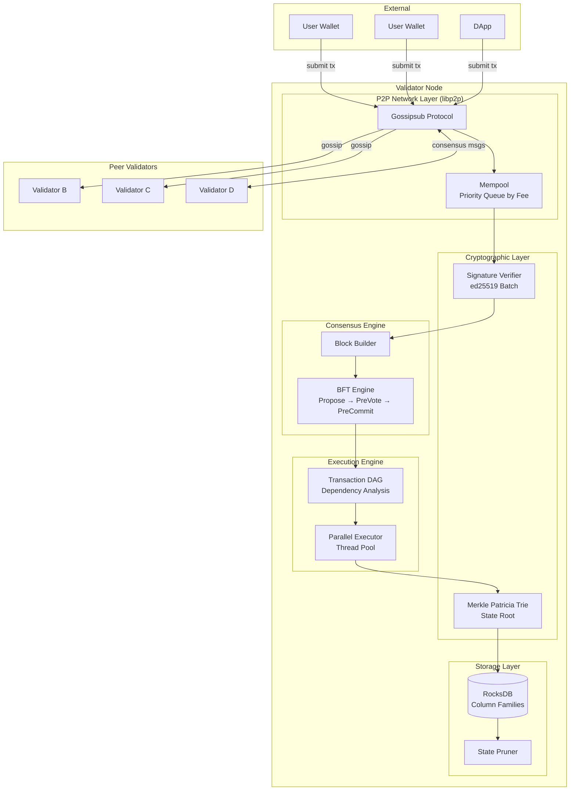
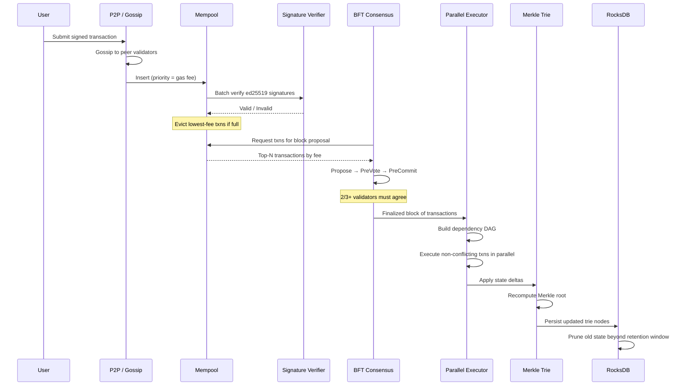

# System Design: Architecting a High-Throughput Blockchain Validator

## Speaker Intro

This handbook is written from the perspective of a **Principal Protocol Engineer** who has designed, implemented, and operated blockchain validators processing thousands of transactions per second across globally distributed networks. The content draws from first-hand experience building execution engines, consensus layers, and storage backends for high-throughput L1 blockchains where a single bug in state transition logic can cause multi-million-dollar forks.

## Who This Is For

- **Systems engineers** who want to understand how modern blockchains (Solana, Aptos, Sui) achieve 10,000+ TPS while Ethereum's EVM is limited to ~15 TPS natively.
- **Backend engineers** interested in distributed systems problems that go far beyond web services—Byzantine fault tolerance, deterministic execution, and cryptographic state proofs.
- **Protocol developers** evaluating Rust for validator implementations and who need a blueprint for the full stack from P2P networking to on-disk state management.
- **Anyone who has *used* a blockchain** and wondered what actually happens between submitting a transaction and seeing it finalized on-chain—this book builds every component from first principles.

## Prerequisites

| Concept | Where to Learn |
|---|---|
| Intermediate Rust (ownership, traits, `async`) | [Async Rust](../async-book/src/SUMMARY.md) |
| Basic networking (TCP, UDP, sockets) | [Tokio Internals](../tokio-internals-book/src/SUMMARY.md) |
| Hash functions, digital signatures (conceptual) | Any introductory cryptography course |
| Familiarity with concurrent programming | [Concurrency in Rust](../concurrency-book/src/SUMMARY.md) |
| Basic understanding of key-value stores | [Database Internals](../database-internals-book/src/SUMMARY.md) |

## How to Use This Book

| Emoji | Meaning |
|---|---|
| 🟢 | **Architecture** — foundational networking and data-structure design |
| 🟡 | **Cryptography/P2P** — signature schemes, Merkle trees, state proofs |
| 🔴 | **Parallel Execution** — BFT consensus, concurrent execution, storage engines |

Each chapter builds one critical subsystem of a production blockchain validator. Read them in order—the consensus engine (Ch 3) assumes the P2P layer (Ch 1) and cryptographic primitives (Ch 2) exist, and parallel execution (Ch 4) feeds into the storage layer (Ch 5).

## The Problem We Are Solving

> Design a **high-throughput blockchain validator** capable of processing **10,000+ transactions per second** with **sub-second finality**, **Byzantine fault tolerance** (up to ⅓ malicious nodes), and **terabyte-scale state management** on commodity hardware.

The system we will build has these non-negotiable requirements:

| Requirement | Target |
|---|---|
| Transaction throughput | ≥ 10,000 TPS sustained |
| Finality | < 1 second (single-slot finality) |
| Fault tolerance | Byzantine up to ⅓ of validators |
| Signature verification | ≥ 50,000 ed25519 verifications/sec |
| State storage | Terabytes of account state with cryptographic proofs |
| Recovery time | < 30 seconds to rejoin consensus after restart |

## Pacing Guide

| Chapter | Topic | Time | Checkpoint |
|---|---|---|---|
| Ch 0 | Introduction & Problem Statement | 30 min | Understand the validator architecture |
| Ch 1 | P2P Network & Mempool | 6–8 hours | Gossip protocol flooding txns across 3 nodes |
| Ch 2 | Cryptography & State Verification | 6–8 hours | Merkle Patricia Trie with proof generation |
| Ch 3 | Consensus Engine (BFT) | 8–10 hours | 4-node BFT cluster reaching finality |
| Ch 4 | Parallel Transaction Execution | 8–10 hours | DAG-based parallel executor on 8 cores |
| Ch 5 | Database I/O & State Bloat | 6–8 hours | RocksDB column families with state pruning |

**Total: ~35–45 hours** of focused study.

## Table of Contents

### Part I: Networking
- **Chapter 1 — The P2P Network and The Mempool 🟢** — Architecting the networking layer using `libp2p`. Implementing a gossip protocol to flood unconfirmed transactions across the globe. Designing the Mempool to evict low-fee transactions during congestion and prevent OOM kills.

### Part II: Cryptographic State
- **Chapter 2 — Cryptography and State Verification 🟡** — Replacing the database with math. Building a Merkle Patricia Trie (and exploring Verkle Trees) to store account balances with cryptographic proofs. Using `ed25519` for extremely fast signature verification.

### Part III: Consensus
- **Chapter 3 — The Consensus Engine (BFT) 🔴** — How to agree on state when nodes can lie. Implementing a Byzantine Fault Tolerant consensus mechanism modeled on Tendermint/CometBFT. Block proposals, pre-vote, pre-commit, and finality guarantees.

### Part IV: Execution
- **Chapter 4 — Parallel Transaction Execution 🔴** — Why standard blockchains (EVM) are slow. Architecting a multi-threaded execution engine. Building a dependency DAG of transactions based on account access sets, allowing non-overlapping transactions to execute concurrently across CPU cores.

### Part V: Storage
- **Chapter 5 — Database I/O and State Bloat 🔴** — The silent killer of blockchains. Managing terabytes of historical state. Using RocksDB column families optimized for high-read/high-write churn, and implementing state pruning to delete ancient block data safely.

## Architecture Overview

## How a Transaction Flows Through the Validator

## Companion Guides

This handbook builds on concepts from several other books in the Rust Training curriculum:

| Book | Relevance |
|---|---|
| [Async Rust](../async-book/src/SUMMARY.md) | Tokio runtime powering the P2P and consensus layers |
| [Concurrency in Rust](../concurrency-book/src/SUMMARY.md) | Thread pools, channels, and lock-free structures for parallel execution |
| [Distributed Systems](../distributed-systems-book/src/SUMMARY.md) | Consensus protocols, failure models, and distributed clocks |
| [Database Internals](../database-internals-book/src/SUMMARY.md) | LSM trees, B-Trees, and RocksDB internals for the storage layer |
| [Hardware Sympathy](../hardware-sympathy-book/src/SUMMARY.md) | CPU caches, NUMA, and memory layout for high-throughput execution |
| [Zero-Copy Architecture](../zero-copy-book/src/SUMMARY.md) | io_uring and zero-copy I/O for network and disk paths |
