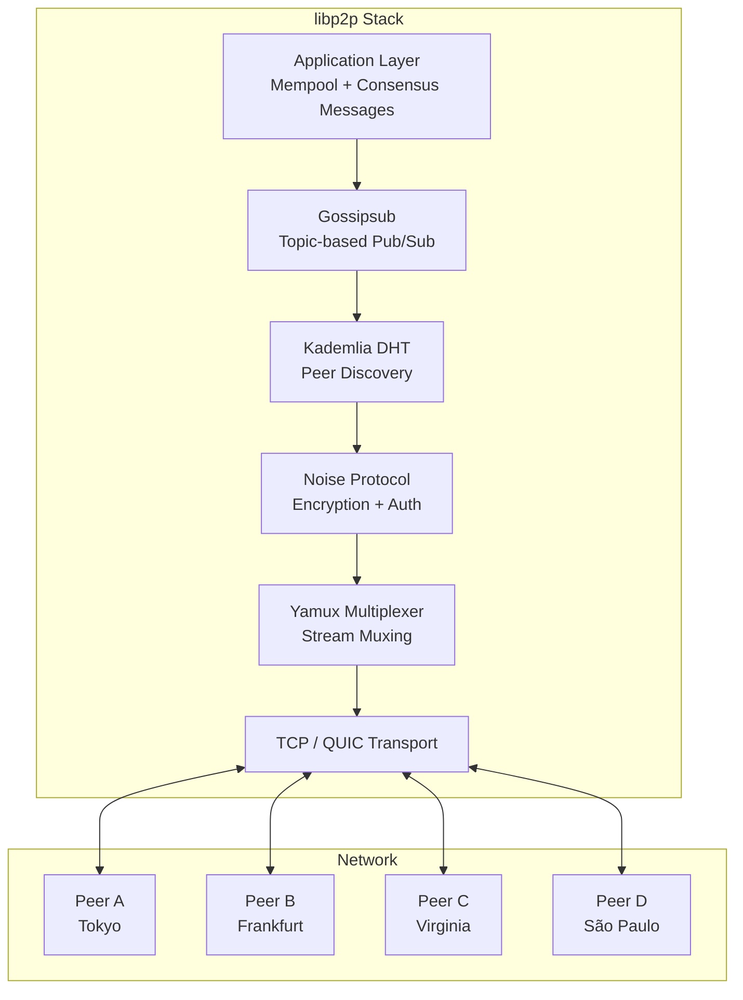
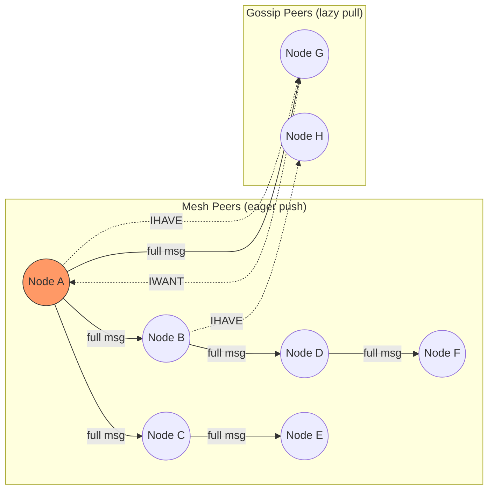
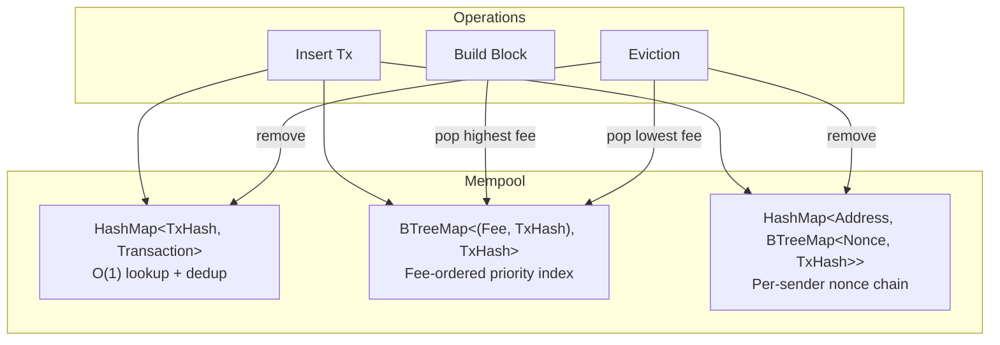
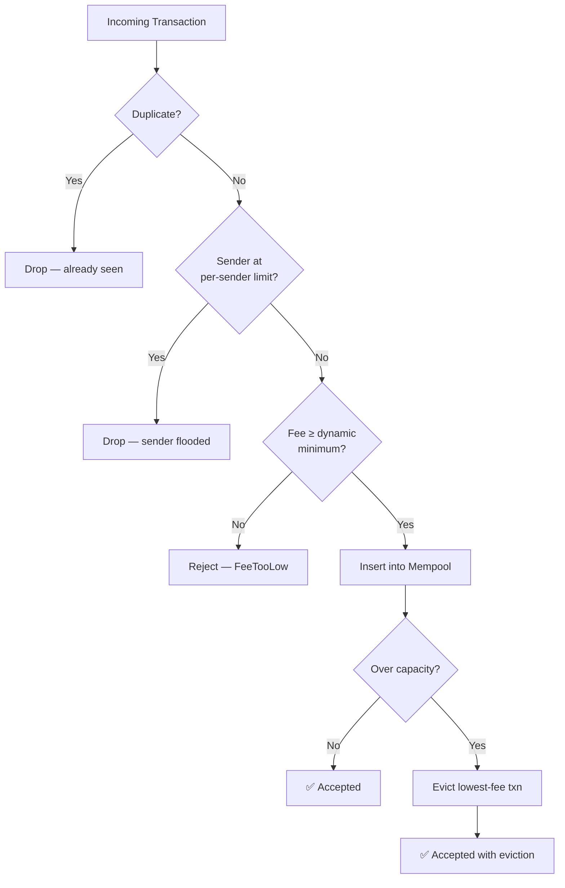

# 1. The P2P Network and The Mempool 🟢

> **The Problem:** A blockchain validator cannot use a central server to receive transactions—there is no "server." Every validator is simultaneously a client and a server in a fully decentralized peer-to-peer network. When a user submits a transaction in Tokyo, every validator in São Paulo, Frankfurt, and Virginia must receive it within milliseconds. We need a protocol that floods data across thousands of nodes without a coordinator, while the Mempool must survive congestion spikes that could 10× the incoming transaction rate and cause OOM kills.

---

## Why Traditional Client-Server Fails

In a centralized system, clients send requests to a known endpoint. This creates three fatal problems for a blockchain:

1. **Single point of failure** — If the server dies, the network halts.
2. **Censorship** — The server operator can selectively drop transactions.
3. **Trust** — Users must trust the server operator to order transactions fairly.

A blockchain replaces this with a **gossip protocol**: every node that receives a message re-broadcasts it to a random subset of its peers. After O(log N) hops, every node in the network has the message.

| Property | Client-Server | Gossip P2P |
|---|---|---|
| Topology | Star (hub-and-spoke) | Mesh (random graph) |
| Single point of failure | Yes (the server) | No (any node can die) |
| Message delivery | 1 hop | O(log N) hops |
| Bandwidth cost per message | O(1) at server | O(N × fanout) total |
| Censorship resistance | None | High (route around failures) |
| Latency | Lowest (1 RTT) | Higher (multi-hop) |

---

## The libp2p Architecture

We use `libp2p`, the modular networking stack originally built for IPFS and now used by Ethereum, Polkadot, and Filecoin. It provides:

- **Transport-agnostic connections** (TCP, QUIC, WebSocket)
- **Peer discovery** (mDNS for local, Kademlia DHT for global)
- **Gossipsub** — A topic-based publish/subscribe gossip protocol
- **Noise protocol** for encrypted, authenticated connections



### Gossipsub: How Messages Propagate

Gossipsub maintains two overlays:

1. **Mesh overlay** — Each node maintains `D` (degree, typically 6–8) direct mesh peers per topic. Full messages are eagerly forwarded within the mesh.
2. **Gossip overlay** — Nodes periodically send `IHAVE` metadata to non-mesh peers. If a peer missed a message, it sends `IWANT` to pull it.

This hybrid approach gives us both:
- **Low latency** from the eager mesh forwarding
- **High reliability** from the lazy gossip fallback



---

## Building the P2P Node

### Setting Up the Network Behavior

```rust,ignore
use libp2p::{
    gossipsub, identity, noise, tcp, yamux, Multiaddr, PeerId, Swarm, SwarmBuilder,
};
use std::collections::hash_map::DefaultHasher;
use std::hash::{Hash, Hasher};
use std::time::Duration;
use tokio::sync::mpsc;

/// Topics our validator subscribes to.
const TOPIC_TRANSACTIONS: &str = "/blockchain/txs/1.0.0";
const TOPIC_BLOCKS: &str = "/blockchain/blocks/1.0.0";
const TOPIC_CONSENSUS: &str = "/blockchain/consensus/1.0.0";

/// Configuration for the P2P node.
struct P2pConfig {
    /// Local key pair for peer identity.
    keypair: identity::Keypair,
    /// Addresses to listen on.
    listen_addrs: Vec<Multiaddr>,
    /// Bootstrap peers to connect to on startup.
    bootstrap_peers: Vec<(PeerId, Multiaddr)>,
    /// Gossipsub mesh degree (D parameter).
    mesh_degree: usize,
    /// Maximum transmit size for a single gossip message (bytes).
    max_transmit_size: usize,
}

impl Default for P2pConfig {
    fn default() -> Self {
        Self {
            keypair: identity::Keypair::generate_ed25519(),
            listen_addrs: vec!["/ip4/0.0.0.0/tcp/9000".parse().unwrap()],
            bootstrap_peers: Vec::new(),
            mesh_degree: 8,
            max_transmit_size: 1_048_576, // 1 MB
        }
    }
}

/// Messages produced by the P2P layer for the rest of the validator.
enum P2pEvent {
    /// A new transaction received from the gossip network.
    NewTransaction(Vec<u8>),
    /// A new block received from a peer.
    NewBlock(Vec<u8>),
    /// A consensus message (vote, proposal) from a peer.
    ConsensusMessage(Vec<u8>),
}
```

### Constructing the Gossipsub Behavior

```rust,ignore
fn build_gossipsub(
    keypair: &identity::Keypair,
    config: &P2pConfig,
) -> Result<gossipsub::Behaviour, Box<dyn std::error::Error>> {
    // Content-based message deduplication.
    // Two identical transactions from different peers are the same message.
    let message_id_fn = |message: &gossipsub::Message| {
        let mut hasher = DefaultHasher::new();
        message.data.hash(&mut hasher);
        gossipsub::MessageId::from(hasher.finish().to_be_bytes().to_vec())
    };

    let gossipsub_config = gossipsub::ConfigBuilder::default()
        // Mesh parameters: D_low=6, D=8, D_high=12
        .mesh_n(config.mesh_degree)
        .mesh_n_low(config.mesh_degree.saturating_sub(2).max(4))
        .mesh_n_high(config.mesh_degree + 4)
        // Heartbeat every 700ms — prunes/grafts peers to maintain mesh health
        .heartbeat_interval(Duration::from_millis(700))
        // Seen messages cache: prevents re-processing for 2 minutes
        .duplicate_cache_time(Duration::from_secs(120))
        // Max message size: prevents peers from sending oversized payloads
        .max_transmit_size(config.max_transmit_size)
        // Content-addressed message IDs
        .message_id_fn(message_id_fn)
        // Peer scoring: penalize peers that send invalid data
        .validate_messages()
        .build()
        .map_err(|e| format!("gossipsub config error: {e}"))?;

    let behaviour = gossipsub::Behaviour::new(
        gossipsub::MessageAuthenticity::Signed(keypair.clone()),
        gossipsub_config,
    )?;

    Ok(behaviour)
}
```

### Running the Swarm Event Loop

```rust,ignore
async fn run_p2p_node(
    config: P2pConfig,
    event_tx: mpsc::Sender<P2pEvent>,
) -> Result<(), Box<dyn std::error::Error>> {
    let mut swarm = SwarmBuilder::with_existing_identity(config.keypair.clone())
        .with_tokio()
        .with_tcp(tcp::Config::default(), noise::Config::new, yamux::Config::default)?
        .with_behaviour(|keypair| {
            build_gossipsub(keypair, &config).expect("valid gossipsub config")
        })?
        .with_swarm_config(|cfg| {
            cfg.with_idle_connection_timeout(Duration::from_secs(60))
        })
        .build();

    // Subscribe to topics.
    let tx_topic = gossipsub::IdentTopic::new(TOPIC_TRANSACTIONS);
    let block_topic = gossipsub::IdentTopic::new(TOPIC_BLOCKS);
    let consensus_topic = gossipsub::IdentTopic::new(TOPIC_CONSENSUS);

    swarm.behaviour_mut().subscribe(&tx_topic)?;
    swarm.behaviour_mut().subscribe(&block_topic)?;
    swarm.behaviour_mut().subscribe(&consensus_topic)?;

    // Listen on configured addresses.
    for addr in &config.listen_addrs {
        swarm.listen_on(addr.clone())?;
    }

    // Connect to bootstrap peers.
    for (peer_id, addr) in &config.bootstrap_peers {
        swarm.dial(addr.clone())?;
        swarm.behaviour_mut().add_explicit_peer(peer_id);
    }

    // Main event loop.
    loop {
        match swarm.select_next_some().await {
            libp2p::swarm::SwarmEvent::Behaviour(gossipsub::Event::Message {
                message, ..
            }) => {
                let event = match message.topic.as_str() {
                    TOPIC_TRANSACTIONS => P2pEvent::NewTransaction(message.data),
                    TOPIC_BLOCKS => P2pEvent::NewBlock(message.data),
                    TOPIC_CONSENSUS => P2pEvent::ConsensusMessage(message.data),
                    _ => continue,
                };

                // Non-blocking send to the validator pipeline.
                // If the channel is full, we drop the message — the gossip
                // protocol's IHAVE/IWANT will let us recover it later.
                let _ = event_tx.try_send(event);
            }
            libp2p::swarm::SwarmEvent::NewListenAddr { address, .. } => {
                eprintln!("Listening on {address}");
            }
            _ => {}
        }
    }
}
```

---

## Designing the Mempool

The Mempool is the **waiting room** for unconfirmed transactions. It is the most abused component of a validator: during a DEX arbitrage event or NFT mint, the mempool can receive 100× normal traffic in seconds.

### Mempool Requirements

| Requirement | Why |
|---|---|
| **O(1) insert** | We receive thousands of txns/sec from gossip |
| **O(1) duplicate check** | The same txn arrives from multiple peers |
| **O(log N) extract-max** | Block builder needs the highest-fee txns first |
| **Bounded memory** | Must not OOM — evict lowest-fee txns at capacity |
| **Nonce ordering** | Txns from the same sender must be ordered by nonce |

### The Data Structure: Indexed Priority Queue

We combine three data structures:

1. **`HashMap<TxHash, Transaction>`** — O(1) lookup and deduplication.
2. **`BTreeMap<(Fee, TxHash), TxHash>`** — Fee-ordered index for block building and eviction.
3. **`HashMap<Address, BTreeMap<Nonce, TxHash>>`** — Per-sender nonce ordering.



### Mempool Implementation

```rust,ignore
use std::collections::{BTreeMap, HashMap};

/// A blockchain transaction.
#[derive(Clone, Debug)]
struct Transaction {
    hash: [u8; 32],
    sender: [u8; 20],
    nonce: u64,
    fee: u64,       // lamports/gas — higher = more priority
    payload: Vec<u8>,
    signature: [u8; 64],
}

/// A bounded, fee-prioritized mempool.
struct Mempool {
    /// All transactions by hash — the source of truth.
    by_hash: HashMap<[u8; 32], Transaction>,

    /// Fee-ordered index. Key = (fee, tx_hash) for deterministic ordering.
    /// BTreeMap is sorted ascending, so highest fee = last entry.
    by_fee: BTreeMap<(u64, [u8; 32]), [u8; 32]>,

    /// Per-sender nonce ordering.
    by_sender: HashMap<[u8; 20], BTreeMap<u64, [u8; 32]>>,

    /// Maximum number of transactions the mempool will hold.
    capacity: usize,
}

/// Result of attempting to insert a transaction.
#[derive(Debug)]
enum InsertResult {
    /// Transaction was added successfully.
    Inserted,
    /// Transaction already exists in the mempool.
    Duplicate,
    /// Transaction's fee is too low — below the current eviction threshold.
    FeeTooLow { minimum_fee: u64 },
    /// Transaction was inserted, but one or more low-fee txns were evicted.
    InsertedWithEviction { evicted_count: usize },
}

impl Mempool {
    fn new(capacity: usize) -> Self {
        Self {
            by_hash: HashMap::with_capacity(capacity),
            by_fee: BTreeMap::new(),
            by_sender: HashMap::new(),
            capacity,
        }
    }

    /// Insert a transaction into the mempool.
    fn insert(&mut self, tx: Transaction) -> InsertResult {
        // 1. Deduplication check — O(1).
        if self.by_hash.contains_key(&tx.hash) {
            return InsertResult::Duplicate;
        }

        // 2. If at capacity, check if this tx can beat the lowest-fee entry.
        if self.by_hash.len() >= self.capacity {
            let (&(lowest_fee, _), _) = self.by_fee.iter().next().unwrap();
            if tx.fee <= lowest_fee {
                return InsertResult::FeeTooLow {
                    minimum_fee: lowest_fee + 1,
                };
            }
        }

        // 3. Insert into all three indices.
        let hash = tx.hash;
        let fee = tx.fee;
        let sender = tx.sender;
        let nonce = tx.nonce;

        self.by_fee.insert((fee, hash), hash);
        self.by_sender
            .entry(sender)
            .or_default()
            .insert(nonce, hash);
        self.by_hash.insert(hash, tx);

        // 4. Evict if over capacity.
        let mut evicted = 0;
        while self.by_hash.len() > self.capacity {
            self.evict_lowest();
            evicted += 1;
        }

        if evicted > 0 {
            InsertResult::InsertedWithEviction {
                evicted_count: evicted,
            }
        } else {
            InsertResult::Inserted
        }
    }

    /// Remove the lowest-fee transaction.
    fn evict_lowest(&mut self) {
        if let Some((&(fee, hash), _)) = self.by_fee.iter().next() {
            self.by_fee.remove(&(fee, hash));
            if let Some(tx) = self.by_hash.remove(&hash) {
                if let Some(nonces) = self.by_sender.get_mut(&tx.sender) {
                    nonces.remove(&tx.nonce);
                    if nonces.is_empty() {
                        self.by_sender.remove(&tx.sender);
                    }
                }
            }
        }
    }

    /// Extract up to `max_count` highest-fee transactions for block building.
    /// Respects nonce ordering: for a given sender, nonce N must come before N+1.
    fn drain_for_block(&mut self, max_count: usize) -> Vec<Transaction> {
        let mut block_txns = Vec::with_capacity(max_count);
        // Track the next expected nonce per sender to enforce ordering.
        let mut sender_next_nonce: HashMap<[u8; 20], u64> = HashMap::new();

        // Iterate from highest fee to lowest.
        let fee_entries: Vec<_> = self.by_fee.iter().rev().map(|(&k, &v)| (k, v)).collect();

        for ((fee, hash), _) in fee_entries {
            if block_txns.len() >= max_count {
                break;
            }

            if let Some(tx) = self.by_hash.get(&hash) {
                let sender = tx.sender;
                let nonce = tx.nonce;

                // Enforce nonce ordering: skip tx if a lower nonce from this
                // sender hasn't been included yet.
                let expected = sender_next_nonce.get(&sender).copied();
                if let Some(expected_nonce) = expected {
                    if nonce != expected_nonce {
                        continue; // Gap in nonce chain — skip for now.
                    }
                }

                // Include this transaction.
                sender_next_nonce.insert(sender, nonce + 1);
                block_txns.push(tx.clone());

                // Remove from indices.
                self.by_fee.remove(&(fee, hash));
                if let Some(nonces) = self.by_sender.get_mut(&sender) {
                    nonces.remove(&nonce);
                }
                self.by_hash.remove(&hash);
            }
        }

        block_txns
    }

    /// Current number of pending transactions.
    fn len(&self) -> usize {
        self.by_hash.len()
    }

    /// The minimum fee required for a new transaction to be accepted.
    /// Returns 0 if the mempool is not full.
    fn min_fee(&self) -> u64 {
        if self.by_hash.len() < self.capacity {
            0
        } else {
            self.by_fee.iter().next().map(|(&(fee, _), _)| fee + 1).unwrap_or(0)
        }
    }
}
```

---

## Mempool Congestion Management

During a congestion spike, the mempool must **shed load gracefully** instead of accepting everything until the process is OOM-killed.

### Strategy 1: Capacity-Based Eviction (implemented above)

The `BTreeMap` by fee gives us O(log N) access to the lowest-fee transaction. When capacity is reached, we evict it. This is the **minimum viable** strategy.

### Strategy 2: Per-Sender Limits

A malicious actor can flood the mempool with thousands of transactions from the same address, each with a different nonce. We cap the number of pending transactions per sender:

```rust,ignore
const MAX_TXS_PER_SENDER: usize = 64;

impl Mempool {
    fn check_sender_limit(&self, sender: &[u8; 20]) -> bool {
        self.by_sender
            .get(sender)
            .map_or(true, |nonces| nonces.len() < MAX_TXS_PER_SENDER)
    }
}
```

### Strategy 3: Fee Floor Escalation

When the mempool is >80% full, we raise the minimum accepted fee exponentially:

```rust,ignore
impl Mempool {
    fn dynamic_min_fee(&self) -> u64 {
        let utilization = self.by_hash.len() as f64 / self.capacity as f64;
        if utilization < 0.8 {
            0
        } else {
            // Exponential escalation: fee doubles for every 5% above 80%.
            let overage = ((utilization - 0.8) / 0.05) as u32;
            self.min_fee().max(1) * 2u64.saturating_pow(overage)
        }
    }
}
```

### Congestion Flow



---

## Peer Scoring and Eclipse Attack Prevention

A **gossip-based network is only as healthy as its peers**. Malicious peers can:

1. **Eclipse attack** — Surround a validator with attacker nodes, controlling all its information.
2. **Spam attack** — Flood invalid transactions to waste CPU cycles on signature verification.
3. **Sybil attack** — Create thousands of fake peer IDs to dominate the network.

### Gossipsub Peer Scoring

Gossipsub v1.1 includes a built-in peer scoring system. Each peer accumulates a score based on their behavior:

```rust,ignore
use libp2p::gossipsub::{PeerScoreParams, PeerScoreThresholds, TopicScoreParams};

fn build_peer_score_params() -> (PeerScoreParams, PeerScoreThresholds) {
    let mut params = PeerScoreParams::default();

    // Penalize peers that send messages we've already seen (likely Sybils).
    // Penalize peers that send invalid messages (bad signatures, malformed).
    let mut topic_params = TopicScoreParams::default();
    topic_params.time_in_mesh_weight = 0.5;       // Reward long-lived mesh peers
    topic_params.time_in_mesh_quantum = Duration::from_secs(1);
    topic_params.first_message_deliveries_weight = 1.0; // Reward being first to deliver
    topic_params.first_message_deliveries_cap = 100.0;
    topic_params.invalid_message_deliveries_weight = -100.0; // Heavy penalty for invalid
    topic_params.invalid_message_deliveries_decay = 0.5;

    let topic = gossipsub::IdentTopic::new(TOPIC_TRANSACTIONS);
    params.topics.insert(topic.hash(), topic_params);

    let thresholds = PeerScoreThresholds {
        gossip_threshold: -10.0,    // Below this: no gossip metadata
        publish_threshold: -50.0,   // Below this: no message publishing
        graylist_threshold: -100.0, // Below this: fully disconnected
        ..Default::default()
    };

    (params, thresholds)
}
```

### Defense-in-Depth Summary

| Attack | Defense | Implementation |
|---|---|---|
| Eclipse | Limit connections per IP subnet | `libp2p` connection limits |
| Spam (invalid txns) | Peer scoring + gossip validation | Gossipsub `validate_messages()` |
| Sybil | Proof-of-stake identity (bonded validators) | Stake-weighted peer selection |
| Mempool flood | Per-sender limits + fee floor | `MAX_TXS_PER_SENDER` + dynamic fee |
| Large message DoS | `max_transmit_size` cap | Gossipsub config parameter |

---

## Benchmarking: Gossip Propagation Latency

In a well-connected gossip network with 1000 nodes, D=8, and a heartbeat of 700ms:

| Metric | Value |
|---|---|
| Hops to reach all nodes | ~4–5 (log₈(1000) ≈ 3.3) |
| Propagation latency (99th pctl) | ~800ms worldwide |
| Bandwidth per node per message | message_size × D = 1KB × 8 = 8 KB |
| Total bandwidth (1000 TPS, 1KB txns) | ~8 MB/s per node |
| Mempool insert throughput | ~200K txns/sec (HashMap insert) |

---

> **Key Takeaways**
>
> 1. **Gossipsub** gives us censorship-resistant, fault-tolerant message propagation with O(log N) latency — no central coordinator needed.
> 2. **The Mempool is a bounded priority queue** — three data structures (HashMap, BTreeMap, per-sender BTreeMap) give us O(1) dedup, O(log N) priority extraction, and O(log N) eviction.
> 3. **Congestion management is not optional.** Without capacity limits, per-sender caps, and dynamic fee floors, a single attacker can OOM-kill every validator on the network.
> 4. **Peer scoring** is the immune system of a gossip network. Penalize peers that send invalid data, reward peers that deliver messages first, and disconnect peers that consistently misbehave.
> 5. **Design for the adversarial case first.** In a blockchain, every network participant is potentially malicious. Every input is untrusted, every peer is suspect, and every message must be validated before being acted upon.
