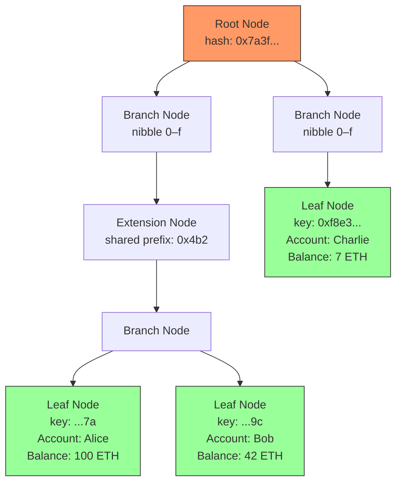
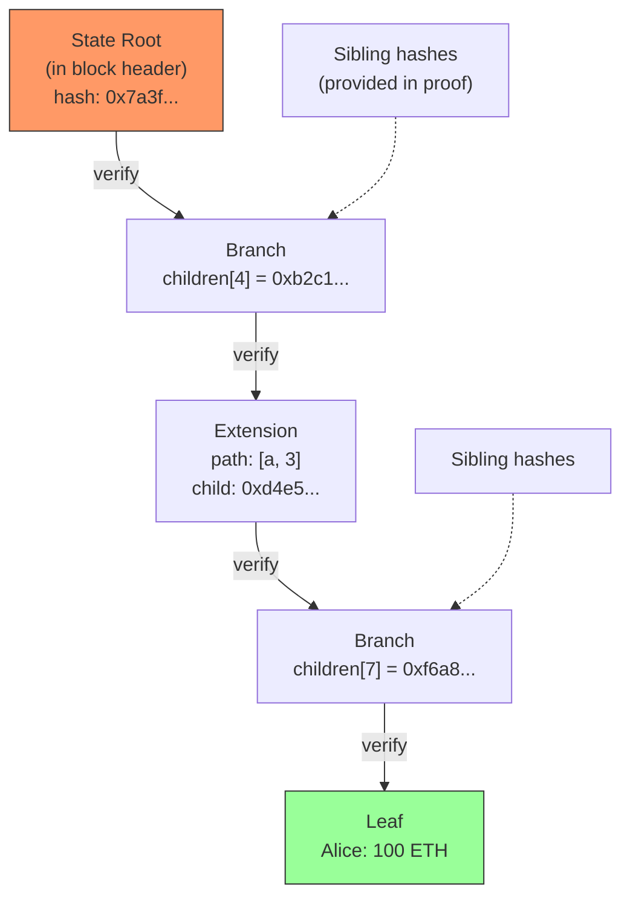
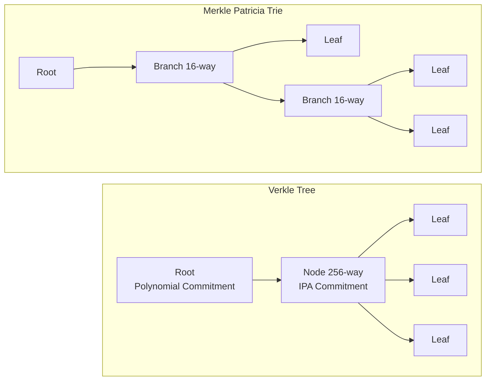
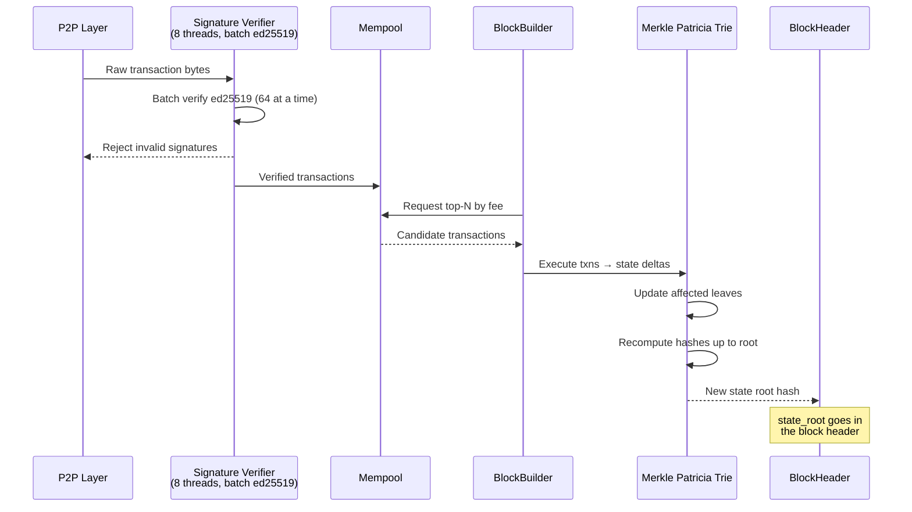

# 2. Cryptography and State Verification 🟡

> **The Problem:** A blockchain stores the balances and state of millions of accounts. But unlike a traditional database, we cannot trust the disk, the operator, or the network. Any validator must be able to prove to any other validator—using pure math—that the state at block height N is correct. If account `0xABCD` has 100 tokens, we need a cryptographic proof of that fact that is unforgeable and verifiable in O(log N) time. We also need to verify tens of thousands of transaction signatures per second without becoming a bottleneck.

---

## Why We Cannot Trust a Database

In a centralized system, the database is the source of truth. The operator has root access, but we trust them (or their employer). In a blockchain:

1. **Every validator stores its own copy** of the state — there is no shared database.
2. **Validators must agree on the state** — after executing block N, every honest validator must compute the same **state root hash**.
3. **Light clients need proofs** — a mobile wallet cannot store terabytes of state. It must be able to verify "does account X have balance Y?" by checking a small cryptographic proof against the state root published in the block header.

The data structure that solves all three requirements is the **Merkle Patricia Trie**.

---

## The Merkle Patricia Trie (MPT)

A Merkle Patricia Trie is a fusion of two ideas:

1. **Patricia Trie** (Practical Algorithm To Retrieve Information Coded In Alphanumeric) — A compressed radix tree that stores key-value pairs with shared prefixes.
2. **Merkle Tree** — Every node contains the hash of its children. The root hash is a fingerprint of the entire dataset.

| Property | Flat HashMap | Merkle Patricia Trie |
|---|---|---|
| Lookup | O(1) | O(key length) |
| Insert / Update | O(1) amortized | O(key length) |
| Cryptographic proof of inclusion | Impossible | O(log N) proof, O(log N) verification |
| State root (fingerprint) | Must hash everything | Incremental — only rehash the path |
| Storage overhead | ~1× | ~2–3× (internal nodes + hashes) |

### Trie Structure

Each key (account address) is decomposed into **nibbles** (4-bit chunks). A 20-byte Ethereum address has 40 nibbles, so the trie has at most 40 levels.



### Node Types

There are four node types in a Merkle Patricia Trie:

| Node Type | Description | Contains |
|---|---|---|
| **Empty** | Null / absent | Nothing |
| **Leaf** | Terminal node with remaining key suffix + value | `(path_suffix, value)` |
| **Extension** | Shared prefix bridge to a branch | `(shared_nibbles, child_hash)` |
| **Branch** | 16-way fork (one per nibble 0–f) + optional value | `[child_0, ..., child_f, value?]` |

---

## Implementing the Merkle Patricia Trie

### Core Types

```rust,ignore
use sha3::{Digest, Keccak256};

/// A 32-byte hash used as node identifiers and state roots.
type Hash = [u8; 32];

/// A nibble is a 4-bit value (0..=15).
type Nibble = u8;

/// Convert a byte slice to nibbles (two nibbles per byte).
fn bytes_to_nibbles(bytes: &[u8]) -> Vec<Nibble> {
    let mut nibbles = Vec::with_capacity(bytes.len() * 2);
    for &byte in bytes {
        nibbles.push(byte >> 4);
        nibbles.push(byte & 0x0F);
    }
    nibbles
}

/// An account's state — the value stored in leaf nodes.
#[derive(Clone, Debug, PartialEq)]
struct AccountState {
    nonce: u64,
    balance: u128,
    code_hash: Hash,     // Hash of smart contract code (empty for EOAs)
    storage_root: Hash,  // Root of the account's storage trie
}

impl AccountState {
    fn encode(&self) -> Vec<u8> {
        // RLP encoding in production; simplified here for clarity.
        let mut buf = Vec::with_capacity(80);
        buf.extend_from_slice(&self.nonce.to_le_bytes());
        buf.extend_from_slice(&self.balance.to_le_bytes());
        buf.extend_from_slice(&self.code_hash);
        buf.extend_from_slice(&self.storage_root);
        buf
    }
}

/// A node in the Merkle Patricia Trie.
#[derive(Clone, Debug)]
enum TrieNode {
    Empty,
    Leaf {
        /// Remaining nibbles of the key after traversing to this node.
        path: Vec<Nibble>,
        /// The account state stored at this leaf.
        value: AccountState,
    },
    Extension {
        /// Shared nibble prefix.
        path: Vec<Nibble>,
        /// Hash of the child node.
        child: Hash,
    },
    Branch {
        /// 16 children, one per nibble. None = empty slot.
        children: [Option<Hash>; 16],
        /// Optional value if a key terminates at this branch.
        value: Option<AccountState>,
    },
}
```

### Hashing Nodes

Every node is content-addressed: its identity is the Keccak-256 hash of its serialized form.

```rust,ignore
impl TrieNode {
    /// Serialize and hash this node to produce its content address.
    fn hash(&self) -> Hash {
        let encoded = self.encode();
        let mut hasher = Keccak256::new();
        hasher.update(&encoded);
        let result = hasher.finalize();
        let mut hash = [0u8; 32];
        hash.copy_from_slice(&result);
        hash
    }

    /// Encode the node to bytes (simplified RLP-like encoding).
    fn encode(&self) -> Vec<u8> {
        match self {
            TrieNode::Empty => vec![0x80], // RLP empty string

            TrieNode::Leaf { path, value } => {
                let mut buf = vec![0x01]; // type tag
                buf.push(path.len() as u8);
                buf.extend_from_slice(path);
                buf.extend_from_slice(&value.encode());
                buf
            }

            TrieNode::Extension { path, child } => {
                let mut buf = vec![0x02]; // type tag
                buf.push(path.len() as u8);
                buf.extend_from_slice(path);
                buf.extend_from_slice(child);
                buf
            }

            TrieNode::Branch { children, value } => {
                let mut buf = vec![0x03]; // type tag
                // Bitmap: which children are present
                let mut bitmap: u16 = 0;
                for (i, child) in children.iter().enumerate() {
                    if child.is_some() {
                        bitmap |= 1 << i;
                    }
                }
                buf.extend_from_slice(&bitmap.to_le_bytes());
                // Write present children
                for child in children.iter().flatten() {
                    buf.extend_from_slice(child);
                }
                // Optional value
                if let Some(v) = value {
                    buf.push(0x01);
                    buf.extend_from_slice(&v.encode());
                } else {
                    buf.push(0x00);
                }
                buf
            }
        }
    }
}
```

### The Trie CRUD Operations

```rust,ignore
use std::collections::HashMap;

/// The Merkle Patricia Trie.
///
/// Nodes are stored in a flat HashMap keyed by their hash.
/// This decouples the logical tree from physical storage —
/// in production, this map is backed by RocksDB (Chapter 5).
struct MerkleTrie {
    /// The root hash. Changes on every state mutation.
    root: Hash,
    /// All trie nodes, keyed by their content hash.
    nodes: HashMap<Hash, TrieNode>,
}

/// An inclusion proof: the sequence of nodes from root to the target leaf.
struct MerkleProof {
    /// The key (account address) being proved.
    key: Vec<u8>,
    /// The nodes along the path from root to the leaf (or absence proof).
    path: Vec<TrieNode>,
}

impl MerkleTrie {
    /// Create an empty trie.
    fn new() -> Self {
        let empty = TrieNode::Empty;
        let root = empty.hash();
        let mut nodes = HashMap::new();
        nodes.insert(root, empty);
        Self { root, nodes }
    }

    /// Get the current state root — this goes into the block header.
    fn root_hash(&self) -> Hash {
        self.root
    }

    /// Look up an account's state.
    fn get(&self, address: &[u8; 20]) -> Option<&AccountState> {
        let nibbles = bytes_to_nibbles(address);
        self.get_recursive(&self.root, &nibbles, 0)
    }

    fn get_recursive(
        &self,
        node_hash: &Hash,
        nibbles: &[Nibble],
        depth: usize,
    ) -> Option<&AccountState> {
        let node = self.nodes.get(node_hash)?;

        match node {
            TrieNode::Empty => None,

            TrieNode::Leaf { path, value } => {
                if &nibbles[depth..] == path.as_slice() {
                    Some(value)
                } else {
                    None
                }
            }

            TrieNode::Extension { path, child } => {
                let remaining = &nibbles[depth..];
                if remaining.starts_with(path) {
                    self.get_recursive(child, nibbles, depth + path.len())
                } else {
                    None
                }
            }

            TrieNode::Branch { children, value } => {
                if depth == nibbles.len() {
                    value.as_ref()
                } else {
                    let idx = nibbles[depth] as usize;
                    if let Some(child_hash) = &children[idx] {
                        self.get_recursive(child_hash, nibbles, depth + 1)
                    } else {
                        None
                    }
                }
            }
        }
    }

    /// Insert or update an account's state.
    /// Returns the new root hash.
    fn insert(&mut self, address: &[u8; 20], state: AccountState) -> Hash {
        let nibbles = bytes_to_nibbles(address);
        let new_root = self.insert_recursive(&self.root.clone(), &nibbles, 0, state);
        self.root = new_root;
        self.root
    }

    fn insert_recursive(
        &mut self,
        node_hash: &Hash,
        nibbles: &[Nibble],
        depth: usize,
        value: AccountState,
    ) -> Hash {
        let node = self.nodes.get(node_hash).cloned().unwrap_or(TrieNode::Empty);

        let new_node = match node {
            TrieNode::Empty => {
                // No node here yet — create a leaf with the remaining path.
                TrieNode::Leaf {
                    path: nibbles[depth..].to_vec(),
                    value,
                }
            }

            TrieNode::Leaf {
                path: existing_path,
                value: existing_value,
            } => {
                let remaining = &nibbles[depth..];

                // If the paths are identical, update the value.
                if remaining == existing_path.as_slice() {
                    TrieNode::Leaf {
                        path: existing_path,
                        value,
                    }
                } else {
                    // Find the common prefix length.
                    let common_len = existing_path
                        .iter()
                        .zip(remaining.iter())
                        .take_while(|(a, b)| a == b)
                        .count();

                    // Create a branch at the divergence point.
                    let mut children: [Option<Hash>; 16] = [None; 16];

                    // Existing leaf becomes a child.
                    let existing_leaf = TrieNode::Leaf {
                        path: existing_path[common_len + 1..].to_vec(),
                        value: existing_value,
                    };
                    let existing_hash = existing_leaf.hash();
                    self.nodes.insert(existing_hash, existing_leaf);
                    children[existing_path[common_len] as usize] = Some(existing_hash);

                    // New leaf becomes another child.
                    let new_leaf = TrieNode::Leaf {
                        path: remaining[common_len + 1..].to_vec(),
                        value,
                    };
                    let new_hash = new_leaf.hash();
                    self.nodes.insert(new_hash, new_leaf);
                    children[remaining[common_len] as usize] = Some(new_hash);

                    let branch = TrieNode::Branch {
                        children,
                        value: None,
                    };

                    if common_len > 0 {
                        // Wrap the branch in an extension for the shared prefix.
                        let branch_hash = branch.hash();
                        self.nodes.insert(branch_hash, branch);
                        TrieNode::Extension {
                            path: remaining[..common_len].to_vec(),
                            child: branch_hash,
                        }
                    } else {
                        branch
                    }
                }
            }

            TrieNode::Extension { path, child } => {
                let remaining = &nibbles[depth..];

                if remaining.starts_with(&path) {
                    // Key shares the full extension prefix — recurse into child.
                    let new_child =
                        self.insert_recursive(&child, nibbles, depth + path.len(), value);
                    TrieNode::Extension {
                        path,
                        child: new_child,
                    }
                } else {
                    // Partial match — split the extension.
                    let common_len = path
                        .iter()
                        .zip(remaining.iter())
                        .take_while(|(a, b)| a == b)
                        .count();

                    let mut children: [Option<Hash>; 16] = [None; 16];

                    // Existing extension remainder becomes a child.
                    if path.len() - common_len - 1 > 0 {
                        let ext = TrieNode::Extension {
                            path: path[common_len + 1..].to_vec(),
                            child,
                        };
                        let ext_hash = ext.hash();
                        self.nodes.insert(ext_hash, ext);
                        children[path[common_len] as usize] = Some(ext_hash);
                    } else {
                        children[path[common_len] as usize] = Some(child);
                    }

                    // New value becomes a leaf child.
                    let new_leaf = TrieNode::Leaf {
                        path: remaining[common_len + 1..].to_vec(),
                        value,
                    };
                    let new_hash = new_leaf.hash();
                    self.nodes.insert(new_hash, new_leaf);
                    children[remaining[common_len] as usize] = Some(new_hash);

                    let branch = TrieNode::Branch {
                        children,
                        value: None,
                    };

                    if common_len > 0 {
                        let branch_hash = branch.hash();
                        self.nodes.insert(branch_hash, branch);
                        TrieNode::Extension {
                            path: remaining[..common_len].to_vec(),
                            child: branch_hash,
                        }
                    } else {
                        branch
                    }
                }
            }

            TrieNode::Branch {
                mut children,
                value: branch_value,
            } => {
                if depth == nibbles.len() {
                    // Key terminates at this branch.
                    TrieNode::Branch {
                        children,
                        value: Some(value),
                    }
                } else {
                    let idx = nibbles[depth] as usize;
                    let child_hash = children[idx].unwrap_or_else(|| {
                        let empty = TrieNode::Empty;
                        let h = empty.hash();
                        self.nodes.insert(h, empty);
                        h
                    });
                    let new_child = self.insert_recursive(&child_hash, nibbles, depth + 1, value);
                    children[idx] = Some(new_child);
                    TrieNode::Branch {
                        children,
                        value: branch_value,
                    }
                }
            }
        };

        let new_hash = new_node.hash();
        self.nodes.insert(new_hash, new_node);
        new_hash
    }

    /// Generate a Merkle proof for an account.
    fn prove(&self, address: &[u8; 20]) -> MerkleProof {
        let nibbles = bytes_to_nibbles(address);
        let mut path = Vec::new();
        self.prove_recursive(&self.root, &nibbles, 0, &mut path);
        MerkleProof {
            key: address.to_vec(),
            path,
        }
    }

    fn prove_recursive(
        &self,
        node_hash: &Hash,
        nibbles: &[Nibble],
        depth: usize,
        path: &mut Vec<TrieNode>,
    ) {
        let Some(node) = self.nodes.get(node_hash) else {
            return;
        };

        path.push(node.clone());

        match node {
            TrieNode::Empty | TrieNode::Leaf { .. } => {}

            TrieNode::Extension {
                path: ext_path,
                child,
            } => {
                let remaining = &nibbles[depth..];
                if remaining.starts_with(ext_path) {
                    self.prove_recursive(child, nibbles, depth + ext_path.len(), path);
                }
            }

            TrieNode::Branch { children, .. } => {
                if depth < nibbles.len() {
                    let idx = nibbles[depth] as usize;
                    if let Some(child_hash) = &children[idx] {
                        self.prove_recursive(child_hash, nibbles, depth + 1, path);
                    }
                }
            }
        }
    }
}
```

---

## Merkle Proofs: Trust Without Full State

A **Merkle proof** lets a light client verify an account's balance without downloading the entire trie. The proof contains only the O(log N) nodes from root to leaf.



### Proof Verification

The verifier only needs: (1) the state root from the block header, (2) the proof nodes, and (3) the claimed key-value pair.

```rust,ignore
/// Verify a Merkle proof against a known state root.
///
/// Returns `Some(AccountState)` if the proof is valid and the account exists,
/// `None` if the proof is valid but the account does not exist.
/// Returns `Err` if the proof is structurally invalid.
fn verify_proof(
    root: &Hash,
    proof: &MerkleProof,
    address: &[u8; 20],
) -> Result<Option<AccountState>, &'static str> {
    if proof.path.is_empty() {
        return Err("empty proof");
    }

    // The first node in the proof must hash to the state root.
    let first_hash = proof.path[0].hash();
    if &first_hash != root {
        return Err("proof root does not match state root");
    }

    // Walk the proof path, verifying each node links to the next.
    let nibbles = bytes_to_nibbles(address);
    let mut depth = 0;

    for (i, node) in proof.path.iter().enumerate() {
        match node {
            TrieNode::Leaf { path, value } => {
                if nibbles[depth..] == path[..] {
                    return Ok(Some(value.clone()));
                } else {
                    return Ok(None); // Key not in trie
                }
            }

            TrieNode::Extension { path, child } => {
                if !nibbles[depth..].starts_with(path) {
                    return Ok(None);
                }
                // Verify the child hash matches the next proof node.
                if let Some(next_node) = proof.path.get(i + 1) {
                    if &next_node.hash() != child {
                        return Err("extension child hash mismatch");
                    }
                }
                depth += path.len();
            }

            TrieNode::Branch { children, value } => {
                if depth == nibbles.len() {
                    return Ok(value.clone());
                }
                let idx = nibbles[depth] as usize;
                match &children[idx] {
                    Some(child_hash) => {
                        if let Some(next_node) = proof.path.get(i + 1) {
                            if &next_node.hash() != child_hash {
                                return Err("branch child hash mismatch");
                            }
                        }
                        depth += 1;
                    }
                    None => return Ok(None),
                }
            }

            TrieNode::Empty => return Ok(None),
        }
    }

    Err("proof path exhausted before reaching leaf")
}
```

---

## Verkle Trees: The Next Generation

Merkle Patricia Tries have a significant drawback: **proof sizes are large**. Each branch node has 16 children, and the proof must include sibling hashes at every level. For Ethereum's ~200M accounts, a proof is ~1–3 KB.

**Verkle Trees** replace hash-based commitments with **polynomial commitments** (e.g., KZG/IPA), allowing:

| Property | Merkle Patricia Trie | Verkle Tree |
|---|---|---|
| Branching factor | 16 | 256 |
| Proof size (200M accounts) | ~1–3 KB | ~150–200 bytes |
| Proof verification cost | O(depth × hash) | O(depth × pairing) |
| Construction | Keccak-256 hashes | Elliptic curve operations |
| Quantum resistance | ✅ (hash-based) | ❌ (elliptic curves) |
| Implementation complexity | Moderate | High |



Verkle trees are part of Ethereum's roadmap ("The Verge") but are not yet deployed in production. For our validator, we implement the battle-tested MPT and keep the interface abstract enough to swap in Verkle trees later.

---

## Signature Verification: The CPU Bottleneck

Every transaction must be signature-verified before entering the mempool. At 10,000 TPS, that's 10,000 `ed25519` verifications per second—and that's just the incoming stream. During block verification, a validator must verify the entire block's worth of signatures.

### Why ed25519?

| Scheme | Sign (μs) | Verify (μs) | Signature Size | Public Key Size |
|---|---|---|---|---|
| ECDSA (secp256k1) | ~50 | ~200 | 64 bytes | 33 bytes |
| **ed25519** | ~25 | ~70 | 64 bytes | 32 bytes |
| BLS12-381 | ~500 | ~1500 | 48 bytes | 96 bytes |
| Schnorr (secp256k1) | ~50 | ~200 | 64 bytes | 33 bytes |

Ed25519 is **3× faster** than secp256k1 for verification and has a constant-time implementation that resists timing side-channels. Solana, Aptos, Sui, and many modern chains use it.

### Single Signature Verification

```rust,ignore
use ed25519_dalek::{Signature, Verifier, VerifyingKey};

/// Verify a single transaction signature.
fn verify_transaction_signature(
    sender_pubkey: &[u8; 32],
    message: &[u8],        // The serialized transaction (excluding signature)
    signature: &[u8; 64],
) -> Result<(), SignatureError> {
    let verifying_key = VerifyingKey::from_bytes(sender_pubkey)
        .map_err(|_| SignatureError::InvalidPublicKey)?;
    let sig = Signature::from_bytes(signature);
    verifying_key
        .verify(message, &sig)
        .map_err(|_| SignatureError::InvalidSignature)
}

#[derive(Debug)]
enum SignatureError {
    InvalidPublicKey,
    InvalidSignature,
}
```

### Batch Verification: 2× Throughput

Ed25519 supports **batch verification**, where verifying N signatures together is ~2× faster than verifying them individually. This exploits the algebraic structure of the Edwards curve to amortize expensive multi-scalar multiplication.

```rust,ignore
use ed25519_dalek::{verify_batch, VerifyingKey, Signature};
use rand::rngs::OsRng;

/// Batch-verify a block's worth of transaction signatures.
///
/// Returns Ok(()) if ALL signatures are valid.
/// Returns Err with the index of the first invalid signature if any fail.
fn verify_block_signatures(
    transactions: &[(
        [u8; 32],  // sender public key
        Vec<u8>,   // message bytes
        [u8; 64],  // signature
    )],
) -> Result<(), (usize, SignatureError)> {
    // Prepare batch verification inputs.
    let mut verifying_keys = Vec::with_capacity(transactions.len());
    let mut signatures = Vec::with_capacity(transactions.len());
    let mut messages: Vec<&[u8]> = Vec::with_capacity(transactions.len());

    for (i, (pubkey, msg, sig)) in transactions.iter().enumerate() {
        let vk = VerifyingKey::from_bytes(pubkey)
            .map_err(|_| (i, SignatureError::InvalidPublicKey))?;
        verifying_keys.push(vk);
        signatures.push(Signature::from_bytes(sig));
        messages.push(msg.as_slice());
    }

    // Batch verification: ~2× faster than individual verification.
    // Uses random linear combination to check all signatures at once.
    verify_batch(&messages, &signatures, &verifying_keys)
        .map_err(|_| (0, SignatureError::InvalidSignature))?;

    Ok(())
}
```

### Parallel Signature Verification Pipeline

For a validator processing 10,000+ TPS, even batch verification on a single core is insufficient. We shard the work across CPU cores:

```rust,ignore
use std::sync::Arc;
use tokio::sync::mpsc;

/// Pipeline that distributes signature verification across multiple threads.
struct SigVerifyPipeline {
    /// Number of worker threads.
    workers: usize,
    /// Channel to send transactions for verification.
    tx: mpsc::Sender<SigVerifyJob>,
}

struct SigVerifyJob {
    transactions: Vec<(
        [u8; 32],  // public key
        Vec<u8>,   // message
        [u8; 64],  // signature
    )>,
    /// Channel to send the result back.
    result_tx: tokio::sync::oneshot::Sender<Result<(), Vec<usize>>>,
}

impl SigVerifyPipeline {
    fn new(workers: usize) -> Self {
        let (tx, rx) = mpsc::channel::<SigVerifyJob>(256);
        let rx = Arc::new(tokio::sync::Mutex::new(rx));

        for _ in 0..workers {
            let rx = Arc::clone(&rx);
            // Spawn OS threads (not Tokio tasks) for CPU-intensive work.
            std::thread::spawn(move || {
                let rt = tokio::runtime::Handle::current();
                rt.block_on(async {
                    loop {
                        let job = {
                            let mut guard = rx.lock().await;
                            guard.recv().await
                        };
                        let Some(job) = job else { break };

                        // Split into batches of 64 for optimal batch verification.
                        let result = verify_in_batches(&job.transactions, 64);
                        let _ = job.result_tx.send(result);
                    }
                });
            });
        }

        Self { workers, tx }
    }
}

/// Verify signatures in batches, collecting indices of invalid ones.
fn verify_in_batches(
    txns: &[(
        [u8; 32],
        Vec<u8>,
        [u8; 64],
    )],
    batch_size: usize,
) -> Result<(), Vec<usize>> {
    let mut invalid_indices = Vec::new();

    for (chunk_idx, chunk) in txns.chunks(batch_size).enumerate() {
        if verify_block_signatures(chunk).is_err() {
            // Batch failed — fall back to individual verification to find the bad ones.
            for (i, (pk, msg, sig)) in chunk.iter().enumerate() {
                if verify_transaction_signature(pk, msg, sig).is_err() {
                    invalid_indices.push(chunk_idx * batch_size + i);
                }
            }
        }
    }

    if invalid_indices.is_empty() {
        Ok(())
    } else {
        Err(invalid_indices)
    }
}
```

### Verification Throughput Numbers

| Strategy | Core Count | Throughput (verifications/sec) |
|---|---|---|
| Individual verification | 1 | ~14,000 |
| Batch verification (64-batch) | 1 | ~28,000 |
| Parallel batch (64-batch) | 8 | ~200,000 |
| Parallel batch (64-batch) | 16 | ~380,000 |

With 8 cores dedicated to signature verification, we can handle 200K verifications/sec — 20× our 10K TPS target, leaving headroom for block re-verification during sync.

---

## Putting It Together: The Cryptographic Data Path



---

> **Key Takeaways**
>
> 1. **The Merkle Patricia Trie replaces trust with math.** Every account balance is cryptographically committed under the state root hash in the block header. Any tampering is immediately detectable.
> 2. **Merkle proofs enable light clients.** A mobile wallet can verify "Alice has 100 tokens" by checking a ~1 KB proof against the 32-byte state root — no need to download the entire state.
> 3. **Incremental hashing is critical.** When one account balance changes, we only rehash the O(depth) nodes from leaf to root — not the entire trie of millions of accounts.
> 4. **Ed25519 batch verification doubles throughput.** By exploiting the algebraic structure of Edwards curves, we verify 64 signatures in roughly the time of 32 individual verifications.
> 5. **Parallelize the CPU bottleneck.** Signature verification is embarrassingly parallel. Shard across all available cores to exceed 200K verifications/sec on commodity hardware.
> 6. **Verkle trees are the future** but the present is MPT. Design your state interface (`get`, `insert`, `prove`, `verify`) as a trait so you can swap the backing tree without rewriting the validator.
