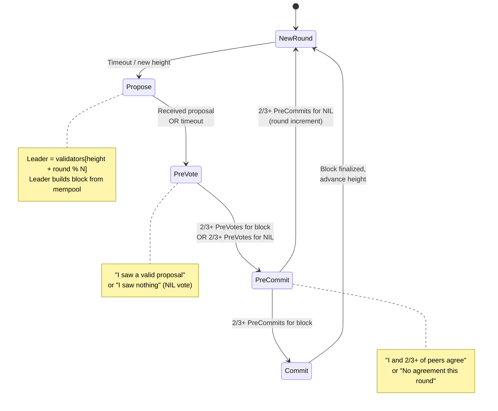
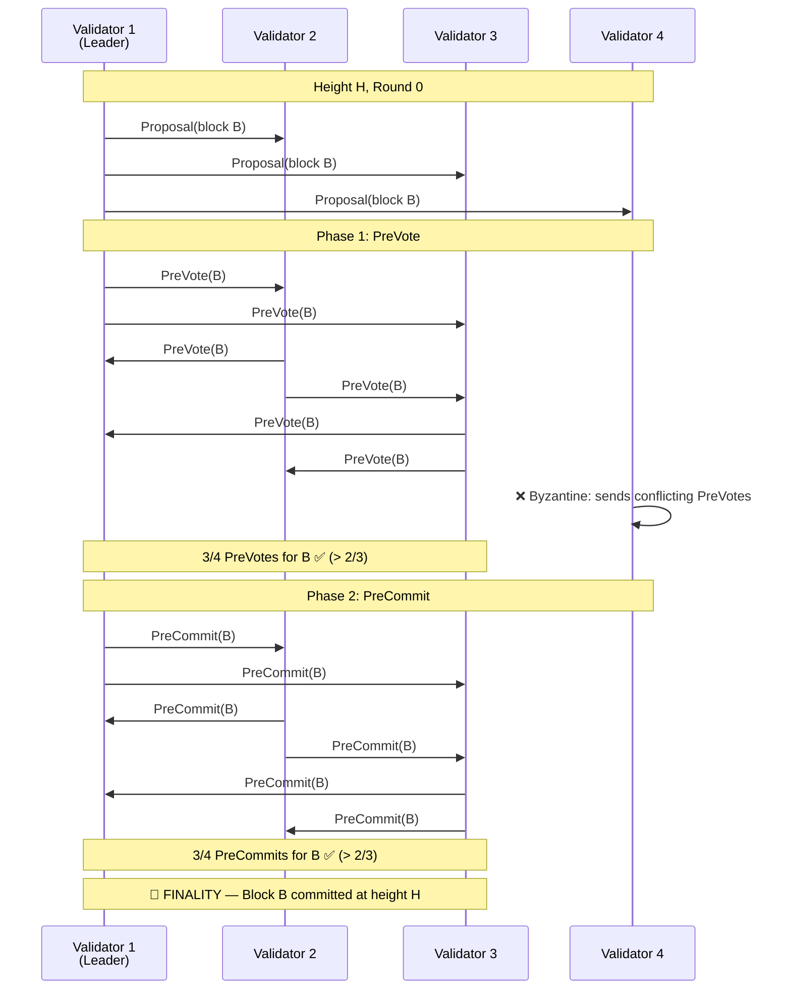
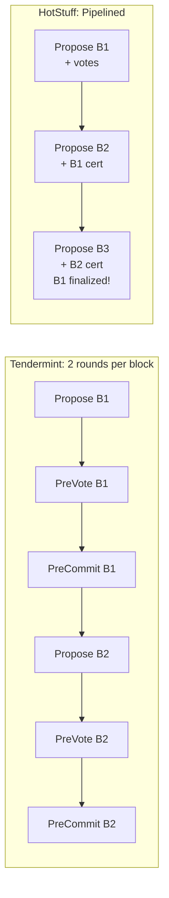

# 3. The Consensus Engine (BFT) 🔴

> **The Problem:** We have a P2P network flooding transactions (Chapter 1) and a Merkle Trie storing state (Chapter 2). But which transactions go into the next block, and in what order? If Validator A proposes block `[tx1, tx2, tx3]` and Validator B proposes `[tx2, tx4, tx1]`, the resulting state roots will differ. Worse, Validator C might be **malicious** — proposing a block that steals funds. We need a protocol where honest validators agree on a single block even when up to ⅓ of validators are actively lying, equivocating, or offline. This is the Byzantine Fault Tolerance (BFT) problem.

---

## The Byzantine Generals Problem

The classic problem: an army of generals surrounds a city. They communicate by messenger. Some generals are **traitors** who send conflicting messages. The loyal generals must agree on a plan (attack or retreat) despite the traitors.

In blockchain terms:

| Military Analogy | Blockchain Equivalent |
|---|---|
| General | Validator node |
| Messenger | P2P gossip message |
| Traitor | Malicious validator (Byzantine) |
| "Attack" | Commit block X at height H |
| "Retreat" | Commit a different block at height H |
| Agreement | All honest validators finalize the same block |

**The fundamental result** (Lamport, Shostak, Pease, 1982): BFT consensus is possible if and only if fewer than ⅓ of participants are Byzantine. With N validators, we tolerate up to f = ⌊(N-1)/3⌋ Byzantine faults.

| Total Validators (N) | Max Byzantine (f) | Required Honest | Quorum (2f+1) |
|---|---|---|---|
| 4 | 1 | 3 | 3 |
| 7 | 2 | 5 | 5 |
| 10 | 3 | 7 | 7 |
| 100 | 33 | 67 | 67 |

---

## Tendermint BFT: The Protocol

We implement a consensus protocol modeled on **Tendermint/CometBFT**, used by Cosmos, Celestia, and many other chains. It is a **leader-based, two-phase commit** protocol with three rounds:

1. **Propose** — The leader proposes a block.
2. **Pre-Vote** — Validators vote on whether they received a valid proposal.
3. **Pre-Commit** — Validators commit if they saw 2/3+ pre-votes.



### Why Two Phases?

A single voting round is insufficient because a Byzantine leader can **equivocate** — send different proposals to different validators. The two-phase structure ensures:

1. **Pre-Vote** locks in the fact that 2/3+ validators received the *same* proposal.
2. **Pre-Commit** locks in the fact that 2/3+ validators saw 2/3+ pre-votes for that same proposal.

Only after pre-commit do we have **finality** — the block can never be reverted (unlike Bitcoin's probabilistic finality where deep reorganizations are theoretically possible).

---

## Protocol Messages

```rust,ignore
use serde::{Deserialize, Serialize};

/// The height of the blockchain (block number).
type Height = u64;
/// The round within a height (increments on timeout).
type Round = u32;
/// A validator's unique identifier.
type ValidatorId = [u8; 32];
/// A cryptographic signature.
type Sig = [u8; 64];

/// A block proposed by a leader.
#[derive(Clone, Debug, Serialize, Deserialize)]
struct Block {
    height: Height,
    round: Round,
    /// Hash of the previous block — chain linkage.
    parent_hash: [u8; 32],
    /// The proposer's validator ID.
    proposer: ValidatorId,
    /// Ordered list of transaction hashes included in this block.
    transactions: Vec<[u8; 32]>,
    /// State root after executing all transactions.
    state_root: [u8; 32],
    /// Timestamp (Unix millis).
    timestamp: i64,
}

impl Block {
    fn hash(&self) -> [u8; 32] {
        use sha3::{Digest, Keccak256};
        let encoded = bincode::serialize(self).expect("block serialization");
        let result = Keccak256::digest(&encoded);
        let mut hash = [0u8; 32];
        hash.copy_from_slice(&result);
        hash
    }
}

/// A value that a validator votes on.
#[derive(Clone, Debug, PartialEq, Eq, Hash, Serialize, Deserialize)]
enum VoteValue {
    /// Vote for a specific block hash.
    Block([u8; 32]),
    /// Vote for "nothing" — no valid proposal received.
    Nil,
}

/// A consensus message.
#[derive(Clone, Debug, Serialize, Deserialize)]
enum ConsensusMessage {
    /// Proposal: sent by the round leader.
    Proposal {
        height: Height,
        round: Round,
        block: Block,
        /// Proof-of-lock round (-1 if none).
        valid_round: Option<Round>,
        signature: Sig,
    },

    /// PreVote: "I received a valid proposal" or "I received nothing."
    PreVote {
        height: Height,
        round: Round,
        value: VoteValue,
        voter: ValidatorId,
        signature: Sig,
    },

    /// PreCommit: "2/3+ peers agree on a proposal" or "No agreement."
    PreCommit {
        height: Height,
        round: Round,
        value: VoteValue,
        voter: ValidatorId,
        signature: Sig,
    },
}
```

---

## The Validator Set and Leader Selection

Validators take turns proposing blocks. The leader for a given `(height, round)` is deterministic:

```rust,ignore
/// The set of validators participating in consensus.
struct ValidatorSet {
    /// Validators sorted by ID for deterministic leader rotation.
    validators: Vec<ValidatorInfo>,
    /// Total voting power (sum of all stakes).
    total_power: u64,
}

struct ValidatorInfo {
    id: ValidatorId,
    /// Stake-weighted voting power.
    power: u64,
    /// Public key for signature verification.
    public_key: [u8; 32],
}

impl ValidatorSet {
    /// Deterministic leader selection — round-robin weighted by stake.
    ///
    /// Uses Tendermint's proposer selection algorithm:
    /// each validator's priority increases by their voting power each round,
    /// and the validator with the highest priority proposes.
    fn leader(&self, height: Height, round: Round) -> &ValidatorInfo {
        // Simplified: pure round-robin for clarity.
        // Production uses weighted round-robin with priority accumulation.
        let index = ((height + round as u64) % self.validators.len() as u64) as usize;
        &self.validators[index]
    }

    /// Check if a set of voters constitutes a 2/3+ quorum.
    fn has_quorum(&self, voters: &[ValidatorId]) -> bool {
        let voting_power: u64 = voters
            .iter()
            .filter_map(|id| {
                self.validators.iter().find(|v| &v.id == id).map(|v| v.power)
            })
            .sum();

        // Strict: > 2/3 of total power (not ≥).
        voting_power * 3 > self.total_power * 2
    }
}
```

---

## The Consensus State Machine

```rust,ignore
use std::collections::{HashMap, HashSet};
use tokio::sync::mpsc;
use tokio::time::{self, Duration};

/// Timeouts for each consensus phase.
struct TimeoutConfig {
    propose: Duration,
    prevote: Duration,
    precommit: Duration,
}

impl Default for TimeoutConfig {
    fn default() -> Self {
        Self {
            propose: Duration::from_secs(3),
            prevote: Duration::from_secs(1),
            precommit: Duration::from_secs(1),
        }
    }
}

/// The current step within a round.
#[derive(Clone, Copy, Debug, PartialEq, Eq)]
enum Step {
    Propose,
    PreVote,
    PreCommit,
}

/// Vote tracking for a specific (height, round).
struct VoteSet {
    prevotes: HashMap<ValidatorId, VoteValue>,
    precommits: HashMap<ValidatorId, VoteValue>,
}

impl VoteSet {
    fn new() -> Self {
        Self {
            prevotes: HashMap::new(),
            precommits: HashMap::new(),
        }
    }

    /// Count votes for a specific value.
    fn prevote_count(&self, value: &VoteValue) -> Vec<ValidatorId> {
        self.prevotes
            .iter()
            .filter(|(_, v)| *v == value)
            .map(|(id, _)| *id)
            .collect()
    }

    fn precommit_count(&self, value: &VoteValue) -> Vec<ValidatorId> {
        self.precommits
            .iter()
            .filter(|(_, v)| *v == value)
            .map(|(id, _)| *id)
            .collect()
    }
}

/// The core consensus engine.
struct ConsensusEngine {
    /// This validator's ID and signing key.
    id: ValidatorId,

    /// Current blockchain height.
    height: Height,
    /// Current round within the height.
    round: Round,
    /// Current step within the round.
    step: Step,

    /// The validator set for the current epoch.
    validator_set: ValidatorSet,

    /// Vote tracking per round.
    votes: HashMap<Round, VoteSet>,

    /// The proposal we accepted (if any) for the current round.
    accepted_proposal: Option<Block>,

    /// Lock: if we pre-committed a value, we are "locked" on it.
    /// We must pre-vote for this value in future rounds (or NIL).
    locked_value: Option<[u8; 32]>,
    locked_round: Option<Round>,

    /// The last finalized block hash.
    last_committed_hash: [u8; 32],

    /// Timeout configuration.
    timeouts: TimeoutConfig,

    /// Channel to broadcast consensus messages to the P2P layer.
    outbound_tx: mpsc::Sender<ConsensusMessage>,

    /// Channel to send finalized blocks to the execution engine.
    commit_tx: mpsc::Sender<Block>,
}
```

### The Core Algorithm

```rust,ignore
impl ConsensusEngine {
    /// Start a new round of consensus.
    async fn start_round(&mut self, round: Round) {
        self.round = round;
        self.step = Step::Propose;
        self.accepted_proposal = None;
        self.votes.entry(round).or_insert_with(VoteSet::new);

        let leader = self.validator_set.leader(self.height, round);

        if leader.id == self.id {
            // We are the leader — propose a block.
            self.propose_block().await;
        }

        // Start the propose timeout.
        // If we don't receive a proposal in time, we pre-vote NIL.
    }

    /// Leader: build and broadcast a block proposal.
    async fn propose_block(&mut self) {
        // In production, the block builder (Ch 4) provides the block.
        let block = Block {
            height: self.height,
            round: self.round,
            parent_hash: self.last_committed_hash,
            proposer: self.id,
            transactions: Vec::new(), // Filled by block builder
            state_root: [0u8; 32],    // Filled after execution
            timestamp: chrono::Utc::now().timestamp_millis(),
        };

        let msg = ConsensusMessage::Proposal {
            height: self.height,
            round: self.round,
            block: block.clone(),
            valid_round: self.locked_round,
            signature: [0u8; 64], // Sign with ed25519 in production
        };

        let _ = self.outbound_tx.send(msg).await;
        self.accepted_proposal = Some(block);
    }

    /// Handle an incoming proposal.
    async fn on_proposal(&mut self, block: Block, valid_round: Option<Round>) {
        // Verify the proposer is the correct leader for this (height, round).
        let leader = self.validator_set.leader(self.height, self.round);
        if block.proposer != leader.id {
            return; // Wrong leader — ignore.
        }

        // Verify the block is structurally valid.
        if block.height != self.height || block.round != self.round {
            return;
        }

        // Verify parent hash chain.
        if block.parent_hash != self.last_committed_hash {
            return;
        }

        let block_hash = block.hash();

        // Apply the locking rule:
        // If we are locked on a value from a previous round, we can only
        // pre-vote for that value (or NIL if the proposal is different).
        let vote_value = if let Some(locked_hash) = self.locked_value {
            if locked_hash == block_hash {
                VoteValue::Block(block_hash)
            } else if valid_round.is_some()
                && valid_round >= self.locked_round
            {
                // The proposer has a proof-of-lock from a later round — unlock.
                VoteValue::Block(block_hash)
            } else {
                VoteValue::Nil
            }
        } else {
            VoteValue::Block(block_hash)
        };

        self.accepted_proposal = Some(block);
        self.step = Step::PreVote;

        // Broadcast our pre-vote.
        let msg = ConsensusMessage::PreVote {
            height: self.height,
            round: self.round,
            value: vote_value,
            voter: self.id,
            signature: [0u8; 64],
        };
        let _ = self.outbound_tx.send(msg).await;
    }

    /// Handle an incoming pre-vote.
    async fn on_prevote(&mut self, voter: ValidatorId, value: VoteValue) {
        let votes = self.votes.entry(self.round).or_insert_with(VoteSet::new);
        votes.prevotes.insert(voter, value.clone());

        // Check if we have 2/3+ pre-votes for a block.
        if let VoteValue::Block(hash) = &value {
            let vote_value = VoteValue::Block(*hash);
            let voters = votes.prevote_count(&vote_value);
            if self.validator_set.has_quorum(&voters) && self.step == Step::PreVote {
                // 2/3+ pre-votes for this block — move to pre-commit.
                self.step = Step::PreCommit;

                // Lock on this value.
                self.locked_value = Some(*hash);
                self.locked_round = Some(self.round);

                let msg = ConsensusMessage::PreCommit {
                    height: self.height,
                    round: self.round,
                    value: vote_value,
                    voter: self.id,
                    signature: [0u8; 64],
                };
                let _ = self.outbound_tx.send(msg).await;
            }
        }

        // Check if we have 2/3+ pre-votes for NIL.
        let nil_voters = votes.prevote_count(&VoteValue::Nil);
        if self.validator_set.has_quorum(&nil_voters) && self.step == Step::PreVote {
            self.step = Step::PreCommit;
            let msg = ConsensusMessage::PreCommit {
                height: self.height,
                round: self.round,
                value: VoteValue::Nil,
                voter: self.id,
                signature: [0u8; 64],
            };
            let _ = self.outbound_tx.send(msg).await;
        }
    }

    /// Handle an incoming pre-commit.
    async fn on_precommit(&mut self, voter: ValidatorId, value: VoteValue) {
        let votes = self.votes.entry(self.round).or_insert_with(VoteSet::new);
        votes.precommits.insert(voter, value.clone());

        // Check for 2/3+ pre-commits for a block — FINALITY!
        if let VoteValue::Block(hash) = &value {
            let vote_value = VoteValue::Block(*hash);
            let voters = votes.precommit_count(&vote_value);
            if self.validator_set.has_quorum(&voters) {
                self.commit_block(*hash).await;
            }
        }

        // Check for 2/3+ pre-commits for NIL — move to next round.
        let nil_voters = votes.precommit_count(&VoteValue::Nil);
        if self.validator_set.has_quorum(&nil_voters) {
            // No agreement this round — increment round and try again.
            self.start_round(self.round + 1).await;
        }
    }

    /// Finalize a block — this is irreversible.
    async fn commit_block(&mut self, block_hash: [u8; 32]) {
        let block = self
            .accepted_proposal
            .take()
            .expect("committed block must have been proposed");

        assert_eq!(block.hash(), block_hash, "block hash mismatch at commit");

        // Send the finalized block to the execution engine (Chapter 4).
        let _ = self.commit_tx.send(block.clone()).await;

        // Update state for the next height.
        self.last_committed_hash = block_hash;
        self.height += 1;
        self.round = 0;
        self.locked_value = None;
        self.locked_round = None;
        self.votes.clear();
        self.accepted_proposal = None;

        // Start consensus for the next block.
        self.start_round(0).await;
    }
}
```

---

## Visualizing a Successful Round



---

## Handling Byzantine Behavior

### Equivocation Detection

A Byzantine validator may send **different votes to different peers**. This is called **equivocation** and is a slashable offense:

```rust,ignore
/// Evidence of equivocation: a validator sent two different votes
/// for the same (height, round, step).
#[derive(Debug, Clone)]
struct EquivocationEvidence {
    height: Height,
    round: Round,
    voter: ValidatorId,
    vote_a: VoteValue,
    signature_a: Sig,
    vote_b: VoteValue,
    signature_b: Sig,
}

/// Detect equivocation in the vote set.
fn detect_equivocation(
    height: Height,
    round: Round,
    voter: ValidatorId,
    new_value: &VoteValue,
    existing_value: &VoteValue,
    new_sig: &Sig,
    existing_sig: &Sig,
) -> Option<EquivocationEvidence> {
    if new_value != existing_value {
        Some(EquivocationEvidence {
            height,
            round,
            voter,
            vote_a: existing_value.clone(),
            signature_a: *existing_sig,
            vote_b: new_value.clone(),
            signature_b: *new_sig,
        })
    } else {
        None
    }
}
```

### Timeout-Driven Round Advancement

If the leader is Byzantine and doesn't propose, or if the network is partitioned, honest validators must eventually give up and move to the next round:

```rust,ignore
impl ConsensusEngine {
    /// The main event loop with timeout handling.
    async fn run(&mut self, mut inbound: mpsc::Receiver<ConsensusMessage>) {
        self.start_round(0).await;

        loop {
            let timeout_duration = match self.step {
                Step::Propose => self.timeouts.propose,
                Step::PreVote => self.timeouts.prevote,
                Step::PreCommit => self.timeouts.precommit,
            };

            tokio::select! {
                Some(msg) = inbound.recv() => {
                    self.handle_message(msg).await;
                }
                _ = time::sleep(timeout_duration) => {
                    self.on_timeout().await;
                }
            }
        }
    }

    async fn handle_message(&mut self, msg: ConsensusMessage) {
        match msg {
            ConsensusMessage::Proposal {
                height,
                round,
                block,
                valid_round,
                ..
            } => {
                if height == self.height && round == self.round {
                    self.on_proposal(block, valid_round).await;
                }
            }
            ConsensusMessage::PreVote {
                height,
                round,
                value,
                voter,
                ..
            } => {
                if height == self.height && round == self.round {
                    self.on_prevote(voter, value).await;
                }
            }
            ConsensusMessage::PreCommit {
                height,
                round,
                value,
                voter,
                ..
            } => {
                if height == self.height && round == self.round {
                    self.on_precommit(voter, value).await;
                }
            }
        }
    }

    async fn on_timeout(&mut self) {
        match self.step {
            Step::Propose => {
                // Leader failed to propose — pre-vote NIL.
                self.step = Step::PreVote;
                let msg = ConsensusMessage::PreVote {
                    height: self.height,
                    round: self.round,
                    value: VoteValue::Nil,
                    voter: self.id,
                    signature: [0u8; 64],
                };
                let _ = self.outbound_tx.send(msg).await;
            }
            Step::PreVote => {
                // Insufficient pre-votes — pre-commit NIL.
                self.step = Step::PreCommit;
                let msg = ConsensusMessage::PreCommit {
                    height: self.height,
                    round: self.round,
                    value: VoteValue::Nil,
                    voter: self.id,
                    signature: [0u8; 64],
                };
                let _ = self.outbound_tx.send(msg).await;
            }
            Step::PreCommit => {
                // Round failed — advance to next round.
                // Exponential backoff on timeouts to avoid thundering herd.
                self.start_round(self.round + 1).await;
            }
        }
    }
}
```

---

## Safety and Liveness Guarantees

### Safety: No Two Honest Validators Commit Different Blocks

**Proof sketch:**

1. For block B to be committed, 2/3+ validators must Pre-Commit B.
2. For a validator to Pre-Commit B, it must have seen 2/3+ Pre-Votes for B.
3. The Pre-Vote quorum (2/3+) and any other Pre-Vote quorum must overlap by at least 1 honest validator (since 2/3 + 2/3 > 1).
4. That honest validator only Pre-Votes for one value → contradiction if two different blocks receive Pre-Commit quorums.

### Liveness: Eventually a Block is Committed

**Assumptions:**
- The network is **partially synchronous**: there exists a Global Stabilization Time (GST) after which messages are delivered within a bounded delay Δ.
- After GST, timeouts are long enough that the leader's proposal reaches all honest validators before the timeout expires.

**Mechanism:**
- If a round fails (timeout), validators increment the round and try a new leader.
- With N validators and f Byzantine, there are at least N - f honest validators.
- In the worst case, we cycle through f+1 rounds before hitting an honest leader.

### Finality Comparison

| Protocol | Finality Type | Time to Finality | Can Revert? |
|---|---|---|---|
| Bitcoin (Nakamoto) | Probabilistic | ~60 minutes (6 blocks) | Yes (51% attack) |
| Ethereum (Gasper) | Justification + Finality | ~15 minutes (2 epochs) | Requires ⅓ slashing |
| **Tendermint BFT** | **Instant** | **~1–3 seconds** | **Never (unless ⅓+ Byzantine)** |
| HotStuff (used in Aptos) | Instant (pipelined) | ~0.4 seconds | Never (unless ⅓+ Byzantine) |

---

## Optimizations: Pipelining and Aggregation

### Aggregate Signatures (BLS)

In production, collecting 100+ individual ed25519 signatures per round creates significant bandwidth overhead. **BLS aggregate signatures** compress N signatures into one:

```rust,ignore
/// In production, we use BLS signature aggregation.
/// N individual signatures → 1 aggregate signature (48 bytes).
///
/// This reduces per-round bandwidth from:
///   N validators × 64 bytes/sig = 6,400 bytes (100 validators)
/// To:
///   1 aggregate signature = 48 bytes
///
/// Trade-off: BLS verification is ~20× slower than ed25519,
/// but we only verify ONE aggregate vs. N individuals.
struct AggregateSignature {
    /// The aggregated BLS signature.
    signature: [u8; 48],
    /// Bitfield of which validators contributed.
    signers: Vec<bool>,
}
```

### Pipelined BFT (HotStuff-style)

Tendermint BFT requires two full round-trips per block. HotStuff (used by Aptos/Diem) **pipelines** consensus phases:



In HotStuff, the leader for block N+1 piggybacks the quorum certificate for block N onto its proposal. This means we produce one block per round-trip instead of one block per two round-trips.

---

## Testing Consensus with Fault Injection

### Simulating a Byzantine Leader

```rust,ignore
#[cfg(test)]
mod tests {
    use super::*;

    /// Test: Byzantine leader equivocates (sends different proposals to different peers).
    /// Expected: Honest validators detect the equivocation and reach consensus on NIL,
    /// advancing to the next round with a new leader.
    #[tokio::test]
    async fn test_byzantine_leader_equivocation() {
        // Setup: 4 validators, V1 is Byzantine leader.
        let validators = create_test_validator_set(4);

        // V1 sends Proposal(B_a) to V2 and Proposal(B_b) to V3.
        // V4 receives no proposal (network partition).

        // Expected outcome:
        // - V2 pre-votes B_a, V3 pre-votes B_b, V4 pre-votes NIL.
        // - No block reaches 2/3+ pre-votes (quorum is 3).
        // - All honest validators timeout and advance to round 1.
        // - V2 becomes the new leader and consensus succeeds.

        // (Full test implementation would spin up 4 consensus engines
        //  with simulated network delays and verify finality.)

        assert!(true, "Byzantine leader cannot prevent liveness");
    }

    /// Test: Network partition heals and validators re-sync.
    #[tokio::test]
    async fn test_network_partition_recovery() {
        // Setup: 4 validators, network splits into {V1, V2} and {V3, V4}.
        // Neither partition has 2/3+ → consensus stalls.

        // After partition heals:
        // - Validators in the lower round catch up.
        // - Consensus resumes and a block is finalized.

        assert!(true, "Consensus resumes after partition heals");
    }
}
```

---

> **Key Takeaways**
>
> 1. **BFT consensus tolerates up to ⅓ Byzantine validators.** This is a proven mathematical bound — with 100 validators, 33 can be actively malicious and the protocol still guarantees safety and liveness.
> 2. **Two voting phases (Pre-Vote → Pre-Commit) are necessary for safety.** A single phase cannot prevent equivocation attacks by Byzantine leaders.
> 3. **Locking prevents flip-flopping.** Once a validator Pre-Commits a value, it is "locked" and must re-propose that value in future rounds — this prevents two conflicting blocks from being finalized across rounds.
> 4. **Timeouts ensure liveness.** If a leader is Byzantine or the network is slow, validators timeout, increment the round, and try a new leader. The system never permanently stalls as long as 2/3+ validators are honest and can eventually communicate.
> 5. **Instant finality is the payoff.** Unlike Bitcoin (60-minute probabilistic finality), Tendermint BFT provides immediate, irreversible finality once 2/3+ Pre-Commits are collected — typically within 1–3 seconds.
> 6. **Production optimizations matter.** BLS signature aggregation reduces bandwidth by 100×, and HotStuff-style pipelining doubles block throughput by overlapping consensus phases.
