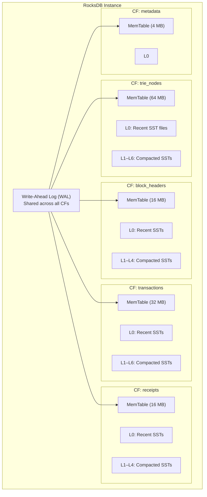
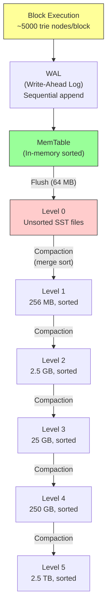
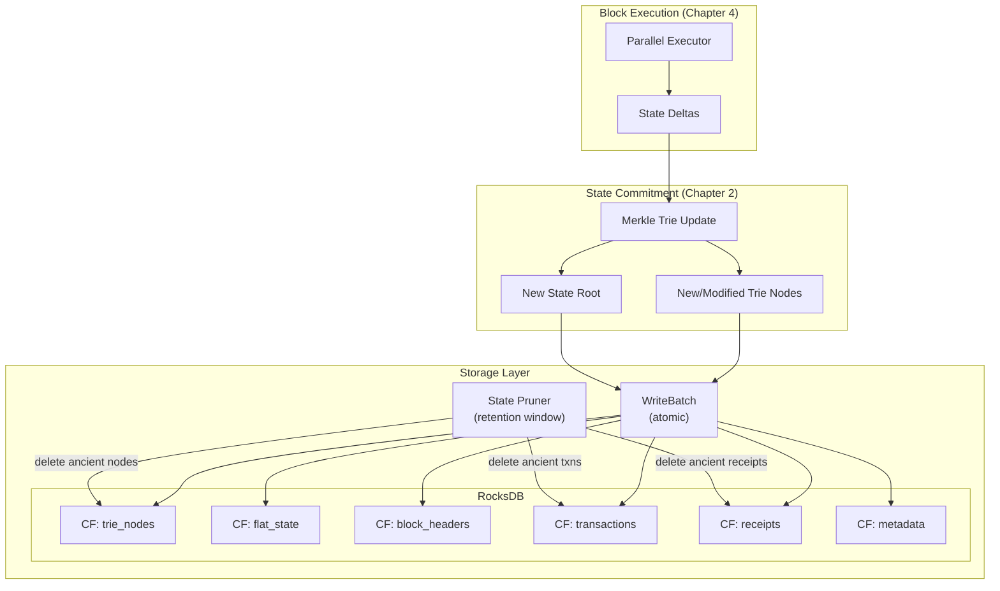

# 5. Database I/O and State Bloat 🔴

> **The Problem:** Every block adds new state — account balances change, smart contract storage is updated, new accounts are created. After a year of operation at 10,000 TPS, a validator has accumulated **terabytes** of historical state. The Merkle Trie nodes from Chapter 2 must live somewhere persistent, and that somewhere must support both the high-write throughput of block execution and the high-read throughput of state lookups and proof generation. Raw disk I/O becomes the silent killer: a validator that can execute 10K TPS in memory becomes I/O-bound at 2K TPS when the trie no longer fits in RAM. We need a storage engine that handles the churn, and a pruning strategy that prevents unbounded growth.

---

## Why General-Purpose Databases Fail

Blockchain state has a unique access pattern that breaks traditional databases:

| Property | OLTP Database (Postgres) | Blockchain Validator |
|---|---|---|
| Write pattern | Random updates to existing rows | Append-heavy (new trie nodes per block) |
| Read pattern | Point lookups + range scans | Point lookups (by hash) + tree traversals |
| Delete pattern | Explicit DELETE | Bulk deletion of ancient state |
| Key structure | Primary key (integer/UUID) | Content-addressed (32-byte hash) |
| Transaction model | ACID with rollback | Deterministic, no rollback (commit or fail) |
| Concurrency | Multiple concurrent writers | Single writer (block execution) + many readers |
| Data lifetime | Indefinite (GDPR aside) | Most data is "dead" after a few thousand blocks |
| Size | Gigabytes to low terabytes | Multi-terabyte and growing |

A blockchain validator needs a **key-value store** optimized for:
1. Fast point lookups by 32-byte hash (trie node reads)
2. High sequential write throughput (trie node inserts)
3. Efficient bulk deletion (state pruning)
4. Column families (separating different data types)

**RocksDB** (the LSM-tree engine from Facebook/Meta) is the de facto choice, used by Ethereum (geth), Solana, Aptos, Sui, and most production validators.

---

## RocksDB Architecture for Blockchain State

### Column Families

We partition the data into **column families** — logically separate key-value namespaces that share a single WAL but have independent LSM trees and compaction settings:



### Why Column Families?

| Column Family | Key Format | Value | Access Pattern | Tuning |
|---|---|---|---|---|
| `trie_nodes` | Node hash (32B) | RLP-encoded trie node | 90% reads, 10% writes | Large block cache, bloom filters |
| `block_headers` | Height (8B) | Serialized block header | Append-only, rare reads | Small cache, no bloom filter |
| `transactions` | Tx hash (32B) | Serialized transaction | Write-once, read-rarely | Aggressive compaction |
| `receipts` | `height:tx_idx` | Execution receipt | Write-once, read-rarely | Aggressive compaction |
| `metadata` | String key | Various (latest height, etc.) | Tiny, frequent updates | In-memory |

---

## Configuring RocksDB for Blockchain Workloads

```rust,ignore
use rocksdb::{
    BlockBasedOptions, ColumnFamilyDescriptor, DBCompactionStyle,
    DBCompressionType, Options, WriteBatch, DB,
};
use std::path::Path;

/// Column family names.
const CF_TRIE_NODES: &str = "trie_nodes";
const CF_BLOCK_HEADERS: &str = "block_headers";
const CF_TRANSACTIONS: &str = "transactions";
const CF_RECEIPTS: &str = "receipts";
const CF_METADATA: &str = "metadata";

/// Open the RocksDB instance with blockchain-optimized settings.
fn open_validator_db(path: &Path) -> Result<DB, rocksdb::Error> {
    let mut db_opts = Options::default();
    db_opts.create_if_missing(true);
    db_opts.create_missing_column_families(true);

    // WAL settings: fsync on every write batch for durability.
    db_opts.set_wal_dir(path.join("wal"));
    // Increase WAL size before flush to batch more writes.
    db_opts.set_max_total_wal_size(256 * 1024 * 1024); // 256 MB

    // Background threads for compaction and flush.
    db_opts.increase_parallelism(num_cpus::get() as i32);
    db_opts.set_max_background_jobs(4);

    // Trie nodes: the hot path — optimize for reads.
    let trie_cf = {
        let mut opts = Options::default();

        // Large MemTable: buffer many trie node writes before flushing to L0.
        opts.set_write_buffer_size(64 * 1024 * 1024); // 64 MB
        opts.set_max_write_buffer_number(4);

        // Block-based table with a large block cache.
        let mut block_opts = BlockBasedOptions::default();
        // 2 GB block cache — keep hot trie nodes in memory.
        block_opts.set_block_cache(&rocksdb::Cache::new_lru_cache(2 * 1024 * 1024 * 1024));
        // 16 KB blocks — larger blocks reduce index size.
        block_opts.set_block_size(16 * 1024);
        // Bloom filter: 10 bits/key eliminates ~99.9% of unnecessary disk reads.
        block_opts.set_bloom_filter(10.0, false);
        // Cache index and filter blocks in the block cache.
        block_opts.set_cache_index_and_filter_blocks(true);
        block_opts.set_pin_l0_filter_and_index_blocks_in_cache(true);
        opts.set_block_based_table_factory(&block_opts);

        // Level-style compaction with tiered compression.
        opts.set_compaction_style(DBCompactionStyle::Level);
        opts.set_compression_per_level(&[
            DBCompressionType::None, // L0: no compression (speed)
            DBCompressionType::Lz4,  // L1: fast compression
            DBCompressionType::Lz4,  // L2
            DBCompressionType::Zstd, // L3+: high compression (space)
            DBCompressionType::Zstd,
            DBCompressionType::Zstd,
            DBCompressionType::Zstd,
        ]);

        // Target file size: 64 MB base, 10× multiplier per level.
        opts.set_target_file_size_base(64 * 1024 * 1024);
        opts.set_max_bytes_for_level_base(256 * 1024 * 1024);
        opts.set_max_bytes_for_level_multiplier(10.0);

        ColumnFamilyDescriptor::new(CF_TRIE_NODES, opts)
    };

    // Block headers: append-only, rarely read.
    let headers_cf = {
        let mut opts = Options::default();
        opts.set_write_buffer_size(16 * 1024 * 1024);
        opts.set_compression_type(DBCompressionType::Zstd);
        // FIFO compaction: old SST files are simply deleted after TTL.
        // Perfect for append-only data with a retention window.
        opts.set_compaction_style(DBCompactionStyle::Fifo);
        ColumnFamilyDescriptor::new(CF_BLOCK_HEADERS, opts)
    };

    // Transactions: write-once, read-rarely (RPC queries).
    let txns_cf = {
        let mut opts = Options::default();
        opts.set_write_buffer_size(32 * 1024 * 1024);
        opts.set_compression_type(DBCompressionType::Zstd);
        opts.set_compaction_style(DBCompactionStyle::Level);
        ColumnFamilyDescriptor::new(CF_TRANSACTIONS, opts)
    };

    // Receipts: same pattern as transactions.
    let receipts_cf = {
        let mut opts = Options::default();
        opts.set_write_buffer_size(16 * 1024 * 1024);
        opts.set_compression_type(DBCompressionType::Zstd);
        opts.set_compaction_style(DBCompactionStyle::Level);
        ColumnFamilyDescriptor::new(CF_RECEIPTS, opts)
    };

    // Metadata: tiny, frequently updated.
    let metadata_cf = {
        let mut opts = Options::default();
        opts.set_write_buffer_size(4 * 1024 * 1024);
        ColumnFamilyDescriptor::new(CF_METADATA, opts)
    };

    let cfs = vec![trie_cf, headers_cf, txns_cf, receipts_cf, metadata_cf];
    DB::open_cf_descriptors(&db_opts, path, cfs)
}
```

---

## The Write Path: Batching Trie Node Writes

After executing a block, the Merkle Trie produces a set of new and modified trie nodes. We write them all in a single atomic `WriteBatch`:

```rust,ignore
/// Persist a block's execution results to RocksDB in a single atomic batch.
///
/// This ensures that either ALL data for block N is written, or NONE of it is.
/// A crash mid-write will not leave the database in an inconsistent state.
fn persist_block(
    db: &DB,
    block_height: u64,
    block_header: &[u8],
    transactions: &[([u8; 32], Vec<u8>)],  // (tx_hash, serialized_tx)
    receipts: &[(Vec<u8>, Vec<u8>)],         // (key, serialized_receipt)
    new_trie_nodes: &[([u8; 32], Vec<u8>)], // (node_hash, encoded_node)
    state_root: &[u8; 32],
) -> Result<(), rocksdb::Error> {
    let cf_trie = db.cf_handle(CF_TRIE_NODES).unwrap();
    let cf_headers = db.cf_handle(CF_BLOCK_HEADERS).unwrap();
    let cf_txns = db.cf_handle(CF_TRANSACTIONS).unwrap();
    let cf_receipts = db.cf_handle(CF_RECEIPTS).unwrap();
    let cf_meta = db.cf_handle(CF_METADATA).unwrap();

    let mut batch = WriteBatch::default();

    // 1. Write the block header.
    batch.put_cf(&cf_headers, block_height.to_be_bytes(), block_header);

    // 2. Write all transactions.
    for (tx_hash, tx_data) in transactions {
        batch.put_cf(&cf_txns, tx_hash, tx_data);
    }

    // 3. Write all execution receipts.
    for (key, receipt_data) in receipts {
        batch.put_cf(&cf_receipts, key, receipt_data);
    }

    // 4. Write new/modified trie nodes.
    for (node_hash, node_data) in new_trie_nodes {
        batch.put_cf(&cf_trie, node_hash, node_data);
    }

    // 5. Update metadata: latest committed height and state root.
    batch.put_cf(&cf_meta, b"latest_height", block_height.to_be_bytes());
    batch.put_cf(&cf_meta, b"latest_state_root", state_root);

    // Atomic write with WAL.
    let mut write_opts = rocksdb::WriteOptions::default();
    write_opts.set_sync(true); // fsync the WAL for durability.
    db.write_opt(batch, &write_opts)
}
```

### Write Amplification and LSM Levels

Every write to RocksDB goes through the LSM pipeline:



**Write amplification** is the ratio of bytes written to disk versus bytes written by the application. For RocksDB with 10× level multiplier:

| Level | Size | Write Amplification at This Level |
|---|---|---|
| MemTable → L0 | 64 MB | 1× (flush) |
| L0 → L1 | 256 MB | ~4× |
| L1 → L2 | 2.5 GB | ~10× |
| L2 → L3 | 25 GB | ~10× |
| **Total** | — | **~25–30×** |

For a validator writing 5,000 trie nodes per block (each ~200 bytes = 1 MB/block), the actual disk I/O is ~25–30 MB/block due to compaction. At 1 block/second, that's ~30 MB/s sustained write I/O — well within NVMe SSD capability.

---

## The Read Path: Serving State Queries

State reads are the critical path for:
1. **Block execution** — reading account balances from the trie.
2. **RPC queries** — light clients requesting Merkle proofs.
3. **Mempool validation** — checking nonce and balance before accepting a transaction.

### The Read Hierarchy

```rust,ignore
/// Read a trie node by its hash.
///
/// Check layers in order: MemTable → Block Cache → SST files (disk).
fn read_trie_node(db: &DB, node_hash: &[u8; 32]) -> Option<Vec<u8>> {
    let cf = db.cf_handle(CF_TRIE_NODES).unwrap();

    // RocksDB automatically checks:
    // 1. MemTable (in-memory, newest writes)
    // 2. Block cache (recently read SST blocks)
    // 3. Bloom filter (skips SST files that definitely don't contain the key)
    // 4. SST index → data block → key lookup
    db.get_cf(&cf, node_hash).ok().flatten()
}
```

### Read Performance Anatomy

| Layer | Latency | Hit Rate (Typical) |
|---|---|---|
| MemTable | ~1 μs | 5–10% (very recent writes) |
| Block cache (2 GB LRU) | ~5 μs | 60–80% (hot trie nodes near root) |
| Bloom filter negative | ~10 μs | Eliminates 99.9% of unnecessary SST reads |
| SST index + data block | ~50–200 μs | 10–30% (cold trie nodes) |

For trie traversals, the root and upper branch nodes are almost always in the block cache (they're accessed by every lookup). Leaf nodes for recently-active accounts are also hot. The cold path is leaf nodes for accounts that haven't been active in millions of blocks.

---

## State Pruning: Preventing Unbounded Growth

### The Problem: Dead Trie Nodes

When an account balance changes, the old leaf node and all its ancestor nodes (up to the root) become **unreferenced** — no current state root points to them. But they still exist on disk.

After 100 million blocks, the vast majority of trie nodes stored in RocksDB are dead. Without pruning, disk usage grows without bound:

| Blocks | Active Trie Nodes | Dead Trie Nodes | Total Disk |
|---|---|---|---|
| 1M | 10M | 40M | 10 GB |
| 10M | 50M | 500M | 100 GB |
| 100M | 200M | 5B | 1 TB |
| 500M | 300M | 25B | 5 TB |

### Pruning Strategy: Reference Counting + Retention Window

We keep state for the last N blocks (the **retention window**) and delete everything older. This allows:
- **Chain reorganization** within the window (if needed for non-instant-finality chains)
- **Historical RPC queries** within the window
- **Deletion of ancient state** outside the window

```rust,ignore
use std::collections::HashMap;

/// The state pruner tracks which trie nodes are referenced at each block height
/// and deletes unreferenced nodes beyond the retention window.
struct StatePruner {
    /// Retention window size (number of blocks to keep).
    retention_blocks: u64,

    /// For each block height, the set of NEW trie node hashes created.
    /// We use this to know which nodes can be candidates for deletion.
    new_nodes_per_block: HashMap<u64, Vec<[u8; 32]>>,

    /// Reference counts: how many state roots (within the window) reference each node.
    /// When a ref count hits 0, the node is safe to delete.
    ref_counts: HashMap<[u8; 32], u32>,
}

impl StatePruner {
    fn new(retention_blocks: u64) -> Self {
        Self {
            retention_blocks,
            new_nodes_per_block: HashMap::new(),
            ref_counts: HashMap::new(),
        }
    }

    /// Record the trie nodes created at a given block height.
    fn record_new_nodes(&mut self, height: u64, node_hashes: Vec<[u8; 32]>) {
        for hash in &node_hashes {
            *self.ref_counts.entry(*hash).or_insert(0) += 1;
        }
        self.new_nodes_per_block.insert(height, node_hashes);
    }

    /// Prune state from blocks that have fallen outside the retention window.
    /// Returns the node hashes that should be deleted from RocksDB.
    fn prune(&mut self, current_height: u64) -> Vec<[u8; 32]> {
        let mut to_delete = Vec::new();

        if current_height <= self.retention_blocks {
            return to_delete;
        }

        let prune_height = current_height - self.retention_blocks;

        // Get the trie nodes created at the block being pruned.
        if let Some(old_nodes) = self.new_nodes_per_block.remove(&prune_height) {
            for hash in old_nodes {
                if let Some(count) = self.ref_counts.get_mut(&hash) {
                    *count = count.saturating_sub(1);
                    if *count == 0 {
                        self.ref_counts.remove(&hash);
                        to_delete.push(hash);
                    }
                }
            }
        }

        to_delete
    }
}

/// Execute pruning as part of block processing.
fn prune_old_state(
    db: &DB,
    pruner: &mut StatePruner,
    current_height: u64,
) -> Result<usize, rocksdb::Error> {
    let to_delete = pruner.prune(current_height);
    let count = to_delete.len();

    if to_delete.is_empty() {
        return Ok(0);
    }

    let cf_trie = db.cf_handle(CF_TRIE_NODES).unwrap();
    let cf_txns = db.cf_handle(CF_TRANSACTIONS).unwrap();
    let cf_receipts = db.cf_handle(CF_RECEIPTS).unwrap();

    let mut batch = WriteBatch::default();

    // Delete old trie nodes.
    for hash in &to_delete {
        batch.delete_cf(&cf_trie, hash);
    }

    // Also prune old block transactions and receipts.
    let prune_height = current_height - pruner.retention_blocks;
    // (In production, we'd iterate over the transactions/receipts for prune_height
    //  and delete them. Omitted for brevity.)

    let mut write_opts = rocksdb::WriteOptions::default();
    write_opts.set_sync(false); // Pruning deletes are not durability-critical.
    db.write_opt(batch, &write_opts)?;

    Ok(count)
}
```

---

## Advanced: Flat State Storage

The Merkle Trie stores account state in leaf nodes addressed by **hash** (not by account address). This means reading Alice's balance requires:

1. Convert Alice's address to nibbles.
2. Traverse the trie from root through 40 levels of branch/extension nodes.
3. Each level requires a point lookup in RocksDB by node hash.

That's up to **40 RocksDB lookups** for a single balance query. This is the trie's Achilles' heel.

### The Fix: Flat State Table

We maintain a **second copy** of account state in a simple `(address → state)` mapping:

```rust,ignore
const CF_FLAT_STATE: &str = "flat_state";

/// Write to both the trie (for proofs) and flat state (for fast lookups).
fn write_account_dual(
    db: &DB,
    address: &[u8; 20],
    state: &AccountState,
    trie_nodes: &[([u8; 32], Vec<u8>)],
) -> Result<(), rocksdb::Error> {
    let cf_flat = db.cf_handle(CF_FLAT_STATE).unwrap();
    let cf_trie = db.cf_handle(CF_TRIE_NODES).unwrap();

    let mut batch = WriteBatch::default();

    // Flat state: O(1) lookup by address.
    batch.put_cf(&cf_flat, address, state.encode());

    // Trie nodes: O(depth) traversal for Merkle proofs.
    for (hash, data) in trie_nodes {
        batch.put_cf(&cf_trie, hash, data);
    }

    db.write(batch)
}

/// Fast state lookup (no trie traversal).
fn read_account_fast(db: &DB, address: &[u8; 20]) -> Option<AccountState> {
    let cf_flat = db.cf_handle(CF_FLAT_STATE).unwrap();
    let data = db.get_cf(&cf_flat, address).ok().flatten()?;
    AccountState::decode(&data)
}
```

| Operation | Trie-Only | Flat State + Trie |
|---|---|---|
| Balance lookup | 40 RocksDB reads (trie traversal) | 1 RocksDB read (flat state) |
| Merkle proof generation | 40 RocksDB reads | 40 RocksDB reads (same) |
| Write cost | ~5 trie nodes | ~5 trie nodes + 1 flat state entry |
| Disk space | 1× | ~1.3× (extra flat state column) |

**Trade-off:** 30% more disk space for 40× faster balance lookups. Every production validator makes this trade.

---

## Monitoring and Diagnostics

### Key Metrics to Watch

```rust,ignore
use std::time::Instant;

/// Metrics for the storage layer.
struct StorageMetrics {
    /// Time to persist a block (WriteBatch flush + fsync).
    block_persist_duration_ms: f64,
    /// Number of trie nodes written per block.
    trie_nodes_per_block: usize,
    /// Number of trie nodes pruned per block.
    trie_nodes_pruned_per_block: usize,
    /// RocksDB block cache hit rate.
    cache_hit_rate: f64,
    /// Total disk usage across all column families.
    total_disk_bytes: u64,
    /// Compaction pending bytes.
    compaction_pending_bytes: u64,
}

fn collect_storage_metrics(db: &DB) -> StorageMetrics {
    // RocksDB exposes these via properties:
    let cache_hits: u64 = db
        .property_int_value("rocksdb.block.cache.hit")
        .unwrap()
        .unwrap_or(0);
    let cache_misses: u64 = db
        .property_int_value("rocksdb.block.cache.miss")
        .unwrap()
        .unwrap_or(0);
    let total = cache_hits + cache_misses;
    let cache_hit_rate = if total > 0 {
        cache_hits as f64 / total as f64
    } else {
        0.0
    };

    let compaction_pending = db
        .property_int_value("rocksdb.compaction-pending")
        .unwrap()
        .unwrap_or(0);

    StorageMetrics {
        block_persist_duration_ms: 0.0, // Set during persist_block
        trie_nodes_per_block: 0,
        trie_nodes_pruned_per_block: 0,
        cache_hit_rate,
        total_disk_bytes: 0, // Sum of live SST file sizes
        compaction_pending_bytes: compaction_pending,
    }
}
```

### Disk Budget Planning

| Component | Size per Block | Size per Day (1 block/sec) | Size per Year |
|---|---|---|---|
| Block headers | ~500 B | ~43 MB | ~16 GB |
| Transactions (1000/block) | ~200 KB | ~17 GB | ~6 TB |
| Receipts | ~100 KB | ~8.6 GB | ~3 TB |
| Trie nodes (new) | ~1 MB | ~86 GB | ~31 TB |
| **Total (no pruning)** | **~1.3 MB** | **~112 GB** | **~40 TB** |
| **Total (with pruning, 7-day window)** | — | **~780 GB** | **~780 GB** |

Pruning reduces storage from **40 TB/year** to a **fixed ~780 GB** regardless of chain age.

---

## The Full Storage Pipeline



---

## Disaster Recovery: Snapshots and Fast Sync

A new validator joining the network cannot replay billions of historical blocks. Instead, it downloads a **state snapshot** — a compressed dump of the current flat state and trie — from a trusted peer:

```rust,ignore
/// Create a RocksDB checkpoint (hardlink-based, near-instant).
fn create_snapshot(db: &DB, snapshot_path: &Path) -> Result<(), rocksdb::Error> {
    let checkpoint = rocksdb::checkpoint::Checkpoint::new(db)?;
    // This creates hardlinks to existing SST files — almost zero I/O cost.
    checkpoint.create_checkpoint(snapshot_path)?;
    Ok(())
}

/// The fast-sync protocol:
///
/// 1. New validator connects to a trusted peer.
/// 2. Peer creates a RocksDB checkpoint at block height H.
/// 3. Peer streams the checkpoint files over the network.
/// 4. New validator restores from checkpoint.
/// 5. New validator replays blocks H+1, H+2, ... from the P2P network.
/// 6. Once caught up, it joins consensus.
struct FastSync {
    /// The block height of the snapshot.
    snapshot_height: u64,
    /// The state root at the snapshot height (for verification).
    snapshot_state_root: [u8; 32],
}
```

---

> **Key Takeaways**
>
> 1. **RocksDB is the blockchain storage standard** because its LSM-tree architecture naturally handles the append-heavy, bulk-delete workload of blockchain state.
> 2. **Column families isolate access patterns.** Trie nodes need large block caches and bloom filters; block headers need FIFO compaction; metadata stays tiny. Different tuning for each.
> 3. **Atomic `WriteBatch` is non-negotiable.** All data for a single block — trie nodes, transactions, receipts, metadata — must be committed in a single atomic operation. A crash between partial writes corrupts the database.
> 4. **Flat state trades disk for speed.** Maintaining a `(address → state)` flat table alongside the Merkle Trie gives 40× faster balance lookups at the cost of ~30% more disk space.
> 5. **State pruning is survival.** Without pruning, disk usage grows to 40+ TB/year. With a 7-day retention window, it stabilizes at ~780 GB regardless of chain age.
> 6. **Write amplification is the hidden cost.** RocksDB's compaction writes each byte 25–30× to disk over its lifetime. Size your NVMe SSD write endurance accordingly — a validator with 30 MB/s application writes generates ~900 MB/s of actual disk I/O.
> 7. **Snapshots enable fast sync.** RocksDB's hardlink-based checkpoints let new validators join the network in minutes (download snapshot) instead of days (replay history).
