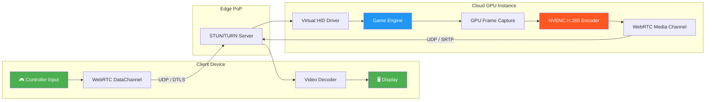

# System Design: The Cloud Gaming Streaming Engine

> **The Problem:** Every millisecond matters. A traditional video streaming service can buffer five seconds of content without the viewer noticing; a cloud gaming service that buffers even *one frame* delivers an experience indistinguishable from input lag — and players abandon laggy games in under thirty seconds.

## Why This Book Exists

Cloud gaming sits at the intersection of the hardest problems in systems engineering: **real-time networking**, **GPU-accelerated video encoding**, **sub-frame latency budgets**, and **adaptive quality control** — all running simultaneously on shared multi-tenant infrastructure. No single discipline owns the full stack. The network engineer knows UDP but not NVENC. The graphics programmer knows the GPU pipeline but not congestion control. The game developer knows the rendering loop but not WebRTC ICE negotiation.

This book connects every layer — from the moment a player presses a button on their controller to the moment the corresponding pixel illuminates on their display — into a single, coherent system design.

## Who Should Read This

| Role | What You'll Gain |
|---|---|
| **Systems Architects** | End-to-end latency pipeline design and capacity planning |
| **Graphics Engineers** | Zero-copy GPU capture, NVENC/VAAPI encoding pipelines |
| **Network Engineers** | WebRTC data channels, custom FEC, congestion control |
| **Game Developers** | Input injection, headless rendering, compatibility layers |
| **SRE / Platform Teams** | Adaptive bitrate, monitoring, multi-tenant GPU orchestration |

## The Architecture at a Glance

## The Five Pillars

| Chapter | Domain | Difficulty | Core Question |
|---|---|---|---|
| **Ch 1** | Latency Budget | 🟢 Architecture | How do you fit an entire render-encode-stream-decode loop into 50 ms? |
| **Ch 2** | WebRTC Transport | 🟡 Media/Networking | Why can't you use HLS/DASH, and how do you tame raw UDP? |
| **Ch 3** | Hardware Encoding | 🔴 GPU/Hardware | How do you encode 4K60 without the frame ever touching system RAM? |
| **Ch 4** | Adaptive Bitrate | 🔴 GPU/Hardware | How do you react to a WiFi dropout in under one frame? |
| **Ch 5** | Input Virtualization | 🟡 Media/Networking | How do you inject a controller into a headless cloud OS? |

## Conventions

Throughout this book:

- 💥 marks a **hazard** — a naive approach that fails in production.
- ✅ marks a **fix** — the production-grade solution.
- ⚠️ marks a **tradeoff** — a design decision with no universally correct answer.
- Code blocks use `rust,ignore` for illustrative snippets and `rust,editable` for runnable examples.
- Mermaid diagrams are embedded inline for architecture and protocol flows.

> **Key Takeaways**
>
> - Cloud gaming is not "video streaming with a controller." It is a fundamentally different real-time system.
> - The entire pipeline — input capture, game tick, render, encode, transmit, decode, display — must complete in **under 50 ms** to feel responsive.
> - Each chapter in this book addresses one critical stage of that pipeline, with production Rust and C++ code you can deploy.
