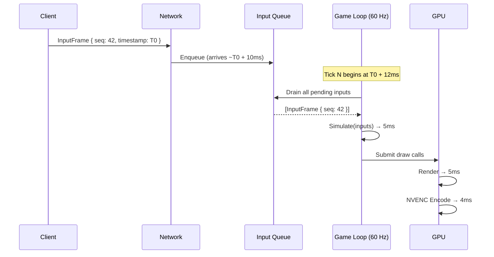
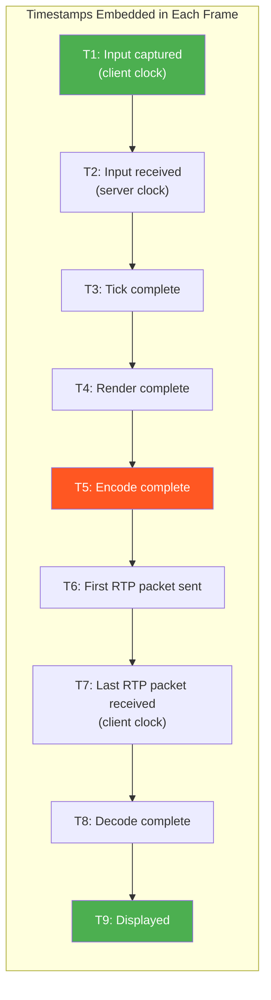
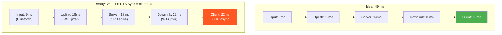

# 1. The Input-to-Photon Latency Budget 🟢

> **The Problem:** A player in Chicago presses the trigger button. The game is running on a GPU in Dallas. The rendered frame must travel back to Chicago, be decoded, and appear on screen — all before the player's brain perceives a delay. Cognitive research shows that **any round-trip above ~100 ms feels "sluggish,"** and above ~150 ms induces genuine motion sickness in fast-paced games. Your entire pipeline — input capture, network transit, game tick, GPU render, hardware encode, network transit again, decode, and display vsync — has a budget of roughly **50 ms one-way**. Miss that budget by even 10 ms, and your service is unplayable.

**Cross-references:** This chapter establishes the latency framework used by every subsequent chapter. Chapter 2 (WebRTC) addresses the network transit segments. Chapter 3 (NVENC) tackles the encode segment. Chapter 4 (Adaptive Bitrate) handles dynamic rebalancing when the budget is exceeded. Chapter 5 (Input Virtualization) covers the input injection segment.

---

## 1.1 The Physics of Cloud Gaming Latency

Traditional video streaming and cloud gaming look superficially similar — both send compressed video from a server to a client. But the similarity ends there.

| Property | Video Streaming (Netflix/YouTube) | Cloud Gaming (Stadia/xCloud/GeForce NOW) |
|---|---|---|
| **Acceptable latency** | 2–30 seconds | < 50 ms one-way |
| **Buffering allowed** | Yes (5–30 s deep buffer) | No (zero-frame buffer) |
| **Input feedback loop** | None (passive viewing) | Every frame is a response to input |
| **Codec profile** | High-latency B-frame heavy | Zero-B-frame, low-latency tune |
| **Transport** | TCP (HLS/DASH over HTTP) | UDP (WebRTC / custom RTP) |
| **Failure perception** | Buffering spinner | Controller feels "dead" |

The fundamental difference is the **closed feedback loop**. In cloud gaming, the player's perception of quality is not "does the video look good?" — it is "does the game *feel* responsive?" A 4K stream that arrives 200 ms late is worse than a 720p stream that arrives in 30 ms.

### Why 100 ms Is the Threshold

Human perception research (Card, Moran & Newell, 1983; Claypool & Claypool, 2006) establishes three perceptual thresholds:

| Delay | Perception | Effect on Gameplay |
|---|---|---|
| **< 50 ms** | Imperceptible | Indistinguishable from local play |
| **50–100 ms** | Noticeable but tolerable | Acceptable for RPGs, strategy; marginal for shooters |
| **100–150 ms** | Clearly laggy | Aiming accuracy drops ~20%; players report frustration |
| **> 150 ms** | Unplayable | Motion sickness in VR; complete loss of competitive viability |

The magic number for a cloud gaming service targeting broad game compatibility is **≤ 60 ms glass-to-glass** (input event to photon on display). This is the number we will engineer toward.

---

## 1.2 Breaking Down the Latency Budget

The input-to-photon pipeline is a chain of sequential stages. Each stage consumes a portion of the 50 ms budget:

```mermaid
gantt
    title Input-to-Photon Latency Budget (Target: 50 ms)
    dateFormat X
    axisFormat %L ms

    section Client → Server
    Input Capture + Serialize     :a1, 0, 2
    Network Uplink (RTT/2)        :a2, 2, 12

    section Server Processing
    Input Deserialize + Inject    :a3, 12, 14
    Game Engine Tick (16.67ms@60) :a4, 14, 22
    GPU Render                    :a5, 22, 27
    NVENC Encode                  :a6, 27, 31

    section Server → Client
    Network Downlink (RTT/2)      :a7, 31, 41
    Jitter Buffer                 :a8, 41, 44

    section Client Processing
    Video Decode (HW)             :a9, 44, 47
    Display VSync Wait            :a10, 47, 50
```



### The Budget Breakdown

| Stage | Budget | Notes |
|---|---|---|
| **Input Capture** | ~1 ms | USB HID polling at 1 kHz; Bluetooth adds 2–7 ms |
| **Input Serialize + Send** | ~1 ms | WebRTC DataChannel, CBOR/protobuf encoding |
| **Network Uplink** | ~10 ms | Half of 20 ms RTT (target: same-region edge PoP) |
| **Input Injection** | ~1 ms | Virtual HID driver write (Ch 5) |
| **Game Tick** | ~5–8 ms | Typically one simulation tick at 60–120 Hz |
| **GPU Render** | ~5 ms | Depends on scene complexity; must not exceed frame time |
| **Hardware Encode** | ~4 ms | NVENC async encode, zero-copy from VRAM (Ch 3) |
| **Network Downlink** | ~10 ms | Second half of RTT, carrying encoded frame |
| **Jitter Buffer** | ~3 ms | Absorbs network timing variance |
| **Hardware Decode** | ~3 ms | Client GPU decode (DXVA2, VideoToolbox, VAAPI) |
| **Display VSync** | ~3 ms | Worst-case wait for next display refresh |
| **TOTAL** | **~49 ms** | Leaves ~1 ms margin |

> ⚠️ **Tradeoff:** This budget assumes a **20 ms RTT** between client and server. Every additional 10 ms of RTT directly steals from the total budget. This is why cloud gaming services require **edge PoPs within 30 ms of the player**, typically within the same metropolitan area.

---

## 1.3 Stage-by-Stage Deep Dive

### Stage 1: Input Capture (Client)

The latency clock starts the instant the player's finger actuates a button. The input device itself introduces latency:

| Device | Polling Rate | Typical Latency |
|---|---|---|
| USB wired controller (Xbox Elite) | 1000 Hz | ~1 ms |
| Bluetooth controller (DualSense) | 133 Hz | ~7.5 ms |
| Bluetooth LE controller (optimized) | 250 Hz | ~4 ms |
| Keyboard (USB, 1 kHz polling) | 1000 Hz | ~1 ms |
| Touch screen (mobile) | 120–240 Hz | ~4–8 ms |

```rust,ignore
// 💥 HAZARD: Using the browser's gamepad API introduces additional polling delay
// The Gamepad API only updates once per requestAnimationFrame (~16 ms at 60 Hz)
fn poll_gamepad_naive() {
    // This adds up to 16 ms of input latency!
    window.request_animation_frame(|| {
        let gamepads = navigator.get_gamepads();
        send_input(gamepads[0].buttons);
    });
}
```

```rust,ignore
// ✅ FIX: Use a dedicated high-frequency polling loop via Web Workers
// or, on native clients, poll the OS HID layer directly at 1 kHz
fn poll_gamepad_low_latency(hid_device: &HidDevice) -> InputFrame {
    // Poll at 1 kHz independent of the render loop
    let raw_report = hid_device.read_input_report();
    InputFrame {
        timestamp_us: precise_clock_us(),
        buttons: parse_buttons(raw_report),
        axes: parse_axes(raw_report),
        sequence: next_sequence_number(),
    }
}
```

### Stage 2: Network Uplink

The serialized input frame is sent to the server via WebRTC DataChannel (unreliable, unordered mode). With a typical input frame of ~40 bytes, the overhead is dominated by UDP/DTLS headers, not payload.

```rust,ignore
/// Input frame sent from client to server.
/// Kept minimal to reduce serialization and transmission overhead.
#[derive(Serialize, Deserialize)]
struct InputFrame {
    /// Monotonic sequence number for ordering and loss detection
    sequence: u32,
    /// Client-side timestamp in microseconds (for RTT estimation)
    timestamp_us: u64,
    /// Bitmask of pressed buttons (A, B, X, Y, LB, RB, etc.)
    buttons: u32,
    /// Analog axes: left_x, left_y, right_x, right_y, L2, R2
    axes: [i16; 6],
}
```

### Stage 3: Game Engine Tick (Server)

The game engine must process the injected input within its next simulation tick. If the engine runs at 60 Hz, one tick is 16.67 ms. But we don't have 16.67 ms to spare — the input must arrive *between* ticks, and the tick itself should be as short as possible.



> 💥 **Hazard: Input-to-tick alignment.** If the input arrives *just after* a tick boundary, it won't be processed until the *next* tick — adding up to 16.67 ms of latency. Production systems mitigate this with **high-frequency game ticks** (120–240 Hz) or **late input integration** (reading the input queue at the last possible moment before rendering).

### Stage 4: GPU Render

The GPU renders the scene. The budget here depends on scene complexity:

| Target | Frame Time | Budget Consumed |
|---|---|---|
| 1080p @ 60 fps | 16.67 ms | ~5 ms (must leave room for encode) |
| 1440p @ 60 fps | 16.67 ms | ~7 ms |
| 4K @ 60 fps | 16.67 ms | ~10 ms (extremely tight) |

The critical optimization: the rendered frame must **stay in GPU VRAM**. Any readback to system RAM adds 2–5 ms and wastes PCIe bandwidth. Chapter 3 covers zero-copy capture in detail.

### Stage 5: Hardware Encode (NVENC)

NVIDIA's NVENC operates on a separate silicon block from the CUDA cores. It can encode asynchronously while the GPU begins rendering the next frame.

| Codec | Resolution | NVENC Latency (Turing+) |
|---|---|---|
| H.264 Baseline | 1080p60 | ~2 ms |
| H.264 High | 1080p60 | ~3 ms |
| H.265 Main | 1080p60 | ~3.5 ms |
| H.265 Main | 4K60 | ~5 ms |
| AV1 (Ada Lovelace) | 1080p60 | ~3 ms |

> ⚠️ **Tradeoff:** H.265 at the same bitrate produces visibly better quality than H.264, but encodes ~1 ms slower. For competitive shooters where every millisecond matters, H.264 Baseline may be the better choice.

### Stage 6: Network Downlink

The encoded frame (typically 10–100 KB for 1080p at 15 Mbps) is packetized into RTP packets of ~1200 bytes each, sent over UDP/SRTP via the WebRTC media channel. A 50 KB frame produces ~42 UDP packets.

### Stage 7: Jitter Buffer

The client maintains a small jitter buffer to absorb network timing variance. Unlike video streaming, this buffer holds at most **1–2 frames** (16–33 ms) and is dynamically resized based on observed jitter.

```rust,ignore
// ✅ Adaptive jitter buffer for cloud gaming
struct AdaptiveJitterBuffer {
    /// Target buffer depth in microseconds
    target_depth_us: u64,
    /// Exponentially weighted moving average of inter-arrival jitter
    jitter_ewma_us: f64,
    /// Minimum buffer depth (cannot go below this)
    min_depth_us: u64,
    /// Maximum buffer depth before we force frame drops
    max_depth_us: u64,
}

impl AdaptiveJitterBuffer {
    fn update_jitter(&mut self, measured_jitter_us: u64) {
        // RFC 3550 jitter estimation
        let alpha = 1.0 / 16.0;
        let diff = (measured_jitter_us as f64 - self.jitter_ewma_us).abs();
        self.jitter_ewma_us += alpha * (diff - self.jitter_ewma_us);

        // Target depth = 2x the estimated jitter (covers 95th percentile)
        self.target_depth_us = (self.jitter_ewma_us * 2.0) as u64;
        self.target_depth_us = self.target_depth_us
            .max(self.min_depth_us)
            .min(self.max_depth_us);
    }
}
```

### Stage 8: Video Decode and Display

Client-side hardware decode is fast (~2–3 ms on modern GPUs), but the display's refresh cycle introduces the final latency. A 60 Hz display refreshes every 16.67 ms; if the decoded frame just misses a vsync, it waits up to 16.67 ms for the next one.

| Display Tech | Refresh Rate | Worst-Case VSync Wait |
|---|---|---|
| Standard 60 Hz | 60 Hz | 16.67 ms |
| 120 Hz gaming monitor | 120 Hz | 8.33 ms |
| 240 Hz gaming monitor | 240 Hz | 4.17 ms |
| VRR / FreeSync / G-Sync | Variable | ~0 ms (frame displayed immediately) |

> ✅ **Fix:** Always recommend VRR (Variable Refresh Rate) displays to cloud gaming users. VRR eliminates the vsync wait, saving up to 16 ms in the worst case.

---

## 1.4 The Latency Measurement Pipeline

You can't optimize what you can't measure. A production cloud gaming service requires **end-to-end latency telemetry** at every stage.



```rust,ignore
/// Per-frame telemetry record, embedded in RTP header extensions
/// and DataChannel metadata for end-to-end tracking.
#[derive(Debug, Clone)]
struct FrameTelemetry {
    frame_id: u64,
    input_sequence: u32,
    /// All timestamps in microseconds since epoch
    t_input_captured: u64,     // T1 (client clock)
    t_input_received: u64,     // T2 (server clock)
    t_tick_complete: u64,      // T3
    t_render_complete: u64,    // T4
    t_encode_complete: u64,    // T5
    t_rtp_first_sent: u64,    // T6
    t_rtp_last_received: u64,  // T7 (client clock)
    t_decode_complete: u64,    // T8 (client clock)
    t_displayed: u64,          // T9 (client clock)
}

impl FrameTelemetry {
    fn glass_to_glass_ms(&self) -> f64 {
        (self.t_displayed - self.t_input_captured) as f64 / 1000.0
    }

    fn server_processing_ms(&self) -> f64 {
        (self.t_encode_complete - self.t_input_received) as f64 / 1000.0
    }

    fn network_rtt_ms(&self) -> f64 {
        let uplink = self.t_input_received - self.t_input_captured;
        let downlink = self.t_rtp_last_received - self.t_rtp_first_sent;
        (uplink + downlink) as f64 / 1000.0
    }
}
```

> ⚠️ **Tradeoff: Clock synchronization.** T1 and T7–T9 are measured on the client clock; T2–T6 on the server clock. These clocks are never perfectly synchronized. Production systems use **NTP** or **PTP (IEEE 1588)** for rough alignment and compute *differential* latencies (e.g., T5 − T2 for server processing time) to avoid cross-clock comparisons.

---

## 1.5 Where the Budget Goes Wrong

In practice, the budget is not evenly distributed. Here are the most common budget overruns:

| Overrun | Cause | Impact | Mitigation |
|---|---|---|---|
| **WiFi jitter spike** | Microwave interference, congestion | +20–50 ms | Edge PoP proximity; adaptive bitrate (Ch 4) |
| **Bluetooth input delay** | BLE connection interval | +4–7 ms | Recommend wired controllers |
| **CPU-bound game tick** | Physics simulation spike | +5–10 ms | Frame time budgeting; async physics |
| **GPU readback stall** | Frame copied to CPU RAM | +3–5 ms | Zero-copy NVENC capture (Ch 3) |
| **Encode queue depth** | NVENC backpressure | +4–16 ms | Dedicated NVENC session, async pipeline |
| **VSync wait** | Non-VRR display | +0–16 ms | VRR displays; frame pacing |
| **TCP fallback** | UDP blocked by firewall | +30–100 ms | TURN over UDP; TCP as last resort |



---

## 1.6 Engineering the Budget: A Rust Latency Tracker

Here is a complete, runnable latency budget tracker that a cloud gaming server can use to monitor per-frame compliance:

```rust,editable
use std::time::Instant;

/// The maximum acceptable glass-to-glass latency in microseconds.
const MAX_BUDGET_US: u64 = 50_000; // 50 ms

/// Each stage of the input-to-photon pipeline.
#[derive(Debug, Clone, Copy)]
enum PipelineStage {
    InputCapture,
    NetworkUplink,
    InputInjection,
    GameTick,
    GpuRender,
    HardwareEncode,
    NetworkDownlink,
    JitterBuffer,
    HardwareDecode,
    DisplayVsync,
}

/// Per-stage timing measurement.
#[derive(Debug)]
struct StageTiming {
    stage: PipelineStage,
    start_us: u64,
    end_us: u64,
}

impl StageTiming {
    fn duration_us(&self) -> u64 {
        self.end_us.saturating_sub(self.start_us)
    }
}

/// Per-frame latency budget tracker.
#[derive(Debug)]
struct LatencyBudget {
    frame_id: u64,
    stages: Vec<StageTiming>,
    budget_us: u64,
}

impl LatencyBudget {
    fn new(frame_id: u64) -> Self {
        Self {
            frame_id,
            stages: Vec::with_capacity(10),
            budget_us: MAX_BUDGET_US,
        }
    }

    fn record(&mut self, stage: PipelineStage, start_us: u64, end_us: u64) {
        self.stages.push(StageTiming {
            stage,
            start_us,
            end_us,
        });
    }

    fn total_us(&self) -> u64 {
        self.stages.iter().map(|s| s.duration_us()).sum()
    }

    fn is_over_budget(&self) -> bool {
        self.total_us() > self.budget_us
    }

    fn budget_remaining_us(&self) -> i64 {
        self.budget_us as i64 - self.total_us() as i64
    }

    /// Returns the stage consuming the most time (bottleneck).
    fn bottleneck(&self) -> Option<&StageTiming> {
        self.stages.iter().max_by_key(|s| s.duration_us())
    }

    fn report(&self) {
        println!("Frame {} latency report:", self.frame_id);
        for s in &self.stages {
            println!(
                "  {:?}: {} µs ({:.1} ms)",
                s.stage,
                s.duration_us(),
                s.duration_us() as f64 / 1000.0
            );
        }
        let total = self.total_us();
        let status = if self.is_over_budget() {
            "💥 OVER BUDGET"
        } else {
            "✅ Within budget"
        };
        println!(
            "  TOTAL: {} µs ({:.1} ms) — {} (remaining: {} µs)",
            total,
            total as f64 / 1000.0,
            status,
            self.budget_remaining_us()
        );
        if let Some(bottleneck) = self.bottleneck() {
            println!(
                "  Bottleneck: {:?} at {} µs",
                bottleneck.stage,
                bottleneck.duration_us()
            );
        }
    }
}

fn main() {
    let mut budget = LatencyBudget::new(1);

    // Simulate a typical frame's pipeline timings (in microseconds)
    budget.record(PipelineStage::InputCapture,    0,     1_200);
    budget.record(PipelineStage::NetworkUplink,    1_200, 11_000);
    budget.record(PipelineStage::InputInjection,   11_000, 11_800);
    budget.record(PipelineStage::GameTick,         11_800, 17_500);
    budget.record(PipelineStage::GpuRender,        17_500, 22_000);
    budget.record(PipelineStage::HardwareEncode,   22_000, 26_000);
    budget.record(PipelineStage::NetworkDownlink,   26_000, 36_000);
    budget.record(PipelineStage::JitterBuffer,     36_000, 38_500);
    budget.record(PipelineStage::HardwareDecode,   38_500, 41_000);
    budget.record(PipelineStage::DisplayVsync,     41_000, 43_500);

    budget.report();
}
```

---

## 1.7 The Pipelining Optimization

The budget above assumes **strictly sequential** stages. In production, some stages overlap:

```mermaid
gantt
    title Pipelined Frame Processing (Frames N, N+1, N+2)
    dateFormat X
    axisFormat %L ms

    section Frame N
    Game Tick N       :a1, 0, 8
    GPU Render N      :a2, 8, 13
    NVENC Encode N    :a3, 13, 17
    Network TX N      :a4, 17, 27

    section Frame N+1
    Game Tick N+1     :b1, 8, 16
    GPU Render N+1    :b2, 16, 21
    NVENC Encode N+1  :b3, 21, 25
    Network TX N+1    :b4, 25, 35

    section Frame N+2
    Game Tick N+2     :c1, 16, 24
    GPU Render N+2    :c2, 24, 29
    NVENC Encode N+2  :c3, 29, 33
    Network TX N+2    :c4, 33, 43
```



With pipelining:
- While Frame N is being **encoded**, Frame N+1 is being **rendered**.
- While Frame N is on the **network**, Frame N+1 is being **encoded** and Frame N+2 is being **ticked**.

This doesn't reduce the latency of any single frame, but it ensures the pipeline is always full and throughput remains at the target frame rate.

> **Key Takeaways**
>
> - The entire input-to-photon pipeline must complete in **≤ 50 ms** for imperceptible latency.
> - The budget is dominated by two factors: **network RTT** (~20 ms) and **server processing** (tick + render + encode, ~14 ms).
> - Bluetooth controllers, WiFi jitter, and 60 Hz displays are the three biggest latency thieves in practice.
> - **Measure every stage** with embedded microsecond timestamps. You cannot optimize what you cannot observe.
> - Pipelining does not reduce per-frame latency but maintains throughput at the target frame rate.
> - When the budget is exceeded, the adaptive bitrate system (Chapter 4) must reduce quality to reclaim milliseconds.
