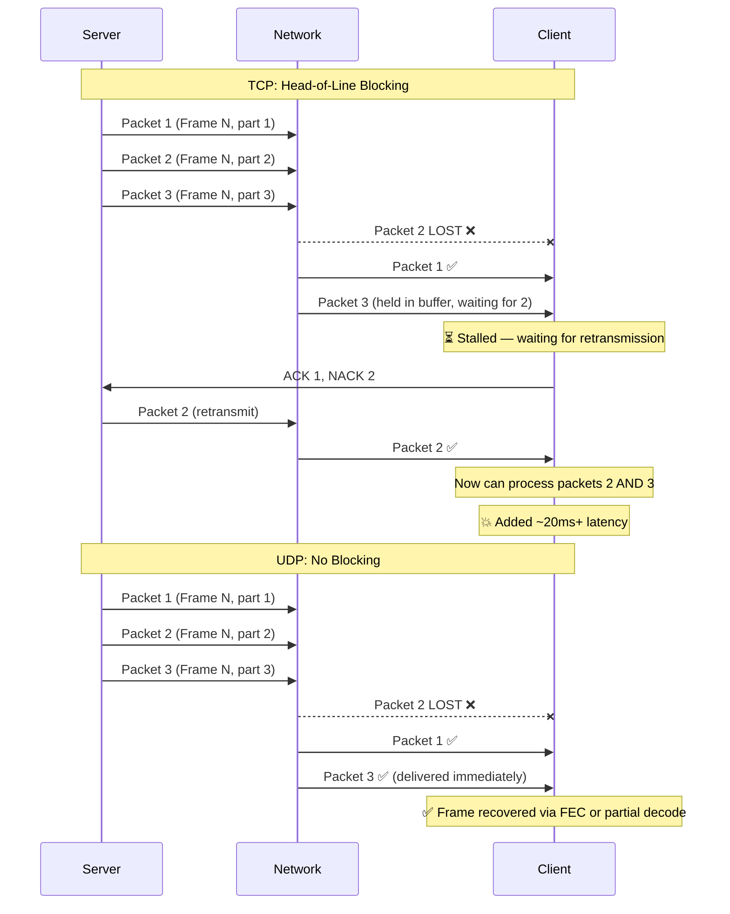
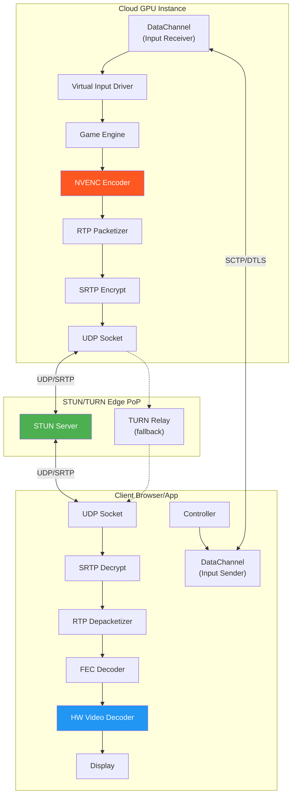
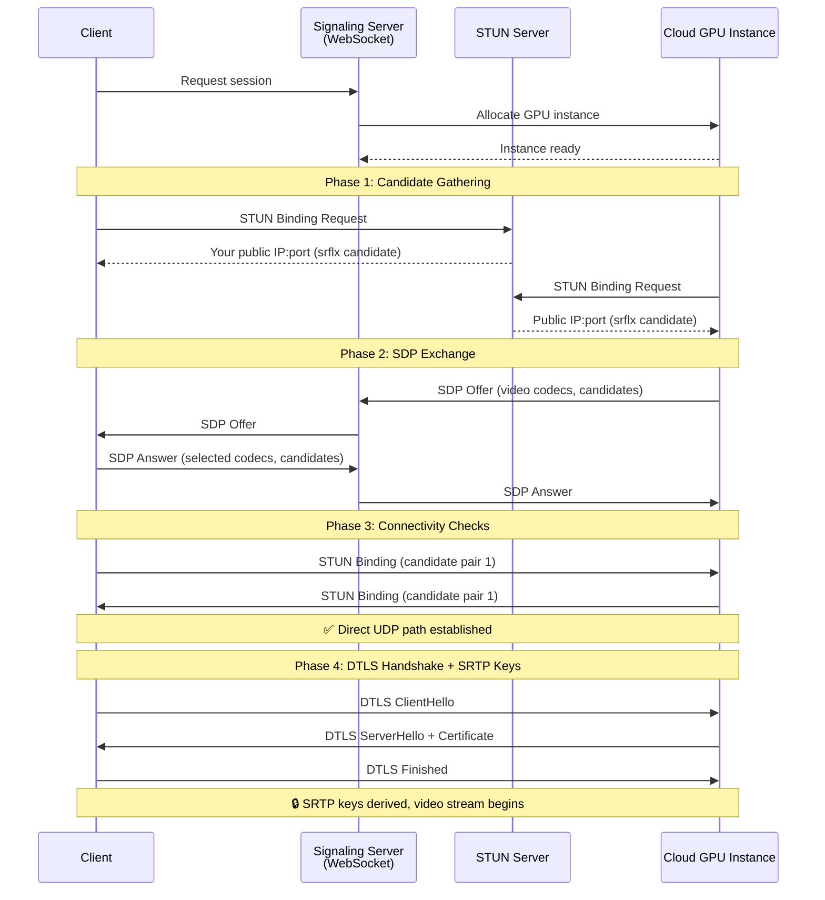
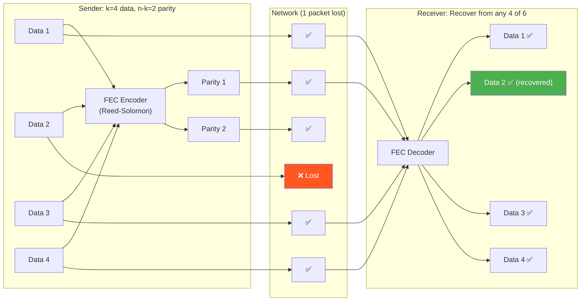
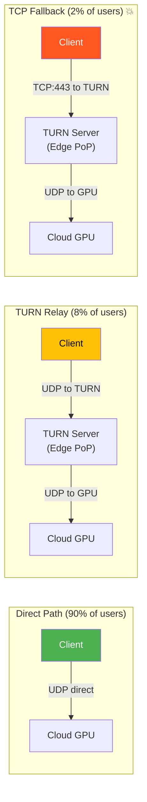

# 2. WebRTC and UDP Streaming 🟡

> **The Problem:** You've built a beautiful hardware-accelerated encoding pipeline that produces pristine H.265 frames in 4 ms. Now you need to get those frames from your GPU instance in Dallas to a player's browser in Chicago — in under 10 ms. HTTP-based streaming protocols (HLS, DASH) buffer 2–30 seconds of content and use TCP, making them fundamentally incompatible with interactive media. You need a transport that tolerates packet loss, delivers frames *immediately*, and works through NATs and firewalls. Welcome to the world of WebRTC — and the art of taming raw UDP for cloud gaming.

**Cross-references:** Chapter 1 established the network transit budget (~10 ms per direction). Chapter 3 produces the encoded frames this chapter transports. Chapter 4 uses the bandwidth estimates from this chapter's congestion controller. Chapter 5 sends input via the DataChannel described here.

---

## 2.1 Why HLS/DASH Cannot Work

HTTP Live Streaming (HLS) and Dynamic Adaptive Streaming over HTTP (DASH) are the dominant protocols for video-on-demand and live streaming. They are also completely unsuitable for cloud gaming.

| Property | HLS/DASH | Cloud Gaming Requirement |
|---|---|---|
| **Transport** | TCP (HTTP/1.1 or HTTP/2) | UDP (no head-of-line blocking) |
| **Segmentation** | 2–10 second segments | Individual frames (~16 ms) |
| **Minimum latency** | 2–6 seconds (LL-HLS: ~2s) | < 20 ms network one-way |
| **Loss handling** | TCP retransmission (RTT penalty) | FEC or skip (no retransmission wait) |
| **Bidirectional** | No (unidirectional from server) | Yes (input + video + telemetry) |
| **NAT traversal** | HTTP works through all NATs | Requires ICE/STUN/TURN |
| **Codec flexibility** | Any (fMP4/TS container) | Low-latency profiles only (no B-frames) |

The killing issue is **TCP's head-of-line blocking**. When a single TCP packet is lost, *all subsequent packets* in the stream are held until the lost packet is retransmitted and received. On a 20 ms RTT link, one lost packet stalls the stream for 20+ ms — exceeding our entire network budget.



---

## 2.2 WebRTC Architecture for Cloud Gaming

WebRTC was designed for peer-to-peer video calling, but its architecture maps well to cloud gaming with modifications. We use three of its core components:

1. **ICE (Interactive Connectivity Establishment)** — NAT traversal
2. **SRTP (Secure Real-time Transport Protocol)** — encrypted video delivery over UDP
3. **DataChannels (SCTP over DTLS)** — bidirectional data (input, telemetry)



### Why Not Just Raw UDP?

Raw UDP is tempting — it has the lowest overhead. But:

| Concern | Raw UDP | WebRTC |
|---|---|---|
| **NAT traversal** | Manual (custom STUN) | Built-in ICE with STUN/TURN |
| **Encryption** | Manual (custom DTLS) | Mandatory DTLS + SRTP |
| **Browser support** | None (requires native app) | Supported in all browsers |
| **Firewall traversal** | Frequently blocked | TURN fallback over 443 |
| **Congestion control** | Manual | GCC/BBR available |

> ⚠️ **Tradeoff:** Some production cloud gaming services (e.g., NVIDIA GeForce NOW) use **custom UDP protocols** instead of WebRTC for their native apps, gaining lower overhead at the cost of browser compatibility. WebRTC is the pragmatic choice when you need to reach browsers and mobile devices.

---

## 2.3 ICE Negotiation: Getting Through the NAT

Before any video can flow, the client and server must establish a UDP connection through potentially multiple layers of NAT. WebRTC's ICE framework handles this.



### Optimizing ICE for Cloud Gaming

Standard ICE is designed for peer-to-peer calls where both endpoints are behind NATs. In cloud gaming, the server has a **known public IP** — we can skip half the negotiation:

```rust,ignore
// ✅ FIX: Use "ICE Lite" on the server side.
// The server doesn't gather candidates or perform connectivity checks.
// It simply responds to the client's checks.
struct IceLiteServer {
    /// The server's public IP:port — known in advance
    host_candidate: SocketAddr,
    /// DTLS fingerprint for certificate verification
    dtls_fingerprint: String,
}

impl IceLiteServer {
    fn generate_sdp_offer(&self, encoder_config: &EncoderConfig) -> SdpOffer {
        SdpOffer {
            // Only one candidate — the server's public address
            candidates: vec![IceCandidate {
                foundation: "1".into(),
                component: 1, // RTP
                transport: "udp".into(),
                priority: 2_130_706_431,
                address: self.host_candidate.ip(),
                port: self.host_candidate.port(),
                candidate_type: CandidateType::Host,
            }],
            ice_lite: true,
            dtls_role: DtlsRole::Server,
            dtls_fingerprint: self.dtls_fingerprint.clone(),
            media: vec![
                // Video track: H.265 at configured bitrate
                MediaDescription {
                    kind: MediaKind::Video,
                    codec: encoder_config.codec, // H265, H264, or AV1
                    payload_type: 96,
                    rtcp_feedback: vec![
                        RtcpFeedback::Nack,
                        RtcpFeedback::PictureLossIndication,
                        RtcpFeedback::ReceiverEstimatedMaxBitrate,
                    ],
                },
                // DataChannel for input
                MediaDescription {
                    kind: MediaKind::Application,
                    codec: Codec::Sctp,
                    payload_type: 0,
                    rtcp_feedback: vec![],
                },
            ],
        }
    }
}
```

> 💥 **Hazard: TURN fallback.** Approximately 8–15% of users are behind symmetric NATs or corporate firewalls that block all UDP. For these users, traffic must relay through a TURN server. TURN adds one extra network hop (typically 5–15 ms) and doubles bandwidth costs. Always deploy TURN servers in the same region as your GPU instances.

---

## 2.4 RTP Packetization for Game Frames

Each encoded video frame must be split into RTP packets for UDP transmission. The maximum UDP payload that avoids IP fragmentation is **1200 bytes** (conservative, to account for tunneling overhead).

### Frame-to-Packet Math

| Resolution | Bitrate | Avg Frame Size | Packets per Frame |
|---|---|---|---|
| 720p @ 60fps | 8 Mbps | ~17 KB | ~14 |
| 1080p @ 60fps | 15 Mbps | ~31 KB | ~26 |
| 1080p @ 60fps | 30 Mbps | ~63 KB | ~52 |
| 4K @ 60fps | 40 Mbps | ~83 KB | ~69 |
| 4K @ 60fps | 50 Mbps | ~104 KB | ~87 |

```rust,ignore
/// RTP packet header for cloud gaming video stream.
/// Follows RFC 3550 with cloud gaming extensions.
#[repr(C, packed)]
struct RtpHeader {
    /// V=2, P=0, X=1 (extension), CC=0
    flags: u8,
    /// M=1 for last packet of frame, PT=96 (dynamic)
    marker_and_pt: u8,
    /// Sequence number (wraps at 65535)
    sequence: u16,
    /// RTP timestamp (90 kHz clock)
    timestamp: u32,
    /// Synchronization source identifier
    ssrc: u32,
}

/// Custom RTP header extension for cloud gaming telemetry.
/// Carries per-frame metadata for latency tracking and FEC.
struct CloudGamingRtpExtension {
    /// Frame sequence number (does not wrap like RTP seq)
    frame_id: u64,
    /// Index of this packet within the frame (0-based)
    packet_index: u16,
    /// Total packets in this frame
    packet_count: u16,
    /// FEC group ID (which FEC block this packet belongs to)
    fec_group: u16,
    /// Server-side encode-complete timestamp (microseconds)
    encode_timestamp_us: u64,
}

/// Packetize an encoded frame into RTP packets.
fn packetize_frame(
    frame: &EncodedFrame,
    ssrc: u32,
    sequence: &mut u16,
    rtp_timestamp: u32,
) -> Vec<Vec<u8>> {
    let max_payload = 1200 - std::mem::size_of::<RtpHeader>()
                           - std::mem::size_of::<CloudGamingRtpExtension>();

    let chunks: Vec<&[u8]> = frame.data.chunks(max_payload).collect();
    let packet_count = chunks.len() as u16;

    chunks
        .iter()
        .enumerate()
        .map(|(i, chunk)| {
            let is_last = i == chunks.len() - 1;
            let header = RtpHeader {
                flags: 0b1001_0000,  // V=2, X=1
                marker_and_pt: if is_last { 0x60 | 0x80 } else { 0x60 },
                sequence: {
                    let seq = *sequence;
                    *sequence = sequence.wrapping_add(1);
                    seq.to_be()
                },
                timestamp: rtp_timestamp.to_be(),
                ssrc: ssrc.to_be(),
            };

            let ext = CloudGamingRtpExtension {
                frame_id: frame.id,
                packet_index: i as u16,
                packet_count,
                fec_group: (frame.id % 256) as u16,
                encode_timestamp_us: frame.encode_complete_us,
            };

            let mut packet = Vec::with_capacity(1200);
            packet.extend_from_slice(&header.as_bytes());
            packet.extend_from_slice(&ext.as_bytes());
            packet.extend_from_slice(chunk);
            packet
        })
        .collect()
}
```

---

## 2.5 Forward Error Correction (FEC)

In cloud gaming, we cannot wait for retransmissions — a retransmission costs at least one full RTT (20+ ms), which would blow the latency budget. Instead, we use **Forward Error Correction (FEC)** to recover lost packets from redundant data sent proactively.

### How FEC Works

The core idea is **Reed-Solomon** or **XOR-based** coding: for every $k$ data packets, we generate $n - k$ parity packets. The receiver can reconstruct any $k$ of the $n$ packets to recover the original data.



### Choosing the FEC Ratio

The FEC ratio must be **adaptive** — too little FEC and you can't recover from losses; too much and you waste bandwidth (which could have been used for higher video quality).

| Network Condition | Packet Loss | FEC Ratio (k:n) | Overhead |
|---|---|---|---|
| Excellent (wired) | < 0.1% | 20:21 | 5% |
| Good (WiFi 5 GHz) | 0.5–1% | 10:12 | 20% |
| Fair (WiFi 2.4 GHz) | 2–5% | 8:12 | 50% |
| Poor (congested WiFi) | 5–10% | 6:12 | 100% |
| Terrible | > 10% | Reduce resolution instead | — |

```rust,ignore
// ✅ Adaptive FEC controller that adjusts redundancy based on observed loss
struct AdaptiveFecController {
    /// Exponentially weighted packet loss rate (0.0 to 1.0)
    loss_rate_ewma: f64,
    /// Current number of data packets per FEC group
    k: usize,
    /// Current total packets (data + parity) per FEC group
    n: usize,
    /// Maximum bandwidth overhead from FEC (as fraction)
    max_overhead: f64,
}

impl AdaptiveFecController {
    fn new() -> Self {
        Self {
            loss_rate_ewma: 0.001,
            k: 20,
            n: 21,
            max_overhead: 0.5, // Never spend more than 50% on FEC
        }
    }

    fn update(&mut self, packets_sent: u64, packets_lost: u64) {
        let measured_loss = packets_lost as f64 / packets_sent.max(1) as f64;
        // EWMA with alpha = 0.1 (smooth but responsive)
        self.loss_rate_ewma = 0.9 * self.loss_rate_ewma + 0.1 * measured_loss;
        self.recalculate_fec_params();
    }

    fn recalculate_fec_params(&mut self) {
        // Target recovery probability: 99.9%
        // For Reed-Solomon, we need (n-k) >= expected losses in a group
        // Expected losses in group of n = n * loss_rate
        // We want: n - k >= n * loss_rate * safety_margin
        let safety_margin = 2.5; // Cover 2.5x expected loss
        let target_parity_ratio = self.loss_rate_ewma * safety_margin;
        let target_parity_ratio = target_parity_ratio.min(self.max_overhead);

        // k stays at 10 for reasonable group sizes
        self.k = 10;
        let parity = (self.k as f64 * target_parity_ratio / (1.0 - target_parity_ratio))
            .ceil() as usize;
        let parity = parity.max(1).min(self.k); // At least 1, at most k
        self.n = self.k + parity;
    }

    fn fec_overhead_percent(&self) -> f64 {
        ((self.n - self.k) as f64 / self.k as f64) * 100.0
    }
}
```

---

## 2.6 Implementing a WebRTC Streaming Server in Rust

Here is the core architecture of a WebRTC streaming server for cloud gaming, built on `webrtc-rs`:

```rust,ignore
use std::sync::Arc;
use tokio::sync::mpsc;

/// Core cloud gaming WebRTC server.
/// Manages a single game session between one GPU instance and one client.
struct CloudGamingSession {
    /// WebRTC peer connection to the client
    peer_connection: Arc<RTCPeerConnection>,
    /// Video track for sending encoded frames
    video_track: Arc<TrackLocalStaticRTP>,
    /// DataChannel for receiving input from the client
    input_channel: Arc<RTCDataChannel>,
    /// DataChannel for sending telemetry to the client
    telemetry_channel: Arc<RTCDataChannel>,
    /// FEC controller
    fec: AdaptiveFecController,
    /// Encoder configuration (updated by adaptive bitrate, Ch 4)
    encoder_config: Arc<tokio::sync::RwLock<EncoderConfig>>,
}

impl CloudGamingSession {
    async fn new(
        signaling: &SignalingClient,
        stun_servers: Vec<String>,
        turn_servers: Vec<TurnConfig>,
    ) -> Result<Self, SessionError> {
        // Configure ICE servers
        let ice_config = RTCConfiguration {
            ice_servers: vec![
                RTCIceServer {
                    urls: stun_servers,
                    ..Default::default()
                },
                RTCIceServer {
                    urls: turn_servers.iter().map(|t| t.url.clone()).collect(),
                    username: turn_servers.first().map(|t| t.username.clone())
                        .unwrap_or_default(),
                    credential: turn_servers.first().map(|t| t.credential.clone())
                        .unwrap_or_default(),
                    ..Default::default()
                },
            ],
            // Use ICE Lite on server side for faster negotiation
            ice_transport_policy: RTCIceTransportPolicy::All,
            ..Default::default()
        };

        let api = APIBuilder::new().build();
        let peer_connection = Arc::new(
            api.new_peer_connection(ice_config).await?
        );

        // Create video track (H.265, 90kHz clock)
        let video_track = Arc::new(TrackLocalStaticRTP::new(
            RTCRtpCodecCapability {
                mime_type: "video/H265".to_string(),
                clock_rate: 90_000,
                ..Default::default()
            },
            "video".to_string(),
            "cloud-gaming".to_string(),
        ));

        peer_connection
            .add_track(video_track.clone())
            .await?;

        // Create input DataChannel (unreliable, unordered for lowest latency)
        let input_channel = peer_connection
            .create_data_channel(
                "input",
                Some(RTCDataChannelInit {
                    ordered: Some(false),
                    max_retransmits: Some(0), // No retransmissions
                    ..Default::default()
                }),
            )
            .await?;

        // Create telemetry DataChannel (reliable, ordered)
        let telemetry_channel = peer_connection
            .create_data_channel("telemetry", None)
            .await?;

        Ok(Self {
            peer_connection,
            video_track,
            input_channel,
            telemetry_channel,
            fec: AdaptiveFecController::new(),
            encoder_config: Arc::new(tokio::sync::RwLock::new(
                EncoderConfig::default(),
            )),
        })
    }

    /// Main loop: read encoded frames and send them as RTP packets.
    async fn stream_loop(
        &mut self,
        mut frame_rx: mpsc::Receiver<EncodedFrame>,
    ) {
        let mut rtp_sequence: u16 = 0;
        let mut rtp_timestamp: u32 = 0;
        let timestamp_increment = 90_000 / 60; // 90kHz / 60fps = 1500

        while let Some(frame) = frame_rx.recv().await {
            // Packetize the encoded frame into RTP packets
            let packets = packetize_frame(
                &frame,
                0x12345678, // SSRC
                &mut rtp_sequence,
                rtp_timestamp,
            );

            // Generate FEC parity packets
            let fec_packets = self.fec.generate_parity(&packets);

            // Send all data packets
            for packet in &packets {
                let _ = self.video_track.write_rtp(
                    &rtp::packet::Packet {
                        header: rtp::header::Header::default(),
                        payload: bytes::Bytes::from(packet.clone()),
                    }
                ).await;
            }

            // Send FEC packets
            for fec_pkt in &fec_packets {
                let _ = self.video_track.write_rtp(
                    &rtp::packet::Packet {
                        header: rtp::header::Header::default(),
                        payload: bytes::Bytes::from(fec_pkt.clone()),
                    }
                ).await;
            }

            rtp_timestamp = rtp_timestamp.wrapping_add(timestamp_increment);
        }
    }
}
```

---

## 2.7 DataChannel for Input Transport

Input frames are sent from the client to the server via a WebRTC DataChannel configured for **unreliable, unordered** delivery — the same semantics as raw UDP but with DTLS encryption and NAT traversal.

```rust,ignore
// ✅ Input DataChannel handler on the server side
async fn handle_input_channel(
    channel: Arc<RTCDataChannel>,
    input_tx: mpsc::Sender<InputFrame>,
) {
    channel.on_message(Box::new(move |msg: DataChannelMessage| {
        let tx = input_tx.clone();
        Box::pin(async move {
            // Deserialize the input frame (CBOR for minimal overhead)
            match ciborium::from_reader::<InputFrame, _>(&msg.data[..]) {
                Ok(input) => {
                    // Non-blocking send to the game engine's input queue
                    let _ = tx.try_send(input);
                }
                Err(e) => {
                    tracing::warn!("Malformed input frame: {}", e);
                }
            }
        })
    }));
}
```

### Why Unreliable + Unordered?

| Mode | Lost Input | Latency Impact | Use Case |
|---|---|---|---|
| Reliable + Ordered (default) | Retransmitted | +20 ms per loss | Chat messages, save data |
| Reliable + Unordered | Retransmitted | +20 ms per loss | File transfers |
| **Unreliable + Unordered** | **Skipped** | **0 ms** | **Input, telemetry** |

A lost input frame from 16 ms ago is **stale** — the player has already moved. Retransmitting it would inject *old* input into the game engine, causing the character to momentarily move backward. It's better to skip it entirely; the next input frame (arriving ~16 ms later) will contain the current state.

---

## 2.8 TURN Fallback and Edge Deployment

When direct UDP is blocked (symmetric NAT, corporate firewalls, hotel WiFi), traffic relays through a TURN server. This is the fallback of last resort.



### Edge PoP Deployment Strategy

| Metric | Target |
|---|---|
| **Client → TURN RTT** | < 10 ms |
| **TURN → GPU RTT** | < 5 ms |
| **TURN bandwidth per user** | 20–50 Mbps |
| **TURN servers per region** | 3+ (redundancy) |
| **Protocol** | TURNS (TURN over TLS on port 443) as final fallback |

> 💥 **Hazard: TURN bandwidth costs.** Every byte of video relayed through TURN costs egress bandwidth twice (client→TURN and TURN→GPU). At 30 Mbps per user, a single TURN relay serving 1000 concurrent sessions consumes **30 Gbps** of bandwidth — a significant operational cost. Minimize TURN usage by deploying in cloud regions with good residential peering.

---

## 2.9 Measuring Transport Quality

The WebRTC stack provides RTCP (RTP Control Protocol) feedback that feeds directly into the adaptive bitrate controller (Chapter 4):

```rust,ignore
/// Transport quality metrics extracted from RTCP receiver reports
/// and WebRTC stats API.
#[derive(Debug, Clone)]
struct TransportMetrics {
    /// Smoothed Round Trip Time in milliseconds
    rtt_ms: f64,
    /// Packet loss rate (0.0 to 1.0) over the last reporting interval
    packet_loss_rate: f64,
    /// Inter-arrival jitter in milliseconds (RFC 3550 algorithm)
    jitter_ms: f64,
    /// Available bandwidth estimate from GCC/REMB (bits per second)
    available_bandwidth_bps: u64,
    /// Number of NACK requests received (indicates decoder stalls)
    nack_count: u64,
    /// Number of PLI (Picture Loss Indication) requests
    pli_count: u64,
    /// Whether we're currently relaying through TURN
    using_turn: bool,
    /// Whether we fell back to TCP (worst case)
    using_tcp: bool,
}

impl TransportMetrics {
    /// Compute a composite quality score (0.0 = unusable, 1.0 = perfect)
    fn quality_score(&self) -> f64 {
        let mut score = 1.0;

        // Penalize high RTT
        if self.rtt_ms > 30.0 {
            score -= (self.rtt_ms - 30.0) / 100.0;
        }

        // Penalize packet loss
        score -= self.packet_loss_rate * 5.0;

        // Penalize high jitter
        if self.jitter_ms > 5.0 {
            score -= (self.jitter_ms - 5.0) / 50.0;
        }

        // TCP fallback is a major quality hit
        if self.using_tcp {
            score -= 0.3;
        }

        score.clamp(0.0, 1.0)
    }
}
```

---

> **Key Takeaways**
>
> - **HLS/DASH are incompatible** with cloud gaming due to TCP head-of-line blocking and multi-second segment latency.
> - **WebRTC** provides the right primitives: ICE for NAT traversal, SRTP for encrypted UDP video, and DataChannels for bidirectional input.
> - Use **ICE Lite** on the server to halve the negotiation time — the server has a known public IP.
> - **Forward Error Correction (FEC)** replaces retransmission: send proactive parity packets so the receiver can reconstruct lost data without waiting a full RTT.
> - The FEC ratio must be **adaptive** — increase redundancy when packet loss rises, decrease it on clean links to save bandwidth for video quality.
> - Configure input DataChannels as **unreliable + unordered** — stale input is worse than lost input.
> - Deploy **TURN servers** at edge PoPs for the ~10% of users behind restrictive NATs, but minimize usage due to bandwidth cost.
> - Feed transport metrics (RTT, loss, jitter, bandwidth estimate) into the adaptive bitrate controller (Chapter 4).
