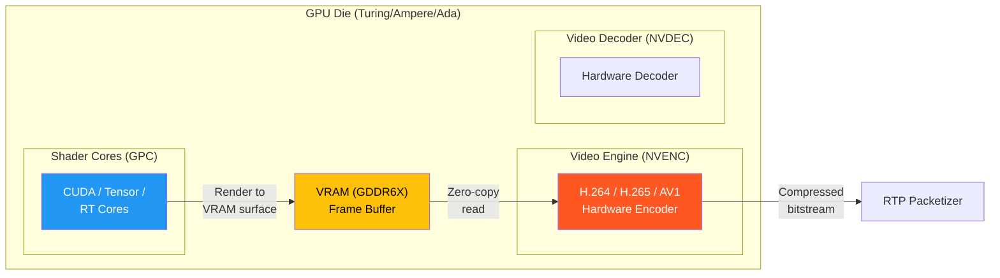
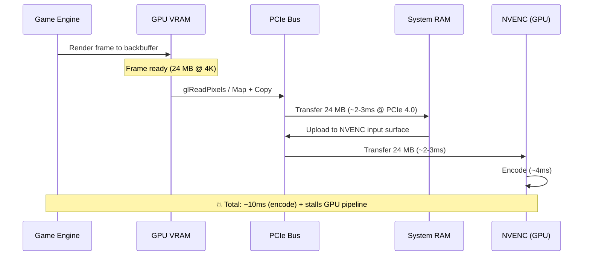
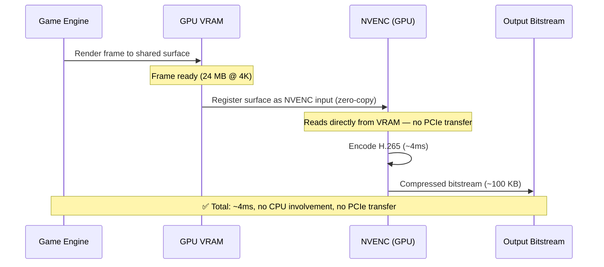
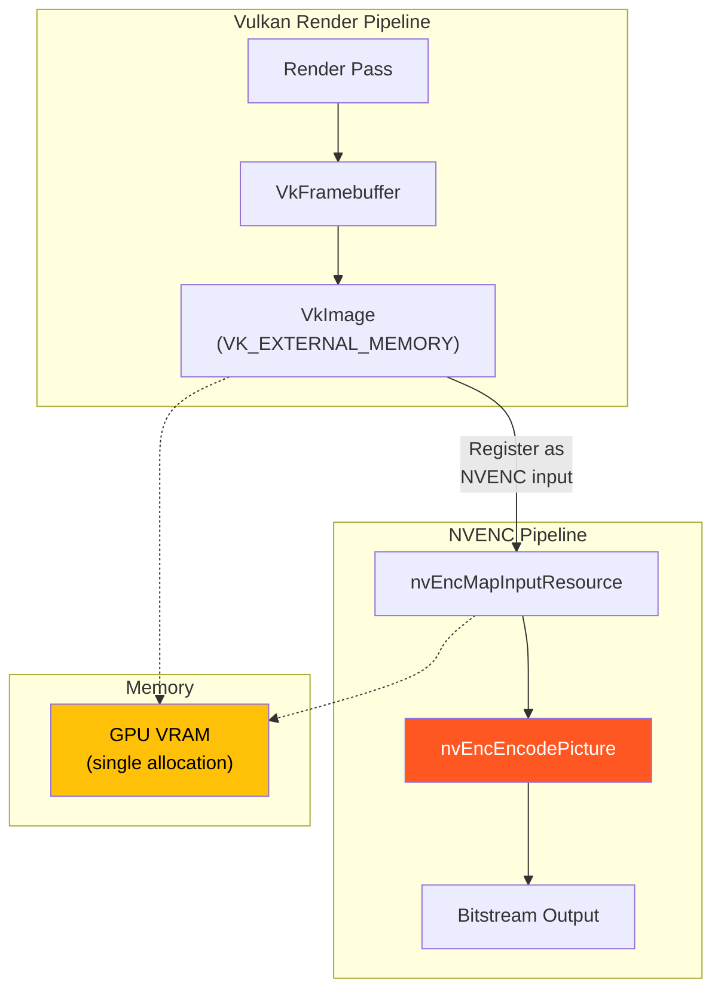
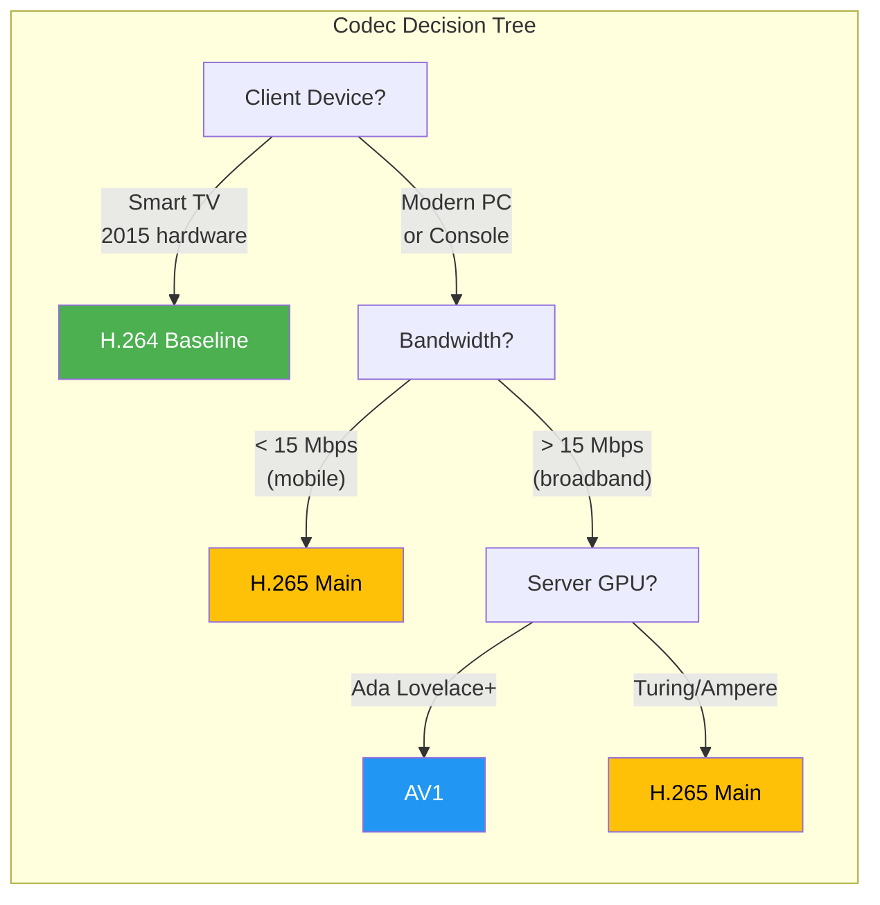

# 3. Hardware Video Encoding (NVENC) 🔴

> **The Problem:** Your game engine just rendered a gorgeous 4K frame at 60 fps. That frame — 33 million pixels, 8.3 megapixels, roughly **24 MB of raw RGBA data** — must be compressed to ~100 KB and transmitted over a 50 Mbps link in under 4 milliseconds. Software encoding (x264/x265) on a 16-core CPU can manage *maybe* 1080p at 30 fps with a low-latency preset — nowhere near your requirements. You need the GPU's **dedicated hardware encoder** (NVIDIA NVENC), and you need it to read the rendered frame directly from VRAM without ever copying it to system RAM.

**Cross-references:** Chapter 1 established the 4 ms encode budget. Chapter 2 packetizes the encoded frame into RTP packets. Chapter 4 dynamically adjusts the encoder's bitrate and resolution.

---

## 3.1 Why Software Encoding Is Not an Option

Let's be precise about why CPU encoding fails for cloud gaming:

| Encoder | Hardware | 1080p60 Latency | 4K60 Latency | CPU Usage | Can Pipeline with GPU Render? |
|---|---|---|---|---|---|
| **x264** (ultrafast) | 16-core Xeon | ~15 ms | ~60 ms | 100% (all cores) | No |
| **x264** (veryfast) | 16-core Xeon | ~25 ms | ~100 ms | 100% | No |
| **x265** (ultrafast) | 16-core Xeon | ~35 ms | ~150 ms | 100% | No |
| **NVENC** (low-latency) | Turing+ GPU | ~2–3 ms | ~4–5 ms | 0% | **Yes** |
| **NVENC** (low-latency) | Ada Lovelace | ~1.5–2 ms | ~3–4 ms | 0% | **Yes** |
| **AMD VCN** (low-latency) | RDNA2+ | ~3–4 ms | ~5–6 ms | 0% | **Yes** |
| **Intel QSV** (low-latency) | Arc A-series | ~3 ms | ~5 ms | 0% | **Yes** |

The critical insight is not just speed — it's that NVENC uses **dedicated ASIC silicon** separate from the CUDA cores. The GPU can render Frame N+1 on its shader cores while NVENC encodes Frame N *simultaneously*, with zero contention.



---

## 3.2 The NVENC Pipeline: Zero-Copy Frame Capture

The most critical optimization in the entire cloud gaming stack is ensuring the rendered frame **never leaves GPU VRAM**. Here's what happens with and without zero-copy:

### 💥 The Naive Approach: GPU → CPU → GPU Roundtrip



```rust,ignore
// 💥 HAZARD: Reading back the frame buffer to CPU memory
// This is the single worst thing you can do for latency
unsafe fn capture_frame_naive(gl_context: &GlContext) -> Vec<u8> {
    let mut pixels = vec![0u8; 3840 * 2160 * 4]; // 24 MB for 4K RGBA

    // This call STALLS the GPU pipeline until all rendering completes,
    // then copies 24 MB over PCIe to system RAM.
    // Cost: 2-5ms stall + 2-3ms transfer = 4-8ms wasted
    gl::ReadPixels(
        0, 0, 3840, 2160,
        gl::RGBA, gl::UNSIGNED_BYTE,
        pixels.as_mut_ptr() as *mut _,
    );

    pixels // Now you have to upload this BACK to the GPU for NVENC...
}
```

### ✅ The Production Approach: VRAM → NVENC Direct



The key API calls are:

1. **Create a shared surface** that both the game's rendering API (D3D11/D3D12/Vulkan) and NVENC can access.
2. **Register that surface** with NVENC as an input resource.
3. After each frame render, **signal NVENC** to encode from the shared surface.
4. Read the compressed bitstream (tiny — ~100 KB) from NVENC's output buffer.

---

## 3.3 NVENC API: Low-Level Interface

NVIDIA's NVENC API is a C API (`nvEncodeAPI.h`). Here's the Rust FFI wrapper for the critical path:

```rust,ignore
/// NVENC session wrapper for cloud gaming.
/// Manages the encode pipeline with zero-copy from a D3D11 render target.
struct NvencSession {
    /// Opaque NVENC encoder handle
    encoder: *mut c_void,
    /// Function table loaded from nvEncodeAPI64.dll / libnvidia-encode.so
    api: NV_ENCODE_API_FUNCTION_LIST,
    /// Registered input resource (shared D3D11 texture)
    registered_input: NV_ENC_REGISTERED_PTR,
    /// Mapped input resource for the current frame
    mapped_input: NV_ENC_INPUT_PTR,
    /// Output bitstream buffer
    output_buffer: NV_ENC_OUTPUT_PTR,
    /// Encode configuration
    config: NvencConfig,
}

/// Encoder configuration tuned for cloud gaming.
#[derive(Debug, Clone)]
struct NvencConfig {
    /// Target codec (H264, H265, AV1)
    codec: NvencCodec,
    /// Encode width
    width: u32,
    /// Encode height
    height: u32,
    /// Target bitrate in bits per second
    bitrate_bps: u32,
    /// Maximum bitrate (for VBR mode)
    max_bitrate_bps: u32,
    /// Frame rate numerator
    fps_num: u32,
    /// Frame rate denominator  
    fps_den: u32,
    /// GOP (Group of Pictures) length — distance between keyframes
    gop_length: u32,
    /// Rate control mode
    rate_control: RateControlMode,
}

#[derive(Debug, Clone, Copy)]
enum NvencCodec {
    H264,
    H265,
    AV1,
}

#[derive(Debug, Clone, Copy)]
enum RateControlMode {
    /// Constant Bitrate — predictable bandwidth, worst quality
    Cbr,
    /// Variable Bitrate — best quality, unpredictable bandwidth
    Vbr,
    /// Constant QP — fixed quality, wildly variable bitrate
    ConstQp,
}
```

### Initializing NVENC for Low-Latency Cloud Gaming

```rust,ignore
impl NvencSession {
    /// Create and configure an NVENC session optimized for cloud gaming.
    ///
    /// # Safety
    /// Requires a valid D3D11 device and NVIDIA driver.
    unsafe fn new(
        d3d11_device: *mut ID3D11Device,
        config: NvencConfig,
    ) -> Result<Self, NvencError> {
        // Load the NVENC API
        let mut api = std::mem::zeroed::<NV_ENCODE_API_FUNCTION_LIST>();
        api.version = NV_ENCODE_API_FUNCTION_LIST_VER;
        NvEncodeAPICreateInstance(&mut api)?;

        // Open an encode session on the D3D11 device
        let mut session_params = NV_ENC_OPEN_ENCODE_SESSION_EX_PARAMS {
            version: NV_ENC_OPEN_ENCODE_SESSION_EX_PARAMS_VER,
            deviceType: NV_ENC_DEVICE_TYPE_DIRECTX,
            device: d3d11_device as *mut c_void,
            ..std::mem::zeroed()
        };
        let mut encoder = std::ptr::null_mut();
        (api.nvEncOpenEncodeSessionEx)(&mut session_params, &mut encoder)?;

        // Configure the encoder for ultra-low-latency
        let mut encode_config = std::mem::zeroed::<NV_ENC_CONFIG>();
        encode_config.version = NV_ENC_CONFIG_VER;

        // Preset: Low Latency High Performance
        let mut preset_config = std::mem::zeroed::<NV_ENC_PRESET_CONFIG>();
        preset_config.version = NV_ENC_PRESET_CONFIG_VER;
        (api.nvEncGetEncodePresetConfigEx)(
            encoder,
            config.codec.to_guid(),
            NV_ENC_PRESET_P1_GUID, // Fastest preset
            NV_ENC_TUNING_INFO_ULTRA_LOW_LATENCY,
            &mut preset_config,
        )?;
        encode_config = preset_config.presetCfg;

        // Override rate control
        encode_config.rcParams.rateControlMode = match config.rate_control {
            RateControlMode::Cbr => NV_ENC_PARAMS_RC_CBR,
            RateControlMode::Vbr => NV_ENC_PARAMS_RC_VBR,
            RateControlMode::ConstQp => NV_ENC_PARAMS_RC_CONSTQP,
        };
        encode_config.rcParams.averageBitRate = config.bitrate_bps;
        encode_config.rcParams.maxBitRate = config.max_bitrate_bps;

        // ✅ Critical for cloud gaming: disable B-frames entirely
        // B-frames add 1 frame of encoding latency (16.67ms at 60fps)
        encode_config.frameIntervalP = 1; // No B-frames
        encode_config.gopLength = config.gop_length;

        // ✅ Enable single-slice encoding for lowest latency
        // Multi-slice can parallelize but adds assembly overhead
        match config.codec {
            NvencCodec::H264 => {
                encode_config.encodeCodecConfig.h264Config.sliceMode = 0;
                encode_config.encodeCodecConfig.h264Config.repeatSPSPPS = 1;
                // ✅ Intra-refresh instead of full IDR frames
                // Spreads the keyframe cost across multiple frames
                encode_config.encodeCodecConfig.h264Config
                    .enableIntraRefresh = 1;
                encode_config.encodeCodecConfig.h264Config
                    .intraRefreshPeriod = config.gop_length;
                encode_config.encodeCodecConfig.h264Config
                    .intraRefreshCnt = 5; // Refresh over 5 frames
            },
            NvencCodec::H265 => {
                encode_config.encodeCodecConfig.hevcConfig.sliceMode = 0;
                encode_config.encodeCodecConfig.hevcConfig.repeatSPSPPS = 1;
                encode_config.encodeCodecConfig.hevcConfig
                    .enableIntraRefresh = 1;
                encode_config.encodeCodecConfig.hevcConfig
                    .intraRefreshPeriod = config.gop_length;
                encode_config.encodeCodecConfig.hevcConfig
                    .intraRefreshCnt = 5;
            },
            NvencCodec::AV1 => {
                // AV1 on Ada Lovelace: similar low-latency tuning
            },
        }

        // Initialize the encoder
        let mut init_params = NV_ENC_INITIALIZE_PARAMS {
            version: NV_ENC_INITIALIZE_PARAMS_VER,
            encodeGUID: config.codec.to_guid(),
            presetGUID: NV_ENC_PRESET_P1_GUID,
            encodeWidth: config.width,
            encodeHeight: config.height,
            darWidth: config.width,
            darHeight: config.height,
            frameRateNum: config.fps_num,
            frameRateDen: config.fps_den,
            enableEncodeAsync: 1, // ✅ Async encode — non-blocking
            enablePTD: 1, // Picture type decision by encoder
            encodeConfig: &mut encode_config,
            tuningInfo: NV_ENC_TUNING_INFO_ULTRA_LOW_LATENCY,
            ..std::mem::zeroed()
        };
        (api.nvEncInitializeEncoder)(encoder, &mut init_params)?;

        // ... register input/output buffers (see next section)

        Ok(Self {
            encoder,
            api,
            registered_input: std::ptr::null_mut(),
            mapped_input: std::ptr::null_mut(),
            output_buffer: std::ptr::null_mut(),
            config,
        })
    }
}
```

---

## 3.4 Zero-Copy: Registering the D3D11 Render Target

The magic of zero-copy encoding: we register the game's render target texture directly with NVENC so it can read from it without any copies.

```rust,ignore
impl NvencSession {
    /// Register a D3D11 texture as an NVENC input resource.
    /// The texture MUST be created with D3D11_BIND_RENDER_TARGET
    /// and shared between the game engine and NVENC.
    unsafe fn register_d3d11_texture(
        &mut self,
        texture: *mut ID3D11Texture2D,
    ) -> Result<(), NvencError> {
        let mut register_params = NV_ENC_REGISTER_RESOURCE {
            version: NV_ENC_REGISTER_RESOURCE_VER,
            resourceType: NV_ENC_INPUT_RESOURCE_TYPE_DIRECTX,
            resourceToRegister: texture as *mut c_void,
            width: self.config.width,
            height: self.config.height,
            // ✅ Match the game's render target format
            // NV12 is preferred but ARGB works with auto-conversion
            bufferFormat: NV_ENC_BUFFER_FORMAT_ARGB,
            bufferUsage: NV_ENC_INPUT_IMAGE,
            ..std::mem::zeroed()
        };

        (self.api.nvEncRegisterResource)(
            self.encoder,
            &mut register_params,
        )?;

        self.registered_input = register_params.registeredResource;

        // Allocate output bitstream buffer
        let mut output_params = NV_ENC_CREATE_BITSTREAM_BUFFER {
            version: NV_ENC_CREATE_BITSTREAM_BUFFER_VER,
            ..std::mem::zeroed()
        };
        (self.api.nvEncCreateBitstreamBuffer)(
            self.encoder,
            &mut output_params,
        )?;
        self.output_buffer = output_params.bitstreamBuffer;

        Ok(())
    }
}
```

### The Vulkan Path

For games using Vulkan, the flow is similar but uses `VkImage` + external memory:



```rust,ignore
// ✅ Vulkan zero-copy: export the VkImage as an NVENC-compatible handle
unsafe fn register_vulkan_image(
    session: &mut NvencSession,
    vk_image: vk::Image,
    vk_device_memory: vk::DeviceMemory,
    width: u32,
    height: u32,
) -> Result<(), NvencError> {
    // Get the OS handle for the VkDeviceMemory
    let fd_info = vk::MemoryGetFdInfoKHR {
        memory: vk_device_memory,
        handle_type: vk::ExternalMemoryHandleTypeFlags::OPAQUE_FD,
        ..Default::default()
    };

    // On Linux: use file descriptor; On Windows: use NT handle
    let fd = vk_device.get_memory_fd(&fd_info)?;

    // Register with NVENC using the CUDA interop path
    let mut cuda_resource = std::ptr::null_mut();
    cuExternalMemoryGetMappedBuffer(
        &mut cuda_resource,
        fd,
        width as usize * height as usize * 4,
    )?;

    let mut register_params = NV_ENC_REGISTER_RESOURCE {
        version: NV_ENC_REGISTER_RESOURCE_VER,
        resourceType: NV_ENC_INPUT_RESOURCE_TYPE_CUDADEVICEPTR,
        resourceToRegister: cuda_resource,
        width,
        height,
        bufferFormat: NV_ENC_BUFFER_FORMAT_ARGB,
        ..std::mem::zeroed()
    };

    (session.api.nvEncRegisterResource)(
        session.encoder,
        &mut register_params,
    )?;

    session.registered_input = register_params.registeredResource;
    Ok(())
}
```

---

## 3.5 The Encode Loop: Frame-by-Frame

Here is the critical hot path — the per-frame encode function that must complete in under 4 ms:

```rust,ignore
/// Encoded frame output, ready for RTP packetization (Chapter 2).
struct EncodedFrame {
    /// Unique frame identifier
    id: u64,
    /// Compressed H.264/H.265/AV1 bitstream
    data: Vec<u8>,
    /// Whether this is a keyframe (IDR/I-frame)
    is_keyframe: bool,
    /// Presentation timestamp (90 kHz clock)
    pts: u64,
    /// Server-side timestamp when encode completed (microseconds)
    encode_complete_us: u64,
    /// Encode duration in microseconds
    encode_duration_us: u64,
}

impl NvencSession {
    /// Encode one frame from the registered D3D11/Vulkan surface.
    /// This function is called once per frame (60 times per second).
    ///
    /// # Safety
    /// The registered texture must contain a valid rendered frame.
    /// The GPU fence from the render pass must have been signaled.
    unsafe fn encode_frame(
        &mut self,
        frame_id: u64,
        pts: u64,
        force_keyframe: bool,
    ) -> Result<EncodedFrame, NvencError> {
        let encode_start = std::time::Instant::now();

        // Step 1: Map the registered resource for this encode
        let mut map_params = NV_ENC_MAP_INPUT_RESOURCE {
            version: NV_ENC_MAP_INPUT_RESOURCE_VER,
            registeredResource: self.registered_input,
            ..std::mem::zeroed()
        };
        (self.api.nvEncMapInputResource)(
            self.encoder,
            &mut map_params,
        )?;
        let mapped_resource = map_params.mappedResource;

        // Step 2: Submit the encode
        let mut pic_params = NV_ENC_PIC_PARAMS {
            version: NV_ENC_PIC_PARAMS_VER,
            inputBuffer: mapped_resource,
            bufferFmt: map_params.mappedBufferFmt,
            inputWidth: self.config.width,
            inputHeight: self.config.height,
            outputBitstream: self.output_buffer,
            pictureStruct: NV_ENC_PIC_STRUCT_FRAME,
            inputTimeStamp: pts,
            ..std::mem::zeroed()
        };

        // Force IDR keyframe when requested by adaptive bitrate (Ch 4)
        // or after a PLI request from the client
        if force_keyframe {
            pic_params.encodePicFlags = NV_ENC_PIC_FLAG_FORCEIDR
                | NV_ENC_PIC_FLAG_OUTPUT_SPSPPS;
        }

        (self.api.nvEncEncodePicture)(self.encoder, &mut pic_params)?;

        // Step 3: Lock and read the output bitstream
        let mut lock_params = NV_ENC_LOCK_BITSTREAM {
            version: NV_ENC_LOCK_BITSTREAM_VER,
            outputBitstream: self.output_buffer,
            ..std::mem::zeroed()
        };
        (self.api.nvEncLockBitstream)(self.encoder, &mut lock_params)?;

        let bitstream = std::slice::from_raw_parts(
            lock_params.bitstreamBufferPtr as *const u8,
            lock_params.bitstreamSizeInBytes as usize,
        ).to_vec();

        let is_keyframe = lock_params.pictureType == NV_ENC_PIC_TYPE_IDR;

        (self.api.nvEncUnlockBitstream)(self.encoder, self.output_buffer)?;

        // Step 4: Unmap the input resource
        (self.api.nvEncUnmapInputResource)(self.encoder, mapped_resource)?;

        let encode_duration = encode_start.elapsed();

        Ok(EncodedFrame {
            id: frame_id,
            data: bitstream,
            is_keyframe,
            pts,
            encode_complete_us: precise_clock_us(),
            encode_duration_us: encode_duration.as_micros() as u64,
        })
    }
}
```

---

## 3.6 Codec Selection: H.264 vs H.265 vs AV1

The choice of codec affects latency, quality, client compatibility, and bandwidth:

| Property | H.264 (AVC) | H.265 (HEVC) | AV1 |
|---|---|---|---|
| **NVENC encode latency** | ~2 ms (1080p) | ~3.5 ms (1080p) | ~3 ms (Ada+) |
| **Compression efficiency** | Baseline | ~40% better than H.264 | ~50% better than H.264 |
| **Client HW decode support** | Universal | Widespread (post-2016) | Growing (post-2020 devices) |
| **Browser decode support** | Universal | Safari + Chrome (partial) | Chrome, Firefox, Safari |
| **Patent licensing** | Yes (AVC-LA) | Yes (complex, HEVC Advance) | Royalty-free |
| **NVENC GPU requirement** | Kepler+ | Maxwell+ | Ada Lovelace+ |
| **Recommended for** | Maximum compatibility | Bandwidth-constrained | Next-gen, royalty-free |



> ⚠️ **Tradeoff: Intra-refresh vs IDR keyframes.** A full IDR keyframe at 4K can be 500 KB — 5× larger than a P-frame. This causes a bitrate spike that can trigger congestion. **Intra-refresh** spreads the keyframe cost across multiple frames by refreshing a vertical band of macroblocks each frame. The downside: error recovery takes multiple frames instead of one.

---

## 3.7 Advanced: Async Encode Pipeline

In a production system, the encode loop uses **async completion** — NVENC signals a GPU event when encoding is done, allowing the CPU to submit the next frame immediately without polling.

```rust,ignore
/// Production async encode pipeline.
/// Encodes frames on the NVENC engine while the CUDA cores render the next frame.
struct AsyncEncodePipeline {
    session: NvencSession,
    /// Completion events for async encode
    events: Vec<NvencCompletionEvent>,
    /// Double-buffered input surfaces
    input_surfaces: [NV_ENC_REGISTERED_PTR; 2],
    /// Double-buffered output buffers
    output_buffers: [NV_ENC_OUTPUT_PTR; 2],
    /// Current buffer index (ping-pong)
    current_buffer: usize,
    /// Frame counter
    frame_count: u64,
}

impl AsyncEncodePipeline {
    /// Submit a frame for encoding (non-blocking).
    /// Returns the encoded frame from the *previous* submission.
    unsafe fn submit_and_collect(
        &mut self,
        force_keyframe: bool,
    ) -> Result<Option<EncodedFrame>, NvencError> {
        let current = self.current_buffer;
        let previous = 1 - current;

        // Collect the previous frame's encode result (if any)
        let previous_frame = if self.frame_count > 0 {
            // Wait for the previous encode to complete
            self.events[previous].wait()?;
            Some(self.read_bitstream(previous)?)
        } else {
            None
        };

        // Submit the current frame for encoding (non-blocking)
        self.submit_encode(current, force_keyframe)?;

        // Ping-pong to the other buffer
        self.current_buffer = previous;
        self.frame_count += 1;

        Ok(previous_frame)
    }
}
```

### Pipeline Timing

```mermaid
gantt
    title Async Encode Pipeline (Double-Buffered)
    dateFormat X
    axisFormat %L ms

    section Frame N (Buffer A)
    Render N          :a1, 0, 5
    NVENC Encode N    :a2, 5, 9
    Read Bitstream N  :a3, 14, 15

    section Frame N+1 (Buffer B)
    Render N+1        :b1, 5, 10
    NVENC Encode N+1  :b2, 10, 14
    Read Bitstream N+1:b3, 19, 20

    section Frame N+2 (Buffer A)
    Render N+2        :c1, 10, 15
    NVENC Encode N+2  :c2, 15, 19
```



With double-buffering:
- While NVENC encodes Frame N, CUDA cores render Frame N+1.
- While NVENC encodes Frame N+1, we read Frame N's bitstream and submit it to the network.
- The pipeline stays full at 60 fps with no stalls.

---

## 3.8 Multi-GPU and NVENC Session Limits

NVIDIA GPUs have a **hard limit** on concurrent NVENC sessions:

| GPU Family | Max Concurrent Sessions | Workaround |
|---|---|---|
| GeForce (consumer) | 3 (driver-limited) | Use Tesla/A-series for datacenter |
| Quadro / RTX A-series | Unlimited | Preferred for cloud gaming |
| Tesla T4 / A10 / A100 | Unlimited | Datacenter standard |
| L4 / L40 (Ada) | Unlimited | Best perf/watt for encoding |

> 💥 **Hazard: Consumer GPU session limits.** NVIDIA artificially limits consumer GPUs (GeForce RTX) to 3 concurrent NVENC sessions. If you try to deploy cloud gaming on GeForce hardware, you can serve at most 3 simultaneous users per GPU. Datacenter GPUs (A10, L4, L40) have no session limit and are essential for multi-tenant deployment.

### Multi-Tenant GPU Sharing

```rust,ignore
/// GPU resource manager for multi-tenant cloud gaming.
/// Each game session gets its own NVENC session and a share of the GPU.
struct GpuResourceManager {
    /// Available GPUs in this host
    gpus: Vec<GpuDevice>,
    /// Active sessions per GPU
    sessions: HashMap<GpuId, Vec<SessionId>>,
    /// Maximum sessions per GPU (based on NVENC capacity and VRAM)
    max_sessions_per_gpu: usize,
}

impl GpuResourceManager {
    fn allocate_session(
        &mut self,
        resolution: Resolution,
        fps: u32,
    ) -> Result<GpuAllocation, AllocationError> {
        // Find GPU with available capacity
        let gpu = self.gpus.iter()
            .find(|g| {
                let current = self.sessions.get(&g.id)
                    .map_or(0, |s| s.len());
                let vram_available = g.total_vram_mb
                    - self.vram_used(g.id);
                let vram_needed = estimate_vram_mb(resolution, fps);

                current < self.max_sessions_per_gpu
                    && vram_available >= vram_needed
            })
            .ok_or(AllocationError::NoCapacity)?;

        Ok(GpuAllocation {
            gpu_id: gpu.id,
            nvenc_session_id: self.create_nvenc_session(gpu.id)?,
            vram_budget_mb: estimate_vram_mb(resolution, fps),
        })
    }
}

/// Estimate VRAM needed per session.
fn estimate_vram_mb(resolution: Resolution, fps: u32) -> u64 {
    let pixels = resolution.width as u64 * resolution.height as u64;
    let bytes_per_pixel = 4; // RGBA
    let frame_size_mb = (pixels * bytes_per_pixel) / (1024 * 1024);

    // Need: 2x render target (double buffer) + NVENC buffers + game VRAM
    let render_targets = frame_size_mb * 2;
    let nvenc_buffers = frame_size_mb; // Input + output
    let game_budget = 2048; // 2 GB baseline for game assets

    render_targets + nvenc_buffers + game_budget
}
```

---

## 3.9 Quality Metrics: Measuring Encode Quality

Encode quality is measured in real-time and fed back to the adaptive bitrate controller (Chapter 4):

| Metric | Description | Target |
|---|---|---|
| **PSNR** | Peak Signal-to-Noise Ratio | > 38 dB (visually lossless) |
| **SSIM** | Structural Similarity | > 0.95 |
| **VMAF** | Netflix's Perceptual Quality | > 80 (good), > 90 (excellent) |
| **Encode time** | Wall-clock encode duration | < 4 ms (1080p), < 6 ms (4K) |
| **Bitstream size** | Compressed frame size | Within bitrate target ± 20% |

```rust,ignore
/// Real-time encode quality tracker.
/// Monitors per-frame encode performance for the adaptive bitrate controller.
struct EncodeQualityTracker {
    /// Rolling window of encode durations (microseconds)
    encode_times_us: VecDeque<u64>,
    /// Rolling window of frame sizes (bytes)
    frame_sizes: VecDeque<usize>,
    /// Whether we've recently exceeded the encode time budget
    over_budget_count: u64,
    /// Window size for rolling averages
    window_size: usize,
}

impl EncodeQualityTracker {
    fn record_frame(&mut self, duration_us: u64, size_bytes: usize) {
        if self.encode_times_us.len() >= self.window_size {
            self.encode_times_us.pop_front();
            self.frame_sizes.pop_front();
        }
        self.encode_times_us.push_back(duration_us);
        self.frame_sizes.push_back(size_bytes);

        if duration_us > 4_000 { // > 4ms encode time
            self.over_budget_count += 1;
        }
    }

    fn average_encode_time_ms(&self) -> f64 {
        let sum: u64 = self.encode_times_us.iter().sum();
        sum as f64 / self.encode_times_us.len().max(1) as f64 / 1000.0
    }

    fn average_frame_size_kb(&self) -> f64 {
        let sum: usize = self.frame_sizes.iter().sum();
        sum as f64 / self.frame_sizes.len().max(1) as f64 / 1024.0
    }

    fn effective_bitrate_mbps(&self, fps: f64) -> f64 {
        self.average_frame_size_kb() * 8.0 * fps / 1000.0
    }
}
```

---

> **Key Takeaways**
>
> - **Software encoding is 10–50× too slow** for cloud gaming. NVENC on dedicated ASIC silicon is the only viable path.
> - The **zero-copy pipeline** is the single most important optimization: render to a shared VRAM surface, register it with NVENC, and encode without any PCIe transfers.
> - Configure NVENC with **Ultra Low Latency tuning**, **no B-frames**, and **intra-refresh** instead of full IDR keyframes.
> - Use an **async double-buffered pipeline** so NVENC encodes Frame N while CUDA renders Frame N+1.
> - Codec choice depends on client compatibility (H.264 universal, H.265 efficient, AV1 future-proof and royalty-free).
> - Consumer GPUs are limited to **3 NVENC sessions** — use datacenter GPUs (A10, L4, L40) for multi-tenant deployment.
> - Monitor encode time, frame size, and quality metrics in real-time and feed them to the adaptive bitrate controller (Chapter 4).
