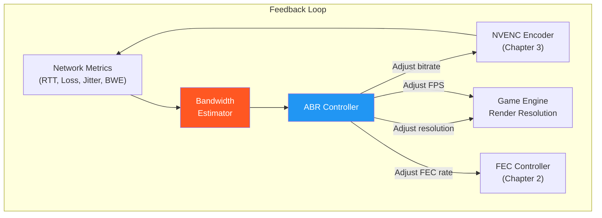
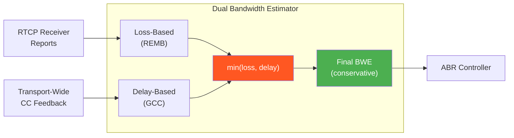
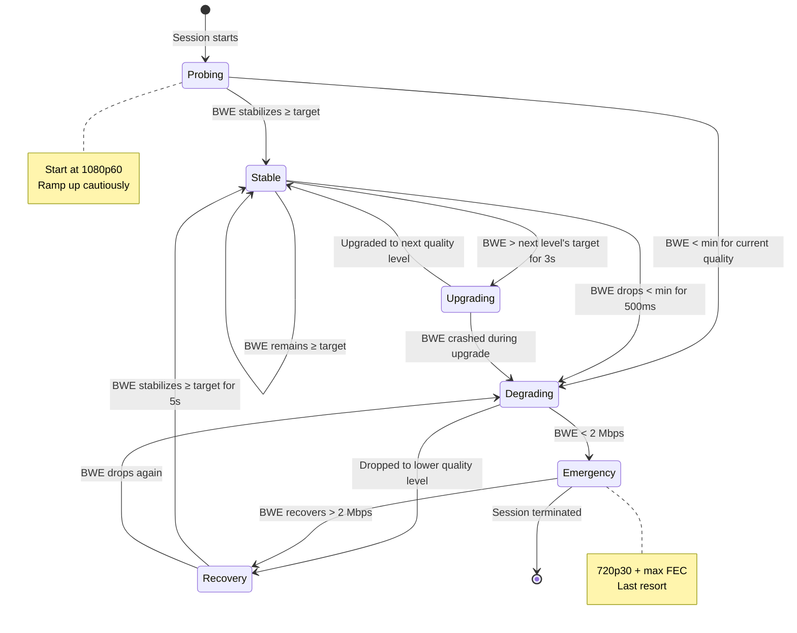
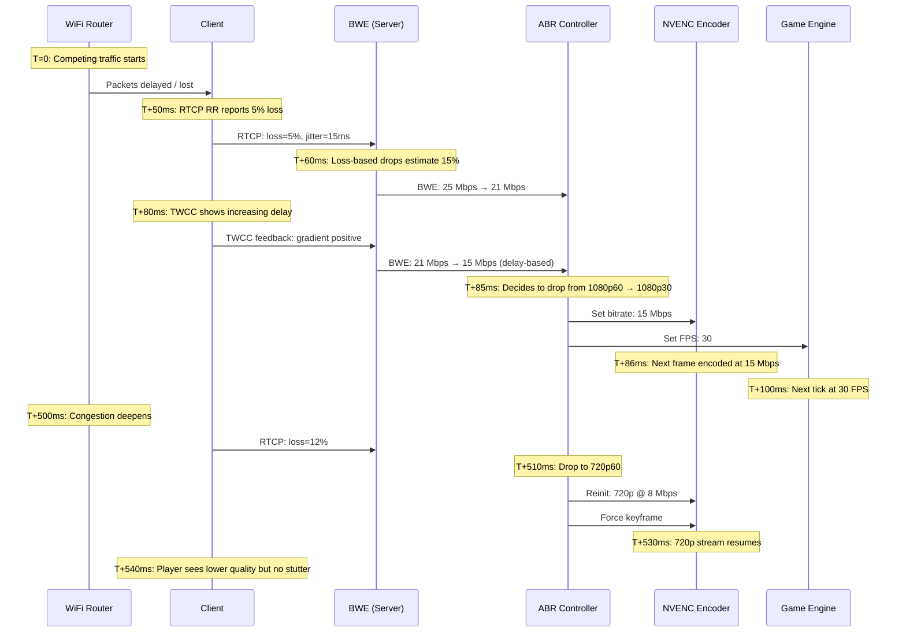

# 4. Adaptive Bitrate and Network Congestion 🔴

> **The Problem:** Your player is mid-match in a fast-paced shooter, streaming at 1080p/60fps over a 30 Mbps link. Their roommate starts a 4K Netflix stream. Within 200 milliseconds, available bandwidth drops to 8 Mbps — but your encoder is still producing 30 Mbps of data. Packets queue in the router, jitter spikes to 50 ms, packet loss hits 15%, and the player's screen freezes for two full seconds. By the time a keyframe arrives and playback resumes, the player is dead and the session is over. You needed to detect the congestion, reduce bitrate, and adapt the encoder — all within a single frame interval (~16 ms).

**Cross-references:** Chapter 1 established the latency budget that congestion violates. Chapter 2 provides the transport metrics (RTT, loss, jitter, bandwidth estimate) that drive adaptation. Chapter 3's NVENC encoder is the actuator — the system we dynamically reconfigure.

---

## 4.1 The Congestion Problem in Cloud Gaming

Adaptive bitrate (ABR) streaming is well-understood for video-on-demand (Netflix, YouTube) where you can buffer 5–30 seconds and switch between pre-encoded quality levels. Cloud gaming is fundamentally different:

| Property | VOD ABR (HLS/DASH) | Cloud Gaming ABR |
|---|---|---|
| **Adaptation speed** | 2–10 seconds (segment boundary) | < 16 ms (next frame) |
| **Pre-encoded profiles** | Yes (multiple renditions) | No (live encoding) |
| **Buffer to absorb drops** | 5–30 seconds | 0–1 frames |
| **Quality dimensions** | Bitrate + resolution (pre-baked) | Bitrate + resolution + frame rate + encode params |
| **Feedback signal** | Buffer occupancy | RTT + loss + jitter + REMB |
| **Failure mode** | Rebuffer spinner | Input lag → player dies |
| **Recovery time** | Seconds (buffer refill) | Sub-frame (immediate) |



---

## 4.2 Bandwidth Estimation (BWE)

The foundation of adaptive bitrate is knowing how much bandwidth is actually available. There are two dominant approaches, and production systems use **both simultaneously**:

### Approach 1: Loss-Based (REMB)

WebRTC's Receiver Estimated Maximum Bitrate (REMB) uses packet loss as the signal. When loss exceeds a threshold, the estimated bandwidth is reduced.

```rust,ignore
/// Loss-based bandwidth estimator (REMB-style).
/// Reduces estimate when loss > 2%, increases when loss < 0.5%.
struct LossBasedEstimator {
    /// Current bandwidth estimate in bits per second
    estimate_bps: u64,
    /// Minimum allowed estimate
    min_bps: u64,
    /// Maximum allowed estimate
    max_bps: u64,
    /// Multiplicative decrease factor
    decrease_factor: f64,
    /// Additive increase per reporting interval (bps)
    increase_step_bps: u64,
}

impl LossBasedEstimator {
    fn new(initial_bps: u64) -> Self {
        Self {
            estimate_bps: initial_bps,
            min_bps: 2_000_000,       // 2 Mbps floor (720p low quality)
            max_bps: 50_000_000,      // 50 Mbps ceiling (4K)
            decrease_factor: 0.85,     // Drop to 85% on loss
            increase_step_bps: 500_000, // +500 Kbps per interval
        }
    }

    fn update(&mut self, packet_loss_rate: f64) {
        if packet_loss_rate > 0.10 {
            // Heavy loss: aggressive reduction
            self.estimate_bps = (self.estimate_bps as f64 * 0.5) as u64;
        } else if packet_loss_rate > 0.02 {
            // Moderate loss: multiplicative decrease
            self.estimate_bps =
                (self.estimate_bps as f64 * self.decrease_factor) as u64;
        } else if packet_loss_rate < 0.005 {
            // Very low loss: additive increase (probe for more bandwidth)
            self.estimate_bps += self.increase_step_bps;
        }
        // else: loss between 0.5% and 2% — hold steady

        self.estimate_bps = self.estimate_bps.clamp(self.min_bps, self.max_bps);
    }
}
```

### Approach 2: Delay-Based (GCC)

Google's Congestion Control (GCC) uses **inter-arrival delay variation** — if packets start arriving later than expected, the link is becoming congested *before* loss occurs.

```rust,ignore
/// Delay-based bandwidth estimator (GCC/SendSide BWE).
/// Detects congestion by measuring inter-arrival time variation.
struct DelayBasedEstimator {
    /// Current bandwidth estimate (bps)
    estimate_bps: u64,
    /// Kalman filter state for delay gradient estimation
    delay_gradient: KalmanFilter,
    /// Overuse detector threshold (ms)
    overuse_threshold_ms: f64,
    /// Last inter-arrival time difference
    last_delta_ms: f64,
    /// Current detector state
    state: OveruseState,
}

#[derive(Debug, Clone, Copy, PartialEq)]
enum OveruseState {
    /// Inter-arrival delay is decreasing — link is underused
    Underuse,
    /// Inter-arrival delay is stable — link is well-utilized
    Normal,
    /// Inter-arrival delay is increasing — link is congested
    Overuse,
}

impl DelayBasedEstimator {
    fn on_packet_arrival(
        &mut self,
        send_time_us: u64,
        arrival_time_us: u64,
        packet_size: usize,
    ) {
        // Compute inter-arrival delay delta
        let send_delta = send_time_us - self.last_send_time_us;
        let arrival_delta = arrival_time_us - self.last_arrival_time_us;
        let delay_delta_ms =
            (arrival_delta as f64 - send_delta as f64) / 1000.0;

        // Feed through Kalman filter
        let filtered_gradient = self.delay_gradient.update(delay_delta_ms);

        // Detect overuse
        let new_state = if filtered_gradient > self.overuse_threshold_ms {
            OveruseState::Overuse
        } else if filtered_gradient < -self.overuse_threshold_ms {
            OveruseState::Underuse
        } else {
            OveruseState::Normal
        };

        // React to state transitions
        match (self.state, new_state) {
            (_, OveruseState::Overuse) => {
                // Multiplicative decrease: 85% of current estimate
                self.estimate_bps =
                    (self.estimate_bps as f64 * 0.85) as u64;
            }
            (OveruseState::Overuse, OveruseState::Normal) => {
                // Hold: don't increase immediately after congestion
            }
            (_, OveruseState::Underuse) | (_, OveruseState::Normal)
                if self.state != OveruseState::Overuse =>
            {
                // Additive increase: +5% per second
                self.estimate_bps +=
                    (self.estimate_bps as f64 * 0.05 / 10.0) as u64;
            }
            _ => {}
        }

        self.state = new_state;
        self.last_send_time_us = send_time_us;
        self.last_arrival_time_us = arrival_time_us;
    }
}
```

### Combining Both Estimators



```rust,ignore
// ✅ Production BWE: conservative minimum of both estimators
struct CombinedBandwidthEstimator {
    loss_based: LossBasedEstimator,
    delay_based: DelayBasedEstimator,
}

impl CombinedBandwidthEstimator {
    fn estimate_bps(&self) -> u64 {
        // Take the conservative (lower) estimate
        // Loss-based reacts to congestion that already happened (loss)
        // Delay-based reacts to congestion that's about to happen (queuing)
        self.loss_based.estimate_bps
            .min(self.delay_based.estimate_bps)
    }
}
```

---

## 4.3 The ABR Controller: Deciding What to Change

Given a bandwidth estimate, the ABR controller must decide which quality knobs to turn. Cloud gaming has four independent adjustment axes:

| Knob | Range | Latency Impact | Visual Impact | Speed of Change |
|---|---|---|---|---|
| **Bitrate** | 2–50 Mbps | None | Compression artifacts | Immediate (next frame) |
| **Resolution** | 720p–4K | Lower res → faster encode | Blur/scaling | 1–2 frames (re-init encoder) |
| **Frame rate** | 30–120 fps | Higher fps → tighter budget | Smoothness | Immediate |
| **FEC overhead** | 5–50% | Eats into video bandwidth | None (transport) | Immediate |

### The Quality Ladder

```rust,ignore
/// Quality profile — a specific combination of resolution, bitrate, and framerate.
#[derive(Debug, Clone)]
struct QualityProfile {
    name: &'static str,
    width: u32,
    height: u32,
    fps: u32,
    min_bitrate_mbps: f64,
    target_bitrate_mbps: f64,
    max_bitrate_mbps: f64,
}

/// The quality ladder: ordered from lowest to highest bandwidth requirement.
const QUALITY_LADDER: &[QualityProfile] = &[
    QualityProfile {
        name: "720p30-low",
        width: 1280, height: 720, fps: 30,
        min_bitrate_mbps: 2.0,
        target_bitrate_mbps: 4.0,
        max_bitrate_mbps: 6.0,
    },
    QualityProfile {
        name: "720p60",
        width: 1280, height: 720, fps: 60,
        min_bitrate_mbps: 5.0,
        target_bitrate_mbps: 8.0,
        max_bitrate_mbps: 12.0,
    },
    QualityProfile {
        name: "1080p30",
        width: 1920, height: 1080, fps: 30,
        min_bitrate_mbps: 6.0,
        target_bitrate_mbps: 10.0,
        max_bitrate_mbps: 15.0,
    },
    QualityProfile {
        name: "1080p60",
        width: 1920, height: 1080, fps: 60,
        min_bitrate_mbps: 10.0,
        target_bitrate_mbps: 20.0,
        max_bitrate_mbps: 30.0,
    },
    QualityProfile {
        name: "1440p60",
        width: 2560, height: 1440, fps: 60,
        min_bitrate_mbps: 18.0,
        target_bitrate_mbps: 30.0,
        max_bitrate_mbps: 40.0,
    },
    QualityProfile {
        name: "4K60",
        width: 3840, height: 2160, fps: 60,
        min_bitrate_mbps: 25.0,
        target_bitrate_mbps: 40.0,
        max_bitrate_mbps: 50.0,
    },
];
```

### The ABR State Machine



```rust,ignore
/// Adaptive Bitrate Controller.
/// Decides when and how to adjust quality based on network conditions.
struct AbrController {
    /// Current quality profile index in QUALITY_LADDER
    current_level: usize,
    /// Current state in the ABR state machine
    state: AbrState,
    /// Combined bandwidth estimator
    bwe: CombinedBandwidthEstimator,
    /// FEC controller (Chapter 2)
    fec: AdaptiveFecController,
    /// Time spent at current state
    state_entered_at: std::time::Instant,
    /// Hysteresis: how long to wait before upgrading
    upgrade_holdoff: std::time::Duration,
    /// Hysteresis: how long to wait before downgrading
    downgrade_holdoff: std::time::Duration,
    /// Recent quality decisions for oscillation detection
    recent_switches: VecDeque<(std::time::Instant, AbrDecision)>,
}

#[derive(Debug, Clone, Copy, PartialEq)]
enum AbrState {
    Probing,
    Stable,
    Upgrading,
    Degrading,
    Recovery,
    Emergency,
}

#[derive(Debug, Clone)]
enum AbrDecision {
    /// Maintain current quality settings
    Hold,
    /// Change encoder bitrate only (fast — no encoder re-init)
    AdjustBitrate { target_bps: u64 },
    /// Change quality level (requires encoder re-init — 1-2 frame delay)
    SwitchLevel { new_level: usize },
    /// Force immediate keyframe (for error recovery after heavy loss)
    ForceKeyframe,
    /// Emergency: Reduce to minimum viable quality
    EmergencyDegrade,
}

impl AbrController {
    fn decide(&mut self, metrics: &TransportMetrics) -> AbrDecision {
        let available_bps = self.bwe.estimate_bps();
        let current = &QUALITY_LADDER[self.current_level];

        // Account for FEC overhead when computing available video bandwidth
        let fec_overhead = self.fec.fec_overhead_percent() / 100.0;
        let video_bps =
            (available_bps as f64 * (1.0 - fec_overhead)) as u64;
        let video_mbps = video_bps as f64 / 1_000_000.0;

        // Anti-oscillation: don't switch if we switched recently
        if self.is_oscillating() {
            return AbrDecision::Hold;
        }

        match self.state {
            AbrState::Stable => {
                if video_mbps < current.min_bitrate_mbps {
                    // ⚠️ Bandwidth dropped below minimum for current level
                    let held_long_enough = self.state_entered_at.elapsed()
                        > self.downgrade_holdoff;
                    if held_long_enough || metrics.packet_loss_rate > 0.05 {
                        self.degrade()
                    } else {
                        // Just adjust bitrate within current level
                        AbrDecision::AdjustBitrate {
                            target_bps: video_bps,
                        }
                    }
                } else if self.current_level < QUALITY_LADDER.len() - 1 {
                    let next = &QUALITY_LADDER[self.current_level + 1];
                    if video_mbps > next.target_bitrate_mbps
                        && self.state_entered_at.elapsed()
                            > self.upgrade_holdoff
                    {
                        self.upgrade()
                    } else {
                        AbrDecision::Hold
                    }
                } else {
                    AbrDecision::Hold
                }
            }

            AbrState::Emergency => {
                if video_mbps > QUALITY_LADDER[0].min_bitrate_mbps {
                    self.state = AbrState::Recovery;
                    self.state_entered_at = std::time::Instant::now();
                }
                AbrDecision::AdjustBitrate {
                    target_bps: (QUALITY_LADDER[0].min_bitrate_mbps
                        * 1_000_000.0) as u64,
                }
            }

            _ => self.evaluate_transition(video_mbps, metrics),
        }
    }

    fn degrade(&mut self) -> AbrDecision {
        if self.current_level > 0 {
            self.current_level -= 1;
            self.state = AbrState::Degrading;
            self.state_entered_at = std::time::Instant::now();
            self.record_switch(AbrDecision::SwitchLevel {
                new_level: self.current_level,
            });
            AbrDecision::SwitchLevel {
                new_level: self.current_level,
            }
        } else {
            self.state = AbrState::Emergency;
            self.state_entered_at = std::time::Instant::now();
            AbrDecision::EmergencyDegrade
        }
    }

    fn upgrade(&mut self) -> AbrDecision {
        if self.current_level < QUALITY_LADDER.len() - 1 {
            self.current_level += 1;
            self.state = AbrState::Upgrading;
            self.state_entered_at = std::time::Instant::now();
            self.record_switch(AbrDecision::SwitchLevel {
                new_level: self.current_level,
            });
            AbrDecision::SwitchLevel {
                new_level: self.current_level,
            }
        } else {
            AbrDecision::Hold
        }
    }

    /// Detect oscillation: if we've switched more than 4 times in 10 seconds,
    /// we're oscillating and should hold steady.
    fn is_oscillating(&self) -> bool {
        let recent = self.recent_switches.iter()
            .filter(|(t, _)| t.elapsed() < std::time::Duration::from_secs(10))
            .count();
        recent > 4
    }

    fn record_switch(&mut self, decision: AbrDecision) {
        self.recent_switches.push_back((
            std::time::Instant::now(),
            decision,
        ));
        while self.recent_switches.len() > 20 {
            self.recent_switches.pop_front();
        }
    }

    fn evaluate_transition(
        &mut self,
        video_mbps: f64,
        metrics: &TransportMetrics,
    ) -> AbrDecision {
        let current = &QUALITY_LADDER[self.current_level];
        if video_mbps >= current.target_bitrate_mbps
            && metrics.packet_loss_rate < 0.01
        {
            self.state = AbrState::Stable;
            self.state_entered_at = std::time::Instant::now();
            AbrDecision::Hold
        } else {
            AbrDecision::AdjustBitrate {
                target_bps: (video_mbps * 1_000_000.0) as u64,
            }
        }
    }
}
```

---

## 4.4 Dynamic Encoder Reconfiguration

When the ABR controller issues a decision, the encoder must be reconfigured. NVENC supports **runtime bitrate changes without re-initialization** — but resolution changes require a full encoder re-init.

```rust,ignore
impl NvencSession {
    /// Change bitrate on the fly (takes effect on the next frame).
    /// This is the fast path — no encoder re-initialization needed.
    unsafe fn set_bitrate(
        &mut self,
        new_bitrate_bps: u64,
    ) -> Result<(), NvencError> {
        let mut reconfig = NV_ENC_RECONFIGURE_PARAMS {
            version: NV_ENC_RECONFIGURE_PARAMS_VER,
            ..std::mem::zeroed()
        };

        // Copy current config and modify bitrate
        reconfig.reInitEncodeParams = self.current_init_params;
        reconfig.reInitEncodeParams.encodeConfig
            .as_mut()
            .unwrap()
            .rcParams
            .averageBitRate = new_bitrate_bps as u32;
        reconfig.reInitEncodeParams.encodeConfig
            .as_mut()
            .unwrap()
            .rcParams
            .maxBitRate = (new_bitrate_bps as f64 * 1.5) as u32;

        // ✅ This takes effect on the very next nvEncEncodePicture call
        (self.api.nvEncReconfigureEncoder)(
            self.encoder,
            &mut reconfig,
        )?;

        Ok(())
    }

    /// Change resolution (requires encoder re-init — costs ~1-2 frames).
    unsafe fn set_resolution(
        &mut self,
        width: u32,
        height: u32,
    ) -> Result<(), NvencError> {
        // Must destroy and recreate the encoder
        // During this time, 1-2 frames will be dropped
        self.destroy()?;
        self.config.width = width;
        self.config.height = height;
        *self = Self::new(self.d3d11_device, self.config.clone())?;
        Ok(())
    }
}
```

### Dynamic Render Resolution

The game engine's internal render resolution can also be adjusted. This is separate from the encoder resolution — the game renders at a lower internal resolution and upscales to the encoder's input size:

```rust,ignore
/// Dynamic Resolution Scaling (DRS) for the game engine.
/// Adjusts the internal render resolution while keeping the output
/// resolution fixed for the encoder.
struct DynamicResolutionScaler {
    /// Output resolution (encoder input — fixed)
    output_width: u32,
    output_height: u32,
    /// Current render scale (0.5 = half resolution, 1.0 = native)
    render_scale: f64,
    /// Target frame time in microseconds
    target_frame_time_us: u64,
    /// Smoothed actual frame time
    avg_frame_time_us: f64,
}

impl DynamicResolutionScaler {
    fn update(&mut self, actual_frame_time_us: u64) {
        // EWMA of frame time
        self.avg_frame_time_us = 0.8 * self.avg_frame_time_us
            + 0.2 * actual_frame_time_us as f64;

        if self.avg_frame_time_us > self.target_frame_time_us as f64 * 1.1 {
            // GPU is struggling — reduce render resolution
            self.render_scale = (self.render_scale - 0.05).max(0.5);
        } else if self.avg_frame_time_us
            < self.target_frame_time_us as f64 * 0.8
        {
            // GPU has headroom — increase render resolution
            self.render_scale = (self.render_scale + 0.02).min(1.0);
        }
    }

    fn render_width(&self) -> u32 {
        ((self.output_width as f64 * self.render_scale) as u32) & !1 // Even
    }

    fn render_height(&self) -> u32 {
        ((self.output_height as f64 * self.render_scale) as u32) & !1
    }
}
```

---

## 4.5 Congestion Response Timeline

Here's how the entire system reacts to a sudden bandwidth drop, end-to-end:



---

## 4.6 Handling Keyframe Requests

When the client experiences heavy packet loss, it may request a **keyframe** (IDR frame) via RTCP PLI (Picture Loss Indication). Keyframes are expensive — a 4K IDR can be 500 KB — but they are the only way to recover from decoder corruption.

```rust,ignore
/// Keyframe request handler with rate limiting.
/// Prevents the client from spamming PLI requests,
/// which would cause constant bitrate spikes.
struct KeyframeController {
    /// Minimum interval between keyframes
    min_interval: std::time::Duration,
    /// Last keyframe time
    last_keyframe: std::time::Instant,
    /// Pending PLI requests
    pending_pli: bool,
    /// Total keyframes sent
    keyframe_count: u64,
}

impl KeyframeController {
    fn new() -> Self {
        Self {
            min_interval: std::time::Duration::from_millis(500),
            last_keyframe: std::time::Instant::now(),
            pending_pli: false,
            keyframe_count: 0,
        }
    }

    fn on_pli_received(&mut self) {
        self.pending_pli = true;
    }

    fn should_force_keyframe(&mut self) -> bool {
        if self.pending_pli
            && self.last_keyframe.elapsed() >= self.min_interval
        {
            self.pending_pli = false;
            self.last_keyframe = std::time::Instant::now();
            self.keyframe_count += 1;
            true
        } else {
            false
        }
    }
}
```

> ⚠️ **Tradeoff: Keyframe vs Intra-Refresh.** As discussed in Chapter 3, intra-refresh spreads the keyframe cost across multiple frames, avoiding bitrate spikes. But it takes 5–10 frames to fully "refresh" the picture, versus a single IDR that recovers instantly. For sessions with frequent packet loss, IDR keyframes with conservative rate limiting are more resilient.

---

## 4.7 Monitoring and Alerting

The ABR system must be observable in production:

```rust,ignore
/// Per-session ABR telemetry, exported to the monitoring system.
#[derive(Debug, Clone)]
struct AbrTelemetry {
    session_id: String,
    /// Current quality level name (e.g., "1080p60")
    current_quality: String,
    /// BWE estimate (Mbps)
    bwe_mbps: f64,
    /// Actual video bitrate (Mbps)
    actual_bitrate_mbps: f64,
    /// FEC overhead percentage
    fec_overhead_pct: f64,
    /// Current ABR state
    abr_state: AbrState,
    /// Number of quality switches in the last 60s
    switches_last_60s: u32,
    /// Time at current quality level (seconds)
    time_at_current_quality_s: f64,
    /// RTT (ms)
    rtt_ms: f64,
    /// Packet loss rate
    loss_rate: f64,
    /// Jitter (ms)
    jitter_ms: f64,
    /// Frames dropped due to congestion
    frames_dropped: u64,
    /// Transport quality score (0.0 - 1.0)
    quality_score: f64,
}
```

### Key Alerts

| Alert | Condition | Action |
|---|---|---|
| **Session degraded** | Quality < 720p for > 30s | Notify player; suggest wired connection |
| **Emergency mode** | BWE < 2 Mbps for > 10s | Consider session migration to closer PoP |
| **Oscillation detected** | > 6 switches in 30s | Increase hysteresis; investigate network |
| **Sustained loss** | > 5% loss for > 60s | Alert network team; possible transit issue |
| **Keyframe storm** | > 10 PLI in 30s | Possible decoder bug; investigate client |

---

> **Key Takeaways**
>
> - Cloud gaming ABR must react within **one frame interval** (~16 ms), not seconds like VOD streaming.
> - Use **dual bandwidth estimation**: loss-based (REMB) catches existing congestion, delay-based (GCC) detects *emerging* congestion before loss occurs. Take the **minimum** of both.
> - The four quality knobs — bitrate, resolution, frame rate, and FEC overhead — must be adjusted in coordination. Bitrate changes are instant; resolution changes cost 1–2 frames.
> - Build a **quality ladder** of discrete profiles and move between them with **hysteresis** to prevent oscillation.
> - NVENC supports **runtime bitrate changes** without encoder re-initialization — use this for fast adaptation.
> - Rate-limit keyframe (IDR) requests to prevent bitrate spikes from PLI storms.
> - Monitor ABR state, switch frequency, and transport metrics per-session for operational visibility.
