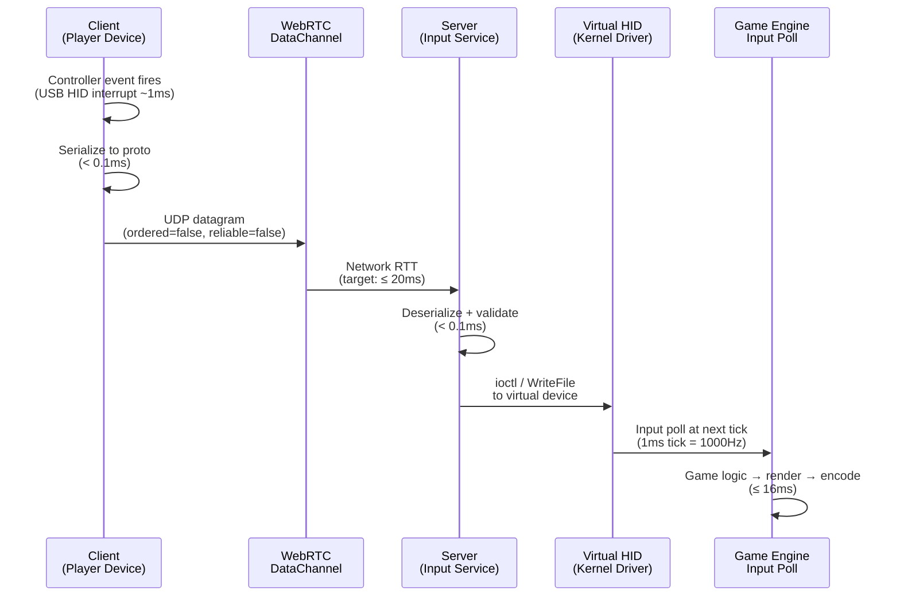
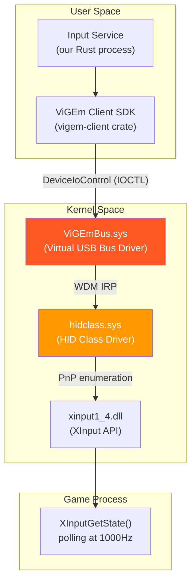
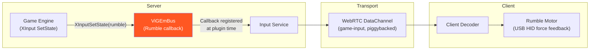
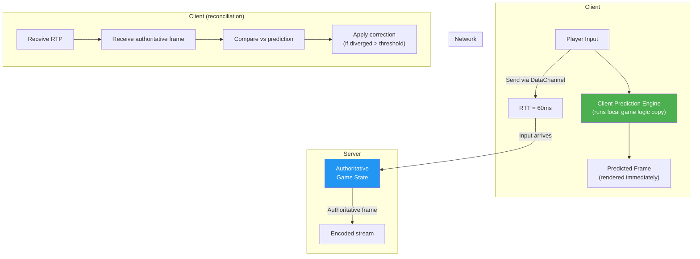
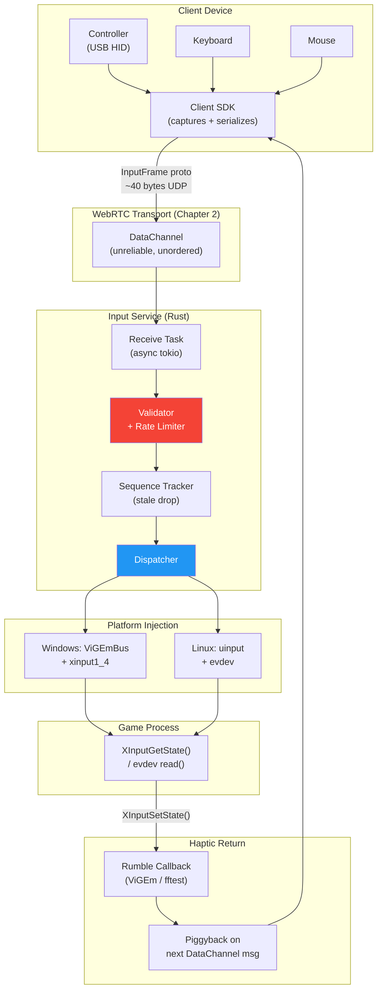

# 5. Input Polling and Virtualization 🟡

> **The Problem:** The game runs inside a Windows VM on a GPU server in a data center. Your player presses `A` on their Xbox controller connected via USB to their laptop in Tokyo. That button press must traverse the internet, arrive at the server, convince a kernel-level HID driver that a *real* Xbox controller is plugged in, be read by the game engine at its next input poll, influence game logic, and produce a rendered frame — all within the 50 ms photon budget established in Chapter 1. There is no physical controller. There is no physical display. Yet the game must believe there is both.

**Cross-references:** Chapter 1 established the latency budget this pipeline must satisfy. Chapter 2's WebRTC DataChannels carry the input packets from client to server. Chapters 3 and 4 handle the reverse direction — encoding and adapting the rendered output back to the client.

---

## 5.1 The Input Path in Context

The streaming engine is bidirectional. Chapters 2–4 focus on the **downstream** path: rendered frames traveling from server GPU to client screen. This chapter covers the **upstream** path: button presses and stick positions traveling from client peripheral to server game.



The entire upstream path — from hardware interrupt to game engine read — must complete in under **~5 ms** to stay inside the Chapter 1 budget. The network RTT consumes most of that; the software stack must add no more than **1–2 ms** of overhead.

---

## 5.2 Input Device Taxonomy

Not all inputs are equal. A cloud gaming platform must handle every class of peripheral the game supports:

| Device Class | Protocol | Poll Rate | Latency Sensitivity | Virtualization Method |
|---|---|---|---|---|
| **Xbox / DualSense gamepad** | USB HID / XInput | 125–1000 Hz | High | ViGEmBus (Windows) / uinput (Linux) |
| **Keyboard** | USB HID / PS/2 | Up to 8000 Hz | Extreme (fighting games) | Virtual HID / SendInput |
| **Mouse** | USB HID | 125–8000 Hz | Extreme (FPS) | Virtual HID |
| **Racing wheel** | USB HID / DirectInput | 500 Hz | High | ViGEmBus |
| **VR controllers** | USB / Bluetooth | 250–1000 Hz | Extreme | Custom OpenXR driver |
| **Touch (mobile)** | Touch events | 60–240 Hz | Medium | Virtual touchscreen / mouse |

### XInput vs. DirectInput vs. Raw HID

Windows games use one of three input APIs, and the virtual driver must appear as the correct type:

```
┌─────────────────────────────────────────────────────────────┐
│                       Game Process                          │
├──────────────┬──────────────────┬───────────────────────────┤
│   XInput     │   DirectInput 8  │   Raw HID                 │
│  (modern)    │   (legacy)       │   (specialty devices)     │
└──────┬───────┴────────┬─────────┴──────────┬────────────────┘
       │                │                    │
       ▼                ▼                    ▼
  xinput1_4.dll    dinput8.dll          hid.dll
       │                │                    │
       └────────────────┴────────────────────┘
                        │
                        ▼
              HID Class Driver (hidclass.sys)
                        │
                        ▼
              ┌─────────────────────┐
              │    ViGEmBus.sys      │  ← Virtual bus driver
              │  (kernel mode)       │
              └─────────────────────┘
```

**ViGEmBus** is an open-source kernel-mode virtual gamepad bus driver that exposes authentic Xbox 360 and DualShock 4 device objects. Games that query `GetDeviceCaps()` receive the correct descriptor. This is how cloud gaming services — and Steam Remote Play — virtualize controllers on Windows.

---

## 5.3 The Headless Game Environment

The game cannot run in a normal desktop session. The cloud server has no monitor, no keyboard, no mouse, no USB hub. The game environment must be entirely synthetic:

### Windows: WDDM Headless + Virtual Display

```
Physical GPU (NVIDIA A10G)
  │
  ├── Display Output: None (headless server)
  │
  └── WDDM Driver
        │
        ├── Real adapter: GPU compute + NVENC
        └── Virtual adapter: IddSampleDriver.sys (Indirect Display Driver)
              └── Exposes fake monitor: 3840×2160 @ 144Hz
                  ← DirectX presents frames here
                  ← NVENC captures from this surface
```

Windows requires a display-connected GPU to allow DirectX presentation. An **Indirect Display Driver (IDD)** creates a fake `DXGI_OUTPUT` that the desktop window manager believes is a real monitor. Without this, `IDXGISwapChain::Present()` fails or the game refuses to enter fullscreen.

### Linux: Proton + Virtual Framebuffer

For Linux-hosted servers running Windows games via Valve's **Proton** (Wine + DXVK + VKD3D):

```bash
# Launch game headlessly with Xvfb virtual display
Xvfb :99 -screen 0 1920x1080x24 -ac &
export DISPLAY=:99

# Or with a DRM virtual connector (kernel modesetting)
# /sys/kernel/debug/dri/0/state — inject virtual connector

# Proton invocation
STEAM_COMPAT_DATA_PATH=~/.proton \
PROTON_USE_WINED3D=0 \
VKD3D_FEATURE_LEVEL=12_1 \
proton run "GameTitle.exe"
```

The frames rendered by the game into the virtual display are captured via DRM/KMS or directly from a Vulkan swapchain before presentation — feeding them to the encoder described in Chapter 3.

### Comparing Headless Approaches

| Approach | OS | Frame Capture | Compatibility | GPU Utilization |
|---|---|---|---|---|
| **WDDM + IDD** | Windows Server | DXGI Desktop Dup / NVENC capture | Highest (native DX12) | Near-native |
| **Proton + Xvfb** | Linux | X11 compositor / Vulkan | Good (95%+ titles) | ~5% overhead |
| **Proton + DRM** | Linux | KMS framebuffer | Excellent | ~2% overhead |
| **AWS NICE DCV** | Windows/Linux | Custom WDDM | Enterprise-grade | Low |
| **Windows RDP** | Windows | RDSH / RDP RemoteFX | Poor (latency) | Poor |

---

## 5.4 Serializing Controller State

Every input event must be serialized, sent over the network, and deserialized on the server with minimal bytes and minimal CPU. This is the wire format used in production:

### Protobuf Schema

```protobuf
syntax = "proto3";
package cloud_gaming.input;

// Sent from client to server over WebRTC DataChannel
message InputFrame {
  // Monotonic client timestamp in microseconds
  uint64 client_timestamp_us = 1;

  // Sequential frame number for ordering detection
  uint32 sequence_number = 2;

  oneof device {
    GamepadState  gamepad  = 3;
    KeyboardState keyboard = 4;
    MouseState    mouse    = 5;
    TouchState    touch    = 6;
  }
}

message GamepadState {
  // Left stick: [-1.0, 1.0]
  float left_stick_x  = 1;
  float left_stick_y  = 2;
  // Right stick: [-1.0, 1.0]
  float right_stick_x = 3;
  float right_stick_y = 4;
  // Triggers: [0.0, 1.0]
  float left_trigger   = 5;
  float right_trigger  = 6;
  // Button bitmask (Xbox layout)
  uint32 buttons = 7;
  // Rumble feedback (server → client, piggyback)
  float rumble_low_frequency  = 8;
  float rumble_high_frequency = 9;
}

message KeyboardState {
  // HID Usage IDs for currently pressed keys (max 6 for NKRO)
  repeated uint32 pressed_keys = 1;
  // Modifier bitmask: Ctrl, Shift, Alt, Super
  uint32 modifiers = 2;
}

message MouseState {
  // Delta movement (not absolute position)
  int32 delta_x = 1;
  int32 delta_y = 2;
  // Button bitmask
  uint32 buttons = 3;
  // Scroll wheel delta
  int32 scroll_delta = 4;
}
```

### Wire Size Analysis

A gamepad `InputFrame` with all fields populated serializes to **~40 bytes** in protobuf binary format. At 125 Hz (standard Xbox polling rate), this is **5 KB/s upstream** — negligible. At 1000 Hz (high-performance mode), it is **40 KB/s** — still well under any reasonable upstream budget.

```
InputFrame overhead:
  - Protobuf envelope:     2 bytes
  - client_timestamp_us:   8 bytes (uint64)
  - sequence_number:       4 bytes (uint32)
  - GamepadState fields:  ~26 bytes (floats + bitmask)
  ─────────────────────────
  Total:                  ~40 bytes/frame
```

---

## 5.5 WebRTC DataChannel Configuration for Input

Input traffic has different requirements than video — it is tiny, frequent, and **must not be ordered**. An older input packet is never more useful than a newer one. If the network drops packet #44 and delivers #45, the game should receive #45 immediately rather than waiting for #44 to be retransmitted.

```rust,ignore
use webrtc::data_channel::RTCDataChannel;
use webrtc::data_channel::data_channel_init::RTCDataChannelInit;

/// Create a DataChannel optimized for game input.
///
/// Key configuration choices:
/// - `ordered = false`: no head-of-line blocking; newer inputs are not
///   held up waiting for older lost packets.
/// - `max_retransmits = 0`: no retransmissions. A lost input packet is
///   gone — the next one will arrive shortly (≤8ms at 125Hz).
/// - `protocol = "input-v1"`: application-level identifier for
///   multiplexing multiple DataChannels over one DTLS connection.
pub async fn create_input_channel(
    peer_connection: &RTCPeerConnection,
) -> Result<Arc<RTCDataChannel>> {
    let init = RTCDataChannelInit {
        ordered: Some(false),
        max_retransmits: Some(0),
        protocol: Some("input-v1".to_string()),
        negotiated: Some(true),
        id: Some(1), // pre-negotiated ID for zero-RTT setup
        ..Default::default()
    };

    peer_connection
        .create_data_channel("game-input", Some(init))
        .await
        .map_err(Into::into)
}

/// Process incoming input messages on the server side.
pub async fn run_input_receiver(
    channel: Arc<RTCDataChannel>,
    injector: Arc<InputInjector>,
) {
    let injector = injector.clone();

    channel.on_message(Box::new(move |msg: DataChannelMessage| {
        let injector = injector.clone();

        Box::pin(async move {
            // Deserialize the protobuf frame
            let frame = match InputFrame::decode(msg.data.as_ref()) {
                Ok(f) => f,
                Err(e) => {
                    tracing::warn!("Failed to decode input frame: {}", e);
                    return;
                }
            };

            // Drop stale inputs: if sequence number is older than last
            // processed, discard immediately (no reordering)
            if injector.is_stale(frame.sequence_number) {
                tracing::trace!(
                    "Dropping stale input seq={}", frame.sequence_number
                );
                return;
            }

            // Inject into the virtual HID device
            match &frame.device {
                Some(input_frame::Device::Gamepad(state)) => {
                    injector.inject_gamepad(state).await;
                }
                Some(input_frame::Device::Keyboard(state)) => {
                    injector.inject_keyboard(state).await;
                }
                Some(input_frame::Device::Mouse(state)) => {
                    injector.inject_mouse(state).await;
                }
                _ => {}
            }
        })
    }));
}
```

### Staleness Detection

```rust,ignore
use std::sync::atomic::{AtomicU32, Ordering};

pub struct InputInjector {
    last_sequence: AtomicU32,
    // ... other fields
}

impl InputInjector {
    /// Returns true if this sequence number is older than the last
    /// successfully processed frame (handles 32-bit wraparound).
    pub fn is_stale(&self, seq: u32) -> bool {
        let last = self.last_sequence.load(Ordering::Relaxed);
        // Wraparound-safe comparison: treat difference > 2^31 as older
        let diff = seq.wrapping_sub(last);
        diff == 0 || diff > u32::MAX / 2
    }

    pub fn advance_sequence(&self, seq: u32) {
        self.last_sequence.store(seq, Ordering::Relaxed);
    }
}
```

---

## 5.6 Virtual HID Injection — Windows (ViGEmBus)

On the Windows server, injecting gamepad state requires writing to a kernel-mode virtual USB bus:

```rust,ignore
// Rust FFI bindings to ViGEm Client SDK (vigem-client crate)
use vigem_client::{Client, TargetId, XUSBReport};

pub struct GamepadInjector {
    client: Client,
    target: vigem_client::Xbox360Wired<Client>,
}

impl GamepadInjector {
    pub fn new() -> Result<Self> {
        // Connect to ViGEmBus kernel driver
        let client = Client::connect()?;

        // Allocate a virtual Xbox 360 controller
        // This triggers Plug & Play enumeration — Windows "sees" a
        // new USB hub with a gamepad attached.
        let mut target = vigem_client::Xbox360Wired::new(client, TargetId::XBOX360_WIRED);
        target.plugin()?;

        // Wait for the driver to initialize the device
        target.wait_ready()?;

        Ok(Self { client, target })
    }

    /// Translate our protobuf GamepadState into a ViGEm XUSB report
    /// and write it to the kernel driver. This takes ~50–100 µs.
    pub fn inject(&mut self, state: &GamepadState) -> Result<()> {
        let report = XUSBReport {
            // Analog sticks: protobuf [-1.0, 1.0] → XInput [-32768, 32767]
            s_thumb_lx: (state.left_stick_x  * 32767.0) as i16,
            s_thumb_ly: (state.left_stick_y  * 32767.0) as i16,
            s_thumb_rx: (state.right_stick_x * 32767.0) as i16,
            s_thumb_ry: (state.right_stick_y * 32767.0) as i16,
            // Triggers: [0.0, 1.0] → [0, 255]
            b_left_trigger:  (state.left_trigger  * 255.0) as u8,
            b_right_trigger: (state.right_trigger * 255.0) as u8,
            // Button bitmask pastes directly into XUSB layout
            w_buttons: translate_buttons(state.buttons),
        };

        self.target.update(&report)?;
        Ok(())
    }
}

/// Map our button bitmask to XUSB button constants.
fn translate_buttons(buttons: u32) -> u16 {
    use vigem_client::XButtons;
    let mut xb = XButtons(0);
    if buttons & BTN_A     != 0 { xb |= XButtons::A; }
    if buttons & BTN_B     != 0 { xb |= XButtons::B; }
    if buttons & BTN_X     != 0 { xb |= XButtons::X; }
    if buttons & BTN_Y     != 0 { xb |= XButtons::Y; }
    if buttons & BTN_LB    != 0 { xb |= XButtons::LEFT_SHOULDER; }
    if buttons & BTN_RB    != 0 { xb |= XButtons::RIGHT_SHOULDER; }
    if buttons & BTN_START != 0 { xb |= XButtons::START; }
    if buttons & BTN_BACK  != 0 { xb |= XButtons::BACK; }
    if buttons & BTN_GUIDE != 0 { xb |= XButtons::GUIDE; }
    if buttons & BTN_LS    != 0 { xb |= XButtons::LEFT_THUMB; }
    if buttons & BTN_RS    != 0 { xb |= XButtons::RIGHT_THUMB; }
    xb.0
}
```

### Windows HID Injection Architecture



---

## 5.7 Virtual HID Injection — Linux (uinput)

On Linux servers (where Proton runs Windows games), the kernel's `uinput` module creates virtual input devices:

```rust,ignore
use std::fs::OpenOptions;
use std::os::unix::io::AsRawFd;
use nix::ioctl_write_ptr;

// ioctl codes from linux/uinput.h
const UINPUT_IOCTL_BASE: u8 = b'U';
ioctl_write_ptr!(ui_set_evbit,  UINPUT_IOCTL_BASE, 100, i32);
ioctl_write_ptr!(ui_set_keybit, UINPUT_IOCTL_BASE, 101, i32);
ioctl_write_ptr!(ui_set_absbit, UINPUT_IOCTL_BASE, 103, i32);
ioctl_write_ptr!(ui_dev_setup,  UINPUT_IOCTL_BASE, 3,   UinputSetup);
ioctl_write_ptr!(ui_dev_create, UINPUT_IOCTL_BASE, 1,   ());

#[repr(C)]
struct UinputSetup {
    id: InputId,
    name: [u8; 80],
    ff_effects_max: u32,
}

#[repr(C)]
struct InputId {
    bustype: u16,  // BUS_USB = 0x03
    vendor:  u16,  // 0x045E = Microsoft
    product: u16,  // 0x028E = Xbox 360 Controller
    version: u16,
}

pub struct LinuxGamepadInjector {
    fd: std::fs::File,
}

impl LinuxGamepadInjector {
    pub fn new() -> Result<Self> {
        // Open the uinput device node
        let fd = OpenOptions::new()
            .write(true)
            .open("/dev/uinput")?;

        let raw = fd.as_raw_fd();

        unsafe {
            // Enable event types: EV_KEY buttons, EV_ABS axes
            ui_set_evbit(raw, &libc::EV_KEY)?;
            ui_set_evbit(raw, &libc::EV_ABS)?;
            ui_set_evbit(raw, &libc::EV_SYN)?;

            // Enable absolute axis codes (gamepad sticks and triggers)
            for axis in [libc::ABS_X, libc::ABS_Y, libc::ABS_RX,
                         libc::ABS_RY, libc::ABS_Z, libc::ABS_RZ] {
                ui_set_absbit(raw, &axis)?;
            }

            // Configure device identity (appears as Xbox 360 controller)
            let setup = UinputSetup {
                id: InputId {
                    bustype: 0x03, // BUS_USB
                    vendor:  0x045E,
                    product: 0x028E,
                    version: 0x0114,
                },
                name: *b"Xbox 360 Controller\0                                               \0",
                ff_effects_max: 0,
            };
            ui_dev_setup(raw, &setup)?;
            ui_dev_create(raw, &())?;
        }

        Ok(Self { fd })
    }

    /// Write a Linux input_event to uinput.
    fn write_event(&mut self, event_type: u16, code: u16, value: i32) -> Result<()> {
        // struct input_event from linux/input.h
        // { struct timeval tv; __u16 type; __u16 code; __s32 value; }
        let now = std::time::SystemTime::now()
            .duration_since(std::time::UNIX_EPOCH)?;
        let buf: [u8; 24] = unsafe {
            std::mem::transmute(LinuxInputEvent {
                tv_sec:  now.as_secs() as i64,
                tv_usec: now.subsec_micros() as i64,
                r#type:  event_type,
                code,
                value,
            })
        };
        use std::io::Write;
        self.fd.write_all(&buf)?;
        Ok(())
    }

    pub fn inject(&mut self, state: &GamepadState) -> Result<()> {
        // Left stick X: [-1.0, 1.0] → [-32768, 32767]
        self.write_event(libc::EV_ABS as u16, libc::ABS_X as u16,
            (state.left_stick_x  * 32767.0) as i32)?;
        self.write_event(libc::EV_ABS as u16, libc::ABS_Y as u16,
            (state.left_stick_y  * 32767.0) as i32)?;
        self.write_event(libc::EV_ABS as u16, libc::ABS_RX as u16,
            (state.right_stick_x * 32767.0) as i32)?;
        self.write_event(libc::EV_ABS as u16, libc::ABS_RY as u16,
            (state.right_stick_y * 32767.0) as i32)?;

        // Triggers: [0.0, 1.0] → [0, 255]
        self.write_event(libc::EV_ABS as u16, libc::ABS_Z as u16,
            (state.left_trigger  * 255.0) as i32)?;
        self.write_event(libc::EV_ABS as u16, libc::ABS_RZ as u16,
            (state.right_trigger * 255.0) as i32)?;

        // Sync event: tells the kernel this is a complete input report
        self.write_event(libc::EV_SYN as u16, libc::SYN_REPORT as u16, 0)?;

        Ok(())
    }
}
```

---

## 5.8 Input Timing: Polling Rate vs. Frame Rate

The relationship between input polling rate, game tick rate, and frame rate is critical to understanding perceived responsiveness:

```mermaid
gantt
    title Input-to-Frame Timeline (16.7ms frame budget at 60fps)
    dateFormat  SSS
    axisFormat  %L ms

    section Network
    Input UDP packet arrives : crit, 000, 1ms

    section Input Service
    Deserialize + validate   : 001, 1ms
    ViGEm / uinput write     : 002, 1ms

    section Game Engine (1000Hz tick)
    Tick N polls XInput      : 003, 1ms
    Tick N+1 (next ms)       : 004, 1ms

    section Render
    Frame render (GPU)       : 006, 8ms
    NVENC encode             : 014, 2ms

    section Network (downstream)
    RTP packet → client      : 016, 1ms
```



### Polling Rate Configuration

| Rate | Interval | Use Case | CPU overhead |
|---|---|---|---|
| **125 Hz** | 8 ms | Standard (Xbox default USB) | Negligible |
| **250 Hz** | 4 ms | Competitive console gaming | < 0.1% |
| **500 Hz** | 2 ms | High-performance PC gaming | < 0.5% |
| **1000 Hz** | 1 ms | Esports / fighting games | < 1% |
| **8000 Hz** | 0.125 ms | Ultra-high-end mice | ~2% |

For a cloud gaming server running 32 simultaneous sessions, even at 1000 Hz per session, the input processing thread is the cheapest component of the entire stack.

### Game Tick Rate Decoupling

Some games tick their physics/input at a rate independent of their render frame rate. A game running at 60fps may only poll input at 60 Hz. Others (like competitive shooters) poll at 128 Hz or 1000 Hz:

```rust,ignore
/// Input poller that buffers inputs between game ticks and provides
/// the most recent state when the game calls XInputGetState().
pub struct InputBuffer {
    /// Atomic storage of the current gamepad state
    /// (written by network thread, read by game's XInput call)
    current_state: Arc<RwLock<XUSBReport>>,
    /// Stats
    updates_per_second: AtomicU64,
}

impl InputBuffer {
    /// Called at network receive rate (125–1000 Hz)
    pub async fn update(&self, state: XUSBReport) {
        let mut lock = self.current_state.write().await;
        *lock = state;
        self.updates_per_second.fetch_add(1, Ordering::Relaxed);
    }

    /// Called by ViGEm callback at game's XInput poll rate
    pub async fn read(&self) -> XUSBReport {
        self.current_state.read().await.clone()
    }
}
```

---

## 5.9 Mouse Input: The Relative Motion Problem

Mouse input is the most latency-sensitive input type and has a unique challenge: games read **relative delta**, not absolute position. If the player moves the mouse 500 counts/second and there is 20 ms of network latency, the server receives the delta late — but the game must receive it in the correct temporal order relative to its frame renders.

### Accumulation and Delivery

```rust,ignore
use std::sync::atomic::{AtomicI64, Ordering};

/// Thread-safe accumulator for mouse delta movements.
/// Multiple network packets may arrive between game frames;
/// their deltas must be summed and delivered as a single
/// accumulated delta at game poll time.
pub struct MouseDeltaAccumulator {
    accumulated_x: AtomicI64,
    accumulated_y: AtomicI64,
}

impl MouseDeltaAccumulator {
    /// Add incoming deltas from network (called per UDP packet)
    pub fn accumulate(&self, dx: i32, dy: i32) {
        self.accumulated_x.fetch_add(dx as i64, Ordering::Relaxed);
        self.accumulated_y.fetch_add(dy as i64, Ordering::Relaxed);
    }

    /// Drain accumulated delta (called at game's mouse poll rate).
    /// Returns (dx, dy) and resets to zero atomically.
    pub fn drain(&self) -> (i32, i32) {
        let x = self.accumulated_x.swap(0, Ordering::AcqRel);
        let y = self.accumulated_y.swap(0, Ordering::AcqRel);
        // Clamp to i32 range to avoid overflow in edge cases
        (x.clamp(i32::MIN as i64, i32::MAX as i64) as i32,
         y.clamp(i32::MIN as i64, i32::MAX as i64) as i32)
    }
}
```

### Raw Input vs. SendInput

Windows provides two mechanisms for injecting mouse input:

| Method | Latency | Notes |
|---|---|---|
| **SendInput()** | ~0.5 ms | High-level Win32 API; subject to mouse acceleration, pointer ballistics |
| **Raw Input (RIDEV_NOLEGACY)** | ~0.1 ms | Bypasses ballistics; required for FPS games with raw mouse |
| **uinput REL_X/REL_Y** | ~0.1 ms | Linux equivalent; games via Wine see raw relative motion |

Production cloud gaming stacks always use raw input injection for mouse — applying mouse acceleration on the server would compound with any acceleration the client's OS applies, causing double-ballistics and erratic aiming.

---

## 5.10 Haptic Feedback: The Reverse Channel

Rumble feedback from the game must travel back to the client. This creates a second, lower-priority upstream-to-downstream sub-channel:



The rumble values are piggybacked onto the next `InputFrame` ACK — using the `rumble_low_frequency` and `rumble_high_frequency` fields in the `GamepadState` proto — rather than opening a second DataChannel.

```rust,ignore
/// ViGEm rumble callback: fires when the game calls XInputSetState().
fn on_rumble_notification(
    client: &Client,
    target: &Xbox360Wired<Client>,
    large_motor: u8,
    small_motor: u8,
    user_index: u8,
) {
    // Convert [0, 255] byte → [0.0, 1.0] float
    let feedback = RumbleFeedback {
        low_frequency:  large_motor as f32 / 255.0,
        high_frequency: small_motor as f32 / 255.0,
    };

    // Push to a bounded channel; the network thread reads it and
    // piggybacks onto the next outgoing InputFrame response
    if let Err(_) = RUMBLE_TX.try_send(feedback) {
        // Channel full: drop stale rumble (non-critical)
        tracing::trace!("Rumble feedback channel full, dropping");
    }
}
```

---

## 5.11 Input Prediction and Compensation

At low latency (< 30 ms RTT), input prediction is unnecessary — the delay is imperceptible. But at 50–80 ms RTT (intercontinental connections), game developers can optionally implement **client-side prediction** to mask latency:

### Client-Side Prediction Architecture



This is how multiplayer games already handle server-client latency — cloud gaming simply moves the boundary from "client runs full simulation" to "client runs prediction, server is authoritative for rendering."

### When to Apply Prediction

| RTT | Approach | Implementation |
|---|---|---|
| **< 30 ms** | No prediction needed | Straight input forwarding |
| **30–60 ms** | Animate-ahead | Animate character movement locally, correct on server frame |
| **60–100 ms** | Full prediction | Run subset of game physics client-side |
| **> 100 ms** | Unplayable for action | Consider PoP migration (Chapter 4 session migration) |

---

## 5.12 Security: Input Validation

The server trusts no input from the client. All input must be validated before injection:

```rust,ignore
/// Validate and sanitize an incoming InputFrame before injection.
/// Returns Err if the frame should be rejected entirely.
pub fn validate_input(frame: &InputFrame) -> Result<(), InputError> {
    // 1. Timestamp sanity: reject frames with impossible timestamps
    //    (guards against replay attacks and clock corruption)
    let server_now_us = server_timestamp_us();
    let age_us = server_now_us.saturating_sub(frame.client_timestamp_us);
    if age_us > 5_000_000 {
        // Older than 5 seconds — likely a replay attack
        return Err(InputError::StaleTimestamp { age_us });
    }

    match &frame.device {
        Some(input_frame::Device::Gamepad(g)) => {
            // 2. Clamp analog values to valid range
            //    (float NaN/Inf would crash ViGEm driver)
            if !g.left_stick_x.is_finite()  || g.left_stick_x.abs()  > 1.0
            || !g.left_stick_y.is_finite()  || g.left_stick_y.abs()  > 1.0
            || !g.right_stick_x.is_finite() || g.right_stick_x.abs() > 1.0
            || !g.right_stick_y.is_finite() || g.right_stick_y.abs() > 1.0
            || !g.left_trigger.is_finite()  || !(0.0..=1.0).contains(&g.left_trigger)
            || !g.right_trigger.is_finite() || !(0.0..=1.0).contains(&g.right_trigger)
            {
                return Err(InputError::OutOfRangeAnalog);
            }

            // 3. Button bitmask: only known buttons allowed
            //    (prevents hidden bits from triggering driver bugs)
            const VALID_BUTTONS: u32 = 0x0000_FFFF; // 16 defined buttons
            if g.buttons & !VALID_BUTTONS != 0 {
                return Err(InputError::InvalidButtonMask { buttons: g.buttons });
            }
        }
        Some(input_frame::Device::Keyboard(k)) => {
            // 4. HID usage IDs: reject values above the HID Usage Tables range
            for &key in &k.pressed_keys {
                if key > 0x00FF {
                    return Err(InputError::InvalidKeyCode { code: key });
                }
            }
            // 5. Maximum 6 simultaneous keys (NKRO limit for standard HID)
            if k.pressed_keys.len() > 6 {
                return Err(InputError::TooManyKeys {
                    count: k.pressed_keys.len()
                });
            }
        }
        Some(input_frame::Device::Mouse(m)) => {
            // 6. Clamp mouse delta to prevent macro-scale movements
            //    A real mouse at 32000 DPI moving 1 inch = 32000 counts.
            //    Anything over 64000 per frame is physically impossible.
            if m.delta_x.abs() > 64_000 || m.delta_y.abs() > 64_000 {
                return Err(InputError::ExcessiveMouseDelta {
                    dx: m.delta_x, dy: m.delta_y
                });
            }
        }
        None => {
            return Err(InputError::MissingDevice);
        }
        _ => {}
    }

    Ok(())
}
```

### Rate Limiting

An anti-cheat consideration: a malicious client could flood the input channel with thousands of packets per second, overloading the ViGEm/uinput write path:

```rust,ignore
use std::time::{Duration, Instant};

pub struct InputRateLimiter {
    last_frame: Instant,
    /// Maximum input frames per second (2× max polling rate)
    max_fps: u32,
}

impl InputRateLimiter {
    pub fn should_accept(&mut self) -> bool {
        let min_interval = Duration::from_micros(1_000_000 / self.max_fps as u64);
        let elapsed = self.last_frame.elapsed();
        if elapsed >= min_interval {
            self.last_frame = Instant::now();
            true
        } else {
            false // Drop — too fast
        }
    }
}
```

---

## 5.13 Full Input Service Architecture

Bringing it all together: the complete input service running on the cloud gaming server:



### Latency Breakdown (Server-Side)

| Stage | Target Latency | Implementation |
|---|---|---|
| DataChannel receive → Rust callback | < 0.5 ms | tokio async; no thread context switch |
| Proto decode | < 0.1 ms | prost; zero-allocation on hot path |
| Validation + staleness check | < 0.05 ms | Atomic loads; branchless clamp |
| ViGEm IOCTL write | 0.05–0.1 ms | DeviceIoControl; kernel fast path |
| Game engine XInput poll | 0–1 ms | Depends on game tick rate |
| **Total server-side overhead** | **< 2 ms** | |

---

> **Key Takeaways**
>
> - The input path is **bidirectional**: downstream is rendered frames (Chapters 2–4); upstream is controller state (this chapter). Both must fit inside the 50 ms photon budget from Chapter 1.
> - Use **WebRTC DataChannels with `ordered=false, max_retransmits=0`**: a dropped input packet is superseded by the next one within milliseconds. Head-of-line blocking here is far worse than loss.
> - **ViGEmBus** (Windows) and **uinput** (Linux) create virtual HID devices that games cannot distinguish from physical hardware. The game's input API — XInput, DirectInput, or Raw HID — reads from the kernel's device tree, not from your code.
> - The headless game environment requires a **virtual display** (IDD on Windows, Xvfb/DRM on Linux) and a **virtual audio device**. Without these, most games refuse to launch.
> - **Mouse input must use raw delta accumulation**, not absolute positioning. Accumulate all deltas arriving between game frames and deliver them atomically to avoid quantization error.
> - **Validate every input frame** at the server boundary: NaN/Inf floats crash kernel drivers; over-range button masks trigger driver bugs; timestamp validation blocks replay attacks.
> - Haptic rumble travels the **reverse path** — piggybacked as a server-to-client message on the same DataChannel — completing the full input loop.
