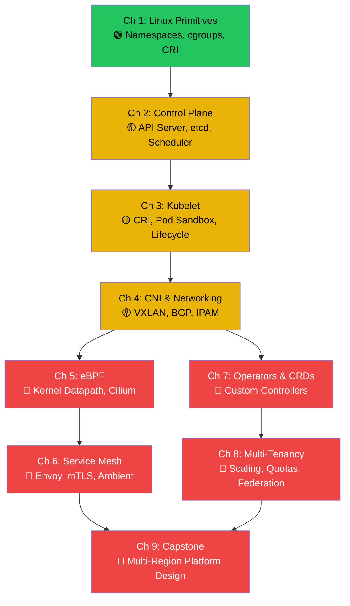

# Hardcore Cloud Native: Orchestration, eBPF, and Kubernetes Internals

> *"Kubernetes is not a platform. It is a platform for building platforms. If you don't understand the primitives underneath, you are building on quicksand."*

---

## About This Guide

Welcome. This is a principal-level training guide written from the trenches of hyper-scale infrastructure engineering. It is not a `kubectl` tutorial. It is not a YAML-copy-paste cookbook. It is a systematic, first-principles descent into the Linux kernel primitives, control plane internals, and networking subsystems that separate a weekend Kubernetes cluster from a multi-region, 5,000-node production fleet serving millions of requests per second.

Every chapter in this book starts at the Linux kernel: namespaces, cgroups, syscalls, eBPF hook points. We build upward from there — through the Container Runtime Interface, the Kubernetes reconciliation loop, Custom Resource Definitions, and kernel-level networking — culminating in a complete multi-region stateful platform design, the kind of system that sits at the heart of every major cloud provider's internal developer platform.

If you have ever been jolted awake at 3 AM because `kube-proxy` iptables rules exploded past 20,000 entries and your cluster's service routing collapsed — this book is for you.

---

## Speaker Intro

This material is written from the perspective of a **Principal Cloud Native Architect** with deep experience building and operating Kubernetes at the largest scale:

- **Hyper-Scale Kubernetes Clusters** — 5,000+ node clusters serving 500,000 pods, with control plane tuning (etcd compaction, API server request throttling, watch bookmark optimization) to keep reconciliation loops under 200ms at scale.
- **eBPF-Powered Networking** — replacing `kube-proxy` with Cilium across production fleets, eliminating 40,000+ iptables rules per node for a 10× reduction in service routing latency and a measurable drop in kernel CPU overhead.
- **Custom Operators for Stateful Infrastructure** — building Kubernetes operators (in Go and Rust with `kube-rs`) that manage the lifecycle of distributed databases, handling automated failover, backup orchestration, and leader election with zero-downtime upgrades.
- **Multi-Region Platform Architecture** — designing globally distributed platforms spanning AWS and GCP, with Cilium Cluster Mesh for cross-region pod-to-pod communication, GitOps deployment pipelines, and sub-second failover between regions.
- **Production Incidents Debugged at the Kernel Level** — including etcd split-brain events caused by clock skew, IP exhaustion in /24 pod CIDRs that brought down entire node pools, and eBPF verifier rejections that silently disabled network policy enforcement.

The lessons in this book are hard-won. Every anti-pattern shown here has caused a real production outage.

---

## Who This Is For

This guide is designed for:

- **Senior DevOps/SRE engineers preparing for Staff-level infrastructure interviews** at companies like Google (GKE team), Stripe (Infrastructure Platform), Airbnb (Kube Platform), Meta (Twine), or any company where the interview asks "design a multi-tenant Kubernetes platform for 10,000 microservices."
- **Platform engineers building Internal Developer Platforms (IDPs)** who need to understand the control plane deeply enough to extend it with CRDs, admission webhooks, and custom schedulers.
- **Kubernetes administrators who have outgrown `kubectl apply`** and need to understand *why* their cluster is slow (hint: etcd is doing 50,000 watch events per second and nobody tuned `--watch-cache-sizes`).
- **Cloud architects designing multi-region infrastructure** who need to make informed decisions about CNI plugins, service mesh topology, and cluster federation strategies.

### What This Guide Is NOT

- It is not a Kubernetes introduction. You must already understand Pods, Services, Deployments, and ConfigMaps.
- It is not a YAML reference. We write YAML only to demonstrate what it *compiles down to* at the kernel level.
- It is not cloud-provider specific. We use AWS and GCP examples, but the principles apply to any infrastructure.

---

## Prerequisites

| Concept | Required Level | Where to Learn |
|---|---|---|
| Linux CLI & shell scripting | Fluent | Any Linux sysadmin book |
| TCP/IP networking | Strong (subnets, routing, NAT, DNS) | Stevens, *TCP/IP Illustrated* |
| Kubernetes basics (`kubectl`, Pods, Services, Deployments) | Working knowledge | [Kubernetes official docs](https://kubernetes.io/docs/) |
| Container basics (Docker build, run, push) | Comfortable | Docker Getting Started guide |
| Distributed systems concepts | Intermediate (CAP, consensus, replication) | [Hardcore Distributed Systems](../distributed-systems-book/src/SUMMARY.md) |
| YAML and JSON | Fluent | — |
| Go or Rust (for Operator chapters) | Reading knowledge | [Rust for C/C++ Programmers](../c-cpp-book/src/SUMMARY.md) |

---

## How to Use This Book

| Indicator | Meaning |
|---|---|
| 🟢 **Advanced Core** | Foundational for this guide — Linux primitives and container internals |
| 🟡 **Expert Applied** | Control plane internals, CNI deep dives, kubelet mechanics |
| 🔴 **Kernel/Architect-Level** | eBPF, service mesh internals, operators, multi-region capstone |

### Pacing Guide

| Chapters | Topic | Estimated Time | Checkpoint |
|---|---|---|---|
| Ch 1 | Linux Primitives & Container Internals | 6–8 hours | Can create a "container" from scratch using `unshare`, `cgroups`, and `pivot_root` |
| Ch 2–3 | Control Plane & Kubelet | 8–10 hours | Can trace a `kubectl apply` from API server to etcd to kubelet to CRI to running container |
| Ch 4–6 | Networking, eBPF, Service Mesh | 12–16 hours | Can explain pod-to-pod routing, write an eBPF program concept, and compare sidecar vs ambient mesh |
| Ch 7–8 | Operators, Multi-Tenancy, Scaling | 10–14 hours | Can design a CRD schema and explain etcd sharding for 5,000-node clusters |
| Ch 9 | Platform Capstone | 8–12 hours | Can whiteboard a complete multi-region stateful platform in a Staff-level interview |

**Fast Track (Staff Interview Prep):** Chapters 1, 2, 4, 5, 9 — covers the primitives, control plane, networking, and system design most likely to appear in Staff/Principal interviews.

**Full Track (Mastery):** All chapters sequentially. Budget 3–4 weeks of focused study.

---

## Table of Contents

### Part I: The Primitives (There Are No Containers)

| Chapter | Description |
|---|---|
| **1. Namespaces, cgroups, and runc** 🟢 | Deconstructing the "container" myth. Linux PID/Mount/UTS/IPC/Network namespaces, `cgroups v2`, the Container Runtime Interface (CRI), and `containerd`. Build a container from scratch. |
| **2. Kubernetes Control Plane Internals** 🟡 | The anatomy of a cluster. `kube-apiserver` as stateless gateway to `etcd`. The watch/reconciliation loop. `kube-controller-manager` and `kube-scheduler` internals. |
| **3. The Kubelet and the Node** 🟡 | How the Kubelet translates PodSpecs into CRI commands. Pod Sandbox creation, the pause container, ephemeral containers, and node lifecycle. |

### Part II: Advanced Networking and eBPF

| Chapter | Description |
|---|---|
| **4. The CNI and Pod-to-Pod Communication** 🟡 | How the Container Network Interface works. Overlay networks (VXLAN) vs BGP routing (Calico). IP address management and overcoming IP exhaustion at scale. |
| **5. eBPF and the Death of iptables** 🔴 | Why `kube-proxy` with `iptables` collapses at 10,000 services. eBPF fundamentals. Pushing networking, security, and observability into the kernel with Cilium. |
| **6. The Service Mesh and Envoy Proxy** 🔴 | Decoupling networking from application code. Istio/Linkerd deep dive. Sidecar vs eBPF-powered Ambient model. mTLS, certificate rotation, and zero-trust. |

### Part III: Extending the Platform

| Chapter | Description |
|---|---|
| **7. Operators and Custom Resource Definitions** 🔴 | Managing stateful infrastructure inside Kubernetes. CRD schema design, custom controllers, the Operator SDK, and Rust's `kube-rs`. |
| **8. Multi-Tenancy and Scaling Limits** 🔴 | Designing for 5,000+ nodes. API server caching, etcd sharding, LimitRanges, ResourceQuotas, PriorityClasses, and multi-cluster federation. |

### Part IV: The Platform Capstone

| Chapter | Description |
|---|---|
| **9. Capstone — Architect a Multi-Region Stateful Platform** 🔴 | Staff-level system design. GitOps with ArgoCD/Flux, Cilium Cluster Mesh, a custom Postgres operator, and eBPF observability across AWS and GCP. |

### Appendices

| Chapter | Description |
|---|---|
| **Appendix A: Summary & Reference Card** | Cheat sheet for Linux namespaces, eBPF map types, Kubernetes QoS classes, and essential `kubectl` debug commands. |

---

## Learning Path

---

## Companion Guides

This book pairs well with these other training resources:

| Book | Relevance |
|---|---|
| [Hardcore Distributed Systems](../distributed-systems-book/src/SUMMARY.md) | Consensus, replication, and failure modes — the theory behind multi-region platform design |
| [Hardcore Algorithms & Concurrency](../algorithms-concurrency-book/src/SUMMARY.md) | Lock-free data structures relevant to eBPF map implementations and high-performance control planes |
| [Rust Engineering Practices](../engineering-book/src/SUMMARY.md) | CI/CD, cross-compilation, and build infrastructure for Rust-based operators |
| [Unsafe Rust & FFI](../unsafe-ffi-book/src/SUMMARY.md) | FFI patterns relevant to writing Rust eBPF programs and kernel module interactions |

---

> **Let's begin. Chapter 1 starts where every principal engineer's understanding must start: not with Kubernetes, but with the Linux kernel.**
