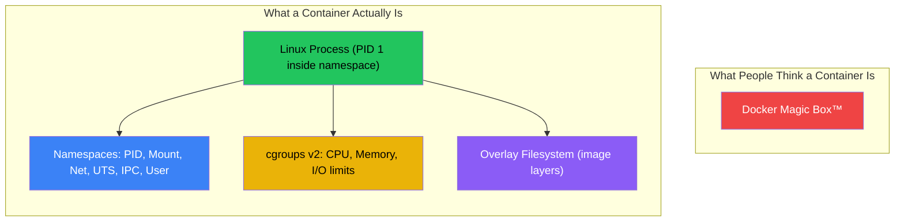
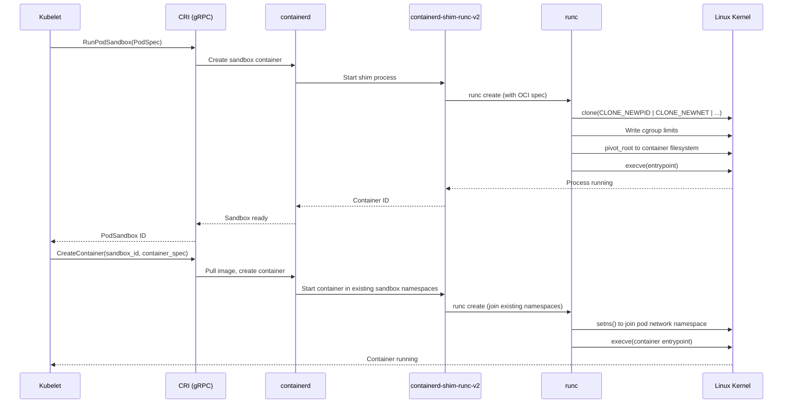

# Chapter 1: Namespaces, cgroups, and runc 🟢

> **What you'll learn:**
> - How Linux namespaces (PID, Mount, UTS, IPC, Network, User) provide process isolation — the actual mechanism behind "containers"
> - How `cgroups v2` enforces CPU and memory resource limits and prevents noisy-neighbor problems
> - How the Container Runtime Interface (CRI) and `containerd` translate high-level container requests into kernel primitives
> - How to build a "container" from scratch using raw Linux syscalls, demystifying Docker forever

---

## 1.1 The Container Myth

There is no such thing as a "container" in the Linux kernel. There is no `container_t` struct, no `sys_create_container` syscall, no kernel subsystem called "containers." What Docker, Kubernetes, and every container runtime actually use are **two independent Linux kernel features** that have existed since 2002 and 2008 respectively:

1. **Namespaces** — provide *isolation* (each process sees its own view of the system)
2. **cgroups** — provide *resource limits* (each process gets a quota of CPU, memory, I/O)

A "container" is simply a process (or group of processes) that runs inside a set of namespaces with cgroup limits applied. That's it. Everything else — images, layers, registries, Dockerfiles — is user-space tooling built on top of these two primitives.

> **Principal Engineer's Perspective:** Understanding this distinction is not academic. When a container "escapes" its isolation, it's because a namespace was misconfigured. When a container consumes all available memory and kills neighboring workloads, it's because cgroups were not properly set. You cannot debug these failures without understanding the primitives.



---

## 1.2 Linux Namespaces: The Isolation Primitive

Namespaces partition kernel resources so that one set of processes sees one set of resources, while another set of processes sees a different set. Each namespace type isolates a specific aspect of the system:

| Namespace | Flag | What It Isolates | Kernel Version |
|---|---|---|---|
| **PID** | `CLONE_NEWPID` | Process IDs — container sees its own PID 1 | 2.6.24 (2008) |
| **Mount** | `CLONE_NEWNS` | Filesystem mount points — container has its own `/` | 2.4.19 (2002) |
| **UTS** | `CLONE_NEWUTS` | Hostname and domain name | 2.6.19 (2006) |
| **IPC** | `CLONE_NEWIPC` | System V IPC, POSIX message queues | 2.6.19 (2006) |
| **Network** | `CLONE_NEWNET` | Network devices, IP addresses, routing tables, firewall rules | 2.6.29 (2009) |
| **User** | `CLONE_NEWUSER` | User and group IDs — root inside, unprivileged outside | 3.8 (2013) |
| **Cgroup** | `CLONE_NEWCGROUP` | Cgroup root directory | 4.6 (2016) |
| **Time** | `CLONE_NEWTIME` | `CLOCK_MONOTONIC` and `CLOCK_BOOTTIME` offsets | 5.6 (2020) |

### How Namespaces Work: The `unshare` Syscall

The simplest way to create namespaces is the `unshare(2)` syscall (or the `unshare` CLI tool). Here's what happens when you run a process in a new PID namespace:

```bash
# On the host: our shell has PID namespace ID from /proc/self/ns/pid
ls -la /proc/self/ns/pid
# lrwxrwxrwx 1 root root 0 ... /proc/self/ns/pid -> pid:[4026531836]

# Create a new PID namespace and run bash inside it
sudo unshare --pid --fork --mount-proc bash

# Inside the new namespace: bash thinks it's PID 1
echo $$
# 1

# Only processes in this namespace are visible
ps aux
# USER  PID %CPU %MEM    VSZ   RSS TTY  STAT START TIME COMMAND
# root    1  0.0  0.0  ...         ...  S    ...       bash
# root    2  0.0  0.0  ...         ...  R    ...       ps aux
```

The process is still running on the same kernel, same hardware, same CPU. But its *view* of the PID space has been partitioned.

### Network Namespaces: The Foundation of Pod Networking

Network namespaces are the most important namespace type for Kubernetes. Each pod gets its own network namespace, which means:

- Its own `eth0` interface
- Its own IP address
- Its own routing table
- Its own iptables/nftables rules

Containers within the same pod share the same network namespace (this is why containers in a pod can communicate over `localhost`).

```bash
# Create a network namespace
sudo ip netns add my-container

# Create a virtual ethernet pair (veth) — a pipe between namespaces
sudo ip link add veth-host type veth peer name veth-container

# Move one end into the container's network namespace
sudo ip link set veth-container netns my-container

# Assign IP addresses
sudo ip addr add 10.0.0.1/24 dev veth-host
sudo ip link set veth-host up

sudo ip netns exec my-container ip addr add 10.0.0.2/24 dev veth-container
sudo ip netns exec my-container ip link set veth-container up
sudo ip netns exec my-container ip link set lo up

# Now we can ping between host and "container"
ping -c 1 10.0.0.2
# PING 10.0.0.2 (10.0.0.2) 56(84) bytes of data.
# 64 bytes from 10.0.0.2: icmp_seq=1 ttl=64 time=0.055 ms
```

This is *exactly* what the CNI plugin does when Kubernetes creates a pod — just with more automation and IP address management.

---

## 1.3 cgroups v2: The Resource Limit Primitive

While namespaces provide *isolation* (what a process can see), cgroups (control groups) provide *resource limits* (how much a process can consume). Without cgroups, a container could consume 100% of the host's CPU and memory, killing everything else on the node.

### cgroups v1 vs v2

| Feature | cgroups v1 | cgroups v2 |
|---|---|---|
| **Hierarchy** | Multiple independent hierarchies (one per controller) | Single unified hierarchy |
| **Controllers** | `cpu`, `memory`, `blkio`, `devices`, etc. mounted separately | All controllers in one tree under `/sys/fs/cgroup` |
| **Delegation** | Complex, error-prone | Clean delegation model for unprivileged users |
| **Pressure Stall Info** | Not available | PSI metrics (`some`, `full`) per cgroup |
| **Kubernetes support** | Legacy (default before k8s 1.25) | Default since k8s 1.25 |

> **Production Note:** If you are still running cgroups v1 in production Kubernetes clusters, migrate to v2 immediately. cgroups v2 provides Pressure Stall Information (PSI) which is critical for understanding whether your pods are actually resource-starved, not just at their limit.

### Setting cgroup Limits

```bash
# The cgroup v2 unified hierarchy is mounted at:
ls /sys/fs/cgroup/
# cgroup.controllers  cgroup.procs  cpu.max  memory.max  memory.current  ...

# Create a cgroup for our "container"
sudo mkdir /sys/fs/cgroup/my-container

# Limit to 50% of one CPU core (50ms out of every 100ms period)
echo "50000 100000" | sudo tee /sys/fs/cgroup/my-container/cpu.max

# Limit memory to 256 MiB
echo $((256 * 1024 * 1024)) | sudo tee /sys/fs/cgroup/my-container/memory.max

# Move a process into this cgroup
echo $PID | sudo tee /sys/fs/cgroup/my-container/cgroup.procs
```

### How Kubernetes Uses cgroups

When you write this in a PodSpec:

```yaml
# // 💥 OUTAGE HAZARD: No resource limits — pod can consume entire node
apiVersion: v1
kind: Pod
metadata:
  name: my-app
spec:
  containers:
  - name: app
    image: my-app:latest
    # No resources block = BestEffort QoS class
    # This pod will be first to be OOM-killed under memory pressure
```

Versus the platform architect way:

```yaml
# // ✅ FIX: Explicit resource requests and limits — Guaranteed QoS class
apiVersion: v1
kind: Pod
metadata:
  name: my-app
spec:
  containers:
  - name: app
    image: my-app:latest
    resources:
      requests:
        cpu: "500m"      # 0.5 cores — used by scheduler for placement
        memory: "256Mi"  # used by scheduler for placement
      limits:
        cpu: "1000m"     # 1.0 cores — enforced by cgroup cpu.max
        memory: "512Mi"  # enforced by cgroup memory.max — OOM kill if exceeded
```

The second YAML translates directly to cgroup writes:

| YAML Field | cgroup v2 File | Value Written |
|---|---|---|
| `limits.cpu: "1000m"` | `cpu.max` | `100000 100000` (100ms of every 100ms) |
| `limits.memory: "512Mi"` | `memory.max` | `536870912` (512 × 1024 × 1024 bytes) |
| `requests.cpu: "500m"` | `cpu.weight` | Proportional weight for CFS scheduler |
| `requests.memory: "256Mi"` | *(scheduler only)* | Not written to cgroup — only used for scheduling decisions |

### Kubernetes QoS Classes

Kubernetes assigns a Quality of Service class to every pod based on its resource configuration:

| QoS Class | Condition | OOM Kill Priority | cgroup Behavior |
|---|---|---|---|
| **Guaranteed** | Every container has `requests == limits` for both CPU and memory | Lowest (last to be killed) | Hard limits via `cpu.max` and `memory.max` |
| **Burstable** | At least one container has a `request` or `limit` set, but they differ | Medium | Soft limits; can burst up to `limits` |
| **BestEffort** | No `requests` or `limits` set on any container | Highest (first to be killed) | No cgroup limits — unrestricted |

> **Production Rule:** In production clusters, every namespace should have a `LimitRange` that rejects pods without resource requests. A single BestEffort pod can take down an entire node.

---

## 1.4 The Container Runtime Stack: From Kubernetes to Kernel

Understanding the full runtime stack is critical for debugging container failures. Here's how a container actually gets created:



### The Key Players

| Component | Role | Runs As |
|---|---|---|
| **Kubelet** | Node agent that watches API server for PodSpecs assigned to this node | Systemd service on each node |
| **CRI** | gRPC protocol that kubelet uses to talk to container runtimes | Protocol specification |
| **containerd** | High-level container runtime — manages images, snapshots, containers | Daemon (`containerd.service`) |
| **containerd-shim** | Per-container process that manages the container lifecycle | One shim per container |
| **runc** | Low-level OCI runtime — makes the actual syscalls to create namespaces and cgroups | Executes and exits |

### Why containerd, Not Docker?

Kubernetes deprecated Docker as a container runtime (the "Dockershim" removal in k8s 1.24). The reason is architectural:

```
BEFORE (with Docker):
  Kubelet → CRI → dockershim → Docker daemon → containerd → runc → kernel
                   ^^^^^^^^^^^^^^^^^^^^^^^^
                   Unnecessary extra layers

AFTER (without Docker):
  Kubelet → CRI → containerd → runc → kernel
  (Direct, fewer failure points, better performance)
```

Docker was never designed to be a daemon managed by another daemon (kubelet). It added an unnecessary layer of indirection, its own networking (which conflicts with CNI), and its own logging (which conflicts with kubelet's log rotation).

### The OCI Specification

`runc` doesn't understand Docker images or Kubernetes PodSpecs. It understands a single JSON file: the **OCI Runtime Specification**. This spec contains:

```json
{
  "ociVersion": "1.0.2",
  "process": {
    "terminal": false,
    "user": { "uid": 1000, "gid": 1000 },
    "args": ["/app/server", "--port", "8080"],
    "env": ["PATH=/usr/local/bin:/usr/bin"],
    "cwd": "/app"
  },
  "root": {
    "path": "rootfs",
    "readonly": false
  },
  "linux": {
    "namespaces": [
      { "type": "pid" },
      { "type": "network", "path": "/proc/1234/ns/net" },
      { "type": "mount" },
      { "type": "ipc" },
      { "type": "uts" }
    ],
    "resources": {
      "memory": { "limit": 536870912 },
      "cpu": { "quota": 100000, "period": 100000 }
    }
  }
}
```

Notice the `"path": "/proc/1234/ns/net"` in the network namespace — this is how containers in the same pod *share* a network namespace. The second container joins the network namespace of the first (the "pause" container) rather than creating its own.

---

## 1.5 Building a "Container" from Scratch

To prove that containers are just Linux primitives, let's build one using raw commands:

```bash
#!/bin/bash
# build-a-container.sh — Create a container from scratch
# This is what runc does under the hood

set -euo pipefail

ROOTFS="/tmp/my-container/rootfs"

# Step 1: Create a minimal root filesystem
mkdir -p "$ROOTFS"/{bin,proc,sys,dev,etc,tmp}
# Copy a statically-linked shell into the rootfs
cp /bin/busybox "$ROOTFS/bin/"
ln -s busybox "$ROOTFS/bin/sh"
ln -s busybox "$ROOTFS/bin/ps"
ln -s busybox "$ROOTFS/bin/ls"
ln -s busybox "$ROOTFS/bin/mount"

# Step 2: Create cgroup limits
CGROUP="/sys/fs/cgroup/my-container"
sudo mkdir -p "$CGROUP"
echo "50000 100000" | sudo tee "$CGROUP/cpu.max"        # 50% CPU
echo $((128 * 1024 * 1024)) | sudo tee "$CGROUP/memory.max"  # 128 MiB

# Step 3: Create all namespaces, enter the new root, and exec
sudo unshare \
  --pid \          # New PID namespace
  --mount \        # New Mount namespace
  --uts \          # New UTS namespace
  --ipc \          # New IPC namespace
  --net \          # New Network namespace
  --fork \         # Fork so PID 1 in new namespace is our shell
  --mount-proc \   # Mount /proc inside the new mount namespace
  sh -c "
    # Set hostname inside UTS namespace
    hostname my-container

    # pivot_root to the new rootfs (what runc uses instead of chroot)
    cd $ROOTFS
    mkdir -p .old-root
    pivot_root . .old-root
    umount -l /.old-root
    rmdir /.old-root

    # We are now 'inside the container'
    echo 'Hello from PID namespace:' \$\$
    hostname
    exec /bin/sh
  "
```

After running this script, you have a process that:
- Has its own PID 1 (PID namespace)
- Has its own hostname (UTS namespace)
- Has its own root filesystem (Mount namespace + `pivot_root`)
- Has its own network stack (Network namespace)
- Is limited to 50% CPU and 128 MiB memory (cgroups)

Congratulations — you just built a "container" without Docker, containerd, or any container runtime. This is the foundation everything else in Kubernetes builds upon.

---

## 1.6 The Overlay Filesystem: Container Images Explained

Container images are not magical black boxes. They are tarballs of filesystem layers stacked using an **overlay filesystem** (`overlayfs`), a built-in Linux kernel feature:

| Layer Type | Description | Writable? |
|---|---|---|
| **Lower layers** | Read-only image layers (base OS, dependencies, app code) | No |
| **Upper layer** | Container-specific writable layer | Yes |
| **Merged view** | Union of all layers — what the container process sees as `/` | Read/Write (Copy-on-Write) |

```bash
# How overlayfs works
sudo mount -t overlay overlay \
  -o lowerdir=/layer-base:/layer-deps:/layer-app,\
     upperdir=/container-writable,\
     workdir=/container-work \
  /merged-rootfs

# The container sees /merged-rootfs as its root filesystem
# Reads go to the first layer that has the file (top-down)
# Writes go to the upper (writable) layer via copy-on-write
```

### Why This Matters for Performance

Copy-on-write means the first write to an existing file is expensive — the entire file must be copied from the lower layer to the upper layer before modification. This has real implications:

- **Large log files** written inside a container cause CoW overhead. Always mount log directories as volumes.
- **Package managers** (`apt`, `pip`) that modify existing files during install cause excessive CoW. Install dependencies in a separate image layer.
- **Container startup time** is affected by image size, because `containerd` must set up the overlay mount with all layers.

---

<details>
<summary><strong>🏋️ Exercise: Build and Debug a Container from Primitives</strong> (click to expand)</summary>

### The Challenge

You are a platform engineer, and a developer reports that their container is being OOM-killed despite setting `memory.limit` to 512 MiB. The application inside reports memory usage of only 200 MiB.

**Your tasks:**

1. Create a minimal container using `unshare`, `cgroups v2`, and a busybox rootfs (similar to Section 1.5).
2. Inside the container, allocate 300 MiB of memory using a simple program.
3. Examine the cgroup memory accounting files to understand *why* the kernel counts more memory than the application reports.
4. Identify the difference between `memory.current` (RSS + page cache + kernel memory) and what the application sees (heap RSS only).

**Bonus:** Use `memory.pressure` (PSI) to detect when the container is experiencing memory pressure *before* OOM kill.

<details>
<summary>🔑 Solution</summary>

```bash
#!/bin/bash
# exercise-solution.sh — Debug container OOM kills via cgroup memory accounting
set -euo pipefail

CGROUP="/sys/fs/cgroup/exercise-container"
sudo mkdir -p "$CGROUP"

# Set memory limit to 512 MiB
echo $((512 * 1024 * 1024)) | sudo tee "$CGROUP/memory.max"

# Enable PSI monitoring (Pressure Stall Information)
# This tells us if processes in this cgroup are waiting for memory
cat "$CGROUP/memory.pressure"
# Output: some avg10=0.00 avg60=0.00 avg300=0.00 total=0
#         full avg10=0.00 avg60=0.00 avg300=0.00 total=0

# Start a process in this cgroup
echo $$ | sudo tee "$CGROUP/cgroup.procs"

# Allocate ~300 MiB via Python (simulating the application)
python3 -c "
data = bytearray(300 * 1024 * 1024)  # 300 MiB heap allocation
import time; time.sleep(60)           # Hold the allocation
" &
APP_PID=$!

# Wait for allocation
sleep 2

# Check what the APPLICATION thinks it's using (RSS from /proc)
cat /proc/$APP_PID/status | grep -E "VmRSS|VmSize"
# VmRSS:    307200 kB   (≈300 MiB — just the heap)

# Check what the CGROUP thinks the container is using
cat "$CGROUP/memory.current"
# Output: ~360 MiB — MORE than the 300 MiB the app allocated!

# The difference comes from:
cat "$CGROUP/memory.stat"
# anon 314572800          ← 300 MiB (application heap — matches VmRSS)
# file 31457280           ← 30 MiB (page cache — reading files, shared libs)
# kernel 20971520         ← 20 MiB (kernel memory: TCP buffers, dentries, inodes)
# sock 1048576            ← 1 MiB (socket buffers)
# shmem 0                 ← 0 (shared memory segments)

# THE FIX: The developer was only looking at heap RSS (300 MiB)
# but the cgroup counts EVERYTHING: heap + page cache + kernel memory
# Total: 300 + 30 + 20 + 1 = ~351 MiB

# For a 512 MiB limit, this is fine.
# But if the app opened many files, the page cache could push it over.

# MONITORING: Set up a PSI trigger to alert before OOM
# Create a trigger: alert when memory pressure exceeds 10% for 1 second
echo "some 100000 1000000" | sudo tee "$CGROUP/memory.pressure"
# (10% threshold, 1-second window)

# Clean up
kill $APP_PID 2>/dev/null || true
sudo rmdir "$CGROUP"
```

**Key Insight:** The `memory.current` value in cgroups includes *all* memory charged to the cgroup: anonymous pages (heap), page cache (file reads), kernel memory (slab allocations for network buffers, dentries, inodes), and socket buffers. This is almost always more than what the application reports as its RSS. This is the #1 reason for unexpected OOM kills in Kubernetes.

**Production Fix:**
```yaml
# Set memory limit 25-40% higher than expected app RSS
# to account for page cache and kernel memory overhead
resources:
  requests:
    memory: "384Mi"   # Expected working set
  limits:
    memory: "512Mi"   # 33% headroom for kernel + page cache
```

</details>
</details>

---

> **Key Takeaways:**
> - A "container" is a Linux process running in namespaces (isolation) with cgroup limits (resource control). There is no container primitive in the kernel.
> - Linux provides 8 namespace types (PID, Mount, UTS, IPC, Network, User, Cgroup, Time). Kubernetes primarily uses PID, Mount, UTS, IPC, and Network.
> - cgroups v2 provides a unified hierarchy for CPU, memory, and I/O limits. Kubernetes maps `resources.limits` directly to cgroup files (`cpu.max`, `memory.max`).
> - The container runtime stack is: Kubelet → CRI → containerd → runc → kernel syscalls. Docker was removed because it added an unnecessary layer.
> - Container images are overlay filesystems with copy-on-write semantics. Understanding this is critical for optimizing startup time and I/O performance.
> - The Kubernetes QoS class (Guaranteed, Burstable, BestEffort) is determined by resource configuration and directly affects OOM kill priority.

> **See also:**
> - [Chapter 3: The Kubelet and the Node](ch03-kubelet-and-the-node.md) — how the Kubelet orchestrates the runtime stack from PodSpec to running container
> - [Chapter 4: The CNI and Pod-to-Pod Communication](ch04-cni-pod-to-pod.md) — how network namespaces and veth pairs scale to cluster-wide networking
> - [Chapter 8: Multi-Tenancy and Scaling Limits](ch08-multi-tenancy-scaling.md) — using cgroups, LimitRanges, and ResourceQuotas to enforce multi-tenancy
