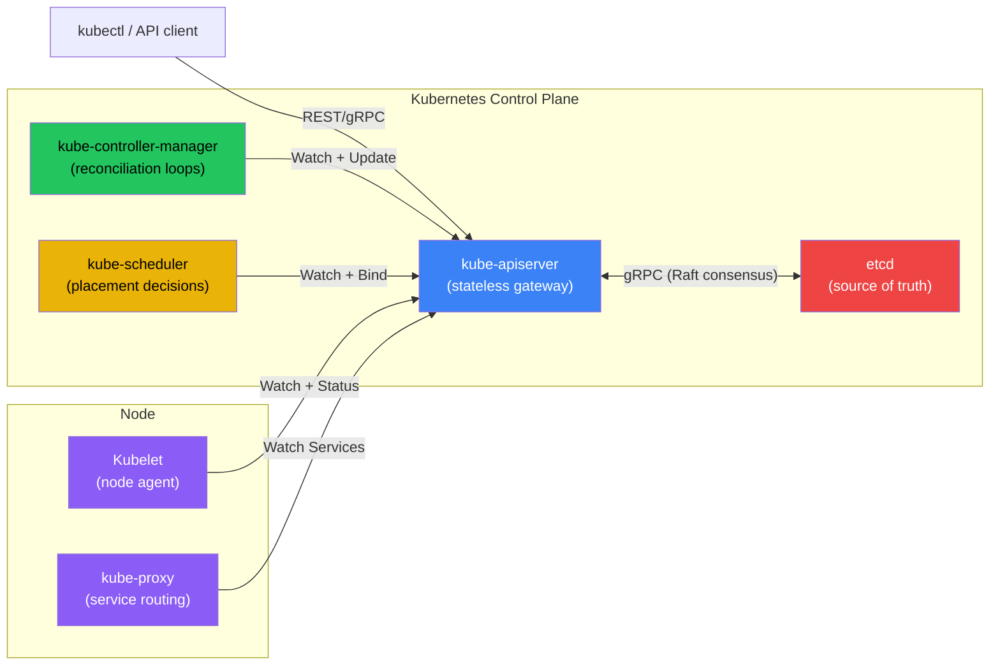
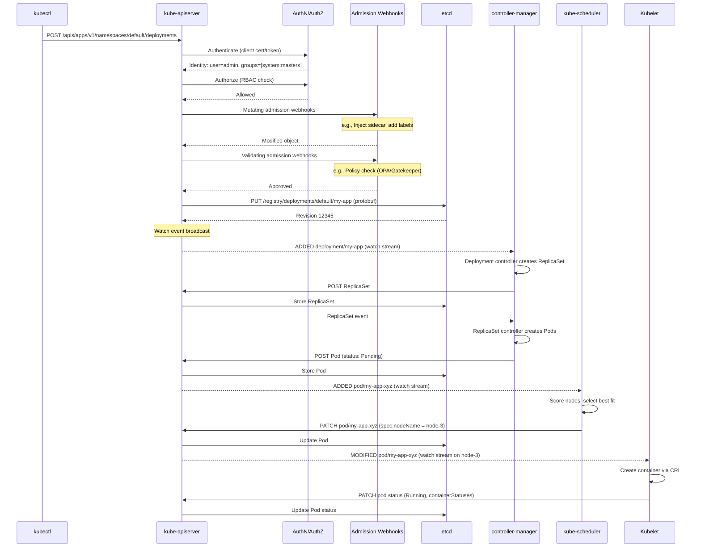
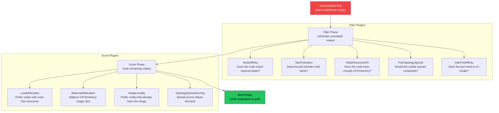

# Chapter 2: Kubernetes Control Plane Internals 🟡

> **What you'll learn:**
> - How the `kube-apiserver` functions as the sole stateless gateway to `etcd`, and why every component communicates exclusively through it
> - The watch/list mechanism and how the reconciliation loop drives the entire system toward desired state
> - How `kube-controller-manager` runs dozens of independent control loops and how `kube-scheduler` assigns pods to nodes
> - How `etcd` stores cluster state, its consistency guarantees, and the failure modes that cause real outages

---

## 2.1 The Kubernetes Architecture: A Reconciliation Engine

Kubernetes is not an imperative system. You don't tell Kubernetes "start 3 containers on node-5." You declare desired state ("I want 3 replicas of this pod") and the system continuously *reconciles* actual state toward desired state. This is the **reconciliation loop** — the single most important concept in Kubernetes architecture.

Every component in the control plane is a loop:

1. **Watch** for changes to objects in the API server
2. **Compare** desired state with current state
3. **Act** to bring current state closer to desired state
4. **Report** new status back to the API server
5. **Repeat** forever



> **Critical Insight:** Nothing talks to `etcd` directly except the API server. Not the scheduler, not the controller manager, not the kubelet. If you ever see a component configured with etcd endpoints, you have a misconfigured (and potentially dangerous) cluster.

---

## 2.2 The kube-apiserver: Stateless Gateway

The `kube-apiserver` is the front door to the entire cluster. Every interaction — from `kubectl apply` to the scheduler binding a pod to a node — goes through the API server as an HTTP/2 REST call.

### What the API Server Actually Does

| Responsibility | How It Works |
|---|---|
| **Authentication** | Validates identity via client certificates, bearer tokens, OIDC, or webhook |
| **Authorization** | Checks RBAC policies (Role/ClusterRole + Binding) |
| **Admission Control** | Runs mutating and validating admission webhooks (e.g., inject sidecar, enforce policies) |
| **Validation** | Schema validation against the OpenAPI spec for the resource kind |
| **Serialization** | Converts between JSON/YAML (external) and protobuf (internal/etcd storage) |
| **Storage** | Reads/writes to etcd via the storage backend |
| **Watch Multiplexing** | Maintains long-lived HTTP/2 streams for watch clients and fans out etcd events |

### The Anatomy of `kubectl apply`

When you run `kubectl apply -f deployment.yaml`, here's the exact sequence:



This entire sequence — from `kubectl apply` to a running container — typically takes 2–5 seconds in a healthy cluster. In an unhealthy cluster (overloaded API server, slow etcd), it can take minutes.

### API Server Performance: The Watch Cache

The API server maintains an in-memory **watch cache** to avoid hitting etcd for every read. This is critical for performance:

```
# // 💥 OUTAGE HAZARD: Default watch cache sizes are too small for large clusters
# kube-apiserver default flags:
--watch-cache-sizes=default
# Default cache holds ~100 objects per resource type
# At 10,000 pods, every LIST request hits etcd directly → etcd overload

# // ✅ FIX: Tune watch cache for your cluster size
--watch-cache-sizes=pods#5000,nodes#1000,configmaps#2000,secrets#2000
--default-watch-cache-size=500
```

| Cluster Size | Recommended Cache | Effect |
|---|---|---|
| < 100 nodes | Default | Fine for small clusters |
| 100–1,000 nodes | 1,000–5,000 per resource | Reduces etcd read load by 80% |
| 1,000–5,000 nodes | 5,000–10,000 per resource | Essential — without this, etcd will be the bottleneck |

---

## 2.3 etcd: The Source of Truth

`etcd` is a distributed key-value store that provides the only persistent state in a Kubernetes cluster. Everything Kubernetes knows — every pod, service, secret, configmap — is stored in etcd.

### How etcd Stores Kubernetes Objects

All Kubernetes objects are stored under the `/registry/` prefix:

```
/registry/pods/default/my-app-xyz          → serialized Pod (protobuf)
/registry/services/specs/default/my-svc    → serialized Service
/registry/deployments/default/my-app       → serialized Deployment
/registry/secrets/default/my-secret        → serialized Secret (encrypted at rest)
/registry/events/default/my-event-12345    → serialized Event
```

### etcd Consistency and the Raft Protocol

etcd uses the **Raft consensus protocol** to replicate data across a cluster of 3 or 5 members. Understanding Raft's implications is critical:

| Property | Implication |
|---|---|
| **Leader-based writes** | All writes go to the leader, then replicate to followers. If leader fails, a new election takes ~1 second. |
| **Quorum reads** | Linearizable reads require a quorum (majority). In a 3-node cluster, you need 2/3 members healthy. |
| **Term-based elections** | Network partitions can cause split-brain if you have an even number of members. Always use 3 or 5. |
| **WAL + Snapshot** | Writes go to a Write-Ahead Log first, then to the B+ tree. Snapshots compact the WAL periodically. |

### etcd Failure Modes That Cause Real Outages

```
# // 💥 OUTAGE HAZARD: etcd on slow disks
# etcd requires fsync latency < 10ms for WAL writes
# If you run etcd on network-attached storage or spinning disks:
# - Write latency spikes to 100ms+
# - Leader lease expires → election storm
# - All API server requests fail for 1-5 seconds during re-election
# - kubectl commands hang, deployments pause, HPA stops scaling

# // ✅ FIX: etcd MUST run on local SSDs with guaranteed IOPS
# AWS: Use i3.xlarge or io2 with 3000+ IOPS
# GCP: Use local SSD or pd-ssd with 3000+ IOPS
# Bare metal: NVMe SSD, dedicated disk (never shared with OS)
```

```
# // 💥 OUTAGE HAZARD: etcd database grows unbounded
# Kubernetes Events, Leases, and frequently-updated objects
# cause etcd to grow. Default db size limit: 2 GiB (etcd < 3.5) / 8 GiB
# When the limit is hit: ALL WRITES FAIL — cluster is frozen

# // ✅ FIX: Enable auto-compaction and defragmentation
--auto-compaction-mode=periodic
--auto-compaction-retention=5m    # Compact revisions older than 5 minutes
--quota-backend-bytes=8589934592  # 8 GiB quota

# Also: Set TTL on Events and configure Event rate limiting in API server
--event-ttl=1h
# And regularly defragment:
etcdctl defrag --cluster
```

---

## 2.4 The kube-controller-manager: 30+ Reconciliation Loops

The `kube-controller-manager` is a single binary that runs dozens of independent control loops, each responsible for reconciling one type of resource:

| Controller | Watches | Creates/Updates | Reconciliation Logic |
|---|---|---|---|
| **Deployment** | Deployments | ReplicaSets | Manages rollout strategy (RollingUpdate, Recreate) |
| **ReplicaSet** | ReplicaSets | Pods | Ensures `spec.replicas` pods exist |
| **StatefulSet** | StatefulSets | Pods + PVCs | Ordered creation/deletion with stable network identity |
| **DaemonSet** | DaemonSets | Pods | Ensures one pod per matching node |
| **Job** | Jobs | Pods | Runs pods to completion |
| **Node** | Nodes | Node status | Marks nodes NotReady after heartbeat timeout |
| **Endpoint** | Services + Pods | Endpoints | Maps service selectors to pod IPs |
| **ServiceAccount** | ServiceAccounts | Secrets (tokens) | Creates API tokens for service accounts |
| **Namespace** | Namespaces | Cleanup | Cascading deletion when namespace is deleted |
| **GarbageCollector** | All objects | Deletion | Removes orphaned objects (ownerReferences) |

### The Informer Pattern: How Controllers Watch Efficiently

Controllers don't poll the API server. They use an **Informer** — a client-side cache with a watch stream:

```
┌─────────────────────────────────────────────────────────────────┐
│                    Controller (e.g., ReplicaSet)                │
│                                                                 │
│  ┌──────────┐    ┌──────────┐    ┌──────────────────────────┐  │
│  │ Informer │───▶│  Cache   │───▶│  Work Queue + Reconciler │  │
│  │ (Watch)  │    │ (Store)  │    │  (Business Logic)        │  │
│  └──────────┘    └──────────┘    └──────────────────────────┘  │
│       │                                       │                 │
│       │ Watch stream (HTTP/2)                 │ API calls       │
│       ▼                                       ▼                 │
│  ┌──────────────────────────────────────────────────────────┐  │
│  │                     kube-apiserver                        │  │
│  └──────────────────────────────────────────────────────────┘  │
└─────────────────────────────────────────────────────────────────┘
```

1. On startup, the Informer does a **LIST** to populate the cache.
2. Then it opens a **WATCH** stream (long-lived HTTP/2 connection).
3. Events (ADDED, MODIFIED, DELETED) arrive on the watch stream and update the local cache.
4. Changed objects are enqueued into a work queue.
5. The reconciler processes items from the queue, compares desired vs actual state, and takes action.

> **Why This Matters:** The Informer pattern means controllers operate on *eventually consistent* local caches. A controller might not see a change for several hundred milliseconds after it's written to etcd. This is by design — it reduces API server load. But it means you must design controllers to be **idempotent** and **level-triggered** (react to current state, not edge-triggered events).

---

## 2.5 The kube-scheduler: Placing Pods on Nodes

The scheduler watches for pods with an empty `spec.nodeName` (unscheduled pods) and assigns them to a node through a multi-phase pipeline:



### Scheduler Performance at Scale

At 5,000 nodes, the scheduler must evaluate potentially thousands of nodes for every pod. Kubernetes uses **scheduling profiles** and **percentage of nodes to score** to keep scheduling latency under control:

```
# // 💥 OUTAGE HAZARD: Scheduler scoring all 5,000 nodes for every pod
# Default percentageOfNodesToScore at 5000 nodes: ~10% (500 nodes)
# But with complex affinity rules, even 500 nodes is too many

# // ✅ FIX: Tune scheduler for large clusters
--percentage-of-nodes-to-score=5  # Only score 250 out of 5000 nodes

# For even better performance, use scheduling profiles with preemption:
apiVersion: kubescheduler.config.k8s.io/v1
kind: KubeSchedulerConfiguration
percentageOfNodesToScore: 5
profiles:
- schedulerName: default-scheduler
  plugins:
    score:
      disabled:
      - name: ImageLocality   # Disable expensive scoring plugins
```

---

<details>
<summary><strong>🏋️ Exercise: Trace a Deployment Through the Control Plane</strong> (click to expand)</summary>

### The Challenge

You apply a Deployment with 3 replicas. Using `kubectl` and the Kubernetes audit log, trace the exact sequence of API calls from Deployment creation to all 3 pods running. Draw a timeline showing which controller creates which object and when.

**Your tasks:**

1. Enable audit logging on your API server (or use `kubectl get events --watch`).
2. Apply the deployment and watch events in real-time.
3. Document the creation chain: Deployment → ReplicaSet → Pod → Scheduled → Running.
4. Measure the time between each step. Is the bottleneck the scheduler, the kubelet, or image pull?

**Bonus:** Introduce a slow admission webhook (add a 2-second webhook) and observe how it affects the entire chain.

<details>
<summary>🔑 Solution</summary>

```bash
#!/bin/bash
# trace-deployment.sh — Trace the full control plane path of a deployment
set -euo pipefail

# Step 1: Watch events in background
kubectl get events --watch --output-watch-events -o json | \
  jq -r '[.object.lastTimestamp, .object.reason, .object.involvedObject.kind,
          .object.involvedObject.name, .object.message] | @tsv' &
WATCH_PID=$!

# Step 2: Apply the deployment
cat <<EOF | kubectl apply -f -
apiVersion: apps/v1
kind: Deployment
metadata:
  name: trace-test
  namespace: default
spec:
  replicas: 3
  selector:
    matchLabels:
      app: trace-test
  template:
    metadata:
      labels:
        app: trace-test
    spec:
      containers:
      - name: app
        image: nginx:1.25-alpine  # Small image for fast pull
        resources:
          requests:
            cpu: "100m"
            memory: "64Mi"
          limits:
            cpu: "200m"
            memory: "128Mi"
EOF

# Step 3: Record timestamps for each phase
echo "=== Waiting for all phases... ==="
sleep 10

# Step 4: Analyze the timeline
echo ""
echo "=== EVENT TIMELINE ==="
echo ""

# Show the creation chain with timestamps
kubectl get events --field-selector involvedObject.name=trace-test \
  --sort-by='.lastTimestamp' -o custom-columns=\
'TIME:.lastTimestamp,KIND:.involvedObject.kind,REASON:.reason,MESSAGE:.message'

# Expected output timeline:
#
# T+0.0s  Deployment  ScalingReplicaSet  Scaled up replica set trace-test-abc to 3
# T+0.1s  ReplicaSet  SuccessfulCreate   Created pod: trace-test-abc-xyz1
# T+0.1s  ReplicaSet  SuccessfulCreate   Created pod: trace-test-abc-xyz2
# T+0.1s  ReplicaSet  SuccessfulCreate   Created pod: trace-test-abc-xyz3
# T+0.3s  Pod         Scheduled          Successfully assigned to node-1
# T+0.3s  Pod         Scheduled          Successfully assigned to node-2
# T+0.4s  Pod         Scheduled          Successfully assigned to node-3
# T+0.5s  Pod         Pulling            Pulling image "nginx:1.25-alpine"
# T+2.0s  Pod         Pulled             Successfully pulled image
# T+2.1s  Pod         Created            Created container app
# T+2.2s  Pod         Started            Started container app

# Step 5: Identify the bottleneck
echo ""
echo "=== BOTTLENECK ANALYSIS ==="

# The timeline reveals:
# - Deployment → ReplicaSet: ~100ms (Deployment controller reconciliation)
# - ReplicaSet → Pods: ~100ms (ReplicaSet controller creates all 3 in parallel)
# - Pods → Scheduled: ~200-400ms (scheduler scoring + binding)
# - Scheduled → Running: ~1.5-3s (image pull is almost always the bottleneck)
#
# OPTIMIZATION: Pre-pull images using a DaemonSet to eliminate the pull latency
# OPTIMIZATION: Use --image-pull-policy=IfNotPresent (default for tagged images)

# Clean up
kill $WATCH_PID 2>/dev/null || true
kubectl delete deployment trace-test

echo ""
echo "The bottleneck is almost always image pull time."
echo "For pre-pulled images, end-to-end is typically < 1 second."
```

**Key Insight:** The control plane itself is fast (< 500ms from apply to scheduled). The dominant latency is almost always container image pull. At scale, this means:
- Use small base images (Alpine, distroless)
- Pre-warm images on nodes using DaemonSets
- Use image streaming (GKE Image Streaming, containerd stargz) for large images
- Set `imagePullPolicy: IfNotPresent` for tagged images

</details>
</details>

---

> **Key Takeaways:**
> - Kubernetes is a reconciliation engine, not an imperative system. Every component watches the API server and continuously drives actual state toward desired state.
> - The `kube-apiserver` is the only component that talks to etcd. It handles authentication, authorization, admission control, validation, and watch multiplexing.
> - etcd is the single point of truth. It uses Raft consensus and requires low-latency local SSDs. The top three etcd failure modes are: slow disks, unbounded database growth, and split-brain from even-numbered member counts.
> - The kube-controller-manager runs 30+ independent reconciliation loops using the Informer pattern (LIST + WATCH + local cache + work queue).
> - The scheduler uses a filter-then-score pipeline. At scale (5,000+ nodes), tune `percentageOfNodesToScore` and disable expensive scoring plugins.
> - The dominant latency in pod startup is almost always container image pull, not control plane processing.

> **See also:**
> - [Chapter 1: Namespaces, cgroups, and runc](ch01-namespaces-cgroups-runc.md) — the Linux primitives that the control plane ultimately invokes
> - [Chapter 3: The Kubelet and the Node](ch03-kubelet-and-the-node.md) — what happens after the scheduler assigns a pod to a node
> - [Chapter 8: Multi-Tenancy and Scaling Limits](ch08-multi-tenancy-scaling.md) — etcd tuning and API server caching for large clusters
