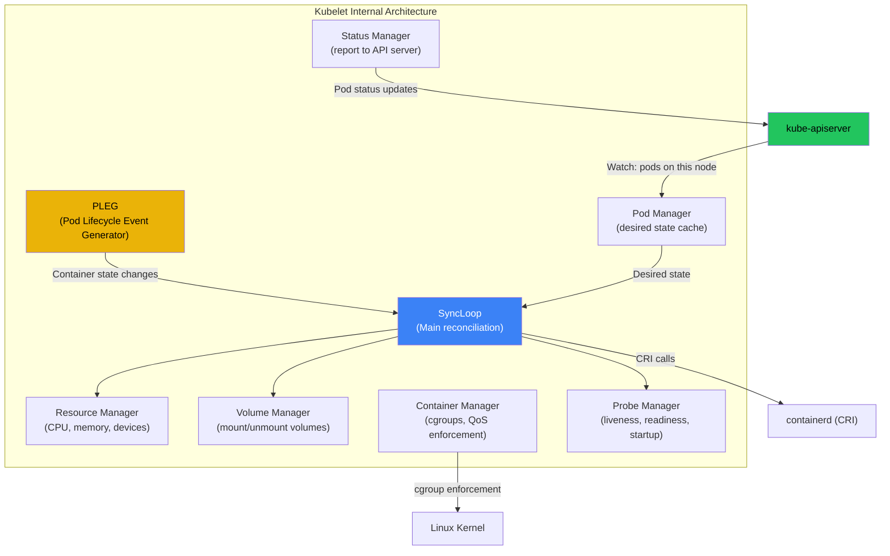
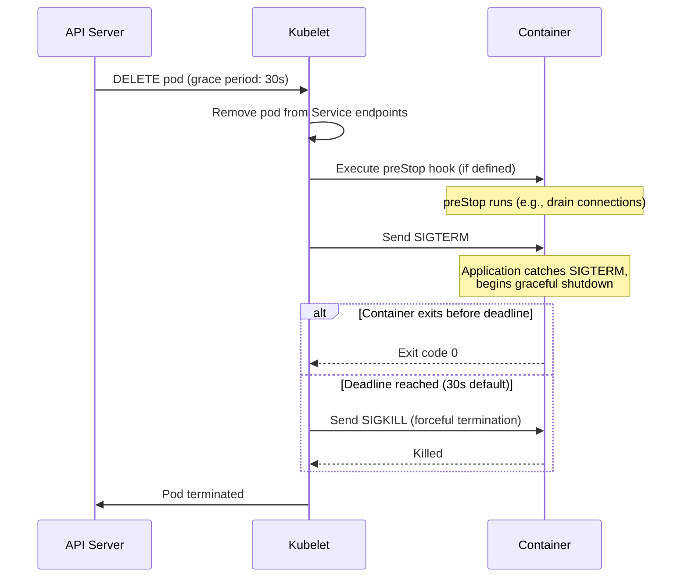

# Chapter 3: The Kubelet and the Node 🟡

> **What you'll learn:**
> - How the Kubelet translates API server PodSpecs into CRI calls that create actual containers on a node
> - The Pod Sandbox model: the pause container, shared namespaces, and why every pod has a hidden "infrastructure container"
> - Pod lifecycle phases, container restart policies, and exactly when and why pods get evicted
> - Ephemeral containers, static pods, and the kubelet's node-level garbage collection

---

## 3.1 The Kubelet: The Node Agent

The kubelet is the only Kubernetes component that runs on every node and directly manages containers. It is not a simple "start container when told" agent — it is a sophisticated reconciliation engine that continuously ensures the containers on its node match the desired state from the API server.



### The SyncLoop: The Kubelet's Heartbeat

The kubelet's main loop runs every **10 seconds** by default (configurable via `--sync-frequency`). On each iteration:

1. **Get desired state** from the pod manager (populated by API server watch).
2. **Get actual state** from the PLEG (Pod Lifecycle Event Generator), which queries containerd.
3. **Diff** desired vs actual.
4. **Reconcile**: create missing containers, kill extra containers, restart crashed containers.
5. **Report** status back to the API server.

```
# // 💥 OUTAGE HAZARD: PLEG not healthy
# If containerd is slow to respond (e.g., overloaded node, slow disk for image pulls),
# PLEG generates a "PLEG is not healthy" event after 3 minutes:
#   "PLEG is not healthy: pleg was last seen active 3m0s ago; threshold is 3m0s"
# This causes the node to go NotReady and ALL pods to be evicted.

# // ✅ FIX: Monitor PLEG latency and ensure containerd is healthy
# Key metric: kubelet_pleg_relist_duration_seconds
# Alert if p99 > 5s — this means containerd is slow
# Common causes: overloaded disk I/O from image pulls, too many containers, 
# containerd memory leak (upgrade containerd)
```

---

## 3.2 The Pod Sandbox: The Pause Container

When the kubelet creates a pod, it doesn't immediately start your application containers. First, it creates a **Pod Sandbox** — an infrastructure container that sets up the shared namespaces for the pod.

### What Is the Pause Container?

The pause container (`registry.k8s.io/pause:3.9`) is a tiny (~700 KB) container that does almost nothing — it calls `pause()` in an infinite loop. Its purpose is to:

1. **Hold the network namespace** — the pause container creates the network namespace, and all other containers in the pod join it via `setns()`.
2. **Be PID 1** — in pods with `shareProcessNamespace: true`, the pause container is PID 1 and reaps zombie processes.
3. **Survive container restarts** — when your application container crashes and restarts, the network namespace (IP address, open connections) persists because the pause container is still running.

```
Pod Network Namespace Lifecycle:

┌──────────── Pod Sandbox ────────────────────────────────────┐
│                                                              │
│  pause container (PID 1 in PID namespace)                    │
│  ├── Owns: Network namespace (eth0, IP 10.244.1.5)          │
│  ├── Owns: IPC namespace                                     │
│  └── Owns: UTS namespace                                     │
│                                                              │
│  app container (joins pod's network, IPC, UTS namespaces)    │
│  ├── Shares: Network (10.244.1.5, same eth0)                │
│  ├── Shares: IPC (can use shared memory with sidecar)        │
│  ├── Own: PID namespace (or shared if shareProcessNamespace) │
│  └── Own: Mount namespace (own filesystem)                   │
│                                                              │
│  sidecar container (same shared namespaces)                  │
│  ├── Shares: Network (10.244.1.5:9090 for metrics)          │
│  └── Own: Mount namespace                                    │
│                                                              │
└──────────────────────────────────────────────────────────────┘
```

### Pod Sandbox Creation: The Exact Sequence

```bash
# Step 1: Kubelet calls CRI RunPodSandbox
# containerd creates the pause container with new namespaces

# Step 2: CNI plugin is invoked to set up networking
# - Creates veth pair: one end in pod's netns, other on host bridge
# - Assigns IP address from IPAM (IP Address Management)
# - Sets up routes and firewall rules

# Step 3: Kubelet calls CRI CreateContainer for each container in the pod
# Each container joins the sandbox's network namespace:
# config.linux.namespaces[network].path = /proc/<pause-pid>/ns/net

# Step 4: Kubelet calls CRI StartContainer for each container
# Container runtime calls runc, which calls setns() + execve()
```

---

## 3.3 Pod Lifecycle: From Pending to Terminated

A pod progresses through well-defined phases:

| Phase | Meaning | Typical Duration |
|---|---|---|
| **Pending** | Pod accepted by API server, waiting for scheduling + container creation | 0.5–30s (image pull dependent) |
| **Running** | At least one container is running, starting, or restarting | Until completion or deletion |
| **Succeeded** | All containers exited with code 0 (only for Job/CronJob pods) | — |
| **Failed** | All containers terminated, at least one exited non-zero | — |
| **Unknown** | Kubelet cannot report status (network partition, node failure) | — |

### Container States vs Pod Phase

Within a running pod, each individual container has its own state:

| Container State | Description |
|---|---|
| **Waiting** | Container is waiting to start (image pull, init containers not done, etc.) |
| **Running** | Container is executing |
| **Terminated** | Container has exited (successfully or with error) |

### The Restart Policy

| `restartPolicy` | Behavior | Used By |
|---|---|---|
| `Always` (default) | Restart container on any exit, with exponential backoff (10s, 20s, 40s, ... up to 5min) | Deployments, StatefulSets, DaemonSets |
| `OnFailure` | Restart only on non-zero exit code | Jobs |
| `Never` | Never restart | Jobs (when you want to inspect failed containers) |

### Graceful Shutdown: SIGTERM, PreStop, and the 30-Second Clock

When a pod is deleted, the kubelet follows a precise sequence:



```yaml
# // 💥 OUTAGE HAZARD: No preStop hook, app doesn't handle SIGTERM
# When pod is terminated during rolling update:
# 1. Pod is removed from Service endpoints
# 2. But existing connections are still in-flight
# 3. SIGTERM is sent, app exits immediately
# 4. In-flight requests get connection reset → 502 errors
spec:
  containers:
  - name: app
    # No lifecycle.preStop defined
    # App ignores SIGTERM
    # Results in dropped connections during deploys

# // ✅ FIX: PreStop hook + SIGTERM handling + adequate grace period
spec:
  terminationGracePeriodSeconds: 60  # Give enough time for drain
  containers:
  - name: app
    lifecycle:
      preStop:
        exec:
          command: ["/bin/sh", "-c", "sleep 5"]
          # Sleep 5s to allow kube-proxy/iptables to update
          # so no new connections arrive at this pod
    # App must also handle SIGTERM and drain in-flight requests
```

> **Production Rule:** The `sleep 5` in the preStop hook is not a hack — it's a crucial timing buffer. After the API server removes the pod from Endpoints, kube-proxy (or Cilium/eBPF) needs time to update routing rules on *every node*. Without the sleep, new connections may still arrive at the terminating pod during the propagation delay.

---

## 3.4 Probes: Liveness, Readiness, and Startup

The kubelet continuously probes containers to determine their health:

| Probe | Purpose | Failure Action | When It Runs |
|---|---|---|---|
| **Startup** | Is the container finished starting? | Kill and restart | Only during startup (before liveness kicks in) |
| **Liveness** | Is the container alive? | Kill and restart | Continuously after startup probe succeeds |
| **Readiness** | Is the container ready to receive traffic? | Remove from Service endpoints | Continuously |

### The YAML-Monkey Way vs The Platform Architect Way

```yaml
# // 💥 OUTAGE HAZARD: Liveness probe on the same endpoint as readiness
# Common mistake: using the same /health endpoint for both probes
# If the app is temporarily overloaded (slow response), liveness fails,
# kubelet kills the container, making the overload WORSE (restart storm)
spec:
  containers:
  - name: app
    livenessProbe:
      httpGet:
        path: /health  # 💥 Same as readiness — app under load = restart storm
        port: 8080
      initialDelaySeconds: 5
      periodSeconds: 5
      failureThreshold: 3
    readinessProbe:
      httpGet:
        path: /health  # 💥 Same as liveness
        port: 8080
```

```yaml
# // ✅ FIX: Separate concerns for each probe type
spec:
  containers:
  - name: app
    # Startup probe: generous timeout for slow-starting apps (e.g., JVM warmup)
    startupProbe:
      httpGet:
        path: /healthz/started
        port: 8080
      periodSeconds: 5
      failureThreshold: 30  # 30 × 5s = 150s to start

    # Liveness probe: only checks if the process is fundamentally broken
    # (deadlock, panic loop) — NOT load-dependent
    livenessProbe:
      httpGet:
        path: /healthz/alive  # Separate endpoint: checks for deadlocks only
        port: 8080
      periodSeconds: 10
      failureThreshold: 3    # 3 × 10s = 30s before kill

    # Readiness probe: checks if the app can serve traffic
    # (DB connected, cache warm, not overloaded)
    readinessProbe:
      httpGet:
        path: /healthz/ready  # Checks dependencies + load
        port: 8080
      periodSeconds: 5
      failureThreshold: 2    # 2 × 5s = 10s before removing from endpoints
```

---

## 3.5 Ephemeral Containers and Static Pods

### Ephemeral Containers: Debugging in Production

Ephemeral containers are temporary containers injected into a running pod for debugging. They join the pod's namespaces (network, PID if shared) but have no liveness/readiness probes and are never restarted.

```bash
# Debug a running pod by injecting a shell
kubectl debug -it my-app-pod --image=busybox:latest --target=app

# This creates an ephemeral container that:
# - Shares the network namespace (can curl localhost:8080)
# - Can see the target container's processes (if shareProcessNamespace: true)
# - Has its own filesystem (busybox tools available)
# - Is not restarted on exit
```

### Static Pods: The Chicken-and-Egg Problem

Static pods are pods managed directly by the kubelet, without the API server. They are defined as YAML files in a directory (usually `/etc/kubernetes/manifests/`). The kubelet watches this directory and creates/destroys containers accordingly.

This solves the chicken-and-egg problem: how do you run the API server, etcd, controller-manager, and scheduler as pods... when those components ARE the control plane that manages pods?

```
/etc/kubernetes/manifests/
├── etcd.yaml                    # Static pod
├── kube-apiserver.yaml          # Static pod
├── kube-controller-manager.yaml # Static pod
└── kube-scheduler.yaml          # Static pod

# Kubelet reads these files directly, creates containers via CRI
# Mirror pods are created in the API server so kubectl can see them
# But the kubelet is the source of truth — deleting the mirror pod
# does NOT delete the static pod
```

---

## 3.6 Node Eviction and Resource Pressure

The kubelet monitors node resources and can evict pods when resources are critically low:

| Signal | Default Threshold | Effect |
|---|---|---|
| `memory.available` | < 100 MiB | Evict BestEffort pods, then Burstable |
| `nodefs.available` | < 10% | Evict pods using most disk (container logs, ephemeral storage) |
| `imagefs.available` | < 15% | Garbage collect unused container images |
| `pid.available` | < OS limit | Evict pods creating too many processes |

### Eviction Order

When eviction is triggered, pods are evicted in this order:

1. **BestEffort** pods (no resource requests/limits) — evicted first
2. **Burstable** pods exceeding their requests — evicted next
3. **Guaranteed** pods — evicted last (and only if absolutely necessary)

Within each QoS class, pods are sorted by their resource usage relative to their requests. The pod using the most excess resources is evicted first.

---

<details>
<summary><strong>🏋️ Exercise: Pod Lifecycle Investigation</strong> (click to expand)</summary>

### The Challenge

A developer reports that their application loses WebSocket connections every time a rolling update happens. They have a Deployment with `maxSurge: 1` and `maxUnavailable: 0`. Investigate and fix the issue.

**Your tasks:**

1. Identify why in-flight WebSocket connections are being dropped during rolling updates.
2. Implement a solution using `preStop`, `terminationGracePeriodSeconds`, and proper SIGTERM handling.
3. Verify that zero connections are dropped during a rolling update by running a simple WebSocket load test.

<details>
<summary>🔑 Solution</summary>

**Root Cause Analysis:**

During a rolling update, the old pod receives a DELETE request. Three things happen simultaneously:

1. The pod is removed from Service endpoints (eventually — this takes 1-5 seconds to propagate to all kube-proxy instances).
2. The preStop hook runs (if defined).
3. SIGTERM is sent to the container.

The problem: if the app doesn't handle SIGTERM gracefully, it exits immediately. WebSocket connections in flight are killed. Even if the app handles SIGTERM, new connections may still arrive during the propagation delay.

**The Fix:**

```yaml
apiVersion: apps/v1
kind: Deployment
metadata:
  name: websocket-app
spec:
  replicas: 3
  strategy:
    type: RollingUpdate
    rollingUpdate:
      maxSurge: 1
      maxUnavailable: 0
  template:
    spec:
      terminationGracePeriodSeconds: 120   # 2 minutes for long-lived WS connections
      containers:
      - name: app
        image: websocket-app:v2
        ports:
        - containerPort: 8080
        lifecycle:
          preStop:
            exec:
              command:
              - /bin/sh
              - -c
              - |
                # Step 1: Sleep to allow endpoint propagation (5-10s)
                sleep 10
                # Step 2: Signal the app to stop accepting new connections
                # (app should expose a /drain endpoint or handle SIGUSR1)
                curl -s http://localhost:8080/admin/drain
                # Step 3: Wait for existing connections to close gracefully
                # The app's SIGTERM handler will do the actual shutdown
        # Readiness probe: once drain is signaled, report unready
        readinessProbe:
          httpGet:
            path: /healthz/ready
            port: 8080
          periodSeconds: 2
          failureThreshold: 1    # Remove from endpoints quickly
```

**Application-Side SIGTERM Handler (Rust example):**

```rust
use tokio::signal::unix::{signal, SignalKind};
use std::sync::atomic::{AtomicBool, Ordering};
use std::sync::Arc;

static DRAINING: AtomicBool = AtomicBool::new(false);

async fn graceful_shutdown(active_connections: Arc<AtomicUsize>) {
    let mut sigterm = signal(SignalKind::terminate()).unwrap();
    sigterm.recv().await;

    // Stop accepting new connections
    DRAINING.store(true, Ordering::SeqCst);

    // Wait for active connections to drain (with timeout)
    let deadline = tokio::time::Instant::now() + Duration::from_secs(90);
    while active_connections.load(Ordering::SeqCst) > 0 {
        if tokio::time::Instant::now() > deadline {
            eprintln!("Drain timeout — {} connections still active",
                       active_connections.load(Ordering::SeqCst));
            break;
        }
        tokio::time::sleep(Duration::from_millis(500)).await;
    }

    // Exit cleanly
    std::process::exit(0);
}
```

**Timeline of a Zero-Downtime Rolling Update:**

```
T+0.0s: kubectl updates Deployment image → new pod created
T+0.5s: New pod passes startup probe → marked Ready
T+1.0s: Old pod receives DELETE
T+1.0s: preStop starts: sleep 10
T+1.5s: Old pod removed from Service endpoints
T+3.0s: kube-proxy updated on all nodes — no new traffic to old pod
T+11.0s: preStop sleep finishes, curl /admin/drain
T+11.1s: App stops accepting new connections
T+11.1s: SIGTERM sent (after preStop completes)
T+11.1s: App begins draining active WebSocket connections
T+45.0s: Last WebSocket client disconnects gracefully
T+45.1s: App exits with code 0
T+45.1s: Pod fully terminated — zero connections dropped
```

</details>
</details>

---

> **Key Takeaways:**
> - The kubelet is a reconciliation engine that runs a SyncLoop every 10 seconds, comparing desired state (from API server) with actual state (from containerd via PLEG).
> - Every pod starts with a hidden "pause" container that owns the network namespace. Application containers join this namespace, which is why containers in a pod share `localhost`.
> - Pod termination follows a precise sequence: remove from endpoints → preStop hook → SIGTERM → grace period → SIGKILL. Getting this wrong causes dropped connections during rolling updates.
> - Use separate endpoints for liveness (is the process broken?) and readiness (can it serve traffic?). Never use the same endpoint for both — it causes restart storms under load.
> - Startup probes prevent slow-starting apps from being killed by liveness probes before they're ready.
> - Ephemeral containers allow debugging production pods without restarting them. Static pods solve the bootstrap problem for control plane components.
> - The kubelet evicts pods under resource pressure in QoS class order: BestEffort first, Guaranteed last.

> **See also:**
> - [Chapter 1: Namespaces, cgroups, and runc](ch01-namespaces-cgroups-runc.md) — the kernel primitives the kubelet invokes through CRI
> - [Chapter 2: Kubernetes Control Plane Internals](ch02-control-plane-internals.md) — how the API server and scheduler feed PodSpecs to the kubelet
> - [Chapter 4: The CNI and Pod-to-Pod Communication](ch04-cni-pod-to-pod.md) — how the CNI plugin sets up networking in the pod sandbox
