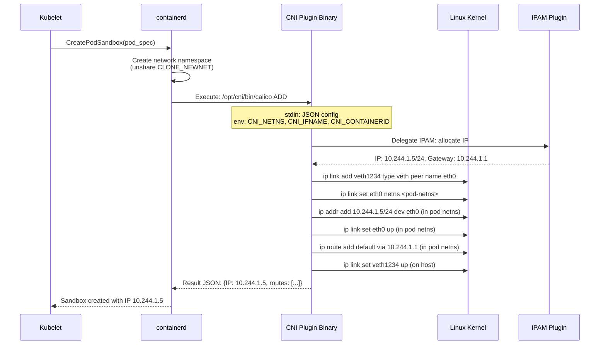

# Chapter 4: The CNI and Pod-to-Pod Communication 🟡

> **What you'll learn:**
> - How the Container Network Interface (CNI) specification works and what happens when a CNI plugin is invoked during pod creation
> - The difference between overlay networks (VXLAN/Geneve) and native routing (BGP) — and when to use each
> - How IP Address Management (IPAM) works and how to prevent IP exhaustion in large clusters
> - How DNS resolution works inside a Kubernetes cluster (CoreDNS, ndots, search domains)

---

## 4.1 The Kubernetes Network Model

Kubernetes defines a simple but powerful network model with three fundamental requirements:

1. **Every pod gets its own unique IP address** — no NAT between pods.
2. **Any pod can communicate with any other pod** by IP, regardless of which node they are on — no NAT.
3. **The IP a pod sees for itself is the same IP other pods see** — no network address translation.

This flat network model is elegant but it must be *implemented* by a third-party network plugin. Kubernetes itself does not implement networking — it delegates to a **Container Network Interface (CNI)** plugin.

| CNI Plugin | Network Model | Protocol | Best For |
|---|---|---|---|
| **Calico** | BGP native routing or VXLAN overlay | BGP / VXLAN | Large clusters, network policy enforcement |
| **Cilium** | eBPF datapath | eBPF | High-performance, observability, service mesh |
| **Flannel** | VXLAN overlay | VXLAN | Simple clusters, learning environments |
| **AWS VPC CNI** | Native VPC networking | ENI | AWS EKS (pods get real VPC IPs) |
| **Azure CNI** | Native VNet networking | ENI | Azure AKS (pods get real VNet IPs) |
| **Weave Net** | VXLAN + mesh routing | VXLAN | Multi-cloud, automatic mesh |

---

## 4.2 How CNI Actually Works

CNI is not a daemon or a service — it is a **specification** for executable binaries that are invoked by the container runtime (containerd) during pod creation and deletion.

### The CNI Protocol



### CNI Configuration

CNI plugins are configured via JSON files in `/etc/cni/net.d/`:

```json
{
  "cniVersion": "1.0.0",
  "name": "k8s-pod-network",
  "type": "calico",
  "ipam": {
    "type": "calico-ipam",
    "assign_ipv4": "true",
    "ipv4_pools": ["10.244.0.0/16"]
  },
  "policy": {
    "type": "k8s"
  },
  "kubernetes": {
    "kubeconfig": "/etc/cni/net.d/calico-kubeconfig"
  }
}
```

The CNI binary location is typically `/opt/cni/bin/`. During pod creation, containerd:

1. Reads the CNI config from `/etc/cni/net.d/`.
2. Creates a new network namespace for the pod sandbox.
3. Executes the CNI binary (`/opt/cni/bin/calico`) with `ADD` command.
4. Passes the network namespace path and container ID as environment variables.
5. Receives the assigned IP address and routes as a JSON response.

---

## 4.3 Overlay Networks vs Native Routing

The fundamental question in Kubernetes networking is: *how do packets from a pod on Node A reach a pod on Node B?* There are two approaches:

### Overlay Networks (VXLAN/Geneve)

Overlay networks **encapsulate** pod-to-pod packets inside node-to-node UDP packets:

```
┌─────────── Original Pod Packet ────────────┐
│ Src: 10.244.1.5  Dst: 10.244.2.8          │
│ [TCP/HTTP payload]                          │
└─────────────────────────────────────────────┘
                    ↓ encapsulated into ↓
┌─────────── Outer Node Packet ──────────────────────────────┐
│ Src: 192.168.1.10  Dst: 192.168.1.20                      │
│ UDP Port 4789 (VXLAN)                                       │
│ ┌─────────── Inner Pod Packet ────────────┐                │
│ │ Src: 10.244.1.5  Dst: 10.244.2.8       │                │
│ │ [TCP/HTTP payload]                       │                │
│ └──────────────────────────────────────────┘                │
└─────────────────────────────────────────────────────────────┘
```

### Native Routing (BGP)

With BGP routing, node routers advertise pod CIDR routes to each other. No encapsulation — packets are routed natively at Layer 3:

```
Node 1 (192.168.1.10) announces: "I own 10.244.1.0/24"
Node 2 (192.168.1.20) announces: "I own 10.244.2.0/24"

Packet from pod 10.244.1.5 to pod 10.244.2.8:
  1. Pod sends to default gateway (host veth)
  2. Host routing table: 10.244.2.0/24 via 192.168.1.20
  3. Standard IP routing — no encapsulation overhead
```

### Comparison

| Feature | Overlay (VXLAN) | Native Routing (BGP) |
|---|---|---|
| **Setup complexity** | Simple — works on any network | Requires BGP-capable routers or direct node connectivity |
| **Packet overhead** | 50-byte VXLAN header per packet | Zero overhead |
| **MTU impact** | Reduces effective MTU by 50 bytes (1500→1450) | Full MTU preserved |
| **Performance** | 5–15% throughput reduction | Wire-speed performance |
| **Cross-subnet** | Works across any L3 network | Requires BGP peering or direct routes |
| **Cloud support** | Universal | AWS VPC CNI (native), GKE (native), Azure CNI (native) |
| **Debugging** | Harder — must decap packets | Easier — standard `tcpdump` works |

> **Production Recommendation:** Use native routing (BGP or cloud-native CNI) whenever possible. The MTU reduction from VXLAN causes fragmentation at scale, and the encapsulation overhead adds measurable latency. In cloud environments, always use the cloud-native CNI (AWS VPC CNI, Azure CNI, GKE VPC-native) which gives pods real VPC/VNet IPs with zero overhead.

---

## 4.4 IP Address Management (IPAM) and IP Exhaustion

Every pod needs a unique IP address. In a cluster with thousands of pods, IP address management becomes critical.

### The Subnet Architecture

```
Cluster CIDR:  10.244.0.0/16  (65,536 addresses)
  ├── Node 1:  10.244.0.0/24  (256 addresses → 256 pods per node)
  ├── Node 2:  10.244.1.0/24
  ├── Node 3:  10.244.2.0/24
  └── ...up to 256 nodes with /24 per-node subnets

Service CIDR: 10.96.0.0/12  (1,048,576 addresses for ClusterIP services)
```

### IP Exhaustion: A Real Outage Scenario

```
# // 💥 OUTAGE HAZARD: /16 cluster CIDR with /24 per-node subnets
# Cluster CIDR: 10.244.0.0/16
# Per-node: /24 = 256 IPs per node
# Max nodes: 256 (because 16-bit network, 8-bit node, 8-bit pod)
#
# At node 257, no more subnets available → new nodes cannot join
# At 256 pods per node, DaemonSets eat into the limit
# (kube-proxy, Cilium agent, logging agent, monitoring, etc.)
# Each DaemonSet pod = 1 IP × number of nodes
# Real limit: ~220 user pods per node after DaemonSet overhead

# // ✅ FIX: Plan CIDR allocation for growth
# Use /14 or /12 cluster CIDR for large clusters
Cluster CIDR: 10.240.0.0/12  (1,048,576 addresses)
Per-node:     /23 = 512 IPs per node
Max nodes:    2,048 nodes (with /23 per-node allocation)

# For cloud-native CNIs (AWS VPC CNI):
# Each ENI (Elastic Network Interface) provides a limited number of IPs
# m5.xlarge: 4 ENIs × 15 IPs = 58 pod IPs (minus 2 for ENI primary IPs)
# SOLUTION: Enable prefix delegation — each ENI gets a /28 (16 IPs)
# m5.xlarge with prefix delegation: 4 ENIs × 16 × 4 = 256 pod IPs
```

### AWS VPC CNI: A Deep Dive

The AWS VPC CNI is unique because it assigns real VPC IP addresses to pods (not overlay IPs). This has enormous advantages (native VPC routing, security groups on pods) but creates IP pressure:

| Instance Type | Max ENIs | IPs per ENI | Max Pod IPs | With Prefix Delegation |
|---|---|---|---|---|
| t3.medium | 3 | 6 | 15 | 48 |
| m5.xlarge | 4 | 15 | 56 | 240 |
| m5.4xlarge | 8 | 30 | 232 | 960+ |
| m5.24xlarge | 15 | 50 | 735 | 3,840+ |

> **Production Rule:** Always enable prefix delegation (`ENABLE_PREFIX_DELEGATION=true`) on AWS EKS. Without it, a `t3.medium` can only run 15 pods — less than most DaemonSet deployments require.

---

## 4.5 Kubernetes DNS: CoreDNS and the ndots Problem

Every pod in Kubernetes gets `/etc/resolv.conf` configured to use the cluster DNS service (CoreDNS):

```
# Pod's /etc/resolv.conf
nameserver 10.96.0.10           # CoreDNS ClusterIP
search default.svc.cluster.local svc.cluster.local cluster.local
options ndots:5
```

### The ndots:5 Problem

The `ndots:5` setting means: if a hostname has fewer than 5 dots, append each search domain and try those first before the original name.

When your app resolves `api.example.com` (2 dots, < 5):

```
1. api.example.com.default.svc.cluster.local  → NXDOMAIN (wasted query)
2. api.example.com.svc.cluster.local           → NXDOMAIN (wasted query)
3. api.example.com.cluster.local               → NXDOMAIN (wasted query)
4. api.example.com                             → SUCCESS (finally!)
```

That's **4 DNS queries** for every external hostname resolution. At 10,000 pods, each making 100 external DNS lookups/second = **4 million unnecessary DNS queries/second** hitting CoreDNS.

```yaml
# // 💥 OUTAGE HAZARD: Default ndots:5 with many external DNS lookups
# CoreDNS becomes the bottleneck, DNS latency spikes to 100ms+,
# apps start timing out on external service calls

# // ✅ FIX: Reduce ndots for pods that primarily call external services
spec:
  dnsConfig:
    options:
    - name: ndots
      value: "2"    # External names (api.example.com) resolve in 1 query
  # OR: For internal-only services, append a trailing dot:
  # http://my-service.default.svc.cluster.local.  (trailing dot = FQDN, no search)
```

---

<details>
<summary><strong>🏋️ Exercise: Debug a CNI Network Failure</strong> (click to expand)</summary>

### The Challenge

A new node joins your cluster, but pods scheduled on it cannot communicate with pods on other nodes. `kubectl exec` into a pod on the new node and `ping` a pod on another node fails. The pod has an IP address assigned (`10.244.5.3`).

Diagnose and fix the issue.

**Your tasks:**

1. Verify the CNI plugin is installed and configured on the new node (`/etc/cni/net.d/`, `/opt/cni/bin/`).
2. Check if the veth pair is correctly set up between the pod and the host.
3. Verify the node's routing table has routes to other node pod CIDRs.
4. Check if the VXLAN tunnel (or BGP session) is established to other nodes.
5. Identify the root cause and fix it.

<details>
<summary>🔑 Solution</summary>

```bash
#!/bin/bash
# debug-cni-failure.sh — Diagnose pod network connectivity failure
set -euo pipefail

NODE="new-node"
POD_IP="10.244.5.3"
REMOTE_POD_IP="10.244.1.8"  # Pod on another node

echo "=== Step 1: Verify CNI plugin installation ==="
ssh $NODE "ls -la /opt/cni/bin/"
# Expected: calico, calico-ipam, bandwidth, bridge, host-local, loopback, portmap
# If missing: CNI plugin DaemonSet (calico-node) hasn't initialized on this node

ssh $NODE "ls -la /etc/cni/net.d/"
# Expected: 10-calico.conflist (or similar)
# If missing: calico-node pod on this node hasn't written the CNI config yet

ssh $NODE "crictl pods | head -5"
# Check if calico-node pod is running on this node
# If not: check node taints, DaemonSet tolerations

echo "=== Step 2: Verify veth pair ==="
# Find the pod's network namespace
POD_ID=$(kubectl get pod -o jsonpath='{.metadata.uid}' test-pod)
ssh $NODE "ip link show type veth"
# Expected: caliXXXXXXX@if3 or similar veth interface

# From inside the pod's network namespace:
ssh $NODE "crictl inspect <container-id> | jq '.info.pid'"
# Then: nsenter -t <pid> -n ip addr show
# Expected: eth0 with IP 10.244.5.3/32

echo "=== Step 3: Check host routing table ==="
ssh $NODE "ip route | grep 10.244"
# Expected:
# 10.244.5.0/24 dev cali-bond0 proto kernel scope link
# 10.244.1.0/24 via 192.168.1.10 dev vxlan.calico  (VXLAN)
# OR
# 10.244.1.0/24 via 192.168.1.10 dev eth0 proto bird (BGP)
#
# If routes to OTHER nodes' pod CIDRs are missing:
# -> The cross-node routing is broken

echo "=== Step 4: Check VXLAN tunnel / BGP session ==="
# For VXLAN:
ssh $NODE "ip -d link show vxlan.calico"
# Check: is the VXLAN interface UP? Does it have the correct VNI?

# For BGP (Calico):
ssh $NODE "calicoctl node status"
# Expected: BGP peer status = Established for all peers
# If "Idle" or "Connect": BGP peering failed

# Common root causes:
# 1. Firewall blocking VXLAN port 4789/UDP between nodes → OPEN THE PORT
# 2. Firewall blocking BGP port 179/TCP between nodes → OPEN THE PORT
# 3. calico-node pod not running (check DaemonSet tolerations)
# 4. Node subnet annotation missing (kube-controller-manager didn't allocate)
kubectl get node $NODE -o jsonpath='{.spec.podCIDR}'
# If empty: node controller hasn't assigned a pod CIDR yet
# Fix: Check kube-controller-manager --cluster-cidr and --allocate-node-cidrs=true

echo "=== Step 5: The Fix ==="
# ROOT CAUSE: In this scenario, the firewall between the new node and existing
# nodes was blocking UDP port 4789 (VXLAN encapsulated traffic).
#
# Fix: Open VXLAN port between all nodes
# AWS Security Group: Allow UDP 4789 from node security group (self-referencing)
# GCP Firewall: Allow UDP 4789 on node network tag
# On-prem: iptables -A INPUT -p udp --dport 4789 -s 192.168.1.0/24 -j ACCEPT

# After fixing firewall, verify connectivity:
kubectl exec test-pod -- ping -c 3 $REMOTE_POD_IP
# PING 10.244.1.8 (10.244.1.8): 56 data bytes
# 64 bytes from 10.244.1.8: icmp_seq=0 ttl=62 time=0.85 ms
```

**Key Insight:** The vast majority of "pods can't communicate across nodes" issues are caused by three things:

1. **Firewall rules** blocking CNI traffic (VXLAN 4789/UDP, BGP 179/TCP, or Geneve 6081/UDP)
2. **Missing pod CIDR allocation** (node controller didn't assign a subnet — check `--allocate-node-cidrs=true`)
3. **CNI plugin not running** on the new node (DaemonSet not scheduled — check taints and tolerations)

Always debug in this order: CNI installed → veth pair up → host routes exist → cross-node tunnel/routing works → firewall allows traffic.

</details>
</details>

---

> **Key Takeaways:**
> - CNI is a specification for executable binaries, not a daemon. The container runtime invokes them during pod creation to set up networking in the pod's network namespace.
> - Every CNI plugin creates a veth pair (virtual ethernet pipe) connecting the pod's network namespace to the host, then assigns an IP address via IPAM.
> - Overlay networks (VXLAN) work everywhere but add 50 bytes of overhead per packet and reduce MTU. Native routing (BGP, cloud-native CNI) provides zero-overhead networking.
> - IP exhaustion is a real failure mode at scale. Plan CIDR allocation for growth: use /14 or /12 cluster CIDRs, and enable prefix delegation on AWS.
> - The `ndots:5` default in Kubernetes DNS causes 3-4 wasted DNS queries per external hostname resolution. Reduce `ndots` or use trailing dots for FQDNs.
> - Cross-node pod connectivity failures are almost always caused by: firewall blocking CNI traffic, missing pod CIDR allocation, or CNI plugin not running on the node.

> **See also:**
> - [Chapter 1: Namespaces, cgroups, and runc](ch01-namespaces-cgroups-runc.md) — network namespaces and veth pairs at the kernel level
> - [Chapter 5: eBPF and the Death of iptables](ch05-ebpf-and-death-of-iptables.md) — replacing traditional CNI data planes with eBPF
> - [Chapter 6: The Service Mesh and Envoy Proxy](ch06-service-mesh-envoy.md) — Layer 7 networking built on top of the CNI
