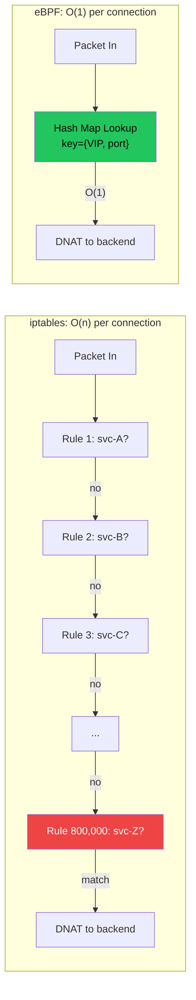
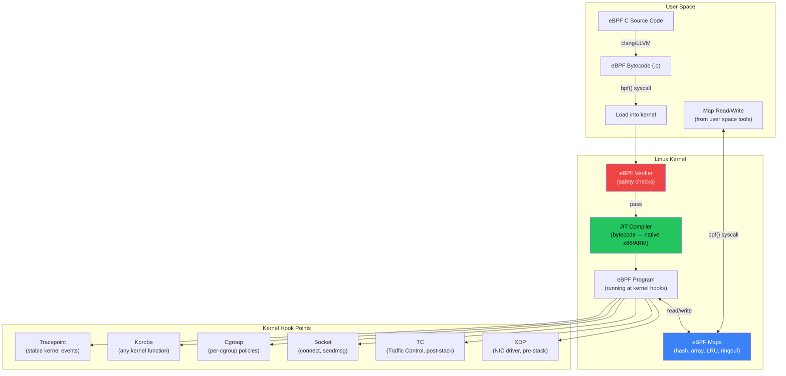

# Chapter 5: eBPF and the Death of iptables 🔴

> **What you'll learn:**
> - Why `kube-proxy` with `iptables` mode collapses at scale (10,000+ services) and the exact kernel-level reasons
> - What eBPF (extended Berkeley Packet Filter) is, how it works, and why it is the most important Linux kernel technology of the decade
> - How Cilium replaces kube-proxy, iptables, and parts of the CNI with eBPF programs attached directly to the kernel networking stack
> - How to reason about eBPF hook points (XDP, TC, socket, cgroup) and their tradeoffs for networking, security, and observability

---

## 5.1 The iptables Problem: Death by Linear Scan

Kubernetes Services are implemented by `kube-proxy`, which runs on every node and programs packet-forwarding rules. In `iptables` mode (the default for most clusters), kube-proxy creates iptables rules for every Service → EndpointSlice mapping.

### How kube-proxy + iptables Works

When a pod sends a packet to a ClusterIP service (e.g., `10.96.0.100:80`), iptables intercepts the packet in the `nat` table's `PREROUTING` chain and uses DNAT to rewrite the destination to a backend pod IP:

```
Packet: src=10.244.1.5 dst=10.96.0.100:80
                    ↓ iptables DNAT
Packet: src=10.244.1.5 dst=10.244.2.8:8080  (backend pod)
```

The problem is how iptables evaluates rules:

```
# For a service with 3 endpoints:
-A KUBE-SERVICES -d 10.96.0.100/32 -p tcp --dport 80 -j KUBE-SVC-XXXX
-A KUBE-SVC-XXXX -m statistic --mode random --probability 0.333 -j KUBE-SEP-AAA
-A KUBE-SVC-XXXX -m statistic --mode random --probability 0.500 -j KUBE-SEP-BBB
-A KUBE-SVC-XXXX -j KUBE-SEP-CCC
-A KUBE-SEP-AAA -p tcp -j DNAT --to-destination 10.244.2.8:8080
-A KUBE-SEP-BBB -p tcp -j DNAT --to-destination 10.244.3.12:8080
-A KUBE-SEP-CCC -p tcp -j DNAT --to-destination 10.244.4.5:8080
```

**Each service** generates ~5 iptables rules, and **each endpoint** within a service adds more. At scale:

| Services | Endpoints per Service | Total iptables Rules | Rule Evaluation Cost |
|---|---|---|---|
| 100 | 3 | ~1,500 | Negligible |
| 1,000 | 5 | ~20,000 | 1–2ms per connection (noticeable) |
| 5,000 | 10 | ~200,000 | 10–20ms per connection (**severe**) |
| 10,000 | 20 | ~800,000+ | 50–100ms per connection (**cluster broken**) |

### Why Linear Scan Kills Performance

iptables evaluates rules **sequentially** — it walks the chain from top to bottom until a rule matches. This is O(n) per packet for the first packet of each connection:

```
# // 💥 OUTAGE HAZARD: kube-proxy iptables at 10,000 services
# Each new TCP connection traverses up to 800,000 iptables rules
# - 50-100ms latency added to EVERY new connection
# - kube-proxy takes 5+ minutes to reprogram all rules on endpoint changes
# - During reprogramming, iptables is locked — ALL networking pauses
# - CPU usage: iptables-restore consumes 100% of one core during updates

# // ✅ FIX: Replace kube-proxy with Cilium eBPF
# Cilium uses eBPF hash maps for O(1) service lookup
# No iptables rules needed — direct kernel-level forwarding
# Rule updates are atomic — no lock, no pause
# CPU overhead: <1% even at 100,000 services
```



---

## 5.2 What Is eBPF?

eBPF (extended Berkeley Packet Filter) is a technology that allows you to run **sandboxed programs inside the Linux kernel** without modifying kernel source code or loading kernel modules. Think of it as JavaScript for the kernel — a safe, verified bytecode that attaches to kernel hooks and runs at native speed.

### The eBPF Architecture



### The eBPF Verifier: Safety Guarantees

Before any eBPF program runs, the kernel verifier statically analyzes it to guarantee:

| Safety Property | What the Verifier Checks |
|---|---|
| **Termination** | No infinite loops — all loops must have a bounded iteration count |
| **Memory safety** | All memory accesses must be within bounds (no buffer overflows) |
| **No null pointer derefs** | Every pointer must be checked before dereference |
| **Stack size** | Maximum 512 bytes of stack per program |
| **Helper function calls** | Only approved kernel helper functions can be called |
| **Map access** | Map reads/writes must use correct key/value sizes |

This means eBPF programs **cannot crash the kernel**, cannot access arbitrary memory, and cannot run forever. This is what makes eBPF safe for production — unlike kernel modules, which can bring down the entire system.

---

## 5.3 eBPF Hook Points for Kubernetes Networking

Different hook points serve different purposes:

| Hook Point | Location | Latency | Use Case |
|---|---|---|---|
| **XDP** (eXpress Data Path) | NIC driver, before kernel network stack | Lowest (~2μs) | DDoS mitigation, load balancing, packet filtering |
| **TC** (Traffic Control) | After kernel network stack, ingress/egress | Low (~5μs) | Service routing, network policy, NAT |
| **Socket** (`connect`, `sendmsg`, `recvmsg`) | Socket layer | Medium | Transparent service redirection, socket-level policy |
| **Cgroup** | Per-cgroup hooks | Medium | Per-pod/per-namespace resource policies |
| **Kprobe/Kretprobe** | Any kernel function entry/exit | Variable | Tracing, debugging, deep observability |
| **Tracepoint** | Stable kernel event points | Variable | Performance monitoring, audit logging |

### How Cilium Uses eBPF for Service Routing

Cilium replaces kube-proxy entirely. Instead of iptables rules, it attaches eBPF programs at the TC (Traffic Control) hook point on every pod's veth interface:

```c
// Simplified Cilium service routing eBPF program (conceptual)
// Attached to TC ingress on each pod's veth interface

SEC("tc/ingress")
int service_routing(struct __sk_buff *skb) {
    // Parse packet headers
    struct iphdr *ip = (void *)(long)skb->data + sizeof(struct ethhdr);
    struct tcphdr *tcp = (void *)ip + sizeof(struct iphdr);

    // O(1) hash map lookup — NOT linear iptables scan
    struct service_key key = {
        .ip = ip->daddr,      // Destination IP (ClusterIP)
        .port = tcp->dest,    // Destination port
        .proto = ip->protocol
    };

    struct service_value *svc = bpf_map_lookup_elem(&services_map, &key);
    if (!svc)
        return TC_ACT_OK;  // Not a service IP — pass through

    // Select backend (weighted random from backend map)
    __u32 backend_idx = bpf_get_prandom_u32() % svc->backend_count;
    struct backend_key bk = { .svc_id = svc->id, .idx = backend_idx };
    struct backend_value *backend = bpf_map_lookup_elem(&backends_map, &bk);
    if (!backend)
        return TC_ACT_OK;

    // DNAT: rewrite destination to backend pod IP
    // This replaces the entire iptables DNAT chain
    ip->daddr = backend->ip;
    tcp->dest = backend->port;

    // Update checksums
    bpf_l3_csum_replace(skb, /* ... */);
    bpf_l4_csum_replace(skb, /* ... */);

    return TC_ACT_OK;
}
```

### eBPF Maps: The Data Structures

eBPF maps are kernel-resident data structures shared between eBPF programs and user space:

| Map Type | Description | Use Case in Kubernetes |
|---|---|---|
| **BPF_MAP_TYPE_HASH** | Hash table (key-value) | Service → backends mapping |
| **BPF_MAP_TYPE_ARRAY** | Fixed-size array | Per-CPU counters, configuration |
| **BPF_MAP_TYPE_LRU_HASH** | LRU hash (auto-evicts old entries) | Connection tracking (conntrack) |
| **BPF_MAP_TYPE_RINGBUF** | Lock-free ring buffer | Event streaming to user space (observability) |
| **BPF_MAP_TYPE_LPM_TRIE** | Longest prefix match trie | CIDR-based network policy matching |
| **BPF_MAP_TYPE_PROG_ARRAY** | Array of eBPF program FDs | Tail calls (chaining eBPF programs) |

---

## 5.4 Cilium: eBPF-Powered Kubernetes Networking

Cilium is a CNI plugin that uses eBPF to implement:

1. **Pod networking** (replacing traditional CNI data planes)
2. **Service routing** (replacing kube-proxy)
3. **Network policy** (replacing iptables-based NetworkPolicy)
4. **L7 observability** (deep packet inspection without sidecars)
5. **Transparent encryption** (WireGuard or IPsec between nodes)

### Cilium Architecture

```
┌─────────────────────────────────────────────────────────────┐
│                         Node                                 │
│                                                              │
│  ┌─────────┐    ┌─────────┐    ┌─────────┐                │
│  │  Pod A   │    │  Pod B   │    │  Pod C   │                │
│  │ eth0     │    │ eth0     │    │ eth0     │                │
│  └────┬─────┘    └────┬─────┘    └────┬─────┘                │
│       │ veth          │ veth          │ veth                 │
│  ┌────┴───────────────┴───────────────┴────┐                │
│  │             eBPF Programs                │                │
│  │  ┌──────────────────────────────────┐   │                │
│  │  │ TC ingress/egress on each veth   │   │                │
│  │  │ • Service routing (O(1) lookup)  │   │                │
│  │  │ • Network policy enforcement     │   │                │
│  │  │ • L7 protocol parsing           │   │                │
│  │  │ • Metrics collection            │   │                │
│  │  └──────────────────────────────────┘   │                │
│  │  ┌──────────────────────────────────┐   │                │
│  │  │ eBPF Maps (kernel memory)        │   │                │
│  │  │ • services_map (ClusterIP→backends) │                │
│  │  │ • policy_map (identity→policy)   │   │                │
│  │  │ • conntrack_map (connection state)│  │                │
│  │  │ • metrics_map (per-flow counters)│   │                │
│  │  └──────────────────────────────────┘   │                │
│  └─────────────────────────────────────────┘                │
│                                                              │
│  ┌──────────────────────────────────────────┐               │
│  │ Cilium Agent (user space)                 │               │
│  │ • Watches Kubernetes API for Services,    │               │
│  │   Endpoints, NetworkPolicies, CiliumNP    │               │
│  │ • Compiles & loads eBPF programs          │               │
│  │ • Updates eBPF maps on changes            │               │
│  │ • Exports metrics via Hubble              │               │
│  └──────────────────────────────────────────┘               │
└──────────────────────────────────────────────────────────────┘
```

### Cilium vs kube-proxy Performance

| Metric | kube-proxy (iptables) | kube-proxy (IPVS) | Cilium (eBPF) |
|---|---|---|---|
| **Service lookup** | O(n) linear scan | O(1) hash | O(1) hash |
| **Rule update time** (10K services) | 5-10 minutes | 30 seconds | < 1 second |
| **Kernel CPU overhead** | 15-30% at 10K svc | 5-10% | < 2% |
| **Connection setup latency** | 50-100ms at 10K svc | 1-2ms | < 0.5ms |
| **Network policy** | Separate iptables chains | Not built-in | Same eBPF hook (free) |
| **L7 visibility** | None | None | Built-in (HTTP, gRPC, DNS) |
| **Encryption** | Not built-in | Not built-in | WireGuard (kernel-native) |

### Installing Cilium (Replacing kube-proxy)

```bash
# Install Cilium with kube-proxy replacement
helm install cilium cilium/cilium \
  --namespace kube-system \
  --set kubeProxyReplacement=true \
  --set k8sServiceHost=${API_SERVER_IP} \
  --set k8sServicePort=6443 \
  --set hubble.relay.enabled=true \
  --set hubble.ui.enabled=true \
  --set encryption.enabled=true \
  --set encryption.type=wireguard

# Verify kube-proxy replacement
cilium status
# KubeProxyReplacement: True
# ...

# Delete kube-proxy (it's no longer needed)
kubectl -n kube-system delete ds kube-proxy
kubectl -n kube-system delete cm kube-proxy
```

---

## 5.5 eBPF for Network Policy

Traditional Kubernetes NetworkPolicy is implemented by CNI plugins using iptables — which means more linear-scan rules. Cilium implements NetworkPolicy using eBPF with identity-based filtering:

### Identity-Based Security (vs IP-Based)

```yaml
# Traditional NetworkPolicy (IP-based)
# // 💥 OUTAGE HAZARD: IP-based policies break when pods restart (new IP)
apiVersion: networking.k8s.io/v1
kind: NetworkPolicy
metadata:
  name: allow-frontend
spec:
  podSelector:
    matchLabels:
      app: backend
  ingress:
  - from:
    - podSelector:
        matchLabels:
          app: frontend
    ports:
    - port: 8080
# Under the hood: iptables rules with pod IPs
# When frontend pod restarts → new IP → iptables rule is stale → traffic blocked
# kube-proxy must detect the change and update rules → 1-5 second gap
```

```yaml
# Cilium Network Policy (identity-based)
# // ✅ FIX: Identity is based on labels, not IPs — survives pod restarts
apiVersion: cilium.io/v2
kind: CiliumNetworkPolicy
metadata:
  name: allow-frontend
spec:
  endpointSelector:
    matchLabels:
      app: backend
  ingress:
  - fromEndpoints:
    - matchLabels:
        app: frontend
    toPorts:
    - ports:
      - port: "8080"
        protocol: TCP
      rules:
        http:                    # L7 policy — only allow specific HTTP paths
        - method: GET
          path: "/api/v1/.*"     # Regex matching on URL path
# Under the hood: eBPF program checks the packet's "security identity"
# (a numeric ID derived from pod labels, cached in eBPF map)
# Pod restart → same labels → same identity → no rule update needed
```

---

## 5.6 Hubble: eBPF-Powered Observability

Cilium's observability component, **Hubble**, uses eBPF to capture flow data at the kernel level without packet captures or sidecars:

```bash
# Watch all network flows in real-time
hubble observe --namespace default

# Example output:
# TIMESTAMP    SOURCE              DESTINATION         TYPE    VERDICT
# 12:00:01.1   default/frontend    default/backend     L7/HTTP FORWARDED
#                                                       GET /api/v1/users → 200
# 12:00:01.2   default/backend     kube-system/coredns L4/UDP  FORWARDED
#                                                       DNS Query: db.default
# 12:00:01.3   default/backend     default/postgres    L4/TCP  DROPPED
#                                                       Policy denied

# Filter for dropped traffic (debugging network policies)
hubble observe --verdict DROPPED --namespace default

# Get DNS resolution logs (without touching CoreDNS)
hubble observe --protocol DNS --namespace default
```

---

<details>
<summary><strong>🏋️ Exercise: Replace kube-proxy with Cilium eBPF</strong> (click to expand)</summary>

### The Challenge

You have a Kubernetes cluster with 2,000 services. The cluster SRE team reports:

- `kube-proxy` takes 3 minutes to update iptables rules after a deployment rollout
- During iptables updates, 2% of new connections fail (iptables lock contention)
- CPU usage on `kube-proxy` pods is 40% of one core per node

Design and execute a migration from kube-proxy (iptables mode) to Cilium eBPF with zero downtime.

**Your tasks:**

1. Install Cilium in "partial replacement" mode (Cilium handles CNI, kube-proxy still active)
2. Validate Cilium service routing works correctly alongside kube-proxy
3. Switch to full kube-proxy replacement mode
4. Remove kube-proxy and verify all service traffic is handled by eBPF
5. Measure the performance improvement (rule update time, CPU usage, connection latency)

<details>
<summary>🔑 Solution</summary>

```bash
#!/bin/bash
# migrate-to-cilium.sh — Zero-downtime migration from kube-proxy to Cilium eBPF
set -euo pipefail

echo "=== Phase 1: Install Cilium alongside kube-proxy ==="
# First, install Cilium as CNI without kube-proxy replacement
# kube-proxy continues to handle service routing
helm install cilium cilium/cilium \
  --namespace kube-system \
  --set kubeProxyReplacement=false \
  --set hubble.relay.enabled=true \
  --set hubble.ui.enabled=true \
  --set encryption.enabled=true \
  --set encryption.type=wireguard \
  --wait

# Validate: pods should get IPs from Cilium IPAM
kubectl run test-pod --image=busybox --restart=Never -- sleep 3600
kubectl get pod test-pod -o wide
# IP should be from Cilium's CIDR range

echo "=== Phase 2: Enable kube-proxy replacement on one node ==="
# Label a canary node for testing
kubectl label node canary-node cilium.io/kube-proxy-replacement=true

# Restart Cilium agent on canary node to pick up the change
kubectl -n kube-system delete pod -l k8s-app=cilium \
  --field-selector spec.nodeName=canary-node

# Test service routing from a pod on the canary node
kubectl run test-svc --image=busybox --restart=Never \
  --overrides='{"spec":{"nodeName":"canary-node"}}' \
  -- wget -qO- http://kubernetes.default.svc:443

echo "=== Phase 3: Full kube-proxy replacement ==="
# After canary validation, enable for all nodes
helm upgrade cilium cilium/cilium \
  --namespace kube-system \
  --set kubeProxyReplacement=true \
  --set k8sServiceHost=${API_SERVER_IP} \
  --set k8sServicePort=6443 \
  --reuse-values \
  --wait

# Rolling restart of all Cilium agents
kubectl -n kube-system rollout restart ds/cilium
kubectl -n kube-system rollout status ds/cilium

echo "=== Phase 4: Remove kube-proxy ==="
# Verify Cilium is handling all service routing
cilium status | grep KubeProxyReplacement
# Expected: KubeProxyReplacement: True

# Verify no iptables rules from kube-proxy remain
ssh node-1 "iptables-save | grep KUBE-SVC | wc -l"
# Expected: 0 (all KUBE-SVC chains removed)

# Delete kube-proxy
kubectl -n kube-system delete ds kube-proxy
kubectl -n kube-system delete cm kube-proxy

# Clean up stale iptables rules on every node
# (Cilium does this automatically, but verify)
for node in $(kubectl get nodes -o name); do
  ssh "${node#node/}" "iptables-save | grep -c KUBE" || true
done

echo "=== Phase 5: Measure improvement ==="

# Before (kube-proxy iptables):
# - Rule update time: 3 minutes (180 seconds)
# - Connection failure rate during updates: 2%
# - kube-proxy CPU: 40% of one core per node
# - iptables rules per node: ~40,000

# After (Cilium eBPF):
# - Rule update time: < 1 second (eBPF map update is atomic)
# - Connection failure rate: 0%
# - Cilium CPU: < 5% of one core per node
# - iptables rules per node: 0

# Verify with Hubble:
hubble observe --type trace --namespace default | head -20
# Should show L3/L4 flows being forwarded by eBPF

echo "Migration complete. kube-proxy removed."
echo "eBPF is now handling all service routing, network policy, and encryption."
```

**Key Points:**

1. **Never remove kube-proxy first.** Install Cilium alongside it, validate, then switch.
2. **Use a canary node** to test kube-proxy replacement before rolling out cluster-wide.
3. **Cilium's `kubeProxyReplacement=true`** tells it to take over all service routing.
4. After migration, the `KUBE-SVC-*` and `KUBE-SEP-*` iptables chains should be gone.
5. Use Hubble to verify traffic flows are handled by eBPF, not iptables.

</details>
</details>

---

> **Key Takeaways:**
> - `kube-proxy` with iptables uses O(n) linear-scan rule evaluation. At 10,000+ services, this adds 50–100ms latency per new connection and takes minutes to update rules.
> - eBPF allows running verified, sandboxed programs inside the Linux kernel. The verifier guarantees safety (no crashes, no infinite loops, no buffer overflows).
> - eBPF programs attach to kernel hook points: XDP (NIC driver), TC (traffic control), Socket, Cgroup, Kprobe, and Tracepoints.
> - Cilium replaces kube-proxy with eBPF hash maps for O(1) service lookup, eliminating iptables entirely. Rule updates are atomic and sub-second.
> - Cilium's identity-based network policy is more robust than IP-based iptables rules because it survives pod restarts without rule updates.
> - Hubble provides kernel-level L3/L4/L7 flow observability without sidecars or packet captures.

> **See also:**
> - [Chapter 4: The CNI and Pod-to-Pod Communication](ch04-cni-pod-to-pod.md) — the traditional networking model that eBPF replaces
> - [Chapter 6: The Service Mesh and Envoy Proxy](ch06-service-mesh-envoy.md) — how eBPF enables sidecar-less service mesh (Ambient mode)
> - [Chapter 9: Capstone](ch09-capstone-multi-region-platform.md) — using Cilium Cluster Mesh for cross-region eBPF networking
