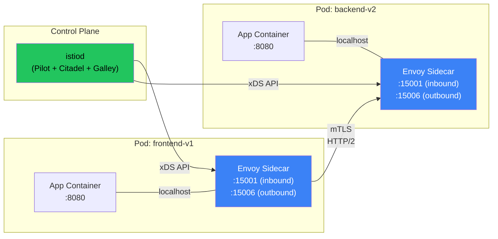
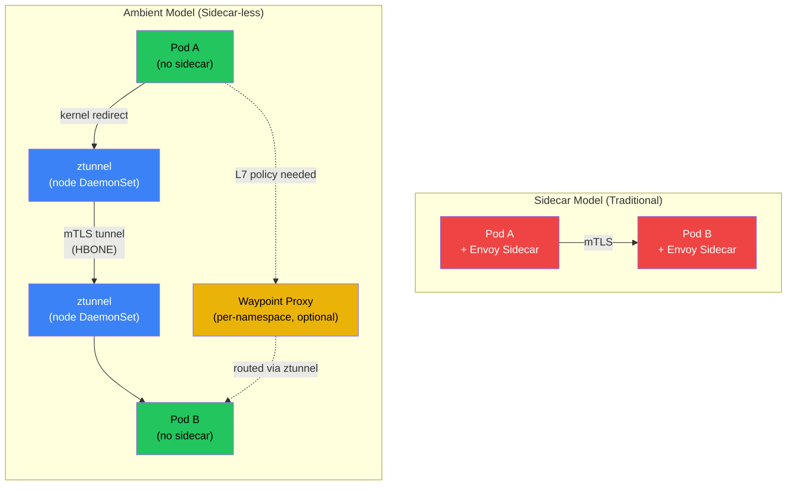

# Chapter 6: The Service Mesh and Envoy Proxy 🔴

> **What you'll learn:**
> - What a service mesh actually does and why decoupling networking concerns from application code matters at scale
> - How Envoy proxy works as a sidecar, including its xDS API, hot restart, and L7 traffic management
> - The fundamental architecture difference between sidecar-based meshes (Istio, Linkerd) and sidecar-less/ambient meshes
> - How mTLS certificate rotation, zero-trust networking, and traffic policies work end-to-end

---

## 6.1 Why Service Meshes Exist

In a microservices architecture with hundreds of services, every service needs:

- **Mutual TLS (mTLS)** between all service-to-service calls
- **Retries and timeouts** with circuit breaking
- **Canary routing** (send 5% of traffic to v2)
- **Rate limiting** per caller identity
- **Distributed tracing** (inject trace headers)
- **Access logging** for every request

Without a service mesh, each team implements these features in their application code — inconsistently, in different languages, with different bugs. A service mesh **extracts all of this into the infrastructure layer**, so application developers never think about it.

| Concern | Without Mesh (Application Code) | With Mesh (Infrastructure) |
|---|---|---|
| mTLS | Each service manages its own TLS certs | Automatic — mesh injects certs and rotates them |
| Retries | Application-level retry logic (often missing) | Configured per-route in mesh policy |
| Observability | Manual instrumentation per language | Automatic L7 metrics, traces, access logs |
| Traffic splitting | Feature flags in code | Declarative YAML: 95/5 canary split |
| Authorization | Custom auth middleware per service | Mesh-level AuthorizationPolicy |

---

## 6.2 Envoy Proxy: The Data Plane

Nearly every service mesh (Istio, Linkerd2-proxy is the exception) uses **Envoy** as its data-plane proxy. Envoy is a high-performance L4/L7 proxy written in C++, designed for cloud-native environments.

### How the Sidecar Model Works

In the sidecar model, every pod gets an Envoy proxy injected as an additional container. All inbound and outbound traffic is transparently intercepted by Envoy using iptables rules:



### Traffic Interception: How iptables Redirects to Envoy

When Istio injects the sidecar, it also injects an init container that programs iptables rules:

```bash
# Istio's init container (istio-init) runs these iptables rules:
# Redirect all outbound TCP traffic to Envoy's outbound listener (15001)
iptables -t nat -A OUTPUT -p tcp -j REDIRECT --to-port 15001

# Redirect all inbound TCP traffic to Envoy's inbound listener (15006)  
iptables -t nat -A PREROUTING -p tcp -j REDIRECT --to-port 15006

# Exclude Envoy's own traffic from interception (to prevent loops)
iptables -t nat -A OUTPUT -m owner --uid-owner 1337 -j RETURN
```

This means the application code is completely unaware of the mesh — it sends traffic to `backend-svc:8080` and receives it on `:8080`, never knowing that Envoy intercepted, authenticated, encrypted, retried, and observed the request in between.

### The xDS API: Envoy's Configuration Protocol

Envoy doesn't read static config files — it receives configuration dynamically from the control plane via the **xDS (x Discovery Service)** API:

| xDS API | What It Configures | Example |
|---|---|---|
| **LDS** (Listener) | What ports to listen on, filter chains | "Listen on 15006 for inbound, apply HTTP filter" |
| **RDS** (Route) | URL path → cluster routing rules | "/api/v1/* → backend-cluster" |
| **CDS** (Cluster) | Upstream service endpoints + load balancing | "backend-cluster: round-robin over 3 endpoints" |
| **EDS** (Endpoint) | Actual IP:port of backend pods | "10.244.1.5:8080, 10.244.2.8:8080" |
| **SDS** (Secret) | TLS certificates and keys | mTLS cert for this workload identity |

```
Configuration Flow:

istiod watches Kubernetes API
  → Kubernetes Service changes (new pod, scaling event)
  → istiod computes new Envoy config
  → Pushes via xDS gRPC stream to every Envoy sidecar
  → Envoy hot-reloads config (no downtime, no dropped connections)
```

---

## 6.3 Istio vs Linkerd: Architecture Comparison

| Feature | Istio (Envoy-based) | Linkerd (linkerd2-proxy, Rust-based) |
|---|---|---|
| **Proxy** | Envoy (C++, ~40 MB memory per sidecar) | linkerd2-proxy (Rust, ~10 MB memory per sidecar) |
| **Control plane** | istiod (monolith: Pilot + Citadel + Galley) | control plane (destination, identity, proxy-injector) |
| **mTLS** | Automatic, SPIFFE-based identity | Automatic, SPIFFE-based identity |
| **L7 policy** | Full HTTP/gRPC routing, header matching, fault injection | HTTP routing, traffic splitting, retries |
| **Multi-cluster** | Istio multi-cluster (complex) | Linkerd multi-cluster (simpler) |
| **Performance** | Higher memory/CPU per sidecar | Lower memory/CPU (Rust efficiency) |
| **Complexity** | High — many knobs, CRDs, and configuration surface | Low — opinionated, fewer options |
| **eBPF integration** | Istio Ambient mode (sidecar-less) | Not yet (Linkerd exploring waypoint proxies) |

> **Production Recommendation:** If you need maximum L7 policy features (fault injection, header-based routing, rate limiting per route), choose Istio. If you need simplicity, low resource overhead, and are primarily interested in mTLS + observability, choose Linkerd. If you want to minimize proxy overhead entirely, consider Cilium's Ambient mode.

---

## 6.4 The Sidecar Problem and the Ambient Mesh Revolution

### The Cost of Sidecars

Every sidecar adds:
- **~40 MB memory** (Envoy) or **~10 MB** (linkerd2-proxy) per pod
- **~0.5–2ms latency** per hop (two extra userspace proxy hops per request)
- **Operational complexity** — sidecar injection, upgrade coordination, init container race conditions

At 10,000 pods, Istio sidecars consume **400 GB of memory cluster-wide** just for proxies. This is the "mesh tax."

### Ambient Mesh: Sidecar-Less Architecture

Istio's **Ambient mode** (and Cilium's service mesh) eliminates sidecars by splitting mesh functionality into two layers:

| Layer | Component | Handles | Where It Runs |
|---|---|---|---|
| **L4 (ztunnel)** | Zero-trust tunnel | mTLS, L4 authorization, telemetry | DaemonSet (one per node) |
| **L7 (waypoint)** | Waypoint proxy | HTTP routing, L7 policy, traffic splitting | Deployment (shared per namespace/service) |



### Sidecar vs Ambient: The Tradeoffs

| Aspect | Sidecar Model | Ambient Model |
|---|---|---|
| **Memory overhead** | ~40 MB per pod | ~100 MB per node (shared ztunnel) |
| **Latency** | +1–2ms per hop (2 proxy hops) | +0.2–0.5ms (kernel-level redirect to ztunnel) |
| **Blast radius** | Per-pod (sidecar crash affects one pod) | Per-node (ztunnel crash affects all pods on node) |
| **L7 features** | Always available (Envoy in every pod) | Requires deploying waypoint proxy |
| **Operational** | Inject/upgrade per pod (rolling restart) | DaemonSet upgrade (simpler) |
| **eBPF synergy** | iptables for traffic interception | eBPF for traffic interception (zero iptables) |

---

## 6.5 mTLS and Zero-Trust Networking

A service mesh enables **zero-trust networking**: no service trusts any other service based on network location. Every connection is authenticated and encrypted.

### How mTLS Works in a Mesh

1. **Identity:** Each workload gets a cryptographic identity (SPIFFE ID) derived from its Kubernetes ServiceAccount:
   ```
   spiffe://cluster.local/ns/default/sa/frontend
   ```

2. **Certificate Issuance:** The mesh control plane (istiod or Linkerd identity) acts as a Certificate Authority (CA). It issues short-lived X.509 certificates to each workload.

3. **Mutual Authentication:** When Pod A calls Pod B:
   - Pod A's proxy presents its certificate to prove identity
   - Pod B's proxy presents its certificate to prove identity
   - Both verify against the mesh CA
   - Connection is encrypted with TLS 1.3

4. **Certificate Rotation:** Certificates are short-lived (default 24 hours in Istio) and auto-rotated by the proxy without restarting the pod.

### Authorization Policies

```yaml
# // ✅ Zero-trust: explicitly allow only frontend → backend on specific paths
apiVersion: security.istio.io/v1
kind: AuthorizationPolicy
metadata:
  name: backend-authz
  namespace: default
spec:
  selector:
    matchLabels:
      app: backend
  rules:
  - from:
    - source:
        principals:
        - "cluster.local/ns/default/sa/frontend"  # Only frontend SA
    to:
    - operation:
        methods: ["GET", "POST"]
        paths: ["/api/v1/*"]   # Only specific API paths
  action: ALLOW
---
# Deny everything else (deny-by-default)
apiVersion: security.istio.io/v1
kind: AuthorizationPolicy
metadata:
  name: deny-all
  namespace: default
spec:
  {}  # Empty spec = deny all traffic not explicitly allowed
```

---

<details>
<summary><strong>🏋️ Exercise: Implement a Canary Deployment with Traffic Splitting</strong> (click to expand)</summary>

### The Challenge

You are deploying v2 of a critical payment service. You want to:

1. Route 5% of traffic to v2 (canary)
2. Monitor error rates for 30 minutes
3. If error rate < 1%, gradually increase to 25%, 50%, 100%
4. If error rate > 5%, immediately route 100% back to v1

Design the mesh configuration (VirtualService + DestinationRule) and describe the observability setup.

<details>
<summary>🔑 Solution</summary>

```yaml
# Step 1: Deploy v2 alongside v1
apiVersion: apps/v1
kind: Deployment
metadata:
  name: payment-v2
  labels:
    app: payment
    version: v2
spec:
  replicas: 2  # Start with fewer replicas for canary
  selector:
    matchLabels:
      app: payment
      version: v2
  template:
    metadata:
      labels:
        app: payment
        version: v2
    spec:
      containers:
      - name: payment
        image: payment:v2.0.0
        ports:
        - containerPort: 8080
        resources:
          requests:
            cpu: "500m"
            memory: "256Mi"
          limits:
            cpu: "1000m"
            memory: "512Mi"
---
# Step 2: Define DestinationRule (subsets for v1 and v2)
apiVersion: networking.istio.io/v1beta1
kind: DestinationRule
metadata:
  name: payment
spec:
  host: payment.default.svc.cluster.local
  trafficPolicy:
    connectionPool:
      tcp:
        maxConnections: 100
      http:
        h2UpgradePolicy: DEFAULT
        maxRequestsPerConnection: 10
    outlierDetection:
      consecutive5xxErrors: 5        # Eject endpoint after 5 consecutive 5xx
      interval: 10s
      baseEjectionTime: 30s
      maxEjectionPercent: 50
  subsets:
  - name: v1
    labels:
      version: v1
  - name: v2
    labels:
      version: v2
---
# Step 3: VirtualService with 95/5 traffic split
apiVersion: networking.istio.io/v1beta1
kind: VirtualService
metadata:
  name: payment
spec:
  hosts:
  - payment.default.svc.cluster.local
  http:
  - route:
    - destination:
        host: payment.default.svc.cluster.local
        subset: v1
      weight: 95
    - destination:
        host: payment.default.svc.cluster.local
        subset: v2
      weight: 5
    retries:
      attempts: 3
      perTryTimeout: 2s
      retryOn: 5xx,reset,connect-failure
    timeout: 10s
```

```bash
# Step 4: Monitor canary with Prometheus + Istio metrics

# Query: Error rate for v2 vs v1 (Prometheus/PromQL)
# v2 error rate:
# sum(rate(istio_requests_total{
#   destination_service="payment.default.svc.cluster.local",
#   destination_version="v2",
#   response_code=~"5.*"
# }[5m])) /
# sum(rate(istio_requests_total{
#   destination_service="payment.default.svc.cluster.local",
#   destination_version="v2"
# }[5m]))

# Step 5: Progressive rollout (if error rate < 1%)
# Update VirtualService weights: 75/25 → 50/50 → 0/100
kubectl patch virtualservice payment --type merge -p '
spec:
  http:
  - route:
    - destination:
        host: payment.default.svc.cluster.local
        subset: v1
      weight: 75
    - destination:
        host: payment.default.svc.cluster.local
        subset: v2
      weight: 25
'

# Step 6: Rollback if error rate > 5%
kubectl patch virtualservice payment --type merge -p '
spec:
  http:
  - route:
    - destination:
        host: payment.default.svc.cluster.local
        subset: v1
      weight: 100
    - destination:
        host: payment.default.svc.cluster.local
        subset: v2
      weight: 0
'
```

**Automation with Flagger:**

In production, use **Flagger** to automate the progressive canary:

```yaml
apiVersion: flagger.app/v1beta1
kind: Canary
metadata:
  name: payment
spec:
  targetRef:
    apiVersion: apps/v1
    kind: Deployment
    name: payment
  service:
    port: 8080
  analysis:
    interval: 1m            # Check every minute
    threshold: 5             # Max 5 failed checks before rollback
    maxWeight: 50            # Max canary weight
    stepWeight: 10           # Increase by 10% each interval
    metrics:
    - name: request-success-rate
      thresholdRange:
        min: 99              # Rollback if success rate < 99%
    - name: request-duration
      thresholdRange:
        max: 500             # Rollback if p99 latency > 500ms
      interval: 1m
```

**Key Insight:** Traffic splitting at the mesh level is superior to Deployment-level canary (two Deployments with different replica counts) because:
- **Precise control:** Exactly 5% of traffic, not "approximately 1 out of 20 pods"
- **Instant rollback:** Change a weight, not a replica count (which requires pod creation/deletion)
- **L7 routing:** Can canary based on HTTP headers (e.g., `x-canary: true` for internal users only)

</details>
</details>

---

> **Key Takeaways:**
> - A service mesh extracts networking concerns (mTLS, retries, observability, traffic routing) from application code into the infrastructure layer.
> - Envoy proxy is the dominant data-plane proxy. It receives configuration dynamically via the xDS API (LDS, RDS, CDS, EDS, SDS) and supports hot reload without dropping connections.
> - The sidecar model adds ~40 MB memory and 1–2ms latency per pod. Ambient mesh (ztunnel + waypoint) reduces this to a per-node DaemonSet with sub-millisecond overhead.
> - mTLS in a mesh provides zero-trust networking: every connection is authenticated via SPIFFE identities and encrypted with TLS 1.3. Certificates auto-rotate every 24 hours.
> - Traffic splitting (canary deployments) at the mesh level provides precise percentage-based routing, instant rollback, and L7 header-based routing — superior to Deployment-level canary.
> - Linkerd (Rust-based proxy) offers lower resource overhead; Istio (Envoy-based) offers richer L7 policy features.

> **See also:**
> - [Chapter 5: eBPF and the Death of iptables](ch05-ebpf-and-death-of-iptables.md) — the kernel-level technology that powers sidecar-less mesh
> - [Chapter 7: Operators and CRDs](ch07-operators-and-crds.md) — how VirtualService, DestinationRule, and other mesh CRDs are implemented as custom resources
> - [Chapter 9: Capstone](ch09-capstone-multi-region-platform.md) — multi-region service mesh architecture
