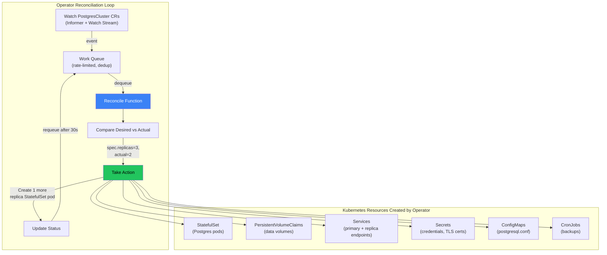

# Chapter 7: Operators and Custom Resource Definitions (CRDs) 🔴

> **What you'll learn:**
> - How Custom Resource Definitions extend the Kubernetes API with new resource types, and the exact mechanics of how they are stored and served
> - The Operator pattern: how custom controllers reconcile domain-specific resources (databases, message queues, certificates) as first-class Kubernetes citizens
> - How to design a CRD schema, write a reconciliation loop, and handle finalizers, owner references, and status subresources
> - Practical comparison of Operator frameworks: Operator SDK (Go), Kubebuilder, and `kube-rs` (Rust)

---

## 7.1 The Problem: Stateful Infrastructure in a Stateless World

Kubernetes was designed for stateless workloads: scale up, scale down, kill and replace. But real infrastructure includes:

- **Databases** (Postgres, MySQL, Redis) — require persistent volumes, replication, leader election, failover, and backup orchestration
- **Message Queues** (Kafka, RabbitMQ) — require partition management, consumer group coordination, and rolling upgrades that don't lose messages
- **Certificates** (TLS certs) — require automated issuance, renewal before expiry, and secret rotation
- **Custom platforms** (ML training pipelines, data processing DAGs) — require domain-specific scheduling and lifecycle management

StatefulSets handle *some* of this (ordered creation, stable network IDs, persistent volumes), but they don't know the *application semantics* — they can't perform a Postgres failover, promote a Redis replica, or rebalance Kafka partitions.

**Operators bridge this gap.** An operator is a custom controller that encodes domain-specific operational knowledge into a Kubernetes-native reconciliation loop.

---

## 7.2 Custom Resource Definitions (CRDs)

A CRD extends the Kubernetes API with a new resource type. Once a CRD is registered, you can `kubectl apply` custom objects and the API server stores them in etcd just like native resources.

### Anatomy of a CRD

```yaml
apiVersion: apiextensions.k8s.io/v1
kind: CustomResourceDefinition
metadata:
  name: postgresclusters.database.example.com
spec:
  group: database.example.com
  versions:
  - name: v1
    served: true
    storage: true
    schema:
      openAPIV3Schema:
        type: object
        properties:
          spec:
            type: object
            required: ["replicas", "version", "storage"]
            properties:
              replicas:
                type: integer
                minimum: 1
                maximum: 7
                description: "Number of Postgres replicas (1 primary + N-1 replicas)"
              version:
                type: string
                enum: ["15", "16", "17"]
                description: "PostgreSQL major version"
              storage:
                type: object
                properties:
                  size:
                    type: string
                    pattern: "^[0-9]+(Gi|Ti)$"
                  storageClass:
                    type: string
              backup:
                type: object
                properties:
                  schedule:
                    type: string
                    description: "Cron schedule for automated backups"
                  retention:
                    type: string
                    description: "How long to retain backups (e.g., 30d)"
          status:
            type: object
            properties:
              phase:
                type: string
                enum: ["Creating", "Running", "Failing", "Upgrading"]
              primaryEndpoint:
                type: string
              replicaEndpoints:
                type: array
                items:
                  type: string
              lastBackup:
                type: string
                format: date-time
              conditions:
                type: array
                items:
                  type: object
                  properties:
                    type:
                      type: string
                    status:
                      type: string
                    lastTransitionTime:
                      type: string
                      format: date-time
                    reason:
                      type: string
                    message:
                      type: string
    subresources:
      status: {}    # Enable /status subresource (separate RBAC for status updates)
    additionalPrinterColumns:
    - name: Phase
      type: string
      jsonPath: .status.phase
    - name: Primary
      type: string
      jsonPath: .status.primaryEndpoint
    - name: Replicas
      type: integer
      jsonPath: .spec.replicas
    - name: Age
      type: date
      jsonPath: .metadata.creationTimestamp
  scope: Namespaced
  names:
    plural: postgresclusters
    singular: postgrescluster
    kind: PostgresCluster
    shortNames:
    - pg
```

After applying this CRD, you can create Postgres clusters:

```yaml
apiVersion: database.example.com/v1
kind: PostgresCluster
metadata:
  name: orders-db
  namespace: default
spec:
  replicas: 3
  version: "16"
  storage:
    size: 100Gi
    storageClass: gp3-encrypted
  backup:
    schedule: "0 2 * * *"     # 2 AM daily
    retention: "30d"
```

```bash
kubectl get pg
# NAME        PHASE     PRIMARY                REPLICAS   AGE
# orders-db   Running   orders-db-primary:5432 3          2d
```

---

## 7.3 The Operator Pattern: Reconciliation Loops for Domain Knowledge

An operator is a custom controller that watches CRD objects and reconciles the real-world state (actual Postgres instances) to match the desired state (the CRD spec).



### The Reconcile Function: The Core of an Operator

```go
// Simplified operator reconciliation logic (Go / Kubebuilder style)
func (r *PostgresClusterReconciler) Reconcile(
    ctx context.Context,
    req ctrl.Request,
) (ctrl.Result, error) {
    log := log.FromContext(ctx)

    // Step 1: Fetch the custom resource
    var pg databasev1.PostgresCluster
    if err := r.Get(ctx, req.NamespacedName, &pg); err != nil {
        if apierrors.IsNotFound(err) {
            return ctrl.Result{}, nil // CR deleted — nothing to do
        }
        return ctrl.Result{}, err
    }

    // Step 2: Handle finalizers (cleanup on deletion)
    if pg.DeletionTimestamp != nil {
        return r.handleDeletion(ctx, &pg) // Delete backups, revoke certs, etc.
    }

    // Step 3: Ensure StatefulSet exists with correct replica count
    sts := r.desiredStatefulSet(&pg)
    if err := r.createOrUpdate(ctx, sts, &pg); err != nil {
        return ctrl.Result{}, err
    }

    // Step 4: Ensure Services exist (primary read-write, replica read-only)
    if err := r.reconcileServices(ctx, &pg); err != nil {
        return ctrl.Result{}, err
    }

    // Step 5: Ensure ConfigMap with postgresql.conf
    if err := r.reconcileConfig(ctx, &pg); err != nil {
        return ctrl.Result{}, err
    }

    // Step 6: Ensure backup CronJob exists
    if pg.Spec.Backup != nil {
        if err := r.reconcileBackupJob(ctx, &pg); err != nil {
            return ctrl.Result{}, err
        }
    }

    // Step 7: Check replication health and update status
    phase := r.determinePhase(ctx, &pg)
    pg.Status.Phase = phase
    pg.Status.PrimaryEndpoint = fmt.Sprintf(
        "%s-primary.%s.svc:5432", pg.Name, pg.Namespace,
    )
    if err := r.Status().Update(ctx, &pg); err != nil {
        return ctrl.Result{}, err
    }

    // Step 8: Requeue to check health periodically
    return ctrl.Result{RequeueAfter: 30 * time.Second}, nil
}
```

---

## 7.4 Operator Design Patterns

### Finalizers: Cleaning Up External Resources

Finalizers prevent Kubernetes from deleting a resource until the operator has cleaned up external dependencies (S3 backups, DNS records, cloud load balancers).

```yaml
# The operator adds a finalizer when it creates external resources:
metadata:
  finalizers:
  - database.example.com/cleanup

# When the user deletes the PostgresCluster:
# 1. Kubernetes sets deletionTimestamp but does NOT delete the object
# 2. Operator sees deletionTimestamp, runs cleanup logic
# 3. Operator removes the finalizer from the object
# 4. Kubernetes sees no more finalizers → deletes the object from etcd
```

```
# // 💥 OUTAGE HAZARD: Operator crashed with finalizer still set
# If the operator is not running, the CRD object cannot be deleted
# because the finalizer is never removed → resource is stuck in Terminating
# kubectl delete pg orders-db hangs forever

# // ✅ FIX: Design operators to be crash-safe
# - Finalizer cleanup must be idempotent (safe to run multiple times)
# - On startup, process all objects with deletionTimestamp first
# - Monitor for "stuck in Terminating" alerts
# - Emergency escape: manually patch out the finalizer
#   kubectl patch pg orders-db --type merge -p '{"metadata":{"finalizers":[]}}'
```

### Owner References: Cascading Deletion

Set owner references so that when the CRD object is deleted, all child resources (StatefulSet, Services, Secrets) are automatically garbage collected:

```go
// Set the PostgresCluster as the owner of the StatefulSet
ctrl.SetControllerReference(&pg, sts, r.Scheme)
// Now: delete PostgresCluster → StatefulSet is automatically deleted
```

### Status Subresource: Separate Spec and Status

The `/status` subresource allows the operator to update `.status` without triggering admission webhooks or overwriting `.spec` changes made by users.

---

## 7.5 Writing an Operator in Rust with kube-rs

For teams that prefer Rust's safety guarantees and low memory footprint:

```rust
use kube::{Api, Client, ResourceExt};
use kube::runtime::controller::{Action, Controller};
use kube::runtime::watcher::Config;
use std::sync::Arc;
use tokio::time::Duration;

// Define the custom resource (auto-generates CRD schema)
#[derive(CustomResource, Deserialize, Serialize, Clone, Debug, JsonSchema)]
#[kube(
    group = "database.example.com",
    version = "v1",
    kind = "PostgresCluster",
    namespaced,
    status = "PostgresClusterStatus",
    printcolumn = r#"{"name":"Phase","type":"string","jsonPath":".status.phase"}"#
)]
pub struct PostgresClusterSpec {
    pub replicas: i32,
    pub version: String,
    pub storage: StorageSpec,
    pub backup: Option<BackupSpec>,
}

#[derive(Deserialize, Serialize, Clone, Debug, JsonSchema)]
pub struct PostgresClusterStatus {
    pub phase: String,
    pub primary_endpoint: Option<String>,
}

// The reconciliation function
async fn reconcile(
    pg: Arc<PostgresCluster>,
    ctx: Arc<Context>,
) -> Result<Action, Error> {
    let client = &ctx.client;
    let ns = pg.namespace().unwrap_or_default();
    let name = pg.name_any();

    // Ensure StatefulSet
    let sts_api: Api<StatefulSet> = Api::namespaced(client.clone(), &ns);
    let desired_sts = build_statefulset(&pg);
    apply_resource(&sts_api, &name, &desired_sts).await?;

    // Ensure Services
    let svc_api: Api<Service> = Api::namespaced(client.clone(), &ns);
    apply_resource(&svc_api, &format!("{name}-primary"), &build_primary_svc(&pg)).await?;
    apply_resource(&svc_api, &format!("{name}-replica"), &build_replica_svc(&pg)).await?;

    // Update status
    let pg_api: Api<PostgresCluster> = Api::namespaced(client.clone(), &ns);
    let status = PostgresClusterStatus {
        phase: "Running".to_string(),
        primary_endpoint: Some(format!("{name}-primary.{ns}.svc:5432")),
    };
    update_status(&pg_api, &name, status).await?;

    // Requeue after 30 seconds for health check
    Ok(Action::requeue(Duration::from_secs(30)))
}

// Error handler
fn error_policy(
    _pg: Arc<PostgresCluster>,
    error: &Error,
    _ctx: Arc<Context>,
) -> Action {
    eprintln!("Reconciliation error: {error:?}");
    Action::requeue(Duration::from_secs(60))
}

#[tokio::main]
async fn main() -> Result<(), Box<dyn std::error::Error>> {
    let client = Client::try_default().await?;
    let pg_api = Api::<PostgresCluster>::all(client.clone());
    let sts_api = Api::<StatefulSet>::all(client.clone());
    let ctx = Arc::new(Context { client });

    Controller::new(pg_api, Config::default())
        .owns(sts_api, Config::default())  // Watch owned StatefulSets
        .run(reconcile, error_policy, ctx)
        .for_each(|res| async move {
            match res {
                Ok(obj) => println!("Reconciled: {obj:?}"),
                Err(e) => eprintln!("Reconcile failed: {e:?}"),
            }
        })
        .await;

    Ok(())
}
```

### Go vs Rust Operators

| Aspect | Go (Kubebuilder / Operator SDK) | Rust (kube-rs) |
|---|---|---|
| **Ecosystem maturity** | Very mature — most operators are in Go | Growing — kube-rs is production-ready |
| **Memory usage** | 50–100 MB typical | 10–30 MB typical (no GC) |
| **Compile-time safety** | Runtime panics possible | Stronger compile-time guarantees |
| **Code generation** | Kubebuilder generates boilerplate | kube-rs derive macros |
| **Community examples** | Thousands of operators | Fewer examples, but growing |
| **Best for** | Teams familiar with Go ecosystem | Teams prioritizing safety and resource efficiency |

---

<details>
<summary><strong>🏋️ Exercise: Design a CRD for a Redis Cluster Operator</strong> (click to expand)</summary>

### The Challenge

Design a complete CRD schema for a `RedisCluster` operator that manages:

1. A Redis cluster with 3–9 primary shards
2. Configurable replicas per shard (for read scaling)
3. Automatic failover (promote replica to primary on primary failure)
4. Redis Cluster slot rebalancing when shards are added/removed
5. Persistent storage with configurable size and storage class
6. Metrics export via a sidecar (redis_exporter)

Define the CRD YAML, list all Kubernetes resources the operator would create, and describe the reconciliation logic for failover.

<details>
<summary>🔑 Solution</summary>

```yaml
apiVersion: apiextensions.k8s.io/v1
kind: CustomResourceDefinition
metadata:
  name: redisclusters.cache.example.com
spec:
  group: cache.example.com
  versions:
  - name: v1
    served: true
    storage: true
    schema:
      openAPIV3Schema:
        type: object
        properties:
          spec:
            type: object
            required: ["shards", "replicasPerShard"]
            properties:
              shards:
                type: integer
                minimum: 3
                maximum: 9
                description: "Number of primary shards (Redis Cluster minimum: 3)"
              replicasPerShard:
                type: integer
                minimum: 0
                maximum: 3
                description: "Read replicas per primary shard"
              version:
                type: string
                default: "7.2"
              storage:
                type: object
                properties:
                  size:
                    type: string
                    default: "10Gi"
                  storageClass:
                    type: string
              resources:
                type: object
                properties:
                  requests:
                    type: object
                    properties:
                      cpu: { type: string, default: "500m" }
                      memory: { type: string, default: "1Gi" }
                  limits:
                    type: object
                    properties:
                      cpu: { type: string, default: "1000m" }
                      memory: { type: string, default: "2Gi" }
              metrics:
                type: object
                properties:
                  enabled:
                    type: boolean
                    default: true
                  port:
                    type: integer
                    default: 9121
          status:
            type: object
            properties:
              phase:
                type: string
                enum: ["Creating", "Running", "Rebalancing", "Failing", "Upgrading"]
              shardStatus:
                type: array
                items:
                  type: object
                  properties:
                    shardIndex:
                      type: integer
                    primaryPod:
                      type: string
                    replicaPods:
                      type: array
                      items: { type: string }
                    slots:
                      type: string  # e.g., "0-5460"
                    healthy:
                      type: boolean
              clusterEndpoint:
                type: string
              totalSlots:
                type: integer
              healthyShards:
                type: integer
    subresources:
      status: {}
  scope: Namespaced
  names:
    plural: redisclusters
    singular: rediscluster
    kind: RedisCluster
    shortNames: [rc]
```

**Kubernetes Resources Created by the Operator:**

| Resource | Purpose | Count |
|---|---|---|
| StatefulSet (per shard) | Primary + replicas for each shard | `spec.shards` StatefulSets |
| PVCs | Persistent storage per pod | `shards × (1 + replicasPerShard)` |
| Service (headless) | Stable DNS for each pod (used by Redis Cluster) | 1 headless service |
| Service (ClusterIP) | Client-facing endpoint | 1 ClusterIP service |
| ConfigMap | redis.conf with cluster-enabled yes | 1 |
| Secret | Redis AUTH password | 1 |

**Failover Reconciliation Logic:**

```
Every 10 seconds (reconcile loop):
  1. Connect to Redis Cluster via CLUSTER INFO
  2. For each shard:
     a. CLUSTER NODES → parse primary and replica status
     b. If primary is unreachable for > 30s:
        - Redis Cluster auto-failover promotes a replica (built-in)
        - Operator detects role change via CLUSTER NODES
        - Operator updates status.shardStatus[i].primaryPod
        - Operator restarts the failed pod (delete pod → StatefulSet recreates)
        - New pod joins as replica of the promoted primary
     c. If no replicas available for failover:
        - Set status.phase = "Failing"
        - Emit Kubernetes Event: "Shard {i} has no replicas, failover impossible"
        - Alert via Prometheus metric: redis_cluster_shard_unhealthy = 1
  3. If spec.shards changed (scale up/down):
     - Create/delete StatefulSets
     - Run CLUSTER REBALANCE to redistribute slots
     - Wait for rebalancing to complete before updating status
```

</details>
</details>

---

> **Key Takeaways:**
> - CRDs extend the Kubernetes API with custom resource types. Once registered, custom resources are stored in etcd and support all standard API operations (GET, LIST, WATCH, CREATE, UPDATE, DELETE).
> - Operators encode domain-specific operational knowledge (failover, backup, upgrade) into Kubernetes-native reconciliation loops that continuously drive actual state toward desired state.
> - Finalizers ensure external resources are cleaned up before a CRD object is deleted. Owner references enable cascading deletion of child resources.
> - The `/status` subresource separates spec (user intent) from status (operator-reported state), allowing different RBAC permissions for each.
> - Rust operators via `kube-rs` provide safety guarantees and lower memory footprint; Go operators via Kubebuilder have a larger ecosystem and more examples.
> - Always design operators to be idempotent, crash-safe, and level-triggered (react to current state, not missed events).

> **See also:**
> - [Chapter 2: Kubernetes Control Plane Internals](ch02-control-plane-internals.md) — the Informer pattern that operators build upon
> - [Chapter 8: Multi-Tenancy and Scaling Limits](ch08-multi-tenancy-scaling.md) — scaling considerations when CRDs and operators add load to the API server and etcd
> - [Chapter 9: Capstone](ch09-capstone-multi-region-platform.md) — writing a Postgres operator as part of the multi-region platform design
