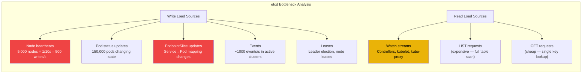
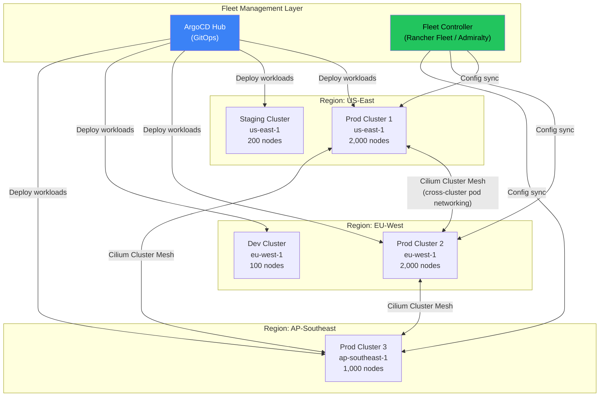

# Chapter 8: Multi-Tenancy and Scaling Limits 🔴

> **What you'll learn:**
> - The hard scaling limits of Kubernetes (5,000 nodes, 150,000 pods, 10,000 services) and the specific components that become bottlenecks
> - How to tune the API server, etcd, and controller-manager for clusters with thousands of nodes
> - Multi-tenancy models (namespace-based, virtual cluster, multi-cluster) and their isolation tradeoffs
> - How LimitRanges, ResourceQuotas, PriorityClasses, and admission webhooks enforce tenant boundaries

---

## 8.1 Kubernetes Scaling Limits: Where Things Break

Kubernetes publishes official SLIs (Service Level Indicators) for cluster performance. The control plane is tested to these limits:

| Dimension | Official Limit | What Breaks Beyond It |
|---|---|---|
| **Nodes** | 5,000 | Node heartbeats overwhelm API server; scheduler scoring too slow |
| **Pods** | 150,000 total | etcd watch throughput saturated; controller-manager falls behind |
| **Pods per node** | 110 (default) | Kubelet PLEG latency spikes; cgroup management overhead |
| **Services** | 10,000 | kube-proxy iptables collapse (see Ch 5); EndpointSlice churn |
| **ConfigMaps + Secrets** | ~100,000 combined | etcd database size; API server memory for watch cache |
| **Custom Resources** | Depends on watch pattern | Each CRD type adds watch load; informer memory grows linearly |

### The Kubernetes SLIs

| SLI | Target (at 5,000 nodes) |
|---|---|
| API call latency (mutating, p99) | ≤ 1 second |
| API call latency (non-mutating, p99) | ≤ 3 seconds |
| Pod startup latency (p99) | ≤ 5 seconds (with pre-pulled images) |
| Pods in Running state | 99% within 5 seconds |

When these SLIs are violated, the cluster is effectively broken — deployments take minutes, autoscaling responds too slowly, and service routing lags behind reality.

---

## 8.2 Tuning etcd for Scale

etcd is almost always the first bottleneck in large clusters. It handles every write (every pod status update, every endpoint change, every heartbeat).



### etcd Tuning Parameters

```bash
# // ✅ Production etcd configuration for 5,000-node clusters

# Use 5-member etcd cluster (tolerates 2 failures)
# NEVER use even numbers (split-brain risk)

# Storage: Local NVMe SSD with guaranteed IOPS
# AWS: i3en.xlarge (2× NVMe, 2,500 MB/s read)
# GCP: n2-standard-8 with local SSD

# Key tuning parameters:
--quota-backend-bytes=8589934592        # 8 GiB (default 2 GiB is too small)

--auto-compaction-mode=periodic
--auto-compaction-retention=5m          # Compact old revisions every 5 min

# Heartbeat: reduce for faster leader election on fast networks
--heartbeat-interval=100                # 100ms (default: 100ms)
--election-timeout=1000                 # 1s (default: 1000ms)

# Snapshot: how many applied entries before creating a snapshot
--snapshot-count=10000                  # Default: 100000 (reduce for faster recovery)

# gRPC: increase for heavy watch load
--max-request-bytes=10485760            # 10 MiB (for large LIST responses)

# Monitor these etcd metrics:
# etcd_mvcc_db_total_size_in_bytes      → Must stay below quota
# etcd_disk_wal_fsync_duration_seconds  → p99 must be < 10ms
# etcd_server_slow_apply_total          → Alert if increasing
# etcd_network_peer_round_trip_time_seconds → Must be < 50ms
```

### etcd Sharding: Beyond Single-Cluster etcd

At extreme scale (>5,000 nodes), a single etcd cluster becomes the hard ceiling. Solutions:

| Strategy | How It Works | Complexity |
|---|---|---|
| **Event etcd separation** | Run a separate etcd cluster for Events (which are write-heavy but non-critical) | Low |
| **Watch-based sharding** | Shard etcd watches by resource type across multiple etcd clusters | Medium |
| **Kine** | Replace etcd with a SQL backend (MySQL, Postgres) for specific workloads (used by K3s) | Medium |
| **Multi-cluster** | Split into multiple Kubernetes clusters with cluster federation | High (but most recommended) |

```yaml
# Separate etcd cluster for Events (reduce write pressure on main etcd)
# kube-apiserver flags:
--etcd-servers=https://etcd-main-1:2379,https://etcd-main-2:2379,https://etcd-main-3:2379
--etcd-servers-overrides=/events#https://etcd-events-1:2379,https://etcd-events-2:2379,https://etcd-events-3:2379
```

---

## 8.3 Tuning the API Server

```bash
# // ✅ API server tuning for large clusters

# Watch cache: critical for reducing etcd reads
--default-watch-cache-size=500
--watch-cache-sizes=pods#5000,nodes#1000,endpoints#2000,services#2000,secrets#3000

# Request throttling: prevent a single client from overwhelming the API server
--max-requests-inflight=800             # Max concurrent non-mutating requests
--max-mutating-requests-inflight=400    # Max concurrent mutating requests

# API Priority and Fairness (APF): replace --max-requests-inflight
# APF gives different priority levels to different clients
--enable-priority-and-fairness=true
# System components (scheduler, controller-manager) get highest priority
# User kubectl commands get lower priority
# This prevents a runaway CI/CD pipeline from starving the scheduler

# Watch bookmark: reduce full LIST calls after watch disconnections
--feature-gates=WatchBookmarks=true     # Default true since k8s 1.17

# Audit logging: use backend batching to reduce I/O
--audit-log-batch-max-size=100
--audit-log-batch-max-wait=5s
```

### API Priority and Fairness

At scale, the biggest risk is one misbehaving controller (or a `kubectl get pods --all-namespaces -w` from every developer) overwhelming the API server:

```yaml
# Define priority levels to protect critical system components
apiVersion: flowcontrol.apiserver.k8s.io/v1beta3
kind: PriorityLevelConfiguration
metadata:
  name: system-critical
spec:
  type: Limited
  limited:
    nominalConcurrencyShares: 100
    limitResponse:
      type: Queue
      queuing:
        queues: 128
        handSize: 6
        queueLengthLimit: 50
---
# Assign scheduler and controller-manager to highest priority
apiVersion: flowcontrol.apiserver.k8s.io/v1beta3
kind: FlowSchema
metadata:
  name: system-controllers
spec:
  priorityLevelConfiguration:
    name: system-critical
  matchingPrecedence: 100
  rules:
  - subjects:
    - kind: ServiceAccount
      serviceAccount:
        name: "*"
        namespace: kube-system
    resourceRules:
    - apiGroups: ["*"]
      resources: ["*"]
      verbs: ["*"]
```

---

## 8.4 Multi-Tenancy Models

Multi-tenancy in Kubernetes means running workloads from different teams, projects, or customers on the same cluster while enforcing isolation between them.

| Model | Isolation Level | Overhead | Use Case |
|---|---|---|---|
| **Namespace-based** | Soft (RBAC + quotas + network policy) | Lowest | Teams within the same organization |
| **Virtual Clusters** (vcluster) | Medium (separate API servers, shared nodes) | Medium | Strong isolation without separate hardware |
| **Multi-Cluster** | Hard (completely separate clusters) | Highest | Regulatory compliance, untrusted tenants |

### Namespace-Based Multi-Tenancy

```yaml
# // 💥 OUTAGE HAZARD: Namespace without resource quotas
# Tenant "team-a" deploys hundreds of pods with no resource limits
# They consume all CPU/memory on shared nodes
# Tenant "team-b" pods are evicted or can't schedule → noisy neighbor outage

# // ✅ FIX: Enforce quotas on every tenant namespace

# Step 1: ResourceQuota — cap total resource consumption
apiVersion: v1
kind: ResourceQuota
metadata:
  name: team-a-quota
  namespace: team-a
spec:
  hard:
    requests.cpu: "50"           # Max 50 CPU cores (sum of all pods)
    requests.memory: "100Gi"     # Max 100 GiB memory
    limits.cpu: "100"
    limits.memory: "200Gi"
    pods: "200"                  # Max 200 pods
    services: "50"
    persistentvolumeclaims: "100"
    configmaps: "200"
    secrets: "200"

---
# Step 2: LimitRange — enforce per-pod defaults and caps
apiVersion: v1
kind: LimitRange
metadata:
  name: team-a-limits
  namespace: team-a
spec:
  limits:
  - type: Container
    default:                     # Applied if pod doesn't specify
      cpu: "500m"
      memory: "256Mi"
    defaultRequest:
      cpu: "100m"
      memory: "128Mi"
    max:                         # Hard cap per container
      cpu: "4"
      memory: "8Gi"
    min:
      cpu: "50m"
      memory: "64Mi"
  - type: PersistentVolumeClaim
    max:
      storage: "100Gi"          # No single PVC larger than 100 GiB

---
# Step 3: NetworkPolicy — isolate tenant traffic
apiVersion: networking.k8s.io/v1
kind: NetworkPolicy
metadata:
  name: default-deny-all
  namespace: team-a
spec:
  podSelector: {}               # Applies to all pods in namespace
  policyTypes:
  - Ingress
  - Egress
  ingress: []                   # Deny all ingress by default
  egress:
  - to:                         # Allow DNS
    - namespaceSelector: {}
      podSelector:
        matchLabels:
          k8s-app: kube-dns
    ports:
    - port: 53
      protocol: UDP
  - to:                         # Allow traffic within own namespace
    - podSelector: {}
```

### PriorityClasses: Preemption Under Pressure

When the cluster is full, PriorityClasses determine which pods can preempt (evict) others:

```yaml
# System-critical: cannot be preempted
apiVersion: scheduling.k8s.io/v1
kind: PriorityClass
metadata:
  name: system-critical
value: 1000000
globalDefault: false
preemptionPolicy: PreemptLowerPriority
description: "For system components that must always run"

---
# Production workloads: high priority
apiVersion: scheduling.k8s.io/v1
kind: PriorityClass
metadata:
  name: production
value: 100000
globalDefault: false
description: "For production-facing services"

---
# Development/test: can be preempted by production workloads
apiVersion: scheduling.k8s.io/v1
kind: PriorityClass
metadata:
  name: development
value: 1000
globalDefault: true            # Default for all pods without a priority class
preemptionPolicy: Never        # Don't preempt others, but can be preempted
description: "For dev and test workloads — may be preempted"
```

---

## 8.5 Multi-Cluster Federation

When a single cluster can't meet your requirements (regulatory separation, blast radius containment, geographic distribution), you need multi-cluster architecture.

### Cluster Fleet Design



### Multi-Cluster Service Discovery

```yaml
# Cilium Cluster Mesh: Global Services
# A Service annotated as "global" is automatically load-balanced
# across all clusters in the mesh
apiVersion: v1
kind: Service
metadata:
  name: backend
  namespace: default
  annotations:
    service.cilium.io/global: "true"          # Discoverable across clusters
    service.cilium.io/shared: "true"          # Share endpoints across clusters
    io.cilium/global-service: "true"
spec:
  selector:
    app: backend
  ports:
  - port: 8080

# In cluster-1: backend has pods 10.244.1.5, 10.244.1.6
# In cluster-2: backend has pods 10.245.2.8, 10.245.2.9
# Cilium Cluster Mesh merges these into a single service
# Pods in cluster-1 calling backend can reach pods in both clusters
# With affinity policy to prefer local endpoints
```

---

<details>
<summary><strong>🏋️ Exercise: Design a Multi-Tenant Platform for 5 Teams</strong> (click to expand)</summary>

### The Challenge

You are architecting an Internal Developer Platform for 5 engineering teams on a single 500-node Kubernetes cluster. Requirements:

1. Each team has an independent namespace with resource quotas
2. Teams cannot see or access each other's resources (strict RBAC)
3. Network traffic between team namespaces is denied by default
4. Team "platform" can access all namespaces (for observability tooling)
5. Production workloads must not be preempted by dev/test workloads
6. Total cluster capacity: 2,000 CPU cores, 8 TiB memory

Design the RBAC, ResourceQuotas, NetworkPolicies, and PriorityClasses.

<details>
<summary>🔑 Solution</summary>

```yaml
# === RBAC: Per-team roles with strict isolation ===

# ClusterRole for team developers (read/write in their namespace only)
apiVersion: rbac.authorization.k8s.io/v1
kind: ClusterRole
metadata:
  name: team-developer
rules:
- apiGroups: ["", "apps", "batch"]
  resources: ["pods", "deployments", "services", "configmaps",
              "secrets", "jobs", "cronjobs", "statefulsets"]
  verbs: ["get", "list", "watch", "create", "update", "patch", "delete"]
- apiGroups: [""]
  resources: ["pods/log", "pods/exec"]
  verbs: ["get", "create"]
- apiGroups: ["networking.k8s.io"]
  resources: ["networkpolicies"]
  verbs: ["get", "list", "watch"]           # Can see policies, not modify
---
# RoleBinding: bind the role to team-a in their namespace only
apiVersion: rbac.authorization.k8s.io/v1
kind: RoleBinding
metadata:
  name: team-a-developers
  namespace: team-a
subjects:
- kind: Group
  name: team-a-devs       # Maps to IdP group (OIDC)
  apiGroup: rbac.authorization.k8s.io
roleRef:
  kind: ClusterRole
  name: team-developer
  apiGroup: rbac.authorization.k8s.io
# Repeat for team-b, team-c, team-d, team-e

---
# Platform team: cluster-wide read access + namespace admin in all team namespaces
apiVersion: rbac.authorization.k8s.io/v1
kind: ClusterRoleBinding
metadata:
  name: platform-team-admin
subjects:
- kind: Group
  name: platform-team
  apiGroup: rbac.authorization.k8s.io
roleRef:
  kind: ClusterRole
  name: cluster-admin      # Full access for platform team
  apiGroup: rbac.authorization.k8s.io
```

```yaml
# === ResourceQuotas: Fair allocation across 5 teams ===
# Total: 2,000 cores, 8 TiB memory
# Allocation: Each team gets 300 cores, 1.2 TiB (75% allocated, 25% buffer)

# template — apply to each team namespace
apiVersion: v1
kind: ResourceQuota
metadata:
  name: team-quota
  namespace: team-a        # Repeat for team-b through team-e
spec:
  hard:
    requests.cpu: "300"
    requests.memory: "1200Gi"
    limits.cpu: "600"            # Allow burst up to 2× request
    limits.memory: "2400Gi"
    pods: "500"
    services: "100"
    persistentvolumeclaims: "200"
---
apiVersion: v1
kind: LimitRange
metadata:
  name: team-limits
  namespace: team-a
spec:
  limits:
  - type: Container
    default:
      cpu: "500m"
      memory: "512Mi"
    defaultRequest:
      cpu: "100m"
      memory: "128Mi"
    max:
      cpu: "8"
      memory: "32Gi"
```

```yaml
# === NetworkPolicy: Default deny + allow within namespace ===
apiVersion: networking.k8s.io/v1
kind: NetworkPolicy
metadata:
  name: default-deny
  namespace: team-a
spec:
  podSelector: {}
  policyTypes: [Ingress, Egress]
  ingress: []
  egress:
  - to:
    - namespaceSelector: {}
      podSelector:
        matchLabels:
          k8s-app: kube-dns
    ports:
    - { port: 53, protocol: UDP }
    - { port: 53, protocol: TCP }
---
apiVersion: networking.k8s.io/v1
kind: NetworkPolicy
metadata:
  name: allow-same-namespace
  namespace: team-a
spec:
  podSelector: {}
  policyTypes: [Ingress]
  ingress:
  - from:
    - podSelector: {}    # Allow all pods in same namespace
---
# Allow platform team's monitoring to scrape metrics from all namespaces
apiVersion: networking.k8s.io/v1
kind: NetworkPolicy
metadata:
  name: allow-monitoring-scrape
  namespace: team-a
spec:
  podSelector: {}
  policyTypes: [Ingress]
  ingress:
  - from:
    - namespaceSelector:
        matchLabels:
          name: platform-monitoring
    ports:
    - { port: 9090, protocol: TCP }     # Prometheus metrics port
```

```yaml
# === PriorityClasses ===
apiVersion: scheduling.k8s.io/v1
kind: PriorityClass
metadata:
  name: production-critical
value: 1000000
preemptionPolicy: PreemptLowerPriority
---
apiVersion: scheduling.k8s.io/v1
kind: PriorityClass
metadata:
  name: production-standard
value: 100000
preemptionPolicy: PreemptLowerPriority
---
apiVersion: scheduling.k8s.io/v1
kind: PriorityClass
metadata:
  name: development
value: 1000
globalDefault: true
preemptionPolicy: Never     # Dev pods can be preempted but won't preempt others
```

**Summary:**
- 5 namespaces with RBAC isolated by IdP group
- 300 CPU / 1.2 TiB per team (75% of cluster allocated, 25% buffer for system + burst)
- Default deny NetworkPolicy with exceptions for DNS, same-namespace, and monitoring
- PriorityClasses ensure production workloads always preempt dev/test
- Platform team has cluster-admin for observability and incident response

</details>
</details>

---

> **Key Takeaways:**
> - Kubernetes has hard scaling limits: 5,000 nodes, 150,000 pods, and 10,000 services with official SLIs for API latency and pod startup time.
> - etcd is the first bottleneck at scale. Use local NVMe SSDs, enable auto-compaction, tune DB quota to 8 GiB, and separate Events into a dedicated etcd cluster.
> - API server tuning: increase watch cache sizes, enable API Priority and Fairness to prevent misbehaving clients from starving system components.
> - Multi-tenancy requires layered enforcement: RBAC (who can access what), ResourceQuotas (how much), LimitRanges (per-pod defaults), NetworkPolicies (network isolation), and PriorityClasses (scheduling fairness).
> - Beyond single-cluster scale, use multi-cluster federation with Cilium Cluster Mesh for cross-cluster pod networking and ArgoCD for GitOps-based fleet management.
> - Always have a "buffer" in resource quotas — allocating 100% of cluster resources to tenants leaves no room for system components, DaemonSets, or burst workloads.

> **See also:**
> - [Chapter 2: Kubernetes Control Plane Internals](ch02-control-plane-internals.md) — understanding etcd and API server architecture before tuning them
> - [Chapter 5: eBPF and the Death of iptables](ch05-ebpf-and-death-of-iptables.md) — Cilium's O(1) service routing eliminates the 10,000-service iptables wall
> - [Chapter 9: Capstone](ch09-capstone-multi-region-platform.md) — putting multi-cluster and multi-tenancy into a complete platform design
