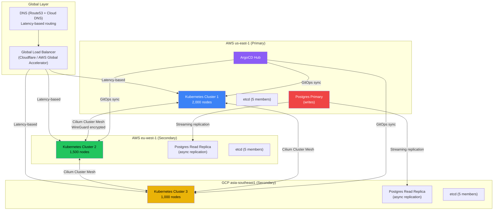
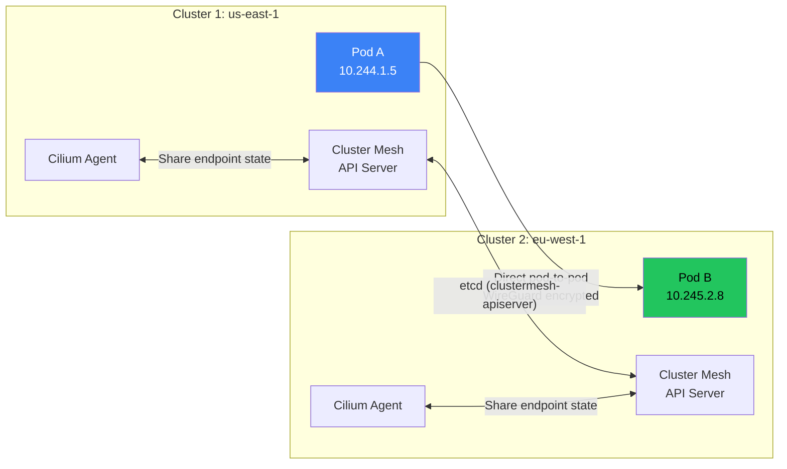
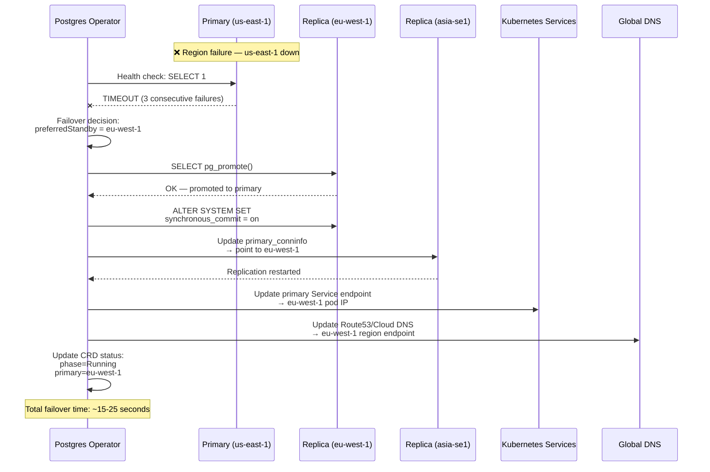

# Chapter 9: Capstone — Architect a Multi-Region Stateful Platform 🔴

> **What you'll learn:**
> - How to design a complete, globally distributed Kubernetes platform spanning AWS and GCP — the type of system design expected in Staff/Principal-level interviews
> - How to architect the GitOps delivery pipeline with ArgoCD/Flux for atomic, auditable deployments across multiple clusters
> - How to design the networking layer using Cilium Cluster Mesh for cross-region pod-to-pod communication without NAT gateways
> - How to write the conceptual logic for a custom Operator that manages a distributed Postgres cluster (backups, failovers, leader election)
> - How to define eBPF hook points to trace network latency between regions

---

## 9.1 The Problem Statement

> *"Design a globally distributed Kubernetes platform that runs across AWS (us-east-1, eu-west-1) and GCP (asia-southeast1). The platform must serve 50,000 RPS globally with < 100ms p99 latency for reads. It hosts 200 microservices, a distributed Postgres database (primary in us-east-1, replicas in EU and Asia), and must survive the complete failure of any one region with < 30 second failover."*

This is a Staff-level system design exercise. We will design every layer.

---

## 9.2 High-Level Architecture



---

## 9.3 Component 1: GitOps Delivery Pipeline (ArgoCD)

### Architecture Decisions

| Decision | Choice | Rationale |
|---|---|---|
| **GitOps tool** | ArgoCD (hub-spoke model) | Battle-tested, multi-cluster native, RBAC, SSO integration |
| **Repo structure** | Monorepo with Kustomize overlays | Single source of truth; overlays per region for config differences |
| **Deployment strategy** | Progressive rollout per region | Deploy to us-east-1 first, validate, then EU, then Asia |
| **Secret management** | Sealed Secrets + External Secrets Operator (AWS Secrets Manager / GCP Secret Manager) | Secrets never stored in Git |

### Repository Structure

```
gitops-repo/
├── base/                           # Shared Kustomize base for all regions
│   ├── kustomization.yaml
│   ├── deployment.yaml             # 200 microservice deployments
│   ├── service.yaml
│   ├── hpa.yaml
│   └── network-policies/
│       ├── default-deny.yaml
│       └── allow-rules.yaml
├── overlays/
│   ├── us-east-1/                  # Region-specific overrides
│   │   ├── kustomization.yaml      # patches: replica count, resource limits
│   │   └── configmap-region.yaml   # POSTGRES_HOST=pg-primary.us-east-1
│   ├── eu-west-1/
│   │   ├── kustomization.yaml
│   │   └── configmap-region.yaml   # POSTGRES_HOST=pg-replica.eu-west-1
│   └── asia-southeast1/
│       ├── kustomization.yaml
│       └── configmap-region.yaml
├── infrastructure/
│   ├── cilium/                     # Cilium Cluster Mesh config
│   ├── postgres-operator/          # Custom Postgres Operator CRDs
│   ├── monitoring/                 # Prometheus, Grafana, Hubble
│   └── argocd/                     # ArgoCD self-management
└── applicationsets/
    └── multi-region-apps.yaml      # ArgoCD ApplicationSet for all regions
```

### ArgoCD ApplicationSet for Multi-Region Deployment

```yaml
apiVersion: argoproj.io/v1alpha1
kind: ApplicationSet
metadata:
  name: microservices
  namespace: argocd
spec:
  generators:
  - matrix:
      generators:
      - git:
          repoURL: https://github.com/company/gitops-repo
          revision: main
          directories:
          - path: "overlays/*"
      - list:
          elements:
          - cluster: us-east-1
            url: https://k8s-us-east-1.internal:6443
            wave: "1"        # Deploy first
          - cluster: eu-west-1
            url: https://k8s-eu-west-1.internal:6443
            wave: "2"        # Deploy second (after us-east-1 is healthy)
          - cluster: asia-southeast1
            url: https://k8s-asia-se1.internal:6443
            wave: "3"        # Deploy last
  template:
    metadata:
      name: "{{path.basename}}-{{cluster}}"
      annotations:
        argocd.argoproj.io/sync-wave: "{{wave}}"
    spec:
      project: default
      source:
        repoURL: https://github.com/company/gitops-repo
        targetRevision: main
        path: "{{path}}"
      destination:
        server: "{{url}}"
        namespace: default
      syncPolicy:
        automated:
          prune: true
          selfHeal: true
        syncOptions:
        - CreateNamespace=true
        retry:
          limit: 3
          backoff:
            duration: 30s
            factor: 2
            maxDuration: 3m
```

### Deployment Safety: Progressive Multi-Region Rollout

```
Deployment Pipeline:
  1. Developer pushes code → CI builds image → pushes to registry
  2. CI updates gitops-repo image tag (automated commit)
  3. ArgoCD detects change → syncs to us-east-1 (wave 1)
  4. ArgoCD runs PreSync hooks:
     a. Run integration tests against us-east-1 staging namespace
     b. Verify Prometheus error rate < 0.1% for 5 minutes
  5. If healthy → ArgoCD syncs to eu-west-1 (wave 2)
  6. PostSync: verify eu-west-1 metrics healthy for 5 minutes
  7. If healthy → ArgoCD syncs to asia-southeast1 (wave 3)

  ROLLBACK TRIGGER (any wave):
  - Error rate > 1% → ArgoCD auto-rollback to previous Git commit
  - Latency p99 > 200ms → manual review + ArgoCD sync to previous revision
```

---

## 9.4 Component 2: Cilium Cluster Mesh Networking

### Cross-Region Pod-to-Pod Communication

Cilium Cluster Mesh connects multiple Kubernetes clusters into a single flat network. Pods in us-east-1 can directly reach pods in eu-west-1 by their pod IP — no NAT, no VPN tunnels, no bespoke routing.



### Cilium Cluster Mesh Configuration

```yaml
# Enable Cluster Mesh on each cluster
# Cluster 1 (us-east-1):
helm upgrade cilium cilium/cilium \
  --namespace kube-system \
  --set cluster.name=us-east-1 \
  --set cluster.id=1 \
  --set clustermesh.useAPIServer=true \
  --set clustermesh.apiserver.replicas=3 \
  --set kubeProxyReplacement=true \
  --set encryption.enabled=true \
  --set encryption.type=wireguard

# Cluster 2 (eu-west-1):
helm upgrade cilium cilium/cilium \
  --namespace kube-system \
  --set cluster.name=eu-west-1 \
  --set cluster.id=2 \
  --set clustermesh.useAPIServer=true \
  --set clustermesh.apiserver.replicas=3 \
  --set kubeProxyReplacement=true \
  --set encryption.enabled=true \
  --set encryption.type=wireguard

# Connect the clusters
cilium clustermesh connect --destination-context=eu-west-1
cilium clustermesh connect --destination-context=asia-southeast1
```

### Global Service with Local Affinity

```yaml
# Global service: load balance across all regions
# but prefer local endpoints to minimize cross-region latency
apiVersion: v1
kind: Service
metadata:
  name: user-service
  annotations:
    service.cilium.io/global: "true"
    service.cilium.io/shared: "true"
    # Prefer endpoints in the same cluster
    # Only failover to remote if local endpoints are unhealthy
    service.cilium.io/affinity: "local"
spec:
  selector:
    app: user-service
  ports:
  - port: 8080
```

### CIDR Planning: Non-Overlapping Pod CIDRs

```
# CRITICAL: Each cluster MUST have non-overlapping pod CIDRs
# Otherwise Cilium Cluster Mesh cannot route between clusters

# Cluster 1 (us-east-1):   podCIDR = 10.244.0.0/16  (65K IPs)
# Cluster 2 (eu-west-1):   podCIDR = 10.245.0.0/16  (65K IPs)
# Cluster 3 (asia-se1):    podCIDR = 10.246.0.0/16  (65K IPs)
# Service CIDRs: similarly non-overlapping
# Cluster 1: serviceCIDR = 10.96.0.0/16
# Cluster 2: serviceCIDR = 10.97.0.0/16
# Cluster 3: serviceCIDR = 10.98.0.0/16
```

---

## 9.5 Component 3: Custom Postgres Operator

### Operator Design

The Postgres operator manages the lifecycle of a distributed Postgres cluster across regions:

```yaml
apiVersion: database.platform.io/v1
kind: DistributedPostgres
metadata:
  name: orders-db
  namespace: platform-data
spec:
  primary:
    region: us-east-1
    cluster: us-east-1
    replicas: 2              # 1 primary + 1 standby in same region
    storage:
      size: 500Gi
      storageClass: gp3-io2
    resources:
      requests: { cpu: "8", memory: "32Gi" }
      limits:   { cpu: "16", memory: "64Gi" }
  readReplicas:
  - region: eu-west-1
    cluster: eu-west-1
    replicas: 2
    storage:
      size: 500Gi
      storageClass: gp3-io2
  - region: asia-southeast1
    cluster: asia-southeast1
    replicas: 1
    storage:
      size: 500Gi
      storageClass: pd-ssd
  backup:
    schedule: "0 */6 * * *"  # Every 6 hours
    retention: 30d
    storageLocation: s3://company-backups/postgres/
  failover:
    automaticFailover: true
    failoverTimeout: 30s
    preferredStandby: eu-west-1  # Promote EU replica first if US fails
  monitoring:
    enabled: true
    alertRules:
      replicationLagWarning: 5s
      replicationLagCritical: 30s
```

### Operator Reconciliation Logic

```
Reconcile Loop (every 10 seconds):

1. CHECK PRIMARY HEALTH
   - Connect to primary Postgres: SELECT 1
   - Check pg_is_in_recovery() = false (is it the primary?)
   - If unreachable for > failoverTimeout:
     → INITIATE FAILOVER (see below)

2. CHECK REPLICATION HEALTH
   - For each replica: SELECT * FROM pg_stat_replication
   - Calculate replication lag (write_lag, flush_lag, replay_lag)
   - If lag > replicationLagCritical:
     → Set status: ReplicationDegraded
     → Emit Kubernetes Event + Prometheus alert
   - If lag > replicationLagWarning:
     → Emit warning metric

3. RECONCILE INFRASTRUCTURE
   - Ensure StatefulSets in each cluster match spec
   - Ensure PVCs exist with correct storage class
   - Ensure Services (primary read-write, replica read-only) exist
   - Ensure ConfigMaps (postgresql.conf, pg_hba.conf) are current
   - Ensure CronJobs for backups are scheduled

4. UPDATE STATUS
   - status.phase: Running | Failing | FailingOver | Restoring
   - status.primaryEndpoint: orders-db-primary.us-east-1.svc:5432
   - status.replicaEndpoints: [eu-west-1:5432, asia-se1:5432]
   - status.lastBackup: <timestamp>
   - status.replicationLag: { eu-west-1: 1.2s, asia-se1: 3.5s }

FAILOVER PROCEDURE (if primary is unreachable):
  1. Verify primary is truly down (3 consecutive health check failures)
  2. Select failover target: preferredStandby (eu-west-1) if healthy
  3. On the target replica:
     a. pg_promote() — promote replica to primary
     b. Update pg_hba.conf to accept write connections
  4. On remaining replicas:
     a. Update primary_conninfo to point to new primary
     b. Restart replication from new primary
  5. Update Service endpoints:
     a. primary Service → new primary pod
     b. Update DNS/Global LB to direct writes to new region
  6. Update CRD status:
     a. status.phase = Running
     b. status.primaryEndpoint = new-primary-endpoint
  7. Emit Event: "Failover complete. New primary: eu-west-1"
  
  Total target time: < 30 seconds
```

### Failover Sequence Diagram



---

## 9.6 Component 4: eBPF Observability for Cross-Region Latency

### eBPF Hook Points for Latency Tracing

To detect and diagnose cross-region latency issues, we attach eBPF programs at multiple kernel hook points:

| Hook Point | What We Measure | Alert Threshold |
|---|---|---|
| **TC egress** on pod veth | Packet departure timestamp | — |
| **TC ingress** on remote pod veth | Packet arrival timestamp | RTT > 100ms between regions |
| **Socket `connect()`** | TCP connection setup time | Connect > 50ms (same-region), > 150ms (cross-region) |
| **Kprobe on `tcp_rcv_established`** | TCP retransmissions | Retransmit rate > 1% |
| **Tracepoint `tcp:tcp_retransmit_skb`** | Per-flow retransmission events | Any retransmit on critical path |

### Conceptual eBPF Program for Cross-Region Latency

```c
// eBPF program attached to TC egress on pod veth interfaces
// Measures per-flow latency between regions using Cilium's identity system

struct flow_key {
    __u32 src_ip;
    __u32 dst_ip;
    __u16 src_port;
    __u16 dst_port;
    __u8  proto;
};

struct flow_metrics {
    __u64 first_packet_ns;      // Timestamp of first packet (SYN)
    __u64 last_packet_ns;       // Timestamp of last packet
    __u64 total_bytes;
    __u32 packet_count;
    __u32 retransmit_count;
    __u32 src_cluster_id;       // Cilium cluster ID (1=us-east, 2=eu-west, 3=asia)
    __u32 dst_cluster_id;
};

// eBPF hash map: per-flow metrics
struct {
    __uint(type, BPF_MAP_TYPE_LRU_HASH);
    __uint(max_entries, 100000);
    __type(key, struct flow_key);
    __type(value, struct flow_metrics);
} flow_metrics_map SEC(".maps");

// Ring buffer for exporting latency events to user space (Hubble)
struct {
    __uint(type, BPF_MAP_TYPE_RINGBUF);
    __uint(max_entries, 256 * 1024);  // 256 KB ring buffer
} latency_events SEC(".maps");

struct latency_event {
    struct flow_key flow;
    __u64 rtt_ns;               // Round-trip time in nanoseconds
    __u32 src_cluster;
    __u32 dst_cluster;
};

SEC("tc/egress")
int measure_cross_region_latency(struct __sk_buff *skb) {
    // Parse packet headers
    struct iphdr *ip = /* ... */;
    struct tcphdr *tcp = /* ... */;

    struct flow_key key = {
        .src_ip = ip->saddr,
        .dst_ip = ip->daddr,
        .src_port = tcp->source,
        .dst_port = tcp->dest,
        .proto = ip->protocol,
    };

    // Record timestamp for this packet
    __u64 now = bpf_ktime_get_ns();

    struct flow_metrics *metrics = bpf_map_lookup_elem(&flow_metrics_map, &key);
    if (!metrics) {
        // New flow: record start time
        struct flow_metrics new_metrics = {
            .first_packet_ns = now,
            .last_packet_ns = now,
            .total_bytes = skb->len,
            .packet_count = 1,
            .src_cluster_id = get_local_cluster_id(),       // From Cilium identity
            .dst_cluster_id = get_remote_cluster_id(ip->daddr),
        };
        bpf_map_update_elem(&flow_metrics_map, &key, &new_metrics, BPF_ANY);
    } else {
        metrics->last_packet_ns = now;
        metrics->total_bytes += skb->len;
        metrics->packet_count += 1;

        // If this is a cross-cluster flow, check if RTT exceeds threshold
        if (metrics->src_cluster_id != metrics->dst_cluster_id) {
            __u64 rtt = now - metrics->first_packet_ns;
            if (rtt > 100000000) {  // > 100ms RTT
                // Emit latency event to user space
                struct latency_event *evt = bpf_ringbuf_reserve(
                    &latency_events, sizeof(*evt), 0
                );
                if (evt) {
                    evt->flow = key;
                    evt->rtt_ns = rtt;
                    evt->src_cluster = metrics->src_cluster_id;
                    evt->dst_cluster = metrics->dst_cluster_id;
                    bpf_ringbuf_submit(evt, 0);
                }
            }
        }
    }

    return TC_ACT_OK;  // Pass packet through
}
```

### Real-World Observability Stack

```
eBPF (kernel) → Hubble (per-node) → Hubble Relay (aggregator) → Grafana dashboards

Dashboards:
1. Cross-Region Latency Heatmap
   - Source cluster × Destination cluster matrix
   - Color-coded by p99 latency (green < 50ms, yellow < 100ms, red > 100ms)

2. Service Dependency Map
   - Auto-discovered from eBPF flow data
   - Shows which services call which, with latency on each edge

3. Retransmission Rate by Region Pair
   - Tracks TCP retransmits between regions
   - Early warning for network path degradation

4. DNS Resolution Latency
   - Per-namespace, per-service DNS query times
   - Identifies CoreDNS bottlenecks
```

---

## 9.7 Putting It All Together: The Complete Platform

### Infrastructure Bill of Materials

| Component | Spec | Region | Count |
|---|---|---|---|
| Kubernetes control plane | 3× HA masters, 5-member etcd | Each region | 3 clusters |
| Worker nodes (us-east-1) | m5.4xlarge (16 vCPU, 64 GiB) | us-east-1 | 2,000 |
| Worker nodes (eu-west-1) | m5.4xlarge | eu-west-1 | 1,500 |
| Worker nodes (asia-se1) | n2-standard-16 (GCP equivalent) | asia-southeast1 | 1,000 |
| Cilium Cluster Mesh | 3 clustermesh-apiserver replicas per cluster | Each region | 9 total |
| ArgoCD | HA installation (3 replicas per component) | us-east-1 (hub) | 1 |
| Postgres primary | r6i.4xlarge (16 vCPU, 128 GiB, io2 SSD) | us-east-1 | 2 (primary + hot standby) |
| Postgres replicas | r6i.2xlarge | eu-west-1, asia-se1 | 3 total |
| Monitoring | Prometheus (per-cluster) + Thanos (global) | Each region | 3 Prometheus + 1 Thanos |

### Failure Scenarios and Responses

| Failure | Impact | Automated Response | Target Recovery |
|---|---|---|---|
| Single pod crash | One instance of one service down | Kubelet restart + readiness probe removes from LB | < 10 seconds |
| Single node failure | ~50 pods rescheduled | Scheduler places pods on other nodes | < 60 seconds |
| AZ failure (1 of 3) | ~33% capacity in one region | Pods rescheduled to remaining AZs | < 2 minutes |
| Full region failure | Entire region offline | DNS failover to remaining regions; Postgres failover | < 30 seconds |
| Postgres primary failure | Writes unavailable | Operator promotes EU replica; DNS updated | < 30 seconds |
| Cilium Cluster Mesh partition | Cross-region pod communication broken | Local service affinity kicks in; degrade gracefully | Automatic (services fall back to local) |

---

<details>
<summary><strong>🏋️ Exercise: Staff-Level System Design Mock</strong> (click to expand)</summary>

### The Challenge

You are in a Staff Engineer interview. The interviewer says:

> *"Our company is expanding from US-only to global presence. We have 150 microservices running on a single 500-node EKS cluster in us-east-1. We need to add EU and Asia presence within 6 months. Design the migration plan and target architecture."*

**Your tasks:**

1. Ask clarifying questions (latency requirements, data residency, budget constraints, team size).
2. Design the target multi-region architecture.
3. Propose a phased migration plan (what moves first, what stays).
4. Identify the top 3 risks and mitigation strategies.
5. Define the success metrics and observability requirements.

Present your design as you would in a 45-minute interview.

<details>
<summary>🔑 Solution</summary>

### Clarifying Questions (First 5 minutes)

```
Q: What are the latency requirements for end users?
A: p95 < 200ms for API calls, p99 < 500ms

Q: Are there data residency requirements (GDPR)?
A: Yes — EU user data must stay in EU. This is the primary driver.

Q: What's the write vs read ratio?
A: 80% reads, 20% writes. Writes can tolerate higher latency.

Q: What's the team size for platform engineering?
A: 5 engineers, growing to 8 by end of year.

Q: Is there budget for multi-cloud, or single cloud?
A: AWS preferred, but open to GCP for Asia if cost-effective.

Q: What's the current database architecture?
A: Single RDS Postgres instance (r6g.4xlarge), 2 TB data.
```

### Target Architecture (Next 15 minutes)

**Draw on whiteboard (summarized here):**

```
Architecture Decision Records:

1. CLUSTER STRATEGY: 3 separate EKS clusters (not multi-tenant single cluster)
   - us-east-1: Primary (500 → 700 nodes, handles global writes)
   - eu-west-1: Secondary (400 nodes, GDPR-compliant)
   - ap-southeast-1: Secondary (200 nodes)
   Rationale: Blast radius isolation, independent scaling, regulatory compliance

2. NETWORKING: Cilium Cluster Mesh with WireGuard encryption
   - Non-overlapping pod CIDRs across clusters
   - Global Services with local affinity (prefer same-region endpoints)
   - No NAT gateways for cross-cluster traffic
   Rationale: Native pod routing, O(1) service lookup, built-in encryption

3. DATA LAYER: Postgres with streaming replication
   - Primary: us-east-1 (all writes)
   - Read replicas: eu-west-1, ap-southeast-1
   - Read traffic served by local replica (< 5ms latency)
   - Write traffic routes to us-east-1 (50-150ms cross-region)
   - Managed via custom operator for automated failover
   Rationale: GDPR requires EU data stay in EU; read replicas 
   serve 80% of traffic locally

4. GITOPS: ArgoCD hub-spoke
   - Hub in us-east-1, manages all 3 clusters
   - Progressive rollout: us-east-1 → eu-west-1 → ap-southeast-1
   - Automated rollback on error rate > 1%

5. OBSERVABILITY: Prometheus per-cluster + Thanos global view
   - eBPF/Hubble for network flow visibility
   - Cross-region latency dashboards
   - SLO-based alerting (error budget burn rate)
```

### Migration Plan (Next 15 minutes)

```
Phase 1 (Month 1-2): Foundation
  - Deploy EKS clusters in eu-west-1 and ap-southeast-1
  - Install Cilium Cluster Mesh, verify cross-cluster connectivity
  - Set up ArgoCD hub-spoke
  - Deploy monitoring stack (Prometheus + Thanos)
  
Phase 2 (Month 2-3): Data Layer
  - Set up Postgres read replicas in EU and Asia
  - Deploy Postgres operator, verify replication health
  - Test failover procedure (automated + manual)
  - Validate GDPR compliance: EU reads served from EU replica
  
Phase 3 (Month 3-4): Stateless Services Migration
  - Deploy 150 microservices to EU and Asia clusters via ArgoCD
  - Start with non-critical services (monitoring tools, internal dashboards)
  - Gradually add user-facing services after validation
  - Enable latency-based DNS routing (Route53)
  
Phase 4 (Month 4-5): Traffic Cutover
  - Route EU traffic to eu-west-1 cluster
  - Route Asia traffic to ap-southeast-1 cluster
  - Monitor error rates, latency, and replication lag
  - Keep us-east-1 as failback for all regions
  
Phase 5 (Month 5-6): Hardening
  - Chaos testing: kill regions, test failover
  - Gameday exercises with on-call team
  - Document runbooks for every failure scenario
  - Optimize: right-size nodes, tune Cilium, tune Postgres replication
```

### Top 3 Risks and Mitigations

```
Risk 1: Cross-region latency for write-heavy services
  Impact: 20% of traffic (writes) must reach us-east-1 (50-150ms RTT)
  Mitigation:
  - Identify write-heavy services and optimize (batch writes, async)
  - Consider CRDT-based eventual consistency for non-critical writes
  - Monitor write latency and alert if p99 > 300ms

Risk 2: Postgres replication lag during peak traffic
  Impact: EU/Asia users see stale data if replication falls behind
  Mitigation:
  - Monitor replication lag with operator (alert at 5s, critical at 30s)
  - Use synchronous replication for critical tables (transactions, payments)
  - Implement read-your-writes consistency at application level
    (route reads to primary for 2s after a write)

Risk 3: Cilium Cluster Mesh network partition
  Impact: Cross-region service calls fail
  Mitigation:
  - Use local service affinity (prefer same-cluster endpoints)
  - Design services to degrade gracefully (cache, serve stale data)
  - Dual WireGuard tunnels over different network paths
  - Automated alerting on Cluster Mesh connectivity status
```

### Success Metrics

```
SLOs:
  - API p95 latency: < 200ms (per region)
  - API p99 latency: < 500ms (per region)
  - Availability: 99.95% (per region), 99.99% (global)
  - Postgres replication lag: p99 < 5s
  - Failover time (region failure → recovery): < 30s

SLIs (what we measure):
  - istio_request_duration_seconds (per-region, per-service)
  - pg_replication_lag_seconds (per-replica)
  - cilium_clustermesh_remote_cluster_status (connectivity)
  - argocd_app_sync_status (deployment health)
```

</details>
</details>

---

> **Key Takeaways:**
> - A multi-region Kubernetes platform requires coordinated design across four layers: GitOps delivery (ArgoCD), networking (Cilium Cluster Mesh), data (distributed Postgres with custom operator), and observability (eBPF/Hubble).
> - Cilium Cluster Mesh enables native pod-to-pod communication across clusters and regions with WireGuard encryption, non-overlapping CIDRs, and local service affinity.
> - Custom operators encode complex stateful application lifecycle management (Postgres failover, backup, leader election) into Kubernetes-native reconciliation loops.
> - eBPF programs at TC and socket hook points provide kernel-level observability for cross-region latency, retransmissions, and flow metrics without sidecars.
> - Staff-level system design requires not just architecture, but a phased migration plan, risk assessment, success metrics, and an understanding of failure modes.
> - Progressive multi-region rollout (deploy to one region, validate, then the next) is the safest deployment strategy for globally distributed systems.

> **See also:**
> - [Chapter 2: Kubernetes Control Plane Internals](ch02-control-plane-internals.md) — understanding the control plane you're deploying in each region
> - [Chapter 5: eBPF and the Death of iptables](ch05-ebpf-and-death-of-iptables.md) — the kernel-level networking that powers Cilium Cluster Mesh
> - [Chapter 7: Operators and CRDs](ch07-operators-and-crds.md) — the operator pattern used for the Postgres lifecycle manager
> - [Chapter 8: Multi-Tenancy and Scaling Limits](ch08-multi-tenancy-scaling.md) — scaling each cluster within the multi-region fleet
