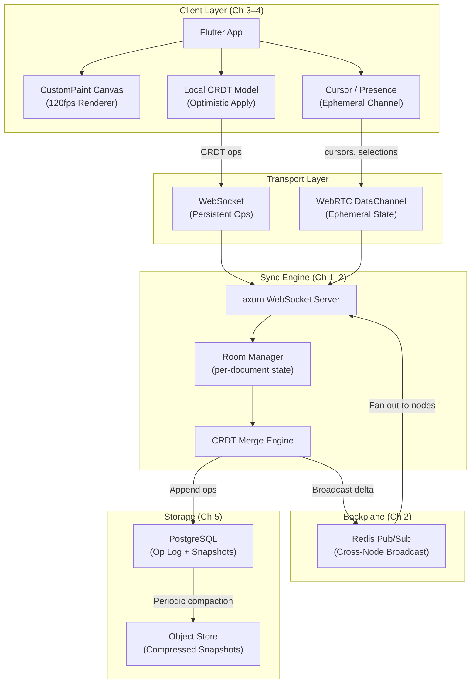

# System Design: The Real-Time Collaborative Canvas

## Speaker Intro

This handbook is written from the perspective of a **Principal Full-Stack Architect** who has designed, shipped, and operated real-time collaborative editing systems at scale. The content draws from first-hand experience building multiplayer design tools that support millions of concurrent editing sessions, implementing CRDT-based conflict resolution engines that keep distributed state perfectly consistent without a single coordination lock, and shipping 120fps Flutter rendering canvases that feel indistinguishable from native desktop applications — all backed by a Rust sync engine handling hundreds of thousands of persistent WebSocket connections per node.

## Who This Is For

- **Backend systems engineers** building real-time collaborative applications who want to understand the data structures and networking architecture behind Figma, Miro, and Excalidraw — and implement them in Rust.
- **Flutter developers** reaching the limits of the standard widget tree who need to build high-performance, GPU-accelerated custom rendering surfaces with infinite pan, pinch-zoom, and tens of thousands of simultaneously visible shapes.
- **Distributed systems engineers** who understand consensus protocols but haven't yet applied CRDTs to a production system with real conflict scenarios, offline support, and sub-50ms sync latency.
- **Anyone who has built a "collaborative" product** by broadcasting full JSON documents over WebSockets and then watched it break the moment two users edit the same shape at the same time.
- **Staff+ engineers** preparing for system design interviews where "design a collaborative whiteboard" is increasingly replacing "design a chat system" — and where mumbling "just use WebSockets" earns a rejection.

## Prerequisites

| Concept | Where to Learn |
|---|---|
| Intermediate Rust (ownership, traits, `async/.await`) | [Async Rust](../async-book/src/SUMMARY.md) |
| `axum` web framework basics (handlers, extractors, middleware) | [Rust Microservices](../microservices-book/src/SUMMARY.md) |
| Distributed systems intuition (CAP, clocks, replication) | [Distributed Systems](../distributed-systems-book/src/SUMMARY.md) |
| Flutter fundamentals (widget tree, `StatefulWidget`, `BuildContext`) | [The Omni-Platform Flutter Architect](../flutter-omni-book/src/SUMMARY.md) |
| WebSocket protocol basics | [MDN WebSocket API](https://developer.mozilla.org/en-US/docs/Web/API/WebSockets_API) |

## How to Use This Book

| Emoji | Meaning |
|---|---|
| 🟢 | **Architecture** — foundational theory and data structure choices that everything else builds on |
| 🟡 | **Implementation** — production-grade backend and frontend engineering with working code |
| 🔴 | **Advanced** — latency optimization, binary protocols, and operational concerns at scale |

Each chapter solves **one specific failure mode** of a real-time collaborative system. Read them in order — later chapters assume the CRDT layer, sync engine, and rendering infrastructure from earlier chapters exist.

## The Problem We Are Solving

> Design a **multiplayer, real-time collaborative design canvas** that allows hundreds of concurrent users to draw, move, resize, and delete vector shapes on an infinite 2D surface with **zero data loss**, **zero conflict**, and **sub-50ms perceived latency** — even across continents, even when users go temporarily offline.

The system we will build has these non-negotiable requirements:

| Requirement | Target |
|---|---|
| Conflict resolution | Every concurrent edit converges to a single, deterministic state — no manual merge dialogs, ever |
| Sync latency | Local operations appear instantly (0ms); remote operations render in < 50ms on the same continent |
| Rendering performance | 120fps scrolling and zooming with 100,000+ shapes on the canvas |
| Offline support | Users can edit offline; all changes merge cleanly when connectivity returns |
| Scalability | ≥ 200 concurrent editors per document; ≥ 100,000 concurrent documents per cluster |
| Document load time | < 500ms from click to interactive canvas, regardless of document history length |
| Bandwidth efficiency | State deltas, not full documents — a shape move transmits ~64 bytes, not 5MB of JSON |

## Pacing Guide

| Chapter | Topic | Time | Checkpoint |
|---|---|---|---|
| Ch 0 | Introduction & Architecture Overview | 30 min | Understand the full system topology |
| Ch 1 | The Math of Multiplayer — CRDTs | 6–8 hours | Working CRDT merge function with convergence tests |
| Ch 2 | The Rust Sync Engine & WebSockets | 8–10 hours | Multi-node `axum` WebSocket server with Redis Pub/Sub |
| Ch 3 | The Flutter Infinite Canvas | 8–10 hours | 120fps `CustomPaint` renderer with spatial indexing |
| Ch 4 | Optimistic UI and Cursor Tracking | 6–8 hours | Instant local apply + ephemeral presence channel |
| Ch 5 | Snapshotting and Document Load Times | 6–8 hours | Background compaction + sub-500ms document opens |

**Total: ~35–45 hours** of focused study.

## Table of Contents

### Part I: Shared State Theory
- **Chapter 1 — The Math of Multiplayer: CRDTs 🟢** — Why Operational Transformation (OT) was the wrong abstraction for anything beyond linear text. Introduction to Conflict-Free Replicated Data Types. Structuring the document as a map of immutable, commutative operations so that out-of-order network packets — or a user editing offline for 20 minutes — always converge to the exact same state without coordination.

### Part II: Backend Infrastructure
- **Chapter 2 — The Rust Sync Engine & WebSockets 🟡** — Building the backend with `axum` and `tokio` to hold thousands of concurrent WebSocket connections per node. Broadcasting state deltas (not the whole document) using a Redis Pub/Sub backplane. Implementing room-based routing, connection lifecycle management, and graceful shutdown under rolling deploys.

### Part III: Frontend Rendering
- **Chapter 3 — The Flutter Infinite Canvas 🟡** — Escaping the standard widget tree for raw GPU rendering. Using Flutter's `CustomPaint` and `Canvas` API to draw tens of thousands of vector shapes at 120fps. Implementing panning, zooming, frustum culling, and spatial hashing to only render the shapes currently visible in the viewport.

### Part IV: Production Polish
- **Chapter 4 — Optimistic UI and Cursor Tracking 🔴** — Making the UI feel like a single-player application. Applying local edits to the Flutter canvas immediately (0ms perceived latency) while queueing CRDT operations for background sync. Broadcasting ephemeral state — live cursors, selection boxes, "User X is typing" indicators — via a separate high-throughput channel without polluting the persistent document state.
- **Chapter 5 — Snapshotting and Document Load Times 🔴** — Solving the "infinite history" problem. Periodically compacting the CRDT operation log in the Rust backend into a single compressed binary snapshot so that a user opening a document with 2 million historical operations doesn't download the entire edit history — they get a 50KB snapshot and the last 30 seconds of deltas.

## Architecture Overview

The system divides cleanly into **five layers**, each addressed by one or more chapters:

### The Five Failure Modes This Book Solves

| # | Failure Mode | Consequence if Unhandled | Chapter |
|---|---|---|---|
| 1 | Two users move the same shape simultaneously | One user's edit silently vanishes (last-write-wins) | Ch 1 |
| 2 | Server node crashes mid-broadcast | Connected clients diverge permanently | Ch 2 |
| 3 | Canvas has 100K shapes but viewport shows 50 | GPU renders all 100K shapes → 8fps, battery drain | Ch 3 |
| 4 | 200ms network round-trip before UI updates | UI feels sluggish, users "fight" over the same shape | Ch 4 |
| 5 | Document with 2M ops takes 30s to open | Users abandon the product on large documents | Ch 5 |

## Companion Guides

This handbook focuses narrowly on the **collaborative canvas domain**. For deeper treatment of the underlying infrastructure, see:

| Topic | Book |
|---|---|
| `axum`, `Tower`, `SQLx` fundamentals | [Rust Microservices](../microservices-book/src/SUMMARY.md) |
| Async runtime internals | [Tokio Internals](../tokio-internals-book/src/SUMMARY.md) |
| Distributed consensus & replication | [Distributed Systems](../distributed-systems-book/src/SUMMARY.md) |
| Flutter widget trees, Riverpod, Isolates, FFI | [The Omni-Platform Flutter Architect](../flutter-omni-book/src/SUMMARY.md) |
| Lock-free data structures | [Algorithms & Concurrency](../algorithms-concurrency-book/src/SUMMARY.md) |
| WebAssembly for browser-based canvas | [WebAssembly & The Edge](../wasm-edge-book/src/SUMMARY.md) |
| End-to-end encrypted real-time messaging | [E2E Messenger](../e2e-messenger-book/src/SUMMARY.md) |
