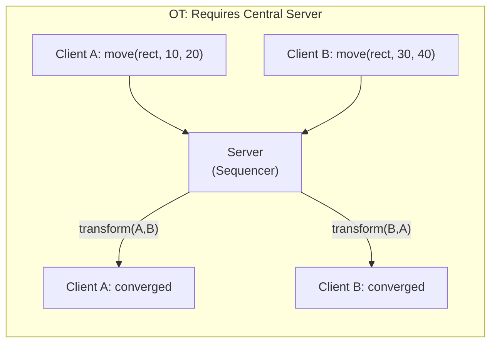
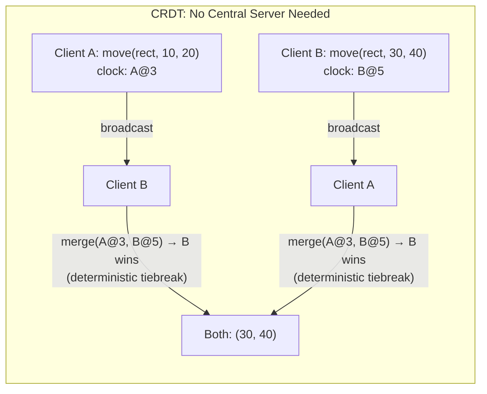

# 1. The Math of Multiplayer — CRDTs 🟢

> **The Problem:** Two users select the same rectangle and drag it to different positions at the same instant. With a naive last-write-wins strategy, one user's edit silently disappears — and which edit survives depends on network latency, not intention. We need a data structure where **every** operation is preserved and the final state is **deterministic**, regardless of delivery order.

---

## 1.1 Why Operational Transformation Is Legacy

For two decades, **Operational Transformation (OT)** was the consensus answer to real-time collaboration. Google Docs still runs on it. OT works by transforming each incoming operation against every concurrent operation to preserve user intent.

The critical problem: **OT requires a central sequencing server**. Every operation must pass through a single serialization point that assigns a total order. This creates three fatal limitations for a design canvas:

| Limitation | Impact on a Canvas Tool |
|---|---|
| Central sequencer is a single point of failure | Server crash → all clients freeze |
| Transformation functions grow combinatorially | Adding a new shape type (e.g., "curved arrow") requires N² new transform pairs |
| Offline editing is structurally impossible | Every op must round-trip through the server before local apply |

```
// 💥 THE OT TRAP: Quadratic complexity as shape operations grow

// With 6 shape operations (insert, delete, move, resize, rotate, restyle),
// OT needs transform(A, B) for every ordered pair:
//   6 × 6 = 36 transform functions — each with subtle edge cases.
//
// Add "group/ungroup" → 8 ops → 64 transform functions.
// Add "layer reorder" → 9 ops → 81 transform functions.
//
// Each new operation type is a QUADRATIC tax on the codebase.
```

### The CRDT Alternative

**Conflict-Free Replicated Data Types (CRDTs)** eliminate the central sequencer entirely. A CRDT is a data structure where:

1. Every replica can apply operations **locally** without coordination.
2. Operations are **commutative** — applying `op_A` then `op_B` produces the same state as `op_B` then `op_A`.
3. Replicas that have seen the **same set** of operations are guaranteed to be in the **same state** — regardless of delivery order.

No central server. No transformation functions. No quadratic tax.





---

## 1.2 The Document Model: A Map of CRDTs

A collaborative canvas document is not a flat list of shapes. It is a **nested map** where each shape is identified by a globally unique ID, and each property of that shape is an independent CRDT register.

### Shape Identity: Lamport-Stamped UUIDs

Every shape needs a globally unique identifier that also encodes **causal ordering**. We use a **Lamport timestamp** combined with a unique node ID:

```rust,editable
use std::cmp::Ordering;

/// A globally unique, causally ordered identifier.
/// Two nodes can independently generate IDs that will never collide
/// and can always be totally ordered for deterministic tiebreaking.
#[derive(Debug, Clone, Copy, PartialEq, Eq, Hash)]
struct LamportId {
    /// Monotonically increasing counter — incremented on every local operation
    /// AND bumped when we receive a remote op with a higher counter.
    counter: u64,
    /// Unique identifier for the node (e.g., hash of session token).
    /// Used to break ties when two nodes generate ops at the same counter.
    node_id: u64,
}

impl Ord for LamportId {
    fn cmp(&self, other: &Self) -> Ordering {
        self.counter
            .cmp(&other.counter)
            .then(self.node_id.cmp(&other.node_id))
    }
}

impl PartialOrd for LamportId {
    fn partial_cmp(&self, other: &Self) -> Option<Ordering> {
        Some(self.cmp(other))
    }
}
```

### Last-Writer-Wins Register (LWW-Register)

For each property of a shape (position, size, color, rotation), we store the value alongside the `LamportId` of the operation that set it. When two concurrent writes arrive, the one with the **higher** `LamportId` wins — deterministically, on every node, without coordination.

```rust,editable
/// A Last-Writer-Wins Register.
///
/// The LWW-Register is the atomic unit of conflict resolution on our canvas.
/// Each shape property (x, y, width, height, fill_color, ...) is its own
/// independent LWW-Register, so moving a shape and recoloring the same shape
/// concurrently will BOTH succeed — they are non-conflicting.
#[derive(Debug, Clone)]
struct LwwRegister<T: Clone> {
    value: T,
    timestamp: LamportId,
}

impl<T: Clone> LwwRegister<T> {
    fn new(value: T, timestamp: LamportId) -> Self {
        Self { value, timestamp }
    }

    /// Merge a remote write. If the remote timestamp is strictly greater,
    /// adopt the remote value. Otherwise, keep ours. This is:
    ///   - Commutative: merge(A,B) == merge(B,A)
    ///   - Idempotent:  merge(A,A) == A
    ///   - Associative: merge(merge(A,B),C) == merge(A,merge(B,C))
    fn merge(&mut self, remote_value: T, remote_ts: LamportId) {
        if remote_ts > self.timestamp {
            self.value = remote_value;
            self.timestamp = remote_ts;
        }
    }
}
```

### The Shape: A Struct of Registers

Each shape is not a monolithic blob — it is a **struct of independent LWW-Registers**. This is the critical design insight: concurrent edits to *different properties* of the same shape are *not conflicts*.

```rust,editable
# use std::cmp::Ordering;
# #[derive(Debug, Clone, Copy, PartialEq, Eq, Hash)]
# struct LamportId { counter: u64, node_id: u64 }
# impl Ord for LamportId {
#     fn cmp(&self, other: &Self) -> Ordering {
#         self.counter.cmp(&other.counter).then(self.node_id.cmp(&other.node_id))
#     }
# }
# impl PartialOrd for LamportId {
#     fn partial_cmp(&self, other: &Self) -> Option<Ordering> { Some(self.cmp(other)) }
# }
# #[derive(Debug, Clone)]
# struct LwwRegister<T: Clone> { value: T, timestamp: LamportId }
# impl<T: Clone> LwwRegister<T> {
#     fn new(value: T, timestamp: LamportId) -> Self { Self { value, timestamp } }
#     fn merge(&mut self, remote_value: T, remote_ts: LamportId) {
#         if remote_ts > self.timestamp { self.value = remote_value; self.timestamp = remote_ts; }
#     }
# }
#[derive(Debug, Clone, Copy)]
struct Point { x: f64, y: f64 }

#[derive(Debug, Clone, Copy)]
struct Size { width: f64, height: f64 }

#[derive(Debug, Clone)]
struct Color(String);

/// A single shape on the canvas. Each visual property is an independent
/// LWW-Register — so User A dragging the shape while User B changes its
/// color will BOTH succeed without conflict.
#[derive(Debug, Clone)]
struct CanvasShape {
    id: LamportId,
    position: LwwRegister<Point>,
    size: LwwRegister<Size>,
    fill_color: LwwRegister<Color>,
    rotation_deg: LwwRegister<f64>,
    z_index: LwwRegister<i64>,
    deleted: LwwRegister<bool>,  // Tombstone — enables "soft delete"
}
```

> **Why not just overwrite the entire shape?**
>
> ```
> // 💥 OVERWRITE HAZARD: Replacing the full shape JSON blob
> // User A moves the rectangle → sends { x: 100, y: 200, color: "red" }
> // User B recolors it        → sends { x: 50,  y: 50,  color: "blue" }
> // Last-write-wins on the WHOLE object → User A's move is LOST.
> ```
>
> Per-property registers eliminate this class of bug entirely.

---

## 1.3 The Add-Remove Set: Handling Shape Creation and Deletion

Users create and delete shapes concurrently. The classic set CRDT (G-Set, 2P-Set) has a fatal flaw for us: in a 2P-Set, a deleted element can **never be re-added**. We need an **Observed-Remove Set (OR-Set)** where:

- Adding a shape is tagged with a unique `LamportId`.
- Removing a shape only removes the *specific add-tags* that the remover has observed.
- If a concurrent add arrives with a tag the remover hasn't seen, the shape **reappears** — preserving the add-wins semantic.

```rust,editable
use std::collections::{HashMap, HashSet};
# use std::cmp::Ordering;
# #[derive(Debug, Clone, Copy, PartialEq, Eq, Hash)]
# struct LamportId { counter: u64, node_id: u64 }
# impl Ord for LamportId {
#     fn cmp(&self, other: &Self) -> Ordering {
#         self.counter.cmp(&other.counter).then(self.node_id.cmp(&other.node_id))
#     }
# }
# impl PartialOrd for LamportId {
#     fn partial_cmp(&self, other: &Self) -> Option<Ordering> { Some(self.cmp(other)) }
# }

/// Observed-Remove Set for tracking which shapes exist on the canvas.
///
/// Semantics: "add wins over concurrent remove."
/// If User A deletes a shape while User B (who hasn't seen the delete)
/// simultaneously moves it, the shape will REAPPEAR after merge —
/// because User B's implicit "add" (via the move) was concurrent with
/// the delete, and add-wins is the correct UX for a design tool.
#[derive(Debug, Clone)]
struct OrSet<V: Clone + Eq + std::hash::Hash> {
    /// Maps each value to the set of add-tags (LamportIds) that justify
    /// its existence. A value is "present" iff its tag set is non-empty.
    entries: HashMap<V, HashSet<LamportId>>,
}

impl<V: Clone + Eq + std::hash::Hash> OrSet<V> {
    fn new() -> Self {
        Self { entries: HashMap::new() }
    }

    fn add(&mut self, value: V, tag: LamportId) {
        self.entries.entry(value).or_default().insert(tag);
    }

    /// Remove only the tags we have OBSERVED. If a concurrent add
    /// introduced a tag we haven't seen, it survives the remove.
    fn remove(&mut self, value: &V, observed_tags: &HashSet<LamportId>) {
        if let Some(tags) = self.entries.get_mut(value) {
            for tag in observed_tags {
                tags.remove(tag);
            }
            if tags.is_empty() {
                self.entries.remove(value);
            }
        }
    }

    fn contains(&self, value: &V) -> bool {
        self.entries.get(value).is_some_and(|tags| !tags.is_empty())
    }

    /// Merge two OR-Sets: union of all tags per value.
    fn merge(&mut self, other: &OrSet<V>) {
        for (value, remote_tags) in &other.entries {
            let local_tags = self.entries.entry(value.clone()).or_default();
            for tag in remote_tags {
                local_tags.insert(*tag);
            }
        }
    }
}
```

---

## 1.4 The Complete Document CRDT

Combining the OR-Set (for shape existence) with a map of per-shape LWW-Register structs gives us the full document model:

```rust,editable
# use std::collections::{HashMap, HashSet};
# use std::cmp::Ordering;
# #[derive(Debug, Clone, Copy, PartialEq, Eq, Hash)]
# struct LamportId { counter: u64, node_id: u64 }
# impl Ord for LamportId {
#     fn cmp(&self, other: &Self) -> Ordering {
#         self.counter.cmp(&other.counter).then(self.node_id.cmp(&other.node_id))
#     }
# }
# impl PartialOrd for LamportId {
#     fn partial_cmp(&self, other: &Self) -> Option<Ordering> { Some(self.cmp(other)) }
# }
# #[derive(Debug, Clone)]
# struct LwwRegister<T: Clone> { value: T, timestamp: LamportId }
# impl<T: Clone> LwwRegister<T> {
#     fn new(value: T, timestamp: LamportId) -> Self { Self { value, timestamp } }
#     fn merge(&mut self, remote_value: T, remote_ts: LamportId) {
#         if remote_ts > self.timestamp { self.value = remote_value; self.timestamp = remote_ts; }
#     }
# }
# #[derive(Debug, Clone, Copy)] struct Point { x: f64, y: f64 }
# #[derive(Debug, Clone, Copy)] struct Size { width: f64, height: f64 }
# #[derive(Debug, Clone)] struct Color(String);
# #[derive(Debug, Clone)]
# struct CanvasShape {
#     id: LamportId, position: LwwRegister<Point>, size: LwwRegister<Size>,
#     fill_color: LwwRegister<Color>, rotation_deg: LwwRegister<f64>,
#     z_index: LwwRegister<i64>, deleted: LwwRegister<bool>,
# }

/// The operation type that is serialized, sent over the wire, stored in the
/// op log, and merged on every replica. This is the "unit of change."
#[derive(Debug, Clone)]
enum CanvasOp {
    /// Create a new shape with initial properties.
    AddShape {
        shape_id: LamportId,
        position: Point,
        size: Size,
        fill_color: Color,
    },
    /// Soft-delete a shape (tombstone).
    DeleteShape { shape_id: LamportId },
    /// Update a single property of an existing shape.
    UpdatePosition { shape_id: LamportId, position: Point },
    UpdateSize { shape_id: LamportId, size: Size },
    UpdateFillColor { shape_id: LamportId, color: Color },
    UpdateRotation { shape_id: LamportId, degrees: f64 },
    UpdateZIndex { shape_id: LamportId, z_index: i64 },
}

/// The full document state. Every client and server holds one of these.
struct CanvasDocument {
    /// Our node's unique ID (set once at session start).
    node_id: u64,
    /// Lamport counter — incremented on every local op, bumped on every remote op.
    clock: u64,
    /// All shapes, keyed by their creation LamportId.
    shapes: HashMap<LamportId, CanvasShape>,
}

impl CanvasDocument {
    fn next_timestamp(&mut self) -> LamportId {
        self.clock += 1;
        LamportId { counter: self.clock, node_id: self.node_id }
    }

    /// Bump our clock to stay ahead of any remote timestamp we receive.
    fn observe_remote(&mut self, remote_ts: LamportId) {
        if remote_ts.counter >= self.clock {
            self.clock = remote_ts.counter + 1;
        }
    }

    /// Apply an operation to the local state. This is called:
    ///   1. Immediately when the LOCAL user performs an action (optimistic apply).
    ///   2. When a REMOTE operation arrives over the WebSocket.
    ///
    /// Because every operation is commutative and idempotent, calling
    /// apply(op) in any order always converges to the same state.
    fn apply(&mut self, op: &CanvasOp, op_ts: LamportId) {
        self.observe_remote(op_ts);

        match op {
            CanvasOp::AddShape { shape_id, position, size, fill_color } => {
                self.shapes.entry(*shape_id).or_insert_with(|| CanvasShape {
                    id: *shape_id,
                    position: LwwRegister::new(*position, op_ts),
                    size: LwwRegister::new(*size, op_ts),
                    fill_color: LwwRegister::new(fill_color.clone(), op_ts),
                    rotation_deg: LwwRegister::new(0.0, op_ts),
                    z_index: LwwRegister::new(0, op_ts),
                    deleted: LwwRegister::new(false, op_ts),
                });
            }
            CanvasOp::DeleteShape { shape_id } => {
                if let Some(shape) = self.shapes.get_mut(shape_id) {
                    shape.deleted.merge(true, op_ts);
                }
            }
            CanvasOp::UpdatePosition { shape_id, position } => {
                if let Some(shape) = self.shapes.get_mut(shape_id) {
                    shape.position.merge(*position, op_ts);
                }
            }
            CanvasOp::UpdateSize { shape_id, size } => {
                if let Some(shape) = self.shapes.get_mut(shape_id) {
                    shape.size.merge(*size, op_ts);
                }
            }
            CanvasOp::UpdateFillColor { shape_id, color } => {
                if let Some(shape) = self.shapes.get_mut(shape_id) {
                    shape.fill_color.merge(color.clone(), op_ts);
                }
            }
            CanvasOp::UpdateRotation { shape_id, degrees } => {
                if let Some(shape) = self.shapes.get_mut(shape_id) {
                    shape.rotation_deg.merge(*degrees, op_ts);
                }
            }
            CanvasOp::UpdateZIndex { shape_id, z_index } => {
                if let Some(shape) = self.shapes.get_mut(shape_id) {
                    shape.z_index.merge(*z_index, op_ts);
                }
            }
        }
    }

    /// Return all non-deleted shapes, sorted by z-index for rendering.
    fn visible_shapes(&self) -> Vec<&CanvasShape> {
        let mut shapes: Vec<_> = self.shapes.values()
            .filter(|s| !s.deleted.value)
            .collect();
        shapes.sort_by_key(|s| s.z_index.value);
        shapes
    }
}
```

---

## 1.5 Convergence Proof by Example

Let's trace through the scenario from our opening problem statement to prove convergence:

| Time | Client A (node 1) | Client B (node 2) | Network |
|---|---|---|---|
| t₀ | Both see rect `R` at position (50, 50) | Both see rect `R` at position (50, 50) | — |
| t₁ | Drags `R` to (100, 200). Generates `UpdatePosition { R, (100,200) }` with ts `A@4` | Drags `R` to (300, 400). Generates `UpdatePosition { R, (300,400) }` with ts `B@3` | Both ops in flight |
| t₂ | Receives `B@3`. Merges: `A@4 > B@3` → keeps (100, 200) ✅ | Receives `A@4`. Merges: `A@4 > B@3` → adopts (100, 200) ✅ | — |

Both clients converge to **(100, 200)** — the operation with the higher Lamport timestamp wins. No data is silently lost; the "losing" operation was a concurrent move to a different position, and the deterministic tiebreaker picks the same winner on every replica.

> **What if the counters are equal?** The `node_id` field breaks ties. `LamportId { counter: 4, node_id: 7 }` always beats `LamportId { counter: 4, node_id: 3 }`. The tiebreaker is arbitrary but **consistent** — that's all that matters.

---

## 1.6 Naive vs. Production: A Side-by-Side

| Aspect | Naive (Last-Write-Wins JSON Blob) | Production (Per-Property CRDT) |
|---|---|---|
| Conflict unit | Entire shape object | Individual property |
| Concurrent move + recolor | One edit lost | Both preserved ✅ |
| Offline support | Impossible (needs server round-trip) | Native ✅ |
| Network overhead | Full shape JSON per change (~2KB) | Single field delta (~64 bytes) ✅ |
| New shape type complexity | O(1) but full-object conflicts | O(1) and no conflicts ✅ |
| Ordering guarantee | None (race condition) | Lamport clock total order ✅ |
| Server role | Central serializer (SPOF) | Optional relay (stateless ok) ✅ |

```
// 💥 NAIVE: Full-object last-write-wins
fn handle_remote_update(doc: &mut HashMap<String, ShapeJson>, msg: ShapeJson) {
    // Overwrites the ENTIRE shape — any concurrent
    // property change by another user is obliterated.
    doc.insert(msg.id.clone(), msg);
}
```

```rust,editable
// ✅ PRODUCTION: Per-property CRDT merge
# use std::cmp::Ordering;
# #[derive(Debug, Clone, Copy, PartialEq, Eq, Hash)]
# struct LamportId { counter: u64, node_id: u64 }
# impl Ord for LamportId {
#     fn cmp(&self, other: &Self) -> Ordering {
#         self.counter.cmp(&other.counter).then(self.node_id.cmp(&other.node_id))
#     }
# }
# impl PartialOrd for LamportId {
#     fn partial_cmp(&self, other: &Self) -> Option<Ordering> { Some(self.cmp(other)) }
# }
# #[derive(Debug, Clone)]
# struct LwwRegister<T: Clone> { value: T, timestamp: LamportId }
# impl<T: Clone> LwwRegister<T> {
#     fn merge(&mut self, remote_value: T, remote_ts: LamportId) {
#         if remote_ts > self.timestamp { self.value = remote_value; self.timestamp = remote_ts; }
#     }
# }
# #[derive(Debug, Clone, Copy)] struct Point { x: f64, y: f64 }
# struct CanvasShape { position: LwwRegister<Point> }

fn handle_remote_position_update(
    shape: &mut CanvasShape,
    new_pos: Point,
    remote_ts: LamportId,
) {
    // Only the `position` register is touched.
    // Concurrent changes to `fill_color`, `rotation`, etc. are
    // completely unaffected — zero data loss.
    shape.position.merge(new_pos, remote_ts);
}
```

---

## 1.7 Vector Clocks: Detecting Causal Gaps

A single Lamport counter tells us *which* operation wins, but not *whether* we've missed any operations. For that, we need a **vector clock** — a map from `node_id` to the latest counter we've seen from that node.

```rust,editable
use std::collections::HashMap;

/// A vector clock tracking the latest operation counter seen
/// from each node. Used to detect causal gaps: if we receive
/// an op from Node 5 with counter=10 but our vector clock says
/// we last saw counter=7 from Node 5, we know we've missed ops 8 and 9.
#[derive(Debug, Clone, Default)]
struct VectorClock {
    entries: HashMap<u64, u64>,
}

impl VectorClock {
    /// Record that we've processed an operation from `node_id` at `counter`.
    fn advance(&mut self, node_id: u64, counter: u64) {
        let entry = self.entries.entry(node_id).or_insert(0);
        if counter > *entry {
            *entry = counter;
        }
    }

    /// Returns true if `self` has seen every operation that `other` has seen.
    /// Used during snapshot validation and anti-entropy sync.
    fn dominates(&self, other: &VectorClock) -> bool {
        other.entries.iter().all(|(node, &counter)| {
            self.entries.get(node).copied().unwrap_or(0) >= counter
        })
    }

    /// Returns the set of (node_id, from_counter, to_counter) gaps
    /// between `self` (what we have) and `other` (what they have).
    fn gaps_from(&self, other: &VectorClock) -> Vec<(u64, u64, u64)> {
        let mut gaps = Vec::new();
        for (&node, &their_counter) in &other.entries {
            let our_counter = self.entries.get(&node).copied().unwrap_or(0);
            if their_counter > our_counter {
                gaps.push((node, our_counter + 1, their_counter));
            }
        }
        gaps
    }
}
```

This vector clock is the backbone of our **anti-entropy protocol** in Chapter 2 — when a client reconnects after being offline, it sends its vector clock, and the server computes exactly which operations to replay.

---

## 1.8 The Wire Format: Serializing Operations

Every operation needs to cross the WebSocket as a compact binary message. We encode operations using a tagged enum:

```rust,editable
/// The binary wire format for a single CRDT operation.
/// Header: [op_type: u8][shape_id: 16 bytes][lamport_counter: u64][node_id: u64]
/// Payload: varies by op_type.
///
/// Total size for a position update: 1 + 16 + 8 + 8 + 16 = 49 bytes.
/// Compare with JSON: ~200–500 bytes for the same information.
#[repr(u8)]
enum OpType {
    AddShape = 1,
    DeleteShape = 2,
    UpdatePosition = 3,
    UpdateSize = 4,
    UpdateFillColor = 5,
    UpdateRotation = 6,
    UpdateZIndex = 7,
}

/// Efficient binary serialization.
/// Production systems use `rkyv` or `bincode` — this manual layout
/// shows what's happening at the byte level.
fn encode_position_update(
    shape_id: [u8; 16],
    counter: u64,
    node_id: u64,
    x: f64,
    y: f64,
) -> Vec<u8> {
    let mut buf = Vec::with_capacity(49);
    buf.push(OpType::UpdatePosition as u8);     // 1 byte
    buf.extend_from_slice(&shape_id);            // 16 bytes
    buf.extend_from_slice(&counter.to_le_bytes());// 8 bytes
    buf.extend_from_slice(&node_id.to_le_bytes());// 8 bytes
    buf.extend_from_slice(&x.to_le_bytes());     // 8 bytes
    buf.extend_from_slice(&y.to_le_bytes());     // 8 bytes
    buf                                          // Total: 49 bytes
}
```

---

> **Key Takeaways**
>
> 1. **OT scales quadratically** with operation types. CRDTs scale linearly — adding a new shape property means adding one more `LwwRegister`, not N² transform functions.
> 2. **Per-property registers** are the critical insight. The conflict granularity is a single CSS-like property (`x`, `y`, `fill_color`), not the entire shape object. Concurrent non-overlapping edits *never* conflict.
> 3. **Lamport timestamps** provide a deterministic total order for tiebreaking. The "winner" of a concurrent edit is the same on every replica, every time, without communication.
> 4. **Vector clocks** detect causal gaps so we can implement anti-entropy and offline sync without replaying the entire document history.
> 5. **Binary wire format** reduces bandwidth by 4–10× compared to JSON, which matters when 200 users are streaming drag operations at 60Hz.
> 6. **The server is optional for correctness** — it is a performance optimization (relay + persistence), not a coordination bottleneck. If the server dies, clients can sync peer-to-peer and still converge.
