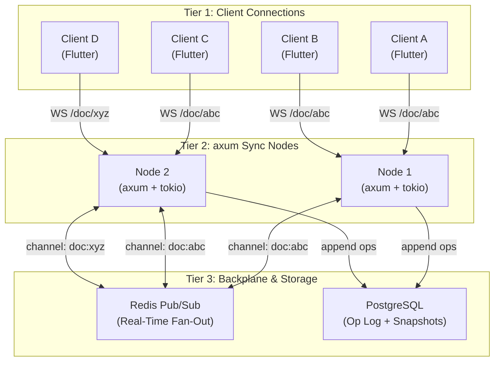
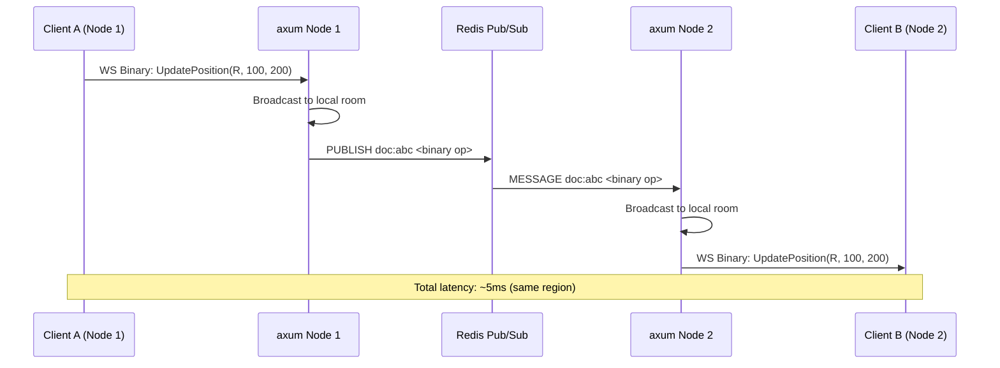
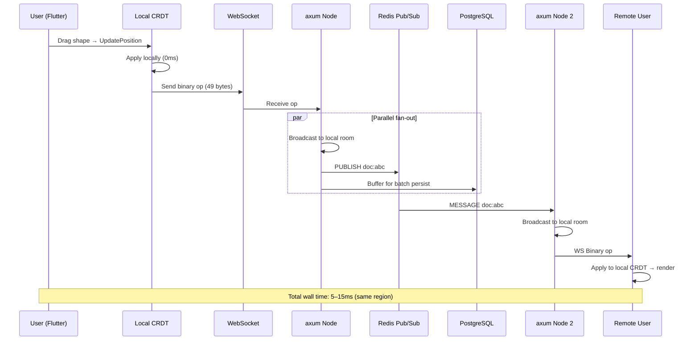

# 2. The Rust Sync Engine & WebSockets 🟡

> **The Problem:** A single `axum` server can hold 50,000 WebSocket connections — but we need to support 100,000+ concurrent documents across multiple server nodes. When User A on Node 1 moves a shape, User B on Node 2 (same document) must see the update in under 50ms. Broadcasting via a shared database poll is too slow; we need a **real-time fan-out backplane** that pushes deltas to every node hosting active clients for that document.

---

## 2.1 Architecture: The Three-Tier Sync Stack



### The Three Tiers Explained

| Tier | Component | Responsibility | Statefulness |
|---|---|---|---|
| 1 | Flutter clients | Local CRDT apply, rendering, op batching | Full document state |
| 2 | `axum` sync nodes | WebSocket termination, room routing, op relay | In-memory room subscriptions (ephemeral) |
| 3 | Redis + PostgreSQL | Cross-node broadcast, durable op log | Persistent |

The critical design choice: **sync nodes are stateless relays**. They don't hold the authoritative document state — every client does. The server's job is to (a) relay operations between clients, (b) persist operations to the op log, and (c) fan out cross-node traffic via Redis. If a sync node crashes, clients reconnect to any other node and resume via the anti-entropy protocol from Chapter 1.

---

## 2.2 The axum WebSocket Server

### Project Dependencies

```toml
# Cargo.toml (sync-engine crate)
[dependencies]
axum = { version = "0.8", features = ["ws"] }
tokio = { version = "1", features = ["full"] }
serde = { version = "1", features = ["derive"] }
serde_json = "1"
redis = { version = "0.27", features = ["tokio-comp", "connection-manager"] }
dashmap = "6"
uuid = { version = "1", features = ["v4"] }
tracing = "0.1"
tracing-subscriber = "0.3"
bytes = "1"
```

### The Server Skeleton

```rust,editable
use axum::{
    Router,
    extract::{
        Path, State, WebSocketUpgrade,
        ws::{Message, WebSocket},
    },
    response::IntoResponse,
    routing::get,
};
use dashmap::DashMap;
use std::sync::Arc;
use tokio::sync::broadcast;

/// Shared application state, accessible from every handler.
/// `DashMap` gives us concurrent, sharded access to rooms without
/// a global `Mutex` — critical for preventing contention when
/// thousands of documents are active simultaneously.
#[derive(Clone)]
struct AppState {
    /// Map from document_id → broadcast channel for that room.
    /// Each room has its own independent broadcast channel.
    rooms: Arc<DashMap<String, broadcast::Sender<Vec<u8>>>>,
}

impl AppState {
    fn new() -> Self {
        Self {
            rooms: Arc::new(DashMap::new()),
        }
    }

    /// Get or create a broadcast channel for a document room.
    /// The channel capacity (1024) determines how many operations
    /// can queue before slow readers start dropping messages —
    /// those readers will use anti-entropy to catch up.
    fn get_room(&self, doc_id: &str) -> broadcast::Sender<Vec<u8>> {
        self.rooms
            .entry(doc_id.to_string())
            .or_insert_with(|| broadcast::channel(1024).0)
            .clone()
    }
}

#[tokio::main]
async fn main() {
    tracing_subscriber::init();

    let state = AppState::new();

    let app = Router::new()
        .route("/ws/{doc_id}", get(ws_handler))
        .with_state(state);

    let listener = tokio::net::TcpListener::bind("0.0.0.0:8080")
        .await
        .expect("failed to bind");

    tracing::info!("Sync engine listening on :8080");
    axum::serve(listener, app).await.expect("server error");
}
```

### The WebSocket Handler

```rust,editable
# use axum::{
#     extract::{Path, State, WebSocketUpgrade, ws::{Message, WebSocket}},
#     response::IntoResponse,
# };
# use dashmap::DashMap;
# use std::sync::Arc;
# use tokio::sync::broadcast;
# #[derive(Clone)]
# struct AppState { rooms: Arc<DashMap<String, broadcast::Sender<Vec<u8>>>> }
# impl AppState {
#     fn get_room(&self, doc_id: &str) -> broadcast::Sender<Vec<u8>> {
#         self.rooms.entry(doc_id.to_string()).or_insert_with(|| broadcast::channel(1024).0).clone()
#     }
# }

/// HTTP GET → WebSocket upgrade.
/// The document ID is extracted from the URL path.
async fn ws_handler(
    ws: WebSocketUpgrade,
    Path(doc_id): Path<String>,
    State(state): State<AppState>,
) -> impl IntoResponse {
    ws.on_upgrade(move |socket| handle_socket(socket, doc_id, state))
}

/// Main loop for a single WebSocket connection.
///
/// Architecture: split the socket into a read half and a write half,
/// then run two concurrent tasks:
///   1. READ TASK:  client → server → broadcast to room (and Redis)
///   2. WRITE TASK: room broadcast (and Redis) → server → client
///
/// When either task exits (client disconnect, error), both are cancelled.
async fn handle_socket(socket: WebSocket, doc_id: String, state: AppState) {
    let (mut ws_sender, mut ws_receiver) = socket.split();
    let tx = state.get_room(&doc_id);
    let mut rx = tx.subscribe();

    // WRITE TASK: forward room broadcasts to this specific client
    let mut write_task = tokio::spawn(async move {
        while let Ok(msg) = rx.recv().await {
            if ws_sender
                .send(Message::Binary(msg.into()))
                .await
                .is_err()
            {
                break; // Client disconnected
            }
        }
    });

    // READ TASK: forward client messages to the room broadcast
    let mut read_task = tokio::spawn(async move {
        while let Some(Ok(msg)) = ws_receiver.next().await {
            match msg {
                Message::Binary(data) => {
                    // Broadcast to all other clients in the same room.
                    // The broadcast channel handles fan-out — we don't
                    // iterate over clients manually.
                    let _ = tx.send(data.to_vec());
                }
                Message::Close(_) => break,
                _ => {} // Ignore ping/pong/text
            }
        }
    });

    // If either task finishes, abort the other.
    tokio::select! {
        _ = &mut write_task => read_task.abort(),
        _ = &mut read_task => write_task.abort(),
    }

    tracing::info!(doc_id, "Client disconnected");
}
```

> **Why `broadcast` and not `mpsc`?** A `broadcast` channel allows multiple senders and multiple receivers. Every subscriber gets every message. This is exactly the pub/sub semantic we need: when any client sends an operation, every other client in that room receives it. An `mpsc` channel has a single consumer — we'd need one channel per reader, which defeats the purpose.

---

## 2.3 The Naive vs. Production Approach

```
// 💥 NAIVE: Send the entire document on every edit
async fn handle_edit(doc: &Document) {
    let full_json = serde_json::to_string(doc).unwrap(); // 500KB
    for client in room.clients.iter() {
        client.send(full_json.clone()).await; // 500KB × 200 clients = 100MB/s
    }
}
// At 200 users × 30 edits/sec = 6,000 broadcasts/sec × 500KB = 3 GB/s 🔥
```

```rust,editable
// ✅ PRODUCTION: Send only the CRDT operation delta
fn encode_delta(op: &CanvasOp, ts: &LamportId) -> Vec<u8> {
    // A position update is 49 bytes (see Ch 1, §1.8).
    // 200 users × 30 edits/sec × 49 bytes = 294 KB/s — 10,000× less.
    bincode::serialize(&(op, ts)).expect("serialization failed")
}
# struct CanvasOp;
# struct LamportId;
```

| Metric | Naive (Full Document) | Production (Deltas) |
|---|---|---|
| Bytes per edit broadcast | ~500 KB | ~49 bytes |
| Bandwidth at 200 users × 30 edits/s | 3 GB/s | 294 KB/s |
| Serialization cost | O(n) shapes | O(1) constant |
| CPU per broadcast | Parse & clone full doc | Zero-copy relay |

---

## 2.4 Redis Pub/Sub: The Cross-Node Backplane

When multiple `axum` nodes serve the same document, operations from clients on Node 1 must reach clients on Node 2. We use **Redis Pub/Sub** as a lightweight, zero-storage fan-out layer.



### Redis Integration

```rust,editable
use std::sync::Arc;
use tokio::sync::broadcast;

/// Subscribe to a Redis Pub/Sub channel for a document and forward
/// messages into the local in-memory broadcast channel.
///
/// This task runs for the lifetime of the room — when the last client
/// disconnects, we clean up the room and this task exits.
async fn redis_subscriber(
    mut redis_sub: redis::aio::PubSub,
    doc_id: String,
    local_tx: broadcast::Sender<Vec<u8>>,
) {
    redis_sub
        .subscribe(&format!("doc:{doc_id}"))
        .await
        .expect("redis subscribe failed");

    let mut stream = redis_sub.on_message();
    while let Some(msg) = stream.next().await {
        let payload: Vec<u8> = msg.get_payload_bytes().to_vec();
        // Fan out to all local WebSocket connections for this document.
        let _ = local_tx.send(payload);
    }
}

/// Publish an operation to the Redis backplane so other nodes receive it.
async fn redis_publish(
    redis: &redis::aio::ConnectionManager,
    doc_id: &str,
    op_bytes: &[u8],
) {
    let _: () = redis::cmd("PUBLISH")
        .arg(format!("doc:{doc_id}"))
        .arg(op_bytes)
        .query_async(&mut redis.clone())
        .await
        .expect("redis publish failed");
}
```

### Why Redis Pub/Sub (Not Kafka, Not NATS)?

| Backplane | Latency | Persistence | Complexity | Our Choice |
|---|---|---|---|---|
| Redis Pub/Sub | ~1ms | None (fire & forget) | Minimal | ✅ Perfect for ephemeral relay |
| Redis Streams | ~1ms | Durable, consumer groups | Medium | Overkill — we persist to Postgres |
| Kafka | ~5–50ms | Durable, exactly-once | High | Too slow for real-time canvas |
| NATS JetStream | ~2ms | Durable, at-least-once | Medium | Viable alternative |

Redis Pub/Sub has **zero persistence** by design. That's a feature, not a bug — we already persist operations to PostgreSQL (§2.5). The backplane's only job is to forward ops between nodes in real time. If a Redis message is lost (node crash, network blip), the client's anti-entropy protocol (vector clock comparison from Ch 1, §1.7) fills the gap on reconnect.

---

## 2.5 Durable Operation Log: PostgreSQL

Every operation must be durably persisted. We use an **append-only** table in PostgreSQL:

```sql
CREATE TABLE IF NOT EXISTS op_log (
    -- Composite primary key: the Lamport timestamp IS the identity.
    node_id     BIGINT  NOT NULL,
    counter     BIGINT  NOT NULL,
    doc_id      TEXT    NOT NULL,
    op_type     SMALLINT NOT NULL,
    payload     BYTEA   NOT NULL,
    created_at  TIMESTAMPTZ NOT NULL DEFAULT now(),
    PRIMARY KEY (node_id, counter)
);

-- Index for fetching all ops for a document (used during anti-entropy
-- and snapshot compaction).
CREATE INDEX IF NOT EXISTS idx_op_log_doc_id
    ON op_log (doc_id, counter);

-- Index for fetching ops newer than a given counter from a specific node
-- (used during client reconnection / anti-entropy sync).
CREATE INDEX IF NOT EXISTS idx_op_log_anti_entropy
    ON op_log (doc_id, node_id, counter);
```

### Append-Only Write Path

```rust,editable
/// Persist a batch of operations to PostgreSQL.
///
/// Operations are batched (typically 50–100ms worth) to amortize
/// the disk fsync cost. This is safe because:
///   1. The in-memory broadcast has already delivered the ops to clients.
///   2. If the server crashes before the batch commits, clients still
///      have the ops in their local CRDT state, and anti-entropy will
///      re-deliver them on reconnect.
async fn persist_ops_batch(
    pool: &sqlx::PgPool,
    doc_id: &str,
    ops: &[(u64, u64, u8, Vec<u8>)], // (node_id, counter, op_type, payload)
) -> Result<(), sqlx::Error> {
    let mut tx = pool.begin().await?;
    for (node_id, counter, op_type, payload) in ops {
        sqlx::query(
            "INSERT INTO op_log (node_id, counter, doc_id, op_type, payload)
             VALUES ($1, $2, $3, $4, $5)
             ON CONFLICT (node_id, counter) DO NOTHING"
        )
        .bind(*node_id as i64)
        .bind(*counter as i64)
        .bind(doc_id)
        .bind(*op_type as i16)
        .bind(payload)
        .execute(&mut *tx)
        .await?;
    }
    tx.commit().await?;
    Ok(())
}
```

### Anti-Entropy: Filling Causal Gaps

When a client reconnects (after a network drop, tab sleep, or offline editing), it sends its vector clock. The server computes the delta:

```rust,editable
/// Fetch operations that the client has NOT yet seen.
///
/// The client sends its vector clock: { node_3: 42, node_7: 100, ... }
/// We query for all ops from each node where counter > client's counter.
async fn fetch_missing_ops(
    pool: &sqlx::PgPool,
    doc_id: &str,
    client_clock: &[(u64, u64)], // Vec<(node_id, last_seen_counter)>
) -> Result<Vec<(u64, u64, u8, Vec<u8>)>, sqlx::Error> {
    let mut missing = Vec::new();

    for &(node_id, last_seen) in client_clock {
        let rows = sqlx::query_as::<_, (i64, i64, i16, Vec<u8>)>(
            "SELECT node_id, counter, op_type, payload
             FROM op_log
             WHERE doc_id = $1 AND node_id = $2 AND counter > $3
             ORDER BY counter ASC"
        )
        .bind(doc_id)
        .bind(node_id as i64)
        .bind(last_seen as i64)
        .fetch_all(pool)
        .await?;

        for (nid, ctr, op, payload) in rows {
            missing.push((nid as u64, ctr as u64, op as u8, payload));
        }
    }

    // Also fetch ops from nodes the client has NEVER seen.
    let known_nodes: Vec<i64> = client_clock.iter().map(|(n, _)| *n as i64).collect();
    let new_node_ops = sqlx::query_as::<_, (i64, i64, i16, Vec<u8>)>(
        "SELECT node_id, counter, op_type, payload
         FROM op_log
         WHERE doc_id = $1 AND node_id != ALL($2)
         ORDER BY counter ASC"
    )
    .bind(doc_id)
    .bind(&known_nodes)
    .fetch_all(pool)
    .await?;

    for (nid, ctr, op, payload) in new_node_ops {
        missing.push((nid as u64, ctr as u64, op as u8, payload));
    }

    Ok(missing)
}
```

---

## 2.6 Room Lifecycle Management

Rooms consume memory (broadcast channel + Redis subscription). We need to clean them up when the last client disconnects:

```rust,editable
use std::sync::Arc;
use std::sync::atomic::{AtomicUsize, Ordering};
use dashmap::DashMap;
use tokio::sync::broadcast;

struct Room {
    tx: broadcast::Sender<Vec<u8>>,
    client_count: AtomicUsize,
}

struct RoomManager {
    rooms: DashMap<String, Arc<Room>>,
}

impl RoomManager {
    fn new() -> Self {
        Self { rooms: DashMap::new() }
    }

    /// Join a room — returns the broadcast sender and a guard that
    /// decrements the client count on drop.
    fn join(&self, doc_id: &str) -> (broadcast::Sender<Vec<u8>>, RoomGuard) {
        let room = self.rooms
            .entry(doc_id.to_string())
            .or_insert_with(|| {
                let (tx, _rx) = broadcast::channel(1024);
                Arc::new(Room {
                    tx,
                    client_count: AtomicUsize::new(0),
                })
            })
            .clone();

        room.client_count.fetch_add(1, Ordering::Relaxed);
        let tx = room.tx.clone();
        let guard = RoomGuard {
            doc_id: doc_id.to_string(),
            rooms: self.rooms.clone(),
            room,
        };
        (tx, guard)
    }
}

/// RAII guard that automatically cleans up empty rooms.
struct RoomGuard {
    doc_id: String,
    rooms: DashMap<String, Arc<Room>>,
    room: Arc<Room>,
}

impl Drop for RoomGuard {
    fn drop(&mut self) {
        let prev = self.room.client_count.fetch_sub(1, Ordering::Relaxed);
        if prev == 1 {
            // Last client left — remove the room entirely.
            // This drops the broadcast channel and frees memory.
            self.rooms.remove(&self.doc_id);
            tracing::info!(doc_id = %self.doc_id, "Room cleaned up (0 clients)");
        }
    }
}
```

---

## 2.7 Graceful Shutdown Under Rolling Deploys

During a Kubernetes rolling update, we need to:
1. **Stop accepting new connections** (readiness probe → unhealthy).
2. **Drain existing connections** — send a `GoAway` frame, wait for clients to reconnect to a healthy node.
3. **Flush pending op batches** to PostgreSQL.
4. **Unsubscribe from Redis** channels.

```rust,editable
use tokio::signal;
use tokio::sync::watch;

/// A shutdown coordinator using a `watch` channel.
/// Every task in the system holds a `rx` clone and polls it.
fn shutdown_signal() -> (watch::Sender<bool>, watch::Receiver<bool>) {
    let (tx, rx) = watch::channel(false);
    tokio::spawn(async move {
        signal::ctrl_c().await.expect("failed to listen for SIGINT");
        tracing::info!("Shutdown signal received — draining connections");
        let _ = tx.send(true);
    });
    (tx, rx)
}

/// Modified main loop that respects shutdown.
async fn handle_socket_with_shutdown(
    socket: axum::extract::ws::WebSocket,
    doc_id: String,
    room_tx: tokio::sync::broadcast::Sender<Vec<u8>>,
    mut shutdown_rx: watch::Receiver<bool>,
) {
    let (mut ws_sender, mut ws_receiver) = socket.split();
    let mut room_rx = room_tx.subscribe();

    loop {
        tokio::select! {
            // Priority: shutdown signal
            _ = shutdown_rx.changed() => {
                if *shutdown_rx.borrow() {
                    // Send a close frame so the client knows to reconnect.
                    let _ = ws_sender.send(
                        axum::extract::ws::Message::Close(None)
                    ).await;
                    break;
                }
            }
            // Room broadcast → client
            msg = room_rx.recv() => {
                match msg {
                    Ok(data) => {
                        if ws_sender.send(
                            axum::extract::ws::Message::Binary(data.into())
                        ).await.is_err() {
                            break;
                        }
                    }
                    Err(_) => break,
                }
            }
            // Client → room broadcast
            msg = ws_receiver.next() => {
                match msg {
                    Some(Ok(axum::extract::ws::Message::Binary(data))) => {
                        let _ = room_tx.send(data.to_vec());
                    }
                    _ => break,
                }
            }
        }
    }
}
```

---

## 2.8 Connection and Bandwidth Metrics

### Capacity Planning

| Resource | Per Node (c5.xlarge, 4 vCPU) | Formula |
|---|---|---|
| Max WebSocket connections | ~50,000 | Limited by file descriptors + memory |
| Memory per connection | ~8 KB (tokio task + buffers) | 50K × 8KB = 400 MB |
| Memory per active room | ~16 KB (broadcast channel) | 10K rooms × 16KB = 160 MB |
| Redis Pub/Sub messages/sec | ~200,000 | Horizontal with Redis Cluster |
| Op log writes/sec (batched) | ~5,000 batches | 50ms batching window × 100 ops |

### Bandwidth Budget

```
200 concurrent users in one document
× 30 shape operations per second per user (during active drag)
× 49 bytes per operation
= 294,000 bytes/second = 287 KB/s outbound per document

At 10,000 active documents per node:
Worst case (all docs at peak): 2.87 GB/s — unrealistic
Typical (5% at peak): 143 MB/s — well within 10 Gbps NIC
```

---

## 2.9 The Complete Data Flow



---

> **Key Takeaways**
>
> 1. **Sync nodes are stateless relays.** They hold no authoritative document state — clients are the source of truth. This means any node can serve any document, and node crashes don't lose data.
> 2. **`tokio::sync::broadcast`** is the in-process fan-out primitive. One channel per room, zero manual client iteration.
> 3. **Redis Pub/Sub** bridges multiple nodes for the same document. It has zero persistence — and that's intentional, because we persist to PostgreSQL and use anti-entropy to fill gaps.
> 4. **Batched writes** to PostgreSQL amortize disk cost. 50ms batching windows convert 6,000 ops/sec into 120 batch inserts/sec.
> 5. **RAII room guards** ensure clean resource teardown. The `Drop` impl on `RoomGuard` prevents memory leaks from orphaned rooms.
> 6. **Graceful shutdown** is non-negotiable for Kubernetes rolling deploys. A `watch` channel propagates the shutdown signal to every active connection handler.
> 7. **Delta-only transmission** reduces bandwidth by 10,000× compared to full-document broadcasts. A `UpdatePosition` is 49 bytes — a full document JSON is 500KB.
