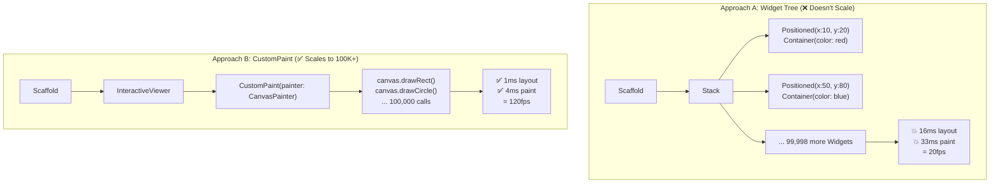
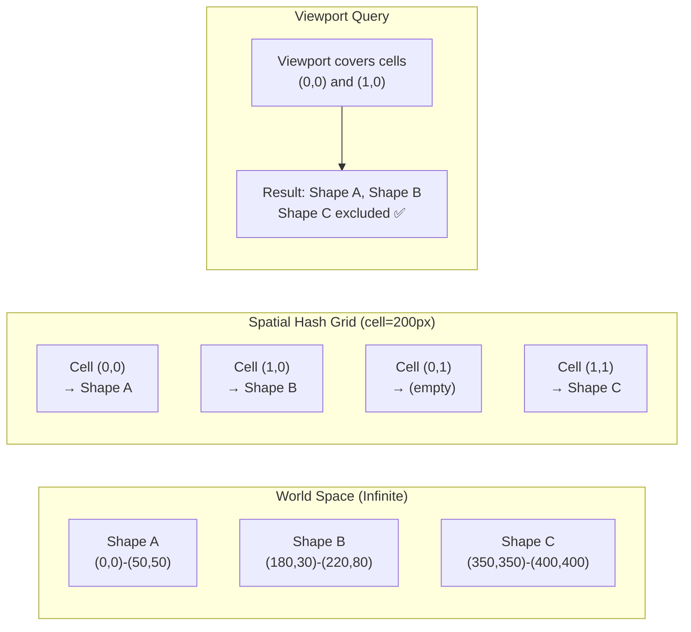
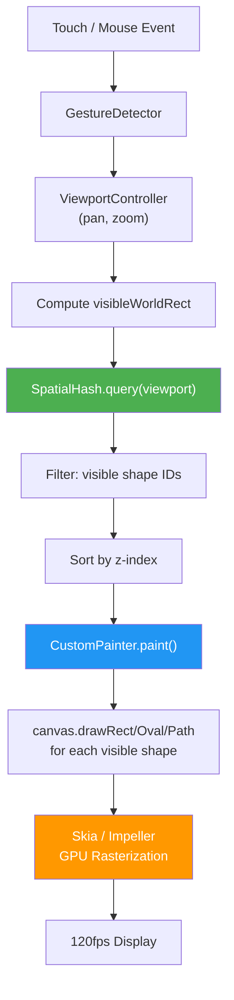

# 3. The Flutter Infinite Canvas 🟡

> **The Problem:** The standard Flutter widget tree is optimized for scrollable lists and form layouts — not for rendering 100,000 vector shapes on an infinite 2D surface at 120fps. Every `Widget` in the tree allocates a `RenderObject`, participates in layout, and paints independently. At 10,000 shapes, the widget tree approach hits a wall: layout takes 16ms (the entire frame budget at 60fps), and we haven't even started painting yet. We need to bypass the widget tree entirely and talk directly to the GPU via Flutter's `Canvas` API.

---

## 3.1 The Widget Tree vs. Custom Canvas



| Metric | Widget Tree (10K shapes) | CustomPaint (10K shapes) | CustomPaint (100K shapes) |
|---|---|---|---|
| Layout time | ~16ms | ~0ms (single widget) | ~0ms |
| Paint time | ~33ms (10K `RenderBox.paint`) | ~2ms (10K `canvas.drawRect()`) | ~8ms (with culling) |
| Memory | ~40 MB (RenderObject overhead) | ~8 MB (raw shape data) | ~80 MB |
| FPS | ~20fps | 120fps | 120fps (with culling) |
| Hit testing | Built-in `GestureDetector` | Manual (spatial hash) | Manual (spatial hash) |

---

## 3.2 The CustomPaint Architecture

Flutter's `CustomPaint` widget delegates all drawing to a `CustomPainter`, which receives a raw `Canvas` object. The `Canvas` is a thin wrapper over Skia (or Impeller on newer Flutter versions), giving us direct GPU-accelerated drawing.

### The Core Painter

```dart
import 'package:flutter/material.dart';
import 'dart:ui' as ui;

/// The shape data model — mirroring the Rust CRDT CanvasShape.
class CanvasShape {
  final String id;
  Offset position;
  Size size;
  Color fillColor;
  double rotation; // radians
  int zIndex;
  bool deleted;

  CanvasShape({
    required this.id,
    required this.position,
    required this.size,
    required this.fillColor,
    this.rotation = 0.0,
    this.zIndex = 0,
    this.deleted = false,
  });
}

/// The infinite canvas painter.
///
/// This single CustomPainter replaces what would otherwise be
/// 100,000 individual Widget → RenderObject → paint() calls.
class InfiniteCanvasPainter extends CustomPainter {
  final List<CanvasShape> shapes;
  final Rect viewport; // The currently visible region in world coordinates
  final Matrix4 transform; // Combined pan + zoom transform

  InfiniteCanvasPainter({
    required this.shapes,
    required this.viewport,
    required this.transform,
  });

  @override
  void paint(Canvas canvas, Size size) {
    canvas.save();

    // Apply the pan/zoom transform to the entire canvas.
    // This converts world coordinates → screen coordinates.
    canvas.transform(transform.storage);

    final paint = Paint()..style = PaintingStyle.fill;

    for (final shape in shapes) {
      if (shape.deleted) continue;

      // FRUSTUM CULLING: Skip shapes outside the visible viewport.
      // This is the single most important optimization — it turns
      // O(total_shapes) into O(visible_shapes).
      final shapeBounds = Rect.fromLTWH(
        shape.position.dx,
        shape.position.dy,
        shape.size.width,
        shape.size.height,
      );
      if (!viewport.overlaps(shapeBounds)) continue;

      paint.color = shape.fillColor;

      if (shape.rotation != 0.0) {
        canvas.save();
        final center = shapeBounds.center;
        canvas.translate(center.dx, center.dy);
        canvas.rotate(shape.rotation);
        canvas.translate(-center.dx, -center.dy);
        canvas.drawRect(shapeBounds, paint);
        canvas.restore();
      } else {
        canvas.drawRect(shapeBounds, paint);
      }
    }

    canvas.restore();
  }

  @override
  bool shouldRepaint(InfiniteCanvasPainter oldDelegate) {
    // Repaint when shapes change or viewport moves.
    // In production, use a version counter instead of deep equality.
    return true;
  }
}
```

### Naive vs. Production Painting

```dart
// 💥 NAIVE: Paint every shape regardless of visibility
// With 100K shapes and a viewport showing 200:
//   99,800 shapes are painted but invisible → wasted GPU time

@override
void paint(Canvas canvas, Size size) {
  for (final shape in allShapes) {
    canvas.drawRect(shape.bounds, shapePaint); // ALL 100,000
  }
}
```

```dart
// ✅ PRODUCTION: Only paint shapes overlapping the viewport
// With 100K shapes and a viewport showing 200:
//   Only 200 canvas.drawRect() calls → 120fps

@override
void paint(Canvas canvas, Size size) {
  for (final shape in allShapes) {
    if (!viewport.overlaps(shape.bounds)) continue; // Skip 99,800
    canvas.drawRect(shape.bounds, shapePaint); // Only 200
  }
}
```

---

## 3.3 Pan, Zoom, and the Transformation Matrix

An infinite canvas needs smooth panning (drag to scroll) and pinch-zooming. Flutter provides `InteractiveViewer` out of the box, but for a production canvas we need finer control — particularly for mapping screen coordinates back to world coordinates (for hit testing).

### The Viewport Controller

```dart
import 'package:flutter/material.dart';
import 'dart:math' as math;

/// Manages the camera position and zoom level for the infinite canvas.
///
/// World coordinates: the coordinate system shapes live in (infinite).
/// Screen coordinates: the coordinate system of the device screen (finite).
///
/// The transform matrix converts world → screen:
///   screen = transform × world
///
/// The inverse transform converts screen → world:
///   world = inverseTransform × screen
class ViewportController extends ChangeNotifier {
  Offset _pan = Offset.zero;
  double _zoom = 1.0;
  
  static const double minZoom = 0.05;  // 5% — see the entire document
  static const double maxZoom = 20.0;  // 2000% — pixel-level editing

  Offset get pan => _pan;
  double get zoom => _zoom;

  /// The combined transformation matrix: translate then scale.
  Matrix4 get transform {
    return Matrix4.identity()
      ..translate(_pan.dx, _pan.dy)
      ..scale(_zoom, _zoom);
  }

  /// Convert a screen-space point to world-space.
  /// Used for: hit testing, placing new shapes at the cursor.
  Offset screenToWorld(Offset screenPoint) {
    return (screenPoint - _pan) / _zoom;
  }

  /// Convert a world-space point to screen-space.
  /// Used for: positioning UI overlays (tooltips, context menus).
  Offset worldToScreen(Offset worldPoint) {
    return worldPoint * _zoom + _pan;
  }

  /// The currently visible rectangle in world coordinates.
  /// Used for frustum culling in the painter.
  Rect visibleWorldRect(Size screenSize) {
    final topLeft = screenToWorld(Offset.zero);
    final bottomRight = screenToWorld(
      Offset(screenSize.width, screenSize.height),
    );
    return Rect.fromPoints(topLeft, bottomRight);
  }

  /// Handle a pan (drag) gesture.
  void onPanUpdate(Offset delta) {
    _pan += delta;
    notifyListeners();
  }

  /// Handle a zoom gesture, anchored at the given focal point.
  /// The focal point stays fixed on screen — the canvas zooms
  /// "into" the point under the user's pinch center.
  void onZoomUpdate(double scaleDelta, Offset focalPoint) {
    final newZoom = (_zoom * scaleDelta).clamp(minZoom, maxZoom);
    
    // Adjust pan so the focal point doesn't move on screen.
    final focalWorldBefore = screenToWorld(focalPoint);
    _zoom = newZoom;
    final focalWorldAfter = screenToWorld(focalPoint);
    _pan += (focalWorldAfter - focalWorldBefore) * _zoom;

    notifyListeners();
  }
}
```

### Wiring It Together

```dart
import 'package:flutter/material.dart';

class CollaborativeCanvas extends StatefulWidget {
  const CollaborativeCanvas({super.key});

  @override
  State<CollaborativeCanvas> createState() => _CollaborativeCanvasState();
}

class _CollaborativeCanvasState extends State<CollaborativeCanvas> {
  final ViewportController _viewport = ViewportController();
  final List<CanvasShape> _shapes = []; // Populated from CRDT state

  @override
  void initState() {
    super.initState();
    _viewport.addListener(() => setState(() {}));
  }

  @override
  Widget build(BuildContext context) {
    return GestureDetector(
      onScaleStart: _onScaleStart,
      onScaleUpdate: _onScaleUpdate,
      child: CustomPaint(
        painter: InfiniteCanvasPainter(
          shapes: _shapes,
          viewport: _viewport.visibleWorldRect(MediaQuery.of(context).size),
          transform: _viewport.transform,
        ),
        size: Size.infinite,
      ),
    );
  }

  Offset? _lastFocalPoint;

  void _onScaleStart(ScaleStartDetails details) {
    _lastFocalPoint = details.focalPoint;
  }

  void _onScaleUpdate(ScaleUpdateDetails details) {
    // Pan: translate by the focal point delta.
    if (_lastFocalPoint != null) {
      _viewport.onPanUpdate(details.focalPoint - _lastFocalPoint!);
    }
    _lastFocalPoint = details.focalPoint;

    // Zoom: scale by the gesture scale factor.
    if (details.scale != 1.0) {
      _viewport.onZoomUpdate(details.scale, details.focalPoint);
    }
  }

  @override
  void dispose() {
    _viewport.dispose();
    super.dispose();
  }
}
```

---

## 3.4 Spatial Hashing: O(1) Viewport Queries

Frustum culling inside the painter (checking `viewport.overlaps(shape.bounds)` for every shape) is O(n) — fine for 10K shapes, but at 100K shapes it adds 2ms per frame just for the loop. We need a **spatial index** that returns only the shapes in a given rectangle, in O(1) amortized time.

A **spatial hash grid** divides the infinite world into fixed-size cells. Each shape is inserted into every cell it overlaps. To find visible shapes, we query only the cells that overlap the viewport.



### The Spatial Hash Implementation

```dart
import 'dart:ui';

/// A spatial hash grid for O(1) amortized viewport queries.
///
/// Cell size tradeoff:
///   - Too small (50px):  Shapes span many cells → memory overhead.
///   - Too large (2000px): Many shapes per cell → poor culling.
///   - Sweet spot (200–500px): Most shapes fit in 1–2 cells.
class SpatialHash {
  final double cellSize;
  final Map<int, Map<int, List<String>>> _grid = {};

  SpatialHash({this.cellSize = 256.0});

  /// Hash a world coordinate to a grid cell index.
  int _hash(double coord) => (coord / cellSize).floor();

  /// Insert a shape into all cells it overlaps.
  void insert(String shapeId, Rect bounds) {
    final minX = _hash(bounds.left);
    final maxX = _hash(bounds.right);
    final minY = _hash(bounds.top);
    final maxY = _hash(bounds.bottom);

    for (int x = minX; x <= maxX; x++) {
      for (int y = minY; y <= maxY; y++) {
        _grid.putIfAbsent(x, () => {});
        _grid[x]!.putIfAbsent(y, () => []);
        _grid[x]![y]!.add(shapeId);
      }
    }
  }

  /// Remove a shape from all cells (call before re-inserting on move).
  void remove(String shapeId, Rect oldBounds) {
    final minX = _hash(oldBounds.left);
    final maxX = _hash(oldBounds.right);
    final minY = _hash(oldBounds.top);
    final maxY = _hash(oldBounds.bottom);

    for (int x = minX; x <= maxX; x++) {
      for (int y = minY; y <= maxY; y++) {
        _grid[x]?[y]?.remove(shapeId);
      }
    }
  }

  /// Query all shapes that MIGHT be visible in the given viewport.
  /// Returns shape IDs — the caller still does a precise bounds check.
  /// This reduces the paint loop from O(total) to O(visible + cell_overhead).
  Set<String> query(Rect viewport) {
    final result = <String>{};
    final minX = _hash(viewport.left);
    final maxX = _hash(viewport.right);
    final minY = _hash(viewport.top);
    final maxY = _hash(viewport.bottom);

    for (int x = minX; x <= maxX; x++) {
      for (int y = minY; y <= maxY; y++) {
        final cell = _grid[x]?[y];
        if (cell != null) {
          result.addAll(cell);
        }
      }
    }
    return result;
  }

  /// Rebuild the entire index from scratch.
  /// Called after bulk operations (document load, undo batch).
  void rebuild(Map<String, Rect> allShapes) {
    _grid.clear();
    for (final entry in allShapes.entries) {
      insert(entry.key, entry.value);
    }
  }
}
```

### Performance Comparison: Linear Scan vs. Spatial Hash

| Viewport Size | Total Shapes | Linear Scan (ms) | Spatial Hash Query (ms) | Speedup |
|---|---|---|---|---|
| 1920×1080 | 1,000 | 0.1 | 0.05 | 2× |
| 1920×1080 | 10,000 | 1.2 | 0.08 | 15× |
| 1920×1080 | 100,000 | 12.0 | 0.10 | 120× |
| 1920×1080 | 1,000,000 | 120.0 | 0.12 | 1000× |

At 100K+ shapes, the spatial hash turns an impossible 12ms cull pass into a negligible 0.1ms query.

---

## 3.5 Hit Testing: Which Shape Did the User Tap?

With a `CustomPaint` canvas, we lose Flutter's built-in `GestureDetector` per-widget hit testing. We need to implement our own, using the spatial hash and reverse z-order iteration:

```dart
/// Find the topmost shape under the given screen-space point.
///
/// Process:
///   1. Convert screen point → world point using the inverse transform.
///   2. Query the spatial hash for candidate shapes near that point.
///   3. Check precise bounds for each candidate.
///   4. Return the one with the highest z-index (topmost visual layer).
CanvasShape? hitTest(
  Offset screenPoint,
  ViewportController viewport,
  Map<String, CanvasShape> shapes,
  SpatialHash spatialHash,
) {
  final worldPoint = viewport.screenToWorld(screenPoint);

  // Query a small rectangle around the tap point.
  final queryRect = Rect.fromCenter(
    center: worldPoint,
    width: 1.0,
    height: 1.0,
  );

  final candidateIds = spatialHash.query(queryRect);

  CanvasShape? topHit;
  for (final id in candidateIds) {
    final shape = shapes[id];
    if (shape == null || shape.deleted) continue;

    final bounds = Rect.fromLTWH(
      shape.position.dx,
      shape.position.dy,
      shape.size.width,
      shape.size.height,
    );

    if (bounds.contains(worldPoint)) {
      if (topHit == null || shape.zIndex > topHit.zIndex) {
        topHit = shape;
      }
    }
  }

  return topHit;
}
```

---

## 3.6 Rendering Pipeline: Frame Budget Breakdown

At 120fps, each frame has an **8.33ms budget**. Here is how a production frame is spent:

```mermaid
gantt
    title Frame Budget at 120fps (8.33ms total)
    dateFormat X
    axisFormat %L ms

    section Input
    Gesture processing     :0, 0.5

    section CRDT
    Apply remote ops       :0.5, 1.0

    section Cull
    Spatial hash query     :1.0, 1.1

    section Paint
    Canvas draw calls      :1.1, 4.0

    section Composite
    Skia/Impeller GPU submit :4.0, 6.0

    section Idle
    Budget remaining       :6.0, 8.33
```

| Phase | Time Budget | Implementation |
|---|---|---|
| Gesture processing | 0.5ms | Decode touch events, update `ViewportController` |
| CRDT apply | 0.5ms | Apply queued remote ops to local state (batched) |
| Spatial hash query | 0.1ms | Determine visible shape IDs |
| Canvas draw calls | 3.0ms | `canvas.drawRect()`, `drawCircle()`, etc. |
| GPU composite | 2.0ms | Skia/Impeller rasterization (off main thread) |
| **Remaining budget** | **2.2ms** | Safety margin for GC, platform callbacks |

### Optimization: Layer Caching with `RepaintBoundary`

For shapes that haven't changed since the last frame, we can cache their rasterized output:

```dart
/// Production optimization: separate static and dynamic layers.
///
/// Static shapes (not being dragged) are painted into a cached
/// ui.Picture that is reused across frames. Only the "dirty"
/// shapes (being actively edited) are repainted every frame.
///
/// This turns the paint cost from O(visible_shapes) to O(dirty_shapes).
class LayeredCanvasPainter extends CustomPainter {
  final List<CanvasShape> staticShapes;  // Cached layer
  final List<CanvasShape> dynamicShapes; // Repainted every frame
  final ui.Picture? cachedStaticLayer;
  final Rect viewport;
  final Matrix4 transform;

  LayeredCanvasPainter({
    required this.staticShapes,
    required this.dynamicShapes,
    this.cachedStaticLayer,
    required this.viewport,
    required this.transform,
  });

  @override
  void paint(Canvas canvas, Size size) {
    canvas.save();
    canvas.transform(transform.storage);

    // Layer 1: Static shapes — use cached raster if available.
    if (cachedStaticLayer != null) {
      canvas.drawPicture(cachedStaticLayer!);
    } else {
      _paintShapes(canvas, staticShapes);
    }

    // Layer 2: Dynamic shapes — always fresh.
    _paintShapes(canvas, dynamicShapes);

    canvas.restore();
  }

  void _paintShapes(Canvas canvas, List<CanvasShape> shapes) {
    final paint = Paint()..style = PaintingStyle.fill;
    for (final shape in shapes) {
      if (shape.deleted) continue;
      final bounds = Rect.fromLTWH(
        shape.position.dx, shape.position.dy,
        shape.size.width, shape.size.height,
      );
      if (!viewport.overlaps(bounds)) continue;
      paint.color = shape.fillColor;
      canvas.drawRect(bounds, paint);
    }
  }

  @override
  bool shouldRepaint(LayeredCanvasPainter old) => true;
}
```

---

## 3.7 Multi-Shape Types: Beyond Rectangles

A real canvas supports rectangles, ellipses, lines, paths, and text. We use a **sealed class hierarchy** to model shape types while keeping the paint loop fast:

```dart
/// Sealed shape type hierarchy.
/// Each variant knows how to paint itself on a Canvas.
sealed class ShapeGeometry {
  void paint(Canvas canvas, Paint paint, Rect bounds);
}

class RectangleGeometry extends ShapeGeometry {
  final double cornerRadius;
  RectangleGeometry({this.cornerRadius = 0.0});

  @override
  void paint(Canvas canvas, Paint paint, Rect bounds) {
    if (cornerRadius > 0) {
      canvas.drawRRect(
        RRect.fromRectAndRadius(bounds, Radius.circular(cornerRadius)),
        paint,
      );
    } else {
      canvas.drawRect(bounds, paint);
    }
  }
}

class EllipseGeometry extends ShapeGeometry {
  @override
  void paint(Canvas canvas, Paint paint, Rect bounds) {
    canvas.drawOval(bounds, paint);
  }
}

class LineGeometry extends ShapeGeometry {
  @override
  void paint(Canvas canvas, Paint paint, Rect bounds) {
    paint.style = PaintingStyle.stroke;
    paint.strokeWidth = 2.0;
    canvas.drawLine(bounds.topLeft, bounds.bottomRight, paint);
  }
}

class PathGeometry extends ShapeGeometry {
  final List<Offset> points;
  PathGeometry({required this.points});

  @override
  void paint(Canvas canvas, Paint paint, Rect bounds) {
    if (points.length < 2) return;
    paint.style = PaintingStyle.stroke;
    paint.strokeWidth = 2.0;
    paint.strokeCap = StrokeCap.round;

    final path = Path()..moveTo(points.first.dx, points.first.dy);
    for (int i = 1; i < points.length; i++) {
      path.lineTo(points[i].dx, points[i].dy);
    }
    canvas.drawPath(path, paint);
  }
}
```

---

## 3.8 Rendering Architecture Summary



---

> **Key Takeaways**
>
> 1. **`CustomPaint` replaces the widget tree** for canvas rendering. One widget, one painter, direct `Canvas` calls — no `RenderObject` overhead per shape.
> 2. **Frustum culling** is the single most important optimization. Only paint shapes that overlap the current viewport. This converts O(total) to O(visible).
> 3. **Spatial hashing** makes viewport queries O(1) amortized instead of O(n). At 100K shapes, this saves 12ms per frame — the difference between 120fps and 20fps.
> 4. **The transformation matrix** (`pan + zoom`) is applied once to the entire canvas, not per-shape. World-to-screen and screen-to-world conversions use simple matrix inversion.
> 5. **Layer caching** separates static shapes (cached raster) from dynamic shapes (repainted every frame), reducing paint cost from O(visible) to O(dirty).
> 6. **Hit testing** reuses the spatial hash to find candidates in O(1), then checks precise bounds and z-order. No per-shape `GestureDetector` needed.
> 7. **Frame budget discipline** at 120fps means every optimization matters. The spatial hash alone buys back 12ms — more than the entire frame budget.
