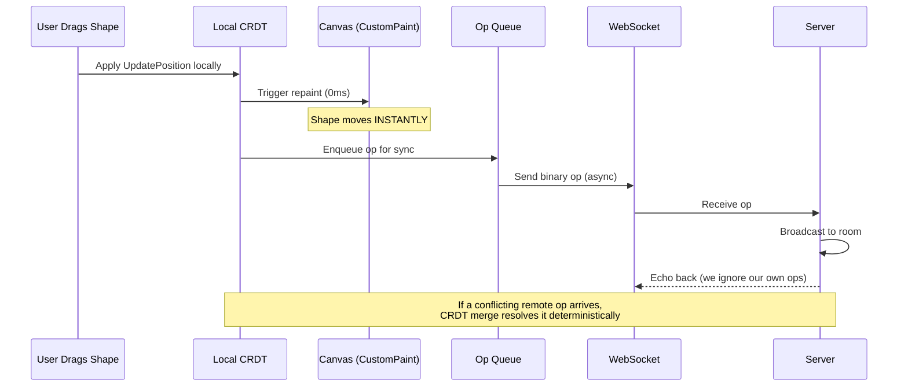
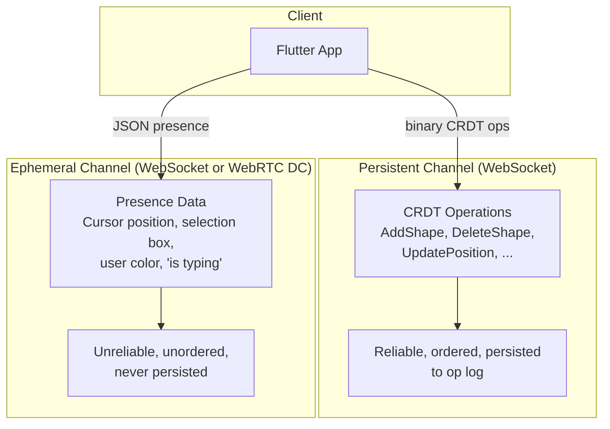
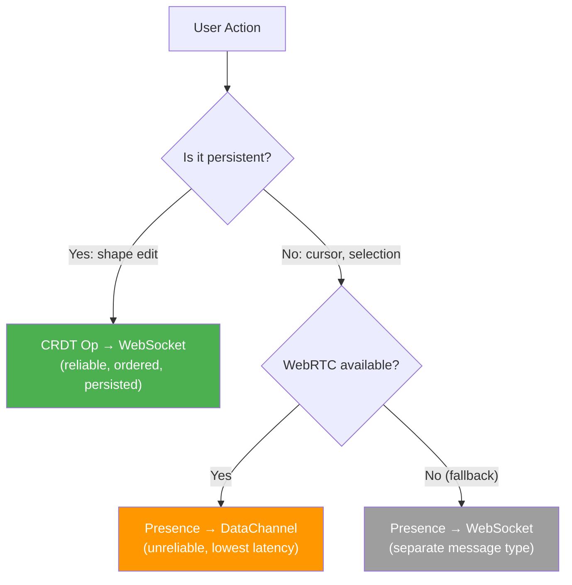
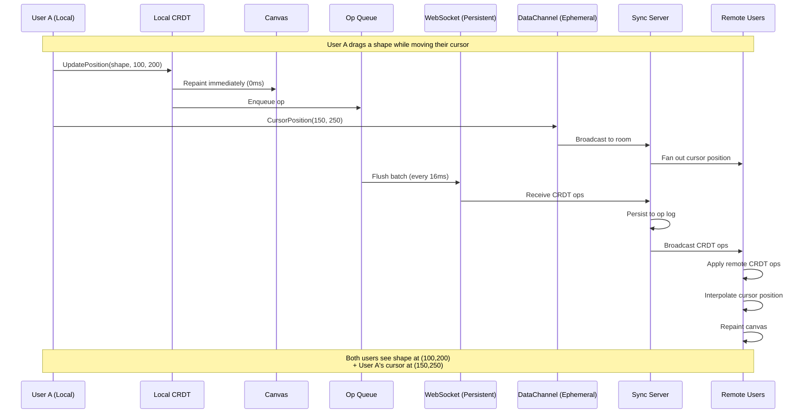

# 4. Optimistic UI and Cursor Tracking 🔴

> **The Problem:** Even on a fast network, a WebSocket round-trip takes 5–50ms. If the user drags a shape and we wait for the server to acknowledge the move before updating the canvas, the shape "sticks" and then teleports — a universally despised UX. Simultaneously, every collaborator's cursor, selection box, and "User X is typing" indicator must be visible in real time, but these ephemeral signals must **never** pollute the persistent CRDT document state (nobody wants to replay 10 million cursor-move operations on document load).

---

## 4.1 The Optimistic Apply Pattern

The core principle: **apply locally first, sync in the background**. The user's action takes effect on screen at exactly 0ms latency. The CRDT operation is queued and sent over the WebSocket asynchronously. When the server broadcasts the operation back (or a conflicting operation from another user arrives), the CRDT merge function handles convergence transparently.



### The Operation Queue

```dart
import 'dart:async';
import 'dart:collection';

/// A queue that batches local CRDT operations and sends them over
/// the WebSocket at a controlled rate.
///
/// Batching is critical during drag operations: a user dragging a
/// shape at 60Hz generates 60 UpdatePosition ops/sec. We batch
/// these into a single message every 16ms (one per frame) to avoid
/// flooding the WebSocket with redundant intermediate positions.
class OpQueue {
  final Queue<Uint8List> _pending = Queue();
  final WebSocketChannel _ws;
  Timer? _flushTimer;

  OpQueue(this._ws);

  /// Enqueue an operation. If a flush timer isn't already running,
  /// start one. The timer fires every 16ms (matching 60fps).
  void enqueue(Uint8List opBytes) {
    _pending.add(opBytes);
    _flushTimer ??= Timer.periodic(
      const Duration(milliseconds: 16),
      (_) => _flush(),
    );
  }

  /// Send all pending operations in a single WebSocket message.
  /// For drag operations, only the LAST position update matters —
  /// intermediate positions can be coalesced.
  void _flush() {
    if (_pending.isEmpty) {
      _flushTimer?.cancel();
      _flushTimer = null;
      return;
    }

    // Coalesce: if multiple UpdatePosition ops target the same shape,
    // keep only the last one. This reduces 60 ops/sec to ~1 meaningful
    // position per flush cycle.
    final coalesced = _coalesce(_pending);
    _pending.clear();

    for (final op in coalesced) {
      _ws.sink.add(op);
    }
  }

  List<Uint8List> _coalesce(Queue<Uint8List> ops) {
    // Group by (op_type, shape_id). For UpdatePosition, UpdateSize,
    // UpdateRotation — keep only the latest per shape.
    final Map<String, Uint8List> latest = {};
    final List<Uint8List> nonCoalescable = [];

    for (final op in ops) {
      final key = _coalesceKey(op);
      if (key != null) {
        latest[key] = op; // Overwrite — keeps the latest
      } else {
        nonCoalescable.add(op); // AddShape, DeleteShape — never coalesce
      }
    }

    return [...nonCoalescable, ...latest.values];
  }

  /// Extract a coalescing key: "opType:shapeId" for position/size/rotation ops.
  /// Returns null for ops that must never be coalesced (add, delete).
  String? _coalesceKey(Uint8List opBytes) {
    if (opBytes.isEmpty) return null;
    final opType = opBytes[0];
    // OpTypes 3, 4, 6, 7 are UpdatePosition, UpdateSize, UpdateRotation, UpdateZIndex
    if (opType >= 3 && opType <= 7) {
      // shape_id is bytes 1..17
      final shapeId = String.fromCharCodes(opBytes.sublist(1, 17));
      return '$opType:$shapeId';
    }
    return null; // AddShape (1), DeleteShape (2) — never coalesce
  }
}
```

---

## 4.2 Handling Remote Conflicts During Drag

The subtle edge case: User A is mid-drag on shape R (holding the mouse button down, generating 60 position updates per second). Meanwhile, User B moves the same shape R to a completely different location. What happens?

### The Naive Approach: Teleportation Glitch

```
// 💥 NAIVE: Replace local state with every remote update
void onRemoteOp(UpdatePosition op) {
    shape.position = op.position;  // User A's shape teleports mid-drag
    repaint();                      // Jarring, breaks user's mental model
}
// User A: "I'm dragging this shape... wait, where did it go?!"
```

### The Production Approach: Deferred Remote Apply

```dart
// ✅ PRODUCTION: Defer conflicting remote updates while user is actively dragging.
//
// While User A is dragging shape R:
//   1. Local position updates apply immediately (0ms).
//   2. Remote updates to shape R's POSITION are buffered.
//   3. Remote updates to OTHER properties of R (color, size) apply immediately.
//   4. Remote updates to OTHER shapes apply immediately.
//   5. When User A releases the mouse (drag ends), buffered remote updates
//      are merged via the CRDT — the final position is deterministic.

class DragState {
  final String activeShapeId;
  final List<RemoteOp> deferredOps = [];

  DragState(this.activeShapeId);
}

class OptimisticController {
  DragState? _activeDrag;
  final CrdtDocument _doc;
  final CanvasNotifier _canvas;

  OptimisticController(this._doc, this._canvas);

  /// Called when the user starts dragging a shape.
  void onDragStart(String shapeId) {
    _activeDrag = DragState(shapeId);
  }

  /// Called on every drag update (60Hz).
  void onDragUpdate(String shapeId, Offset newPosition) {
    // Apply locally — instant feedback.
    final ts = _doc.nextTimestamp();
    _doc.applyLocal(UpdatePosition(shapeId, newPosition), ts);
    _canvas.repaint();
  }

  /// Called when the user releases the drag.
  void onDragEnd() {
    if (_activeDrag == null) return;

    // Now apply all deferred remote ops. The CRDT merge function
    // will determine the final position deterministically.
    for (final op in _activeDrag!.deferredOps) {
      _doc.applyRemote(op.operation, op.timestamp);
    }
    _activeDrag = null;
    _canvas.repaint();
  }

  /// Called when a remote operation arrives over the WebSocket.
  void onRemoteOp(RemoteOp op) {
    if (_activeDrag != null &&
        op.isPositionUpdate &&
        op.shapeId == _activeDrag!.activeShapeId) {
      // Defer — don't teleport the shape the user is actively dragging.
      _activeDrag!.deferredOps.add(op);
      return;
    }

    // All other remote ops apply immediately.
    _doc.applyRemote(op.operation, op.timestamp);
    _canvas.repaint();
  }
}
```

---

## 4.3 Ephemeral Presence: The Cursor Channel

Cursor positions, selection boxes, and typing indicators are **ephemeral** — they are:
- Valid only for the current session (useless after the user disconnects).
- High-frequency (cursor moves at 60Hz during mouse movement).
- Lossy-tolerant (dropping a cursor update is barely noticeable; dropping a shape edit is catastrophic).

We transmit ephemeral state on a **separate channel** from the persistent CRDT operations. This separation prevents cursor spam from congesting the op queue and keeps the op log clean.



### Presence Data Model

```dart
/// Ephemeral presence state for a single user.
/// Broadcast at 30Hz (every 33ms) while the user is active.
/// Automatically expires after 5 seconds of no updates.
class UserPresence {
  final String userId;
  final String displayName;
  final Color cursorColor;
  final Offset? cursorPosition;  // null = cursor not on canvas
  final Rect? selectionBox;      // null = no active selection
  final String? editingShapeId;  // null = not editing any shape
  final DateTime lastSeen;

  UserPresence({
    required this.userId,
    required this.displayName,
    required this.cursorColor,
    this.cursorPosition,
    this.selectionBox,
    this.editingShapeId,
    required this.lastSeen,
  });

  bool get isStale =>
      DateTime.now().difference(lastSeen) > const Duration(seconds: 5);

  Map<String, dynamic> toJson() => {
    'uid': userId,
    'name': displayName,
    'color': cursorColor.value,
    'cx': cursorPosition?.dx,
    'cy': cursorPosition?.dy,
    'sx': selectionBox?.left,
    'sy': selectionBox?.top,
    'sw': selectionBox?.width,
    'sh': selectionBox?.height,
    'editing': editingShapeId,
    'ts': lastSeen.millisecondsSinceEpoch,
  };
}
```

### Presence Broadcasting (Server-Side)

On the server, ephemeral presence uses an entirely separate Redis Pub/Sub channel with no persistence:

```rust,editable
/// Broadcast ephemeral presence to all clients in a room.
///
/// Key differences from CRDT op broadcast:
///   1. NO persistence — presence is never written to PostgreSQL.
///   2. NO ordering guarantees — stale cursors are simply overwritten.
///   3. HIGHER throughput — 30Hz × 200 users = 6,000 msg/sec per room.
///   4. SEPARATE Redis channel — "presence:doc_id" vs "doc:doc_id".
async fn broadcast_presence(
    redis: &redis::aio::ConnectionManager,
    doc_id: &str,
    presence_json: &[u8],
) {
    // Fire-and-forget. If this message is lost, the next one
    // arrives in 33ms. No retry, no acknowledgment.
    let _: Result<(), _> = redis::cmd("PUBLISH")
        .arg(format!("presence:{doc_id}"))
        .arg(presence_json)
        .query_async(&mut redis.clone())
        .await;
}
```

### Rendering Remote Cursors

```dart
/// Paint remote users' cursors and selection boxes on top of the canvas.
///
/// This is a SEPARATE CustomPainter layered above the shape painter.
/// It repaints at 30Hz (not 120Hz) to save GPU time — cursor smoothness
/// at 30fps is perceptually fine for non-primary cursors.
class CursorOverlayPainter extends CustomPainter {
  final List<UserPresence> remoteUsers;
  final Matrix4 transform;

  CursorOverlayPainter({
    required this.remoteUsers,
    required this.transform,
  });

  @override
  void paint(Canvas canvas, Size size) {
    canvas.save();
    canvas.transform(transform.storage);

    for (final user in remoteUsers) {
      if (user.isStale) continue;

      // Draw cursor arrow
      if (user.cursorPosition != null) {
        _drawCursorArrow(canvas, user.cursorPosition!, user.cursorColor);
        _drawUserLabel(canvas, user.cursorPosition!, user.displayName, user.cursorColor);
      }

      // Draw selection box
      if (user.selectionBox != null) {
        final selectionPaint = Paint()
          ..color = user.cursorColor.withAlpha(51) // 20% opacity
          ..style = PaintingStyle.fill;
        canvas.drawRect(user.selectionBox!, selectionPaint);

        final borderPaint = Paint()
          ..color = user.cursorColor
          ..style = PaintingStyle.stroke
          ..strokeWidth = 1.5;
        canvas.drawRect(user.selectionBox!, borderPaint);
      }
    }

    canvas.restore();
  }

  void _drawCursorArrow(Canvas canvas, Offset position, Color color) {
    final path = Path()
      ..moveTo(position.dx, position.dy)
      ..lineTo(position.dx, position.dy + 18)
      ..lineTo(position.dx + 6, position.dy + 14)
      ..lineTo(position.dx + 12, position.dy + 14)
      ..close();

    canvas.drawPath(path, Paint()..color = color);
    canvas.drawPath(
      path,
      Paint()
        ..color = Colors.white
        ..style = PaintingStyle.stroke
        ..strokeWidth = 1.0,
    );
  }

  void _drawUserLabel(Canvas canvas, Offset position, String name, Color color) {
    final textPainter = TextPainter(
      text: TextSpan(
        text: name,
        style: const TextStyle(color: Colors.white, fontSize: 11),
      ),
      textDirection: TextDirection.ltr,
    )..layout();

    final labelRect = RRect.fromRectAndRadius(
      Rect.fromLTWH(
        position.dx + 14,
        position.dy + 12,
        textPainter.width + 8,
        textPainter.height + 4,
      ),
      const Radius.circular(4),
    );

    canvas.drawRRect(labelRect, Paint()..color = color);
    textPainter.paint(canvas, Offset(position.dx + 18, position.dy + 14));
  }

  @override
  bool shouldRepaint(CursorOverlayPainter old) => true;
}
```

---

## 4.4 WebRTC DataChannel: The UDP Alternative

For the highest performance, ephemeral presence can be transmitted over a **WebRTC DataChannel** configured for unreliable, unordered delivery — essentially UDP over the browser.

| Property | WebSocket | WebRTC DataChannel (unreliable) |
|---|---|---|
| Transport | TCP | SCTP over DTLS (UDP-like) |
| Ordering | Guaranteed | Not guaranteed |
| Reliability | Guaranteed delivery + retransmission | Fire-and-forget |
| Head-of-line blocking | Yes (one lost packet stalls all) | No |
| Latency | 5–50ms | 1–15ms |
| Use case | CRDT ops (correctness matters) | Cursors (freshness matters) |

### Architecture Decision: When to Use Which Channel



In practice, WebRTC DataChannels require a signaling server and STUN/TURN infrastructure. Many production systems start with WebSocket-only (using a separate message type byte for presence) and migrate to WebRTC when latency requirements justify the operational complexity.

---

## 4.5 Cursor Interpolation: Smoothing Remote Movement

Remote cursors arrive at 30Hz, but the canvas repaints at 120fps. Without interpolation, remote cursors appear to "jump" between positions. We smooth the movement with linear interpolation (lerp):

```dart
import 'package:flutter/material.dart';

/// Smoothly interpolates a remote cursor from its last known position
/// to its latest reported position over the interval between updates.
class CursorInterpolator {
  Offset _from;
  Offset _to;
  double _t = 1.0; // 0.0 = at _from, 1.0 = at _to
  static const double speed = 0.15; // Lerp factor per frame (tunable)

  CursorInterpolator(Offset initial)
      : _from = initial,
        _to = initial;

  /// Called when a new cursor position arrives from the network (30Hz).
  void onRemoteUpdate(Offset newPosition) {
    _from = currentPosition;
    _to = newPosition;
    _t = 0.0;
  }

  /// Called every frame (120Hz). Advances the interpolation.
  Offset get currentPosition {
    _t = (_t + speed).clamp(0.0, 1.0);
    return Offset.lerp(_from, _to, _t)!;
  }
}
```

---

## 4.6 The Complete Optimistic UI Data Flow



---

## 4.7 Naive vs. Production: Summary

| Aspect | Naive | Production |
|---|---|---|
| Local apply timing | After server ACK (50ms+) | Immediate (0ms) ✅ |
| Drag UX | Shape sticks, then teleports | Shape follows finger perfectly ✅ |
| Conflict during drag | Teleportation glitch | Deferred merge on drag-end ✅ |
| Cursor channel | Mixed with shape ops | Separate ephemeral channel ✅ |
| Cursor persistence | Persisted in op log (bloat!) | Never persisted ✅ |
| Cursor smoothness | 30Hz jumps | 120fps interpolated ✅ |
| Bandwidth for cursors | 200 JSON cursor msgs × 200 users/s | 30 binary msgs × 200 users/s ✅ |

---

> **Key Takeaways**
>
> 1. **Optimistic local apply** is non-negotiable for perceived performance. The user must never wait for a network round-trip before seeing their edit on screen.
> 2. **Operation coalescing** during drag reduces WebSocket traffic from 60 ops/sec/user to ~1 meaningful position update per flush cycle (16ms).
> 3. **Deferred remote apply** prevents teleportation glitches during active drag. Conflicting remote updates are buffered and merged when the drag ends.
> 4. **Ephemeral presence is a separate channel** — it is high-frequency, lossy-tolerant, and never persisted. Mixing it with CRDT ops pollutes the op log and wastes storage.
> 5. **WebRTC DataChannels** provide UDP-like semantics for the lowest possible cursor latency, but WebSocket with a separate message type is a valid starting architecture.
> 6. **Cursor interpolation (lerp)** smooths the visual jump between 30Hz network updates, making remote cursors appear to move at 120fps.
> 7. **The two-channel architecture** (persistent + ephemeral) is the pattern used by Figma, Miro, and every production collaborative tool — it cleanly separates correctness-critical data from best-effort presence signals.
