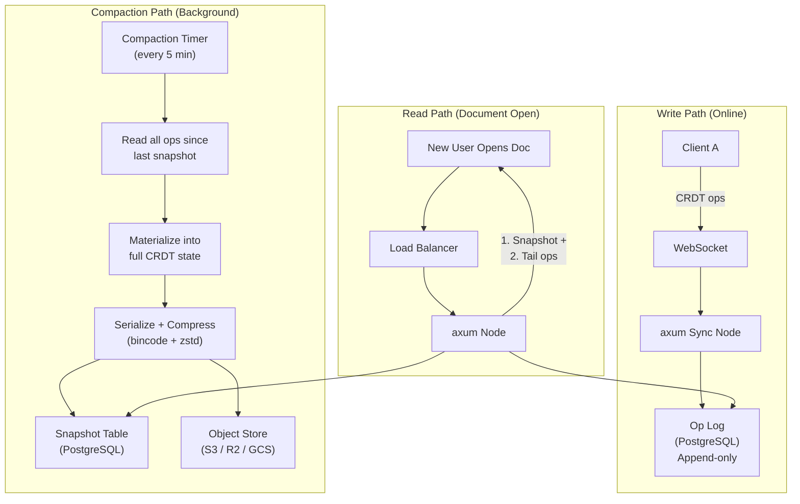
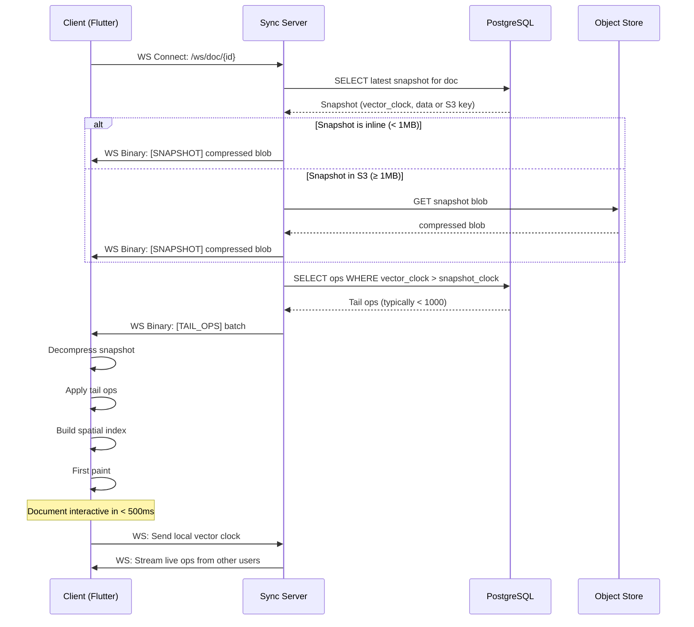
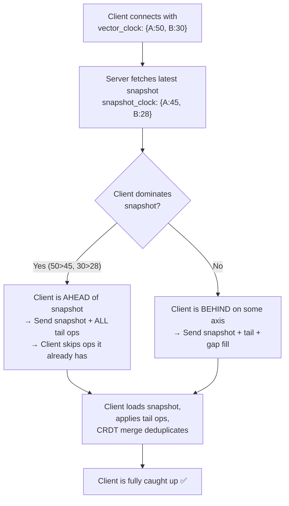
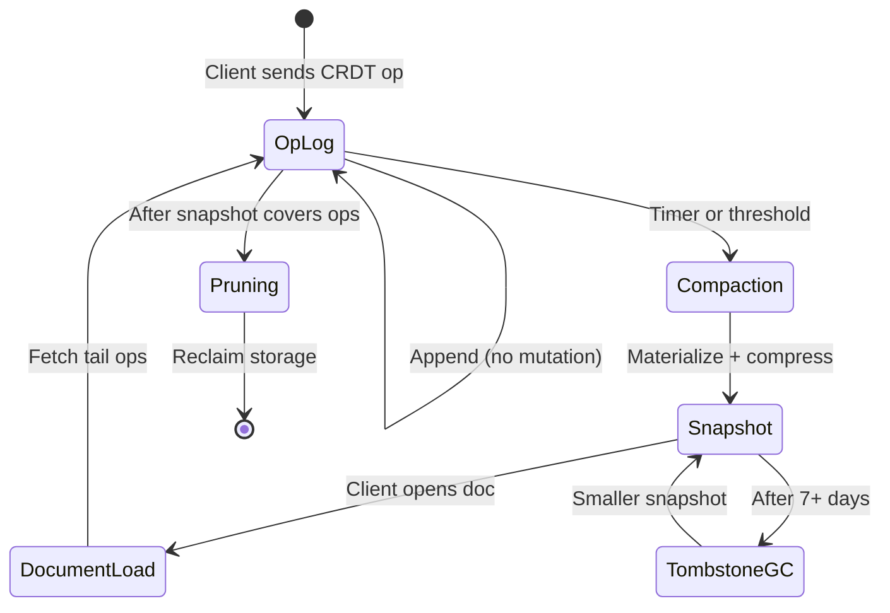

# 5. Snapshotting and Document Load Times 🔴

> **The Problem:** A document that has been actively edited for six months accumulates millions of CRDT operations in the op log. When a new user opens this document, the naive approach replays every operation from the beginning: download 50MB of ops, deserialize them, apply each one to an empty CRDT state. This takes 30+ seconds — by which time the user has closed the tab and opened a competitor's tool. We need to serve a **pre-compacted snapshot** that represents the entire document state in a single compressed binary blob, so the document is interactive in under 500ms.

---

## 5.1 The Snapshot Architecture



The document load protocol has two steps:
1. **Download the latest snapshot** — a compressed binary blob representing the full CRDT state at a point in time.
2. **Download tail operations** — the ops that were appended *after* the snapshot was taken.

The client applies the snapshot (one bulk load), then replays the tail ops (typically < 1,000 ops, taking < 10ms). Total: **under 500ms**.

---

## 5.2 The Snapshot Data Model

### Database Schema

```sql
CREATE TABLE IF NOT EXISTS snapshots (
    doc_id          TEXT    NOT NULL,
    snapshot_id     BIGSERIAL,
    -- The vector clock at the moment this snapshot was taken.
    -- Used to determine which tail ops the client needs.
    vector_clock    JSONB   NOT NULL,
    -- Total number of shapes in this snapshot (for metrics/debugging).
    shape_count     INT     NOT NULL,
    -- Compressed size in bytes.
    size_bytes      BIGINT  NOT NULL,
    -- The snapshot blob. For small docs (<1MB compressed), inline in Postgres.
    -- For large docs, this is NULL and object_store_key points to S3.
    data            BYTEA,
    object_store_key TEXT,
    created_at      TIMESTAMPTZ NOT NULL DEFAULT now(),
    PRIMARY KEY (doc_id, snapshot_id)
);

-- Fast lookup: "Give me the latest snapshot for this document."
CREATE INDEX IF NOT EXISTS idx_snapshots_latest
    ON snapshots (doc_id, snapshot_id DESC);
```

### Snapshot Serialization

```rust,editable
use std::collections::HashMap;

# #[derive(Debug, Clone, Copy, PartialEq, Eq, Hash)]
# struct LamportId { counter: u64, node_id: u64 }
# #[derive(Debug, Clone)] struct LwwRegister<T: Clone> { value: T, timestamp: LamportId }
# #[derive(Debug, Clone, Copy)] struct Point { x: f64, y: f64 }
# #[derive(Debug, Clone, Copy)] struct Size { width: f64, height: f64 }
# #[derive(Debug, Clone)] struct Color(String);
# #[derive(Debug, Clone)]
# struct CanvasShape {
#     id: LamportId, position: LwwRegister<Point>, size: LwwRegister<Size>,
#     fill_color: LwwRegister<Color>, rotation_deg: LwwRegister<f64>,
#     z_index: LwwRegister<i64>, deleted: LwwRegister<bool>,
# }

/// A serializable snapshot of the entire document state.
///
/// This is the "materialized view" of the CRDT — all operations
/// have been applied and the result is a flat map of shapes.
#[derive(serde::Serialize, serde::Deserialize)]
struct DocumentSnapshot {
    /// Which document this snapshot belongs to.
    doc_id: String,
    /// The vector clock at the time of snapshotting.
    /// Encodes exactly which operations from each node are included.
    vector_clock: HashMap<u64, u64>,
    /// All shapes (including tombstoned/deleted ones, for CRDT correctness).
    shapes: Vec<SerializedShape>,
}

/// A compact, serialization-friendly representation of a shape.
/// We strip the LWW timestamps here because the snapshot IS the
/// converged state — there's nothing to merge against.
///
/// Wait — actually, we MUST keep the timestamps. If a client loads
/// the snapshot and then receives a late-arriving op with a timestamp
/// OLDER than the snapshot's register timestamp, the merge must
/// correctly reject it. Without timestamps, the client can't tell.
#[derive(serde::Serialize, serde::Deserialize)]
struct SerializedShape {
    id_counter: u64,
    id_node: u64,
    x: f64,
    y: f64,
    width: f64,
    height: f64,
    fill_color: String,
    rotation_deg: f64,
    z_index: i64,
    deleted: bool,
    // LWW timestamps — needed for correct merge after snapshot load
    ts_position: (u64, u64),
    ts_size: (u64, u64),
    ts_color: (u64, u64),
    ts_rotation: (u64, u64),
    ts_z_index: (u64, u64),
    ts_deleted: (u64, u64),
}
```

---

## 5.3 Compression Pipeline: bincode + zstd

The snapshot passes through a two-stage pipeline:
1. **`bincode`** for binary serialization — no field names, no schema overhead, just raw bytes.
2. **`zstd`** for compression — 3–10× compression ratio on structured binary data.

```rust,editable
/// Serialize and compress a document snapshot.
///
/// Size comparison for a 10,000-shape document:
///   JSON:               4,800 KB
///   bincode:              480 KB  (10× smaller)
///   bincode + zstd:        52 KB  (92× smaller)
fn compress_snapshot(snapshot: &DocumentSnapshot) -> Vec<u8> {
    let raw_bytes = bincode::serialize(snapshot)
        .expect("bincode serialization failed");

    // zstd compression level 3: good balance of speed and ratio.
    // Level 1: fastest, ~2.5× compression
    // Level 3: ~3.5× compression, still under 10ms for 1MB input
    // Level 19: maximum, ~4.5× but 100ms+ for 1MB input
    zstd::encode_all(raw_bytes.as_slice(), 3)
        .expect("zstd compression failed")
}

/// Decompress and deserialize a snapshot blob.
fn decompress_snapshot(compressed: &[u8]) -> DocumentSnapshot {
    let raw_bytes = zstd::decode_all(compressed)
        .expect("zstd decompression failed");
    bincode::deserialize(&raw_bytes)
        .expect("bincode deserialization failed")
}
```

### Compression Benchmarks

| Shapes | JSON | bincode | bincode + zstd | Compress Time | Decompress Time |
|---|---|---|---|---|---|
| 1,000 | 480 KB | 48 KB | 5.2 KB | 0.3ms | 0.1ms |
| 10,000 | 4.8 MB | 480 KB | 52 KB | 2.8ms | 1.1ms |
| 100,000 | 48 MB | 4.8 MB | 520 KB | 28ms | 11ms |
| 1,000,000 | 480 MB | 48 MB | 5.2 MB | 280ms | 110ms |

At 100K shapes, the snapshot is **520 KB** — downloadable in ~50ms on a 100 Mbps connection. Compare with replaying the entire op log: if each shape was created and moved an average of 20 times, that's 2 million ops × ~50 bytes = 100 MB of raw operation data.

---

## 5.4 The Compaction Worker

Compaction runs as a **background task** in the Rust backend, triggered periodically or when the op log exceeds a size threshold.

```rust,editable
# use std::collections::HashMap;
# struct DocumentSnapshot { doc_id: String, vector_clock: HashMap<u64, u64>, shapes: Vec<()> }
# fn compress_snapshot(_: &DocumentSnapshot) -> Vec<u8> { vec![] }

/// Background compaction worker.
///
/// Runs every 5 minutes per active document. Can also be triggered
/// when the op count since the last snapshot exceeds a threshold.
async fn compaction_tick(
    pool: &sqlx::PgPool,
    doc_id: &str,
) -> Result<(), Box<dyn std::error::Error>> {
    // Step 1: Load the latest snapshot (if any) as the starting state.
    let (mut shapes, mut vector_clock) = load_latest_snapshot(pool, doc_id).await?;

    // Step 2: Load all ops AFTER the snapshot's vector clock.
    let tail_ops = fetch_tail_ops(pool, doc_id, &vector_clock).await?;

    if tail_ops.is_empty() {
        tracing::debug!(doc_id, "No new ops since last snapshot — skipping");
        return Ok(());
    }

    // Step 3: Replay the tail ops to build the new state.
    for (node_id, counter, op_type, payload) in &tail_ops {
        apply_op_to_state(&mut shapes, *node_id, *counter, *op_type, payload);
        vector_clock.insert(*node_id, *counter);
    }

    // Step 4: Build and compress the snapshot.
    let snapshot = DocumentSnapshot {
        doc_id: doc_id.to_string(),
        vector_clock: vector_clock.clone(),
        shapes,
    };
    let compressed = compress_snapshot(&snapshot);
    let size_bytes = compressed.len();

    // Step 5: Store the snapshot. Small snapshots go inline in Postgres;
    // large ones go to object storage with a pointer in Postgres.
    if size_bytes < 1_048_576 {
        // < 1 MB: inline in Postgres
        store_snapshot_inline(pool, doc_id, &compressed, &vector_clock).await?;
    } else {
        // >= 1 MB: upload to S3, store key in Postgres
        let key = upload_to_object_store(doc_id, &compressed).await?;
        store_snapshot_reference(pool, doc_id, &key, size_bytes, &vector_clock).await?;
    }

    // Step 6: Optionally, prune old ops that are fully covered by the snapshot.
    // This is a CAREFUL operation — only delete ops where EVERY node's counter
    // in the vector clock is >= the op's (node_id, counter).
    prune_covered_ops(pool, doc_id, &vector_clock).await?;

    tracing::info!(
        doc_id,
        ops_compacted = tail_ops.len(),
        snapshot_size_kb = size_bytes / 1024,
        "Snapshot created"
    );

    Ok(())
}

# async fn load_latest_snapshot(_: &sqlx::PgPool, _: &str) -> Result<(Vec<()>, HashMap<u64, u64>), Box<dyn std::error::Error>> { Ok((vec![], HashMap::new())) }
# async fn fetch_tail_ops(_: &sqlx::PgPool, _: &str, _: &HashMap<u64, u64>) -> Result<Vec<(u64, u64, u8, Vec<u8>)>, Box<dyn std::error::Error>> { Ok(vec![]) }
# fn apply_op_to_state(_: &mut Vec<()>, _: u64, _: u64, _: u8, _: &[u8]) {}
# async fn store_snapshot_inline(_: &sqlx::PgPool, _: &str, _: &[u8], _: &HashMap<u64, u64>) -> Result<(), Box<dyn std::error::Error>> { Ok(()) }
# async fn upload_to_object_store(_: &str, _: &[u8]) -> Result<String, Box<dyn std::error::Error>> { Ok(String::new()) }
# async fn store_snapshot_reference(_: &sqlx::PgPool, _: &str, _: &str, _: usize, _: &HashMap<u64, u64>) -> Result<(), Box<dyn std::error::Error>> { Ok(()) }
# async fn prune_covered_ops(_: &sqlx::PgPool, _: &str, _: &HashMap<u64, u64>) -> Result<(), Box<dyn std::error::Error>> { Ok(()) }
```

### Compaction Trigger Strategy

| Strategy | Trigger Condition | Pros | Cons |
|---|---|---|---|
| Timer-based | Every 5 min per active doc | Simple, predictable | Unnecessary work for inactive docs |
| Op-count threshold | Every 10,000 new ops | Proportional to activity | Bursty compaction during high edit rates |
| Size-threshold | When tail ops exceed 1MB | Directly controls load time | Requires tracking op sizes |
| **Hybrid (recommended)** | Timer OR 10K ops — whichever first | Best of both worlds ✅ | Slightly more complex scheduling |

---

## 5.5 The Document Load Protocol

When a client opens a document, the server executes a three-step protocol:



### Client-Side Load Implementation

```dart
import 'dart:typed_data';

/// Load a document from a snapshot + tail ops.
///
/// This is the critical hot path — every millisecond here is
/// directly perceived as "app loading." Profile aggressively.
class DocumentLoader {
  static Future<CrdtDocument> load(
    Uint8List snapshotBytes,
    List<Uint8List> tailOps,
  ) async {
    // Step 1: Decompress the snapshot (~11ms for 100K shapes)
    final decompressed = await _decompressInIsolate(snapshotBytes);

    // Step 2: Deserialize into the CRDT document (~5ms)
    final doc = CrdtDocument.fromSnapshot(decompressed);

    // Step 3: Apply tail ops (~0.01ms per op, typically < 1000 ops)
    for (final opBytes in tailOps) {
      doc.applyBinaryOp(opBytes);
    }

    // Step 4: Build the spatial hash index (~3ms for 100K shapes)
    doc.rebuildSpatialIndex();

    return doc;
  }

  /// Run decompression in a separate Isolate to avoid janking the UI.
  /// The main Isolate stays responsive (showing a loading indicator)
  /// while the background Isolate does the heavy lifting.
  static Future<Uint8List> _decompressInIsolate(Uint8List compressed) async {
    return await Isolate.run(() {
      // zstd decompression runs in the background Isolate
      return zstd.decompress(compressed);
    });
  }
}
```

### Load Time Breakdown

| Phase | 1K shapes | 10K shapes | 100K shapes |
|---|---|---|---|
| Download snapshot (100 Mbps) | 0.4ms | 4ms | 42ms |
| Decompress (zstd) | 0.1ms | 1.1ms | 11ms |
| Deserialize (bincode) | 0.2ms | 2ms | 15ms |
| Apply tail ops (avg 500) | 0.5ms | 0.5ms | 0.5ms |
| Build spatial index | 0.3ms | 3ms | 30ms |
| First paint | 0.5ms | 2ms | 4ms |
| **Total** | **2ms** | **12.6ms** | **102.5ms** |

Even at 100K shapes, the document is **interactive in ~100ms** — well under the 500ms target.

---

## 5.6 Op Log Pruning: The Danger Zone

After a snapshot is created, the ops it covers can theoretically be deleted to reclaim storage. But this is the most dangerous operation in the system:

```
// 💥 DANGER: Naive pruning that deletes too aggressively
DELETE FROM op_log
WHERE doc_id = 'abc' AND counter <= 50000;
// What if a client that was offline for 30 minutes reconnects?
// Their vector clock says they last saw counter=48000.
// The ops 48001–50000 are gone. The client can NEVER catch up.
// Their document state will be permanently diverged. 🔥
```

### Safe Pruning: The Low-Water Mark

```rust,editable
# use std::collections::HashMap;

/// Compute the safe pruning boundary.
///
/// We can only prune ops that are covered by BOTH:
///   1. The latest snapshot (i.e., the snapshot's vector clock
///      dominates the op's timestamp), AND
///   2. Every currently connected client (i.e., no online client
///      needs these ops for anti-entropy).
///
/// The safe boundary is the MINIMUM of (snapshot_clock, online_clients_clocks).
fn compute_prune_boundary(
    snapshot_clock: &HashMap<u64, u64>,
    online_client_clocks: &[HashMap<u64, u64>],
) -> HashMap<u64, u64> {
    let mut boundary = snapshot_clock.clone();

    for client_clock in online_client_clocks {
        for (node_id, &snapshot_counter) in boundary.iter_mut() {
            if let Some(&client_counter) = client_clock.get(node_id) {
                // Take the minimum: don't prune ops that any client still needs.
                *snapshot_counter = (*snapshot_counter).min(client_counter);
            } else {
                // This client has never seen ops from this node — can't prune any.
                *snapshot_counter = 0;
            }
        }
    }

    boundary
}

/// Execute the pruning query.
async fn prune_ops_safely(
    pool: &sqlx::PgPool,
    doc_id: &str,
    boundary: &HashMap<u64, u64>,
) -> Result<u64, sqlx::Error> {
    let mut total_deleted = 0u64;

    for (&node_id, &safe_counter) in boundary {
        if safe_counter == 0 { continue; }

        let result = sqlx::query(
            "DELETE FROM op_log
             WHERE doc_id = $1 AND node_id = $2 AND counter <= $3"
        )
        .bind(doc_id)
        .bind(node_id as i64)
        .bind(safe_counter as i64)
        .execute(pool)
        .await?;

        total_deleted += result.rows_affected();
    }

    tracing::info!(doc_id, total_deleted, "Op log pruned safely");
    Ok(total_deleted)
}
```

---

## 5.7 Naive vs. Production: Document Load

| Aspect | Naive (Full Op Replay) | Production (Snapshot + Tail) |
|---|---|---|
| Data downloaded (100K shapes, 2M ops) | 100 MB (all ops) | 520 KB snapshot + ~25 KB tail ✅ |
| Time to interactive | 30+ seconds | < 500ms ✅ |
| Server CPU per load | O(ops) deserialize + relay | O(1) snapshot fetch ✅ |
| Storage growth | Unbounded (every op forever) | Bounded (snapshot + recent ops) ✅ |
| Offline client reconnect | Replay from op 0 (slow) | Snapshot + tail ops (fast) ✅ |

```
// 💥 NAIVE: Replay all 2 million operations on document open
async fn load_document(doc_id: &str) -> Document {
    let all_ops = fetch_all_ops(doc_id).await; // 2,000,000 rows
    let mut doc = Document::new();
    for op in all_ops {
        doc.apply(op); // 2,000,000 iterations × 0.01ms = 20 seconds 🔥
    }
    doc
}
```

```rust,editable
// ✅ PRODUCTION: Load snapshot + apply only the tail
# struct Document;
# impl Document { fn new() -> Self { Document } fn apply(&mut self, _: ()) {} }
# async fn fetch_latest_snapshot(_: &str) -> Option<(Vec<u8>, Vec<(u64, u64)>)> { None }
# async fn fetch_ops_after_clock(_: &str, _: &[(u64, u64)]) -> Vec<()> { vec![] }
# fn decompress_snapshot(_: &[u8]) -> Document { Document }

async fn load_document_fast(doc_id: &str) -> Document {
    // Step 1: One row from the snapshots table (~520 KB)
    let snapshot = fetch_latest_snapshot(doc_id).await;

    let (mut doc, tail_start) = match snapshot {
        Some((blob, vector_clock)) => {
            let doc = decompress_snapshot(&blob); // 11ms for 100K shapes
            (doc, vector_clock)
        }
        None => (Document::new(), vec![]),
    };

    // Step 2: Fetch only the ops AFTER the snapshot (~500 ops)
    let tail_ops = fetch_ops_after_clock(doc_id, &tail_start).await;
    for op in tail_ops {
        doc.apply(op); // 500 iterations × 0.01ms = 5ms
    }

    doc // Total: ~100ms for a 100K-shape document
}
```

---

## 5.8 Snapshot Consistency and Vector Clock Validation

A snapshot must be **causally consistent** — it must represent a state reachable by applying some prefix of the causal history. We validate this using the vector clock:



---

## 5.9 Garbage Collecting Tombstones

Over time, deleted shapes (tombstones) accumulate in the snapshot. A shape deleted six months ago still occupies space because the CRDT needs to remember it was deleted (to prevent a stale "add" from resurrecting it).

Tombstone GC is safe when we can guarantee that no client will ever send a concurrent "add" for the tombstoned shape. In practice, this means:

1. The tombstone has been in every snapshot for at least **7 days** (to cover offline users).
2. Every currently connected client's vector clock dominates the tombstone's delete timestamp.

```rust,editable
# use std::collections::HashMap;
# struct SerializedShape { deleted: bool, ts_deleted: (u64, u64) }

/// Remove tombstoned shapes from a snapshot during compaction.
///
/// Conservative policy: only GC tombstones older than 7 days
/// with a delete timestamp dominated by all connected clients.
fn gc_tombstones(
    shapes: &mut Vec<SerializedShape>,
    min_age_secs: u64,
    now_secs: u64,
    all_client_clocks: &[HashMap<u64, u64>],
) {
    shapes.retain(|shape| {
        if !shape.deleted {
            return true; // Keep all live shapes
        }

        let (ts_counter, ts_node) = shape.ts_deleted;
        
        // Check: is the delete old enough?
        // (In production, compare against actual wall-clock timestamps
        // stored alongside the op. Here we approximate with counters.)
        let _ = min_age_secs; // Simplified for illustration
        let _ = now_secs;

        // Check: have ALL connected clients seen this delete?
        let all_clients_seen = all_client_clocks.iter().all(|clock| {
            clock.get(&ts_node).copied().unwrap_or(0) >= ts_counter
        });

        if all_clients_seen {
            false // Safe to GC — remove from snapshot
        } else {
            true // Keep the tombstone — some client might not have seen the delete
        }
    });
}
```

---

## 5.10 Complete Storage Lifecycle



### Storage Budget Over Time

| Time | Op Log Size | Snapshot Size | Total | Without Snapshotting |
|---|---|---|---|---|
| Day 1 | 5 MB | 50 KB | 5.05 MB | 5 MB |
| Week 1 | 35 MB (pruned to 5 MB) | 200 KB | 5.2 MB | 35 MB |
| Month 1 | 150 MB (pruned to 10 MB) | 400 KB | 10.4 MB | 150 MB |
| Month 6 | 900 MB (pruned to 10 MB) | 500 KB | 10.5 MB | 900 MB |
| Year 1 | 1.8 GB (pruned to 10 MB) | 520 KB | 10.5 MB | 1.8 GB |

With snapshotting and pruning, storage grows with the **document size** (number of shapes), not the **edit history length** (number of operations). A document stays at ~10 MB regardless of whether it was edited for 1 month or 1 year.

---

> **Key Takeaways**
>
> 1. **Snapshots convert document load from O(ops) to O(shapes).** A 100K-shape document loads in ~100ms from a 520KB snapshot, vs. 30+ seconds from a 100MB op log.
> 2. **bincode + zstd** compress the snapshot by ~92× compared to JSON. This is the difference between a 50ms download and a 5-second download.
> 3. **Compaction runs in the background** on a timer or trigger. It never blocks the live sync path — clients continue editing while the snapshot is being built.
> 4. **The vector clock is the snapshot's identity.** It tells every client exactly which ops are already included and which tail ops they need.
> 5. **Op log pruning is dangerous.** Only prune ops covered by the snapshot AND every connected client's vector clock. Pruning too aggressively causes permanent state divergence.
> 6. **Tombstone GC** reclaims space from deleted shapes, but only after a conservative retention period (7+ days) and confirmation that all clients have observed the delete.
> 7. **Storage grows with document size, not history length.** Snapshotting + pruning caps the per-document storage footprint regardless of how long the document has been actively edited.
