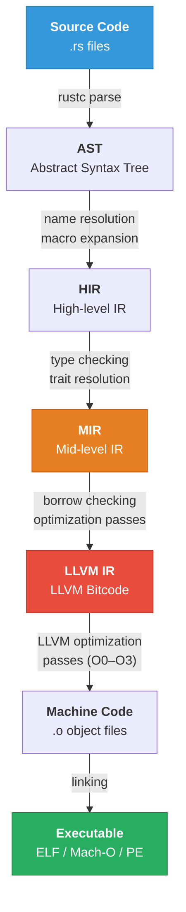

# 1. From Source to Assembly 🟢

> **What you'll learn:**
> - The complete Rust compilation pipeline: Source → AST → HIR → MIR → LLVM IR → Machine Code
> - How to use `cargo-show-asm` and Compiler Explorer (Godbolt) to inspect generated assembly
> - How to empirically verify that "zero-cost abstractions" are *actually* zero-cost
> - Reading x86-64 assembly output well enough to spot unnecessary instructions

---

## The Rust Compilation Pipeline

Every Rust source file passes through **six distinct representations** before becoming machine code. Understanding this pipeline is the foundation of everything in this book — you cannot force the compiler's hand if you don't know which stage is responsible for a given transformation.



### Stage-by-Stage Breakdown

| Stage | Representation | Who Owns It | Key Transformations |
|-------|---------------|-------------|---------------------|
| **Parse** | AST | `rustc` frontend | Tokenization, syntax validation, macro expansion |
| **Lower** | HIR | `rustc` frontend | Name resolution, `use` imports, desugaring (`for` → `loop + match`) |
| **Analyze** | MIR | `rustc` middle | Type checking, trait resolution, borrow checking, monomorphization |
| **Codegen** | LLVM IR | `rustc` backend → LLVM | Translation to SSA form, Rust-specific optimizations |
| **Optimize** | LLVM IR (optimized) | LLVM | Inlining, loop unrolling, vectorization, dead code elimination |
| **Emit** | Machine Code | LLVM backend | Instruction selection, register allocation, scheduling |
| **Link** | Executable | `lld` / system linker | Symbol resolution, relocation, final binary layout |

The critical insight: **Rust's borrow checker operates on MIR** (stage 3), but **performance-critical optimizations happen in LLVM** (stages 5-6). When you're debugging a performance issue, you need to inspect the *output* of LLVM, not the Rust source.

---

## Setting Up Assembly Inspection

### `cargo-show-asm` (Recommended)

The most ergonomic way to inspect assembly for a specific function:

```bash
# Install once
cargo install cargo-show-asm

# Show assembly for a specific function in release mode
cargo asm --release my_crate::my_function

# Show LLVM IR instead of assembly
cargo asm --release --llvm my_crate::my_function

# Show MIR
cargo asm --release --mir my_crate::my_function

# List all available functions (useful for finding mangled names)
cargo asm --release --lib
```

### Compiler Explorer (Godbolt)

For quick experiments without a full project:

1. Go to [godbolt.org](https://godbolt.org/)
2. Select **Rust** as the language
3. Choose a compiler version (e.g., `rustc 1.82.0`)
4. Add compiler flags: `-C opt-level=3`
5. Write your function and observe the assembly output in real-time

> **Tip:** On Godbolt, add `-C target-cpu=native` (or a specific target like `-C target-cpu=x86-64-v3`) to see what instructions LLVM selects when it knows your CPU supports AVX2.

### Raw `rustc` Flags

For maximum control, you can ask `rustc` to emit intermediate representations directly:

```bash
# Emit LLVM IR
RUSTFLAGS="--emit=llvm-ir" cargo build --release

# Emit assembly
RUSTFLAGS="--emit=asm" cargo build --release

# Emit MIR (Rust's mid-level IR)
RUSTFLAGS="-Z dump-mir=all" cargo +nightly build --release
# Warning: this dumps a LOT of files

# Find the output
find target/release -name "*.ll"   # LLVM IR files
find target/release -name "*.s"    # Assembly files
```

---

## Your First Assembly Inspection: Verifying Zero-Cost Abstractions

Rust's core promise is that abstractions like iterators, closures, and `Option` compile down to the same machine code as hand-written C. Let's prove it.

### Example: Iterator vs. Manual Loop

Consider these two implementations of summing a slice:

```rust
// Version A: Idiomatic iterator chain
pub fn sum_iter(data: &[u64]) -> u64 {
    data.iter().sum()
}

// Version B: Manual C-style loop
pub fn sum_manual(data: &[u64]) -> u64 {
    let mut total: u64 = 0;
    let mut i = 0;
    while i < data.len() {
        total += data[i]; // Note: this has a bounds check!
        i += 1;
    }
    total
}
```

Running `cargo asm --release my_crate::sum_iter` and `cargo asm --release my_crate::sum_manual` on x86-64 with `-C opt-level=3`, both produce **identical assembly** (or nearly so):

```asm
; Both compile to something like:
example::sum_iter:
        test    rsi, rsi          ; if len == 0
        je      .LBB0_1           ; return 0
        xor     eax, eax          ; total = 0
.LBB0_3:
        add     rax, qword ptr [rdi] ; total += *ptr
        add     rdi, 8            ; ptr += 1 (8 bytes per u64)
        dec     rsi               ; len -= 1
        jne     .LBB0_3           ; loop if len > 0
        ret
.LBB0_1:
        xor     eax, eax
        ret
```

**Key observations:**
- No bounds checks in the loop body (LLVM proved they're unnecessary)
- No iterator struct on the stack (completely optimized away)
- The `sum_manual` version *also* had its bounds check on `data[i]` elided because LLVM proved `i < data.len()` from the `while` condition
- Both reduce to the same tight loop: `add`, `add`, `dec`, `jne`

This is the zero-cost abstraction in action. But it doesn't always work this cleanly...

### When Zero-Cost Breaks: A Cautionary Example

```rust
// ⚠️ POOR OPTIMIZATION: HashMap iteration order is non-deterministic
// and LLVM cannot vectorize the access pattern
use std::collections::HashMap;

pub fn sum_hashmap_values(map: &HashMap<String, u64>) -> u64 {
    map.values().sum()
}
```

Compare this to a `Vec` version:

```rust
// ✅ FIX: Use a Vec for sequential, cache-friendly, vectorizable iteration
pub fn sum_vec_values(data: &[u64]) -> u64 {
    data.iter().sum()
}
```

The `Vec` version will auto-vectorize (processing 4 or 8 `u64` values per instruction with SSE2/AVX2). The `HashMap` version cannot — its memory layout involves pointer chasing through hash buckets, which is fundamentally non-vectorizable.

> Zero-cost abstractions mean the *abstraction layer* is free. The *data structure choice* is never free. A `HashMap` iterator is zero-cost *as an iterator* — but the underlying memory access pattern kills performance.

---

## Reading x86-64 Assembly: A Survival Guide

You don't need to be an assembly expert, but you need to recognize patterns. Here's a minimum viable vocabulary:

### Essential Instructions

| Instruction | Meaning | Performance Note |
|-------------|---------|-----------------|
| `mov rax, [rdi]` | Load from memory into register | 4-cycle L1 hit, 200+ cycle main memory miss |
| `add rax, rbx` | Integer addition | 1 cycle, fully pipelined |
| `imul rax, rbx` | Integer multiply | 3 cycles latency |
| `cmp rax, rbx` | Compare (sets flags) | 1 cycle |
| `je .label` | Jump if equal | ~0 cycles if predicted correctly, ~15 cycles mispredicted |
| `call func` | Function call | Pushes return address, jumps |
| `ret` | Return from function | Pops return address, jumps |
| `test rax, rax` | Bitwise AND (for zero-check) | Common pattern for `if x == 0` |
| `xor eax, eax` | Zero a register | Shorter/faster than `mov eax, 0` |

### Red Flags in Assembly Output

When inspecting generated code, watch for:

| Pattern | What It Means | Severity |
|---------|--------------|----------|
| `call core::panicking::panic_bounds_check` | Un-elided bounds check | 🔴 High — in a hot loop, this is catastrophic |
| `call __rust_alloc` | Heap allocation | 🔴 High — allocations in hot loops destroy performance |
| `call std::rt::lang_start` | Runtime init (expected in `main`) | 🟢 Normal |
| `ud2` | Unreachable code marker | 🟢 Normal — LLVM uses this for provably unreachable paths |
| Multiple `jcc` (conditional jumps) in tight loop | Branch-heavy code | 🟡 Medium — branch predictor may struggle |
| `vaddpd` / `vmulps` / `vfmadd...` | SIMD/vector instructions | ✅ Good — auto-vectorization is working |

### Calling Convention Quick Reference (System V AMD64)

On Linux and macOS (System V ABI), function arguments are passed in registers:

| Argument # | Integer / Pointer | Float |
|-----------|------------------|-------|
| 1st | `rdi` | `xmm0` |
| 2nd | `rsi` | `xmm1` |
| 3rd | `rdx` | `xmm2` |
| 4th | `rcx` | `xmm3` |
| 5th | `r8` | `xmm4` |
| 6th | `r9` | `xmm5` |
| Return value | `rax` | `xmm0` |

Slices (`&[T]`) are passed as **two arguments**: a pointer in `rdi` and a length in `rsi`. This is why you see `test rsi, rsi` at the start of slice functions — it's checking if the length is zero.

---

## Practical Demonstration: Spotting a Bounds Check

Let's look at a realistic example where LLVM fails to elide a bounds check:

```rust
// ⚠️ POOR OPTIMIZATION: LLVM cannot prove that `a` and `b` have the same length
pub fn dot_product_bad(a: &[f64], b: &[f64]) -> f64 {
    let mut sum = 0.0;
    for i in 0..a.len() {
        sum += a[i] * b[i];  // b[i] has a bounds check!
    }
    sum
}
```

In the assembly output, you'll see something like:

```asm
; Inside the loop:
        cmp     rcx, r8           ; compare i with b.len()
        jae     .LBB0_panic       ; if i >= b.len(), panic!
        ; ... actual multiply-add ...
```

That `cmp` + `jae` pair is a **bounds check**. LLVM knows `i < a.len()` from the loop bound, but it can't prove `i < b.len()` because the two slices might have different lengths.

```rust
// ✅ FIX: Assert equal lengths up front, giving LLVM the proof it needs
pub fn dot_product_good(a: &[f64], b: &[f64]) -> f64 {
    assert_eq!(a.len(), b.len());  // Panic once here, not in the loop
    let mut sum = 0.0;
    for i in 0..a.len() {
        sum += a[i] * b[i];  // No bounds check — LLVM knows b.len() == a.len()
    }
    sum
}
```

Or even better — use iterators, which carry the bounds proof implicitly:

```rust
// ✅ FIX: zip() produces pairs — no bounds checks needed at all
pub fn dot_product_idiomatic(a: &[f64], b: &[f64]) -> f64 {
    a.iter().zip(b.iter()).map(|(x, y)| x * y).sum()
}
```

The `zip()` version typically produces the tightest assembly because LLVM knows the iteration count is `min(a.len(), b.len())` and both accesses are within bounds by construction.

---

## The `#[no_mangle]` and `pub extern "C"` Tricks

When using `cargo asm` or Godbolt, Rust's name mangling can make it hard to find your function. Two tricks:

```rust
// Trick 1: #[no_mangle] — preserves the exact function name in the symbol table
#[no_mangle]
pub fn my_hot_function(data: &[f64]) -> f64 {
    data.iter().sum()
}

// Trick 2: pub extern "C" — also prevents mangling and uses C calling convention
pub extern "C" fn my_hot_function_c(ptr: *const f64, len: usize) -> f64 {
    let data = unsafe { std::slice::from_raw_parts(ptr, len) };
    data.iter().sum()
}
```

In Godbolt, `#[no_mangle]` functions appear with their exact name instead of cryptic hashes.

---

## Optimization Levels Compared

Rust's optimization levels map to LLVM passes:

| Rust Level | LLVM Level | What Happens | Use Case |
|-----------|-----------|-------------|----------|
| `opt-level = 0` | `-O0` | No optimization. Debug info preserved. 1:1 source mapping. | Development, debugging |
| `opt-level = 1` | `-O1` | Basic optimizations: dead code, simple inlining, constant folding | Fast compile, slightly better perf |
| `opt-level = 2` | `-O2` | Full optimization: loop unrolling, vectorization, GVN, LICM | General release builds |
| `opt-level = 3` | `-O3` | Aggressive: more unrolling, SLP vectorization, speculative devirt | Performance-critical binaries |
| `opt-level = "s"` | `-Os` | Size-optimized: like `-O2` but prefers smaller code | Embedded, WASM |
| `opt-level = "z"` | `-Oz` | Minimal size: disables loop unrolling entirely | Extremely constrained binaries |

> **Warning:** `opt-level = 3` is not always faster than `opt-level = 2`. Aggressive unrolling can cause **instruction cache (i-cache) pressure** that makes the code *slower* on average. Always measure.

---

<details>
<summary><strong>🏋️ Exercise: Assembly Detective</strong> (click to expand)</summary>

**Challenge:** Write three versions of a function that finds the maximum value in a `&[i32]`:

1. Using `iter().max()`
2. Using a manual `for` loop with indexing (`data[i]`)
3. Using a manual `for` loop with `get_unchecked` (unsafe)

For each version:

1. Inspect the assembly output using `cargo asm --release` or Godbolt
2. Count the number of instructions in the hot loop body
3. Determine whether LLVM elided the bounds checks in version 2
4. Compare the assembly of all three — are they identical?

**Bonus:** Try with `opt-level = 2` vs `opt-level = 3`. Does the loop unrolling change?

<details>
<summary>🔑 Solution</summary>

```rust
// Version 1: Idiomatic iterator
#[no_mangle]
pub fn max_iter(data: &[i32]) -> Option<i32> {
    // .copied() converts &i32 to i32, letting max() work on values
    data.iter().copied().max()
}

// Version 2: Manual loop with indexing
#[no_mangle]
pub fn max_manual(data: &[i32]) -> Option<i32> {
    if data.is_empty() {
        return None;
    }
    let mut best = data[0];
    // Starting at 1 and using `i < data.len()` gives LLVM the proof
    // that `data[i]` is in bounds — the bounds check should be elided
    for i in 1..data.len() {
        if data[i] > best {
            best = data[i];
        }
    }
    Some(best)
}

// Version 3: Unsafe — no bounds checks at all
#[no_mangle]
pub fn max_unsafe(data: &[i32]) -> Option<i32> {
    if data.is_empty() {
        return None;
    }
    let mut best = unsafe { *data.get_unchecked(0) };
    for i in 1..data.len() {
        // SAFETY: i is bounded by data.len(), so this is in-bounds
        let val = unsafe { *data.get_unchecked(i) };
        if val > best {
            best = val;
        }
    }
    Some(best)
}
```

**Expected results with `-C opt-level=3`:**

All three versions produce **nearly identical assembly**. LLVM elides the bounds checks in version 2 because the loop bound `i < data.len()` proves `data[i]` is valid. The `unsafe` version (3) gives identical output — confirming that the bounds checks were already gone.

With `-C opt-level=3`, LLVM will often **vectorize** the max computation using `pmaxsd` (packed maximum of signed doublewords), processing 4 `i32` values per instruction with SSE4.1, or 8 with AVX2:

```asm
; Vectorized loop body (SSE4.1):
.LBB0_4:
        movdqu  xmm1, xmmword ptr [rdi + 4*rcx]  ; load 4 i32s
        pmaxsd  xmm0, xmm1                         ; parallel max of 4 pairs
        add     rcx, 4                              ; advance by 4 elements
        cmp     rcx, rax
        jb      .LBB0_4
```

The key insight: **for simple patterns like `max()`, the iterator version, manual loop, and unsafe version all compile to the same SIMD code.** The zero-cost abstraction holds. Use `unsafe` only when LLVM genuinely can't prove bounds — not as a premature optimization.

</details>
</details>

---

> **Key Takeaways**
>
> 1. **Rust compiles through six stages**: Source → AST → HIR → MIR → LLVM IR → Machine Code. Performance bugs live in the LLVM IR → Machine Code stage.
> 2. **`cargo-show-asm` and Godbolt are your primary diagnostic tools.** Learn to use them as instinctively as you use `println!` for debugging.
> 3. **Zero-cost abstractions are real — but conditional.** They depend on LLVM having enough information to optimize. Iterators naturally carry bounds proofs; manual indexing sometimes doesn't.
> 4. **Bounds checks are the #1 "hidden cost" in Rust.** Use `assert!`, `zip()`, or iterator patterns to help LLVM elide them. Reach for `unsafe` only after verifying the check survived optimization.
> 5. **Always measure against a baseline.** `opt-level = 3` is not universally faster than `opt-level = 2`. Verify with assembly inspection *and* benchmarks.

> **See also:**
> - [Chapter 2: MIR and the Optimizer](ch02-mir-and-the-optimizer.md) — Deep dive into what happens *before* LLVM gets the code
> - [Ecosystem, Tooling & Profiling](../tooling-profiling-book/src/SUMMARY.md) — Benchmarking methodology with Criterion and flamegraphs
> - [Memory Management](../memory-management-book/src/SUMMARY.md) — Understanding data layout, which directly affects how LLVM optimizes memory access
