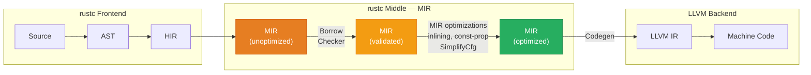

# 2. MIR and the Optimizer 🟡

> **What you'll learn:**
> - How to read and interpret Mid-level IR (MIR) output from `rustc`
> - What monomorphization is, why it matters for performance, and how it interacts with codegen units
> - How `rustc` performs drop elaboration and NLL borrow checking on MIR
> - How to identify bounds checks and other optimization opportunities that LLVM *cannot* fix because the information was lost before LLVM received the code

---

## What Is MIR?

**Mid-level Intermediate Representation (MIR)** is `rustc`'s internal representation of your program after type checking and before LLVM codegen. It's a **control-flow graph (CFG)** composed of basic blocks, where each block contains a sequence of statements and ends with a terminator (branch, return, call, or panic).

MIR exists because Rust needs a representation that is:

1. **Low-level enough** for the borrow checker to reason about every move, borrow, and drop
2. **High-level enough** to preserve Rust's type information (generics, trait objects, lifetimes)
3. **Suitable for Rust-specific optimizations** that LLVM can't perform (drop elaboration, match exhaustiveness, const-evaluation)



### MIR vs. LLVM IR — What's the Difference?

| Aspect | MIR | LLVM IR |
|--------|-----|---------|
| **Owner** | `rustc` | LLVM |
| **Type system** | Full Rust types (generics, lifetimes, trait bounds) | Flat types (`i32`, `i64`, `ptr`, `{i32, i64}`) |
| **Panics** | Explicit panic edges in CFG | Just `call` to panic functions |
| **Drops** | Explicit `drop()` statements with drop flags | Nothing — already lowered to `call __rust_dealloc` |
| **Generics** | Preserved until monomorphization | Not present — each monomorphization is a separate function |
| **Borrow checking** | Runs on MIR | N/A |
| **Optimizations** | ~15 passes (SimplifyCfg, ConstProp, Inline, etc.) | ~300+ passes (the full LLVM pipeline) |

---

## Dumping MIR

### Method 1: `cargo asm --mir` (Easiest)

```bash
cargo asm --release --mir my_crate::my_function
```

### Method 2: Compiler Flags (Full Control)

```bash
# Dump optimized MIR for all functions (generates many files)
RUSTFLAGS="-Z dump-mir=all" cargo +nightly build --release

# Dump MIR for a specific function
RUSTFLAGS="-Z dump-mir=my_function" cargo +nightly build --release

# Find the output
find target/release -name "*.mir" | head -20
```

### Method 3: Godbolt

On [godbolt.org](https://godbolt.org/), select Rust and add the compiler flag `--emit=mir` — the output pane will show MIR instead of assembly.

---

## Reading MIR: A Guided Tour

Let's trace through a simple function:

```rust
pub fn add_one(x: i32) -> i32 {
    x + 1
}
```

The optimized MIR looks approximately like:

```
fn add_one(_1: i32) -> i32 {
    let mut _0: i32;               // return place

    bb0: {
        _0 = Add(_1, const 1_i32); // _0 = x + 1
        return;                     // return _0
    }
}
```

### MIR Vocabulary

| Element | Meaning |
|---------|---------|
| `_0` | The return place (always `_0` in MIR) |
| `_1`, `_2`, ... | Function arguments and local variables |
| `bb0`, `bb1`, ... | Basic blocks — straight-line code ending in a terminator |
| `Add(_1, const 1_i32)` | An rvalue — a computation |
| `return` | A terminator — transfers control |
| `switchInt(_3)` | A terminator — branch based on integer value |
| `drop(_2)` | A terminator — drop a value (calls destructor) |
| `assert(!move _4, ...)` | A terminator — panic if condition is false |

### A More Complex Example

```rust
pub fn safe_divide(a: i32, b: i32) -> Option<i32> {
    if b == 0 {
        None
    } else {
        Some(a / b)
    }
}
```

Unoptimized MIR:

```
fn safe_divide(_1: i32, _2: i32) -> Option<i32> {
    let mut _0: Option<i32>;
    let _3: bool;
    let _4: i32;

    bb0: {
        _3 = Eq(_2, const 0_i32);
        switchInt(move _3) -> [0: bb2, otherwise: bb1];
    }

    bb1: {
        _0 = Option::<i32>::None;
        goto -> bb3;
    }

    bb2: {
        _4 = Div(_1, _2);          // Note: no assert for division by zero!
                                     // rustc already proved b != 0 from the branch
        _0 = Option::<i32>::Some(move _4);
        goto -> bb3;
    }

    bb3: {
        return;
    }
}
```

Notice how the CFG makes the control flow explicit — there's no ambiguity about which instructions execute in which order or under which conditions.

---

## Monomorphization: Where Generics Explode

**Monomorphization** is the process of creating specialized copies of generic functions for each concrete type they're used with. This happens during MIR → LLVM IR codegen.

```rust
pub fn double<T: std::ops::Mul<Output = T> + Copy>(x: T) -> T {
    x * x
}

fn main() {
    let _ = double(3_i32);    // Generates: double::<i32>
    let _ = double(3.14_f64); // Generates: double::<f64>
    let _ = double(7_u8);     // Generates: double::<u8>
}
```

After monomorphization, LLVM sees **three separate functions** with no generics:

```
fn double_i32(x: i32) -> i32 { x * x }
fn double_f64(x: f64) -> f64 { x * x }
fn double_u8(x: u8) -> u8 { x * x }
```

### Monomorphization's Performance Implications

| Aspect | Impact |
|--------|--------|
| **Runtime speed** | ✅ Excellent — each specialization gets fully optimized for its type |
| **Compile time** | ⚠️ Can be slow — N types × M generic functions = N×M copies to optimize |
| **Binary size** | ⚠️ Can bloat — each specialization is a separate function in the binary |
| **Instruction cache** | ⚠️ More code = more i-cache pressure at runtime |

This is the **generics tax**: you get maximum runtime performance at the cost of compile time and binary size. If binary size matters (embedded, WASM), consider using `dyn Trait` (dynamic dispatch via vtable) instead.

```rust
// Monomorphized — fast, but generates N copies
fn process<T: Display>(item: T) { /* ... */ }

// Dynamic dispatch — one copy, but vtable indirection per call
fn process_dyn(item: &dyn Display) { /* ... */ }
```

---

## Drop Elaboration: The Invisible Destructor Code

One of MIR's most important jobs is **drop elaboration** — deciding exactly when and where destructors run, especially in the presence of `match`, `if let`, early returns, and panics.

```rust
pub fn maybe_use(s: String, keep: bool) -> Option<String> {
    if keep {
        Some(s)       // s is moved into Some — no drop needed
    } else {
        // s is NOT used on this path — it must be dropped here
        None
    }
}
```

In MIR, this generates explicit drop logic:

```
bb0: {
    switchInt(_2) -> [0: bb2, otherwise: bb1];
}

bb1: {
    _0 = Option::<String>::Some(move _1);  // move s into return value
    goto -> bb3;
}

bb2: {
    drop(_1) -> bb3;  // drop s, then goto bb3
}

bb3: {
    return;
}
```

The key insight: `rustc` inserts **drop terminators** on every code path where a value goes out of scope without being moved. LLVM then compiles these into calls to `__rust_dealloc` (for heap types) or does nothing (for `Copy` types).

### Drop Flags: When the Compiler Can't Decide Statically

Sometimes the compiler doesn't know at compile time whether a value has been moved:

```rust
pub fn conditional_move(v: Vec<i32>, flag: bool) -> Vec<i32> {
    let w;
    if flag {
        w = v;          // v is moved
    } else {
        w = Vec::new(); // v is NOT moved
    }
    // Was v moved or not? Depends on runtime value of `flag`.
    // rustc inserts a "drop flag" — a hidden boolean on the stack.
    w
}
```

In MIR, you'll see a hidden `_flag` variable that tracks whether `v` needs to be dropped. This adds one `cmp` + `jne` to the cleanup code — usually negligible, but visible in MIR dumps.

---

## MIR Optimizations: What `rustc` Does Before LLVM

Before handing off to LLVM, `rustc` runs its own optimization passes on MIR. These are critical because some information is **lost in translation to LLVM IR** and can never be recovered.

### Key MIR Optimization Passes

| Pass | Effect | Why It Matters |
|------|--------|---------------|
| **SimplifyCfg** | Merge/remove trivial basic blocks | Reduces graph complexity for all subsequent passes |
| **ConstProp** | Propagate known-constant values through the CFG | Eliminates dead branches at compile time |
| **Inline** | Inline small MIR functions (separate from LLVM inlining) | Enables further MIR optimizations across call boundaries |
| **SimplifyLocals** | Remove unused locals | Reduces stack frame size and helps LLVM's register allocator |
| **CopyProp** | Replace copies with direct references | Eliminates redundant `mov` instructions |
| **DeadStoreElimination** | Remove stores that are never read | Reduces memory traffic |
| **InstSimplify** | Simplify expressions (e.g., `x * 1 → x`) | Fewer operations for LLVM to process |
| **ReferencePropagation** | Propagate `&` references to eliminate intermediaries | Helps LLVM see through indirection |
| **DestinationPropagation** | Merge source and destination of copies | Reduces the number of stack slots |
| **NormalizeArrayLen** | Normalize array length calculations | Helps bounds-check elimination |

You can see all passes with:

```bash
RUSTFLAGS="-Z dump-mir-dir=./mir_dumps" cargo +nightly build --release
ls -la ./mir_dumps/ | head -30
```

Each function will have files like `my_func.003-SimplifyCfg.after.mir`, `my_func.007-ConstProp.after.mir`, etc., letting you trace how each pass transforms the code.

---

## Identifying Missed Optimizations: Bounds Checks That Survive

The most common "missed optimization" in Rust is a **bounds check that LLVM couldn't elide**. In MIR, bounds checks appear as `assert` terminators:

```rust
// ⚠️ POOR OPTIMIZATION: Two separate slices, LLVM can't prove equal length
pub fn pairwise_add_bad(a: &[f64], b: &[f64], out: &mut [f64]) {
    for i in 0..a.len() {
        out[i] = a[i] + b[i]; // Three bounds checks per iteration!
    }
}
```

The MIR for the loop body contains **three** `assert` terminators:

```
bb3: {
    _8 = Len((*_1));               // a.len()
    _9 = Lt(_7, _8);               // i < a.len()
    assert(move _9, "index out of bounds") -> bb4;
}
bb4: {
    _10 = Len((*_2));              // b.len()
    _11 = Lt(_7, _10);            // i < b.len()
    assert(move _11, "index out of bounds") -> bb5;
}
bb5: {
    _12 = Len((*_3));              // out.len()
    _13 = Lt(_7, _12);            // i < out.len()
    assert(move _13, "index out of bounds") -> bb6;
}
```

Each `assert` becomes a `cmp` + `jae` + `call panic` in the final assembly. In a tight inner loop, this is catastrophic.

```rust
// ✅ FIX: Assert lengths once, then use zip() to eliminate all checks
pub fn pairwise_add_good(a: &[f64], b: &[f64], out: &mut [f64]) {
    assert!(a.len() == b.len() && b.len() == out.len());
    for i in 0..a.len() {
        out[i] = a[i] + b[i]; // LLVM can now elide all three checks
    }
}

// ✅ EVEN BETTER: Use iterators — zero bounds checks by construction
pub fn pairwise_add_best(a: &[f64], b: &[f64], out: &mut [f64]) {
    for ((o, x), y) in out.iter_mut().zip(a.iter()).zip(b.iter()) {
        *o = x + y;
    }
}
```

### How to Check If Bounds Checks Survived

1. **In MIR:** Search for `assert(` terminators inside loops
2. **In Assembly:** Search for `call core::panicking::panic_bounds_check` inside the hot loop
3. **In LLVM IR:** Search for `call void @_ZN4core9panicking` inside the loop

If you see any of these in a hot loop, the check was **not** elided.

---

## Case Study: Why `chunks_exact` Is Faster Than `chunks`

A subtle but important example of how MIR-level information affects optimization:

```rust
// ⚠️ POOR OPTIMIZATION: last chunk might be shorter — prevents LLVM vectorization
pub fn process_chunks(data: &[f64]) -> f64 {
    let mut sum = 0.0;
    for chunk in data.chunks(4) {
        // chunk.len() might be < 4 for the last chunk!
        // LLVM must generate a scalar fallback, which can prevent
        // vectorization of the entire loop
        for &val in chunk {
            sum += val;
        }
    }
    sum
}

// ✅ FIX: chunks_exact guarantees every chunk is exactly N elements
pub fn process_chunks_exact(data: &[f64]) -> f64 {
    let mut sum = 0.0;
    for chunk in data.chunks_exact(4) {
        // chunk.len() is ALWAYS 4 — LLVM can fully vectorize
        for &val in chunk {
            sum += val;
        }
    }
    // Handle the remainder separately
    for &val in data.chunks_exact(4).remainder() {
        sum += val;
    }
    sum
}
```

The `chunks_exact` version gives LLVM a **guarantee** about the chunk size, which enables it to emit a tight vectorized loop using `vaddpd` (SIMD double-precision add) without a scalar fallback in the main loop body.

---

## Const Evaluation and MIR

`rustc` performs **constant evaluation** (const-eval) by literally *interpreting MIR*. The MIR interpreter (called Miri, which also has a standalone version for unsafe checking) executes MIR at compile time for `const` items and `const fn` evaluations.

```rust
const LOOKUP: [u32; 256] = {
    let mut table = [0u32; 256];
    let mut i = 0;
    while i < 256 {
        table[i] = (i as u32).wrapping_mul(0x1234_5678);
        i += 1;
    }
    table
};
// This entire 1KB table is computed at compile time by interpreting the MIR.
// The final binary contains only the precomputed table data — no runtime init.
```

This is powerful because it means complex initialization logic runs at compile time, producing a static data section that the CPU can load directly without executing any code at runtime.

---

<details>
<summary><strong>🏋️ Exercise: MIR Archaeologist</strong> (click to expand)</summary>

**Challenge:** Consider this function that computes the sum of absolute values:

```rust
pub fn sum_abs(data: &[i32]) -> i32 {
    let mut sum = 0i32;
    for i in 0..data.len() {
        let val = data[i];
        if val < 0 {
            sum += -val;
        } else {
            sum += val;
        }
    }
    sum
}
```

1. Dump the MIR using `cargo asm --release --mir` or `RUSTFLAGS="-Z dump-mir=sum_abs"` on nightly
2. Identify: How many basic blocks are in the loop body? Is there a bounds check `assert`?
3. Now rewrite the function using `data.iter()` and `.abs()`. Dump MIR again — how does the CFG change?
4. Check the final assembly: does either version auto-vectorize? On x86-64 with `-C opt-level=3 -C target-cpu=x86-64-v3`, you should see `vpabsd` (packed absolute value for 32-bit integers)

<details>
<summary>🔑 Solution</summary>

```rust
// Original — manual indexing
#[no_mangle]
pub fn sum_abs_v1(data: &[i32]) -> i32 {
    let mut sum = 0i32;
    for i in 0..data.len() {
        // MIR will have an assert(_X, "index out of bounds") here.
        // LLVM should elide it because i < data.len() from the loop bound.
        let val = data[i];
        if val < 0 {
            sum += -val;
        } else {
            sum += val;
        }
    }
    sum
}

// Rewritten — iterator + abs()
#[no_mangle]
pub fn sum_abs_v2(data: &[i32]) -> i32 {
    // .abs() on i32 uses a branchless sequence:
    //   (x ^ (x >> 31)) - (x >> 31)
    // which LLVM recognizes and can vectorize to vpabsd
    data.iter().map(|x| x.abs()).sum()
}
```

**MIR comparison:**

- `sum_abs_v1`: The loop CFG has ~6 basic blocks: entry, bounds check assert, load, compare < 0, negate branch, add branch, loop back edge. The bounds check `assert` is present in MIR but will be elided by LLVM.
- `sum_abs_v2`: The iterator version has a simpler CFG — no bounds check at all (iterator pattern), and the `abs()` call is inlined to arithmetic.

**Assembly comparison (x86-64-v3, opt-level=3):**

Both versions auto-vectorize. The key instructions in the hot loop:

```asm
; Vectorized loop body:
        vmovdqu  ymm1, ymmword ptr [rdi + 4*rcx]  ; load 8 i32s
        vpabsd   ymm1, ymm1                         ; absolute value of all 8
        vpaddd   ymm0, ymm0, ymm1                   ; sum += abs(values)
        add      rcx, 8
        cmp      rcx, rax
        jb       .loop
```

`vpabsd` is the **packed absolute value** instruction for 32-bit integers — it computes `abs()` on 8 values simultaneously (AVX2, 256-bit registers). Both versions produce this same vectorized output, confirming the zero-cost abstraction holds.

The iterator version (`sum_abs_v2`) typically produces *slightly* cleaner MIR (fewer basic blocks), but the final assembly is identical. The takeaway: **iterators don't just match manual loops — they sometimes make vectorization easier because there's less CFG complexity for LLVM to analyze.**

</details>
</details>

---

> **Key Takeaways**
>
> 1. **MIR is `rustc`'s mid-level IR** — it's where borrow checking, drop elaboration, monomorphization, and Rust-specific optimizations happen *before* LLVM ever sees the code.
> 2. **Monomorphization creates specialized copies** of generic functions — great for performance, costly for compile time and binary size.
> 3. **Drop elaboration inserts destructor calls** on every code path where values go out of scope. Drop flags handle uncertain ownership at minimal runtime cost.
> 4. **Bounds checks appear as `assert` terminators in MIR.** LLVM *often* elides them, but not always — slicing with `zip()`, `chunks_exact()`, and pre-asserted lengths helps.
> 5. **`chunks_exact()` is not just cleaner than `chunks()`** — it gives LLVM fundamentally better information for vectorization.
> 6. **Const evaluation works by interpreting MIR at compile time** — precompute lookup tables and initialization logic with zero runtime cost.

> **See also:**
> - [Chapter 1: From Source to Assembly](ch01-from-source-to-assembly.md) — Assembly reading skills for verifying MIR-level changes
> - [Chapter 3: Codegen Units and LTO](ch03-codegen-units-and-lto.md) — How monomorphized functions are partitioned across CGUs
> - [Rust Memory Management](../memory-management-book/src/SUMMARY.md) — Drop semantics and ownership rules that MIR encodes
