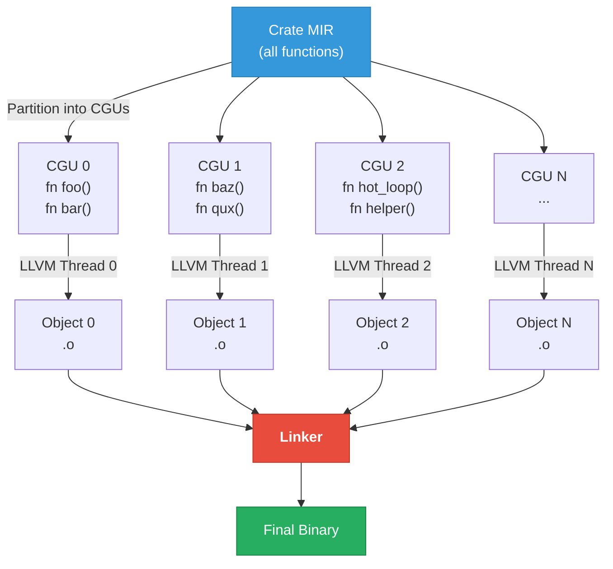
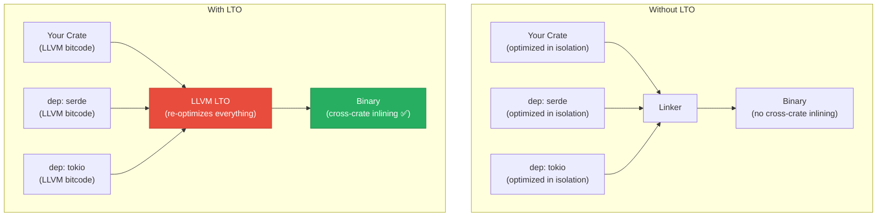

# 3. Codegen Units (CGUs) and LTO 🟡

> **What you'll learn:**
> - What codegen units are, how `rustc` partitions your crate into them, and why the default count hurts performance
> - The difference between Thin LTO and Fat LTO — when each is appropriate, and the compile-time vs runtime trade-off
> - How `codegen-units = 1` enables cross-function optimization within a single crate
> - How to configure `Cargo.toml` profiles for maximum optimization of release binaries

---

## What Are Codegen Units?

When `rustc` compiles a crate, it doesn't send the entire crate to LLVM as a single blob. Instead, it **partitions** the monomorphized MIR into multiple independent chunks called **Codegen Units (CGUs)**. Each CGU is compiled by LLVM independently and in parallel.



### Why Multiple CGUs?

**Compile speed.** LLVM's optimization passes are the slowest part of compilation. By splitting the crate into N CGUs, `rustc` can run N LLVM instances in parallel, utilizing all CPU cores during codegen.

### The Trade-Off

Multiple CGUs **prevent cross-function optimization** within a crate. LLVM optimizes each CGU independently — it cannot inline a function from CGU 0 into a call site in CGU 1, because it never sees both at the same time.

| Setting | Default (debug) | Default (release) | Maximum Optimization |
|---------|-----------------|-------------------|---------------------|
| `codegen-units` | 256 | 16 | 1 |
| Compile speed | ✅ Fast | ✅ Moderate | ⚠️ Slow |
| Cross-function inlining | ❌ Limited | ❌ Limited | ✅ Full |
| LLVM optimization scope | Per-CGU | Per-CGU | Whole crate |

### The Default Hurts Performance

The default of 16 CGUs in release mode is a compromise. For most applications it's fine. But for performance-critical code, it means:

- `foo()` and `bar()` might land in different CGUs, preventing LLVM from inlining `bar` into `foo`
- Constant propagation can't flow across CGU boundaries
- LLVM can't see that `helper()` is only called from `hot_loop()` (both must be in the same CGU for that observation)

```toml
# Cargo.toml — Maximum single-crate optimization
[profile.release]
opt-level = 3
codegen-units = 1    # Everything in one CGU — full optimization scope
```

### Measuring the Impact

```bash
# Build with default CGUs and measure
cargo build --release --timings
# Check: target/cargo-timings/cargo-timing.html

# Build with codegen-units = 1
# Add to Cargo.toml [profile.release] section, then rebuild
cargo build --release --timings
```

Typical measurements on a medium-sized crate (~10K lines):

| Metric | `codegen-units = 16` | `codegen-units = 1` |
|--------|---------------------|---------------------|
| Compile time | 12s | 28s |
| Binary size | 3.2 MB | 2.8 MB |
| Hot loop throughput | 1.00x (baseline) | 1.05–1.15x |

The 5–15% throughput improvement comes from cross-function inlining and better constant propagation. The binary shrinks because duplicate functions (emitted in multiple CGUs as needed) are deduplicated.

---

## Link-Time Optimization (LTO)

`codegen-units = 1` only helps within a single crate. But most Rust projects depend on dozens of crates — `serde`, `tokio`, `regex`, etc. Functions from those crates are compiled separately and linked in as object files. LLVM *never saw* them alongside your code.

**Link-Time Optimization (LTO)** solves this by running LLVM optimization passes again *at link time*, across all crates simultaneously.



### Fat LTO vs. Thin LTO

Rust supports two LTO modes:

| Aspect | **Fat LTO** (`lto = true` or `lto = "fat"`) | **Thin LTO** (`lto = "thin"`) |
|--------|----------------------------------------------|-------------------------------|
| **How it works** | Merges ALL LLVM bitcode into a single module, runs full optimization passes | Keeps modules separate but shares summaries; optimizes with cross-module info |
| **Cross-crate inlining** | ✅ Full | ✅ Full (via function summaries) |
| **Dead code elimination** | ✅ Aggressive | ✅ Good |
| **Compile time** | 🔴 Slowest — single-threaded merge and optimization | 🟡 Moderate — parallel optimization with shared summaries |
| **Memory usage** | 🔴 Very high — entire program in one LLVM module | 🟡 Moderate |
| **Binary size reduction** | ✅ Best (typically 10–25% smaller) | ✅ Good (typically 5–15% smaller) |
| **Runtime improvement** | ✅ Best (typically 5–20% faster on hot paths) | ✅ Good (typically 3–15% faster) |
| **When to use** | Final release builds where you want maximum performance | CI/CD release builds; good perf-to-compile-time ratio |

### Configuring LTO in `Cargo.toml`

```toml
# ── Maximum performance (slow compile) ────────────
[profile.release]
opt-level = 3
lto = true            # Fat LTO — merge everything
codegen-units = 1     # Single CGU for maximum inlining scope
panic = "abort"       # Removes unwinding tables — smaller binary, slight perf gain

# ── Balanced (good for CI) ─────────────────────────
[profile.release]
opt-level = 3
lto = "thin"          # Thin LTO — parallel, still cross-crate
codegen-units = 1

# ── Fast compile (development release) ────────────
[profile.release]
opt-level = 2
lto = false           # No LTO
codegen-units = 16    # Parallel codegen

# ── Custom profile for benchmarking ────────────────
[profile.bench]
inherits = "release"
opt-level = 3
lto = true
codegen-units = 1
debug = true          # Keep debug info for profiling (perf, Instruments)
```

### `panic = "abort"` — The Often-Forgotten Optimization

By default, Rust uses **stack unwinding** for panics — this means the compiler generates unwinding tables (`.eh_frame` section) and landing pads at every function that could panic. These tables:

1. Increase binary size by 10–20%
2. Can interfere with LLVM optimizations (the optimizer must preserve unwinding semantics)
3. Are never used in programs that don't catch panics

Setting `panic = "abort"` tells the compiler to call `abort()` on panic instead of unwinding. This eliminates all unwinding tables and lets LLVM optimize more aggressively.

> **Warning:** `panic = "abort"` means you cannot use `std::panic::catch_unwind`. If any dependency relies on catching panics (rare but possible), this will cause `abort` instead.

---

## How LTO Enables Cross-Crate Inlining: A Concrete Example

Consider a crate that uses `serde_json::from_str`:

```rust
use serde::Deserialize;

#[derive(Deserialize)]
struct Config {
    port: u16,
    host: String,
}

pub fn parse_config(json: &str) -> Result<Config, serde_json::Error> {
    serde_json::from_str(json)
}
```

**Without LTO:** `serde_json::from_str` is a `call` instruction to an opaque symbol. LLVM can't see inside it, can't inline it, and can't specialize it for `Config`.

**With Fat LTO:** LLVM sees the *entire* `serde_json` bitcode alongside your crate. It can:

1. Inline the deserialization path for `Config`
2. Constant-fold the field lookup (it knows there are exactly two fields: `port` and `host`)
3. Eliminate dead branches in the deserializer (it knows the concrete type)
4. Potentially vectorize string parsing operations

The result: a `parse_config` function that is dramatically faster than the generic deserialization path, because LLVM specializes it for the exact type.

---

## CGU Partitioning Strategy

How does `rustc` decide which functions go into which CGU? The algorithm aims to:

1. **Balance size**: Each CGU should contain roughly the same amount of LLVM IR (so parallel threads finish at the same time)
2. **Preserve locality**: Functions that call each other should be in the same CGU when possible
3. **Handle monomorphizations**: A generic function `fn foo<T>()` instantiated for 10 types creates 10 monomorphizations, which might be spread across CGUs

You can see the partitioning with:

```bash
RUSTFLAGS="-Z print-mono-items=lazy" cargo +nightly build --release 2>&1 | head -50
```

This shows every monomorphized item and which CGU it was assigned to.

### When CGU Partitioning Goes Wrong

Sometimes `rustc` places a hot function and its callee in different CGUs, preventing inlining. Symptoms:

- Assembly shows a `call` instruction where you expected the function to be inlined
- Profile data shows the callee prominently even though it's tiny
- The function has `#[inline]` but it doesn't seem to help

The fix: `codegen-units = 1` (brute force) or `#[inline(always)]` (targeted). See Chapter 5 for the full inlining story.

---

## The `strip` and `debug` Settings

Two more `Cargo.toml` settings that affect binary size and profiling:

```toml
[profile.release]
strip = true          # Strip all symbols and debug info from the binary
debug = false         # Don't generate debug info (default for release)

# For profiling — you want debug info but still want optimizations:
[profile.release]
strip = false
debug = 2             # Full debug info (DWARF)
# This lets `perf` and Instruments show source-level annotations
```

| Setting | Binary Size Impact | Profiling | Debugging |
|---------|--------------------|-----------|-----------|
| `strip = true, debug = false` | Smallest | ❌ No symbols | ❌ No debug |
| `strip = false, debug = false` | Small | ✅ Function names | ❌ No source mapping |
| `strip = false, debug = 2` | Largest (~2-5x) | ✅ Full source annotations | ✅ Full gdb/lldb support |

---

<details>
<summary><strong>🏋️ Exercise: LTO Impact Measurement</strong> (click to expand)</summary>

**Challenge:** Create a benchmark that demonstrates the impact of LTO and CGU settings.

1. Create a workspace with two crates: a library (`mathlib`) with a `dot_product` function, and a binary (`bench`) that calls it in a hot loop
2. Benchmark with four configurations:
   - `lto = false`, `codegen-units = 16` (fast compile)
   - `lto = false`, `codegen-units = 1`
   - `lto = "thin"`, `codegen-units = 1`
   - `lto = true`, `codegen-units = 1` (max optimization)
3. For each, inspect the assembly of the hot loop in the binary — does `dot_product` get inlined?
4. Record compile times and benchmark results in a table

<details>
<summary>🔑 Solution</summary>

**`mathlib/src/lib.rs`:**

```rust
/// Dot product of two f64 slices.
/// Note: NOT marked #[inline] — we rely on LTO for cross-crate inlining.
pub fn dot_product(a: &[f64], b: &[f64]) -> f64 {
    a.iter()
        .zip(b.iter())
        .map(|(x, y)| x * y)
        .sum()
}
```

**`bench/src/main.rs`:**

```rust
use std::hint::black_box;
use std::time::Instant;

fn main() {
    // Create test data — large enough to be meaningful
    let n = 1_000_000;
    let a: Vec<f64> = (0..n).map(|i| i as f64 * 0.001).collect();
    let b: Vec<f64> = (0..n).map(|i| (n - i) as f64 * 0.001).collect();

    // Warm up
    for _ in 0..10 {
        black_box(mathlib::dot_product(black_box(&a), black_box(&b)));
    }

    // Benchmark
    let iterations = 100;
    let start = Instant::now();
    for _ in 0..iterations {
        black_box(mathlib::dot_product(black_box(&a), black_box(&b)));
    }
    let elapsed = start.elapsed();

    println!(
        "dot_product({n} elements) × {iterations}: {:.2?} total, {:.2?} per call",
        elapsed,
        elapsed / iterations,
    );
}
```

**`Cargo.toml` (workspace root):**

```toml
[workspace]
members = ["mathlib", "bench"]

# Configuration 1: Fast compile (baseline)
# [profile.release]
# opt-level = 3

# Configuration 2: Single CGU, no LTO
# [profile.release]
# opt-level = 3
# codegen-units = 1

# Configuration 3: Thin LTO
# [profile.release]
# opt-level = 3
# lto = "thin"
# codegen-units = 1

# Configuration 4: Fat LTO (max optimization)
# [profile.release]
# opt-level = 3
# lto = true
# codegen-units = 1
# panic = "abort"
```

**Expected results (approximate, varies by CPU):**

| Configuration | Compile Time | Per-Call Time | Inlined? |
|--------------|-------------|---------------|----------|
| No LTO, 16 CGUs | ~2s | ~580μs | ❌ `call mathlib::dot_product` visible |
| No LTO, 1 CGU | ~3s | ~570μs | ❌ Still separate crate |
| Thin LTO, 1 CGU | ~5s | ~480μs | ✅ Inlined and vectorized |
| Fat LTO, 1 CGU | ~8s | ~460μs | ✅ Inlined, vectorized, and further optimized |

**Verification:** Run `cargo asm --release bench::main` with each configuration. With LTO enabled, you should see the `dot_product` loop body *inside* `main` — no `call` instruction. Without LTO, you'll see `call mathlib::dot_product`.

The 15–20% speedup from LTO comes from:
- Inlining eliminates call/return overhead
- LLVM can vectorize across the call boundary
- LLVM can see that `a` and `b` don't alias (both are local `Vec`s)

</details>
</details>

---

> **Key Takeaways**
>
> 1. **Codegen units trade runtime performance for compile speed.** The default of 16 CGUs in release mode prevents cross-function inlining within a crate. Set `codegen-units = 1` for maximum optimization.
> 2. **LTO enables cross-crate inlining.** Without it, LLVM can never see inside your dependencies. Fat LTO gives maximum optimization; Thin LTO offers a good compile-time compromise.
> 3. **`panic = "abort"` is a free optimization** if your program doesn't catch panics. It removes ~10-20% of binary bloat from unwinding tables.
> 4. **For maximum performance:** `opt-level = 3` + `lto = true` + `codegen-units = 1` + `panic = "abort"`. Accept the compile-time hit for final release builds.
> 5. **Always keep a profiling-friendly profile** with `debug = 2` and `strip = false` for investigating hot paths with `perf` or Instruments.

> **See also:**
> - [Chapter 2: MIR and the Optimizer](ch02-mir-and-the-optimizer.md) — Monomorphization creates the function copies that CGUs partition
> - [Chapter 4: PGO and BOLT](ch04-pgo-and-bolt.md) — The next level of optimization after LTO
> - [Chapter 5: Target CPUs and Inlining](ch05-target-cpus-and-inlining.md) — When inlining helps and when it hurts
> - [Ecosystem, Tooling & Profiling](../tooling-profiling-book/src/SUMMARY.md) — Cargo profiles and build configuration
