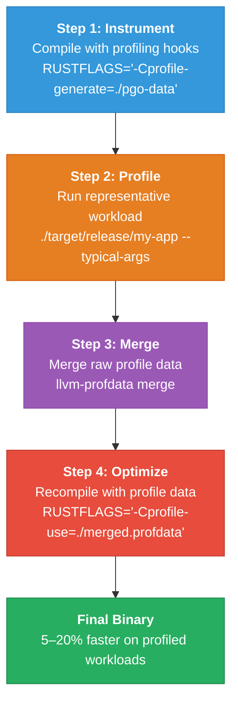
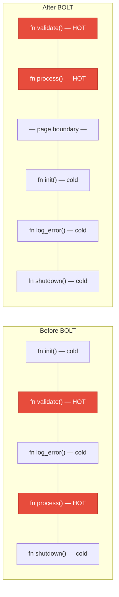

# 4. Profile-Guided Optimization (PGO) and BOLT 🔴

> **What you'll learn:**
> - Why static optimization is fundamentally limited and how runtime profiling data unlocks better code generation
> - The complete PGO workflow for Rust: instrumenting, profiling, and recompiling
> - How LLVM uses profile data to make branching, inlining, and code layout decisions
> - Post-link binary layout optimization with LLVM BOLT for the final 5–15% of cache-friendly speedup

---

## Why Static Optimization Has a Ceiling

Everything we've covered so far — `opt-level = 3`, LTO, `codegen-units = 1` — is **static optimization**. The compiler makes its best guesses about your program's behavior based on source code analysis alone. But LLVM has no idea:

- Which branches are taken 99% of the time (hot paths)
- Which functions are called millions of times per second vs. once at startup
- Which loop trip counts are typical (10 iterations? 10 million?)
- Which virtual dispatch targets are most common

Without this information, LLVM makes conservative choices:

| Decision | Without Profile Data | With Profile Data |
|----------|---------------------|-------------------|
| Branch layout | Assumes 50/50 | Puts hot path in fall-through position |
| Inlining | Uses size heuristics | Inlines hot callees aggressively, skips cold ones |
| Loop unrolling | Uses fixed thresholds | Unrolls based on actual trip counts |
| Function ordering | Alphabetical / link order | Hot functions clustered together for i-cache locality |
| Basic block layout | Topological order | Hot blocks sequential, cold blocks moved to end |

**Profile-Guided Optimization (PGO)** tells the compiler exactly what your program does at runtime, eliminating guesswork.



---

## CPU Architecture Primer: Why Branch Layout Matters

Before diving into the PGO workflow, you need to understand *why* profile data helps at the hardware level.

### The Branch Predictor

Modern CPUs don't execute instructions one at a time — they maintain a **pipeline** of 15–20 stages. When the CPU encounters a conditional branch (`if`, `match`, loop condition), it must *predict* which way the branch goes and speculatively execute down that path. If it guesses wrong, it must **flush the pipeline** and restart — costing ~15–20 cycles.

```
Pipeline stages (simplified):
  Fetch → Decode → Execute → Memory → Writeback

Branch at stage 3:
  PREDICT TAKEN → continue executing speculatively...
    ✅ Correct prediction: 0 penalty
    ❌ Misprediction: flush everything after → ~15 cycle penalty
```

The branch predictor uses **history tables** — it remembers what each branch did the last N times and predicts accordingly. For branches that go the same way 99% of the time, the predictor is nearly perfect. For branches that alternate unpredictably, it's terrible.

### How PGO Helps Branch Prediction

PGO doesn't change the branch predictor hardware — but it changes **code layout** so that:

1. **The hot path falls through** (no branch taken). Taken branches are slightly slower than fall-through because they redirect the instruction fetch unit.
2. **Cold code is moved to `.cold` sections**. Error handling, panic paths, and rare branches are pushed to separate pages that don't pollute the instruction cache.
3. **Hot basic blocks are sequential in memory**. The CPU's L1 instruction cache prefetcher reads ahead linearly — if hot blocks are adjacent, prefetching works perfectly.

### The Instruction Cache (I-Cache)

Your CPU's L1 instruction cache is typically **32 KB** (per core). If your hot path spans more than 32 KB of instructions, you get i-cache misses — each costing ~4 cycles for L2, ~15 cycles for L3.

PGO + BOLT rearrange the binary so hot code fits in as few cache lines as possible. This is often worth more than any algorithmic optimization for large codebases.

---

## The Complete PGO Workflow for Rust

### Prerequisites

```bash
# You need llvm-profdata — install via rustup
rustup component add llvm-tools-preview

# Find where rustup put the tools
LLVM_TOOLS=$(rustc --print sysroot)/lib/rustlib/$(rustc -vV | sed -n 's|host: ||p')/bin
echo "Tools at: $LLVM_TOOLS"
# You should see: llvm-profdata, llvm-cov, etc.

# Add to PATH (or use full path in commands below)
export PATH="$LLVM_TOOLS:$PATH"
```

### Step 1: Build the Instrumented Binary

```bash
# Clean previous builds
cargo clean

# Build with profiling instrumentation
# This inserts counter increments at every branch point and function entry
RUSTFLAGS="-Cprofile-generate=/tmp/pgo-data" \
    cargo build --release

# The resulting binary is ~2-3x slower than normal due to instrumentation overhead
# but functionally identical
```

> **Important:** The instrumented binary must be built with the same `Cargo.toml` settings (LTO, codegen-units, etc.) that you'll use for the final build. PGO profile data is tied to the specific code layout.

### Step 2: Run Representative Workloads

```bash
# Run your binary with TYPICAL inputs — not edge cases, not unit tests.
# The profile data should reflect your PRODUCTION workload as closely as possible.

# For a web server:
./target/release/my-server &
wrk -t4 -c100 -d60s http://localhost:8080/api/hot-endpoint
kill %1

# For a CLI tool:
./target/release/my-tool process --input real-production-data.bin

# For a library (write a benchmark binary):
./target/release/bench --iterations 10000
```

**Critical:** The quality of PGO depends entirely on **how representative your profiling workload is**. If you profile with toy inputs and deploy with production loads, PGO may make things *worse* — it will optimize for the wrong branches.

```bash
# After running, you'll see raw profile files:
ls /tmp/pgo-data/
# default_12345_0.profraw
# default_12345_1.profraw
# ...
```

### Step 3: Merge Profile Data

```bash
# Merge all raw profiles into a single optimized profile
llvm-profdata merge -o /tmp/pgo-data/merged.profdata /tmp/pgo-data/

# Verify the profile is valid
llvm-profdata show /tmp/pgo-data/merged.profdata | head -20
# Should show: Total functions, Maximum function count, etc.
```

### Step 4: Rebuild with Profile Data

```bash
# Clean and rebuild using the collected profile
cargo clean

RUSTFLAGS="-Cprofile-use=/tmp/pgo-data/merged.profdata -Cllvm-args=-pgo-warn-missing-function" \
    cargo build --release

# The -pgo-warn-missing-function flag warns about functions in the binary that
# weren't seen in the profile — these won't benefit from PGO
```

### Step 5: Verify and Benchmark

```bash
# Compare the PGO binary against the non-PGO baseline
# Use your preferred benchmarking tool (Criterion, hyperfine, etc.)

hyperfine \
    './target-no-pgo/release/my-tool process --input data.bin' \
    './target/release/my-tool process --input data.bin' \
    --warmup 5
```

---

## What PGO Changes in the Generated Code

Let's look at a concrete example:

```rust
pub fn classify(value: f64) -> &'static str {
    if value < 0.0 {
        "negative"           // Taken 1% of the time in production
    } else if value == 0.0 {
        "zero"               // Taken 0.01% of the time
    } else if value < 1.0 {
        "fractional"         // Taken 30% of the time
    } else {
        "large"              // Taken ~69% of the time (the HOT path)
    }
}
```

**Without PGO** — LLVM generates branches in source order:

```asm
; Without PGO: branches in source order
classify:
        ucomisd xmm0, xmm1          ; compare with 0.0
        jb      .negative            ; if < 0.0 → branch (TAKEN only 1%)
        je      .zero                ; if == 0.0 → branch (TAKEN only 0.01%)
        ucomisd xmm0, xmm2          ; compare with 1.0
        jb      .fractional          ; if < 1.0 → branch (TAKEN 30%)
        ; fall-through to "large"    ; 69% of the time, but we already did 3 comparisons!
```

**With PGO** — LLVM reorders branches so the hot path comes first:

```asm
; With PGO: hot path first, cold paths moved to .cold section
classify:
        ucomisd xmm0, xmm2          ; compare with 1.0 FIRST
        jb      .less_than_one       ; branch only 31% of the time
        ; fall-through: "large"      ; 69% — no branch, no prediction needed
        lea     rax, [rip + .Llarge]
        ret

.less_than_one:
        ucomisd xmm0, xmm1          ; compare with 0.0
        jb      .negative            ; 1% — almost never taken
        je      .zero                ; 0.01% — almost never taken
        ; fall-through: "fractional"
        lea     rax, [rip + .Lfractional]
        ret

; These are in a .cold section — won't pollute i-cache
.cold:
.negative:
        lea     rax, [rip + .Lnegative]
        ret
.zero:
        lea     rax, [rip + .Lzero]
        ret
```

The PGO version:
- **Tests the most likely condition first** (value ≥ 1.0)
- **Falls through on the hot path** (no branch taken for the 69% case)
- **Moves rare paths to `.cold` sections** (won't evict hot code from i-cache)

---

## PGO for Inlining Decisions

PGO also provides LLVM with **call frequency data**. Without PGO, LLVM uses a size-based heuristic: "if the callee is smaller than X instructions, inline it." With PGO, LLVM knows:

- This function is called 10 million times per second → **aggressively inline**
- This function is called once at startup → **don't bother inlining**, save i-cache space

```rust
// Called on every request — PGO will cause LLVM to aggressively inline this
fn validate_token(token: &str) -> bool {
    token.len() >= 32 && token.starts_with("Bearer ")
}

// Called once at startup — PGO will tell LLVM to NOT inline this
fn load_configuration(path: &str) -> Config {
    // ... complex initialization ...
    # todo!()
}
```

Without PGO, LLVM might inline `load_configuration` (because it can) and skip inlining `validate_token` (because the size threshold was borderline). PGO corrects this.

---

## LLVM BOLT: Post-Link Binary Optimization

**BOLT** (Binary Optimization and Layout Tool) is an LLVM tool that operates on the *final linked binary*. While PGO optimizes at the LLVM IR level (before machine code generation), BOLT reorders the machine code *after* linking.

### What BOLT Does

1. **Function reordering**: Places hot functions adjacent in memory for i-cache locality
2. **Basic block reordering**: Within each function, moves hot blocks together and cold blocks to the end
3. **Function splitting**: Splits functions into hot and cold parts, placing cold parts in separate pages
4. **ICF (Identical Code Folding)**: Merges functions that compile to identical machine code



### BOLT Workflow

```bash
# Step 1: Build the binary with relocations preserved (required for BOLT)
RUSTFLAGS="-Clink-arg=-Wl,--emit-relocs" cargo build --release

# Step 2: Collect hardware performance counters with perf
# (Linux only — BOLT requires perf data or instrumented profiles)
perf record -e cycles:u -j any,u -o perf.data -- ./target/release/my-app --workload

# Step 3: Convert perf data to BOLT format
perf2bolt -p perf.data -o perf.fdata ./target/release/my-app

# Step 4: Run BOLT
llvm-bolt ./target/release/my-app \
    -o ./target/release/my-app.bolt \
    -data=perf.fdata \
    -reorder-blocks=ext-tsp \
    -reorder-functions=hfsort \
    -split-functions \
    -split-all-cold \
    -dyno-stats

# Step 5: Verify
./target/release/my-app.bolt --workload  # Should produce identical output
```

### When to Use BOLT

| Scenario | PGO Alone | PGO + BOLT |
|----------|-----------|------------|
| Small binary (< 1 MB code) | ✅ Sufficient | Minimal additional benefit |
| Medium binary (1–10 MB code) | ✅ Good | 🟡 +3–8% improvement |
| Large binary (> 10 MB code) | ✅ Good | ✅ **+5–15% improvement** (i-cache effect dominates) |
| Database, browser, compiler | Use both | ✅ Essential — huge i-cache working set |

BOLT gives the biggest gains when the binary's hot code doesn't fit in L1i cache (32 KB). For small Rust binaries, PGO alone is usually sufficient.

> **Platform note:** BOLT is primarily a Linux tool. On macOS, the equivalent workflow uses `dsymutil` and different perf tools, and BOLT support is experimental. On Windows, BOLT is not available — use PGO alone.

---

## Automating PGO in CI/CD

For production systems, PGO should be part of the build pipeline:

```yaml
# .github/workflows/release.yml (simplified)
name: PGO Release Build
on:
  push:
    tags: ["v*"]

jobs:
  pgo-build:
    runs-on: ubuntu-latest
    steps:
      - uses: actions/checkout@v4
      - uses: dtolnay/rust-toolchain@stable
        with:
          components: llvm-tools-preview

      # Step 1: Build instrumented binary
      - name: Build with instrumentation
        run: |
          RUSTFLAGS="-Cprofile-generate=/tmp/pgo-data" \
            cargo build --release

      # Step 2: Run profiling workload
      - name: Collect profile data
        run: |
          # Run your representative benchmark/workload
          ./target/release/my-app benchmark --duration 60s

      # Step 3: Merge profiles
      - name: Merge profile data
        run: |
          $(rustc --print sysroot)/lib/rustlib/$(rustc -vV | sed -n 's|host: ||p')/bin/llvm-profdata \
            merge -o /tmp/merged.profdata /tmp/pgo-data/

      # Step 4: Build optimized binary
      - name: Build with PGO
        run: |
          cargo clean
          RUSTFLAGS="-Cprofile-use=/tmp/merged.profdata" \
            cargo build --release

      # Step 5: Ship it
      - name: Upload artifact
        uses: actions/upload-artifact@v4
        with:
          name: my-app-pgo
          path: target/release/my-app
```

---

## Common PGO Pitfalls

| Pitfall | Symptom | Fix |
|---------|---------|-----|
| Non-representative workload | PGO binary slower on production traffic | Profile with production-like data, not unit tests |
| Stale profile data | Warnings about missing functions | Re-profile after significant code changes |
| Profile/binary mismatch | LLVM ignores the profile silently | Always build instrumented and final with same `Cargo.toml` settings |
| Instrumenting with different opt-level | Garbage profile data | Use the same `opt-level` for both builds |
| Forgetting to `cargo clean` before final build | Cached artifacts skip PGO | Always `cargo clean` between instrumented and optimized builds |

---

<details>
<summary><strong>🏋️ Exercise: PGO a JSON Parser</strong> (click to expand)</summary>

**Challenge:** Build a command-line JSON statistics tool that reads a JSON file and counts the number of objects, arrays, strings, numbers, booleans, and nulls.

1. Write the tool using `serde_json::Value` and recursive traversal
2. Generate a large test file (~100 MB of JSON)
3. Build a baseline release binary (no PGO)
4. Follow the full PGO workflow to create an optimized binary
5. Benchmark both with `hyperfine` and report the speedup
6. **Bonus:** Try PGO + Fat LTO + `codegen-units = 1` vs PGO alone

<details>
<summary>🔑 Solution</summary>

**`src/main.rs`:**

```rust
use serde_json::Value;
use std::fs;
use std::io::Read;

#[derive(Default, Debug)]
struct Stats {
    objects: u64,
    arrays: u64,
    strings: u64,
    numbers: u64,
    booleans: u64,
    nulls: u64,
}

fn count_values(value: &Value, stats: &mut Stats) {
    match value {
        Value::Null => stats.nulls += 1,
        Value::Bool(_) => stats.booleans += 1,
        Value::Number(_) => stats.numbers += 1,
        Value::String(_) => stats.strings += 1,
        Value::Array(arr) => {
            stats.arrays += 1;
            for item in arr {
                count_values(item, stats);
            }
        }
        Value::Object(obj) => {
            stats.objects += 1;
            for (_key, val) in obj {
                count_values(val, stats);
            }
        }
    }
}

fn main() {
    let path = std::env::args().nth(1).expect("Usage: json-stats <file>");
    let mut contents = String::new();
    fs::File::open(&path)
        .expect("Failed to open file")
        .read_to_string(&mut contents)
        .expect("Failed to read file");

    let value: Value = serde_json::from_str(&contents).expect("Invalid JSON");
    let mut stats = Stats::default();
    count_values(&value, &mut stats);

    println!("{stats:#?}");
}
```

**`Cargo.toml`:**

```toml
[package]
name = "json-stats"
version = "0.1.0"
edition = "2021"

[dependencies]
serde_json = "1"

[profile.release]
opt-level = 3
lto = true
codegen-units = 1
panic = "abort"
```

**Generate test data:**

```bash
# Generate ~100 MB of JSON using Python
python3 -c "
import json, random, string
def gen(depth=0):
    if depth > 4: return random.choice([42, 3.14, True, False, None, 'hello'])
    t = random.choices(['obj','arr','str','num','bool','null'], weights=[3,3,2,2,1,1])[0]
    if t == 'obj': return {(''.join(random.choices(string.ascii_lowercase, k=5))): gen(depth+1) for _ in range(random.randint(2,8))}
    if t == 'arr': return [gen(depth+1) for _ in range(random.randint(2,10))]
    if t == 'str': return ''.join(random.choices(string.ascii_letters, k=random.randint(5,50)))
    if t == 'num': return random.uniform(-1000, 1000)
    if t == 'bool': return random.choice([True, False])
    return None
data = [gen() for _ in range(50000)]
print(json.dumps(data))
" > test_data.json
ls -lh test_data.json
```

**PGO workflow:**

```bash
# Step 1: Baseline
cargo build --release
hyperfine './target/release/json-stats test_data.json' --warmup 3

# Step 2: Instrument
cargo clean
RUSTFLAGS="-Cprofile-generate=/tmp/pgo-json" cargo build --release

# Step 3: Profile (run 3 times for good coverage)
./target/release/json-stats test_data.json
./target/release/json-stats test_data.json
./target/release/json-stats test_data.json

# Step 4: Merge
$(rustc --print sysroot)/lib/rustlib/$(rustc -vV | sed -n 's|host: ||p')/bin/llvm-profdata \
    merge -o /tmp/pgo-json/merged.profdata /tmp/pgo-json/

# Step 5: Optimize
cargo clean
RUSTFLAGS="-Cprofile-use=/tmp/pgo-json/merged.profdata" cargo build --release

# Step 6: Compare
hyperfine \
    --warmup 3 \
    -n 'baseline' './target-baseline/release/json-stats test_data.json' \
    -n 'pgo+lto' './target/release/json-stats test_data.json'
```

**Expected results:**

For a JSON parsing workload, PGO + Fat LTO typically yields:
- **10–20% faster** than a standard release build
- The gain comes primarily from optimized branch layout in `serde_json`'s parsing state machine
- LTO allows `serde_json`'s deserialization functions to be inlined into `count_values`, eliminating call overhead

</details>
</details>

---

> **Key Takeaways**
>
> 1. **PGO eliminates the compiler's guesswork** about runtime behavior. It provides actual branch frequencies, call counts, and loop trip counts — enabling dramatically better code layout decisions.
> 2. **The hot path should fall through** — taken branches are slightly slower than fall-through. PGO reorders basic blocks so the common case is the fall-through path.
> 3. **Cold code in `.cold` sections** prevents rarely-executed code (error paths, panics) from polluting the instruction cache.
> 4. **The quality of PGO is only as good as your profiling workload.** Non-representative profiles produce non-representative optimizations. Profile with production-like data.
> 5. **BOLT provides an additional 5–15% on large binaries** by reordering the machine code after linking. Most impactful when hot code exceeds the L1 instruction cache (32 KB).
> 6. **PGO + LTO + `codegen-units = 1` is the the stack** for maximum performance. Each layer addresses a different limitation.

> **See also:**
> - [Chapter 3: CGUs and LTO](ch03-codegen-units-and-lto.md) — LTO must be configured before PGO for maximum benefit
> - [Chapter 5: Target CPUs and Inlining](ch05-target-cpus-and-inlining.md) — PGO changes inlining decisions; understanding the baseline helps
> - [Ecosystem, Tooling & Profiling](../tooling-profiling-book/src/SUMMARY.md) — Profiling methodology and `perf`/flamegraph workflows
