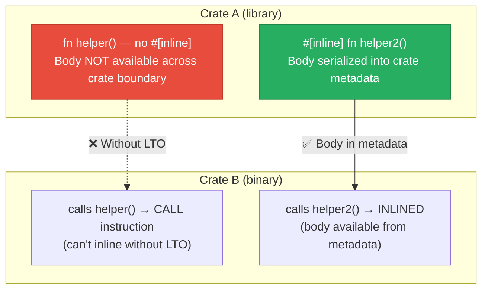

# 5. Target CPUs and Inlining 🟡

> **What you'll learn:**
> - How `target-cpu=native` unlocks CPU-specific instructions (AVX2, BMI2, POPCNT) that LLVM won't use by default
> - The precise semantics of `#[inline]`, `#[inline(always)]`, and `#[inline(never)]` — and when each is correct
> - Why excessive inlining causes instruction cache (i-cache) thrashing and makes hot paths slower
> - How to use assembly inspection to verify that inlining decisions are correct

---

## Target CPU Selection

By default, `rustc` targets **`x86-64` (baseline)** — the lowest common denominator for 64-bit x86 processors. This means no AVX, no AVX2, no BMI2, no POPCNT, no FMA. Just the original SSE2 instruction set from 2003.

```bash
# See what the default target supports:
rustc --print cfg | grep target_feature
# Output (typical):
# target_feature="fxsr"
# target_feature="sse"
# target_feature="sse2"
```

That's it. Two decades of CPU evolution ignored.

### `target-cpu=native` — Use Your CPU's Full Capabilities

```bash
# Compile for the exact CPU you're running on:
RUSTFLAGS="-C target-cpu=native" cargo build --release

# See what features are now enabled:
RUSTFLAGS="-C target-cpu=native" rustc --print cfg | grep target_feature
# Output on a modern Intel/AMD CPU:
# target_feature="aes"
# target_feature="avx"
# target_feature="avx2"
# target_feature="bmi1"
# target_feature="bmi2"
# target_feature="fma"
# target_feature="popcnt"
# target_feature="sse3"
# target_feature="sse4.1"
# target_feature="sse4.2"
# target_feature="ssse3"
# ... and more
```

### CPU Feature Levels

Instead of `native`, you can target a specific **x86-64 feature level** for cross-compilation:

| Target | ISA Extensions | Common CPUs |
|--------|---------------|-------------|
| `x86-64` (default) | SSE2 | Everything since 2003 |
| `x86-64-v2` | SSE4.2, POPCNT, CMPXCHG16B | Intel Nehalem+, AMD Bulldozer+ (~2009) |
| `x86-64-v3` | AVX2, BMI1/2, FMA, MOVBE | Intel Haswell+, AMD Zen+ (~2013) |
| `x86-64-v4` | AVX-512 (F, BW, CD, DQ, VL) | Intel Skylake-X+, AMD Zen 4+ (~2017) |

```bash
# Target AVX2-capable CPUs (covers ~95% of machines since 2015)
RUSTFLAGS="-C target-cpu=x86-64-v3" cargo build --release
```

### Impact on Auto-Vectorization

The target CPU **directly controls auto-vectorization width**. With `x86-64` (SSE2 only):

```asm
; Summing f64 values with SSE2 (128-bit registers):
.loop:
        addpd   xmm0, xmmword ptr [rdi]    ; add 2 f64 values at once
        add     rdi, 16
        cmp     rdi, rsi
        jne     .loop
```

With `target-cpu=x86-64-v3` (AVX2, 256-bit registers):

```asm
; Summing f64 values with AVX2 (256-bit registers):
.loop:
        vaddpd  ymm0, ymm0, ymmword ptr [rdi]  ; add 4 f64 values at once
        add     rdi, 32
        cmp     rdi, rsi
        jne     .loop
```

That's a **2x throughput improvement** on the same data, just from telling the compiler what the CPU supports.

### ARM Targets

For Apple Silicon (M1/M2/M3) and other ARM processors:

```bash
# Apple Silicon — enables NEON SIMD
RUSTFLAGS="-C target-cpu=apple-m1" cargo build --release

# Generic AArch64 with NEON (128-bit SIMD, comparable to SSE4)
RUSTFLAGS="-C target-cpu=generic" cargo build --release --target aarch64-unknown-linux-gnu
```

ARM NEON provides 128-bit vector registers (similar to SSE4.2), and newer ARM CPUs support SVE/SVE2 with up to 2048-bit vectors.

---

## `Cargo.toml` Configuration

Instead of setting `RUSTFLAGS` every time, configure it in `Cargo.toml` or `.cargo/config.toml`:

```toml
# .cargo/config.toml — applies to ALL builds in this workspace

[target.x86_64-unknown-linux-gnu]
rustflags = ["-C", "target-cpu=x86-64-v3"]

[target.aarch64-unknown-linux-gnu]
rustflags = ["-C", "target-cpu=generic"]

# Or target every platform at once (less precise):
# [build]
# rustflags = ["-C", "target-cpu=native"]
```

> **Warning:** If you set `target-cpu=native` in `.cargo/config.toml` and commit it, CI machines and other developers may get builds tuned for the *wrong* CPU. For libraries, only set target CPU in deployment-specific configs, not in the repo.

---

## The Inlining System

Inlining replaces a `call` instruction with the body of the called function at the call site. This is one of the most impactful optimizations because it:

1. **Eliminates call/return overhead** (typically ~5 cycles for the `call` + `ret` + stack frame)
2. **Enables further optimizations** — once the function bodies are merged, LLVM can do constant propagation, dead code elimination, and vectorization across what were previously opaque call boundaries
3. **Removes indirect branch penalty** — `call` instructions can cause branch predictor misses if the call site is cold

### How LLVM Decides Whether to Inline

LLVM uses a **cost model** that weighs:

| Factor | Favors Inlining | Opposes Inlining |
|--------|-----------------|------------------|
| Function size | Small functions (< ~100 IR instructions) | Large functions |
| Call frequency | Hot call sites (with PGO) | Cold call sites |
| Static vs. dynamic dispatch | Static `fn()` calls | `dyn Trait` calls (indirect) |
| Number of call sites | Few call sites (inline doesn't bloat much) | Many call sites (would duplicate a lot) |
| Recursion | Non-recursive | Recursive (can't fully inline) |
| AlwaysInline attribute | `#[inline(always)]` | `#[inline(never)]` |
| Cross-crate | Only possible with LTO or `#[inline]` | Without LTO, can't see callee body |

### The Three Inline Attributes

```rust
/// `#[inline]` — HINT to LLVM.
/// Makes the function body available for inlining across crate boundaries
/// (by emitting it in metadata), but does NOT force inlining.
/// LLVM may still decide not to inline.
#[inline]
pub fn small_helper(x: i32) -> i32 {
    x + 1
}

/// `#[inline(always)]` — FORCE inlining at every call site.
/// LLVM will inline this even if its cost model says "too big".
/// Use sparingly — overuse causes code bloat.
#[inline(always)]
pub fn critical_hot_path(x: f64) -> f64 {
    x * x + 2.0 * x + 1.0
}

/// `#[inline(never)]` — PREVENT inlining.
/// Useful for:
/// 1. Cold error-handling paths (don't bloat the hot path)
/// 2. Functions you want to see in profiler output (inlined functions disappear from profiles)
/// 3. Preventing code bloat from large functions called from many sites
#[inline(never)]
pub fn handle_error(err: &str) -> ! {
    eprintln!("Fatal error: {err}");
    std::process::exit(1);
}
```

### Critical Detail: `#[inline]` Is About Cross-Crate Visibility

Within a single crate (and with `codegen-units = 1`), LLVM can inline any function — `#[inline]` is unnecessary. The attribute's primary purpose is **cross-crate inlining without LTO**.



| Scenario | Inlining Possible? |
|----------|-------------------|
| Same crate, same CGU | ✅ Always (LLVM sees both) |
| Same crate, different CGU | ❌ No (separate LLVM instances) |
| Same crate, `codegen-units = 1` | ✅ Always |
| Cross-crate, no `#[inline]`, no LTO | ❌ No |
| Cross-crate, `#[inline]`, no LTO | ✅ Yes (body in metadata) |
| Cross-crate, LTO enabled | ✅ Always (LLVM sees all crates) |

---

## When Inlining Hurts: I-Cache Thrashing

Inlining is not always beneficial. Consider:

```rust
// ⚠️ POOR OPTIMIZATION: This large function is called from 50 different sites.
// #[inline(always)] will duplicate 500+ instructions at each site,
// bloating the binary by ~25KB and thrashing the instruction cache.
#[inline(always)]  // DON'T DO THIS for large functions!
pub fn complex_validation(input: &str) -> Result<ParsedData, ValidationError> {
    // 200 lines of parsing, regex matching, UTF-8 validation...
    // Each call site gets a full copy of this code
    # todo!()
}
```

The problem: **instruction cache (L1i) is typically 32 KB per core**. If inlining causes your hot loop to span more than 32 KB of instructions, the CPU will thrash between cache lines, and every cache miss costs ~4 cycles (L2) or ~15 cycles (L3).

```rust
// ✅ FIX: Let LLVM decide (or explicitly prevent inlining for large functions)
#[inline(never)]
pub fn complex_validation(input: &str) -> Result<ParsedData, ValidationError> {
    // 200 lines of parsing logic...
    // One copy in the binary — the call instruction is cheaper than cache misses
    # todo!()
}
```

### How to Diagnose I-Cache Thrashing

On Linux:

```bash
# Count L1 instruction cache misses
perf stat -e L1-icache-load-misses,L1-icache-loads ./target/release/my-app

# If the miss rate is > 3-5%, you may have i-cache pressure
# A healthy rate is < 1%
```

On macOS:

```bash
# Use Instruments → Counters template → select "L1I cache miss" counter
```

### Rules of Thumb for Inlining

| Function Size | Call Frequency | Recommendation |
|--------------|---------------|----------------|
| Tiny (< 10 IR instructions) | Any | `#[inline]` for cross-crate, otherwise let LLVM decide |
| Small (10–50 IR instructions) | Hot | `#[inline]` for cross-crate; LLVM will decide within-crate |
| Small (10–50 IR instructions) | Cold | No attribute needed |
| Medium (50–200 IR instructions) | Very hot (inner loop) | Benchmark both ways; `#[inline(always)]` only if measured |
| Large (> 200 IR instructions) | Any | `#[inline(never)]` if called from hot paths at multiple sites |
| Error/panic paths | Always cold | `#[inline(never)]` or `#[cold]` — keep out of hot code |

### The `#[cold]` Attribute

```rust
/// Mark a function as unlikely to be called — LLVM moves it to the end of the
/// binary and avoids inlining it into hot code.
#[cold]
fn handle_rare_error() -> ! {
    panic!("This should never happen in normal execution");
}

pub fn process(data: &[u8]) -> Result<(), Error> {
    if data.is_empty() {
        handle_rare_error(); // LLVM moves this branch to .cold section
    }
    // ... hot path continues with minimal i-cache pollution ...
    # Ok(())
}
```

`#[cold]` doesn't prevent inlining directly, but it tells LLVM's cost model that this function is rarely called, which:

1. Prevents it from being inlined into hot callers
2. Moves its code to a separate section (`.text.unlikely` or `.cold`)
3. Adjusts branch prediction hints at call sites

---

## Verifying Inlining in Assembly

```bash
# Check if a function was inlined — if it doesn't appear as a symbol, it was inlined
cargo asm --release my_crate::caller_function

# Look for `call my_crate::callee_function` in the output
# If present → NOT inlined
# If absent → either inlined, or dead-code eliminated
```

On Godbolt, you can also check: if the callee function has no standalone assembly listing but its instructions appear inside the caller, it was inlined.

---

## Target Features for Specific Functions

Sometimes you want most of your code to target the baseline CPU (for portability) but want a specific hot function to use AVX2. Use `#[target_feature]`:

```rust
/// This function is compiled with AVX2 instructions regardless of the global target CPU.
/// It's the caller's responsibility to check cpuid before calling.
#[target_feature(enable = "avx2")]
unsafe fn sum_avx2(data: &[f64]) -> f64 {
    // LLVM will use 256-bit ymm registers and AVX2 instructions here
    data.iter().sum()
}

/// Safe wrapper that checks CPU features at runtime
pub fn sum_fast(data: &[f64]) -> f64 {
    #[cfg(target_arch = "x86_64")]
    {
        if is_x86_feature_detected!("avx2") {
            // SAFETY: We just verified AVX2 is available
            return unsafe { sum_avx2(data) };
        }
    }
    // Fallback: scalar/SSE2 path
    data.iter().sum()
}
```

The `is_x86_feature_detected!` macro checks the CPU's feature flags at runtime (via `cpuid`). The check is typically cached after the first call, so the overhead is negligible.

---

<details>
<summary><strong>🏋️ Exercise: Inlining Forensics</strong> (click to expand)</summary>

**Challenge:** Investigate the inlining behavior of a call chain:

```rust
// In crate `lib`:
pub fn outer(data: &[f64]) -> f64 {
    inner(data) + 1.0
}

fn inner(data: &[f64]) -> f64 {
    data.iter().map(|x| transform(*x)).sum()
}

fn transform(x: f64) -> f64 {
    (x * x + 1.0).sqrt()
}
```

1. Build with `codegen-units = 16`, no LTO. Inspect assembly for `outer` — is `inner` inlined? Is `transform` inlined?
2. Build with `codegen-units = 1`, no LTO. Compare.
3. Add `#[inline]` to `inner` and `transform`. Build cross-crate (from a binary that depends on this library), no LTO. Is `inner` inlined into the binary?
4. Build cross-crate with `lto = "thin"`. Compare.
5. Build cross-crate with `lto = true`. Compare.

Document what you see in each configuration.

<details>
<summary>🔑 Solution</summary>

```rust
// lib crate — lib.rs
// Starting point: no inline attributes

pub fn outer(data: &[f64]) -> f64 {
    inner(data) + 1.0
}

fn inner(data: &[f64]) -> f64 {
    data.iter().map(|x| transform(*x)).sum()
}

fn transform(x: f64) -> f64 {
    (x * x + 1.0).sqrt()
}
```

**Configuration 1: `codegen-units = 16`, no LTO**

```bash
cargo asm --release lib::outer
```

Results vary depending on CGU assignment, but typically:
- `transform` is inlined into `inner` (small function, same crate, likely same CGU)
- `inner` **may or may not** be inlined into `outer` — depends on whether they're in the same CGU
- If in different CGUs: `call lib::inner` visible in assembly

**Configuration 2: `codegen-units = 1`, no LTO**

```bash
# Cargo.toml: codegen-units = 1
cargo asm --release lib::outer
```

Results:
- Everything is in one CGU → LLVM sees all functions
- `transform` inlined into `inner`, `inner` inlined into `outer`
- `outer` contains the entire loop body — no `call` instructions
- The loop should auto-vectorize (`vsqrtpd` + `vfmadd...` with AVX2)

**Configuration 3: Cross-crate, `#[inline]`, no LTO**

```rust
// Modified lib.rs
#[inline]
pub fn outer(data: &[f64]) -> f64 { inner(data) + 1.0 }

#[inline]
fn inner(data: &[f64]) -> f64 { data.iter().map(|x| transform(*x)).sum() }

#[inline]
fn transform(x: f64) -> f64 { (x * x + 1.0).sqrt() }
```

From the binary crate:
- `outer` is available for inlining (body in metadata due to `#[inline]`)
- `inner` and `transform` are pulled transitively
- LLVM **may** inline the entire chain — but `#[inline]` is only a hint
- With small functions like these, LLVM typically does inline everything

**Configuration 4: Cross-crate, `lto = "thin"`**

- LTO makes all function bodies available regardless of `#[inline]`
- Full inlining chain: `outer` → `inner` → `transform` all merged
- Thin LTO processes crates in parallel with shared summaries

**Configuration 5: Cross-crate, `lto = true` (Fat LTO)**

- Identical to Thin LTO in terms of inlining for this example
- Entire program in one LLVM module → maximum optimization scope
- For this small example, results are identical to Thin LTO
- Difference shows on larger programs where Fat LTO can see more global context

**Key observation:** For a within-crate chain like this, `codegen-units = 1` is sufficient. `#[inline]` and LTO only matter for the **cross-crate** case. If `outer`, `inner`, and `transform` are in different crates, LTO becomes essential.

</details>
</details>

---

> **Key Takeaways**
>
> 1. **`target-cpu=native` is the easiest performance win in Rust.** It unlocks AVX2, FMA, POPCNT and other instructions that can double throughput on vectorizable workloads.
> 2. **`#[inline]` is about cross-crate visibility**, not about forcing inlining. Within a single CGU, LLVM already decides inlining optimally.
> 3. **`#[inline(always)]` is a blunt instrument.** Use it only for tiny, latency-critical functions where you've measured the impact. For most code, let LLVM decide.
> 4. **Excessive inlining causes i-cache thrashing.** Monitor L1i cache miss rates with `perf stat`. If miss rates exceed 3-5%, you're likely over-inlining.
> 5. **`#[cold]` and `#[inline(never)]` protect hot paths** from code bloat. Use them on error handlers, logging, and rare branches.
> 6. **`#[target_feature(enable = "avx2")]`** lets you use advanced instructions on specific functions while keeping the rest of your code portable.

> **See also:**
> - [Chapter 3: CGUs and LTO](ch03-codegen-units-and-lto.md) — LTO is the cross-crate inlining enabler
> - [Chapter 6: SIMD and `std::arch`](ch06-simd-and-std-arch.md) — Manual SIMD when auto-vectorization isn't enough
> - [Chapter 4: PGO and BOLT](ch04-pgo-and-bolt.md) — PGO provides LLVM with call frequency data for better inlining decisions
