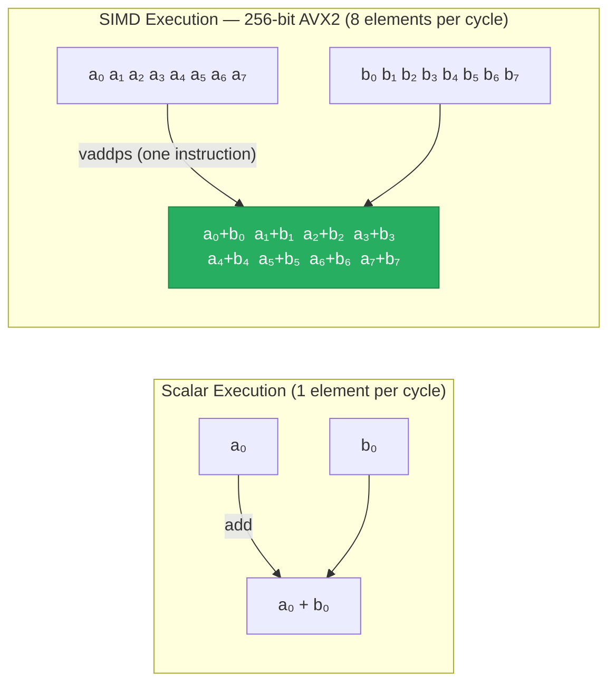
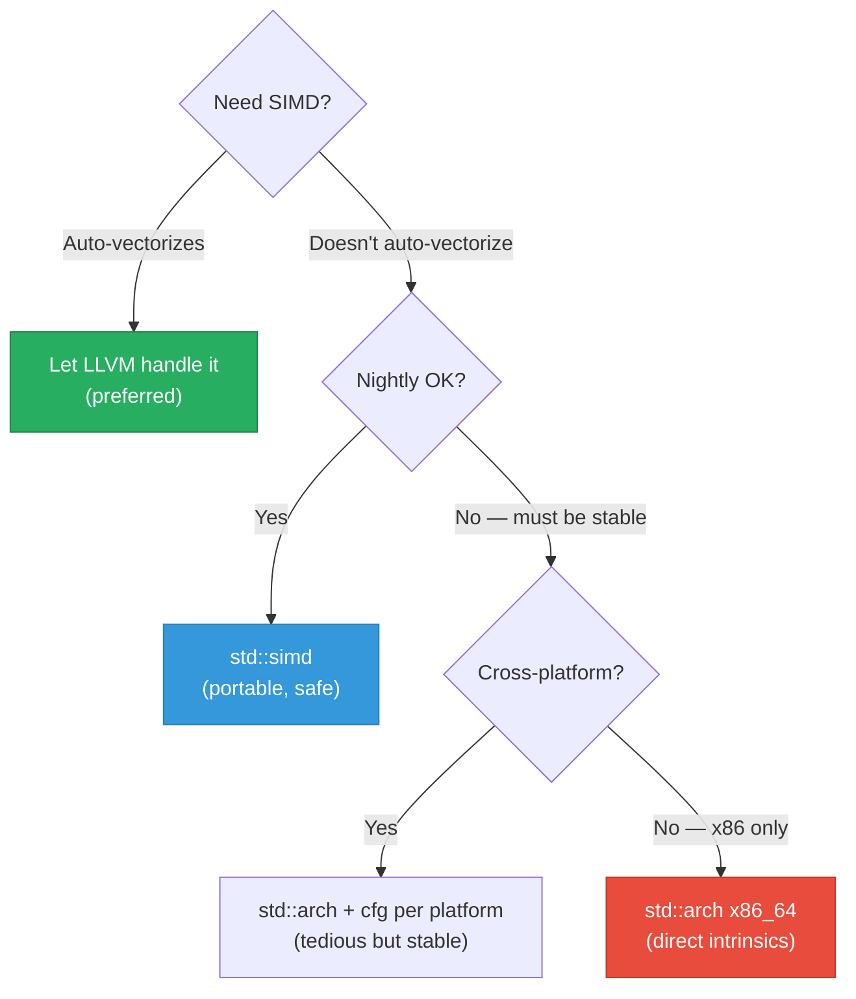

# 6. SIMD and `std::arch` 🔴

> **What you'll learn:**
> - What SIMD is, how vector registers work, and why auto-vectorization has fundamental limitations
> - How to use `std::arch` (stable) to write explicit SIMD code with Intel intrinsics (SSE, AVX2, AVX-512) and ARM NEON
> - How to use `std::simd` / `portable_simd` (nightly) for cross-platform SIMD that doesn't lock you into one architecture
> - Data alignment requirements for SIMD loads and stores, and how to handle remainders safely

---

## What Is SIMD?

**Single Instruction, Multiple Data (SIMD)** is a CPU capability that processes multiple data elements with a single instruction. Instead of adding two numbers, you add two *vectors* of numbers in the same number of clock cycles.



### SIMD Register Widths

| ISA Extension | Register Width | f32 per Reg | f64 per Reg | i32 per Reg |
|--------------|---------------|-------------|-------------|-------------|
| SSE2 (2001) | 128-bit (`xmm0`–`xmm15`) | 4 | 2 | 4 |
| AVX2 (2013) | 256-bit (`ymm0`–`ymm15`) | 8 | 4 | 8 |
| AVX-512 (2017) | 512-bit (`zmm0`–`zmm31`) | 16 | 8 | 16 |
| ARM NEON | 128-bit (`v0`–`v31`) | 4 | 2 | 4 |
| ARM SVE | Scalable (128–2048 bit) | varies | varies | varies |

The theoretical speedup from SIMD is the number of elements per register:
- **SSE2:** up to 4x for `f32`, 2x for `f64`
- **AVX2:** up to 8x for `f32`, 4x for `f64`
- **AVX-512:** up to 16x for `f32`, 8x for `f64`

Real-world gains are typically 50–80% of theoretical, due to memory bandwidth limits and overhead.

---

## Auto-Vectorization: When LLVM Does It for You

Before reaching for manual SIMD, understand what LLVM can do automatically. We saw in Chapter 1 that simple loops often auto-vectorize:

```rust
// ✅ Auto-vectorizes beautifully — LLVM generates vaddpd (AVX2) or addpd (SSE2)
pub fn sum(data: &[f64]) -> f64 {
    data.iter().sum()
}
```

### When Auto-Vectorization Fails

LLVM's auto-vectorizer has strict requirements. It fails when:

```rust
// ⚠️ POOR OPTIMIZATION: Loop-carried dependency prevents vectorization
// Each iteration depends on the PREVIOUS iteration's result
pub fn prefix_sum(data: &mut [f64]) {
    for i in 1..data.len() {
        data[i] += data[i - 1]; // data[i] needs data[i-1] which was just modified
    }
}
// LLVM cannot vectorize this — it's inherently sequential

// ⚠️ POOR OPTIMIZATION: Conditional inside the loop prevents vectorization
pub fn conditional_sum(data: &[f64], mask: &[bool]) -> f64 {
    let mut sum = 0.0;
    for i in 0..data.len() {
        if mask[i] {  // Data-dependent branch — hard for auto-vectorizer
            sum += data[i];
        }
    }
    sum
}

// ⚠️ POOR OPTIMIZATION: Function call in the loop body is opaque to LLVM
pub fn sum_with_callback(data: &[f64], f: fn(f64) -> f64) -> f64 {
    data.iter().map(|&x| f(x)).sum()
    // Function pointer `f` is unknown at compile time — can't vectorize
}

// ⚠️ POOR OPTIMIZATION: Non-contiguous memory access (stride != 1)
pub fn sum_every_other(data: &[f64]) -> f64 {
    data.iter().step_by(2).sum()
    // Strided access — LLVM may not vectorize (or generates gather instructions)
}
```

```rust
// ✅ FIX: Use SIMD-friendly masked operations for conditional_sum
pub fn conditional_sum_fixed(data: &[f64], mask: &[bool]) -> f64 {
    // Convert the condition to a multiplicative mask — no branches
    data.iter()
        .zip(mask.iter())
        .map(|(&val, &m)| if m { val } else { 0.0 })
        .sum()
    // LLVM can vectorize this: it uses SIMD blend/select instructions
}
```

### Checking Auto-Vectorization

```bash
# Ask LLVM to report what it vectorized (and what it couldn't)
RUSTFLAGS="-C target-cpu=x86-64-v3 -C llvm-args=-pass-remarks=loop-vectorize -C llvm-args=-pass-remarks-missed=loop-vectorize" \
    cargo build --release 2>&1 | grep -i "vectorize"
```

---

## `std::arch` — Stable, Platform-Specific SIMD Intrinsics

When auto-vectorization fails, you can write explicit SIMD using `std::arch`. These are thin wrappers around CPU instructions — each function maps to exactly one assembly instruction.

### The Basics

```rust
#[cfg(target_arch = "x86_64")]
use std::arch::x86_64::*;

/// Sum an f32 slice using AVX2 (256-bit) SIMD.
///
/// # Safety
/// - Caller must verify AVX2 is available (use `is_x86_feature_detected!`)
/// - `data` must be valid and accessible
#[cfg(target_arch = "x86_64")]
#[target_feature(enable = "avx2")]
unsafe fn sum_f32_avx2(data: &[f32]) -> f32 {
    let chunks = data.len() / 8;  // 8 f32s per 256-bit register
    let remainder = data.len() % 8;

    // Accumulator: 8 f32 lanes, all zero
    let mut acc = _mm256_setzero_ps();

    // Process 8 elements at a time
    for i in 0..chunks {
        // Load 8 f32 values from memory into a 256-bit register
        // Using loadu (unaligned load) — works with any pointer alignment
        let chunk = _mm256_loadu_ps(data.as_ptr().add(i * 8));
        // Add all 8 lanes in parallel
        acc = _mm256_add_ps(acc, chunk);
    }

    // Horizontal sum: reduce 8 lanes to 1 value
    // Step 1: Add high 128 bits to low 128 bits
    let high = _mm256_extractf128_ps(acc, 1);   // [a4, a5, a6, a7]
    let low = _mm256_castps256_ps128(acc);       // [a0, a1, a2, a3]
    let sum128 = _mm_add_ps(high, low);          // [a0+a4, a1+a5, a2+a6, a3+a7]

    // Step 2: Horizontal add within 128-bit register
    let shuf = _mm_movehdup_ps(sum128);          // [a1+a5, a1+a5, a3+a7, a3+a7]
    let sums = _mm_add_ps(sum128, shuf);         // [a0+a1+a4+a5, ...]
    let shuf2 = _mm_movehl_ps(sums, sums);      // [a2+a3+a6+a7, ...]
    let result = _mm_add_ss(sums, shuf2);        // [total, ...]

    // Extract the scalar result
    let mut total = _mm_cvtss_f32(result);

    // Handle remainder (elements that don't fill a full SIMD register)
    for i in 0..remainder {
        total += data[chunks * 8 + i];
    }

    total
}

/// Safe public API with runtime feature detection
pub fn sum_f32(data: &[f32]) -> f32 {
    #[cfg(target_arch = "x86_64")]
    {
        if is_x86_feature_detected!("avx2") {
            // SAFETY: AVX2 detected at runtime
            return unsafe { sum_f32_avx2(data) };
        }
    }
    // Scalar fallback for any architecture
    data.iter().sum()
}
```

### Key `std::arch` Intrinsics Reference

#### Loads and Stores

| Intrinsic | Description | Alignment Required |
|-----------|------------|-------------------|
| `_mm256_loadu_ps(ptr)` | Load 8 × f32, unaligned | None |
| `_mm256_load_ps(ptr)` | Load 8 × f32, aligned | 32-byte aligned |
| `_mm256_storeu_ps(ptr, v)` | Store 8 × f32, unaligned | None |
| `_mm256_store_ps(ptr, v)` | Store 8 × f32, aligned | 32-byte aligned |
| `_mm256_setzero_ps()` | Zero register (8 × 0.0f32) | N/A |
| `_mm256_set1_ps(x)` | Broadcast scalar to all lanes | N/A |

#### Arithmetic

| Intrinsic | Description | Latency |
|-----------|------------|---------|
| `_mm256_add_ps(a, b)` | 8 × f32 add | 4 cycles |
| `_mm256_mul_ps(a, b)` | 8 × f32 multiply | 4 cycles |
| `_mm256_fmadd_ps(a, b, c)` | 8 × (a*b + c) fused | 4 cycles (FMA3) |
| `_mm256_sub_ps(a, b)` | 8 × f32 subtract | 4 cycles |
| `_mm256_div_ps(a, b)` | 8 × f32 divide | 11–14 cycles |
| `_mm256_sqrt_ps(a)` | 8 × f32 square root | 11–14 cycles |
| `_mm256_max_ps(a, b)` | 8 × f32 max | 4 cycles |
| `_mm256_min_ps(a, b)` | 8 × f32 min | 4 cycles |

#### Comparison and Selection

| Intrinsic | Description |
|-----------|------------|
| `_mm256_cmp_ps(a, b, _CMP_LT_OS)` | 8 × compare, returns mask |
| `_mm256_blendv_ps(a, b, mask)` | Select lanes from `a` or `b` based on mask |
| `_mm256_movemask_ps(mask)` | Convert SIMD mask to integer bitmask |

---

## Data Alignment for SIMD

SIMD loads/stores come in two flavors: **aligned** and **unaligned**.

| Load Type | Instruction | Penalty on Misalignment |
|-----------|------------|------------------------|
| Aligned (`_mm256_load_ps`) | `vmovaps` | **Fault** (segfault) if not 32-byte aligned |
| Unaligned (`_mm256_loadu_ps`) | `vmovups` | ~0 penalty on modern CPUs (since Haswell) |

On modern CPUs (Haswell/2013+), **unaligned loads have essentially zero penalty** as long as the data doesn't cross a cache line boundary (64 bytes). Use `_mm256_loadu_ps` unless you have a specific reason to require aligned loads.

If you need aligned allocation:

```rust
use std::alloc::{alloc, dealloc, Layout};

/// Allocate a Vec-like buffer with guaranteed alignment
fn alloc_aligned_f32(count: usize, alignment: usize) -> (*mut f32, Layout) {
    let layout = Layout::from_size_align(count * std::mem::size_of::<f32>(), alignment)
        .expect("Invalid layout");
    let ptr = unsafe { alloc(layout) as *mut f32 };
    assert!(!ptr.is_null(), "Allocation failed");
    (ptr, layout)
}

// Or use the `aligned-vec` crate for a safe API
```

---

## `std::simd` / `portable_simd` — Cross-Platform SIMD (Nightly)

The `portable_simd` feature provides a safe, cross-platform SIMD API that works across x86, ARM, and WASM:

```rust
#![feature(portable_simd)]
use std::simd::prelude::*;

/// Sum f32 values using portable SIMD — works on x86, ARM, and WASM
pub fn sum_portable(data: &[f32]) -> f32 {
    let (prefix, chunks, suffix) = data.as_simd::<8>();

    // Handle unaligned prefix (scalar)
    let mut total: f32 = prefix.iter().sum();

    // SIMD processing: 8 elements per iteration
    let mut acc = f32x8::splat(0.0);
    for chunk in chunks {
        acc += *chunk;
    }
    total += acc.reduce_sum();

    // Handle unaligned suffix (scalar)
    total += suffix.iter().sum::<f32>();
    total
}
```

### `portable_simd` vs `std::arch`

| Aspect | `std::simd` (portable) | `std::arch` (intrinsics) |
|--------|----------------------|-------------------------|
| **Stability** | 🔴 Nightly only | ✅ Stable |
| **Safety** | ✅ Safe API | ⚠️ Mostly `unsafe` |
| **Portability** | ✅ x86, ARM, WASM — one codebase | ❌ Must write per-architecture |
| **SIMD width** | Configurable at type level (`f32x4`, `f32x8`, `f32x16`) | Fixed per intrinsic |
| **Performance** | ✅ Compiles to same instructions | ✅ Direct hardware mapping |
| **Fine control** | 🟡 Less control over specific instructions | ✅ Full control — you pick the exact instruction |
| **Use case** | Most SIMD work — recommended default | When you need a specific instruction or stable API |

### When to Use Which



---

## A Complete SIMD Example: Fast Euclidean Distance

Let's build a production-quality SIMD function step by step:

```rust
/// Euclidean distance between two f32 vectors: sqrt(Σ(a-b)²)
/// This is a hot function in ML/embeddings workloads.

// ── Version 1: Scalar baseline ──────────────────────────────────────────────
#[no_mangle]
pub fn euclidean_scalar(a: &[f32], b: &[f32]) -> f32 {
    assert_eq!(a.len(), b.len());
    a.iter()
        .zip(b.iter())
        .map(|(&x, &y)| {
            let d = x - y;
            d * d
        })
        .sum::<f32>()
        .sqrt()
}
// On Godbolt with -C opt-level=3 -C target-cpu=x86-64-v3:
// This auto-vectorizes to vsubps + vmulps + vaddps + vsqrtss
// Not bad! But we can do better with FMA.

// ── Version 2: std::arch with FMA ──────────────────────────────────────────
#[cfg(target_arch = "x86_64")]
use std::arch::x86_64::*;

#[cfg(target_arch = "x86_64")]
#[target_feature(enable = "avx2,fma")]
#[no_mangle]
unsafe fn euclidean_avx2_fma(a: &[f32], b: &[f32]) -> f32 {
    assert_eq!(a.len(), b.len());
    let n = a.len();
    let chunks = n / 8;
    let remainder = n % 8;

    let mut acc = _mm256_setzero_ps(); // 8 × 0.0

    for i in 0..chunks {
        let va = _mm256_loadu_ps(a.as_ptr().add(i * 8));
        let vb = _mm256_loadu_ps(b.as_ptr().add(i * 8));
        let diff = _mm256_sub_ps(va, vb);
        // FMA: acc = acc + diff * diff (one instruction instead of two!)
        acc = _mm256_fmadd_ps(diff, diff, acc);
    }

    // Horizontal sum of accumulator
    let high = _mm256_extractf128_ps(acc, 1);
    let low = _mm256_castps256_ps128(acc);
    let sum128 = _mm_add_ps(high, low);
    let shuf = _mm_movehdup_ps(sum128);
    let sums = _mm_add_ps(sum128, shuf);
    let shuf2 = _mm_movehl_ps(sums, sums);
    let result = _mm_add_ss(sums, shuf2);
    let mut sum_sq = _mm_cvtss_f32(result);

    // Scalar remainder
    for i in 0..remainder {
        let d = a[chunks * 8 + i] - b[chunks * 8 + i];
        sum_sq += d * d;
    }

    sum_sq.sqrt()
}

/// Safe public API
#[no_mangle]
pub fn euclidean(a: &[f32], b: &[f32]) -> f32 {
    #[cfg(target_arch = "x86_64")]
    {
        if is_x86_feature_detected!("avx2") && is_x86_feature_detected!("fma") {
            return unsafe { euclidean_avx2_fma(a, b) };
        }
    }
    euclidean_scalar(a, b)
}
```

### Why FMA Matters

**Fused Multiply-Add (FMA)** computes `a * b + c` in a single instruction with only one rounding step (instead of two for separate multiply and add). Benefits:

1. **Throughput:** One instruction instead of two → 2x arithmetic throughput for multiply-add patterns
2. **Accuracy:** Single rounding → more precise result (matters for scientific computing)
3. **Latency:** FMA has 4-cycle latency (same as multiply alone) — the add is "free"

---

## SIMD Patterns and Idioms

### Pattern 1: Accumulate with Multiple Accumulators

A single accumulator creates a dependency chain (each iteration depends on the previous). Use multiple accumulators to exploit instruction-level parallelism:

```rust
// ⚠️ POOR OPTIMIZATION: Single accumulator — 4-cycle dependency chain per iteration
#[target_feature(enable = "avx2")]
unsafe fn dot_single_acc(a: &[f32], b: &[f32]) -> f32 {
    let mut acc = _mm256_setzero_ps();
    for i in 0..(a.len() / 8) {
        let va = _mm256_loadu_ps(a.as_ptr().add(i * 8));
        let vb = _mm256_loadu_ps(b.as_ptr().add(i * 8));
        acc = _mm256_fmadd_ps(va, vb, acc); // Depends on acc from LAST iteration
    }
    // ... horizontal sum ...
    # 0.0
}

// ✅ FIX: Four accumulators — CPU can execute 4 FMAs in parallel
// because they have no dependencies between them
#[target_feature(enable = "avx2,fma")]
unsafe fn dot_quad_acc(a: &[f32], b: &[f32]) -> f32 {
    let mut acc0 = _mm256_setzero_ps();
    let mut acc1 = _mm256_setzero_ps();
    let mut acc2 = _mm256_setzero_ps();
    let mut acc3 = _mm256_setzero_ps();

    let chunks = a.len() / 32; // 32 f32 per iteration (4 × 8)
    for i in 0..chunks {
        let base = i * 32;
        let va0 = _mm256_loadu_ps(a.as_ptr().add(base));
        let vb0 = _mm256_loadu_ps(b.as_ptr().add(base));
        acc0 = _mm256_fmadd_ps(va0, vb0, acc0);

        let va1 = _mm256_loadu_ps(a.as_ptr().add(base + 8));
        let vb1 = _mm256_loadu_ps(b.as_ptr().add(base + 8));
        acc1 = _mm256_fmadd_ps(va1, vb1, acc1);

        let va2 = _mm256_loadu_ps(a.as_ptr().add(base + 16));
        let vb2 = _mm256_loadu_ps(b.as_ptr().add(base + 16));
        acc2 = _mm256_fmadd_ps(va2, vb2, acc2);

        let va3 = _mm256_loadu_ps(a.as_ptr().add(base + 24));
        let vb3 = _mm256_loadu_ps(b.as_ptr().add(base + 24));
        acc3 = _mm256_fmadd_ps(va3, vb3, acc3);
    }

    // Merge accumulators
    acc0 = _mm256_add_ps(acc0, acc1);
    acc2 = _mm256_add_ps(acc2, acc3);
    acc0 = _mm256_add_ps(acc0, acc2);

    // ... horizontal sum of acc0, then handle remainder ...
    # 0.0
}
```

Why four accumulators? Modern CPUs have **two FMA execution units** that can each handle one FMA per cycle, but each FMA has 4-cycle latency. To keep both units fully saturated, you need at least `2 units × 4 cycles = 8` independent FMAs in flight. Four accumulators × 1 FMA each = 4, which gets you close.

### Pattern 2: Masked Operations for Remainders

When the data length isn't a multiple of the SIMD width, you need to handle the remainder. One option: use masked loads:

```rust
#[cfg(target_arch = "x86_64")]
#[target_feature(enable = "avx2")]
unsafe fn safe_remainder_load(data: &[f32], offset: usize, count: usize) -> __m256 {
    // count must be < 8
    debug_assert!(count < 8);
    debug_assert!(offset + count <= data.len());

    // Create a mask: set bits for valid lanes, clear for invalid
    // mask[i] = if i < count { -1 (all bits set) } else { 0 }
    let mask_data: [i32; 8] = [
        if 0 < count { -1 } else { 0 },
        if 1 < count { -1 } else { 0 },
        if 2 < count { -1 } else { 0 },
        if 3 < count { -1 } else { 0 },
        if 4 < count { -1 } else { 0 },
        if 5 < count { -1 } else { 0 },
        if 6 < count { -1 } else { 0 },
        if 7 < count { -1 } else { 0 },
    ];
    let mask = _mm256_loadu_si256(mask_data.as_ptr() as *const __m256i);

    // Masked load: only reads `count` elements, zeroes the rest
    _mm256_maskload_ps(data.as_ptr().add(offset), mask)
}
```

### Pattern 3: Horizontal Reduction Helper

The horizontal sum is the most common SIMD epilogue — extract it into a reusable helper:

```rust
#[cfg(target_arch = "x86_64")]
#[target_feature(enable = "avx2")]
#[inline(always)]
unsafe fn hsum_256_ps(v: __m256) -> f32 {
    let high = _mm256_extractf128_ps(v, 1);
    let low = _mm256_castps256_ps128(v);
    let sum128 = _mm_add_ps(high, low);
    let shuf = _mm_movehdup_ps(sum128);
    let sums = _mm_add_ps(sum128, shuf);
    let shuf2 = _mm_movehl_ps(sums, sums);
    let result = _mm_add_ss(sums, shuf2);
    _mm_cvtss_f32(result)
}
```

---

## ARM NEON SIMD

For cross-platform support, here's the same Euclidean distance function for ARM:

```rust
#[cfg(target_arch = "aarch64")]
use std::arch::aarch64::*;

#[cfg(target_arch = "aarch64")]
pub fn euclidean_neon(a: &[f32], b: &[f32]) -> f32 {
    assert_eq!(a.len(), b.len());
    let n = a.len();
    let chunks = n / 4;  // NEON: 128-bit = 4 × f32
    let remainder = n % 4;

    // NEON is always available on AArch64 — no feature detection needed
    let mut acc = unsafe { vdupq_n_f32(0.0) }; // 4 × 0.0

    for i in 0..chunks {
        unsafe {
            let va = vld1q_f32(a.as_ptr().add(i * 4));
            let vb = vld1q_f32(b.as_ptr().add(i * 4));
            let diff = vsubq_f32(va, vb);
            acc = vfmaq_f32(acc, diff, diff); // FMA: acc += diff * diff
        }
    }

    // Horizontal sum
    let mut sum_sq = unsafe { vaddvq_f32(acc) }; // AArch64: single instruction horizontal add

    for i in 0..remainder {
        let d = a[chunks * 4 + i] - b[chunks * 4 + i];
        sum_sq += d * d;
    }

    sum_sq.sqrt()
}
```

Note: ARM NEON is **always available** on AArch64 (64-bit ARM) — no runtime feature detection needed. This makes ARM SIMD code simpler than x86, where you must check for AVX2/FMA support.

---

## Common SIMD Pitfalls

| Pitfall | Symptom | Fix |
|---------|---------|-----|
| Using aligned load on unaligned data | Segfault | Use `_mm256_loadu_ps` (unaligned) — no penalty on modern CPUs |
| Forgetting the remainder | Wrong results for non-multiple-of-8 lengths | Always handle `data.len() % SIMD_WIDTH` elements with scalar code |
| Denormalized floats | 100x slowdown in SIMD | Set `_MM_SET_FLUSH_ZERO_MODE(_MM_FLUSH_ZERO_ON)` if denormals aren't needed |
| Vertical dependency chain | Low throughput despite SIMD | Use multiple accumulators (Pattern 1 above) |
| Not verifying feature detection | `SIGILL` (illegal instruction) on older CPUs | Always use `is_x86_feature_detected!` before calling `#[target_feature]` functions |
| Integer overflow in SIMD | Silent wraparound (no panic) | SIMD integers wrap — same as `wrapping_add` in Rust. Verify your value ranges. |

---

<details>
<summary><strong>🏋️ Exercise: SIMD Color Space Conversion</strong> (click to expand)</summary>

**Challenge:** Implement a fast RGB-to-grayscale converter for image processing:

The formula: `gray = 0.299 * R + 0.587 * G + 0.114 * B`

Your input is a `&[u8]` of packed RGB triplets: `[R₀, G₀, B₀, R₁, G₁, B₁, ...]`

1. Write a scalar baseline that converts RGB to grayscale
2. Write an AVX2 version that processes 8 pixels at a time (you'll need to deinterleave the RGB data)
3. Benchmark both versions on a 4K image (3840 × 2160 × 3 bytes = ~24 MB)
4. **Bonus:** Write the same function using `portable_simd` (nightly)

**Hint:** The tricky part is deinterleaving `[R₀G₀B₀R₁G₁B₁...]` into separate `[R₀R₁R₂...]`, `[G₀G₁G₂...]`, `[B₀B₁B₂...]` vectors. You can use shuffles, or process data in a different layout (planar instead of interleaved).

<details>
<summary>🔑 Solution</summary>

```rust
/// Scalar baseline — clear and correct
pub fn rgb_to_gray_scalar(rgb: &[u8], gray: &mut [u8]) {
    assert_eq!(rgb.len() % 3, 0);
    assert_eq!(rgb.len() / 3, gray.len());

    for (i, pixel) in rgb.chunks_exact(3).enumerate() {
        let r = pixel[0] as f32;
        let g = pixel[1] as f32;
        let b = pixel[2] as f32;
        // ITU-R BT.601 luma coefficients
        gray[i] = (0.299 * r + 0.587 * g + 0.114 * b) as u8;
    }
}

/// AVX2 version — processes 8 pixels per iteration using integer arithmetic
/// Uses fixed-point math: multiply by 256 * coefficient, then shift right by 8
///
/// Coefficients (fixed-point, ×256):
///   R: 0.299 × 256 ≈ 77
///   G: 0.587 × 256 ≈ 150
///   B: 0.114 × 256 ≈ 29
///   Sum: 77 + 150 + 29 = 256 ✓
#[cfg(target_arch = "x86_64")]
use std::arch::x86_64::*;

#[cfg(target_arch = "x86_64")]
#[target_feature(enable = "avx2")]
unsafe fn rgb_to_gray_avx2(rgb: &[u8], gray: &mut [u8]) {
    assert_eq!(rgb.len() % 3, 0);
    let num_pixels = rgb.len() / 3;
    assert_eq!(num_pixels, gray.len());

    let coeff_r = _mm256_set1_epi16(77);   // 0.299 × 256
    let coeff_g = _mm256_set1_epi16(150);  // 0.587 × 256
    let coeff_b = _mm256_set1_epi16(29);   // 0.114 × 256

    let full_chunks = num_pixels / 16;  // Process 16 pixels at a time

    for chunk in 0..full_chunks {
        let base = chunk * 48; // 16 pixels × 3 bytes

        // Load 48 bytes (16 RGB pixels) — we'll process in two halves
        // Deinterleave manually: extract R, G, B channels
        let mut r_vals = [0u8; 16];
        let mut g_vals = [0u8; 16];
        let mut b_vals = [0u8; 16];

        for px in 0..16 {
            r_vals[px] = rgb[base + px * 3];
            g_vals[px] = rgb[base + px * 3 + 1];
            b_vals[px] = rgb[base + px * 3 + 2];
        }

        // Convert u8 to u16 for multiplication (avoid overflow)
        let r16 = _mm256_cvtepu8_epi16(_mm_loadu_si128(r_vals.as_ptr() as *const _));
        let g16 = _mm256_cvtepu8_epi16(_mm_loadu_si128(g_vals.as_ptr() as *const _));
        let b16 = _mm256_cvtepu8_epi16(_mm_loadu_si128(b_vals.as_ptr() as *const _));

        // gray = (77*R + 150*G + 29*B) >> 8
        let mut result = _mm256_mullo_epi16(r16, coeff_r);
        result = _mm256_add_epi16(result, _mm256_mullo_epi16(g16, coeff_g));
        result = _mm256_add_epi16(result, _mm256_mullo_epi16(b16, coeff_b));
        result = _mm256_srli_epi16(result, 8); // >> 8

        // Pack 16 × u16 back to 16 × u8
        let packed = _mm256_packus_epi16(result, _mm256_setzero_si256());
        // packus interleaves oddly across 128-bit lanes — fix with permute
        let ordered = _mm256_permute4x64_epi64(packed, 0b11_01_10_00);

        // Store lower 16 bytes
        _mm_storeu_si128(
            gray.as_mut_ptr().add(chunk * 16) as *mut _,
            _mm256_castsi256_si128(ordered),
        );
    }

    // Handle remaining pixels with scalar code
    let processed = full_chunks * 16;
    for i in processed..num_pixels {
        let r = rgb[i * 3] as f32;
        let g = rgb[i * 3 + 1] as f32;
        let b = rgb[i * 3 + 2] as f32;
        gray[i] = (0.299 * r + 0.587 * g + 0.114 * b) as u8;
    }
}

/// Safe public API
pub fn rgb_to_gray(rgb: &[u8], gray: &mut [u8]) {
    #[cfg(target_arch = "x86_64")]
    {
        if is_x86_feature_detected!("avx2") {
            return unsafe { rgb_to_gray_avx2(rgb, gray) };
        }
    }
    rgb_to_gray_scalar(rgb, gray);
}
```

**Expected performance on a 4K image (24 MB of RGB data):**

| Version | Time | Speedup |
|---------|------|---------|
| Scalar baseline | ~8 ms | 1.0× |
| Auto-vectorized (opt-level=3, AVX2) | ~3 ms | ~2.7× |
| Manual AVX2 (above) | ~2 ms | ~4× |

The manual AVX2 version is faster than auto-vectorization because:
1. It uses integer fixed-point arithmetic (cheaper than float conversion)
2. It controls the deinterleave/pack operations explicitly
3. LLVM's auto-vectorizer struggles with the 3-byte stride of RGB data

**Note:** A production implementation would use hardware-specific shuffles for the deinterleave step rather than copying to temporary arrays. The approach above prioritizes clarity.

</details>
</details>

---

> **Key Takeaways**
>
> 1. **Auto-vectorization is your first choice.** Write clean iterator-based code, compile with `-C opt-level=3 -C target-cpu=x86-64-v3`, and verify with `cargo asm`. Only reach for manual SIMD when auto-vectorization fails.
> 2. **`std::arch` provides stable, platform-specific SIMD intrinsics.** Each function maps to one CPU instruction. Combine with `#[target_feature]` and `is_x86_feature_detected!` for safe, portable binaries.
> 3. **`std::simd` (nightly) is the future of SIMD in Rust.** Cross-platform, safe, and compiles to the same instructions as manual intrinsics. Use it if nightly is acceptable.
> 4. **Use multiple accumulators** to exploit instruction-level parallelism. A single accumulator creates a dependency chain that under-utilizes the CPU's execution units.
> 5. **FMA (`vfmadd_ps`) is free** on modern CPUs — it replaces separate multiply and add with one instruction at the same latency. Always use it when available.
> 6. **Handle remainders correctly.** Data lengths rarely divide evenly by SIMD width. Always have a scalar fallback for the tail elements.

> **See also:**
> - [Chapter 5: Target CPUs and Inlining](ch05-target-cpus-and-inlining.md) — `target-cpu` controls which SIMD extensions are available for auto-vectorization
> - [Chapter 7: Capstone](ch07-capstone-matrix-multiplier.md) — Putting SIMD + LTO + PGO together in a real matrix multiplication project
> - [Unsafe Rust & FFI](../unsafe-ffi-book/src/SUMMARY.md) — Safety discipline for the `unsafe` blocks required by `std::arch`
