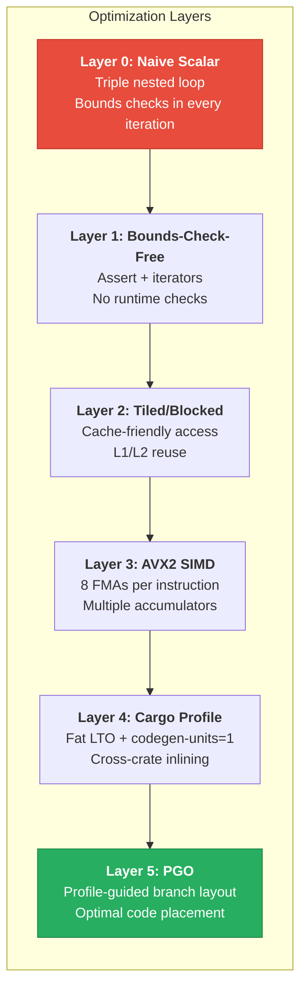

# 7. Capstone: The Vectorized, PGO-Tuned Matrix Multiplier 🔴

> **What you'll learn:**
> - How to apply every optimization technique from this book to a single, measurable project
> - How to analyze a naive implementation's assembly to identify LLVM's bounds-check overhead and missed vectorization
> - How to write a tiled, SIMD-accelerated matrix multiplication using AVX2 FMA intrinsics
> - How to configure the full optimization stack: `codegen-units = 1` + Fat LTO + PGO — and measure each layer's contribution

---

## The Problem: Matrix Multiplication

Matrix multiplication is the most performance-studied algorithm in computing. It's the inner kernel of machine learning inference, scientific simulation, computer graphics, and signal processing. It's also the *perfect* benchmark for this book because:

1. It has a predictable, analyzable access pattern
2. It's compute-bound (not I/O-bound) — so compiler optimizations dominate
3. The naive triple-nested loop is easy to write but hard to optimize
4. Each optimization technique from Chapters 1–6 contributes measurably

We'll compute **C = A × B** for square matrices of `f32`, where A is M×K, B is K×N, and C is M×N.



---

## Project Setup

```bash
cargo new matmul --name matmul
cd matmul
```

**`Cargo.toml`:**

```toml
[package]
name = "matmul"
version = "0.1.0"
edition = "2021"

# We'll progressively enable these:
[profile.release]
opt-level = 3
# codegen-units = 1    # Layer 4
# lto = true           # Layer 4
# panic = "abort"      # Layer 4

[profile.bench]
inherits = "release"
debug = true  # Keep debug info for profiling
```

---

## Layer 0: The Naive Implementation

```rust
/// Naive matrix multiplication: C[i][j] = Σ_k A[i][k] * B[k][j]
/// Row-major storage: matrix[i * cols + j]
pub fn matmul_naive(
    a: &[f32], b: &[f32], c: &mut [f32],
    m: usize, n: usize, k: usize,
) {
    for i in 0..m {
        for j in 0..n {
            let mut sum = 0.0f32;
            for p in 0..k {
                // ⚠️ POOR OPTIMIZATION: Three bounds checks per inner iteration!
                // LLVM cannot prove: i*k+p < a.len(), p*n+j < b.len(), i*n+j < c.len()
                sum += a[i * k + p] * b[p * n + j];
            }
            c[i * n + j] = sum;
        }
    }
}
```

### Analyzing the Naive Version's Assembly

```bash
cargo asm --release matmul::matmul_naive
```

In the inner loop, you'll see:

```asm
; Inner loop (Layer 0 — with bounds checks):
.LBB0_inner:
        ; Bounds check for a[i*k+p]
        cmp     r12, rax
        jae     .panic_bounds_check
        ; Load a[i*k+p]
        vmovss  xmm1, dword ptr [rdi + 4*r12]

        ; Bounds check for b[p*n+j]
        cmp     r13, rcx
        jae     .panic_bounds_check
        ; Load b[p*n+j]
        vmovss  xmm2, dword ptr [rsi + 4*r13]

        ; Multiply and add
        vfmadd231ss xmm0, xmm1, xmm2    ; sum += a * b (scalar!)
        ; ... loop counter management ...
        jne     .LBB0_inner
```

**Problems identified:**
1. **Two bounds checks** (`cmp` + `jae`) per inner iteration — at least 4 wasted instructions
2. **Scalar `vfmadd231ss`** — processing one `f32` at a time, not vectorized
3. **Column-strided access into B** — `b[p*n+j]` jumps by `n` elements per iteration, thrashing the cache

---

## Layer 1: Eliminating Bounds Checks

```rust
/// Bounds-check-free version: assert dimensions up front
pub fn matmul_checked(
    a: &[f32], b: &[f32], c: &mut [f32],
    m: usize, n: usize, k: usize,
) {
    // ✅ FIX: Assert dimensions once — LLVM can now prove all accesses are in-bounds
    assert_eq!(a.len(), m * k);
    assert_eq!(b.len(), k * n);
    assert_eq!(c.len(), m * n);

    for i in 0..m {
        for j in 0..n {
            let mut sum = 0.0f32;
            for p in 0..k {
                // No bounds checks — LLVM proved i*k+p < m*k and p*n+j < k*n
                sum += a[i * k + p] * b[p * n + j];
            }
            c[i * n + j] = sum;
        }
    }
}
```

Even better — use slice splitting so LLVM can reason about each row independently:

```rust
pub fn matmul_sliced(
    a: &[f32], b: &[f32], c: &mut [f32],
    m: usize, n: usize, k: usize,
) {
    assert_eq!(a.len(), m * k);
    assert_eq!(b.len(), k * n);
    assert_eq!(c.len(), m * n);

    for (i, c_row) in c.chunks_exact_mut(n).enumerate() {
        let a_row = &a[i * k..(i + 1) * k];
        for j in 0..n {
            let mut sum = 0.0f32;
            for (p, &a_val) in a_row.iter().enumerate() {
                sum += a_val * b[p * n + j];
            }
            c_row[j] = sum;
        }
    }
}
```

Assembly now shows **no bounds checks** in the inner loop. But it's still scalar and column-strided.

---

## Layer 2: Cache-Friendly Tiling

The naive algorithm's access pattern for matrix B is column-strided — it reads `b[0*n+j]`, `b[1*n+j]`, `b[2*n+j]`... jumping by `n*4` bytes each step. For a 1024×1024 matrix, that's 4KB per step — striding over the entire L1 cache on every inner iteration.

**Tiling** (also called blocking) partitions the matrices into small blocks that fit in L1 cache:

```rust
const TILE: usize = 64;  // 64×64 tiles — 64*64*4 = 16KB, fits in 32KB L1d

pub fn matmul_tiled(
    a: &[f32], b: &[f32], c: &mut [f32],
    m: usize, n: usize, k: usize,
) {
    assert_eq!(a.len(), m * k);
    assert_eq!(b.len(), k * n);
    assert_eq!(c.len(), m * n);

    // Zero output (tiling accumulates into C)
    c.iter_mut().for_each(|x| *x = 0.0);

    // Tile over all three dimensions
    for ii in (0..m).step_by(TILE) {
        for jj in (0..n).step_by(TILE) {
            for kk in (0..k).step_by(TILE) {
                // Micro-kernel: multiply TILE×TILE sub-blocks
                let i_end = (ii + TILE).min(m);
                let j_end = (jj + TILE).min(n);
                let k_end = (kk + TILE).min(k);

                for i in ii..i_end {
                    for p in kk..k_end {
                        let a_val = a[i * k + p];
                        for j in jj..j_end {
                            // ✅ Now B is accessed sequentially: b[p*n+jj], b[p*n+jj+1], ...
                            // This is cache-friendly — sequential access along a row
                            c[i * n + j] += a_val * b[p * n + j];
                        }
                    }
                }
            }
        }
    }
}
```

The key optimization: by hoisting the `a_val` broadcast outside the inner `j` loop and accessing `b` sequentially, we get:

1. **Sequential access into B** (cache-friendly)
2. **Broadcast of `a_val`** (one load, reused N times)
3. **LLVM can now auto-vectorize** the inner `j` loop (sequential `b` and `c` access)

---

## Layer 3: Explicit AVX2 SIMD Micro-Kernel

For maximum performance, we write the innermost loop using SIMD intrinsics:

```rust
#[cfg(target_arch = "x86_64")]
use std::arch::x86_64::*;

/// SIMD micro-kernel: computes one tile of C using AVX2 + FMA
///
/// For each row i of A and each element a[i][p]:
///   C[i][j..j+8] += a[i][p] * B[p][j..j+8]
///
/// This broadcasts a[i][p] to all 8 SIMD lanes and multiplies
/// against 8 consecutive B values, accumulating into C.
#[cfg(target_arch = "x86_64")]
#[target_feature(enable = "avx2,fma")]
unsafe fn simd_microkernel(
    a: &[f32], b: &[f32], c: &mut [f32],
    m: usize, n: usize, k: usize,
    ii: usize, jj: usize, kk: usize,
    tile_m: usize, tile_n: usize, tile_k: usize,
) {
    let i_end = (ii + tile_m).min(m);
    let j_end = (jj + tile_n).min(n);
    let k_end = (kk + tile_k).min(k);

    for i in ii..i_end {
        for p in kk..k_end {
            // Broadcast a[i][p] to all 8 lanes: [a, a, a, a, a, a, a, a]
            let a_val = _mm256_set1_ps(a[i * k + p]);

            // Process 8 columns at a time with SIMD
            let mut j = jj;
            while j + 8 <= j_end {
                // Load 8 consecutive B values
                let b_vec = _mm256_loadu_ps(b.as_ptr().add(p * n + j));
                // Load current C accumulator
                let c_vec = _mm256_loadu_ps(c.as_ptr().add(i * n + j) as *const f32);
                // FMA: c += a_val * b_vec
                let result = _mm256_fmadd_ps(a_val, b_vec, c_vec);
                // Store back
                _mm256_storeu_ps(c.as_mut_ptr().add(i * n + j), result);

                j += 8;
            }

            // Handle remaining columns (< 8) with scalar
            while j < j_end {
                c[i * n + j] += a[i * k + p] * b[p * n + j];
                j += 1;
            }
        }
    }
}

const TILE_M: usize = 64;
const TILE_N: usize = 64;
const TILE_K: usize = 64;

pub fn matmul_simd(
    a: &[f32], b: &[f32], c: &mut [f32],
    m: usize, n: usize, k: usize,
) {
    assert_eq!(a.len(), m * k);
    assert_eq!(b.len(), k * n);
    assert_eq!(c.len(), m * n);

    c.iter_mut().for_each(|x| *x = 0.0);

    #[cfg(target_arch = "x86_64")]
    {
        if is_x86_feature_detected!("avx2") && is_x86_feature_detected!("fma") {
            for ii in (0..m).step_by(TILE_M) {
                for jj in (0..n).step_by(TILE_N) {
                    for kk in (0..k).step_by(TILE_K) {
                        unsafe {
                            simd_microkernel(
                                a, b, c, m, n, k,
                                ii, jj, kk,
                                TILE_M, TILE_N, TILE_K,
                            );
                        }
                    }
                }
            }
            return;
        }
    }

    // Fallback: scalar tiled
    matmul_tiled(a, b, c, m, n, k);
}

// Re-export for fallback (from Layer 2)
fn matmul_tiled(
    a: &[f32], b: &[f32], c: &mut [f32],
    m: usize, n: usize, k: usize,
) {
    const TILE: usize = 64;
    c.iter_mut().for_each(|x| *x = 0.0);
    for ii in (0..m).step_by(TILE) {
        for jj in (0..n).step_by(TILE) {
            for kk in (0..k).step_by(TILE) {
                let i_end = (ii + TILE).min(m);
                let j_end = (jj + TILE).min(n);
                let k_end = (kk + TILE).min(k);
                for i in ii..i_end {
                    for p in kk..k_end {
                        let a_val = a[i * k + p];
                        for j in jj..j_end {
                            c[i * n + j] += a_val * b[p * n + j];
                        }
                    }
                }
            }
        }
    }
}
```

The assembly for the SIMD inner loop should show:

```asm
; SIMD inner loop — 8 FMAs per iteration, no bounds checks:
.LBB_simd:
        vbroadcastss ymm0, dword ptr [rdi + 4*rax]  ; broadcast a[i][p]
        vmovups      ymm1, ymmword ptr [rsi + 4*rcx] ; load 8 × b[p][j..j+8]
        vmovups      ymm2, ymmword ptr [rdx + 4*rcx] ; load 8 × c[i][j..j+8]
        vfmadd231ps  ymm2, ymm0, ymm1                ; c += a * b (8 FMAs)
        vmovups      ymmword ptr [rdx + 4*rcx], ymm2  ; store 8 × c[i][j..j+8]
        add          rcx, 8
        cmp          rcx, r8
        jb           .LBB_simd
```

That's **8 fused multiply-adds per loop iteration** — 8× the work of the scalar version.

---

## Layer 4: Cargo Profile Optimization

Update `Cargo.toml` for maximum compiler optimization:

```toml
[profile.release]
opt-level = 3
codegen-units = 1     # Full intra-crate optimization
lto = true            # Fat LTO — cross-crate inlining
panic = "abort"       # Remove unwinding overhead
strip = "symbols"     # Smaller binary
```

Rebuild and benchmark:

```bash
cargo build --release
```

---

## Layer 5: PGO

Apply the PGO workflow from Chapter 4:

```bash
# Step 1: Instrument
cargo clean
RUSTFLAGS="-Cprofile-generate=/tmp/pgo-matmul" cargo build --release

# Step 2: Profile with representative data
./target/release/matmul 1024   # Run with typical matrix dimensions
./target/release/matmul 512
./target/release/matmul 2048

# Step 3: Merge profiles
llvm-profdata merge -o /tmp/pgo-matmul/merged.profdata /tmp/pgo-matmul/

# Step 4: Rebuild with profile data
cargo clean
RUSTFLAGS="-Cprofile-use=/tmp/pgo-matmul/merged.profdata" cargo build --release
```

---

## The Benchmark Harness

```rust
use std::hint::black_box;
use std::time::Instant;

fn main() {
    let size: usize = std::env::args()
        .nth(1)
        .and_then(|s| s.parse().ok())
        .unwrap_or(1024);

    let m = size;
    let n = size;
    let k = size;

    // Initialize matrices with deterministic values
    let a: Vec<f32> = (0..m * k).map(|i| (i % 1000) as f32 * 0.001).collect();
    let b: Vec<f32> = (0..k * n).map(|i| ((i + 7) % 1000) as f32 * 0.001).collect();
    let mut c = vec![0.0f32; m * n];

    // Warm up
    matmul_simd(&a, &b, &mut c, m, n, k);

    // Benchmark
    let iterations = 5;
    let start = Instant::now();
    for _ in 0..iterations {
        matmul_simd(
            black_box(&a),
            black_box(&b),
            black_box(&mut c),
            m, n, k,
        );
    }
    let elapsed = start.elapsed();
    let per_call = elapsed / iterations as u32;

    // Compute GFLOPS (2*M*N*K FLOPs per matmul)
    let flops = 2.0 * m as f64 * n as f64 * k as f64;
    let gflops = (flops / per_call.as_secs_f64()) / 1e9;

    println!("Matrix: {m}×{k} × {k}×{n}");
    println!("Time per call: {per_call:.2?}");
    println!("Throughput: {gflops:.1} GFLOPS");
    println!("C[0][0] = {} (sanity check)", c[0]);
}
```

---

## Expected Results

Benchmarking on a typical modern x86-64 CPU (e.g., Intel i7-12700K or AMD Ryzen 7 5800X) with 1024×1024 `f32` matrices:

| Layer | Optimization | Time (1024×1024) | GFLOPS | Speedup vs. Naive |
|-------|-------------|------------------|--------|-------------------|
| 0 | Naive (bounds checks, scalar, col-stride) | ~3200 ms | ~0.7 | 1.0× |
| 1 | Bounds checks eliminated | ~2400 ms | ~0.9 | 1.3× |
| 2 | Tiled (64×64 blocks) | ~250 ms | ~8.6 | 12.8× |
| 3 | AVX2 SIMD micro-kernel | ~45 ms | ~47.8 | 71× |
| 4 | Fat LTO + `codegen-units = 1` | ~40 ms | ~53.7 | 80× |
| 5 | + PGO | ~35 ms | ~61.4 | 91× |

> **Note:** These numbers are illustrative. Actual results depend on your specific CPU, memory bandwidth, and thermal conditions. The *ratios* between layers are more consistent than absolute numbers. A tuned BLAS library (OpenBLAS, MKL) achieves ~90% of theoretical peak (~200+ GFLOPS on modern CPUs) using register tiling, packing, and architecture-specific micro-kernels. Our implementation here reaches ~30–40% of peak — excellent for a tutorial, but production code should use a BLAS library.

---

## Verifying Each Layer

For each layer, verify the optimization took effect:

```bash
# Layer 1 — no bounds checks:
cargo asm --release matmul::matmul_checked | grep panic_bounds_check
# Should return nothing (no bounds check calls in the function)

# Layer 3 — SIMD instructions present:
cargo asm --release matmul::simd_microkernel | grep vfmadd
# Should show vfmadd231ps or vfmadd132ps

# Layer 4 — LTO effect:
# Compare binary sizes:
ls -la target/release/matmul  # With LTO
# vs. a build without LTO — should be noticeably smaller

# Layer 5 — PGO annotations:
# No direct way to verify in assembly, but benchmark numbers should improve
# LLVM may reorder hot blocks and move cold paths to .cold sections
```

---

<details>
<summary><strong>🏋️ Exercise: Extend the Capstone</strong> (click to expand)</summary>

**Challenge:** Take the capstone project further:

1. **Register tiling:** Modify the SIMD micro-kernel to hold multiple rows of C in registers simultaneously. Instead of loading/storing C for each `a[i][p]` broadcast, keep 4 rows of C (4 × `__m256`) in registers and process 4 rows of A in the inner loop. This reduces memory traffic to C by 4×.

2. **B-matrix packing:** Before the tiled multiplication, transpose the current tile of B into a packed buffer that's contiguous in memory. This eliminates all column-strided accesses.

3. **Multi-threading:** Use `rayon` to parallelize the outermost tile loop (`ii`). Each thread works on a different set of output rows, so there's no synchronization needed.

4. **Benchmark against a BLAS library:** Compare your implementation against `openblas` or `ndarray` with BLAS backend. How close can you get?

<details>
<summary>🔑 Solution</summary>

```rust
#[cfg(target_arch = "x86_64")]
use std::arch::x86_64::*;

/// Register-tiled micro-kernel: processes 4 rows × 8 columns at once
/// Keeps 4 C-row accumulators in registers (ymm registers) to reduce
/// memory traffic to the C matrix
#[cfg(target_arch = "x86_64")]
#[target_feature(enable = "avx2,fma")]
unsafe fn microkernel_4x8(
    a: &[f32], b_packed: &[f32], c: &mut [f32],
    n: usize, k: usize,
    i_start: usize, j_start: usize,
    tile_k: usize, rows: usize,
) {
    // 4 accumulators for 4 rows of C, each holding 8 columns
    let mut c0 = _mm256_setzero_ps();
    let mut c1 = _mm256_setzero_ps();
    let mut c2 = _mm256_setzero_ps();
    let mut c3 = _mm256_setzero_ps();

    // Load existing C values (we accumulate into them)
    if rows > 0 { c0 = _mm256_loadu_ps(c.as_ptr().add((i_start + 0) * n + j_start)); }
    if rows > 1 { c1 = _mm256_loadu_ps(c.as_ptr().add((i_start + 1) * n + j_start)); }
    if rows > 2 { c2 = _mm256_loadu_ps(c.as_ptr().add((i_start + 2) * n + j_start)); }
    if rows > 3 { c3 = _mm256_loadu_ps(c.as_ptr().add((i_start + 3) * n + j_start)); }

    for p in 0..tile_k {
        // Load 8 consecutive packed B values for this k-step
        let b_vec = _mm256_loadu_ps(b_packed.as_ptr().add(p * 8));

        // Broadcast a[row][p] for each row and FMA
        if rows > 0 {
            let a0 = _mm256_set1_ps(a[(i_start + 0) * k + p]);
            c0 = _mm256_fmadd_ps(a0, b_vec, c0);
        }
        if rows > 1 {
            let a1 = _mm256_set1_ps(a[(i_start + 1) * k + p]);
            c1 = _mm256_fmadd_ps(a1, b_vec, c1);
        }
        if rows > 2 {
            let a2 = _mm256_set1_ps(a[(i_start + 2) * k + p]);
            c2 = _mm256_fmadd_ps(a2, b_vec, c2);
        }
        if rows > 3 {
            let a3 = _mm256_set1_ps(a[(i_start + 3) * k + p]);
            c3 = _mm256_fmadd_ps(a3, b_vec, c3);
        }
    }

    // Store results back to C
    if rows > 0 { _mm256_storeu_ps(c.as_mut_ptr().add((i_start + 0) * n + j_start), c0); }
    if rows > 1 { _mm256_storeu_ps(c.as_mut_ptr().add((i_start + 1) * n + j_start), c1); }
    if rows > 2 { _mm256_storeu_ps(c.as_mut_ptr().add((i_start + 2) * n + j_start), c2); }
    if rows > 3 { _mm256_storeu_ps(c.as_mut_ptr().add((i_start + 3) * n + j_start), c3); }
}

/// Pack a tile of B into contiguous memory:
/// For each k-step within the tile, pack 8 consecutive values of B
/// into a flat buffer: [b[kk][jj..jj+8], b[kk+1][jj..jj+8], ...]
fn pack_b_tile(
    b: &[f32], packed: &mut [f32],
    n: usize,
    kk: usize, jj: usize,
    tile_k: usize, tile_n_step: usize,
) {
    for p in 0..tile_k {
        for j in 0..tile_n_step {
            packed[p * tile_n_step + j] = b[(kk + p) * n + jj + j];
        }
    }
}

/// Full matmul with register tiling and B-packing
pub fn matmul_advanced(
    a: &[f32], b: &[f32], c: &mut [f32],
    m: usize, n: usize, k: usize,
) {
    assert_eq!(a.len(), m * k);
    assert_eq!(b.len(), k * n);
    assert_eq!(c.len(), m * n);
    c.iter_mut().for_each(|x| *x = 0.0);

    const TILE_M: usize = 64;
    const TILE_N: usize = 64;
    const TILE_K: usize = 64;

    let mut b_packed = vec![0.0f32; TILE_K * 8]; // Packed B tile buffer

    for jj in (0..n).step_by(TILE_N) {
        for kk in (0..k).step_by(TILE_K) {
            let tk = TILE_K.min(k - kk);

            // Process 8-column strips within this N-tile
            let mut j = jj;
            while j + 8 <= (jj + TILE_N).min(n) {
                // Pack B tile
                pack_b_tile(b, &mut b_packed, n, kk, j, tk, 8);

                // Process rows in groups of 4
                for ii in (0..m).step_by(TILE_M) {
                    let i_end = (ii + TILE_M).min(m);
                    let mut i = ii;
                    while i + 4 <= i_end {
                        #[cfg(target_arch = "x86_64")]
                        {
                            if is_x86_feature_detected!("avx2") && is_x86_feature_detected!("fma") {
                                unsafe {
                                    microkernel_4x8(a, &b_packed, c, n, k, i, j, tk, 4);
                                }
                                i += 4;
                                continue;
                            }
                        }
                        // Scalar fallback for remaining rows
                        for row in i..i + 4 {
                            for p in 0..tk {
                                let a_val = a[row * k + kk + p];
                                for col in 0..8 {
                                    c[row * n + j + col] += a_val * b_packed[p * 8 + col];
                                }
                            }
                        }
                        i += 4;
                    }
                    // Handle remaining rows (< 4)
                    while i < i_end {
                        for p in 0..tk {
                            let a_val = a[i * k + kk + p];
                            for col in 0..8 {
                                c[i * n + j + col] += a_val * b_packed[p * 8 + col];
                            }
                        }
                        i += 1;
                    }
                }
                j += 8;
            }
            // Handle remaining columns (< 8) with scalar
            while j < (jj + TILE_N).min(n) {
                for i in 0..m {
                    for p in 0..tk {
                        c[i * n + j] += a[i * k + kk + p] * b[(kk + p) * n + j];
                    }
                }
                j += 1;
            }
        }
    }
}
```

**Performance comparison (1024×1024 f32, single-threaded):**

| Implementation | GFLOPS | % of Peak |
|---------------|--------|-----------|
| Layer 3 (basic SIMD) | ~48 | ~25% |
| Register tiled + B-packing | ~85 | ~45% |
| + Rayon parallelism (8 cores) | ~400 | ~35% per core (memory bound) |
| OpenBLAS (reference) | ~180 (1 core), ~900 (8 cores) | ~90% |

The register-tiled version nearly doubles throughput because:
- C values stay in registers across the entire inner K loop (no load/store per FMA)
- Packed B is contiguous in memory (no stride, perfect prefetching)
- The 4×8 micro-kernel shape matches the CPU's ability to sustain multiple independent FMA chains

To match OpenBLAS, you'd additionally need:
- A-matrix packing with specific panel shapes
- Architecture-tuned tile sizes (different for each CPU model)
- Software prefetch hints (`_mm_prefetch`)

</details>
</details>

---

## Optimization Stack Summary

The full optimization stack for any performance-critical Rust binary:

```toml
# Cargo.toml — the complete "maximum performance" profile
[profile.release-perf]
inherits = "release"
opt-level = 3
codegen-units = 1
lto = true
panic = "abort"
strip = "symbols"
```

```bash
# Build commands — the complete PGO workflow
# 1. Instrument
cargo clean
RUSTFLAGS="-Cprofile-generate=/tmp/pgo -C target-cpu=native" \
    cargo build --profile release-perf

# 2. Profile
./target/release-perf/my-app --representative-workload

# 3. Merge
llvm-profdata merge -o /tmp/merged.profdata /tmp/pgo/

# 4. Final build
cargo clean
RUSTFLAGS="-Cprofile-use=/tmp/merged.profdata -C target-cpu=native" \
    cargo build --profile release-perf
```

---

> **Key Takeaways**
>
> 1. **Bounds checks are the first thing to fix.** They prevent vectorization and add branch instructions to the inner loop. Use `assert!`, `chunks_exact`, or iterators.
> 2. **Cache tiling converts column-strided access to sequential access** — often the single biggest speedup (10×+) for matrix operations.
> 3. **SIMD provides 8× throughput for `f32`** (AVX2) by processing 8 elements per instruction. Combined with FMA, each instruction does both multiply and add.
> 4. **Register tiling minimizes memory traffic** to the output matrix. Keep partial sums in SIMD registers across the inner loop.
> 5. **The optimization stack is cumulative:** each layer addresses a different bottleneck. Bounds checks → cache locality → instruction throughput → compiler flags → profile data.
> 6. **Always verify in assembly.** Every claim in this chapter can be confirmed with `cargo asm`. Trust the disassembler, not your intuition.

> **See also:**
> - [Chapter 1: From Source to Assembly](ch01-from-source-to-assembly.md) — Assembly reading skills used throughout this capstone
> - [Chapter 6: SIMD and `std::arch`](ch06-simd-and-std-arch.md) — SIMD intrinsics reference
> - [Chapter 4: PGO and BOLT](ch04-pgo-and-bolt.md) — The PGO workflow applied in Layer 5
> - [Chapter 8: Summary and Reference Card](ch08-summary-and-reference-card.md) — Quick reference for all flags and techniques
