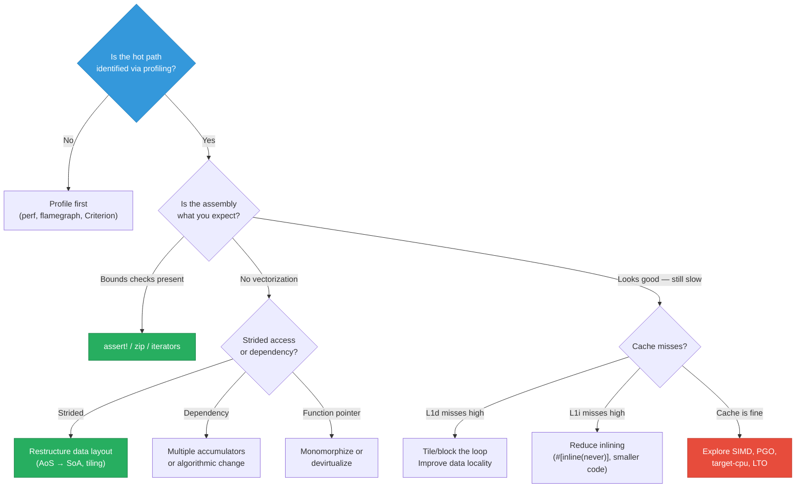

# Summary and Reference Card

This appendix is a quick-reference cheat sheet for every optimization technique covered in this book. Keep it open while working on performance-critical code.

---

## Cargo.toml Release Profile — Maximum Performance

```toml
[profile.release-perf]
inherits = "release"
opt-level = 3          # Full LLVM optimization (O3)
codegen-units = 1      # Single CGU — full intra-crate optimization
lto = true             # Fat LTO — cross-crate inlining
panic = "abort"        # Remove unwinding tables (~10-20% binary size)
strip = "symbols"      # Strip symbol table (smaller binary)
# debug = 2            # Uncomment for profiling (perf, Instruments)
```

### Profile Comparison

| Setting | Fast Compile | Balanced Release | Maximum Perf |
|---------|-------------|-----------------|--------------|
| `opt-level` | `2` | `3` | `3` |
| `codegen-units` | `16` | `16` | `1` |
| `lto` | `false` | `"thin"` | `true` |
| `panic` | `"unwind"` | `"unwind"` | `"abort"` |
| `strip` | `false` | `false` | `"symbols"` |
| `debug` | `true` | `false` | `false` |

---

## RUSTFLAGS Quick Reference

```bash
# Target CPU (unlock AVX2, FMA, etc.)
RUSTFLAGS="-C target-cpu=native"                    # Match build machine
RUSTFLAGS="-C target-cpu=x86-64-v3"                 # AVX2-capable CPUs (~2013+)
RUSTFLAGS="-C target-cpu=x86-64-v4"                 # AVX-512 CPUs

# PGO — Instrument
RUSTFLAGS="-Cprofile-generate=/tmp/pgo-data"

# PGO — Optimize
RUSTFLAGS="-Cprofile-use=/tmp/merged.profdata"

# Emit intermediate representations
RUSTFLAGS="--emit=llvm-ir"                           # Emit .ll files
RUSTFLAGS="--emit=asm"                               # Emit .s files
RUSTFLAGS="-Z dump-mir=all"                          # Emit MIR (nightly only)

# LLVM vectorization diagnostics
RUSTFLAGS="-C llvm-args=-pass-remarks=loop-vectorize -C llvm-args=-pass-remarks-missed=loop-vectorize"

# BOLT preparation (Linux)
RUSTFLAGS="-Clink-arg=-Wl,--emit-relocs"
```

---

## `.cargo/config.toml` Templates

```toml
# Per-target CPU settings (recommended over RUSTFLAGS for repos)
[target.x86_64-unknown-linux-gnu]
rustflags = ["-C", "target-cpu=x86-64-v3"]

[target.aarch64-unknown-linux-gnu]
rustflags = ["-C", "target-cpu=generic"]

[target.aarch64-apple-darwin]
rustflags = ["-C", "target-cpu=apple-m1"]
```

---

## Assembly Inspection Commands

```bash
# Install cargo-show-asm
cargo install cargo-show-asm

# Show assembly for a function
cargo asm --release my_crate::my_function

# Show LLVM IR
cargo asm --release --llvm my_crate::my_function

# Show MIR
cargo asm --release --mir my_crate::my_function

# List all available functions
cargo asm --release --lib
```

---

## PGO Workflow (Complete)

```bash
# 1. Install tools
rustup component add llvm-tools-preview
export LLVM_TOOLS=$(rustc --print sysroot)/lib/rustlib/$(rustc -vV | sed -n 's|host: ||p')/bin

# 2. Build instrumented binary
cargo clean
RUSTFLAGS="-Cprofile-generate=/tmp/pgo-data" cargo build --release

# 3. Run representative workload
./target/release/my-app --typical-workload

# 4. Merge profile data
$LLVM_TOOLS/llvm-profdata merge -o /tmp/merged.profdata /tmp/pgo-data/

# 5. Build optimized binary
cargo clean
RUSTFLAGS="-Cprofile-use=/tmp/merged.profdata" cargo build --release
```

---

## BOLT Workflow (Linux Only)

```bash
# 1. Build with relocations
RUSTFLAGS="-Clink-arg=-Wl,--emit-relocs" cargo build --release

# 2. Profile with perf
perf record -e cycles:u -j any,u -o perf.data -- ./target/release/my-app --workload

# 3. Convert and run BOLT
perf2bolt -p perf.data -o perf.fdata ./target/release/my-app
llvm-bolt ./target/release/my-app -o ./target/release/my-app.bolt \
    -data=perf.fdata -reorder-blocks=ext-tsp -reorder-functions=hfsort \
    -split-functions -split-all-cold -dyno-stats
```

---

## Inline Attribute Cheat Sheet

| Attribute | Effect | When to Use |
|-----------|--------|-------------|
| *(none)* | LLVM decides; body NOT available cross-crate | Default — usually correct |
| `#[inline]` | Hint to LLVM; body available cross-crate via metadata | Small utility functions in library crates |
| `#[inline(always)]` | Force inlining at every call site | Tiny, latency-critical functions (< 10 IR instructions) |
| `#[inline(never)]` | Prevent inlining | Large functions, error handlers, functions you want visible in profiler |
| `#[cold]` | Mark as rarely called; LLVM moves to `.cold` section | Error handlers, panic paths, logging |

---

## x86-64 SIMD Intrinsics Quick Reference (AVX2 + FMA)

### Types

| Rust Type | Width | Element Type | Elements |
|-----------|-------|-------------|---------|
| `__m128` | 128-bit | `f32` | 4 |
| `__m128d` | 128-bit | `f64` | 2 |
| `__m128i` | 128-bit | integer | varies |
| `__m256` | 256-bit | `f32` | 8 |
| `__m256d` | 256-bit | `f64` | 4 |
| `__m256i` | 256-bit | integer | varies |

### Essential Operations

| Operation | f32 (256-bit) | f64 (256-bit) |
|-----------|--------------|---------------|
| Load (unaligned) | `_mm256_loadu_ps` | `_mm256_loadu_pd` |
| Store (unaligned) | `_mm256_storeu_ps` | `_mm256_storeu_pd` |
| Set all to zero | `_mm256_setzero_ps` | `_mm256_setzero_pd` |
| Broadcast scalar | `_mm256_set1_ps(x)` | `_mm256_set1_pd(x)` |
| Add | `_mm256_add_ps` | `_mm256_add_pd` |
| Multiply | `_mm256_mul_ps` | `_mm256_mul_pd` |
| FMA (a×b+c) | `_mm256_fmadd_ps` | `_mm256_fmadd_pd` |
| Subtract | `_mm256_sub_ps` | `_mm256_sub_pd` |
| Min | `_mm256_min_ps` | `_mm256_min_pd` |
| Max | `_mm256_max_ps` | `_mm256_max_pd` |
| Sqrt | `_mm256_sqrt_ps` | `_mm256_sqrt_pd` |
| Abs (integer) | `_mm256_abs_epi32` | N/A |
| Compare | `_mm256_cmp_ps(a,b,op)` | `_mm256_cmp_pd(a,b,op)` |
| Blend/Select | `_mm256_blendv_ps` | `_mm256_blendv_pd` |

### Integer Operations (256-bit)

| Operation | 32-bit | 16-bit | 8-bit |
|-----------|--------|--------|-------|
| Add | `_mm256_add_epi32` | `_mm256_add_epi16` | `_mm256_add_epi8` |
| Sub | `_mm256_sub_epi32` | `_mm256_sub_epi16` | `_mm256_sub_epi8` |
| Multiply low | `_mm256_mullo_epi32` | `_mm256_mullo_epi16` | N/A |
| Max (signed) | `_mm256_max_epi32` | `_mm256_max_epi16` | `_mm256_max_epi8` |
| Shift left | `_mm256_slli_epi32` | `_mm256_slli_epi16` | N/A |
| Shift right | `_mm256_srli_epi32` | `_mm256_srli_epi16` | N/A |
| Pack + saturate | N/A | `_mm256_packus_epi16` | N/A |

### Horizontal Reduction (f32, 256-bit → scalar)

```rust
#[inline(always)]
#[target_feature(enable = "avx2")]
unsafe fn hsum_ps(v: __m256) -> f32 {
    let high = _mm256_extractf128_ps(v, 1);
    let low  = _mm256_castps256_ps128(v);
    let sum  = _mm_add_ps(high, low);
    let shuf = _mm_movehdup_ps(sum);
    let sums = _mm_add_ps(sum, shuf);
    let shuf2 = _mm_movehl_ps(sums, sums);
    _mm_cvtss_f32(_mm_add_ss(sums, shuf2))
}
```

---

## ARM NEON Quick Reference (AArch64)

| Operation | f32 (128-bit, 4 lanes) |
|-----------|----------------------|
| Load | `vld1q_f32(ptr)` |
| Store | `vst1q_f32(ptr, v)` |
| Broadcast | `vdupq_n_f32(x)` |
| Add | `vaddq_f32(a, b)` |
| Multiply | `vmulq_f32(a, b)` |
| FMA | `vfmaq_f32(acc, a, b)` |
| Horizontal sum | `vaddvq_f32(v)` |

> NEON is **always available** on AArch64 — no feature detection needed.

---

## Compilation Pipeline Reference

```
Source (.rs)
    │  rustc parse, macro expansion
    ▼
  AST
    │  name resolution, desugaring
    ▼
  HIR
    │  type checking, trait resolution
    ▼
  MIR  ← borrow checking, drop elaboration, monomorphization
    │  ← MIR optimizations (ConstProp, Inline, SimplifyCfg, ...)
    ▼
LLVM IR  ← LLVM optimization passes (O0–O3)
    │     ← inlining, loop unrolling, vectorization, GVN, LICM
    ▼
Machine Code (.o)  ← instruction selection, register allocation
    │
    ▼
Executable  ← linking (lld / system linker)
    │         ← LTO (if enabled) — re-optimizes across crates
    ▼
[BOLT]  ← post-link binary layout optimization (optional)
```

---

## Red Flags in Assembly Output

| Pattern | Meaning | Action |
|---------|---------|--------|
| `call core::panicking::panic_bounds_check` | Bounds check in hot loop | Use `assert!`, `zip()`, `chunks_exact()`, or iterators |
| `call __rust_alloc` | Heap allocation | Move allocation outside the loop |
| Multiple `cmp` + `jae` pairs in inner loop | Bounds checks | Pre-validate slice lengths |
| `callq` to small functions | Missed inlining | Add `#[inline]` or enable LTO |
| Scalar `vmulss`/`vaddss` in a data-parallel loop | Missed vectorization | Check for loop-carried deps, non-contiguous access, or function pointers |
| No `vfmadd` when multiply+add are adjacent | FMA not enabled | Add `-C target-cpu=x86-64-v3` or `#[target_feature(enable="fma")]` |

---

## Performance Optimization Decision Tree



---

## Recommended Reading

| Topic | Resource |
|-------|----------|
| CPU microarchitecture | Agner Fog's [Microarchitecture Manual](https://www.agner.org/optimize/microarchitecture.pdf) |
| Instruction tables | Agner Fog's [Instruction Tables](https://www.agner.org/optimize/instruction_tables.pdf) |
| LLVM passes | [LLVM Passes Documentation](https://llvm.org/docs/Passes.html) |
| Intel intrinsics guide | [Intel Intrinsics Guide](https://www.intel.com/content/www/us/en/docs/intrinsics-guide/index.html) |
| Rust SIMD tracking | [std::simd RFC](https://github.com/rust-lang/rfcs/pull/2948) |
| PGO in Rust | [rustc PGO documentation](https://doc.rust-lang.org/rustc/profile-guided-optimization.html) |
| LLVM BOLT | [BOLT: A Practical Binary Optimizer](https://research.facebook.com/publications/bolt-a-practical-binary-optimizer-for-data-centers-and-beyond/) |
| Compiler Explorer | [godbolt.org](https://godbolt.org/) |
| cargo-show-asm | [cargo-show-asm on crates.io](https://crates.io/crates/cargo-show-asm) |
