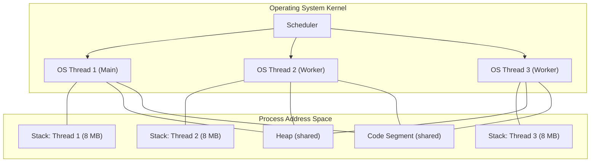
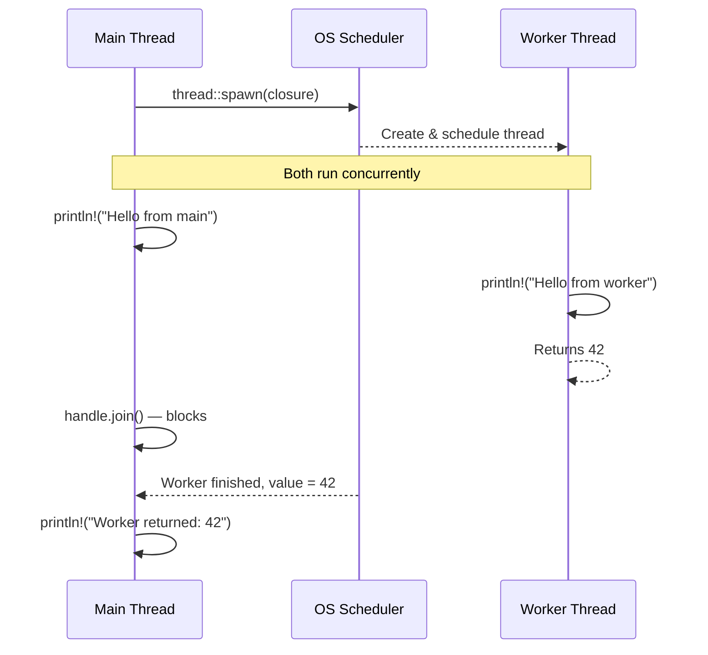
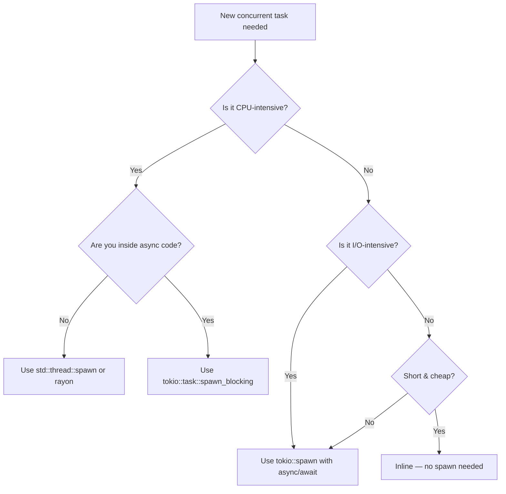

# Chapter 1: OS Threads and `move` Closures 🟢

> **What you'll learn:**
> - How `std::thread::spawn` maps to real OS-level threads and what that costs
> - Why `move` closures are mandatory for spawned threads, and what the compiler is enforcing
> - The difference between CPU-bound and I/O-bound workloads, and why it matters for thread count selection
> - When to reach for OS threads vs. `tokio::spawn` (async tasks) — and why conflating them causes subtle bugs

---

## 1.1 What Is an OS Thread?

Before we write a single line of Rust, let's ground ourselves in hardware reality.

When you call `std::thread::spawn`, the Rust runtime (via `libc` on Linux/macOS, or the Win32 API on Windows) asks the operating system kernel to create a new **kernel-scheduled thread**. This comes with very real costs:

| Resource | Typical Cost |
|---|---|
| Stack allocation | 8 MB (Linux default) per thread |
| Kernel data structures | ~1 KB of kernel memory |
| Context switch | ~1–10 µs (cache eviction + register save/restore) |
| Minimum creation time | ~50–300 µs (syscall overhead) |

This is in stark contrast to **async tasks** (`tokio::spawn`), which are *user-space* constructs that live inside a single OS thread and cost only a heap allocation (~hundreds of bytes). We'll return to this comparison throughout the guide.

### Thread Architecture



Key insight: **all threads in a process share the same heap and code segment**. This is the source of both the power and the peril of threading. Any thread can read or write any heap allocation, which is exactly why Rust's ownership system must impose rules at compile time.

---

## 1.2 Spawning Threads in Rust

The basic API is `std::thread::spawn`, which takes a closure and returns a `JoinHandle<T>`:

```rust
use std::thread;

fn main() {
    // Spawn a thread that does some work and returns a value.
    let handle = thread::spawn(|| {
        println!("Hello from the worker thread!");
        42  // Return value
    });

    // The main thread continues executing here concurrently.
    println!("Hello from the main thread!");

    // `join()` blocks until the worker finishes and returns its value.
    // It returns Result<T, Box<dyn Any + Send>> to handle panics.
    let result = handle.join().expect("Worker thread panicked");
    println!("Worker returned: {}", result); // 42
}
```

### Thread Execution Timeline



---

## 1.3 The `move` Closure: Why It's Non-Negotiable

Here is the central tension of thread spawning: a closure might want to reference local variables from the enclosing scope, but the spawned thread can outlive that scope. The compiler catches this:

```rust
fn main() {
    let message = String::from("hello from outer scope");

    // ❌ FAILS: `message` might be dropped before the thread uses it
    let handle = thread::spawn(|| {
        println!("{}", message); // error[E0373]: closure may outlive the current function
    });

    handle.join().unwrap();
}
```

**Compiler error:**
```
error[E0373]: closure may outlive the current function, but it borrows `message`,
              which is owned by the current function
   --> src/main.rs:6:32
    |
6   |     let handle = thread::spawn(|| {
    |                                ^^ may outlive borrowed value `message`
7   |         println!("{}", message);
    |                        ------- `message` is borrowed here
    |
help: to force the closure to take ownership of `message` (and any other referenced variables),
      use the `move` keyword
```

The fix is the `move` keyword, which transfers ownership of captured variables *into* the closure:

```rust
fn main() {
    let message = String::from("hello from outer scope");

    // ✅ FIX: `move` transfers ownership of `message` into the closure.
    // The thread now *owns* the String; the main thread can no longer use it.
    let handle = thread::spawn(move || {
        println!("{}", message); // `message` is owned by this closure
    });

    // ❌ This would now fail — `message` was moved into the thread.
    // println!("{}", message); // error[E0382]: borrow of moved value

    handle.join().unwrap();
}
```

### Why `move` is the Right Default

The `move` keyword makes ownership transfer explicit. Consider what happens *without* `move` and with a reference: if the outer function returns (dropping `message`) before the thread has a chance to run, the thread would be reading freed memory — a classic use-after-free bug. Rust's borrow checker rules this out at compile time, and `move` is the escape hatch that correctly transfers responsibility.

---

## 1.4 Returning Values and Handling Thread Panics

`JoinHandle::join()` returns `Result<T, Box<dyn Any + Send>>`. The `Err` variant contains the panic payload if the thread panicked:

```rust
use std::thread;

fn main() {
    let handle = thread::spawn(|| {
        // Simulate some work that might fail
        let v: Vec<i32> = vec![1, 2, 3];
        v[99] // index out of bounds — this will panic!
    });

    match handle.join() {
        Ok(val) => println!("Thread returned: {:?}", val),
        Err(e) => {
            // `e` is Box<dyn Any + Send>, downcast to get the panic message
            if let Some(msg) = e.downcast_ref::<&str>() {
                println!("Thread panicked with: {}", msg);
            } else if let Some(msg) = e.downcast_ref::<String>() {
                println!("Thread panicked with: {}", msg);
            } else {
                println!("Thread panicked with an unknown payload");
            }
        }
    }
}
```

This is important for production code: **thread panics do not automatically kill the main thread**. You must check `join()` results or you silently lose errors.

---

## 1.5 CPU-Bound vs. I/O-Bound Workloads

This distinction is the most important architectural decision in concurrent programming. Getting it wrong means spending threads that accomplish nothing or starving the CPU with too few workers.

| Characteristic | CPU-Bound | I/O-Bound |
|---|---|---|
| **Bottleneck** | CPU cycles | Waiting for disk, network, syscalls |
| **Examples** | Image compression, cryptography, ray tracing, parsing | HTTP requests, database queries, file reads |
| **Optimal thread count** | ≈ number of logical CPU cores | Can be many more than cores |
| **Rust tool of choice** | `std::thread` or `rayon` | `tokio` / async |
| **Cost of blocking** | N/A — the work *is* blocking | Wastes a thread while it sleeps |

### The Goldilocks Rule for OS Thread Counts

For CPU-bound workloads, the optimal thread count is typically:

```rust
use std::thread;

fn optimal_worker_count() -> usize {
    // std::thread::available_parallelism() was stabilized in Rust 1.59
    thread::available_parallelism()
        .map(|n| n.get())
        .unwrap_or(4) // fallback if the OS doesn't report
}
```

More threads than cores means context-switching overhead eats your gains. Fewer means leaving cores idle.

### A Complete CPU-Bound Example: Parallel Sum

```rust
use std::thread;

fn parallel_sum(data: Vec<i64>) -> i64 {
    let num_threads = thread::available_parallelism()
        .map(|n| n.get())
        .unwrap_or(4);

    // Split the data into roughly equal chunks
    let chunk_size = (data.len() + num_threads - 1) / num_threads;

    // We need `Arc` to share the data with threads without cloning it all.
    // (We'll cover Arc deeply in Chapter 2.)
    let data = std::sync::Arc::new(data);
    let mut handles = Vec::new();

    for chunk_idx in 0..num_threads {
        let data = data.clone(); // Clone the Arc (cheap pointer copy)
        let start = chunk_idx * chunk_size;

        let handle = thread::spawn(move || {
            let end = (start + chunk_size).min(data.len());
            if start >= data.len() {
                return 0i64;
            }
            // Sum this thread's assigned chunk
            data[start..end].iter().sum::<i64>()
        });

        handles.push(handle);
    }

    // Reduce: sum all partial results
    handles
        .into_iter()
        .map(|h| h.join().expect("Worker panicked"))
        .sum()
}

fn main() {
    let data: Vec<i64> = (1..=1_000_000).collect();
    let result = parallel_sum(data);
    println!("Sum: {}", result); // 500_000_500_000
}
```

---

## 1.6 OS Threads vs. `tokio::spawn` — The Critical Distinction

> **↔ Async Contrast**
>
> This is one of the most common architectural mistakes engineers make when first encountering Rust's async ecosystem. Knowing *when* to use each is production-critical knowledge.

| Factor | `std::thread::spawn` | `tokio::spawn` |
|---|---|---|
| **Cost** | ~8 MB stack, kernel struct, ~100–300 µs to create | ~few KB heap alloc, ~µs to schedule |
| **Concurrency model** | True OS-level parallelism | Cooperative multitasking on a thread pool |
| **Blocking** | Natural — the thread blocks, OS schedules another | **Never block!** Blocks the entire executor thread |
| **Best for** | CPU-intensive computation | Waiting on I/O (network, disk) |
| **Communication** | `mpsc`, `Mutex`, `Arc` | `tokio::sync::mpsc`, `tokio::sync::Mutex` |
| **Panics** | Contained to that thread (detectable via join) | Can propagate to executor if not handled |

### The Critical Rule

**Never run CPU-intensive work on the async executor.** If you need to do CPU-bound work from async code, use `tokio::task::spawn_blocking`:

```rust
use tokio::task;

async fn process_image(data: Vec<u8>) -> Vec<u8> {
    // `spawn_blocking` runs the closure on a *separate thread pool*
    // reserved for blocking operations, keeping the async executor free.
    task::spawn_blocking(move || {
        // This can do heavy CPU work without blocking the async reactor.
        compress_image(data) // hypothetical CPU-intensive function
    })
    .await
    .expect("Blocking task panicked")
}

fn compress_image(data: Vec<u8>) -> Vec<u8> {
    // ... image compression logic
    data
}
```

**Conversely**, never spawn thousands of OS threads to handle I/O. Each thread waiting on a network socket wastes 8 MB of stack memory doing nothing. An async runtime handles thousands of concurrent I/O operations on a handful of OS threads.

### Decision Flowchart



---

## 1.7 Thread Naming and Builder API

For production systems, always name your threads. This makes stack traces, `/proc/<pid>/task/*/comm`, and macOS Activity Monitor readable:

```rust
use std::thread;

fn main() {
    let handle = thread::Builder::new()
        .name("image-compressor-0".to_string())
        .stack_size(4 * 1024 * 1024) // 4 MB instead of default 8 MB
        .spawn(|| {
            // thread::current().name() returns the thread name
            println!(
                "Thread '{}' starting work",
                thread::current().name().unwrap_or("unnamed")
            );
        })
        .expect("Failed to spawn thread"); // Builder::spawn returns Result

    handle.join().unwrap();
}
```

---

<details>
<summary><strong>🏋️ Exercise: Parallel Prime Sieve</strong> (click to expand)</summary>

**Challenge:** Implement a parallel prime-finding function using `std::thread::spawn`. Split the range `2..=1_000_000` into `N` chunks (where `N` = number of logical CPUs), check each number for primality in a separate thread, and collect and sort the results.

**Requirements:**
- Use `thread::available_parallelism()` to determine `N`.
- Each thread should return a `Vec<u64>` of primes found in its chunk.
- Collect results from all threads, flatten into a single sorted `Vec<u64>`.
- Do not use any external crates.

**Starter code:**
```rust
use std::thread;

fn is_prime(n: u64) -> bool {
    if n < 2 { return false; }
    if n == 2 { return true; }
    if n % 2 == 0 { return false; }
    let mut i = 3u64;
    while i * i <= n {
        if n % i == 0 { return false; }
        i += 2;
    }
    true
}

fn parallel_primes(limit: u64) -> Vec<u64> {
    // TODO: implement parallel prime finding here
    todo!()
}

fn main() {
    let primes = parallel_primes(1_000_000);
    println!("Found {} primes below 1,000,000", primes.len());
    assert_eq!(primes.len(), 78498); // Expected count
}
```

<details>
<summary>🔑 Solution</summary>

```rust
use std::thread;

fn is_prime(n: u64) -> bool {
    if n < 2 { return false; }
    if n == 2 { return true; }
    if n % 2 == 0 { return false; }
    let mut i = 3u64;
    while i * i <= n {
        if n % i == 0 { return false; }
        i += 2;
    }
    true
}

fn parallel_primes(limit: u64) -> Vec<u64> {
    // Step 1: Determine how many threads to use based on available CPU cores.
    let num_threads = thread::available_parallelism()
        .map(|n| n.get() as u64)
        .unwrap_or(4);

    // Step 2: Calculate how to divide the range among threads.
    // We use ceiling division so no numbers are missed.
    let chunk_size = (limit + num_threads - 1) / num_threads;

    let mut handles = Vec::new();

    // Step 3: Spawn one thread per chunk.
    for i in 0..num_threads {
        let start = i * chunk_size + 2; // Range starts at 2 (smallest prime)
        // Ensure the last chunk doesn't exceed the limit.
        let end = ((i + 1) * chunk_size + 1).min(limit + 1);

        if start > limit {
            break; // No work for this thread if start is out of range
        }

        // `move` captures `start` and `end` by value — essential because
        // these are local loop variables that would be dropped after the loop.
        let handle = thread::spawn(move || {
            // Each thread builds its own local Vec — no synchronization needed!
            // This is the key insight: avoid sharing mutable state entirely.
            let mut local_primes = Vec::new();
            for n in start..end {
                if is_prime(n) {
                    local_primes.push(n);
                }
            }
            local_primes // Return ownership of the Vec to the main thread via join()
        });

        handles.push(handle);
    }

    // Step 4: Collect results from all threads.
    // `join()` blocks until each thread finishes, then gives us the return value.
    // We flatten the Vec<Vec<u64>> into a single Vec<u64>.
    let mut all_primes: Vec<u64> = handles
        .into_iter()
        .flat_map(|h| h.join().expect("Prime-finding thread panicked"))
        .collect();

    // Step 5: Sort — threads may finish in any order and produced unordered chunks.
    all_primes.sort_unstable();
    all_primes
}

fn main() {
    let primes = parallel_primes(1_000_000);
    println!("Found {} primes below 1,000,000", primes.len());
    assert_eq!(primes.len(), 78498);
    println!("First 10: {:?}", &primes[..10]);
    println!("Last  10: {:?}", &primes[primes.len()-10..]);
}
```

**Why this works safely:**
1. Each thread owns its own `Vec` — there is zero shared mutable state.
2. The `move` closure transfers `start` and `end` (u64 values, which are `Copy`) into each thread.
3. `handle.join()` creates a *happens-before* relationship: everything the thread wrote is visible to the main thread after `join()` returns.

</details>
</details>

---

> **Key Takeaways**
> - `std::thread::spawn` creates a true OS kernel thread with its own stack. This is expensive (~8 MB stack, ~100–300 µs startup) — use for CPU-bound work with a thread count ≈ number of cores.
> - `move` closures are not optional — they transfer ownership into the thread, satisfying the `'static` lifetime requirement imposed by the `Send + 'static` bound on the closure.
> - `handle.join()` returns `Result<T, _>` where the `Err` variant contains the panic payload. Always handle it in production.
> - For I/O-bound workloads, prefer `tokio::spawn` (async tasks). For CPU-bound work inside async code, use `tokio::task::spawn_blocking`.

> **See also:**
> - [Chapter 2: The `Send` and `Sync` Traits](ch02-send-and-sync-traits.md) — why `move` closures require `Send`
> - [Chapter 3: Scoped Threads](ch03-scoped-threads.md) — avoiding `move` with borrowed data
> - [Chapter 9: Data Parallelism with Rayon](ch09-data-parallelism-rayon.md) — a higher-level abstraction for CPU work
> - *Async Rust* companion guide, Chapter 1 — `tokio::spawn` and the executor model
