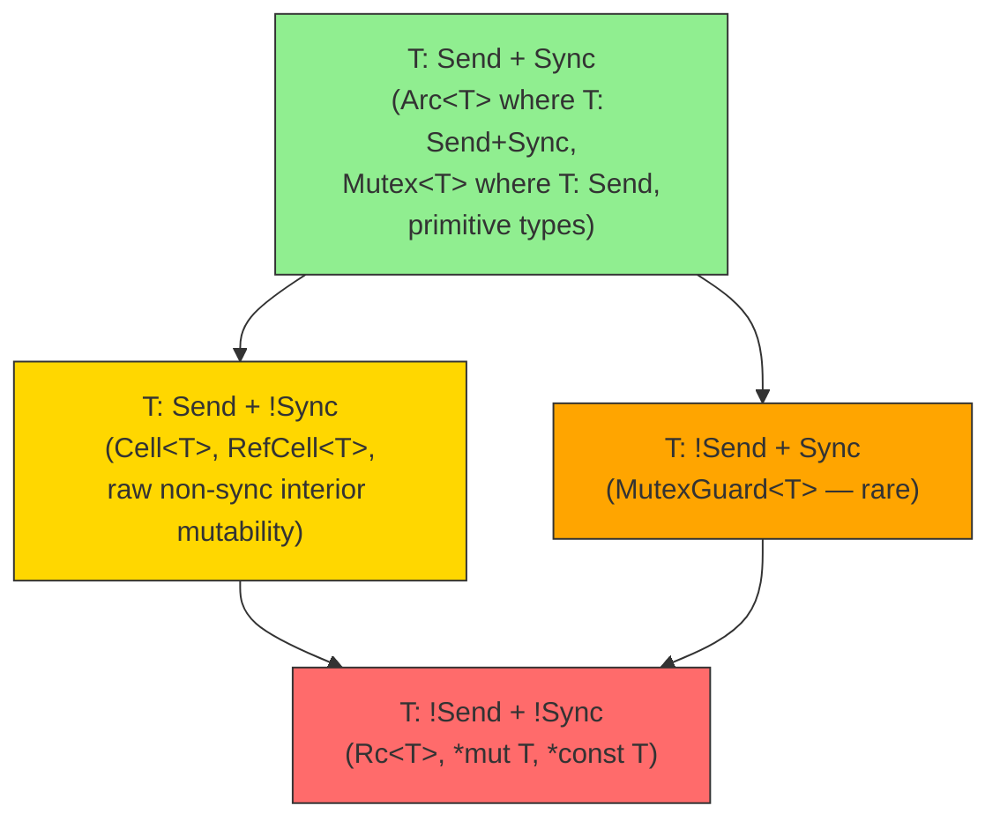

# Chapter 2: The `Send` and `Sync` Traits 🟡

> **What you'll learn:**
> - How Rust encodes thread-safety proofs directly in its type system via auto-traits
> - The precise logical definitions of `Send` and `Sync`, and why they are duals of each other
> - Why `Rc<T>` is `!Send` and `!Sync`, while `Arc<T>` is `Send + Sync` — derived from first principles
> - How to implement custom types that are either thread-safe or explicitly not

---

## 2.1 The Problem These Traits Solve

In C++, thread safety is a documentation convention. You write `// Thread-safe` in a comment, hope your colleagues read it, and pray during code review. At runtime, data races are **undefined behavior** — meaning the optimizer can produce *any* output, including output that appears correct 99% of the time and corrupts memory on the 100th run on a 64-core production machine.

Rust's answer is to encode thread-safety as a *type-level property* checked at compile time. The two traits responsible are `Send` and `Sync`, defined in `std::marker`.

---

## 2.2 Definitions: A Mathematical Approach

These are **auto-traits** — the compiler automatically implements them for any type that satisfies the structural requirements, and you can also implement them manually (unsafe, as we'll see).

### `Send`: Ownership Can Cross Thread Boundaries

```
T: Send   ⟺   It is safe to transfer ownership of a T to another thread.
```

**What "safe" means here:** If you move a `T` to another thread, the original thread can no longer access it (Rust's ownership guarantees this). The question is whether the *internal implementation* of `T` is compatible with being accessed from a different thread's context (different CPU core, different TLS, etc.).

The primary thing that violates `Send` is having a raw pointer to state that is **not** thread-safe. The canonical example is thread-local storage (TLS) indices — `Rc<T>` maintains a reference count in thread-local variables. Moving an `Rc<T>` to another thread would allow two threads to modify the same `usize` without synchronization.

### `Sync`: Shared References Can Cross Thread Boundaries

```
T: Sync   ⟺   It is safe for multiple threads to hold &T references simultaneously.
```

Equivalently (and this is the key duality):

> **The Law of Sync:** `T: Sync` if and only if `&T: Send`.

This makes intuitive sense: sending a shared reference to another thread is safe if and only if seeing the referent from multiple threads is safe.

### The Full Lattice



---

## 2.3 Primitive Types Are `Send + Sync`

All primitive types that have fixed memory representations are automatically `Send + Sync`:

```rust
// These are all Send + Sync:
let _: &dyn Send = &42i32;
let _: &dyn Send = &3.14f64;
let _: &dyn Send = &true;
let _: &dyn Send = &"hello"; // &str is Send + Sync

// Proof: we can send them to threads
use std::thread;
let x = 42i32;
thread::spawn(move || println!("{}", x)).join().unwrap(); // Fine
```

Compound types (`struct`, `enum`, `tuple`) are `Send + Sync` if and only if **all their fields** are `Send + Sync`. This is the auto-trait propagation mechanism.

---

## 2.4 `Rc<T>`: A Study in `!Send`

`Rc<T>` (Reference Counted) is Rust's single-threaded smart pointer. Let's understand exactly *why* it is `!Send` and `!Sync` by looking at its implementation:

```rust
// Simplified Rc internals (from the standard library)
struct RcInner<T> {
    strong: usize,  // reference count — NOT atomic!
    weak:   usize,
    data:   T,
}

pub struct Rc<T> {
    ptr: NonNull<RcInner<T>>, // raw pointer to heap-allocated RcInner
    _marker: PhantomData<RcInner<T>>,
}

// The standard library explicitly opts out:
impl<T> !Send for Rc<T> {}
impl<T> !Sync for Rc<T> {}
```

The `strong` reference count is a plain `usize` — not an `AtomicUsize`. Incrementing/decrementing it is:
1. A read of the current value
2. An increment
3. A write of the new value

On modern CPUs, these three steps are **not atomic** at the machine level (even on x86, unless you use a `LOCK XADD` instruction). Two threads doing this simultaneously would produce a data race — literally undefined behavior in C++, and something the Rust type system prevents by marking `Rc` as `!Send`.

### `Arc<T>`: The Thread-Safe Alternative

```rust
// Simplified Arc internals
struct ArcInner<T> {
    strong: AtomicUsize, // atomic reference count
    weak:   AtomicUsize,
    data:   T,
}

pub struct Arc<T> {
    ptr: NonNull<ArcInner<T>>,
    _marker: PhantomData<ArcInner<T>>,
}

// Arc is Send + Sync when T: Send + Sync
unsafe impl<T: Send + Sync> Send for Arc<T> {}
unsafe impl<T: Send + Sync> Sync for Arc<T> {}
```

The `AtomicUsize` ensures reference count changes are atomic, making it safe to `clone()` and `drop()` from multiple threads. But note the conditional: `Arc<T>` is only `Send + Sync` if `T` itself is — if you wrap a non-threadsafe type in `Arc`, the whole thing remains non-threadsafe.

### Side-by-Side Comparison

```rust
use std::rc::Rc;
use std::sync::Arc;
use std::thread;

// ❌ FAILS: `Rc` cannot be sent to another thread
let rc = Rc::new(42);
thread::spawn(move || println!("{}", rc)); // ERROR
// error[E0277]: `Rc<i32>` cannot be sent between threads safely
// ... `Rc<i32>` is not `Send`

// ✅ FIX: Use `Arc` for shared ownership across threads
let arc = Arc::new(42);
let arc_clone = arc.clone(); // cheap atomic increment
thread::spawn(move || println!("{}", arc_clone)).join().unwrap(); // OK
println!("{}", arc); // main thread still has ownership via original Arc
```

---

## 2.5 `Cell<T>` and `RefCell<T>`: `Send` but `!Sync`

These types provide **interior mutability** — the ability to mutate data behind a shared `&T` reference. They are safe *within a single thread* but unsafe across threads:

```rust
use std::cell::{Cell, RefCell};

// Cell<T>: Send (if T: Send) but !Sync
// Why !Sync? Because `&Cell<T>` allows mutation, and two threads
// mutating through shared references is a data race.
fn demonstrate_cell() {
    let cell = Cell::new(42);
    
    // Within one thread: fine
    cell.set(100);
    println!("{}", cell.get());
    
    // ❌ FAILS: Cannot share &Cell across threads
    // let r: &Cell<i32> = &cell;
    // thread::spawn(move || r.set(200)); // ERROR: `Cell<i32>` is not Sync
}

// RefCell<T>: Send (if T: Send) but !Sync
// Why !Sync? RefCell's borrow tracking (a runtime-checked flag) is not atomic.
fn demonstrate_refcell() {
    let refcell = RefCell::new(vec![1, 2, 3]);
    
    // Within one thread: fine — runtime borrow checking
    refcell.borrow_mut().push(4);
    
    // ❌ FAILS: Cannot send &RefCell to another thread
    // thread::spawn(move || refcell.borrow_mut().push(5)); // ERROR
}
```

For cross-thread interior mutability, use `Mutex<T>` or atomics (covered in Chapters 4 and 5).

---

## 2.6 `MutexGuard<T>` — The Rare `!Send + Sync` Case

`MutexGuard<T>` is one of the rare types that is `Sync` but `!Send`. This is because some OS mutex implementations (particularly on POSIX: `pthread_mutex_lock`) require that the thread that *unlocks* a mutex be the same thread that *locked* it. Sending a `MutexGuard` to another thread and unlocking it there would violate this OS-level invariant.

```rust
use std::sync::Mutex;

fn explain_mutex_guard() {
    let m = Mutex::new(42);
    let guard = m.lock().unwrap(); // MutexGuard<i32>
    
    // ❌ FAILS: MutexGuard is !Send
    // thread::spawn(move || drop(guard)); // ERROR
    // error[E0277]: `MutexGuard<'_, i32>` cannot be sent between threads safely
    
    // ✅ The guard must be dropped on the same thread that created it.
    drop(guard);
}
```

---

## 2.7 Implementing `Send` and `Sync` Manually

Sometimes you write a low-level type that you *know* is thread-safe but the compiler can't prove it automatically (typically because it contains raw pointers). You can manually assert thread-safety using `unsafe impl`:

```rust
use std::marker::PhantomData;

// A simplified concurrent queue node (simplified for illustration)
struct SharedBuffer<T> {
    // Raw pointer to data — compiler doesn't know if this is thread-safe
    ptr: *mut T,
    len: std::sync::atomic::AtomicUsize,
    _marker: PhantomData<T>,
}

// SAFETY: We guarantee that:
// 1. Access to `ptr` is protected by the AtomicUsize-based protocol
// 2. T itself must be Send for cross-thread ownership transfer
// 3. No aliased mutable access is ever created
unsafe impl<T: Send> Send for SharedBuffer<T> {}
unsafe impl<T: Send> Sync for SharedBuffer<T> {}
```

**The `unsafe impl` is a solemn promise.** The compiler trusts you. If you lie (and the implementation is actually not thread-safe), you will get data races — the exact thing Rust promises to prevent. This is why `unsafe` is the right keyword: it means "I have a safety invariant that I, the programmer, am upholding."

---

## 2.8 Propagation Rules (the Auto-Trait Algorithm)

Understanding these rules lets you reason about any type's `Send`/`Sync` status from first principles:

| Type Form | `Send` if... | `Sync` if... |
|---|---|---|
| `u8`, `i32`, `f64`, `bool`, `char` | ✅ always | ✅ always |
| `&T` | `T: Sync` | `T: Sync` |
| `&mut T` | `T: Send` | `T: Send` |
| `Box<T>` | `T: Send` | `T: Sync` |
| `Arc<T>` | `T: Send + Sync` | `T: Send + Sync` |
| `Rc<T>` | ❌ never | ❌ never |
| `Mutex<T>` | `T: Send` | `T: Send` (note: NOT requiring `T: Sync`!) |
| `Vec<T>` | `T: Send` | `T: Sync` |
| `Cell<T>` | `T: Send` | ❌ never |
| `RefCell<T>` | `T: Send` | ❌ never |
| `*const T`, `*mut T` | ❌ never | ❌ never |

**Note on `Mutex<T>`:** `Mutex<T>: Sync` requires only `T: Send`, not `T: Sync`. This is because the Mutex ensures only one thread accesses `T` at a time, so `T` never needs to be safe under *concurrent* (`&T`) access.

---

## 2.9 Using Trait Bounds to Require Thread Safety

You can express thread-safety requirements in function signatures:

```rust
use std::thread;
use std::sync::Arc;

// This function can only be called with types that are safe to share across threads.
// The `T: Send + Sync + 'static` bound is the standard "can-be-threaded" bound.
fn process_in_thread<T: Send + Sync + 'static>(
    data: Arc<T>,
    f: impl Fn(&T) -> String + Send + 'static,
) -> thread::JoinHandle<String> {
    thread::spawn(move || f(&data))
}

fn main() {
    let data = Arc::new(vec![1, 2, 3, 4, 5]);
    
    let handle = process_in_thread(data.clone(), |v| {
        format!("Sum: {}", v.iter().sum::<i32>())
    });
    
    println!("{}", handle.join().unwrap()); // "Sum: 15"
}
```

The `'static` bound deserves special mention: it means the type cannot contain any references with non-`'static` lifetimes. Spawned threads can outlive the scope where they were created, so any borrowed data must be guaranteed to live as long as the program (or the thread must be scoped — see Chapter 3).

---

<details>
<summary><strong>🏋️ Exercise: Thread-Safe Wrapper</strong> (click to expand)</summary>

**Challenge:** You have a type `Statistics` that is not thread-safe. Your task is to:
1. Explain (in comments) why the naive `ParallelStats` wrapped with raw pointers would be unsafe.
2. Create a correct thread-safe wrapper `SafeStats` that multiple threads can update concurrently.
3. Verify that your `SafeStats` is `Send + Sync` by using it in a multi-threaded context.

**Starter code:**
```rust
use std::collections::HashMap;

// A simple statistics accumulator.
// This is NOT thread-safe (contains non-atomic mutation).
struct Statistics {
    counts: HashMap<String, usize>,
    total: usize,
}

impl Statistics {
    fn new() -> Self {
        Statistics { counts: HashMap::new(), total: 0 }
    }
    fn record(&mut self, key: &str) {
        *self.counts.entry(key.to_string()).or_insert(0) += 1;
        self.total += 1;
    }
    fn report(&self) -> String {
        format!("{:?}, total={}", self.counts, self.total)
    }
}

// TODO: Create SafeStats that wraps Statistics and is Send + Sync
// TODO: Use SafeStats from multiple threads to record events
```

<details>
<summary>🔑 Solution</summary>

```rust
use std::collections::HashMap;
use std::sync::{Arc, Mutex};
use std::thread;

struct Statistics {
    counts: HashMap<String, usize>,
    total: usize,
}

impl Statistics {
    fn new() -> Self {
        Statistics { counts: HashMap::new(), total: 0 }
    }
    fn record(&mut self, key: &str) {
        *self.counts.entry(key.to_string()).or_insert(0) += 1;
        self.total += 1;
    }
    fn report(&self) -> String {
        let mut pairs: Vec<_> = self.counts.iter().collect();
        pairs.sort_by_key(|(k, _)| k.as_str());
        let counts: Vec<_> = pairs.iter().map(|(k, v)| format!("{}: {}", k, v)).collect();
        format!("[{}], total={}", counts.join(", "), self.total)
    }
}

// SafeStats wraps Statistics in a Mutex for thread safety.
//
// Why is this safe?
// - `Mutex<Statistics>` is `Send` because `Statistics: Send`
//   (HashMap<String, usize> and usize are both Send).
// - `Mutex<Statistics>` is `Sync` because `Statistics: Send`
//   (the Mutex guarantees exclusive access, so T doesn't need Sync).
// - `Arc<Mutex<Statistics>>` is `Send + Sync` because `Mutex<Statistics>` is
//   both `Send` and `Sync`.
//
// The "raw pointer" alternative WOULD NOT be safe:
// ```
// struct UnsafeStats {
//     ptr: *mut Statistics,  // *mut T is !Send and !Sync
// }
// unsafe impl Send for UnsafeStats {}  // Dangerous! We'd need to prove
// unsafe impl Sync for UnsafeStats {}  // the access protocol is race-free.
// ```
// Using Mutex instead, the compiler derives the impls automatically and
// correctness is guaranteed by the Mutex protocol.
#[derive(Clone)]
struct SafeStats {
    // Arc allows multiple threads to hold a handle.
    // Mutex ensures only one thread mutates at a time.
    inner: Arc<Mutex<Statistics>>,
}

impl SafeStats {
    fn new() -> Self {
        SafeStats {
            inner: Arc::new(Mutex::new(Statistics::new())),
        }
    }

    fn record(&self, key: &str) {
        // `lock()` blocks until the Mutex is available.
        // The MutexGuard is dropped at the end of this block, releasing the lock.
        let mut stats = self.inner.lock().expect("Stats mutex was poisoned");
        stats.record(key);
        // Guard dropped here — lock released.
    }

    fn report(&self) -> String {
        let stats = self.inner.lock().expect("Stats mutex was poisoned");
        stats.report()
    }
}

// Compile-time proof that SafeStats is Send + Sync:
fn assert_send_sync<T: Send + Sync>(_: &T) {}

fn main() {
    let stats = SafeStats::new();
    assert_send_sync(&stats); // Compile-time check!

    // Spawn 4 threads, each recording 1000 events
    let mut handles = vec![];
    for thread_id in 0..4 {
        let stats_clone = stats.clone(); // cheap Arc increment
        let handle = thread::spawn(move || {
            for _ in 0..1000 {
                let key = format!("thread-{}", thread_id);
                stats_clone.record(&key);
            }
        });
        handles.push(handle);
    }

    for h in handles {
        h.join().expect("Thread panicked");
    }

    println!("{}", stats.report());
    // Expected: [thread-0: 1000, thread-1: 1000, thread-2: 1000, thread-3: 1000], total=4000
}
```

</details>
</details>

---

> **Key Takeaways**
> - `Send` means a value can be *transferred* to another thread. `Sync` means a value can be *shared by reference* across threads. They are related by `T: Sync ⟺ &T: Send`.
> - These are **auto-traits** — the compiler derives them automatically from your type's fields, with explicit `!Send`/`!Sync` opt-outs for types like `Rc` and raw pointers.
> - `Rc<T>` is `!Send + !Sync` because its reference count is a non-atomic `usize`. `Arc<T>` is `Send + Sync` (when `T: Send + Sync`) because it uses `AtomicUsize`.
> - `unsafe impl Send for T` is a programmer's promise to the compiler. Break it and you get data races — the exact bugs Rust was designed to prevent.

> **See also:**
> - [Chapter 1: OS Threads and `move` Closures](ch01-os-threads-and-move-closures.md) — the `'static` bound and why it connects to `Send`
> - [Chapter 4: Mutexes, RwLocks, and Poisoning](ch04-mutexes-rwlocks-and-poisoning.md) — `Mutex<T>: Sync` makes `T` accessible from many threads
> - *Rust Memory Management* companion guide — deep dive on `Rc` vs `Arc` and reference counting mechanics
