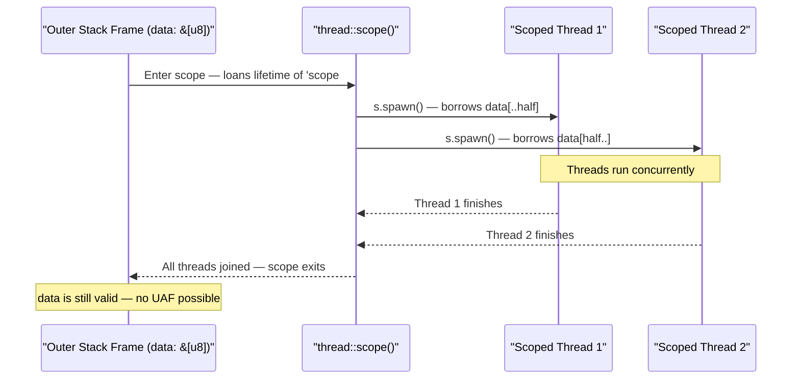

# Chapter 3: Scoped Threads 🟡

> **What you'll learn:**
> - Why `std::thread::spawn` requires `'static` data and why that's often too restrictive
> - How `std::thread::scope` (stabilized in Rust 1.63) allows threads to borrow from the enclosing stack frame
> - The lifetime magic that makes scoped threads safe — and how it's enforced at compile time
> - Practical patterns: chunked parallel processing, parallel data transformation

---

## 3.1 The `'static` Problem

Recall from Chapter 1 that `std::thread::spawn` requires the closure to be `'static`:

```rust
pub fn spawn<F, T>(f: F) -> JoinHandle<T>
where
    F: FnOnce() -> T + Send + 'static,  // <-- 'static bound here
    T: Send + 'static,
```

The `'static` bound means: *the closure must not contain any borrows that aren't valid for the entire program lifetime.* This prevents dangling references — if the spawning function returns and drops a variable, a thread still running would have a dangling reference into freed stack memory.

But often, we *know* the thread won't outlive a specific scope. Consider this common pattern:

```rust
fn process_all(data: &[u8]) {
    let half = data.len() / 2;

    // ❌ FAILS: `data` is a borrow — doesn't live 'static
    let h1 = std::thread::spawn(|| {
        process_chunk(&data[..half])  // error: `data` doesn't live long enough
    });
    let h2 = std::thread::spawn(|| {
        process_chunk(&data[half..])  // error: same
    });

    h1.join().unwrap();
    h2.join().unwrap();
    // We know the threads are done here, but the compiler doesn't!
}
```

Before Rust 1.63, the workaround was to `Arc::new()` the data or clone it — both wasteful. The right solution was always **scoped threads**.

---

## 3.2 `std::thread::scope` — Borrowing Local Data in Threads

`std::thread::scope` introduces a **scope** within which you can spawn threads that are guaranteed to terminate *before* the scope exits. This allows those threads to safely borrow from the outer stack:

```rust
use std::thread;

fn process_all(data: &[u8]) {
    let half = data.len() / 2;

    // `thread::scope` creates a scope `s`.
    // All threads spawned via `s.spawn()` are guaranteed to finish
    // before `scope()` returns. This allows borrowing `data`.
    thread::scope(|s| {
        // ✅ FIX: Scoped spawn — can borrow `data` because scope won't
        // exit until both threads finish.
        let h1 = s.spawn(|| {
            process_chunk(&data[..half])
        });
        let h2 = s.spawn(|| {
            process_chunk(&data[half..])
        });

        // Note: We don't even need to call join() explicitly —
        // the scope automatically joins all threads when it exits.
        let _ = h1.join();
        let _ = h2.join();
    }); // <-- ALL scoped threads are guaranteed to have finished by here

    // `data` is still valid here — no dangling references possible
}

fn process_chunk(chunk: &[u8]) {
    println!("Processing {} bytes", chunk.len());
}
```

### How The Lifetime Guarantee Works



The key insight is that `thread::scope` accepts a closure with signature `FnOnce(&Scope<'scope, '_>) -> T`. The lifetime `'scope` is tied to the *enclosing scope*, and the `ScopedJoinHandle` returned by `s.spawn()` borrows from `'scope`. The compiler's borrow checker enforces that the `ScopedJoinHandle` (or the scope itself) cannot outlive the data being borrowed.

---

## 3.3 Explicit Join is Optional (But Checking Results Is Not)

A scoped thread is automatically joined when the `scope` closure exits. However, you should still join manually and check for panics in production:

```rust
use std::thread;

fn main() {
    let mut results = Vec::new();

    thread::scope(|s| {
        let h1 = s.spawn(|| {
            // Some work that might panic
            expensive_computation(1)
        });

        let h2 = s.spawn(|| {
            expensive_computation(2)
        });

        // Join manually to handle individual thread panics
        match h1.join() {
            Ok(val) => results.push(val),
            Err(e) => eprintln!("Thread 1 panicked: {:?}", e),
        }
        match h2.join() {
            Ok(val) => results.push(val),
            Err(e) => eprintln!("Thread 2 panicked: {:?}", e),
        }
    });
    // If you didn't join above, the scope would auto-join here —
    // but panics would be re-raised and could terminate your program.

    println!("Results: {:?}", results);
}

fn expensive_computation(n: i32) -> i32 { n * n }
```

> **Important:** If a scoped thread panics and you *don't* join it manually, `thread::scope` will re-panic when it auto-joins, propagating the panic to the calling thread. In production, always handle thread panics explicitly.

---

## 3.4 Mutably Borrowing in Scoped Threads

This is where scoped threads truly shine over `Arc<Mutex<T>>` solutions. You can mutably borrow disjoint parts of a data structure:

```rust
use std::thread;

fn parallel_fill(buf: &mut [u32]) {
    // Rust's slice::split_at_mut gives us two non-overlapping &mut slices.
    // The borrow checker proves they don't alias — no Mutex needed!
    let mid = buf.len() / 2;
    let (left, right) = buf.split_at_mut(mid);

    thread::scope(|s| {
        // Each thread gets exclusive mutable access to its portion.
        // No locking required — the type system proves no aliasing.
        s.spawn(|| {
            for (i, val) in left.iter_mut().enumerate() {
                *val = (i * i) as u32; // Fill left half with squares
            }
        });
        s.spawn(|| {
            for (i, val) in right.iter_mut().enumerate() {
                *val = (i * 2) as u32; // Fill right half with doubles
            }
        });
    }); // Both threads joined — buf is fully written
}

fn main() {
    let mut data = vec![0u32; 10];
    parallel_fill(&mut data);
    println!("{:?}", data);
    // [0, 1, 4, 9, 16, 0, 2, 4, 6, 8]
}
```

This pattern is **zero-cost**: no heap allocations, no atomic operations, no locks. The safety proof is entirely in the type system's borrow checker at compile time. No `Arc<Mutex<Vec>>` needed.

---

## 3.5 Nested Scoped Threads

Scopes can be nested, and each level inherits the lifetime constraints of its parent:

```rust
use std::thread;

fn main() {
    let config = String::from("global-config"); // Owned by main
    let base_value = 100u32;

    thread::scope(|outer| {
        // Outer scoped thread — borrows `config` and `base_value`
        outer.spawn(|| {
            let local_factor = 2u32; // Owned by this outer thread

            thread::scope(|inner| {
                // Inner scoped thread — borrows `config`, `base_value`, AND `local_factor`
                inner.spawn(|| {
                    println!(
                        "config={}, base={}, factor={}",
                        config, base_value, local_factor
                    );
                });
            });
            // `local_factor` is still valid here — inner scope is done
        });
    });
    // `config` and `base_value` are still valid here
}
```

---

## 3.6 Parallel Chunked Processing — A Production Pattern

The most common real-world use of scoped threads is applying a transformation to a large dataset in parallel. Here's a production-quality example:

```rust
use std::thread;

/// Normalize a slice of f64 values in parallel (subtract mean, divide by std dev).
/// Uses scoped threads for zero-copy parallel access to the data.
fn parallel_normalize(data: &mut [f64]) {
    if data.is_empty() {
        return;
    }

    let n = data.len() as f64;

    // Phase 1: Compute mean (parallel reduce)
    let mean = {
        let num_threads = thread::available_parallelism().map(|n| n.get()).unwrap_or(4);
        let chunk_size = (data.len() + num_threads - 1) / num_threads;
        let mut partial_sums = vec![0.0f64; num_threads];

        thread::scope(|s| {
            for (chunk_idx, (chunk, partial_sum)) in data
                .chunks(chunk_size)
                .zip(partial_sums.iter_mut())
                .enumerate()
            {
                let _ = chunk_idx;
                // Each thread gets a &[f64] (immutable borrow) and a &mut f64
                // for its partial sum. These are disjoint — no aliasing.
                s.spawn(|| {
                    *partial_sum = chunk.iter().sum::<f64>();
                });
            }
        });

        partial_sums.iter().sum::<f64>() / n
    };

    // Phase 2: Compute variance (parallel reduce)
    let variance = {
        let num_threads = thread::available_parallelism().map(|n| n.get()).unwrap_or(4);
        let chunk_size = (data.len() + num_threads - 1) / num_threads;
        let mut partial_variances = vec![0.0f64; num_threads];

        thread::scope(|s| {
            for (chunk, partial_var) in data
                .chunks(chunk_size)
                .zip(partial_variances.iter_mut())
            {
                s.spawn(|| {
                    *partial_var = chunk.iter().map(|&x| (x - mean).powi(2)).sum::<f64>();
                });
            }
        });

        partial_variances.iter().sum::<f64>() / n
    };

    let std_dev = variance.sqrt();

    // Phase 3: Normalize in place (parallel map — mutates each element)
    let num_threads = thread::available_parallelism().map(|n| n.get()).unwrap_or(4);
    let chunk_size = (data.len() + num_threads - 1) / num_threads;

    thread::scope(|s| {
        for chunk in data.chunks_mut(chunk_size) {
            // `chunk` is a &mut [f64] — each thread gets a disjoint slice.
            // Mutable aliasing is impossible — the borrow checker guarantees this.
            s.spawn(|| {
                for val in chunk.iter_mut() {
                    *val = (*val - mean) / std_dev;
                }
            });
        }
    });
}

fn main() {
    let mut data = vec![2.0, 4.0, 4.0, 4.0, 5.0, 5.0, 7.0, 9.0];
    parallel_normalize(&mut data);
    println!("{:.3?}", data);
    // Values should have mean ≈ 0 and std dev ≈ 1
}
```

---

## 3.7 When Scoped Threads vs. Standard Channels vs. Rayon

| Pattern | When to use |
|---|---|
| `thread::scope` | You have data on the stack and want parallel access without cloning. The shape is "work on this data, then continue." |
| `Arc<Mutex<T>>` with `spawn` | Long-lived threads that share state continuously. The threads outlive any single function call. |
| `mpsc` channels | Producer/consumer patterns, pipelines, decoupled components (see Chapters 7–8). |
| `rayon::par_iter()` | Data-parallel loops over iterators with minimal ceremony (see Chapter 9). |

For most **batch-processing** scenarios (read data → parallel transform → continue), scoped threads are the ideal primitive: zero overhead, borrow-safe, and simple.

---

<details>
<summary><strong>🏋️ Exercise: Parallel Image Convolution</strong> (click to expand)</summary>

**Challenge:** Implement a parallel image sharpening filter using scoped threads. You have a grayscale image represented as a flat `Vec<u8>` with dimensions `width × height`. Apply a 3×3 sharpening kernel in parallel by splitting the image into horizontal bands (one band per thread).

**Sharpening kernel:**
```
 0  -1   0
-1   5  -1
 0  -1   0
```

**Requirements:**
- Use `thread::scope` to borrow both the input and output slices.
- Split the image into horizontal bands, one per available CPU.
- Border pixels (first/last row, first/last column) should be copied unchanged.
- The solution must use no `Arc`, `Mutex`, or `clone()` on the pixel data.

<details>
<summary>🔑 Solution</summary>

```rust
use std::thread;

/// Apply a 3x3 sharpening kernel to `src`, writing results into `dst`.
/// Splits the work into horizontal bands processed by separate threads.
fn parallel_sharpen(src: &[u8], dst: &mut [u8], width: usize, height: usize) {
    assert_eq!(src.len(), width * height);
    assert_eq!(dst.len(), width * height);

    let num_threads = thread::available_parallelism().map(|n| n.get()).unwrap_or(4);

    // We process whole rows at a time. Split dst into chunks by row.
    // We skip the first and last rows (border), which are copied as-is.
    let rows_per_thread = (height + num_threads - 1) / num_threads;

    // Split the destination buffer into row-aligned chunks.
    // chunks_mut gives us non-overlapping &mut [u8] slices.
    let dst_chunks: Vec<&mut [u8]> = dst.chunks_mut(rows_per_thread * width).collect();

    thread::scope(|s| {
        for (chunk_idx, dst_chunk) in dst_chunks.into_iter().enumerate() {
            let chunk_start_row = chunk_idx * rows_per_thread;
            // Each thread borrows `src` immutably (fine — many readers allowed)
            // and `dst_chunk` mutably (fine — disjoint slices, no aliasing).
            s.spawn(move || {
                let chunk_height = dst_chunk.len() / width;

                for local_row in 0..chunk_height {
                    let row = chunk_start_row + local_row;

                    for col in 0..width {
                        // Border pixels: copy unchanged
                        if row == 0 || row == height - 1 || col == 0 || col == width - 1 {
                            dst_chunk[local_row * width + col] =
                                src[row * width + col];
                            continue;
                        }

                        // Apply sharpening kernel:
                        //  0  -1   0
                        // -1   5  -1
                        //  0  -1   0
                        let center = src[row * width + col] as i32;
                        let top    = src[(row - 1) * width + col] as i32;
                        let bottom = src[(row + 1) * width + col] as i32;
                        let left   = src[row * width + (col - 1)] as i32;
                        let right  = src[row * width + (col + 1)] as i32;

                        let sharpened = 5 * center - top - bottom - left - right;

                        // Clamp to valid u8 range [0, 255]
                        dst_chunk[local_row * width + col] =
                            sharpened.clamp(0, 255) as u8;
                    }
                }
            });
        }
    }); // All threads joined — dst is fully written
}

fn main() {
    let width = 8;
    let height = 8;

    // Create a simple test pattern: a bright square in the center
    let mut src = vec![50u8; width * height];
    for row in 2..6 {
        for col in 2..6 {
            src[row * width + col] = 200;
        }
    }

    let mut dst = vec![0u8; width * height];
    parallel_sharpen(&src, &mut dst, width, height);

    // Print result as a grid for visual inspection
    println!("Output:");
    for row in 0..height {
        let row_data: Vec<String> = dst[row*width..(row+1)*width]
            .iter()
            .map(|v| format!("{:3}", v))
            .collect();
        println!("{}", row_data.join(" "));
    }
}
```

**Why this is correct and efficient:**
- `src` is shared immutably across all threads — multiple `&[u8]` references are always safe.
- `dst.chunks_mut()` produces **non-overlapping** `&mut [u8]` slices — the borrow checker proves no aliasing.
- No `Arc`, no `Mutex`, no `clone()` of the pixel data — zero runtime overhead beyond the threads themselves.
- `thread::scope` guarantees all threads finish before `dst` is used after the scope.

</details>
</details>

---

> **Key Takeaways**
> - `std::thread::spawn` requires `'static` closures because threads can outlive their creating scope. `thread::scope` lifts this restriction by *guaranteeing* all scoped threads are joined before the scope exits.
> - Scoped threads can borrow any data from the enclosing function — even mutable borrows of disjoint slices — with full compile-time safety and zero runtime overhead.
> - The pattern of `slice::split_at_mut` + `thread::scope` + `chunks_mut` enables safe, lock-free, parallel mutation of large buffers.
> - Use scoped threads for **batch-parallel** work; use `Arc<Mutex<T>>` or channels for long-lived producer/consumer relationships.

> **See also:**
> - [Chapter 1: OS Threads and `move` Closures](ch01-os-threads-and-move-closures.md) — the `'static` bound explained
> - [Chapter 2: The `Send` and `Sync` Traits](ch02-send-and-sync-traits.md) — why borrowing across threads requires `T: Sync`
> - [Chapter 9: Data Parallelism with Rayon](ch09-data-parallelism-rayon.md) — `par_iter()` as a higher-level alternative for iterator-style workloads
