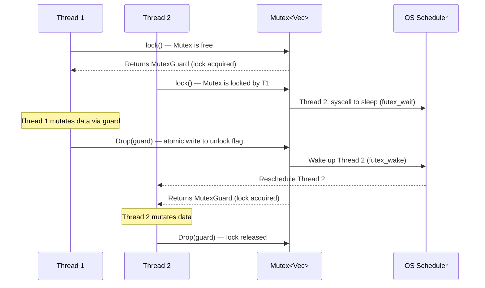
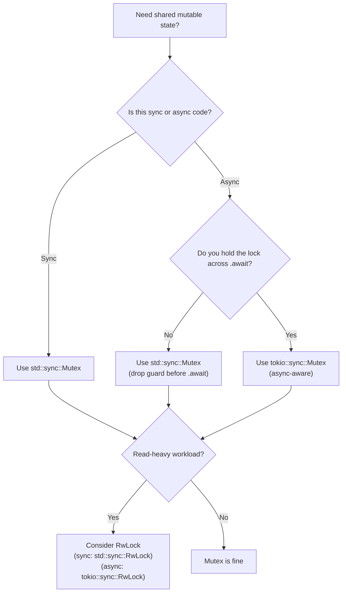

# Chapter 4: Mutexes, RwLocks, and Poisoning 🟡

> **What you'll learn:**
> - How `Mutex<T>` provides interior mutability for shared state across threads — and what the `MutexGuard` RAII pattern means at the machine level
> - Lock poisoning: what happens when a thread panics while holding a lock, and how to handle it
> - `RwLock<T>` for read-heavy workloads — and when it's faster (and slower) than `Mutex`
> - The critical async hazard: why you must **never** hold a `std::sync::Mutex` across an `.await` point

---

## 4.1 Interior Mutability, Revisited for Multiple Threads

In Chapter 2 we saw that `Cell<T>` and `RefCell<T>` provide *single-threaded* interior mutability. For multi-threaded contexts, we need a primitive that includes a synchronization mechanism: the `Mutex<T>`.

A `Mutex<T>` (mutual exclusion lock) wraps a value `T` and ensures only one thread can access it at a time. The API in Rust is different from C++ in a crucial way: **the data is inside the lock**. You cannot accidentally access the data without acquiring the lock first.

```rust
// C++ style (data and lock are separate — easy to forget to lock):
// std::mutex mtx;
// int shared_counter = 0;  // Nothing stops you from accessing this without mtx!
// mtx.lock();
// shared_counter++;  // Manually paired — error-prone
// mtx.unlock();

// Rust style (data is INSIDE the Mutex — access is impossible without locking):
use std::sync::Mutex;
let shared_counter = Mutex::new(0i32);
// There is NO way to access the `i32` inside without calling .lock() first.
// The type system enforces correct usage.
```

---

## 4.2 The `MutexGuard` RAII Pattern

`Mutex::lock()` returns a `LockResult<MutexGuard<T>>`. The `MutexGuard` implements `Deref<Target = T>` and `DerefMut`, giving you access to the inner value. When the guard is *dropped*, the lock is *released*. This is RAII (Resource Acquisition Is Initialization) — the same pattern used for file handles and other resources.

```rust
use std::sync::{Arc, Mutex};
use std::thread;

fn main() {
    // Arc allows multiple threads to own a handle to the Mutex.
    // The Mutex provides synchronized access to the inner Vec.
    let shared_log: Arc<Mutex<Vec<String>>> = Arc::new(Mutex::new(Vec::new()));

    let mut handles = vec![];

    for i in 0..5 {
        let log = Arc::clone(&shared_log);
        let handle = thread::spawn(move || {
            // `lock()` blocks until the Mutex is available.
            // Returns LockResult<MutexGuard<Vec<String>>>.
            let mut guard = log.lock().unwrap();

            // `guard` derefs to `Vec<String>` — we can use all Vec methods.
            guard.push(format!("Entry from thread {}", i));

            // Guard is dropped here — lock is AUTOMATICALLY RELEASED.
            // No need to call unlock(). This prevents lock-release bugs.
        }); // <-- lock released here when `guard` goes out of scope
        handles.push(handle);
    }

    for h in handles {
        h.join().unwrap();
    }

    // All threads done. Lock the main thread to read the final state.
    let log = shared_log.lock().unwrap();
    println!("Log has {} entries:", log.len());
    for entry in log.iter() {
        println!("  {}", entry);
    }
}
```

### What Happens Under the Hood



The underlying mechanism on Linux is a **futex** (fast userspace mutex): an atomic integer that threads can read in userspace, only making a syscall when there's actual contention. Uncontended locks are extremely cheap (a single atomic operation in userspace).

---

## 4.3 Lock Poisoning — When Threads Panic

This is one of Rust's most distinctive (and initially surprising) concurrency features. What happens if a thread panics while holding a lock?

The answer: the `Mutex` becomes **poisoned**. Subsequent calls to `lock()` return `Err(PoisonError)`. This is a safety mechanism — if a thread panicked mid-way through modifying shared data, that data might be in an inconsistent state. Poisoning forces the next thread to actively decide what to do with potentially corrupted data.

```rust
use std::sync::{Arc, Mutex};
use std::thread;

fn demonstrate_poisoning() {
    let counter = Arc::new(Mutex::new(0i32));
    let counter_clone = Arc::clone(&counter);

    // Spawn a thread that panics while holding the lock
    let handle = thread::spawn(move || {
        let mut guard = counter_clone.lock().unwrap();
        *guard = 42; // Partially modify the data
        panic!("Something went wrong!"); // Guard is dropped here → Mutex is POISONED
    });

    // The spawned thread panicked — join() returns Err
    let _ = handle.join(); // We expect Err here

    // Now try to lock the poisoned mutex
    match counter.lock() {
        Ok(guard) => {
            // This branch is unreachable after a panic
            println!("Value: {}", *guard);
        }
        Err(poison_error) => {
            // The PoisonError contains the guard to the (potentially inconsistent) data!
            // We can choose to inspect and recover the data if we know it's safe.
            let guard = poison_error.into_inner(); // Recover the guard
            println!("Mutex was poisoned! Recovered value: {}", *guard);
            // If the data is in a consistent state, we can continue.
            // If not, we should propagate the error or reset the data.
        }
    }
}

fn main() {
    demonstrate_poisoning();
}
```

### Strategies for Handling Poisoned Mutexes

| Strategy | Code | When to Use |
|---|---|---|
| **Propagate** | `mutex.lock()?` | The default — treat poisoning as a fatal error and propagate with `?` |
| **Recover** | `mutex.lock().unwrap_or_else(\|e\| e.into_inner())` | When you know the data format is always consistent regardless of mid-mutation panics |
| **Reset** | `*mutex.lock().unwrap_or_else(\|e\| e.into_inner()) = Default::default()` | When stale/corrupt data is worse than a reset to default |
| **Always unwrap** | `mutex.lock().unwrap()` | Only in simple programs where a panic is a bug you want to detect loudly |

---

## 4.4 Deadlocks — Patterns and Prevention

A deadlock occurs when two threads each hold a lock the other needs, and both wait forever. Rust's type system does **not** prevent deadlocks — that requires runtime analysis (like `deadlock` crate, or careful design).

### The Classic Deadlock

```rust
use std::sync::{Arc, Mutex};
use std::thread;

fn deadlock_example() {
    let resource_a = Arc::new(Mutex::new(0));
    let resource_b = Arc::new(Mutex::new(0));

    let a1 = Arc::clone(&resource_a);
    let b1 = Arc::clone(&resource_b);

    let t1 = thread::spawn(move || {
        let _guard_a = a1.lock().unwrap(); // Thread 1 acquires A
        thread::sleep(std::time::Duration::from_millis(10)); // Simulate work
        let _guard_b = b1.lock().unwrap(); // Thread 1 waits for B — but T2 has it!
        println!("Thread 1 got both locks");
    });

    let a2 = Arc::clone(&resource_a);
    let b2 = Arc::clone(&resource_b);

    let t2 = thread::spawn(move || {
        let _guard_b = b2.lock().unwrap(); // Thread 2 acquires B
        thread::sleep(std::time::Duration::from_millis(10)); // Simulate work
        let _guard_a = a2.lock().unwrap(); // Thread 2 waits for A — but T1 has it!
        println!("Thread 2 got both locks");
    });

    // Both threads are now waiting forever — DEADLOCK
    t1.join().unwrap();
    t2.join().unwrap();
}
```

### Prevention Strategies

**1. Consistent Lock Ordering (most effective):** Always acquire locks in the same global order. If every thread always locks `A` before `B`, deadlock is impossible.

```rust
// ✅ Safe: consistent ordering (always A, then B)
let _guard_a = resource_a.lock().unwrap();
let _guard_b = resource_b.lock().unwrap();
// ... do work ...
// guards dropped in reverse order: B, then A
```

**2. Lock-Free Design:** Use message passing (channels, Chapter 7) or atomics (Chapter 5) to eliminate locks entirely.

**3. `try_lock()`:** Instead of blocking, fail immediately if the lock is unavailable:

```rust
match resource_a.try_lock() {
    Ok(guard) => { /* got it, do work */ }
    Err(_) => { /* lock is held — back off and retry or do other work */ }
}
```

---

## 4.5 `RwLock<T>` — Multiple Readers, One Writer

`RwLock<T>` allows either:
- **Multiple** concurrent *readers* (`read()` — shared, like `&T`)
- **One** exclusive *writer* (`write()` — exclusive, like `&mut T`)

This is ideal for data that is read frequently but written rarely:

```rust
use std::sync::{Arc, RwLock};
use std::thread;

fn main() {
    let config: Arc<RwLock<std::collections::HashMap<String, String>>> =
        Arc::new(RwLock::new({
            let mut m = std::collections::HashMap::new();
            m.insert("timeout".to_string(), "30s".to_string());
            m.insert("max_retries".to_string(), "3".to_string());
            m
        }));

    // Many reader threads — all can run concurrently (no mutual exclusion between readers)
    let mut handles = vec![];
    for i in 0..10 {
        let cfg = Arc::clone(&config);
        handles.push(thread::spawn(move || {
            // `read()` acquires a shared read lock — many threads can hold this simultaneously
            let guard = cfg.read().unwrap();
            println!("Thread {}: timeout={}", i, guard.get("timeout").unwrap());
            // Read lock released when `guard` is dropped
        }));
    }

    // Writer thread — exclusive access, blocks all readers
    let cfg = Arc::clone(&config);
    handles.push(thread::spawn(move || {
        // `write()` acquires an exclusive write lock — blocks until ALL readers are done
        let mut guard = cfg.write().unwrap();
        guard.insert("timeout".to_string(), "60s".to_string());
        println!("Updated timeout to 60s");
        // Write lock released here
    }));

    for h in handles {
        h.join().unwrap();
    }
}
```

### `Mutex` vs. `RwLock` — When to Use Each

| Factor | `Mutex<T>` | `RwLock<T>` |
|---|---|---|
| **Read-write ratio** | Balanced or write-heavy | Read-heavy (>90% reads) |
| **Access pattern** | Simple exclusive access | Need concurrent reads |
| **Implementation cost** | Lighter weight | More complex (2 lock states) |
| **Writer starvation** | N/A | Possible if readers never yield |
| **Poisoning** | Yes | Yes (separate read/write poisoning) |
| **Deadlock potential** | Standard | Higher (write lock waiting for readers) |

> **Rule of thumb:** Start with `Mutex`. Switch to `RwLock` only after benchmarking proves it's faster for your workload. On some platforms and patterns, `Mutex` can outperform `RwLock` even for read-heavy workloads due to lower overhead.

---

## 4.6 ⚠️ The Critical Async Hazard: `std::sync::Mutex` Across `.await`

> **↔ Async Contrast — This Section Could Save Your Production System**

This is one of the most common and damaging bugs in Rust async code. **Never hold a `std::sync::Mutex` guard across an `.await` point.**

Here's why, from first principles:

1. `tokio::spawn` (and other async runtimes) run many async tasks on a **shared pool of OS threads** (the executor).
2. When a task hits `.await`, it *yields* — the OS thread is freed to run other async tasks.
3. If you hold a `std::sync::Mutex` guard across `.await`, the guard *cannot* be dropped (it's a local variable whose drop is triggered by the scope exit). But the *OS thread* the guard is logically tied to may change when the task resumes!
4. On single-threaded executors: you'll **deadlock** — the task holding the lock is waiting, and the executor can't run other tasks (including the one that would release the lock).
5. On multi-threaded executors: you might accidentally contend the Mutex from two OS threads — or simply hold it much longer than intended.

```rust
// ❌ DANGEROUS in async code: holding std::sync::MutexGuard across .await
use std::sync::{Arc, Mutex};
use tokio::time::{sleep, Duration};

async fn bad_async_function(shared: Arc<Mutex<Vec<String>>>) {
    let mut guard = shared.lock().unwrap(); // Acquire std::sync::Mutex...
    guard.push("start".to_string());

    sleep(Duration::from_millis(100)).await; // .await while holding the guard!
    // ⚠️ The Mutex is held for the entire 100ms sleep.
    // Other tasks that need this lock are blocked for 100ms.
    // On a single-threaded executor, this CAN DEADLOCK.

    guard.push("end".to_string());
    // Guard dropped here
}
```

**The compiler does warn about `Send` issues:** `std::sync::MutexGuard<T>` is `!Send` (because the underlying OS mutex must be unlocked by the same thread). When you hold it across `.await`, the async task's `Future` becomes `!Send`, which causes a compile error if you try to use it with `tokio::spawn`.

```rust
// ❌ FAILS TO COMPILE (with tokio::spawn, which requires Send):
// error: future cannot be sent between threads safely
// note: future is not `Send` because `std::sync::MutexGuard<_>` is not `Send`
async fn bad_fn(shared: Arc<Mutex<i32>>) {
    let guard = shared.lock().unwrap();
    tokio::time::sleep(Duration::from_millis(1)).await; // guard held here!
    println!("{}", *guard);
}
// tokio::spawn(bad_fn(shared)); // ❌ compile error if Future is !Send
```

### The Solutions

**Option 1: Drop the guard before `.await`**

```rust
// ✅ CORRECT: Release the lock before yielding
async fn good_fn_option1(shared: Arc<Mutex<Vec<String>>>) {
    {
        let mut guard = shared.lock().unwrap();
        guard.push("start".to_string());
    } // Guard dropped here — lock released BEFORE the .await

    tokio::time::sleep(Duration::from_millis(100)).await; // No lock held

    {
        let mut guard = shared.lock().unwrap();
        guard.push("end".to_string());
    }
}
```

**Option 2: Use `tokio::sync::Mutex`**

```rust
// ✅ CORRECT: tokio's async-aware Mutex
use tokio::sync::Mutex as AsyncMutex;
use std::sync::Arc;

async fn good_fn_option2(shared: Arc<AsyncMutex<Vec<String>>>) {
    // tokio::sync::MutexGuard IS Send — it stores which task holds it, not which OS thread.
    let mut guard = shared.lock().await; // Async lock — yields if unavailable
    guard.push("start".to_string());
    
    tokio::time::sleep(Duration::from_millis(100)).await; // .await while holding guard: OK!
    
    guard.push("end".to_string());
    // Guard dropped here — async-aware unlock
}
```

**Option 3: Restructure to avoid shared state**

Often the best solution is to eliminate the shared Mutex entirely by using channels (see Chapter 7) or by redesigning the data flow.

### Decision Guide



---

<details>
<summary><strong>🏋️ Exercise: Thread-Safe LRU Cache</strong> (click to expand)</summary>

**Challenge:** Implement a simple thread-safe LRU (Least Recently Used) cache using `Arc<RwLock<T>>`. The cache should:

1. Support a fixed `capacity`.
2. Provide `get(&key) -> Option<Value>` — a read operation (upgrades to write to update LRU order).
3. Provide `insert(key, value)` — a write operation that evicts the LRU entry if at capacity.
4. Be usable from multiple threads concurrently.

Use `LinkedHashMap` from the `linked-hash-map` crate (or simulate LRU ordering manually).

**For simplicity, implement a version where `get` also takes a write lock** (to update access order), then explain in comments why this is still better than using a single `Mutex` with mixed reads/writes.

<details>
<summary>🔑 Solution</summary>

```rust
use std::collections::HashMap;
use std::sync::{Arc, Mutex};

// LRU Cache using a Mutex<HashMap> + a VecDeque for ordering.
// A production implementation would use `linked-hash-map` or `lru` crate,
// but we implement manually for illustration.
use std::collections::VecDeque;

struct LruInner<K: Clone + Eq + std::hash::Hash, V: Clone> {
    capacity: usize,
    map: HashMap<K, V>,
    order: VecDeque<K>, // Front = most recently used, Back = LRU
}

impl<K: Clone + Eq + std::hash::Hash, V: Clone> LruInner<K, V> {
    fn new(capacity: usize) -> Self {
        LruInner {
            capacity,
            map: HashMap::new(),
            order: VecDeque::new(),
        }
    }

    fn move_to_front(&mut self, key: &K) {
        // Remove from current position and move to front (most recently used)
        if let Some(pos) = self.order.iter().position(|k| k == key) {
            self.order.remove(pos);
        }
        self.order.push_front(key.clone());
    }

    fn get(&mut self, key: &K) -> Option<V> {
        // We need &mut self because we update LRU order on get.
        // This is why we use Mutex rather than RwLock in this design —
        // every "read" is actually a write (for LRU tracking).
        if self.map.contains_key(key) {
            self.move_to_front(key);
            self.map.get(key).cloned()
        } else {
            None
        }
    }

    fn insert(&mut self, key: K, value: V) {
        if self.map.contains_key(&key) {
            // Update existing: refresh to most recently used
            self.map.insert(key.clone(), value);
            self.move_to_front(&key);
        } else {
            // Evict LRU if at capacity
            if self.map.len() >= self.capacity {
                if let Some(lru_key) = self.order.pop_back() {
                    self.map.remove(&lru_key);
                }
            }
            self.map.insert(key.clone(), value);
            self.order.push_front(key);
        }
    }
}

/// Thread-safe LRU cache.
/// Uses Mutex rather than RwLock because `get` must update LRU order (mutation).
/// If this were a pure read cache (no LRU update), RwLock would be appropriate.
#[derive(Clone)]
pub struct LruCache<K: Clone + Eq + std::hash::Hash, V: Clone> {
    inner: Arc<Mutex<LruInner<K, V>>>,
}

impl<K: Clone + Eq + std::hash::Hash, V: Clone> LruCache<K, V> {
    pub fn new(capacity: usize) -> Self {
        assert!(capacity > 0, "Cache capacity must be > 0");
        LruCache {
            inner: Arc::new(Mutex::new(LruInner::new(capacity))),
        }
    }

    pub fn get(&self, key: &K) -> Option<V> {
        // Lock is held only for the duration of this call — not across any .await.
        self.inner.lock().expect("LruCache mutex poisoned").get(key)
    }

    pub fn insert(&self, key: K, value: V) {
        self.inner.lock().expect("LruCache mutex poisoned").insert(key, value);
    }

    pub fn len(&self) -> usize {
        self.inner.lock().expect("LruCache mutex poisoned").map.len()
    }
}

// ------ Test from multiple threads ------
use std::thread;

fn main() {
    // Capacity of 3 entries
    let cache: LruCache<String, i32> = LruCache::new(3);

    // Warm up the cache
    cache.insert("a".to_string(), 1);
    cache.insert("b".to_string(), 2);
    cache.insert("c".to_string(), 3);

    let mut handles = vec![];

    // 4 reader threads
    for i in 0..4 {
        let cache_clone = cache.clone(); // Clone the Arc handle, not the data
        handles.push(thread::spawn(move || {
            let key = ["a", "b", "c", "d"][i % 4].to_string();
            let result = cache_clone.get(&key);
            println!("Thread {}: get('{}') = {:?}", i, key, result);
        }));
    }

    // 1 writer thread that causes an eviction
    {
        let cache_clone = cache.clone();
        handles.push(thread::spawn(move || {
            cache_clone.insert("d".to_string(), 4); // Evicts LRU entry
            println!("Writer: inserted 'd'. Cache size: {}", cache_clone.len());
        }));
    }

    for h in handles {
        h.join().unwrap();
    }

    println!("Final cache size: {}", cache.len());
}
```

**Design notes:**
- We use `Mutex` (not `RwLock`) because `get` mutates LRU order — every operation is a write.
- The lock is held briefly (for the duration of `get` or `insert`), never across blocking calls.
- `LruCache` is `Clone` — cloning just increments the `Arc` reference count (cheap).
- In real production code, consider the `lru` crate, which has a well-tested implementation.

</details>
</details>

---

> **Key Takeaways**
> - `Mutex<T>` in Rust enforces correct usage at the type level: you *cannot* access the inner `T` without calling `lock()`. The `MutexGuard` provides RAII-based automatic unlock.
> - Lock poisoning is Rust's mechanism for surfacing the possibility of a half-mutated shared state after a thread panic. Always handle `PoisonError` deliberately in production.
> - `RwLock<T>` is appropriate for read-heavy workloads; benchmark before switching, as it carries higher overhead than `Mutex` on some platforms.
> - **Never hold `std::sync::MutexGuard` across `.await` in async code.** Use `tokio::sync::Mutex` for async contexts, or restructure to drop the guard before yielding.

> **See also:**
> - [Chapter 2: The `Send` and `Sync` Traits](ch02-send-and-sync-traits.md) — why `MutexGuard` is `!Send`
> - [Chapter 5: Atomics and Lock-Free Programming](ch05-atomics-and-lock-free.md) — bypassing locks entirely for simple types
> - [Chapter 7: Standard Channels (mpsc)](ch07-standard-channels-mpsc.md) — sharing state by communication instead of locking
> - *Async Rust* companion guide, Chapter 6 — `tokio::sync::Mutex`, `tokio::sync::RwLock`, and async-aware synchronization
