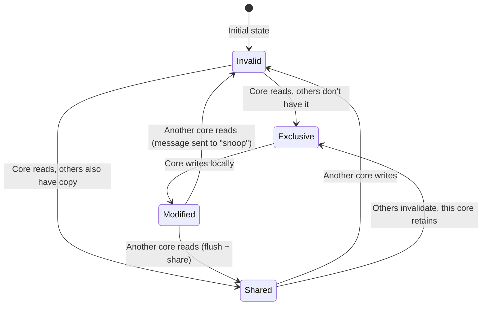

# Chapter 5: Atomics and Lock-Free Programming 🔴

> **What you'll learn:**
> - The hardware reality behind atomics: CPU cache lines, the MESI protocol, and why non-atomic operations race
> - Rust's atomic types (`AtomicUsize`, `AtomicBool`, `AtomicPtr`) and their fundamental operations
> - Compare-And-Swap (CAS) loops — the foundation of all lock-free data structures
> - Building a lock-free stack and a spinlock from first principles, understanding why they're correct

---

## 5.1 Hardware First: Why Atomics Are Necessary

To understand atomics, you must understand what happens at the CPU level when two cores access the same memory location.

### Cache Lines and the MESI Protocol

Modern CPUs do not read individual bytes from RAM. They read **cache lines** — typically 64 bytes on x86/ARM. Every CPU core has its own L1 and L2 cache, and shared L3 cache. When two cores want to modify the same memory location, they are competing for the same cache line.

The **MESI protocol** (Modified, Exclusive, Shared, Invalid) is the cache coherence protocol that modern CPUs use:



When Core A modifies a cache line that Core B is also caching:
1. Core A sends a "invalidate" message on the **interconnect bus**
2. Core B marks its copy as Invalid
3. Core B must fetch the new value from Core A's cache or from memory

This **cache invalidation** is the root source of memory visibility latency between threads. Atomic operations are designed to participate correctly in this protocol.

### A Non-Atomic Increment: The Problem

On x86, incrementing an integer (`i += 1`) compiles to three machine instructions:
```asm
MOV  eax, [counter]   ; 1. Load current value from memory into register
ADD  eax, 1          ; 2. Add 1 in the register
MOV  [counter], eax  ; 3. Store the new value back to memory
```

If two threads execute this sequence concurrently, operations can interleave:

```
Thread 1: LOAD(counter)  → gets 0
Thread 2: LOAD(counter)  → gets 0
Thread 1: ADD 0 + 1 = 1
Thread 2: ADD 0 + 1 = 1
Thread 1: STORE 1
Thread 2: STORE 1        → Counter = 1, but should be 2!
```

This is a **data race** — undefined behavior in Rust (and C++). The fix is a single atomic instruction like `LOCK XADD` (x86) which performs the load-add-store as a single **indivisible** (atomic) operation that participates correctly in the MESI protocol.

---

## 5.2 Rust's Atomic Types

All atomic types live in `std::sync::atomic`. They wrap primitive integer, boolean, or pointer types and expose methods that map to hardware atomic instructions.

```rust
use std::sync::atomic::{AtomicBool, AtomicI32, AtomicUsize, Ordering};
use std::sync::Arc;
use std::thread;

fn demonstrate_atomics() {
    // AtomicUsize wraps a usize with atomic access semantics
    let counter = Arc::new(AtomicUsize::new(0));

    let mut handles = vec![];
    for _ in 0..10 {
        let c = Arc::clone(&counter);
        handles.push(thread::spawn(move || {
            for _ in 0..1000 {
                // `fetch_add` atomically: reads the value, adds 1, writes back.
                // Returns the PREVIOUS value. No other thread can interleave.
                // `Relaxed` ordering is explained in Chapter 6.
                c.fetch_add(1, Ordering::Relaxed);
            }
        }));
    }

    for h in handles {
        h.join().unwrap();
    }

    // Always exactly 10,000 — no lost increments, no data race
    assert_eq!(counter.load(Ordering::Relaxed), 10_000);
    println!("Counter: {}", counter.load(Ordering::Relaxed));
}
```

### Available Atomic Types

| Type | Wraps | Common Use |
|---|---|---|
| `AtomicBool` | `bool` | Flags (shutdown signal, ready indicator) |
| `AtomicI8/16/32/64/128` | signed integers | Signed counters |
| `AtomicU8/16/32/64/128` | unsigned integers | Unsigned counters, indices |
| `AtomicUsize` | `usize` (platform-native) | Indices, counts, sizes |
| `AtomicIsize` | `isize` | Signed platform-native integers |
| `AtomicPtr<T>` | `*mut T` | Lock-free pointer swapping |

### Core Atomic Operations

```rust
use std::sync::atomic::{AtomicUsize, Ordering};

let atom = AtomicUsize::new(5);

// 1. `load` — read the current value atomically
let val = atom.load(Ordering::Acquire);  // val == 5

// 2. `store` — write a new value atomically
atom.store(10, Ordering::Release);

// 3. `fetch_add` — atomically add, returns PREVIOUS value
let old = atom.fetch_add(3, Ordering::AcqRel);  // old == 10, atom == 13

// 4. `fetch_sub` — atomically subtract, returns PREVIOUS value
let old = atom.fetch_sub(1, Ordering::AcqRel);  // old == 13, atom == 12

// 5. `fetch_and`, `fetch_or`, `fetch_xor` — bitwise ops, return PREVIOUS value
atom.fetch_or(0b0001, Ordering::Relaxed);  // Set bit 0

// 6. `swap` — atomically write new value and return OLD value
let old = atom.swap(42, Ordering::AcqRel);  // old == whatever atom was, atom == 42

// 7. `compare_exchange` — THE FOUNDATION OF LOCK-FREE PROGRAMMING
// Atomically: if atom == expected, set atom = new; return Ok(old) or Err(actual)
let result = atom.compare_exchange(
    42,              // expected
    100,             // new value (only written if current == expected)
    Ordering::AcqRel, // success ordering
    Ordering::Acquire, // failure ordering
);
// result == Ok(42) if we succeeded, Err(actual) if atom != 42
```

---

## 5.3 Compare-And-Swap (CAS) Loops

`compare_exchange` (CAS) is the primitive building block of all lock-free algorithms. The pattern is always the same:

1. Read the current value.
2. Compute the new desired value.
3. Atomically: If the value hasn't changed since step 1, write the new value. Otherwise, retry.

This is fundamentally different from a mutex: instead of blocking, you **retry**. This makes CAS-based algorithms progress-free in a different sense — individual operations can fail and retry, but no thread ever *blocks* waiting for another.

### The CAS Loop Pattern

```rust
use std::sync::atomic::{AtomicUsize, Ordering};

fn cas_increment(counter: &AtomicUsize) {
    loop {
        // Step 1: Read the current value (snapshot)
        let current = counter.load(Ordering::Acquire);

        // Step 2: Compute what we want to write
        let new_value = current + 1;

        // Step 3: Atomically try to swap
        // If `counter` still equals `current`, write `new_value` and break.
        // If `counter` changed (another thread modified it), `compare_exchange`
        // returns Err(actual_value) — we loop again with the new actual value.
        match counter.compare_exchange(
            current,
            new_value,
            Ordering::AcqRel,  // Success: full memory barrier
            Ordering::Acquire, // Failure: at least read-side barrier
        ) {
            Ok(_) => break,   // We successfully wrote new_value
            Err(_) => continue, // Someone else changed it — try again
        }
    }
}
```

**Performance note:** `compare_exchange_weak` is a variant that can occasionally fail spuriously (without another thread intervening). It's slightly faster on ARM processors (which use `LDREX`/`STREX` pairs), and should be used in retry loops where spurious failure is acceptable.

```rust
fn cas_increment_weak(counter: &AtomicUsize) {
    let mut current = counter.load(Ordering::Relaxed);
    loop {
        match counter.compare_exchange_weak(
            current,
            current + 1,
            Ordering::AcqRel,
            Ordering::Relaxed,
        ) {
            Ok(_) => break,
            Err(actual) => current = actual, // Update our snapshot
        }
    }
}
```

---

## 5.4 A Lock-Free Stack (Treiber Stack)

The Treiber Stack is the simplest canonical lock-free data structure. It's a singly-linked stack where push/pop are implemented with CAS on the `head` pointer.

```rust
use std::sync::atomic::{AtomicPtr, Ordering};
use std::ptr;

struct Node<T> {
    data: T,
    next: *mut Node<T>,
}

/// A lock-free, unbounded stack.
/// 
/// Safety invariant: `head` is always either null (empty stack) or a valid
/// pointer to a heap-allocated `Node<T>`. Nodes are only deallocated in
/// `pop()` by the thread that successfully CAS-ed `head` away from the node.
pub struct TreiberStack<T> {
    // AtomicPtr wraps a raw pointer for atomic load/store/CAS operations.
    head: AtomicPtr<Node<T>>,
}

impl<T> TreiberStack<T> {
    pub fn new() -> Self {
        TreiberStack {
            head: AtomicPtr::new(ptr::null_mut()),
        }
    }

    pub fn push(&self, data: T) {
        // Allocate the new node on the heap.
        // Box::into_raw converts Box<Node<T>> to a raw *mut Node<T>,
        // transferring ownership to the stack (we take responsibility for freeing it).
        let new_node = Box::into_raw(Box::new(Node {
            data,
            next: ptr::null_mut(), // Will be set below
        }));

        loop {
            // Step 1: Read the current head (snapshot)
            let current_head = self.head.load(Ordering::Acquire);

            // Step 2: Link the new node to the current head
            // SAFETY: new_node is valid — we just allocated it above
            unsafe { (*new_node).next = current_head; }

            // Step 3: CAS — if head == current_head, set head = new_node
            match self.head.compare_exchange(
                current_head,  // expected
                new_node,      // new: make new_node the head
                Ordering::Release, // Success: release so other threads see our Node
                Ordering::Relaxed, // Failure: just retry
            ) {
                Ok(_) => return, // Successfully pushed
                Err(_) => {
                    // Another thread modified head — our `next` pointer is stale.
                    // Loop and reread head.
                    // We do NOT free new_node here — it's fine, we'll fix its `next`
                    continue;
                }
            }
        }
    }

    pub fn pop(&self) -> Option<T> {
        loop {
            // Step 1: Snapshot the current head
            let current_head = self.head.load(Ordering::Acquire);

            if current_head.is_null() {
                return None; // Stack is empty
            }

            // Step 2: Read the next pointer of the current head
            // SAFETY: current_head is non-null and was a valid Box allocation
            let next = unsafe { (*current_head).next };

            // Step 3: CAS — if head == current_head, set head = next
            match self.head.compare_exchange(
                current_head,
                next,
                Ordering::AcqRel,
                Ordering::Acquire,
            ) {
                Ok(_) => {
                    // We successfully popped current_head from the stack.
                    // Reconstruct the Box to reclaim ownership and drop it.
                    // SAFETY: We're the sole owner — no other thread can access this node.
                    let node = unsafe { Box::from_raw(current_head) };
                    return Some(node.data);
                }
                Err(_) => continue, // Another thread modified head — retry
            }
        }
    }
}

// Safety: TreiberStack is Send and Sync if T is Send.
// We manage raw pointers, but the ownership protocol (CAS-based exclusive pop)
// ensures no aliasing of mutable data.
unsafe impl<T: Send> Send for TreiberStack<T> {}
unsafe impl<T: Send> Sync for TreiberStack<T> {}

impl<T> Drop for TreiberStack<T> {
    fn drop(&mut self) {
        // Drain the remaining nodes to avoid memory leaks.
        while self.pop().is_some() {}
    }
}

fn main() {
    use std::sync::Arc;
    use std::thread;

    let stack = Arc::new(TreiberStack::new());

    // Multiple producer threads
    let mut handles = vec![];
    for i in 0..4 {
        let s = Arc::clone(&stack);
        handles.push(thread::spawn(move || {
            for j in 0..10 {
                s.push(i * 10 + j);
            }
        }));
    }

    // Consumer thread
    let s = Arc::clone(&stack);
    handles.push(thread::spawn(move || {
        std::thread::sleep(std::time::Duration::from_millis(10));
        let mut count = 0;
        while s.pop().is_some() { count += 1; }
        println!("Popped {} items", count);
    }));

    for h in handles { h.join().unwrap(); }
}
```

> **⚠️ The ABA Problem:** The Treiber Stack as shown is susceptible to the ABA problem in theory (less so in practice with type-safe Rust). If thread T1 reads `head = A`, gets preempted, thread T2 pops A, pushes a new node (which happens to reuse the same address A due to the allocator), and T1's CAS succeeds even though the stack changed. The solution uses hazard pointers or epoch-based reclamation — discussed in production lock-free libraries like `crossbeam-epoch`.

---

## 5.5 Building a Spinlock from Atomics

A spinlock is the simplest possible mutual exclusion primitive: instead of syscalling into the OS kernel to sleep, the waiting thread "spins" in a tight loop checking the lock. This is appropriate only for **very short critical sections** where the cost of a context switch would dominate.

```rust
use std::sync::atomic::{AtomicBool, Ordering};
use std::cell::UnsafeCell;
use std::ops::{Deref, DerefMut};

pub struct SpinLock<T> {
    locked: AtomicBool,
    data: UnsafeCell<T>, // UnsafeCell allows interior mutability
}

pub struct SpinGuard<'a, T> {
    lock: &'a SpinLock<T>,
}

impl<T> SpinLock<T> {
    pub fn new(data: T) -> Self {
        SpinLock {
            locked: AtomicBool::new(false),
            data: UnsafeCell::new(data),
        }
    }

    pub fn lock(&self) -> SpinGuard<T> {
        // Spin until we successfully CAS `locked` from false → true.
        // `compare_exchange_weak` can spuriously fail — that's fine here
        // because we loop anyway.
        while self
            .locked
            .compare_exchange_weak(
                false,           // Expected: not locked
                true,            // New: locked
                Ordering::Acquire, // If we succeed, acquire memory barrier
                Ordering::Relaxed, // If we fail, no barrier needed
            )
            .is_err()
        {
            // Spin hint: tell the CPU this is a spin-wait loop.
            // On x86, this compiles to the `PAUSE` instruction, which:
            // 1. Reduces power consumption
            // 2. Prevents pipeline issues from speculative memory reads
            // 3. Improves performance of the memory subsystem
            std::hint::spin_loop();
        }

        SpinGuard { lock: self }
    }
}

// SAFETY: SpinLock provides exclusive access via atomics — only one thread
// holds the SpinGuard at a time. The UnsafeCell mutation is safe because
// of this exclusion guarantee.
unsafe impl<T: Send> Send for SpinLock<T> {}
unsafe impl<T: Send> Sync for SpinLock<T> {}

impl<T> Deref for SpinGuard<'_, T> {
    type Target = T;
    fn deref(&self) -> &T {
        // SAFETY: We hold the lock, so no other thread has access to data.
        unsafe { &*self.lock.data.get() }
    }
}

impl<T> DerefMut for SpinGuard<'_, T> {
    fn deref_mut(&mut self) -> &mut T {
        // SAFETY: We hold the lock, so no other thread has mutable access.
        unsafe { &mut *self.lock.data.get() }
    }
}

impl<T> Drop for SpinGuard<'_, T> {
    fn drop(&mut self) {
        // Release the lock: store `false` with Release ordering.
        // The Release ordering ensures all our writes are visible to the
        // next thread that acquires the lock.
        self.lock.locked.store(false, Ordering::Release);
    }
}

fn main() {
    use std::sync::Arc;
    use std::thread;

    let counter = Arc::new(SpinLock::new(0usize));
    let mut handles = vec![];

    for _ in 0..4 {
        let c = Arc::clone(&counter);
        handles.push(thread::spawn(move || {
            for _ in 0..1000 {
                let mut guard = c.lock();
                *guard += 1;
                // SpinGuard dropped here — lock released
            }
        }));
    }

    for h in handles { h.join().unwrap(); }
    println!("Final count: {}", *counter.lock()); // Always 4000
}
```

### When to Use Spinlocks vs. `Mutex`

| Factor | `SpinLock` | `std::sync::Mutex` |
|---|---|---|
| **Critical section** | Microseconds or less | Any duration |
| **Contention** | Very low expected contention | Any |
| **CPU impact** | Burns CPU while spinning | Sleeps — yields the CPU |
| **Latency** | Lower (no syscall when uncontended) | Higher (syscall on contention) |
| **Best for** | Interrupt handlers, real-time paths | General purpose |

---

<details>
<summary><strong>🏋️ Exercise: Lock-Free Metrics Counter</strong> (click to expand)</summary>

**Challenge:** Build a multi-valued metrics counter that tracks `requests`, `errors`, and `latency_sum_ns` across multiple threads, using only atomics (no `Mutex`). The counter should support:

1. `record_request(latency_ns: u64)` — atomically increment requests and add to latency
2. `record_error()` — atomically increment errors
3. `snapshot() -> MetricsSnapshot` — atomically read a consistent snapshot of all three values

**Note:** True atomic snapshot of multiple fields is subtle. For this exercise, accept the "near-consistent" snapshot (read each field independently) and explain in comments why that's acceptable for metrics.

<details>
<summary>🔑 Solution</summary>

```rust
use std::sync::atomic::{AtomicU64, Ordering};
use std::sync::Arc;
use std::thread;

pub struct MetricsSnapshot {
    pub requests: u64,
    pub errors: u64,
    pub latency_sum_ns: u64,
    pub avg_latency_ns: f64,
    pub error_rate: f64,
}

/// Lock-free metrics counter using per-field atomics.
/// 
/// Design decision: We use separate atomics for each field rather than
/// a Mutex<MetricsStruct>. This gives us:
/// - No contention between threads that only update different fields
/// - No lock poisoning risk
/// - Lower latency for hot update paths (no kernel involvement)
/// 
/// Trade-off: `snapshot()` is NOT truly atomic — it reads three separate
/// atomics, so the values may be from slightly different moments in time.
/// For metrics/monitoring purposes, this is acceptable. For financial
/// accounting or exact consistency, use Mutex.
pub struct Metrics {
    requests: AtomicU64,
    errors: AtomicU64,
    latency_sum_ns: AtomicU64,
}

impl Metrics {
    pub fn new() -> Self {
        Metrics {
            requests: AtomicU64::new(0),
            errors: AtomicU64::new(0),
            latency_sum_ns: AtomicU64::new(0),
        }
    }

    /// Record a successful request with its latency.
    /// 
    /// Uses Relaxed ordering because:
    /// 1. We don't need these updates to synchronize with specific other operations.
    /// 2. snapshot() uses Acquire, which will see all Relaxed writes that happened-before.
    /// 3. The atomicity of individual fetch_add is guaranteed regardless of ordering.
    pub fn record_request(&self, latency_ns: u64) {
        // Both updates are individually atomic. The two fetch_adds are NOT
        // jointly atomic — another thread's snapshot could see one but not the other.
        // For metrics, this is acceptable (we'd be off by at most one request's latency).
        self.requests.fetch_add(1, Ordering::Relaxed);
        self.latency_sum_ns.fetch_add(latency_ns, Ordering::Relaxed);
    }

    pub fn record_error(&self) {
        self.errors.fetch_add(1, Ordering::Relaxed);
    }

    /// Returns a "best-effort" snapshot of current metrics.
    /// 
    /// The three loads are ordered with Acquire, which means we'll see all
    /// Relaxed writes from other threads that happened before a synchronization
    /// point. However, the three values may not be perfectly simultaneous.
    /// 
    /// For observability and monitoring, this is the standard tradeoff:
    /// exact consistency requires a Mutex and serialization of all reads.
    pub fn snapshot(&self) -> MetricsSnapshot {
        // Use SeqCst for snapshot to get a more consistent view.
        // SeqCst creates a total order, reducing the window for inconsistency.
        let requests = self.requests.load(Ordering::SeqCst);
        let errors = self.errors.load(Ordering::SeqCst);
        let latency_sum_ns = self.latency_sum_ns.load(Ordering::SeqCst);

        let avg_latency_ns = if requests > 0 {
            latency_sum_ns as f64 / requests as f64
        } else {
            0.0
        };

        let error_rate = if requests > 0 {
            errors as f64 / requests as f64
        } else {
            0.0
        };

        MetricsSnapshot {
            requests,
            errors,
            latency_sum_ns,
            avg_latency_ns,
            error_rate,
        }
    }
}

fn main() {
    let metrics = Arc::new(Metrics::new());
    let mut handles = vec![];

    // Simulate 8 threads recording requests
    for thread_id in 0..8 {
        let m = Arc::clone(&metrics);
        handles.push(thread::spawn(move || {
            for i in 0..1000 {
                let latency = 1_000_000u64 + (thread_id * 100 + i % 50) as u64; // ~1ms + noise
                m.record_request(latency);

                // 5% error rate simulation
                if i % 20 == 0 {
                    m.record_error();
                }
            }
        }));
    }

    for h in handles {
        h.join().unwrap();
    }

    let snap = metrics.snapshot();
    println!("=== Metrics Snapshot ===");
    println!("Total Requests:   {}", snap.requests);
    println!("Total Errors:     {}", snap.errors);
    println!("Error Rate:       {:.2}%", snap.error_rate * 100.0);
    println!("Avg Latency:      {:.0}ns ({:.3}ms)", snap.avg_latency_ns, snap.avg_latency_ns / 1e6);
    println!("Total Latency:    {}ns", snap.latency_sum_ns);

    // Verify: 8 threads * 1000 requests each = 8000 total
    assert_eq!(snap.requests, 8000);
    // 8 threads * 50 errors each (i % 20 == 0 for i in 0..1000) = 400 total
    assert_eq!(snap.errors, 400);
}
```

</details>
</details>

---

> **Key Takeaways**
> - Atomic operations are hardware-guaranteed **indivisible** operations. They participate correctly in the CPU's cache coherence protocol (MESI), eliminating data races on individual values without locks.
> - `compare_exchange` (CAS) is the fundamental primitive of lock-free programming: read, compute, conditionally write. Retry on failure — no thread ever blocks.
> - The Treiber Stack demonstrates that lock-free data structures are possible but require careful reasoning about ownership (who frees nodes) and memory ordering.
> - Spinlocks are appropriate only for microsecond-scale critical sections with very low contention. Prefer `std::sync::Mutex` for general use.
> - The ABA problem is a subtle hazard in lock-free pointer manipulation; real production lock-free libraries use epoch-based reclamation (e.g., `crossbeam-epoch`).

> **See also:**
> - [Chapter 6: Memory Ordering](ch06-memory-ordering.md) — a complete guide to `Relaxed`, `Acquire`, `Release`, and `SeqCst`
> - [Chapter 8: Advanced Channels with Crossbeam](ch08-advanced-channels-crossbeam.md) — production-quality lock-free channels
> - *Rust Memory Management* companion guide — Chapter on `UnsafeCell` and interior mutability internals
