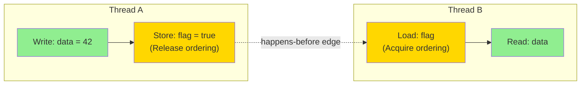
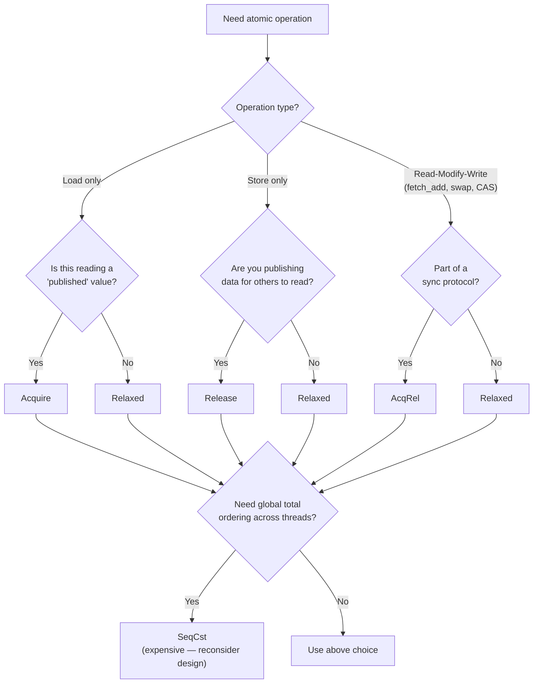

# Chapter 6: Memory Ordering 🔴

> **What you'll learn:**
> - Why both the **compiler** and the **CPU** reorder your instructions — and why that's normally fine but catastrophic in concurrent code
> - The formal definitions of `Relaxed`, `Acquire`, `Release`, `AcqRel`, and `SeqCst` orderings — not just "use SeqCst to be safe" but *exactly* what each one guarantees
> - How `Acquire`/`Release` pairs create *happens-before* edges between threads — the mathematical foundation of synchronization
> - How to reason about a flag-based publish pattern and why incorrect ordering leads to bugs that only appear on ARM/PowerPC architectures

---

## 6.1 The Reordering Problem: Two Levels

Memory ordering is confusing because the problem exists at two distinct levels, and both must be addressed:

### Level 1: Compiler Reordering

The compiler — specifically LLVM, Rust's backend — performs aggressive optimizations. It can reorder, eliminate, merge, or hoist memory operations as long as the resulting program is *observationally equivalent* within a single thread:

```rust
// What you wrote:
let flag = true;
let data = compute_something();

// What the compiler might generate:
// (order flipped — this is fine in a single-threaded context!)
let data = compute_something();
let flag = true;
```

Single-threaded, this reordering is invisible. Across threads, it's catastrophic: another thread might see `flag = true` before `data` is initialized.

### Level 2: CPU Instruction Reordering

Even if the compiler generates instructions in the right order, modern CPUs have deep pipelines and out-of-order execution units. They execute instructions based on data dependencies and resource availability, not necessarily in program order. An ARM A76 core can have 128+ instructions in-flight simultaneously.

CPUs maintain a **"memory model"** — a specification of what reorderings they guarantee will NOT happen. x86's memory model is relatively strong (only store-load reordering is allowed). ARM's model is weaker (most reorderings are possible). This is why concurrency bugs that are latent on x86 often manifest on ARM servers (AWS Graviton, Apple Silicon).

### The Solution: Memory Barriers (Fences)

A **memory barrier** (or fence) is a CPU instruction that prevents specific categories of reordering. `Ordering` values in Rust's atomic API specify what barriers to emit.



The `Release` on the store and `Acquire` on the load *together* create a **happens-before relationship**: Thread B, after its `Acquire` load sees `true`, is guaranteed to see all writes Thread A made *before* its `Release` store.

---

## 6.2 The Five Orderings, Precisely Defined

All orderings in Rust correspond directly to the C++11 memory model (from which Rust inherits its concurrency model). We will define each precisely.

### `Ordering::Relaxed` — No Synchronization Guarantees

```rust
use std::sync::atomic::{AtomicUsize, Ordering};

let counter = AtomicUsize::new(0);
counter.fetch_add(1, Ordering::Relaxed);
```

- **Guarantees:** The operation is **atomic** (no torn reads/writes on the specific variable). Nothing else.
- **Does NOT guarantee:** Other threads will see this write in any particular order relative to other writes.
- **CPU instructions generated:** None. No barrier. Just the atomic read-modify-write instruction.
- **Use when:** You only care about per-variable atomicity, not cross-variable ordering. Classic use: metrics counters where exact consistency between multiple counters doesn't matter.

### `Ordering::Acquire` — "I Am Starting to Read a Published Value"

```rust
// On the reading side of a publish-subscribe pattern:
let value = flag.load(Ordering::Acquire);
// After this load, if `value` is the "ready" signal, all writes that
// the writer made before its Release store are NOW visible to us.
```

- **Guarantees:** No memory reads or writes in the current thread can be reordered *before* this operation. (A "load fence" inserted *after* the load, preventing subsequent reads from moving above it.)
- **Use on:** The consumer side of producer/consumer patterns, after checking a flag or pointer.
- **CPU instructions:** On x86: typically free (x86 loads have Acquire semantics by default). On ARM: loads a `LDAR` instruction (Load-Acquire).

### `Ordering::Release` — "I Am Publishing a Value"

```rust
// On the writing side of a publish-subscribe pattern:
data.store(42, Ordering::Relaxed);   // or many writes above...
flag.store(true, Ordering::Release); // "All the above writes are now safe to read"
```

- **Guarantees:** No memory reads or writes in the current thread can be reordered *after* this operation. (A "store fence" inserted *before* the store, preventing preceding writes from moving below it.)
- **Use on:** The producer side — after preparing data, before setting a "ready" flag.
- **CPU instructions:** On x86: typically free. On ARM: `STLR` (Store-Release).

### `Ordering::AcqRel` — Both Directions (for Read-Modify-Write)

```rust
// For operations that do both a load AND a store (fetch_add, compare_exchange, swap):
let old = counter.fetch_add(1, Ordering::AcqRel);
```

- **Guarantees:** The load portion has `Acquire` semantics; the store portion has `Release` semantics.
- **Use on:** Read-modify-write operations in the middle of a synchronization protocol (e.g., a counter used to synchronize between multiple threads).

### `Ordering::SeqCst` — Sequential Consistency (The Strongest)

```rust
let val = flag.load(Ordering::SeqCst);
counter.store(0, Ordering::SeqCst);
```

- **Guarantees:** A **total global order** exists for all `SeqCst` operations across all threads. Every thread will observe these operations in the same order.
- **Cost:** On x86, `SeqCst` stores require a `MFENCE` (memory fence) instruction — the most expensive barrier. On ARM, both loads and stores require barrier instructions.
- **Use when:** You need multiple threads to agree on a single total ordering of events. The most conservative choice, and often unnecessary. **Don't default to SeqCst** — it has measurable overhead and often indicates the synchronization design could be simplified.

---

## 6.3 The Publish-Subscribe Pattern in Detail

The most important pattern to understand is the **flag-based publish**. It is the basis for `Once`, `lazy_static`, mutex unlocking, and channel sends.

```rust
use std::sync::atomic::{AtomicBool, AtomicI32, Ordering};
use std::thread;

static DATA: AtomicI32 = AtomicI32::new(0);
static READY: AtomicBool = AtomicBool::new(false);

fn producer() {
    // Write the data FIRST (any ordering is fine here — the Release below
    // will prevent it from being reordered after READY.store)
    DATA.store(42, Ordering::Relaxed);

    // Signal that data is ready. Release ordering ensures:
    // 1. The `DATA.store(42, ...)` cannot be reordered AFTER this store.
    // 2. Any thread that loads READY with Acquire will see DATA == 42.
    READY.store(true, Ordering::Release);
}

fn consumer() {
    // Spin until READY is true. Acquire ordering ensures:
    // 1. This load cannot be reordered BEFORE the subsequent DATA.load.
    // 2. Once we see READY == true, we know DATA == 42 (the producer's Release
    //    synchronizes with our Acquire — happens-before edge established).
    while !READY.load(Ordering::Acquire) {
        std::hint::spin_loop();
    }

    // SAFE: The Acquire/Release pair guarantees DATA is visible.
    let value = DATA.load(Ordering::Relaxed); // Relaxed fine — already synchronized
    assert_eq!(value, 42);
    println!("Consumed: {}", value);
}

fn main() {
    let prod = thread::spawn(producer);
    let cons = thread::spawn(consumer);
    prod.join().unwrap();
    cons.join().unwrap();
}
```

### Why Relaxed on READY Would Be Broken

```rust
// ❌ BROKEN: Both Relaxed — no happens-before established
static DATA: AtomicI32 = AtomicI32::new(0);
static READY: AtomicBool = AtomicBool::new(false);

fn broken_producer() {
    DATA.store(42, Ordering::Relaxed);
    READY.store(true, Ordering::Relaxed); // No Release — DATA can reorder after this!
}

fn broken_consumer() {
    while !READY.load(Ordering::Relaxed) {} // No Acquire — DATA.load can reorder before this!
    // DATA might still be 0 here on ARM/PowerPC! No synchronization edge.
    let value = DATA.load(Ordering::Relaxed);
    // value might be 0, 42, or anything else (well, on x86 it "works" accidentally,
    // but on ARM it genuinely fails)
}
```

---

## 6.4 Memory Ordering Decision Flowchart



---

## 6.5 Memory Fences (`atomic::fence`)

Sometimes you need a fence that is independent of a specific atomic operation. `std::sync::atomic::fence` inserts a standalone memory barrier:

```rust
use std::sync::atomic::{fence, Ordering, AtomicBool};

static PUBLISHED: AtomicBool = AtomicBool::new(false);

fn publish_with_fence() {
    // Do a bunch of non-atomic writes to shared memory (unsafe context)
    // ...

    // Insert a Release fence: all writes above cannot be reordered below this point.
    fence(Ordering::Release);

    // Now signal that the data is ready.
    // This store can use Relaxed because the fence already provides the barrier.
    PUBLISHED.store(true, Ordering::Relaxed);
}

fn consume_with_fence() {
    while !PUBLISHED.load(Ordering::Relaxed) {
        std::hint::spin_loop();
    }

    // Acquire fence: all reads below cannot be reordered above this point.
    // Together with the Release fence in publish_with_fence(), this establishes
    // a happens-before edge.
    fence(Ordering::Acquire);

    // Safe to read the previously published data here.
}
```

Fences are more expensive than ordering on individual operations because they apply a barrier to *all* preceding or subsequent memory operations, not just one. They're useful when you have many stores that should all be released together.

---

## 6.6 Real-World Patterns and Common Mistakes

### Pattern: One-Time Initialization (`Once`)

The standard library's `std::sync::Once` is built on exactly these primitives:

```rust
use std::sync::Once;

static INIT: Once = Once::new();
static mut CONFIG: Option<String> = None;

fn get_config() -> &'static str {
    INIT.call_once(|| {
        // This runs exactly once, even if multiple threads race here.
        // Once::call_once uses an internal Acquire/Release pair to ensure
        // all threads see the initialized CONFIG after INIT completes.
        unsafe { CONFIG = Some("database://localhost:5432".to_string()); }
    });
    unsafe { CONFIG.as_ref().unwrap() }
}
```

### Common Mistake: Double-Checked Locking Without Proper Ordering

```rust
use std::sync::atomic::{AtomicPtr, Ordering};

// ❌ BROKEN: The pointer load uses Relaxed — another thread might see
// a non-null pointer before the object it points to is fully initialized.
static INSTANCE: AtomicPtr<Config> = AtomicPtr::new(std::ptr::null_mut());

fn get_instance_broken() -> &'static Config {
    let ptr = INSTANCE.load(Ordering::Relaxed); // ← Should be Acquire!
    if !ptr.is_null() {
        return unsafe { &*ptr };
    }
    // ... create instance...
}

// ✅ CORRECT: Acquire ensures we see the fully initialized Config
fn get_instance_correct() -> &'static Config {
    let ptr = INSTANCE.load(Ordering::Acquire); // ← Acquire here
    if !ptr.is_null() {
        return unsafe { &*ptr };
    }
    let new_config = Box::into_raw(Box::new(Config::new()));
    match INSTANCE.compare_exchange(
        std::ptr::null_mut(),
        new_config,
        Ordering::Release,  // ← Release when publishing
        Ordering::Acquire,  // ← Acquire on failure (re-read)
    ) {
        Ok(_) => unsafe { &*new_config },
        Err(existing) => {
            // Another thread won the race — drop our allocation, use theirs
            unsafe { drop(Box::from_raw(new_config)); }
            unsafe { &*existing }
        }
    }
}

struct Config { name: &'static str }
impl Config { fn new() -> Self { Config { name: "default" } } }
```

---

<details>
<summary><strong>🏋️ Exercise: Implementing a Seqlock</strong> (click to expand)</summary>

**Challenge:** A **seqlock** (sequence lock) is a synchronization primitive used in the Linux kernel for read-mostly data. It allows concurrent readers without blocking the writer, at the cost of readers potentially retrying if a write happens during their read.

**Protocol:**
1. Writer: increment sequence (odd = write in progress), update data, increment sequence again (even = write complete). Use `Release` for the final increment.
2. Reader: read sequence (must be even — no write in progress). Read data. Read sequence again. If sequence changed, retry. Use `Acquire` for the second sequence read.

Implement a `SeqLock<T>` where `T: Copy` and demonstrate it working correctly.

<details>
<summary>🔑 Solution</summary>

```rust
use std::cell::UnsafeCell;
use std::sync::atomic::{AtomicU64, Ordering};

/// A seqlock: allows concurrent readers, single writer.
/// Readers retry if a write is in progress during their read.
/// 
/// Excellent for small, frequently-read data (e.g., timestamps, coordinates)
/// where writers are rare and reads should never block.
pub struct SeqLock<T: Copy> {
    // The sequence counter. Even = quiescent (safe to read). Odd = write in progress.
    sequence: AtomicU64,
    // The protected data. UnsafeCell allows interior mutability.
    data: UnsafeCell<T>,
}

// SAFETY: SeqLock provides its own synchronization protocol.
// T must be Copy so readers can copy the data out without aliasing issues.
unsafe impl<T: Copy + Send> Send for SeqLock<T> {}
unsafe impl<T: Copy + Send> Sync for SeqLock<T> {}

impl<T: Copy> SeqLock<T> {
    pub fn new(data: T) -> Self {
        SeqLock {
            sequence: AtomicU64::new(0), // Start at 0 (even = quiescent)
            data: UnsafeCell::new(data),
        }
    }

    /// Write a new value. NOT safe to call from multiple threads simultaneously.
    /// Only one writer at a time is supported.
    pub fn write(&self, new_data: T) {
        // Step 1: Mark write in progress (increment to odd).
        // AcqRel: acquire any previous writes (e.g., from a prior write call),
        // release so readers can see the sequence is odd.
        let seq = self.sequence.fetch_add(1, Ordering::AcqRel);
        assert!(seq % 2 == 0, "Concurrent writes are not supported");

        // Step 2: Update the data.
        // SAFETY: We're the only writer (enforced by the even→odd sequence protocol).
        // Readers will detect the odd sequence and retry.
        unsafe { *self.data.get() = new_data; }

        // Step 3: Mark write complete (increment back to even).
        // Release: ensures the data write above is visible before the sequence
        // increment is visible to readers.
        self.sequence.fetch_add(1, Ordering::Release);
    }

    /// Read the current value. Retries if a write is in progress during the read.
    pub fn read(&self) -> T {
        loop {
            // Step 1: Read the sequence number.
            // Acquire: if sequence is even (stable), we need to see all writes
            // the writer made before its final Release increment.
            let seq1 = self.sequence.load(Ordering::Acquire);

            // If sequence is odd, a write is in progress — spin and retry.
            if seq1 % 2 != 0 {
                std::hint::spin_loop();
                continue;
            }

            // Step 2: Read the data.
            // SAFETY: seq1 is even, meaning no write is in progress right now.
            // However, a write could START between seq1 and here — we'll detect
            // that with the second sequence check below.
            let data = unsafe { *self.data.get() };

            // Step 3: Read the sequence again.
            // Acquire: ensures the data read above happened before this load.
            // If seq2 != seq1, a write started (or even completed) during our read
            // → the data we read may be inconsistent → retry.
            let seq2 = self.sequence.load(Ordering::Acquire);

            if seq1 == seq2 {
                // Sequence unchanged → our read was consistent (no write overlapped).
                return data;
            }
            // Sequence changed → write overlapped our read → retry.
            std::hint::spin_loop();
        }
    }
}

// ----- Demonstration -----
use std::sync::Arc;
use std::thread;
use std::time::Duration;

#[derive(Copy, Clone, Debug)]
struct Position {
    x: f64,
    y: f64,
    timestamp_us: u64,
}

fn main() {
    let lock = Arc::new(SeqLock::new(Position { x: 0.0, y: 0.0, timestamp_us: 0 }));

    // Writer thread: updates position at high frequency
    let lock_w = Arc::clone(&lock);
    let writer = thread::spawn(move || {
        for i in 1..=100 {
            lock_w.write(Position {
                x: i as f64 * 0.1,
                y: i as f64 * 0.2,
                timestamp_us: i * 1000,
            });
            thread::sleep(Duration::from_micros(100));
        }
    });

    // Multiple reader threads: read position continuously
    let mut readers = vec![];
    for reader_id in 0..3 {
        let lock_r = Arc::clone(&lock);
        readers.push(thread::spawn(move || {
            let mut read_count = 0usize;
            let start = std::time::Instant::now();
            while start.elapsed() < Duration::from_millis(50) {
                let pos = lock_r.read();
                // Verify internal consistency: y should always be 2*x
                let expected_y = pos.x * 2.0;
                assert!(
                    (pos.y - expected_y).abs() < 1e-10,
                    "Reader {}: inconsistent read! x={}, y={} (expected {})",
                    reader_id, pos.x, pos.y, expected_y
                );
                read_count += 1;
            }
            println!("Reader {}: performed {} reads, all consistent", reader_id, read_count);
        }));
    }

    writer.join().unwrap();
    for r in readers { r.join().unwrap(); }
    println!("Final value: {:?}", lock.read());
}
```

**Why this works:**
- If a write is in progress (odd sequence) when a reader starts, the reader spins.
- If a write starts/completes during a read (sequence changes), the reader retries.
- The `Acquire`/`Release` pairs ensure the reader sees all the writer's data updates.
- Internal consistency (y = 2x) is verified by readers — any torn read would violate this.

</details>
</details>

---

> **Key Takeaways**
> - Memory reordering happens at **two levels**: the compiler (for optimization) and the CPU (for throughput). Both must be controlled for correct concurrent code.
> - `Relaxed`: atomic, but no ordering guarantees. Use for counters and flags where cross-variable ordering doesn't matter.
> - `Acquire` (on loads) + `Release` (on stores) creates a **happens-before edge**: all writes before a `Release` store are visible to threads that `Acquire`-load the same atomic and see the stored value.
> - `SeqCst` provides a total global order — powerful but expensive. Most correct programs can be written with `Acquire`/`Release` pairs.
> - The correct ordering depends on the *role* of the atomic in your synchronization protocol, not just which operations are "more safe."

> **See also:**
> - [Chapter 5: Atomics and Lock-Free Programming](ch05-atomics-and-lock-free.md) — the atomic operations that these orderings apply to
> - [Chapter 4: Mutexes, RwLocks, and Poisoning](ch04-mutexes-rwlocks-and-poisoning.md) — Mutex is implemented using Acquire/Release atomics internally
> - *The Rustonomicon* — the unsafe Rust book, which has a chapter on the memory model matching this coverage
