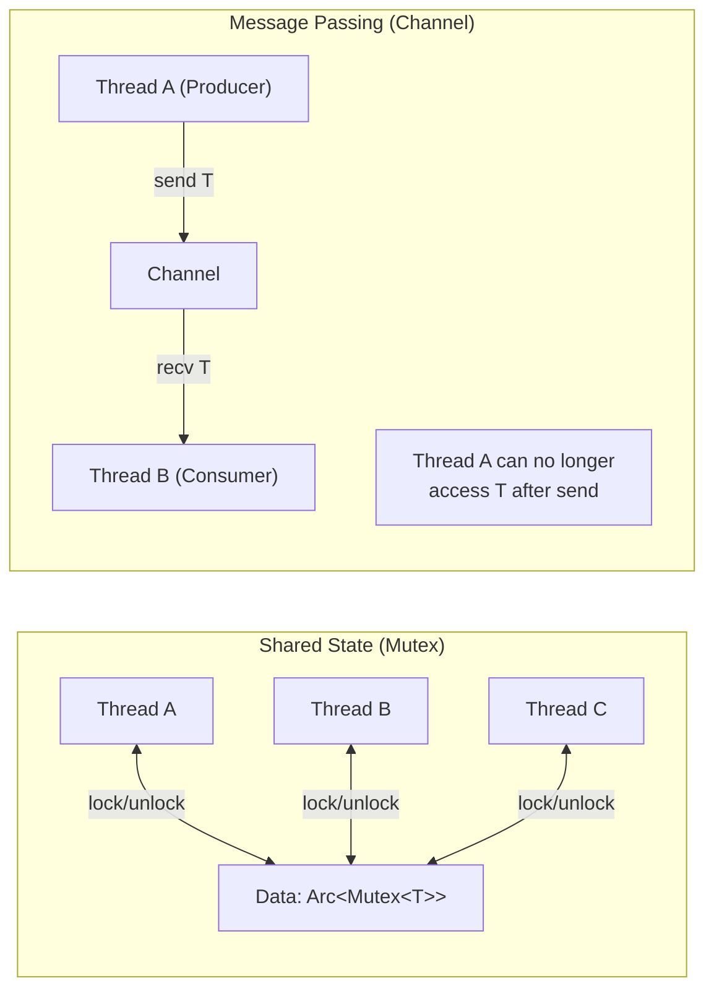
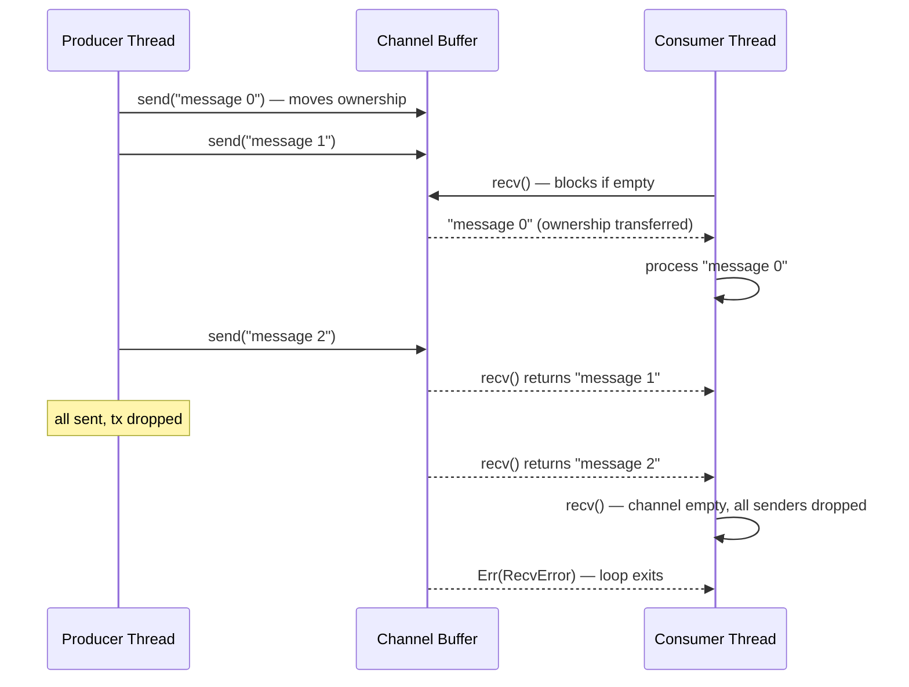

# Chapter 7: Standard Channels (mpsc) 🟡

> **What you'll learn:**
> - The philosophy of "share memory by communicating" — why channels often result in code that is safer and more maintainable than shared-state with locks
> - Rust's `std::sync::mpsc`: the MPSC topology, unbounded `channel()`, bounded `sync_channel()`, and their backpressure characteristics
> - How to manage multiple producers, handle disconnected receivers/senders, and build producer/consumer pipelines
> - When channels are the wrong abstraction (tight loops, extremely high throughput) and when to upgrade to Crossbeam

---

## 7.1 The Philosophy: Communicate, Don't Share

Rob Pike's famous Go concurrency maxim — *"Don't communicate by sharing memory; share memory by communicating"* — resonates deeply in Rust.

**The key insight:** When you use a `Mutex<T>`, every thread that touches `T` must coordinate with every other thread. The data is the source of truth, and locking is how you serialize access. This works, but it creates **tight coupling** between threads that didn't need to know about each other.

**With channels:** Thread A owns data, does work on it, and when done, *transfers ownership* via the channel. Thread B receives the data and owns it exclusively. At no point do two threads own the same data simultaneously. The channel is the **ownership transfer mechanism**.



---

## 7.2 `std::sync::mpsc` — Multiple Producer, Single Consumer

Rust's standard library provides `std::sync::mpsc` (Multiple Producer, Single Consumer). The fundamental limitation is the *single consumer* — only one thread can receive at a time. For multiple consumers, see Chapter 8.

### Creating a Channel

```rust
use std::sync::mpsc;

// `channel()` creates an unbounded MPSC channel.
// Returns a (Sender<T>, Receiver<T>) pair.
let (tx, rx) = mpsc::channel::<String>();

// `Sender` is `Clone` — you can create multiple producers.
// `Receiver` is NOT Clone — only one consumer.
```

### The Basic Pattern

```rust
use std::sync::mpsc;
use std::thread;

fn basic_channel_example() {
    let (tx, rx) = mpsc::channel::<String>();

    // Producer thread — owns `tx` (moved into the thread)
    let producer = thread::spawn(move || {
        for i in 0..5 {
            let msg = format!("message {}", i);
            // `send()` moves the value into the channel.
            // The producer no longer has access to `msg` after this.
            // Returns Err if the receiver has disconnected.
            tx.send(msg).expect("Receiver disconnected");
        }
        // `tx` is dropped here — channel is now "sending side" disconnected
    });

    // Consumer — blocks on `recv()` until a message arrives
    // `recv()` returns Err when ALL senders are dropped AND the channel is empty
    while let Ok(msg) = rx.recv() {
        println!("Received: {}", msg);
    }
    // Loop exits when the sender drops `tx` and channel is empty

    producer.join().unwrap();
}
```

### Execution Timeline



---

## 7.3 Multiple Producers

The `Sender<T>` type is `Clone`, allowing you to create multiple sender handles:

```rust
use std::sync::mpsc;
use std::thread;

fn multiple_producers() {
    let (tx, rx) = mpsc::channel::<(usize, String)>();

    let mut handles = vec![];

    for thread_id in 0..4 {
        // Clone the sender for each thread — cheap (Arc-backed internally)
        let tx_clone = tx.clone();
        handles.push(thread::spawn(move || {
            for i in 0..3 {
                tx_clone.send((thread_id, format!("work item {}", i)))
                    .expect("Receiver hung up");
            }
        }));
    }

    // IMPORTANT: Drop the original `tx` after spawning all threads.
    // If we don't, the channel will NEVER close after the worker threads finish,
    // because the original `tx` (held by main) is still alive.
    drop(tx);

    // Collect all messages
    let mut all_items: Vec<(usize, String)> = rx.into_iter().collect();
    all_items.sort_by_key(|(id, _)| *id);

    for (thread_id, item) in &all_items {
        println!("Thread {}: {}", thread_id, item);
    }

    for h in handles { h.join().unwrap(); }
}
```

> **The Original Sender Drop Pattern:** Always `drop(tx)` in the main thread after spawning workers that have their own clones. Failure to do this means `rx.recv()` never returns `Err` — your consumer loops forever waiting for the sender that's still "alive" in the spawning thread.

---

## 7.4 Non-Blocking Receive and `try_recv`

```rust
use std::sync::mpsc;
use std::time::Duration;

fn non_blocking_patterns(rx: mpsc::Receiver<i32>) {
    // `try_recv()` — returns immediately, never blocks
    match rx.try_recv() {
        Ok(value) => println!("Got: {}", value),
        Err(mpsc::TryRecvError::Empty) => println!("No message yet"),
        Err(mpsc::TryRecvError::Disconnected) => println!("Sender dropped"),
    }

    // `recv_timeout()` — blocks for up to a duration
    match rx.recv_timeout(Duration::from_millis(100)) {
        Ok(value) => println!("Got: {}", value),
        Err(mpsc::RecvTimeoutError::Timeout) => println!("Timed out"),
        Err(mpsc::RecvTimeoutError::Disconnected) => println!("Sender dropped"),
    }

    // `into_iter()` — iterator that blocks per item, stops when disconnected
    for value in rx {
        println!("Iter got: {}", value);
    }
}
```

---

## 7.5 Synchronous Channels and Backpressure (`sync_channel`)

`mpsc::channel()` is **unbounded**: the sender never blocks, and messages can accumulate indefinitely. This is dangerous in production — a slow consumer and fast producer will exhaust memory.

`mpsc::sync_channel(n)` creates a **bounded** channel with a buffer of `n` messages. The sender *blocks* when the buffer is full:

```rust
use std::sync::mpsc;
use std::thread;
use std::time::Duration;

fn bounded_channel_example() {
    // Buffer of 3 messages. The 4th send will BLOCK until the consumer reads.
    let (tx, rx) = mpsc::sync_channel::<String>(3);

    let producer = thread::spawn(move || {
        for i in 0..10 {
            println!("Producer: sending {}", i);
            // Blocks when channel is full (acts as backpressure signal)
            tx.send(format!("item-{}", i)).unwrap();
            println!("Producer: sent {}", i);
        }
    });

    let consumer = thread::spawn(move || {
        for msg in rx {
            println!("Consumer: processing {}", msg);
            // Artificially slow consumer — forces producer to back off
            thread::sleep(Duration::from_millis(50));
        }
    });

    producer.join().unwrap();
    consumer.join().unwrap();
}
```

### Unbounded vs. Bounded: The Decision

| Factor | `channel()` (unbounded) | `sync_channel(n)` (bounded) |
|---|---|---|
| **Producer blocking** | Never blocks | Blocks when buffer full |
| **Memory** | Unbounded growth possible | Capped at N items |
| **Backpressure** | None (producer runs ahead) | Natural — producer slows to consumer rate |
| **Latency** | Lower (producer never waits) | Higher (producer may block) |
| **Best for** | Short-lived bursts, event logging | Sustained pipelines, resource-limited systems |

**In production, always use bounded channels.** Unbounded channels are a silent `OomError` waiting to happen when your consumer falls behind for any reason.

---

## 7.6 Building a Thread Pool with Channels

A classic pattern: use a bounded channel as the work queue for a fixed pool of worker threads:

```rust
use std::sync::mpsc;
use std::thread;

type Job = Box<dyn FnOnce() + Send + 'static>;

/// A simple thread pool backed by a bounded mpsc channel.
pub struct ThreadPool {
    workers: Vec<thread::JoinHandle<()>>,
    sender: mpsc::SyncSender<Job>,
}

impl ThreadPool {
    pub fn new(num_threads: usize, queue_depth: usize) -> Self {
        assert!(num_threads > 0, "Thread pool must have at least one thread");
        let (sender, receiver) = mpsc::sync_channel::<Job>(queue_depth);

        // Wrap the receiver in Arc so multiple workers can share it.
        // All workers will race to receive the next job — whoever wins gets it.
        // This is safe because Receiver implements the single-consumer invariant:
        // we protect it with Mutex so only one worker can recv() at a time.
        let receiver = std::sync::Arc::new(std::sync::Mutex::new(receiver));

        let mut workers = Vec::with_capacity(num_threads);
        for id in 0..num_threads {
            let rx = std::sync::Arc::clone(&receiver);
            let handle = thread::Builder::new()
                .name(format!("pool-worker-{}", id))
                .spawn(move || {
                    loop {
                        // Acquire the receiver lock, get the next job, then release the lock.
                        // Important: release the lock BEFORE executing the job,
                        // so other workers can pick up work while we execute.
                        let job = {
                            let lock = rx.lock().unwrap();
                            lock.recv() // Blocks until a job is available
                        };

                        match job {
                            Ok(job) => {
                                // Execute the job — lock is NOT held here
                                job();
                            }
                            Err(_) => {
                                // Sender disconnected — pool is shutting down
                                println!("Worker {}: shutting down", id);
                                break;
                            }
                        }
                    }
                })
                .expect("Failed to spawn worker thread");
            workers.push(handle);
        }

        ThreadPool { workers, sender }
    }

    /// Submit a job to the pool. Blocks if the queue is full (backpressure).
    pub fn execute<F: FnOnce() + Send + 'static>(&self, job: F) {
        self.sender
            .send(Box::new(job))
            .expect("Thread pool channel disconnected");
    }
}

impl Drop for ThreadPool {
    fn drop(&mut self) {
        // Dropping `sender` closes the channel, causing all workers to exit.
        // Workers will drain remaining jobs first, then exit when recv() returns Err.
        // We don't explicitly close the sender here — it's closed when `self.sender` drops.
        // We just wait for all workers to finish.
        for worker in self.workers.drain(..) {
            worker.join().expect("Worker thread panicked");
        }
    }
}

fn main() {
    let pool = ThreadPool::new(4, 16); // 4 workers, queue of 16

    for i in 0..20 {
        pool.execute(move || {
            println!("Job {} running on {:?}", i, thread::current().name());
            thread::sleep(std::time::Duration::from_millis(10));
        });
    }

    // Pool drops here — waits for all jobs to complete via Drop impl
    println!("All jobs submitted. Waiting...");
}
```

---

<details>
<summary><strong>🏋️ Exercise: Pipeline with Backpressure</strong> (click to expand)</summary>

**Challenge:** Build a three-stage processing pipeline using bounded `sync_channel` between stages:

1. **Reader** stage: generates 100 `RawRecord`s (simulated; just `String` values).
2. **Parser** stage: parses each `RawRecord` into a `ParsedRecord` (simulates a CPU-bound step with a short sleep).
3. **Writer** stage: outputs each `ParsedRecord` (simulates an I/O step).

Each stage should be a separate thread. Use `sync_channel(8)` between stages. Observe that the reader automatically slows down when the parser is the bottleneck.

<details>
<summary>🔑 Solution</summary>

```rust
use std::sync::mpsc;
use std::thread;
use std::time::Duration;

type RawRecord = String;

#[derive(Debug)]
struct ParsedRecord {
    id: usize,
    value: f64,
    source: String,
}

fn main() {
    // ┌─────────┐    ┌─────────┐    ┌─────────┐
    // │ Reader  │───>│ Parser  │───>│ Writer  │
    // └─────────┘    └─────────┘    └─────────┘
    //           CH1 (cap=8)   CH2 (cap=8)

    // Channel 1: Reader → Parser
    let (raw_tx, raw_rx) = mpsc::sync_channel::<RawRecord>(8);
    // Channel 2: Parser → Writer
    let (parsed_tx, parsed_rx) = mpsc::sync_channel::<ParsedRecord>(8);

    // Stage 1: Reader — generates raw records
    let reader = thread::Builder::new()
        .name("reader".into())
        .spawn(move || {
            for i in 0..100 {
                let record = format!("record:{}:value:{:.2}", i, i as f64 * 1.5);
                println!("[Reader] Sending record {}", i);
                // This will BLOCK when the parser is slow and buffer is full.
                // That's the backpressure working correctly!
                raw_tx.send(record).expect("Parser disconnected");
            }
            println!("[Reader] Done — all records sent");
            // raw_tx dropped here — parser will see channel close
        })
        .unwrap();

    // Stage 2: Parser — CPU-bound transformation
    let parser = thread::Builder::new()
        .name("parser".into())
        .spawn(move || {
            for raw in raw_rx { // Iterator: blocks per item, exits when reader done
                // Parse: "record:42:value:63.00" → ParsedRecord
                let parts: Vec<&str> = raw.split(':').collect();
                let id: usize = parts.get(1).and_then(|s| s.parse().ok()).unwrap_or(0);
                let value: f64 = parts.get(3).and_then(|s| s.parse().ok()).unwrap_or(0.0);

                // Simulate CPU work (e.g., validation, transformation)
                thread::sleep(Duration::from_millis(5)); // Parser is the bottleneck

                let parsed = ParsedRecord { id, value, source: raw.clone() };
                println!("[Parser] Parsed record {}", parsed.id);
                parsed_tx.send(parsed).expect("Writer disconnected");
            }
            println!("[Parser] Done — all records parsed");
            // parsed_tx dropped — writer will see channel close
        })
        .unwrap();

    // Stage 3: Writer — I/O-bound output
    let writer = thread::Builder::new()
        .name("writer".into())
        .spawn(move || {
            let mut count = 0;
            for record in parsed_rx {
                // Simulate I/O (writing to DB, file, network)
                thread::sleep(Duration::from_millis(2));
                println!("[Writer] Writing record {}: value={:.2}", record.id, record.value);
                count += 1;
            }
            println!("[Writer] Done — wrote {} records total", count);
            count
        })
        .unwrap();

    // Wait for all stages
    reader.join().expect("Reader panicked");
    parser.join().expect("Parser panicked");
    let total = writer.join().expect("Writer panicked");

    assert_eq!(total, 100);
    println!("\nPipeline complete! Processed {} records.", total);
}
```

**What to observe:**
- The reader will print "Sending" messages in bursts of 8 (filling the buffer), then stall while the parser catches up.
- The parser prints processed records at a steady rate (~5ms each).
- The writer runs slightly faster than the parser (~2ms), so it's the parser that's the bottleneck.
- Backpressure propagates back: the reader slows to match the parser's speed automatically.

</details>
</details>

---

> **Key Takeaways**
> - `std::sync::mpsc` is **Multiple Producer, Single Consumer**. `Sender<T>` is `Clone`; `Receiver<T>` is not. Always `drop` the original sender after cloning, or the channel never closes.
> - `channel()` (unbounded) never blocks the sender — use for bursty workloads or when memory exhaustion isn't a risk. `sync_channel(n)` (bounded) applies backpressure — the producer blocks when the buffer is full. **Prefer bounded channels in production.**
> - Channels transfer **ownership** of the message — there is no aliasing, no locking, and no need for `Arc` around the message itself. This is the "share memory by communicating" philosophy in action.
> - Build thread pools by wrapping `Receiver` in `Arc<Mutex<Receiver>>` so multiple workers can safely race to receive jobs.

> **See also:**
> - [Chapter 4: Mutexes, RwLocks, and Poisoning](ch04-mutexes-rwlocks-and-poisoning.md) — when shared state with locks is the right choice over channels
> - [Chapter 8: Advanced Channels with Crossbeam](ch08-advanced-channels-crossbeam.md) — MPMC channels, `select!`, and higher-throughput alternatives
> - *Async Rust* companion guide — `tokio::sync::mpsc` and `tokio::sync::broadcast` for async equivalents
