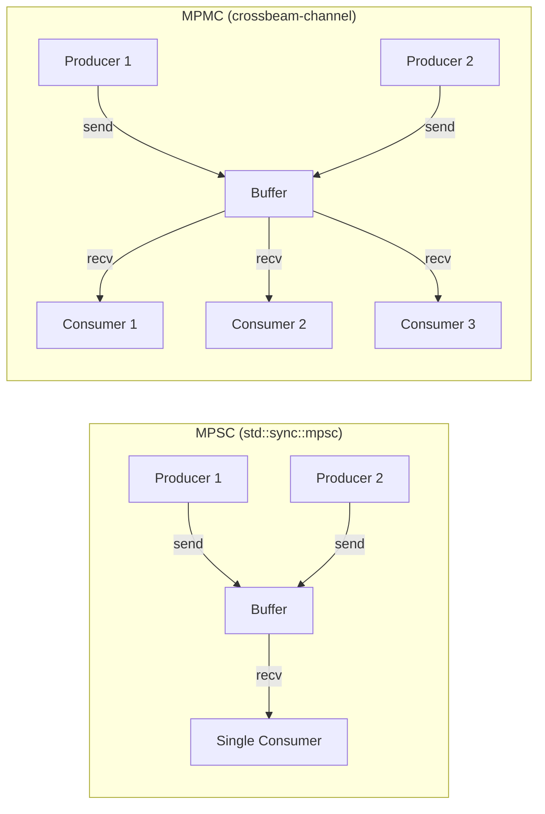
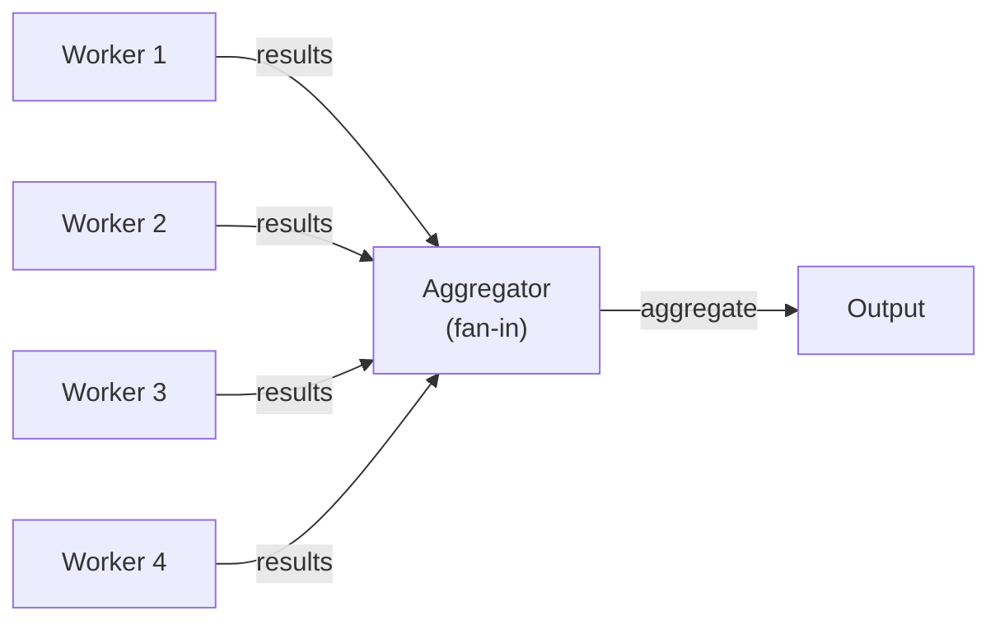
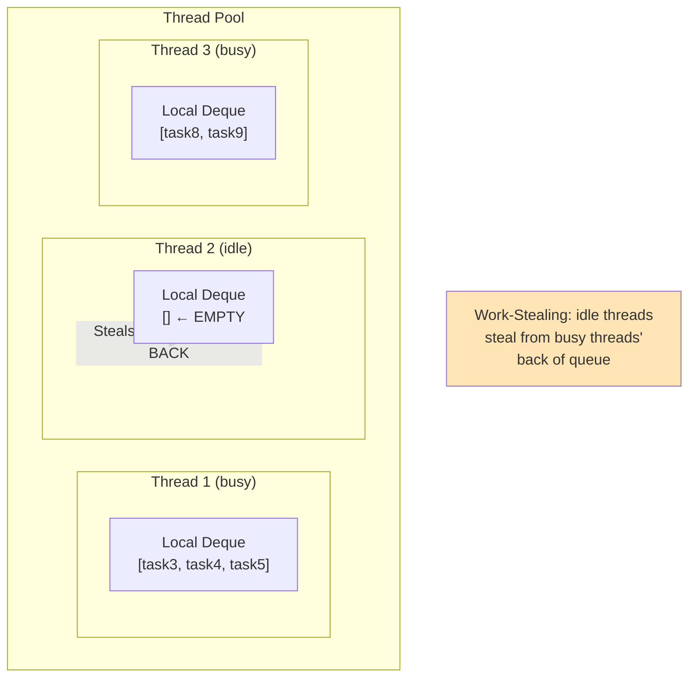

# Chapter 8: Advanced Channels with Crossbeam 🔴

> **What you'll learn:**
> - Why `std::sync::mpsc` falls short in multi-consumer and high-throughput scenarios
> - `crossbeam-channel`: MPMC (Multi-Producer Multi-Consumer) channels with both bounded and unbounded variants
> - The `select!` macro — Go-style non-deterministic selection over multiple channel operations
> - Work-stealing scheduling: the algorithm behind `rayon` and async runtimes that makes them so efficient

---

## 8.1 The Limits of `std::sync::mpsc`

The standard library's `mpsc` channel is intentionally simple. It solves the common case but has well-known limitations:

| Limitation | Impact |
|---|---|
| Single consumer only (`Receiver<T>` is `!Clone`) | Cannot fan-out work to multiple consumers without `Arc<Mutex<Receiver>>` |
| No select/multiplexing | Cannot atomically choose between multiple channels |
| Performance | Not optimized for high-throughput MPMC workloads |
| No `select_timeout` | Must use threads + `try_recv` loops for timeout-based selection |

The `crossbeam` crate family (specifically `crossbeam-channel`) is the standard answer to all of these. It is the most widely used channel implementation in the Rust ecosystem and is used internally by many other crates.

---

## 8.2 `crossbeam-channel` Fundamentals

Add to `Cargo.toml`:
```toml
[dependencies]
crossbeam-channel = "0.5"
```

The API is intentionally similar to `std::sync::mpsc` for easy migration:

```rust
use crossbeam_channel::{bounded, unbounded, Sender, Receiver};

// Unbounded channel — like mpsc::channel()
let (tx, rx): (Sender<i32>, Receiver<i32>) = unbounded();

// Bounded channel — like mpsc::sync_channel(n)
let (tx, rx): (Sender<i32>, Receiver<i32>) = bounded(16);
```

The critical difference: **both `Sender` and `Receiver` are `Clone`**. This gives you MPMC (Multi-Producer Multi-Consumer) semantics:

```rust
use crossbeam_channel::bounded;
use std::thread;

fn mpmc_example() {
    let (tx, rx) = bounded::<String>(16);

    // Multiple producers
    let mut handles = vec![];
    for producer_id in 0..4 {
        let tx = tx.clone();
        handles.push(thread::spawn(move || {
            for i in 0..10 {
                tx.send(format!("from-producer-{}-item-{}", producer_id, i)).unwrap();
            }
        }));
    }
    drop(tx); // Drop original sender so the channel closes when all producers finish

    // Multiple consumers — they compete for messages
    for consumer_id in 0..2 {
        let rx = rx.clone(); // Clone the receiver — both consumers receive from same channel
        handles.push(thread::spawn(move || {
            for msg in rx.iter() { // iterator: recv until disconnected
                println!("Consumer {}: {}", consumer_id, msg);
            }
        }));
    }
    drop(rx); // Drop original receiver

    for h in handles { h.join().unwrap(); }
}
```

### Channel Topology Comparison



---

## 8.3 The `select!` Macro — Multiplexing Over Channels

The `crossbeam_channel::select!` macro allows a thread to non-deterministically wait on *multiple* channel operations simultaneously, executing whichever one is ready first. This is Go's `select` statement, brought to Rust.

```rust
use crossbeam_channel::{unbounded, bounded, select};
use std::thread;
use std::time::Duration;

fn select_example() {
    let (work_tx, work_rx) = bounded::<String>(8);
    let (shutdown_tx, shutdown_rx) = bounded::<()>(1);

    // Producer sends work items
    let work_tx_clone = work_tx.clone();
    thread::spawn(move || {
        for i in 0..10 {
            work_tx_clone.send(format!("task-{}", i)).unwrap();
            thread::sleep(Duration::from_millis(100));
        }
    });

    // Shutdown signal after 500ms
    thread::spawn(move || {
        thread::sleep(Duration::from_millis(550));
        shutdown_tx.send(()).unwrap();
    });

    // Worker using select! to handle either work or shutdown
    loop {
        select! {
            // `recv` arm: fires when work_rx has a message
            recv(work_rx) -> msg => {
                match msg {
                    Ok(task) => println!("Processing: {}", task),
                    Err(_) => {
                        println!("Work channel disconnected");
                        break;
                    }
                }
            }
            // `recv` arm: fires when shutdown_rx has a message
            recv(shutdown_rx) -> _ => {
                println!("Shutdown signal received — stopping");
                break;
            }
        }
    }
    println!("Worker exited cleanly");
}
```

### `select!` with Timeouts

`crossbeam_channel` provides `after(duration)` and `tick(duration)` channels that act as timer signals:

```rust
use crossbeam_channel::{bounded, select, after, tick};
use std::time::Duration;

fn heartbeat_worker(rx: crossbeam_channel::Receiver<String>) {
    // `tick` sends a message every interval (like a metronome)
    let heartbeat = tick(Duration::from_secs(1));
    // `after` sends a single message after a delay (like a deadline timer)
    let deadline = after(Duration::from_secs(30));

    loop {
        select! {
            recv(rx) -> msg => {
                match msg {
                    Ok(task) => println!("Work: {}", task),
                    Err(_) => { println!("Work channel closed"); break; }
                }
            }
            recv(heartbeat) -> _ => {
                println!("[heartbeat] Worker is alive");
            }
            recv(deadline) -> _ => {
                println!("[deadline] 30s elapsed — shutting down");
                break;
            }
        }
    }
}
```

### `select!` with Send Operations

`select!` can also perform `send` operations:

```rust
use crossbeam_channel::{bounded, select};

fn biased_router(
    input: crossbeam_channel::Receiver<u32>,
    high_pri: crossbeam_channel::Sender<u32>,
    low_pri: crossbeam_channel::Sender<u32>,
) {
    for item in input {
        select! {
            // Try to send to high-priority queue first
            send(high_pri, item) -> res => {
                res.expect("High priority channel broken");
                println!("Sent {} to high-priority queue", item);
            }
            // If high-priority is full, send to low-priority
            send(low_pri, item) -> res => {
                res.expect("Low priority channel broken");
                println!("Sent {} to low-priority queue (high full)", item);
            }
        }
    }
}
```

---

## 8.4 Fan-Out / Fan-In Patterns

These are the two canonical channel topologies for parallel pipelines.

### Fan-Out: One Producer, Many Workers

```rust
use crossbeam_channel::{bounded, Sender, Receiver};
use std::thread;

/// Distribute work across `num_workers` threads.
/// Each work item is processed by exactly one worker.
fn fan_out<T: Send + 'static, R: Send + 'static>(
    inputs: Vec<T>,
    num_workers: usize,
    process: impl Fn(T) -> R + Send + Sync + 'static,
) -> Vec<R> {
    let (work_tx, work_rx) = bounded::<T>(num_workers * 2);
    let (result_tx, result_rx) = bounded::<R>(num_workers * 2);
    let process = std::sync::Arc::new(process);

    // Spawn workers — all share the same work_rx (MPMC)
    let mut handles = vec![];
    for _ in 0..num_workers {
        let work_rx = work_rx.clone();
        let result_tx = result_tx.clone();
        let process = process.clone();
        handles.push(thread::spawn(move || {
            for item in work_rx.iter() {
                let result = process(item);
                result_tx.send(result).expect("Result channel broken");
            }
        }));
    }
    drop(work_rx);
    drop(result_tx);

    // Feed work into the channel
    for item in inputs {
        work_tx.send(item).expect("Work channel broken");
    }
    drop(work_tx); // Signal workers to stop when work is exhausted

    // Wait for all workers
    for h in handles { h.join().unwrap(); }

    // Collect results — order is NOT guaranteed
    result_rx.iter().collect()
}

fn main() {
    let inputs: Vec<u64> = (1..=20).collect();
    let results = fan_out(inputs, 4, |n| n * n);
    let mut results = results;
    results.sort();
    println!("Squares: {:?}", &results[..10]);
}
```

### Fan-In: Many Producers, One Aggregation Point



```rust
use crossbeam_channel::{bounded, Sender};
use std::thread;
use std::collections::HashMap;

fn fan_in_word_count(texts: Vec<String>) -> HashMap<String, usize> {
    let (result_tx, result_rx) = bounded::<HashMap<String, usize>>(8);

    // Each worker produces a partial word count map
    let mut handles = vec![];
    for text in texts {
        let tx = result_tx.clone();
        handles.push(thread::spawn(move || {
            let mut counts = HashMap::new();
            for word in text.split_whitespace() {
                let word = word.to_lowercase();
                let word = word.trim_matches(|c: char| !c.is_alphabetic());
                if !word.is_empty() {
                    *counts.entry(word.to_string()).or_insert(0) += 1;
                }
            }
            tx.send(counts).expect("Aggregator disconnected");
        }));
    }
    drop(result_tx); // Close: all workers' senders plus original

    // Fan-in: merge all partial counts into one
    let mut total: HashMap<String, usize> = HashMap::new();
    for partial in result_rx.iter() {
        for (word, count) in partial {
            *total.entry(word).or_insert(0) += count;
        }
    }

    for h in handles { h.join().unwrap(); }
    total
}

fn main() {
    let texts = vec![
        "the quick brown fox jumps over the lazy dog".to_string(),
        "pack my box with five dozen liquor jugs".to_string(),
        "how vexingly quick daft zebras jump".to_string(),
    ];

    let counts = fan_in_word_count(texts);
    let mut sorted: Vec<_> = counts.iter().collect();
    sorted.sort_by(|a, b| b.1.cmp(a.1).then(a.0.cmp(b.0)));
    
    println!("Top words:");
    for (word, count) in sorted.iter().take(5) {
        println!("  {:15} {}", word, count);
    }
}
```

---

## 8.5 Work-Stealing: The Algorithm Behind Rayon and Tokio

Work-stealing is the scheduling algorithm that makes both `rayon` (Chapter 9) and `tokio` (async runtime) highly efficient. Understanding it conceptually will help you tune your systems.

### The Problem: Load Imbalance

In a naive fork-join model (e.g., divide work into N equal parts, give part to each thread), if one thread finishes early, it sits idle while another is still working. CPU cycles are wasted.

### The Solution: Work-Stealing Deques



Each thread has a **local deque** (double-ended queue):
- The thread pushes and pops from the **front** (stack discipline — LIFO — exploits cache locality for recursive work).
- Idle threads steal from the **back** of other threads' deques (gives the stealer the "oldest" work item — less likely to cause cascading recursive work).

The key insight: the push/pop from the front is **lock-free** (only the owner uses the front). The steal from the back uses CAS to avoid contending with the owner. This makes the common case (no stealing) essentially free.

### The Crossbeam Deque

`crossbeam-deque` provides the building block:

```rust
// This is a simplified illustration — crossbeam-deque is used internally
// by rayon and you typically don't use it directly.
use crossbeam_deque::{Steal, Worker};

fn illustrate_work_stealing() {
    // Each thread creates its own Worker (the "local" end)
    let worker = Worker::<i32>::new_lifo();
    let stealer = worker.stealer(); // Cloneable handle for other threads to steal from

    // Owner pushes work
    worker.push(1);
    worker.push(2);
    worker.push(3);

    // Owner pops its own work (LIFO — cache-hot)
    assert_eq!(worker.pop(), Some(3)); // LIFO: gets the most recently pushed

    // Another thread steals
    match stealer.steal() {
        Steal::Success(item) => println!("Stolen: {}", item), // Gets item 1 (oldest)
        Steal::Empty => println!("Nothing to steal"),
        Steal::Retry => println!("Contention — try again"),
    }
}
```

In practice, you'll use Rayon or Tokio which implement work-stealing for you. But understanding the algorithm explains *why* they're efficient and what task granularity to target (tasks should be large enough to amortize the overhead of scheduling, but small enough that stealing balances load effectively).

---

<details>
<summary><strong>🏋️ Exercise: Pipeline with select! and Graceful Shutdown</strong> (click to expand)</summary>

**Challenge:** Build a URL validator pipeline with graceful shutdown:

1. A **generator** thread produces 50 URLs (strings) — some valid, some not.
2. Two **validator** threads pull from a shared work channel (MPMC) and classify each URL as valid/invalid.
3. The **collector** thread receives results on a results channel.
4. A **controller** can send a shutdown signal at any time via a shutdown channel.
5. Validators must use `select!` to race between picking up work and receiving the shutdown signal.

On shutdown, validators stop immediately (dropping any pending work). The collector drains remaining results then exits.

<details>
<summary>🔑 Solution</summary>

```rust
use crossbeam_channel::{bounded, select, Receiver, Sender};
use std::thread;
use std::time::Duration;

#[derive(Debug)]
struct ValidationResult {
    url: String,
    valid: bool,
    validator_id: usize,
}

fn is_valid_url(url: &str) -> bool {
    // Simplified validation: must start with http/https and contain a dot
    (url.starts_with("http://") || url.starts_with("https://"))
        && url.contains('.')
        && url.len() > 10
}

fn validator_worker(
    id: usize,
    work_rx: Receiver<String>,
    result_tx: Sender<ValidationResult>,
    shutdown_rx: Receiver<()>,
) {
    loop {
        select! {
            // Try to receive work
            recv(work_rx) -> msg => {
                match msg {
                    Ok(url) => {
                        // Simulate network/DNS check latency
                        thread::sleep(Duration::from_millis(5));
                        let valid = is_valid_url(&url);
                        if result_tx.send(ValidationResult {
                            url,
                            valid,
                            validator_id: id,
                        }).is_err() {
                            // Collector disconnected — stop
                            println!("[Validator {}] Result channel closed", id);
                            return;
                        }
                    }
                    Err(_) => {
                        // Work channel exhausted
                        println!("[Validator {}] Work exhausted — shutting down", id);
                        return;
                    }
                }
            }
            // Check for shutdown signal
            recv(shutdown_rx) -> _ => {
                println!("[Validator {}] Shutdown received — stopping immediately", id);
                return;
            }
        }
    }
}

fn main() {
    let (work_tx, work_rx) = bounded::<String>(16);
    let (result_tx, result_rx) = bounded::<ValidationResult>(32);
    // Broadcast-style shutdown: each validator gets its own receiver
    let (shutdown_tx, shutdown_rx1) = bounded::<()>(1);
    let shutdown_rx2 = shutdown_rx1.clone();

    // Generator
    let gen = thread::spawn(move || {
        let urls = vec![
            "https://www.rust-lang.org",
            "ftp://invalid.protocol",
            "http://example.com",
            "not-a-url",
            "https://crossbeam.rs/docs",
            "http://",
            "https://github.com/rust-lang/rust",
            "javascript:alert(1)",
        ];
        for i in 0..50 {
            let url = urls[i % urls.len()].to_string();
            println!("[Generator] Queuing: {}", url);
            if work_tx.send(url).is_err() {
                break;
            }
            thread::sleep(Duration::from_millis(3));
        }
        println!("[Generator] All URLs queued");
        // work_tx dropped — signals validators that work is done
    });

    // Two validator workers (MPMC — both pull from same work_rx)
    let v1 = {
        let work_rx = work_rx.clone();
        let result_tx = result_tx.clone();
        thread::spawn(move || validator_worker(1, work_rx, result_tx, shutdown_rx1))
    };
    let v2 = {
        let result_tx = result_tx.clone();
        thread::spawn(move || validator_worker(2, work_rx, result_tx, shutdown_rx2))
    };
    drop(result_tx); // Drop extra sender — channel closes when both validators exit

    // Shutdown controller: send shutdown after 80ms
    let ctrl = thread::spawn(move || {
        thread::sleep(Duration::from_millis(80));
        println!("[Controller] Sending shutdown signal");
        let _ = shutdown_tx.send(()); // Sends to ONE validator
        // Note: with `bounded(1)` shutdown channel, we'd need to send once per validator,
        // or use a different mechanism (AtomicBool flag, or loop + try_send).
        // For demonstration: the second validator will exit when work is exhausted.
    });

    // Collector: drain all results until both validators exit
    let mut valid_count = 0;
    let mut invalid_count = 0;
    for result in result_rx.iter() {
        if result.valid {
            valid_count += 1;
            println!("[Collector] ✓ VALID   (worker {}): {}", result.validator_id, result.url);
        } else {
            invalid_count += 1;
            println!("[Collector] ✗ INVALID (worker {}): {}", result.validator_id, result.url);
        }
    }

    gen.join().unwrap();
    v1.join().unwrap();
    v2.join().unwrap();
    ctrl.join().unwrap();

    println!("\n=== Summary ===");
    println!("Valid URLs:   {}", valid_count);
    println!("Invalid URLs: {}", invalid_count);
    println!("Total:        {}", valid_count + invalid_count);
}
```

</details>
</details>

---

> **Key Takeaways**
> - `crossbeam-channel` solves `std::sync::mpsc`'s single-consumer limitation: both `Sender` and `Receiver` are `Clone`, enabling MPMC topologies where multiple threads compete to receive work.
> - The `select!` macro enables non-deterministic multiplexing over multiple channel operations — critical for timeout handling, graceful shutdown, and priority-based routing.
> - Fan-out (one producer, many consumers) and fan-in (many producers, one aggregator) are the two fundamental parallel pipeline patterns. Crossbeam channels compose naturally for both.
> - Work-stealing (used by Rayon and Tokio internally) is the algorithm that achieves near-optimal load balancing without global coordination: each thread maintains a local deque; idle threads steal from the back of busy threads' deques.

> **See also:**
> - [Chapter 7: Standard Channels (mpsc)](ch07-standard-channels-mpsc.md) — the simpler alternative for single-consumer cases
> - [Chapter 9: Data Parallelism with Rayon](ch09-data-parallelism-rayon.md) — Rayon's work-stealing fork-join model in action
> - [Chapter 10: Capstone — Parallel MapReduce Engine](ch10-capstone-mapreduce.md) — applies crossbeam for a real parallel pipeline
