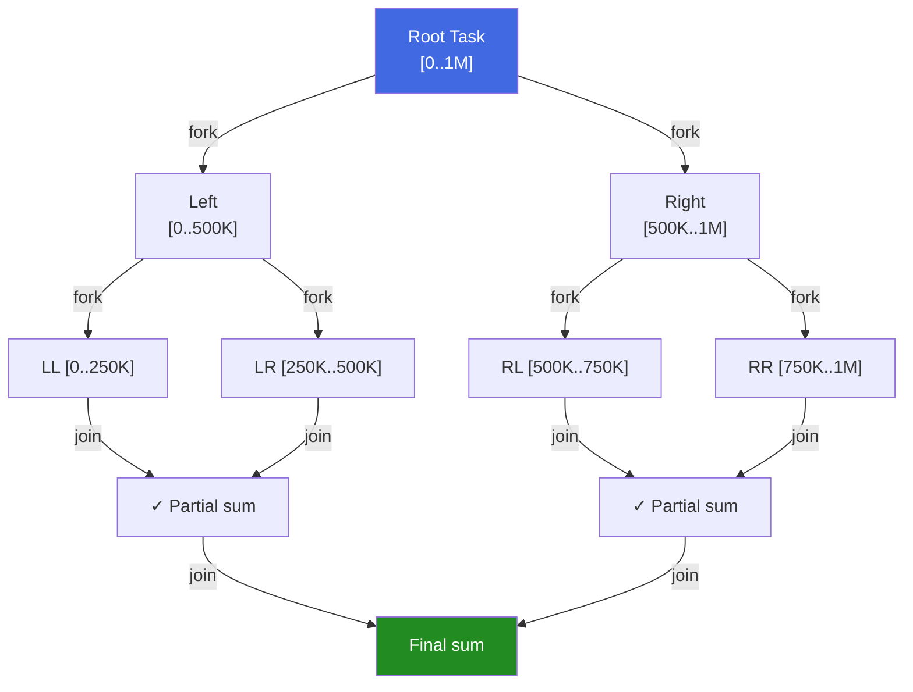

# Chapter 9: Data Parallelism with Rayon 🟡

> **What you'll learn:**
> - The fork-join model of data parallelism and how Rayon implements it with work-stealing
> - Using `par_iter()` to parallelize existing sequential iterator chains with minimal code change
> - Custom parallel tasks with `rayon::join` and `rayon::scope`
> - Thread pool configuration, task granularity, and when Rayon won't help (or will hurt)

---

## 9.1 Data Parallelism vs. Task Parallelism

The previous chapters covered **task parallelism**: different threads perform different, independent tasks (think: a web server handling separate requests).

**Data parallelism** applies the *same operation* to many elements of a dataset simultaneously:

```
Sequential:    [A, B, C, D, E, F, G, H] → process each → [a, b, c, d, e, f, g, h]

Data-parallel: [A, B, C, D] → Thread 1 → [a, b, c, d]
               [E, F, G, H] → Thread 2 → [e, f, g, h]
               Merge:                     [a, b, c, d, e, f, g, h]
```

Rayon is Rust's premier library for data parallelism. Its design goal: turning sequential iterator chains into parallel ones with **the minimum possible code change**.

Add to `Cargo.toml`:
```toml
[dependencies]
rayon = "1"
```

---

## 9.2 The `par_iter()` API — Drop-In Parallel Iterators

The most common entry point is converting a sequential iterator to a parallel one:

```rust
use rayon::prelude::*; // Brings par_iter, par_iter_mut, into_par_iter, etc.

fn sequential_vs_parallel() {
    let data: Vec<u64> = (1..=1_000_000).collect();

    // Sequential — uses one core
    let seq_sum: u64 = data.iter().map(|&x| x * x).sum();

    // Parallel — uses all cores automatically
    let par_sum: u64 = data.par_iter().map(|&x| x * x).sum();

    assert_eq!(seq_sum, par_sum);
    println!("Sum of squares: {}", par_sum);
}
```

The **only change** was `iter()` → `par_iter()`. Rayon handles all thread creation, work distribution, and result collection. The fork-join model guarantees the result is identical to the sequential version for any pure, deterministic operation.

### The Fork-Join Model



Rayon recursively splits the data until chunks are small enough to process serially (the exact threshold is tunable), then merges results up the tree using work-stealing for load balancing.

---

## 9.3 The Full Parallel Iterator API

Rayon provides parallel equivalents of nearly all standard iterator methods:

```rust
use rayon::prelude::*;

fn parallel_iterator_showcase() {
    let data: Vec<i32> = (-1000..=1000).collect();

    // --- Filtering ---
    let positives: Vec<i32> = data.par_iter()
        .filter(|&&x| x > 0)
        .copied()
        .collect();
    println!("Positives: {} items", positives.len()); // 1000

    // --- Mapping ---
    let squares: Vec<i64> = data.par_iter()
        .map(|&x| (x as i64) * (x as i64))
        .collect();

    // --- Flat-map ---
    let expanded: Vec<i32> = data.par_iter()
        .flat_map(|&x| vec![x, x * 2, x * 3].into_par_iter())
        .collect();

    // --- Reduction ---
    let sum: i64 = data.par_iter().map(|&x| x as i64).sum();
    let product = data.par_iter()
        .filter(|&&x| x != 0)
        .map(|&x| x as i64)
        .reduce(|| 1i64, |a, b| a.saturating_mul(b));

    // --- Find and any/all ---
    let has_negative = data.par_iter().any(|&x| x < 0); // Short-circuits!
    let all_small = data.par_iter().all(|&x| x.abs() < 2000);
    let first_negative = data.par_iter().find_first(|&&x| x < 0); // Finds leftmost

    println!("Sum: {}, Has negative: {}, All small: {}", sum, has_negative, all_small);
    println!("First negative: {:?}", first_negative);

    // --- Sorting ---
    let mut sortable = data.clone();
    sortable.par_sort(); // Parallel sort — equivalent to sort() but fast
    sortable.par_sort_unstable(); // Even faster — doesn't preserve equal-element order

    // --- Chain multiple operations ---
    let result: Vec<String> = (0..100_000i32)
        .into_par_iter()                   // Parallel range iterator
        .filter(|&x| x % 7 == 0)          // Keep multiples of 7 (parallel filter)
        .map(|x| x * x)                   // Square them (parallel map)
        .filter(|&x| x > 10_000)          // Keep large ones
        .map(|x| format!("val:{}", x))    // Format (parallel map)
        .collect();                        // Collect to Vec<String>

    println!("Found {} values divisible by 7 and > sqrt(10000)", result.len());
}
```

### Sequential vs. Parallel: What Changes?

| Sequential | Parallel | Notes |
|---|---|---|
| `iter()` | `par_iter()` | Shared borrow |
| `iter_mut()` | `par_iter_mut()` | Mutable borrow |
| `into_iter()` | `into_par_iter()` | Consuming |
| `(0..n)` | `(0..n).into_par_iter()` | Parallel range |
| `for` loop | `par_iter().for_each()` | No return value |

---

## 9.4 Parallel Mutation with `par_iter_mut()`

```rust
use rayon::prelude::*;

fn parallel_in_place_normalization(data: &mut Vec<f64>) {
    // First, compute the max (parallel reduce)
    let max = data.par_iter().copied()
        .reduce(|| f64::NEG_INFINITY, f64::max);

    if max == 0.0 { return; }

    // Then, normalize in place (parallel mutation — each element is independent)
    data.par_iter_mut().for_each(|x| {
        *x /= max; // Divide in place — no aliasing possible (disjoint &mut refs)
    });
}

fn main() {
    let mut data: Vec<f64> = vec![1.0, 5.0, 3.0, 8.0, 2.0, 7.0, 4.0, 6.0];
    parallel_in_place_normalization(&mut data);
    println!("{:.3?}", data); // [0.125, 0.625, 0.375, 1.000, ...]
}
```

---

## 9.5 `rayon::join` — Parallel Execution of Two Tasks

For explicit division of work (rather than iterator-based), `rayon::join` runs two closures in parallel and blocks until both complete:

```rust
use rayon;

fn parallel_merge_sort(data: &mut Vec<i32>) {
    let len = data.len();
    if len <= 1 {
        return;
    }

    let mid = len / 2;
    // Split the Vec into two mutable slices — no aliasing
    let (left, right) = data.split_at_mut(mid);

    // Sort left and right halves in parallel
    // `rayon::join` will potentially run these on different threads,
    // or execute them on the current thread if the pool is saturated.
    rayon::join(
        || parallel_merge_sort(&mut left.to_vec()),  // simplified for illustration
        || parallel_merge_sort(&mut right.to_vec()),
    );

    // Merge step (sequential — left and right are now sorted)
    // (In a real implementation, you'd merge in-place or into a temporary)
}

// More realistic: recursive parallel summation
fn parallel_sum(data: &[i64]) -> i64 {
    const SEQUENTIAL_THRESHOLD: usize = 10_000; // Don't fork for small slices

    if data.len() <= SEQUENTIAL_THRESHOLD {
        // Below threshold: do it sequentially (avoid fork overhead)
        return data.iter().sum();
    }

    let mid = data.len() / 2;
    let (left, right) = data.split_at(mid);

    let (left_sum, right_sum) = rayon::join(
        || parallel_sum(left),
        || parallel_sum(right),
    );

    left_sum + right_sum
}

fn main() {
    let data: Vec<i64> = (1..=1_000_000).collect();
    let total = parallel_sum(&data);
    println!("Sum: {}", total); // 500_000_500_000
}
```

---

## 9.6 `rayon::scope` — Dynamic Work Spawning

`rayon::scope` is to `rayon::join` as `thread::scope` is to `thread::spawn`: it allows spawning multiple tasks dynamically within a scope, all borrows are valid for the scope's lifetime:

```rust
use rayon;

fn parallel_tree_traversal(nodes: &[i32], depth: usize) {
    if depth == 0 || nodes.is_empty() {
        // Base case: process sequentially
        println!("Leaf: {:?}", nodes);
        return;
    }

    let mid = nodes.len() / 2;
    let (left, right) = nodes.split_at(mid);
    let center = &nodes[mid..mid+1];

    // `rayon::scope` allows spawning multiple tasks that borrow from enclosing scope
    rayon::scope(|s| {
        s.spawn(|_| {
            parallel_tree_traversal(left, depth - 1);
        });
        s.spawn(|_| {
            parallel_tree_traversal(right, depth - 1);
        });
        // Process center node on the current thread while children run in parallel
        println!("Node: {:?}", center);
        // All spawned tasks are joined when the scope exits
    });
}

fn main() {
    let data: Vec<i32> = (1..=15).collect();
    parallel_tree_traversal(&data, 3);
}
```

---

## 9.7 Thread Pool Configuration

Rayon uses a global thread pool by default (initialized lazily, with one thread per logical CPU). You can configure it:

```rust
use rayon::ThreadPoolBuilder;

fn configure_rayon() {
    // Global pool configuration — must be called before any parallel work
    rayon::ThreadPoolBuilder::new()
        .num_threads(4)           // Limit to 4 threads
        .thread_name(|i| format!("rayon-worker-{}", i))
        .stack_size(4 * 1024 * 1024) // 4 MB stack per thread
        .build_global()
        .expect("Failed to configure global Rayon pool");

    // All subsequent par_iter() calls use this pool
}

fn custom_scoped_pool() {
    // Create a local pool that doesn't affect the global one
    let pool = rayon::ThreadPoolBuilder::new()
        .num_threads(2)
        .build()
        .unwrap();

    pool.install(|| {
        // This parallel work uses only the 2-thread local pool
        let sum: u64 = (1..=1000u64).into_par_iter().sum();
        println!("Sum: {}", sum);
    });
}
```

---

## 9.8 When Rayon Helps — and When It Doesn't

### Rayon Works Great For

- **CPU-bound, independent work:** Image processing, numerical methods, sorting large arrays, parsing.
- **Homogeneous data:** All elements take approximately the same time to process.
- **Large datasets:** Rayon's fork overhead (~microseconds) must be amortized over significant compute.

### When Rayon Underperforms or Fails

```rust
// ❌ FAILS: par_iter() requires Send — &Cell<T> is !Send
use std::cell::Cell;
let data: Vec<Cell<i32>> = vec![Cell::new(1), Cell::new(2)];
// data.par_iter().for_each(|c| c.set(0)); // compile error: Cell<i32> is !Send

// ❌ BAD IDEA: Tasks too small — overhead dominates
let tiny: Vec<i32> = vec![1, 2, 3, 4];
let sum: i32 = tiny.par_iter().sum(); // Sequential would be 10x faster!

// ❌ BAD IDEA: I/O-bound work — threads just sleep, no CPU benefit
// Use async/Tokio instead for network/disk operations
let urls = vec!["http://..."; 1000];
// urls.par_iter().for_each(|url| download(url)); // Wastes CPU threads on waiting

// ❌ TRICKY: Non-deterministic output order (may/may not be a problem)
let mut output = Vec::new();
(0..10).into_par_iter().for_each(|i| {
    // The order items are processed is non-deterministic!
    // Use collect() if you need order preservation.
    // output.push(i); // can't do this — output is not safe to push to from parallel
});
// ✅ Use map().collect() for ordered results:
let ordered: Vec<i32> = (0..10).into_par_iter().map(|i| i * 2).collect();
// collect() on parallel iterators preserves the *logical* order even though
// physical processing is parallel. This is guaranteed by Rayon.
```

### Benchmark Before You Parallelize

```rust
// Rule of thumb for Rayon parallelization:
// If the total computational work per element takes less than ~1µs,
// the fork-join overhead likely dominates. Profile first.

fn should_i_parallelize(n: usize, work_per_element_us: f64) -> bool {
    let total_work_us = n as f64 * work_per_element_us;
    let fork_join_overhead_us = 50.0; // Approximate Rayon overhead
    let speedup = total_work_us / (total_work_us / rayon::current_num_threads() as f64
        + fork_join_overhead_us);
    speedup > 1.2 // Parallelize only if we expect >20% speedup
}
```

---

<details>
<summary><strong>🏋️ Exercise: Parallel Matrix Multiplication</strong> (click to expand)</summary>

**Challenge:** Implement matrix multiplication (`C = A × B`) using Rayon. Given two `N×N` matrices represented as `Vec<Vec<f64>>`, compute the product using `par_iter_mut()` to parallelize the row computation.

**Requirements:**
- Each row of the output matrix `C` is computed independently → parallelize over rows.
- Verify correctness against a sequential implementation.
- Measure and print approximate speedup for N=256.

<details>
<summary>🔑 Solution</summary>

```rust
use rayon::prelude::*;
use std::time::Instant;

type Matrix = Vec<Vec<f64>>;

/// Sequential matrix multiplication — O(n^3).
fn matmul_seq(a: &Matrix, b: &Matrix) -> Matrix {
    let n = a.len();
    let mut c = vec![vec![0.0f64; n]; n];
    for i in 0..n {
        for k in 0..n {
            for j in 0..n {
                // Reordered loop for cache locality (k-j inner loops access b row-wise)
                c[i][j] += a[i][k] * b[k][j];
            }
        }
    }
    c
}

/// Parallel matrix multiplication using Rayon.
/// Each output row is computed by a separate rayon task.
fn matmul_par(a: &Matrix, b: &Matrix) -> Matrix {
    let n = a.len();
    // Pre-compute b's column vectors for cache-efficient access during parallel rows.
    // Without this, each thread would access b's memory in a cache-unfriendly column order.
    let b_cols: Vec<Vec<f64>> = (0..n)
        .map(|j| (0..n).map(|k| b[k][j]).collect())
        .collect();

    // Initialize output matrix
    let mut c = vec![vec![0.0f64; n]; n];

    // par_iter_mut: each row is processed by a separate rayon task.
    // No locking needed — each row is a disjoint &mut Vec<f64>.
    c.par_iter_mut().enumerate().for_each(|(i, row_c)| {
        // Compute row i of C = A × B
        for j in 0..n {
            // Dot product of a[i] and b[:,j]
            row_c[j] = a[i].iter()
                .zip(b_cols[j].iter())
                .map(|(a_val, b_val)| a_val * b_val)
                .sum();
        }
    });

    c
}

fn generate_matrix(n: usize, seed: f64) -> Matrix {
    (0..n).map(|i| {
        (0..n).map(|j| (i as f64 * seed + j as f64).sin()).collect()
    }).collect()
}

fn matrices_approx_equal(a: &Matrix, b: &Matrix, tol: f64) -> bool {
    a.len() == b.len() && a.iter().zip(b.iter()).all(|(row_a, row_b)| {
        row_a.len() == row_b.len() &&
        row_a.iter().zip(row_b.iter()).all(|(x, y)| (x - y).abs() < tol)
    })
}

fn main() {
    for n in [64, 128, 256] {
        let a = generate_matrix(n, 1.7);
        let b = generate_matrix(n, 2.3);

        // Sequential
        let t0 = Instant::now();
        let c_seq = matmul_seq(&a, &b);
        let seq_time = t0.elapsed();

        // Parallel
        let t1 = Instant::now();
        let c_par = matmul_par(&a, &b);
        let par_time = t1.elapsed();

        // Verify
        assert!(
            matrices_approx_equal(&c_seq, &c_par, 1e-9),
            "Parallel result differs from sequential for N={}!", n
        );

        let speedup = seq_time.as_secs_f64() / par_time.as_secs_f64();
        println!(
            "N={:4}: seq={:.3}ms  par={:.3}ms  speedup={:.2}x  threads={}",
            n,
            seq_time.as_secs_f64() * 1000.0,
            par_time.as_secs_f64() * 1000.0,
            speedup,
            rayon::current_num_threads()
        );
    }
}
```

**Expected output (on an 8-core machine):**
```
N=  64: seq=0.8ms   par=0.5ms   speedup=1.6x  threads=8
N= 128: seq=6.5ms   par=1.4ms   speedup=4.6x  threads=8
N= 256: seq=52ms    par=8.2ms   speedup=6.3x  threads=8
```

**Why speedup increases with N:** Fork-join overhead is constant (~50µs); the work grows as O(N³). For N=64, overhead dominates. For N=256, the 8-thread speedup approaches the theoretical 8x maximum.

</details>
</details>

---

> **Key Takeaways**
> - Rayon makes data parallelism a near-zero-friction operation: change `iter()` to `par_iter()` and your iterator chain runs in parallel across all cores.
> - The fork-join model with work-stealing ensures load balance even when individual items take different amounts of time to process.
> - `rayon::join` and `rayon::scope` give you explicit control for recursive parallel algorithms that don't fit the iterator model.
> - Rayon excels at CPU-bound, independent, per-element work. It's the wrong tool for I/O-bound work (use async) or tiny datasets (fork overhead dominates).
> - `par_iter().collect()` preserves the logical order of elements even though processing is parallel — this is an important, often surprising, guarantee.

> **See also:**
> - [Chapter 3: Scoped Threads](ch03-scoped-threads.md) — Rayon's scope is conceptually similar to `thread::scope`
> - [Chapter 8: Advanced Channels with Crossbeam](ch08-advanced-channels-crossbeam.md) — work-stealing foundations
> - [Chapter 10: Capstone — Parallel MapReduce Engine](ch10-capstone-mapreduce.md) — combines Rayon with channels for a complete parallel pipeline
