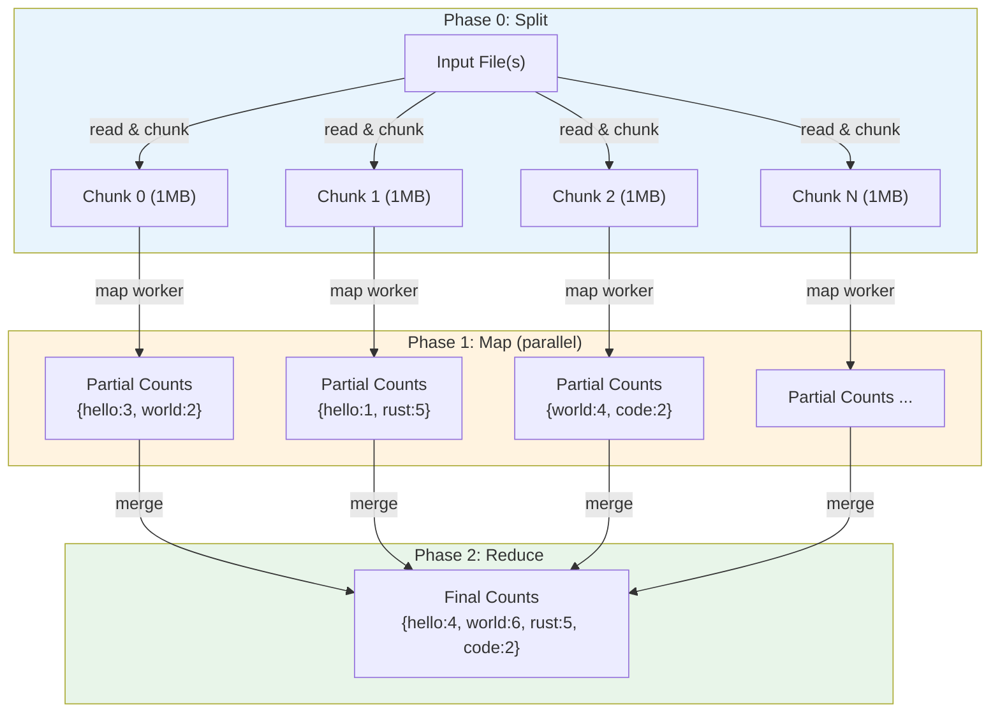
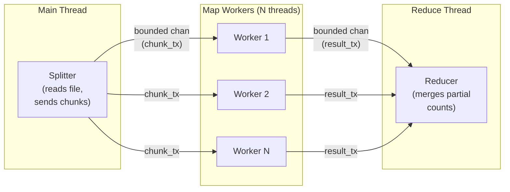
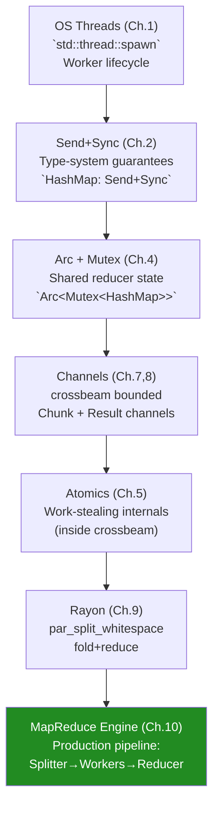

# Chapter 10: Capstone — Parallel MapReduce Engine 🔴

> **What you'll learn:**
> - How to architect a production-grade parallel data processing pipeline from scratch
> - Applying `crossbeam-channel`, `Arc<Mutex<HashMap>>`, and thread pools cohesively
> - The MapReduce programming model in Rust: file chunking, parallel Map, and concurrent Reduce
> - A complete, working, end-to-end implementation with performance analysis and extension paths

---

## 10.1 The Problem: Word Frequency at Scale

Our capstone project is a **parallel word frequency counter**: given a large text file (or a collection of files), count the frequency of every word across the entire corpus as fast as possible.

This is the canonical MapReduce example: simple enough to understand, complex enough to showcase every concurrency technique from this guide.

### The Sequential Baseline

```rust
use std::collections::HashMap;
use std::fs;

fn sequential_word_count(path: &str) -> HashMap<String, usize> {
    let text = fs::read_to_string(path).expect("Failed to read file");
    let mut counts = HashMap::new();
    for word in text.split_whitespace() {
        let word = normalize_word(word);
        if !word.is_empty() {
            *counts.entry(word).or_insert(0) += 1;
        }
    }
    counts
}

fn normalize_word(word: &str) -> String {
    word.chars()
        .filter(|c| c.is_alphabetic())
        .map(|c| c.to_lowercase().next().unwrap())
        .collect()
}
```

For a 1 GB text file, this runs on one core. We'll make it run on all cores.

---

## 10.2 Architecture Design

### MapReduce Phases



### Thread Communication Topology



We use two bounded crossbeam channels:
1. `chunk_channel`: Splitter → Workers (bounded to limit memory)
2. `result_channel`: Workers → Reducer (bounded to rate-limit reduction)

---

## 10.3 The Complete Implementation

```rust
// Cargo.toml dependencies:
// [dependencies]
// crossbeam-channel = "0.5"
// rayon = "1"

use std::collections::HashMap;
use std::fs::File;
use std::io::{BufRead, BufReader, Read};
use std::sync::{Arc, Mutex};
use std::thread;
use std::time::Instant;

use crossbeam_channel::{bounded, Receiver, Sender};

// ─── Types ─────────────────────────────────────────────────────────────────

/// A text chunk from the input file — multiple words, one or more lines.
type Chunk = String;

/// A partial word-count result from one Map worker.
type PartialCounts = HashMap<String, usize>;

/// The final aggregated counts.
type FinalCounts = HashMap<String, usize>;

// ─── Configuration ──────────────────────────────────────────────────────────

pub struct MapReduceConfig {
    /// Size of each text chunk sent to map workers (in bytes, approximate)
    pub chunk_size_bytes: usize,
    /// Number of parallel map workers
    pub num_map_workers: usize,
    /// Capacity of the chunk channel (number of in-flight chunks)
    pub chunk_channel_capacity: usize,
    /// Capacity of the result channel (number of in-flight partial result maps)
    pub result_channel_capacity: usize,
}

impl Default for MapReduceConfig {
    fn default() -> Self {
        let num_cpus = thread::available_parallelism()
            .map(|n| n.get())
            .unwrap_or(4);
        MapReduceConfig {
            chunk_size_bytes: 1 * 1024 * 1024, // 1 MB per chunk
            num_map_workers: num_cpus,
            chunk_channel_capacity: num_cpus * 2,
            result_channel_capacity: num_cpus * 2,
        }
    }
}

// ─── Word Normalization ──────────────────────────────────────────────────────

/// Normalize a word: lowercase + strip non-alphabetic chars.
/// Returns empty string for tokens with no alphabetic chars.
#[inline]
fn normalize(word: &str) -> String {
    word.chars()
        .filter(|c| c.is_alphabetic())
        .flat_map(|c| c.to_lowercase())
        .collect()
}

// ─── Phase 0: Splitter ──────────────────────────────────────────────────────

/// Reads the input file in chunks and sends each chunk to the map workers.
/// Runs on the main thread (or a dedicated splitter thread).
fn run_splitter(
    path: &str,
    chunk_size: usize,
    chunk_tx: Sender<Chunk>,
) -> std::io::Result<usize> {
    let file = File::open(path)?;
    let mut reader = BufReader::with_capacity(chunk_size * 2, file);
    let mut total_bytes = 0usize;
    let mut chunks_sent = 0usize;

    loop {
        // Read `chunk_size` bytes, but extend to the next line boundary
        // so we don't split a word across chunks (which would corrupt word counts).
        let mut buf = Vec::with_capacity(chunk_size);
        let n = reader.by_ref().take(chunk_size as u64).read_to_end(&mut buf)?;

        if n == 0 {
            break; // EOF
        }

        // Read until the next newline to avoid splitting words at the boundary
        if n == chunk_size {
            let mut line_remainder = String::new();
            reader.read_line(&mut line_remainder)?;
            buf.extend_from_slice(line_remainder.as_bytes());
        }

        total_bytes += buf.len();
        let chunk = String::from_utf8_lossy(&buf).into_owned();

        // `send` blocks if the channel is full — natural backpressure
        if chunk_tx.send(chunk).is_err() {
            // Workers stopped reading — probably an error
            break;
        }
        chunks_sent += 1;
    }

    println!(
        "[Splitter] Sent {} chunks ({} KB total)",
        chunks_sent,
        total_bytes / 1024
    );
    // chunk_tx dropped here — workers will see channel close and stop
    Ok(total_bytes)
}

// ─── Phase 1: Map Workers ────────────────────────────────────────────────────

/// A single map worker: reads chunks, produces partial word-count maps.
fn run_map_worker(
    worker_id: usize,
    chunk_rx: Receiver<Chunk>,
    result_tx: Sender<PartialCounts>,
) {
    let mut chunks_processed = 0usize;

    for chunk in chunk_rx.iter() {
        // Count words in this chunk.
        // This is purely local to the thread — no locking, no sharing.
        let mut counts = PartialCounts::new();

        for word in chunk.split_whitespace() {
            let normalized = normalize(word);
            if !normalized.is_empty() {
                *counts.entry(normalized).or_insert(0) += 1;
            }
        }

        chunks_processed += 1;

        // Send partial result to the reducer.
        // Blocks if result channel is full — backpressure ensures reducer keeps up.
        if result_tx.send(counts).is_err() {
            // Reducer stopped — probably done or errored
            break;
        }
    }

    println!(
        "[Worker {}] Processed {} chunks",
        worker_id, chunks_processed
    );
}

// ─── Phase 2: Reducer ────────────────────────────────────────────────────────

/// Receives partial count maps and merges them into the final result.
/// 
/// Design Option A (used here): A dedicated reducer thread that owns the HashMap.
/// Design Option B (discussed below): Arc<Mutex<HashMap>> with all workers merging.
fn run_reducer(result_rx: Receiver<PartialCounts>) -> FinalCounts {
    let mut final_counts = FinalCounts::new();
    let mut batches_received = 0usize;

    for partial in result_rx.iter() {
        // Merge the partial map into the final map.
        // This is a sequential operation — no parallel merging here.
        // The reducer is the bottleneck only if merging is slower than mapping.
        // In practice, for word count, merging is much faster than counting.
        for (word, count) in partial {
            *final_counts.entry(word).or_insert(0) += count;
        }
        batches_received += 1;
    }

    println!("[Reducer] Merged {} partial results", batches_received);
    final_counts
}

// ─── Orchestration ──────────────────────────────────────────────────────────

/// Run the full MapReduce word count pipeline.
pub fn parallel_word_count(path: &str, config: MapReduceConfig) -> std::io::Result<FinalCounts> {
    let (chunk_tx, chunk_rx) = bounded::<Chunk>(config.chunk_channel_capacity);
    let (result_tx, result_rx) = bounded::<PartialCounts>(config.result_channel_capacity);

    // Spawn map worker threads
    let mut worker_handles = vec![];
    for worker_id in 0..config.num_map_workers {
        let chunk_rx = chunk_rx.clone();
        let result_tx = result_tx.clone();
        let handle = thread::Builder::new()
            .name(format!("map-worker-{}", worker_id))
            .spawn(move || run_map_worker(worker_id, chunk_rx, result_tx))
            .expect("Failed to spawn map worker");
        worker_handles.push(handle);
    }
    // Drop our extra copies — workers have the only ones now
    drop(chunk_rx);
    drop(result_tx);

    // Spawn reducer thread
    let reducer_handle = thread::Builder::new()
        .name("reducer".to_string())
        .spawn(move || run_reducer(result_rx))
        .expect("Failed to spawn reducer");

    // Run splitter on the main thread
    let total_bytes = run_splitter(path, config.chunk_size_bytes, chunk_tx)?;
    println!("[Main] Splitter done. Total: {} KB", total_bytes / 1024);

    // chunk_tx dropped when run_splitter returns — workers see EOF and finish

    // Wait for all workers to finish
    for handle in worker_handles {
        handle.join().expect("Map worker panicked");
    }
    // result_tx dropped (we dropped it above; workers drop theirs on exit)
    // → reducer sees EOF and returns its accumulated map

    // Wait for reducer and collect result
    let final_counts = reducer_handle.join().expect("Reducer panicked");
    Ok(final_counts)
}

// ─── Alternative Reducer: Arc<Mutex<HashMap>> ───────────────────────────────

/// Alternative design: workers write directly to a shared HashMap.
/// This eliminates the result channel and dedicated reducer thread, but
/// introduces lock contention when many workers finish simultaneously.
///
/// In benchmarks, the dedicated reducer thread (above) typically wins for
/// high word-count rates because the Mutex becomes a serialization bottleneck.
/// Use this design when the Map phase is the bottleneck, not the Merge.
pub fn parallel_word_count_mutex(
    path: &str,
    config: &MapReduceConfig,
) -> std::io::Result<FinalCounts> {
    let (chunk_tx, chunk_rx) = bounded::<Chunk>(config.chunk_channel_capacity);

    // Shared HashMap protected by Mutex
    let final_counts = Arc::new(Mutex::new(FinalCounts::new()));

    let mut worker_handles = vec![];
    for worker_id in 0..config.num_map_workers {
        let chunk_rx = chunk_rx.clone();
        let counts = Arc::clone(&final_counts);
        let handle = thread::spawn(move || {
            for chunk in chunk_rx.iter() {
                // Map: count words locally first (no lock held during count)
                let mut local_counts = PartialCounts::new();
                for word in chunk.split_whitespace() {
                    let normalized = normalize(word);
                    if !normalized.is_empty() {
                        *local_counts.entry(normalized).or_insert(0) += 1;
                    }
                }

                // Reduce: merge into shared map under lock
                // We hold the lock for as short a time as possible.
                // The mapping (CPU-intensive) happens outside the lock window.
                let mut global = counts.lock().expect("Mutex poisoned");
                for (word, count) in local_counts {
                    *global.entry(word).or_insert(0) += count;
                }
                // Lock released here
            }
            println!("[Worker {}] Done (mutex design)", worker_id);
        });
        worker_handles.push(handle);
    }
    drop(chunk_rx);

    run_splitter(path, config.chunk_size_bytes, chunk_tx)?;

    for handle in worker_handles {
        handle.join().expect("Worker panicked");
    }

    let result = Arc::try_unwrap(final_counts)
        .expect("Arc still has active references")
        .into_inner()
        .expect("Mutex poisoned");
    Ok(result)
}

// ─── Main ────────────────────────────────────────────────────────────────────

fn main() -> std::io::Result<()> {
    // For demonstration: generate a test file if none exists
    let test_path = "test_corpus.txt";
    generate_test_corpus(test_path, 100_000)?; // 100K lines

    println!("=== Parallel MapReduce Word Count ===\n");

    let config = MapReduceConfig {
        num_map_workers: thread::available_parallelism().map(|n| n.get()).unwrap_or(4),
        ..Default::default()
    };

    println!(
        "Config: {} workers, {}KB chunks, chunk_cap={}, result_cap={}",
        config.num_map_workers,
        config.chunk_size_bytes / 1024,
        config.chunk_channel_capacity,
        config.result_channel_capacity
    );

    // --- Design A: Dedicated Reducer Thread ---
    let start = Instant::now();
    let counts_a = parallel_word_count(test_path, MapReduceConfig { ..Default::default() })?;
    let time_a = start.elapsed();

    // --- Design B: Arc<Mutex<HashMap>> ---
    let config_b = MapReduceConfig { ..Default::default() };
    let start = Instant::now();
    let counts_b = parallel_word_count_mutex(test_path, &config_b)?;
    let time_b = start.elapsed();

    // Verify both designs produce the same result
    let mut words_a: Vec<_> = counts_a.keys().collect();
    let mut words_b: Vec<_> = counts_b.keys().collect();
    words_a.sort();
    words_b.sort();
    assert_eq!(words_a, words_b, "Designs disagree on vocabulary!");
    for word in &words_a {
        assert_eq!(
            counts_a[*word], counts_b[*word],
            "Count mismatch for '{}'", word
        );
    }
    println!("\n✓ Both designs produce identical results\n");

    // --- Results ---
    println!("=== Performance ===");
    println!("Design A (dedicated reducer): {:.3}ms", time_a.as_secs_f64() * 1000.0);
    println!("Design B (Arc<Mutex>):        {:.3}ms", time_b.as_secs_f64() * 1000.0);

    println!("\n=== Top 20 Words ===");
    let mut sorted: Vec<(&String, &usize)> = counts_a.iter().collect();
    sorted.sort_by(|a, b| b.1.cmp(a.1).then(a.0.cmp(b.0)));
    for (word, count) in sorted.iter().take(20) {
        println!("  {:20} {:6}", word, count);
    }

    println!(
        "\nVocabulary size: {} unique words across {} total lines",
        counts_a.len(),
        100_000
    );

    Ok(())
}

// ─── Test Corpus Generator ───────────────────────────────────────────────────

fn generate_test_corpus(path: &str, num_lines: usize) -> std::io::Result<()> {
    use std::io::Write;
    let mut file = std::io::BufWriter::new(File::create(path)?);

    let words = [
        "the", "quick", "brown", "fox", "jumps", "over", "lazy", "dog",
        "rust", "concurrency", "thread", "safety", "atomic", "mutex", "channel",
        "parallel", "memory", "ordering", "acquire", "release", "lock", "free",
        "rayon", "crossbeam", "async", "future", "tokio", "spawn", "join",
        "ownership", "borrowing", "lifetime", "trait", "generic", "send", "sync",
    ];

    let mut rng_state = 12345u64;
    let mut next_rand = move || -> usize {
        // Simple xorshift64 pseudo-random
        rng_state ^= rng_state << 13;
        rng_state ^= rng_state >> 7;
        rng_state ^= rng_state << 17;
        (rng_state % words.len() as u64) as usize
    };

    for _ in 0..num_lines {
        let line_len = (next_rand() % 12) + 4;
        let line: Vec<&str> = (0..line_len).map(|_| words[next_rand()]).collect();
        writeln!(file, "{}", line.join(" "))?;
    }

    println!("[Setup] Generated test corpus: {} ({} lines)", path, num_lines);
    Ok(())
}
```

---

## 10.4 Design Analysis and Trade-offs

### Design A: Dedicated Reducer Thread

```
Advantages:
✓ Zero lock contention in the Map phase (workers don't share anything)
✓ Reducer can pipeline with Map workers (they run concurrently)
✓ Reducer processes results in FIFO order — predictable behavior
✓ Clean channel-based ownership — no unsafe, no Arc<Mutex> complexity

Disadvantages:
✗ Reducer is a serial bottleneck — if reduce is slower than map, pipeline stalls
✗ Memory: partial HashMaps are serialized through the channel
✗ Two-phase: some duplicate counting (once locally, once in reducer)
```

### Design B: `Arc<Mutex<HashMap>>`

```
Advantages:
✓ Simpler code — no result channel needed
✓ Workers merge directly — no partial HashMap allocation in flight
✓ Works well when Map phase is the bottleneck (not Reduce)

Disadvantages:
✗ Lock contention when many workers finish simultaneously
✗ Worker threads blocked on Mutex while merging → wastes CPU
✗ Harder to reason about performance (contention is unpredictable)
```

### Design C: Lock-Free with `DashMap` (Production Upgrade)

For maximum throughput with heavy reduce operations, use `dashmap` — a concurrent HashMap based on sharded RwLocks:

```rust
// In Cargo.toml:
// [dependencies]
// dashmap = "5"

use dashmap::DashMap;
use std::sync::Arc;

pub fn parallel_word_count_dashmap(
    path: &str,
    config: &MapReduceConfig,
) -> std::io::Result<HashMap<String, usize>> {
    let (chunk_tx, chunk_rx) = bounded::<Chunk>(config.chunk_channel_capacity);
    
    // DashMap: concurrent HashMap — no Mutex, sharded RwLock internally
    let counts = Arc::new(DashMap::<String, usize>::new());

    let mut handles = vec![];
    for _ in 0..config.num_map_workers {
        let chunk_rx = chunk_rx.clone();
        let counts = Arc::clone(&counts);
        handles.push(thread::spawn(move || {
            for chunk in chunk_rx.iter() {
                for word in chunk.split_whitespace() {
                    let normalized = normalize(word);
                    if !normalized.is_empty() {
                        // DashMap handles concurrent access internally via sharding.
                        // This avoids a global Mutex, dramatically reducing contention.
                        *counts.entry(normalized).or_insert(0) += 1;
                    }
                }
            }
        }));
    }
    drop(chunk_rx);
    run_splitter(path, config.chunk_size_bytes, chunk_tx)?;
    for h in handles { h.join().unwrap(); }

    // Collect DashMap into regular HashMap
    Ok(counts.into_iter().collect())
}
```

### Performance Comparison Table

| Design | Map Contention | Reduce Contention | Memory | Best For |
|---|---|---|---|---|
| A: Dedicated Reducer | None | None (sequential) | Medium (channels) | Balanced Map/Reduce loads |
| B: `Arc<Mutex<HashMap>>` | None during map, high during merge | High | Low | Map-heavy workloads |
| C: `DashMap` | None | Low (sharded) | Low | All workloads with heavy reduce |
| D: Rayon `par_iter` + `fold` | None | None (tree reduce) | Medium | Pure Rayon pipelines |

---

## 10.5 Extension: Rayon-Powered MapReduce

Rayon's `fold` + `reduce` can implement the same MapReduce in a single, elegant expression:

```rust
use rayon::prelude::*;
use std::collections::HashMap;

pub fn rayon_word_count(text: &str) -> HashMap<String, usize> {
    text.par_split_whitespace() // Parallel split on whitespace
        // Map: each word → (word, 1)
        // Reduce Phase via fold: each thread accumulates its own local HashMap
        .fold(
            HashMap::new,  // Factory: each worker gets its own HashMap
            |mut map, word| {
                let word = normalize(word);
                if !word.is_empty() {
                    *map.entry(word).or_insert(0) += 1;
                }
                map
            }
        )
        // Reduce: merge all per-thread HashMaps into one
        .reduce(
            HashMap::new,  // Identity element for empty case
            |mut map_a, map_b| {
                for (word, count) in map_b {
                    *map_a.entry(word).or_insert(0) += count;
                }
                map_a
            }
        )
}

fn demonstrate_rayon_mapreduce() {
    let text = std::fs::read_to_string("test_corpus.txt").unwrap();
    let counts = rayon_word_count(&text);
    
    let mut top: Vec<_> = counts.iter().collect();
    top.sort_by(|a, b| b.1.cmp(a.1));
    println!("Top words: {:?}", &top[..5]);
}
```

The `fold` + `reduce` pattern is the most idiomatic Rust parallel MapReduce. Each worker independently accumulates a partial result (no sharing, no locking), and Rayon's tree-based reduce merges them.

---

## 10.6 Full Architecture Recap

You have now seen every layer of Rust's concurrency stack applied to a real problem:



---

<details>
<summary><strong>🏋️ Exercise: Extend to Multi-File MapReduce</strong> (click to expand)</summary>

**Challenge:** Extend the MapReduce engine to process multiple files concurrently. Instead of a single-file splitter, create a **file dispatcher** that:

1. Accepts a `Vec<PathBuf>` of input files.
2. Reads each file in a separate thread (or scoped thread).
3. Sends chunks from all files into the same chunk channel.
4. All other stages (map workers, reducer) remain unchanged.

**Bonus:** Report which file each chunk came from, and produce per-file word counts in addition to the aggregate.

<details>
<summary>🔑 Solution</summary>

```rust
use std::collections::HashMap;
use std::fs::File;
use std::io::{BufReader, Read};
use std::path::PathBuf;
use std::thread;
use crossbeam_channel::{bounded, Receiver, Sender};

type FileId = usize;
type TaggedChunk = (FileId, String);
type PartialCounts = HashMap<String, usize>;

fn normalize(word: &str) -> String {
    word.chars()
        .filter(|c| c.is_alphabetic())
        .flat_map(|c| c.to_lowercase())
        .collect()
}

/// Dispatches chunks from multiple files into a single chunk channel.
/// Each file is read in a separate scoped thread.
fn multi_file_splitter(
    paths: &[PathBuf],
    chunk_size: usize,
    chunk_tx: Sender<TaggedChunk>,
) -> std::io::Result<()> {
    thread::scope(|s| -> std::io::Result<()> {
        for (file_id, path) in paths.iter().enumerate() {
            let tx = chunk_tx.clone();
            let path = path.clone();
            s.spawn(move || -> std::io::Result<()> {
                let file = File::open(&path)?;
                let mut reader = BufReader::with_capacity(chunk_size * 2, file);
                
                loop {
                    let mut buf = Vec::with_capacity(chunk_size);
                    let n = reader.by_ref().take(chunk_size as u64).read_to_end(&mut buf)?;
                    if n == 0 { break; }
                    
                    let chunk = String::from_utf8_lossy(&buf).into_owned();
                    if tx.send((file_id, chunk)).is_err() { break; }
                }
                println!("[Splitter] File {} done: {}", file_id, path.display());
                Ok(())
            });
        }
        // All file-reading threads are joined when scope exits
        Ok(())
    })
}

/// Map worker: processes chunks and produces per-file + aggregate counts.
fn map_worker_multi(
    id: usize,
    chunk_rx: Receiver<TaggedChunk>,
    result_tx: Sender<(FileId, PartialCounts)>,
) {
    for (file_id, chunk) in chunk_rx.iter() {
        let mut counts = PartialCounts::new();
        for word in chunk.split_whitespace() {
            let w = normalize(word);
            if !w.is_empty() {
                *counts.entry(w).or_insert(0) += 1;
            }
        }
        if result_tx.send((file_id, counts)).is_err() { break; }
    }
    println!("[Worker {}] done", id);
}

pub struct MultiFileResult {
    pub per_file: Vec<HashMap<String, usize>>,
    pub aggregate: HashMap<String, usize>,
}

pub fn multi_file_word_count(
    paths: Vec<PathBuf>,
    num_workers: usize,
    chunk_size: usize,
) -> std::io::Result<MultiFileResult> {
    let num_files = paths.len();
    let (chunk_tx, chunk_rx) = bounded::<TaggedChunk>(num_workers * 2);
    let (result_tx, result_rx) = bounded::<(FileId, PartialCounts)>(num_workers * 2);

    // Spawn map workers
    let mut handles = vec![];
    for id in 0..num_workers {
        let crx = chunk_rx.clone();
        let rtx = result_tx.clone();
        handles.push(thread::spawn(move || map_worker_multi(id, crx, rtx)));
    }
    drop(chunk_rx);
    drop(result_tx);

    // Spawn reducer thread
    let reducer = thread::spawn(move || {
        let mut per_file: Vec<HashMap<String, usize>> = vec![HashMap::new(); num_files];
        let mut aggregate: HashMap<String, usize> = HashMap::new();

        for (file_id, partial) in result_rx.iter() {
            for (word, count) in partial {
                *per_file[file_id].entry(word.clone()).or_insert(0) += count;
                *aggregate.entry(word).or_insert(0) += count;
            }
        }
        MultiFileResult { per_file, aggregate }
    });

    // Run multi-file splitter (joins all file-reading threads internally)
    multi_file_splitter(&paths, chunk_size, chunk_tx)?;

    for h in handles { h.join().unwrap(); }
    let result = reducer.join().unwrap();
    Ok(result)
}

fn main() -> std::io::Result<()> {
    // Create test files
    let paths: Vec<PathBuf> = (0..3).map(|i| {
        let path = PathBuf::from(format!("corpus_{}.txt", i));
        std::fs::write(&path, format!(
            "rust concurrency thread {} safety atomic mutex channel parallel",
            i
        ).repeat(10000)).unwrap();
        path
    }).collect();

    let result = multi_file_word_count(
        paths.clone(),
        thread::available_parallelism().map(|n| n.get()).unwrap_or(4),
        64 * 1024,
    )?;

    println!("=== Per-File Results ===");
    for (i, counts) in result.per_file.iter().enumerate() {
        let total: usize = counts.values().sum();
        println!("  File {}: {} unique words, {} total", i, counts.len(), total);
    }

    println!("\n=== Aggregate Top Words ===");
    let mut top: Vec<_> = result.aggregate.iter().collect();
    top.sort_by(|a, b| b.1.cmp(a.1));
    for (word, count) in top.iter().take(10) {
        println!("  {:20} {}", word, count);
    }

    // Cleanup
    for path in &paths { let _ = std::fs::remove_file(path); }
    Ok(())
}
```

</details>
</details>

---

> **Key Takeaways**
> - MapReduce in Rust is the synthesis of all the primitives in this guide: OS threads for workers, crossbeam channels for pipeline communication, `Arc<Mutex<T>>` or `DashMap` for shared reduce state, and Rayon for elegant fold+reduce.
> - The **dedicated reducer thread** design (Design A) achieves the highest throughput under balanced workloads by eliminating all shared state in the Map phase.
> - Always keep the critical section (Mutex lock window) as short as possible: compute locally, merge under lock (or via dedicated channel) — not both under lock.
> - Rayon's `fold` + `reduce` combinator is the most declarative MapReduce expression but requires the full dataset to be in memory (no streaming).
> - Production word count tools use Design C (`DashMap` / sharded concurrent HashMap) for the lowest contention at scale.

> **See also:**
> - [Chapter 4: Mutexes, RwLocks, and Poisoning](ch04-mutexes-rwlocks-and-poisoning.md) — `Arc<Mutex<HashMap>>` design
> - [Chapter 8: Advanced Channels with Crossbeam](ch08-advanced-channels-crossbeam.md) — pipeline channels, backpressure
> - [Chapter 9: Data Parallelism with Rayon](ch09-data-parallelism-rayon.md) — `fold + reduce` MapReduce
> - [Appendix A: Reference Card](ch11-appendix-reference-card.md) — quick-reference for all primitives
