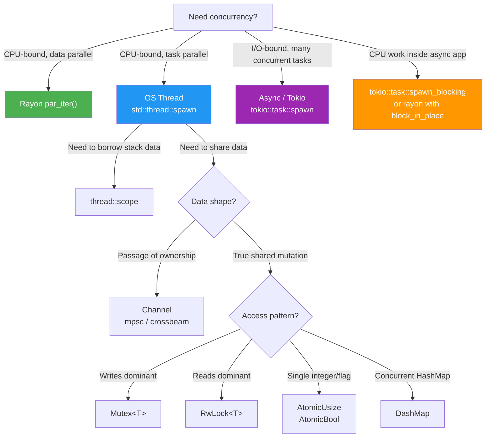

# Appendix A: Reference Card — Concurrency Primitives at a Glance

This reference card condenses every major primitive, pattern, and decision rule from this guide into scannable tables, flowcharts, and cheat sheets. Bookmark this page.

---

## A.1 Synchronization Primitives — Master Comparison Table

| Primitive | Crate | Protects | Readers | Writers | `async`-safe? | `Send`? | `Sync`? | When to use |
|---|---|---|---|---|---|---|---|---|
| `Mutex<T>` | `std` | Exclusive access to `T` | 1 at a time | 1 at a time | ⚠️ Not across `.await` | ✓ | ✓ | Default shared mutable state |
| `RwLock<T>` | `std` | Concurrent reads, excl. write | Many | 1 | ⚠️ Not across `.await` | ✓ | ✓ | Read-heavy workloads (≥80% reads) |
| `tokio::sync::Mutex<T>` | `tokio` | Exclusive access to `T` | 1 at a time | 1 at a time | ✓ | ✓ | `Mutex` held across `await` points |
| `tokio::sync::RwLock<T>` | `tokio` | Concurrent async reads | Many | 1 | ✓ | ✓ | `RwLock` held across `await` points |
| `AtomicUsize` / `AtomicBool` | `std` | Single primitive value | Lock-free | Lock-free | ✓ | ✓ | Counters, flags, spinlocks |
| `AtomicPtr<T>` | `std` | Raw pointer to `T` | Lock-free | Lock-free | ✓ | ✓ | Lock-free data structures |
| `mpsc::channel` | `std` | Ownership transfer | 1 receiver | Many senders | ✓ | ✓ | One consumer task patterns |
| `mpsc::sync_channel` | `std` | Ownership + backpressure | 1 receiver | Many senders | ✓ | ✓ | Bounded work queue |
| `crossbeam_channel::bounded` | `crossbeam` | Ownership + backpressure | Many | Many | ✓ | ✓ | MPMC, `select!`, pipelines |
| `crossbeam_channel::unbounded` | `crossbeam` | Ownership, no backpressure | Many | Many | ✓ | ✓ | Burst-tolerant message passing |
| `Rayon par_iter()` | `rayon` | Iterator parallelism | — | — | ✗ (sync only) | ✓ | CPU-bound bulk data transformation |
| `thread::scope` | `std` | Stack-borrowing threads | — | — | ✗ | ✓ | Borrow non-`'static` data in threads |
| `DashMap<K,V>` | `dashmap` | Concurrent HashMap | Many | Many (sharded) | ✓ | ✓ | High-concurrency key-value maps |

---

## A.2 Memory Orderings Cheat Sheet

| Ordering | `std` Variant | What it guarantees | Instruction barrier | When to use |
|---|---|---|---|---|
| `Relaxed` | `Ordering::Relaxed` | Atomicity only — no ordering between ops | None | Counters where ordering doesn't matter |
| `Acquire` | `Ordering::Acquire` | All subsequent reads/writes see everything before the matching Release | `LDAR` (ARM), `MOV` (x86) | **Load**: acquiring a lock or reading a published pointer |
| `Release` | `Ordering::Release` | All previous reads/writes are visible before the load with Acquire | `STLR` (ARM), `MOV` (x86) | **Store**: releasing a lock or publishing a pointer |
| `AcqRel` | `Ordering::AcqRel` | Both Acquire and Release — for read-modify-write ops | Both barriers | `fetch_add`, `compare_exchange` on lock-like primitives |
| `SeqCst` | `Ordering::SeqCst` | Total sequential consistency — all threads agree on order | `LDAR`+`STLR` (ARM), `MFENCE`+locked `XCHG` (x86) | When Acquire/Release is insufficient; last resort |

### Memory Ordering Decision Flowchart

```
Is the operation a pure counter (statistics, not used for synchronization)?
├── YES → Relaxed
└── NO → Does this operation *publish* data (e.g., store a pointer/flag that another thread will read)?
    ├── YES → Release (store)
    │         └── And the corresponding *consume* operation → Acquire (load)
    └── NO → Is it a read-modify-write (fetch_add, compare_exchange)?
              ├── YES → AcqRel (if used for synchronization)
              └── NO → Do you need a total global order across all threads?
                        ├── YES → SeqCst (multi-flag protocols, Dekker's algorithm)
                        └── NO → Acquire or Release (whichever is appropriate)
```

---

## A.3 `Send` and `Sync` — Quick Classification

| Type | `Send` | `Sync` | Why |
|---|---|---|---|
| `i32`, `f64`, `bool`, `usize` | ✓ | ✓ | Plain values, no interior state |
| `String`, `Vec<T: Send>` | ✓ | ✓ | Owned, heap-allocated |
| `Arc<T: Send+Sync>` | ✓ | ✓ | Reference-counted with atomic count |
| `Rc<T>` | ✗ | ✗ | Non-atomic reference count |
| `Mutex<T: Send>` | ✓ | ✓ | Lock enforces exclusive access |
| `MutexGuard<'_, T>` | ✗ | ✓ | Guard must be released on same thread |
| `Cell<T>` | ✓ | ✗ | Interior mutability without locks — not safe across threads |
| `RefCell<T>` | ✓ | ✗ | Runtime borrow check — not thread-safe |
| `*mut T` (raw pointer) | ✗ | ✗ | Opt out — must `unsafe impl Send` if proven safe |
| `AtomicUsize` | ✓ | ✓ | Lock-free atomic operations |
| `DashMap<K, V>` | ✓ | ✓ | Sharded RwLock internally |
| `crossbeam_channel::Sender<T: Send>` | ✓ | ✓ | Designed for cross-thread use |

---

## A.4 Rayon API Quick Reference

| Operation | Example | Notes |
|---|---|---|
| **Parallel iterator** | `data.par_iter()` | Drop-in for `.iter()` |
| **Mutable parallel iterator** | `data.par_iter_mut()` | Drop-in for `.iter_mut()` |
| **Parallel sort** | `data.par_sort()` | Merge sort, non-deterministic equal elements |
| **Parallel sort by** | `data.par_sort_by_key(\|x\| x.score)` | Custom comparator |
| **Filter** | `.filter(\|x\| x > 0)` | Returns `ParallelIterator` |
| **Map** | `.map(\|x\| x * 2)` | Transform in parallel |
| **Flat map** | `.flat_map(\|x\| [x, x])` | Flatten and map |
| **Reduce** | `.reduce(\|\| 0, \|a, b\| a + b)` | Parallel fold-tree |
| **Fold** | `.fold(\|\| Vec::new(), \|mut v, x\| { v.push(x); v })` | Per-thread accumulation |
| **collect** | `.collect::<Vec<_>>()` | Gather results |
| **find_first** | `.find_first(\|&&x\| x > 100)` | Leftmost match, short-circuit |
| **any / all** | `.any(\|x\| x > 100)` | Short-circuit predicates |
| **join** | `rayon::join(\|\| f(), \|\| g())` | Two tasks in parallel |
| **scope** | `rayon::scope(\|s\| { s.spawn(\|_\| ...) })` | Dynamic parallel tasks |
| **Custom thread pool** | `rayon::ThreadPoolBuilder::new().num_threads(4).build()` | Isolated pool |
| **Install global pool** | `ThreadPoolBuilder::new().build_global()` | Set global thread count |

---

## A.5 Channel Quick Comparison

| Feature | `std::sync::mpsc` | `crossbeam-channel` |
|---|---|---|
| Topology | MPSC (multi-producer, **single**-consumer) | MPMC (multi-producer, **multi**-consumer) |
| Bounded variant | `mpsc::sync_channel(N)` | `crossbeam_channel::bounded(N)` |
| Unbounded variant | `mpsc::channel()` | `crossbeam_channel::unbounded()` |
| `select!` | No | ✓ `crossbeam::select!` |
| Sender cloning | `Sender::clone()` | `Sender::clone()` |
| After all senders drop | `RecvError` | Channel disconnects |
| `try_recv` | ✓ | ✓ |
| `recv_timeout` | ✓ | ✓ |
| Zero-capacity (rendezvous) | No | `bounded(0)` |
| `into_iter()` on receiver | ✓ | ✓ |

---

## A.6 "Which Primitive?" Decision Flowchart

```
Does your data need to be shared across multiple threads?
│
├── NO → Use an owned value in a single thread; pass via channel when done.
│
└── YES → Is the data a single integer or flag (counter, flag, pointer)?
           │
           ├── YES → Use Atomics (AtomicUsize / AtomicBool / AtomicPtr)
           │          • Pure counting → Relaxed
           │          • Publish/subscribe pattern → Release/Acquire pair
           │
           └── NO → Is the data a complex struct or collection?
                    │
                    ├── Does the data only go *one way* (producer → consumer)?
                    │   └── YES → Channel (std::mpsc or crossbeam-channel)
                    │              • One consumer → mpsc or crossbeam bounded
                    │              • Multiple consumers → crossbeam bounded
                    │              • Need select! / MPMC → crossbeam
                    │
                    └── Data is truly shared and mutated by multiple threads:
                        │
                        ├── Read-heavy (≥80% reads)? → RwLock<T>
                        │
                        ├── Balanced reads/writes? → Mutex<T>
                        │
                        ├── Will the lock be held across `.await`?
                        │   └── YES → tokio::sync::Mutex (or redesign with channels)
                        │
                        ├── Key-value map with many concurrent writes?
                        │   └── YES → DashMap<K, V>
                        │
                        └── Data-parallel transformation of a collection?
                            └── YES → Rayon par_iter()
```

---

## A.7 Common Anti-Patterns to Avoid

| Anti-Pattern | What Happens | Fix |
|---|---|---|
| `std::sync::Mutex` held across `.await` | Deadlock: thread sleeping with lock held can't yield to process waker | `tokio::sync::Mutex`, or drop lock before `await`, or redesign |
| `Rc<T>` shared across threads | Compile error: `Rc: !Send` | Use `Arc<T>` |
| `RefCell<T>` shared across threads | Compile error: `RefCell: !Sync` | Use `Mutex<T>` or `RwLock<T>` |
| `AtomicUsize` increments with `Relaxed` used as a publish signal | Race: other thread may not see writes published before the flag | Use `Release` on store, `Acquire` on load |
| Acquiring two locks in different orders across threads | Deadlock | Always acquire locks in a consistent global order |
| Unbounded channel with fast producer, slow consumer | OOM: queue grows without bound | Use bounded channel; unbounded only for burst-tolerant designs |
| Rayon inside an async executor | Panic or starvation | Reserve Rayon for CPU-bound work; bridge with `tokio::task::spawn_blocking` |
| Spawning thousands of OS threads | OS limit / OOM in thread stacks | Use a thread pool (Rayon, custom `Arc<Mutex<Receiver>>` pool) |
| Using `AtomicPtr` without careful `unsafe` | Undefined behavior (aliasing, dangling) | Prefer higher-level lock-free crates or use `Mutex` |
| `while let Ok(msg) = rx.try_recv() {}` busy-loop | 100% CPU with no work | Use `rx.recv()` (blocking) or `select!` with `recv` |

---

## A.8 Thread Lifecycle Decision Guide



---

## A.9 Cargo.toml Dependency Reference

```toml
[dependencies]
# Crossbeam: MPMC channels, select!, work-stealing deques
crossbeam-channel = "0.5"
crossbeam-deque   = "0.8"  # For custom work-stealing schedulers

# Rayon: data parallelism, fork-join
rayon = "1"

# DashMap: concurrent HashMap (no Mutex needed)
dashmap = "5"

# Parking lot: faster Mutex/RwLock implementation (drop-in for std)
parking_lot = "0.12"

# Tokio: async runtime (only for async applications)
tokio = { version = "1", features = ["full"] }

# Arc-swap: wait-free swapping of Arc pointers
arc-swap = "1"

# Flume: alternative MPMC channel (similar to crossbeam-channel)
flume = "0.11"
```

---

## A.10 Minimum Rust Version Map

| Feature | Stabilized in | Notes |
|---|---|---|
| `std::thread::scope` | Rust 1.63 | Replaces `crossbeam::scope` for std-only projects |
| `std::sync::atomic::*::fetch_update` | Rust 1.53 | Convenience for CAS loops |
| `std::thread::available_parallelism` | Rust 1.59 | Replaces `num_cpus` crate for most use cases |
| `AtomicU8..AtomicU64` | Rust 1.34 | Additional atomic widths |
| Default `SeqCst` removed from `AtomicBool::new` | N/A | `new()` doesn't take ordering; operations take it |
| `std::hint::spin_loop` | Rust 1.49 | Replaces `core::hint::spin_loop_hint` |
| `Arc::increment_strong_count` / `decrement_strong_count` | Rust 1.51 | For unsafe Arc manipulation |

---

> **See also:**
> - [Chapter 1: OS Threads and move Closures](ch01-os-threads-and-move-closures.md)
> - [Chapter 2: Send and Sync Traits](ch02-send-and-sync-traits.md)
> - [Chapter 5: Atomics and Lock-Free Programming](ch05-atomics-and-lock-free.md)
> - [Chapter 6: Memory Ordering](ch06-memory-ordering.md)
> - [Chapter 10: Capstone — Parallel MapReduce Engine](ch10-capstone-mapreduce.md)
> - [The Rustonomicon — Atomics](https://doc.rust-lang.org/nomicon/atomics.html)
> - [Rust Reference — Memory Model](https://doc.rust-lang.org/reference/memory-model.html)
