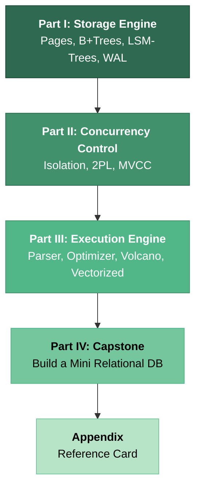

# Hardcore Database Internals: From B-Trees to Distributed Query Engines

## Speaker Intro

I'm a **Database Kernel Engineer** with over fifteen years of experience building and maintaining storage engines, buffer pool managers, and query optimizers at the systems level. I've contributed to PostgreSQL internals, built embedded storage engines from scratch, debugged torn pages at 3 AM during production incidents, and shipped MVCC implementations that serve billions of transactions per day. My career has been spent inside the machinery that sits between your SQL query and the spinning (or flashing) disk platters that store your data.

This guide is the training material I wish existed when I started. Not a "how to write SELECT statements" tutorial — a **first-principles engineering manual** for the software that makes databases *work*.

---

## Who This Is For

- **Senior/Staff backend engineers** who have hit a wall debugging slow queries and need to understand what `EXPLAIN ANALYZE` is actually telling them — at the OS and hardware level.
- **Systems programmers** who want to build their own storage engines, embedded databases, or key-value stores.
- **Database administrators** who want to move beyond tuning knobs and understand *why* `shared_buffers` matters, *why* vacuum is necessary, and *why* `fsync` is non-negotiable.
- **Engineers preparing for Staff+ interviews** at companies that probe deeply into systems internals, concurrency control, and distributed storage.

> **This guide is NOT for you if:** You are looking for a SQL tutorial, an ORM comparison, or a guide to setting up Postgres on Docker. We assume you already know SQL and have used a relational database in production.

---

## Prerequisites

| Concept | Why It Matters | Where to Learn |
|---|---|---|
| C, C++, or Rust | Code examples use Rust with C-style pseudocode for algorithms | [c-cpp-book](../c-cpp-book/src/SUMMARY.md) |
| File I/O (`open`, `read`, `write`, `fsync`) | Databases are, at their core, file managers | POSIX man pages, *Advanced Programming in the UNIX Environment* |
| Data Structures (Trees, Hash Tables) | B+Trees and LSM-Trees are the foundational storage structures | Any algorithms textbook (CLRS Ch. 18) |
| Basic Concurrency (Mutexes, Atomics) | Every chapter from Ch. 5 onward involves concurrent access | [concurrency-book](../concurrency-book/src/SUMMARY.md) |
| Memory Layout (Pointers, Alignment) | Pages and slotted pages require byte-level reasoning | [memory-management-book](../memory-management-book/src/SUMMARY.md) |

---

## How to Use This Book

| Emoji | Meaning | Effort |
|-------|---------|--------|
| 🟢 | **Systems Core** — Foundational storage engine concepts | 2–3 hours per chapter |
| 🟡 | **Engine Applied** — Requires prior chapters, production-relevant | 3–4 hours per chapter |
| 🔴 | **Kernel/Internal Architecture** — Deep internals, Staff+ level | 4–6 hours per chapter |

Every chapter contains:
- A **"What you'll learn"** block to set expectations.
- **Mermaid diagrams** illustrating data flows, page layouts, and execution plans.
- **"Naive Way vs. ACID Way"** comparisons showing how things break and how to fix them.
- An **Exercise** with a hidden solution — treat these as Staff-level interview prep.
- **Key Takeaways** for quick review.

---

## Pacing Guide

| Chapters | Topic | Time | Checkpoint |
|---|---|---|---|
| 0 | Introduction & Setup | 1 hour | Can explain why databases don't just use `HashMap<String, Vec<u8>>` |
| 1–2 | Pages, Buffer Pool, B+Trees | 6–8 hours | Can sketch a slotted page layout and explain B+Tree node splitting |
| 3–4 | LSM-Trees, WAL, Durability | 6–8 hours | Can explain write amplification and the ARIES recovery algorithm |
| 5–6 | Isolation Levels, 2PL, MVCC | 6–8 hours | Can trace a concurrent transaction through Postgres's MVCC |
| 7–8 | Query Optimizer, Execution Models | 8–10 hours | Can explain cost-based optimization and vectorized execution |
| 9 | Capstone: Mini Relational DB | 10–15 hours | Can design a complete embedded database architecture |

**Total estimated time: 40–55 hours** for a thorough, hands-on completion.

---

## Table of Contents

### Part I: The Storage Engine (Disk is the Enemy)

Databases exist because RAM is volatile and limited. This part teaches you how data lives on disk, how the database manages memory, and how durability is guaranteed even when the power goes out.

- **Chapter 1: Pages, Slotted Pages, and the Buffer Pool 🟢** — Why databases bypass the OS page cache, how the buffer pool manages page frames, and eviction policies (LRU, Clock Sweep).
- **Chapter 2: B+Trees and Indexing 🟢** — The dominant index structure for read-heavy workloads. Node splitting, crabbing/coupling for thread-safe traversal, and why high fanout minimizes disk I/O.
- **Chapter 3: LSM-Trees and Write Amplification 🟡** — Why B+Trees bottleneck on writes. Log-Structured Merge-Trees (RocksDB, Cassandra). MemTables, SSTables, bloom filters, and compaction strategies.
- **Chapter 4: Durability and the Write-Ahead Log (WAL) 🟡** — The ARIES recovery algorithm. Steal/No-Steal and Force/No-Force policies. Group commit, `fsync()`, and how databases survive sudden power loss.

### Part II: Concurrency Control (ACID)

Multiple users hitting the same rows at the same time is the hardest problem in database engineering. This part covers the theory and real-world implementations of isolation and concurrency control.

- **Chapter 5: Isolation Levels and Anomalies 🟡** — The anomalies that haunt concurrent systems: Dirty Reads, Non-Repeatable Reads, Phantom Reads, and Write Skew. How each isolation level prevents (or permits) them.
- **Chapter 6: Two-Phase Locking (2PL) vs. MVCC 🔴** — Lock-based vs. version-based concurrency. How Postgres and InnoDB implement MVCC. Transaction IDs, visibility rules, and the necessity of garbage collection (VACUUM).

### Part III: The Execution Engine

After storage and concurrency, we reach the brain of the database: the query processor. This part covers how SQL becomes an execution plan and how modern engines execute that plan efficiently.

- **Chapter 7: Query Parsing and the Optimizer 🔴** — From SQL strings to Abstract Syntax Trees. Rule-based vs. Cost-based Optimization. Statistics, histograms, and join order selection.
- **Chapter 8: Execution Models: Volcano vs. Vectorized 🔴** — The Volcano iterator model vs. vectorized batch processing. Columnar storage, SIMD, and why OLAP databases process data differently than OLTP systems.

### Part IV: The Database Capstone

- **Chapter 9: Capstone Project: Build a Mini Relational Database 🔴** — Design and implement the core architecture of an embedded relational database. Slotted pages, buffer pool, MVCC tuple format, and a cost-based optimizer.

### Appendices

- **Appendix A: Database Internals Reference Card** — Quick-reference cheat sheets for isolation anomalies, join algorithm complexity, page formats, and key formulas.

---

---

## Companion Guides

This book focuses on database internals. For related systems-level Rust training, see:

- [Concurrency in Rust](../concurrency-book/src/SUMMARY.md) — Mutexes, atomics, and lock-free structures needed for buffer pool and latch implementations.
- [Rust Memory Management](../memory-management-book/src/SUMMARY.md) — Ownership, lifetimes, and unsafe patterns used in page management.
- [Zero-Copy Architecture](../zero-copy-book/src/SUMMARY.md) — `io_uring`, memory-mapped I/O, and high-performance I/O patterns.
- [The SQL Rosetta Stone](../sql-rosetta-book/src/SUMMARY.md) — Cross-dialect SQL reference for Postgres, MySQL, and SQLite.
- [Hardcore Distributed Systems](../distributed-systems-book/src/SUMMARY.md) — Consensus, replication, and distributed transactions that build on the single-node concepts in this book.
- [Hardcore Hardware Sympathy](../hardware-sympathy-book/src/SUMMARY.md) — CPU caches, MESI protocol, and TLB behavior that directly impacts buffer pool and index performance.
