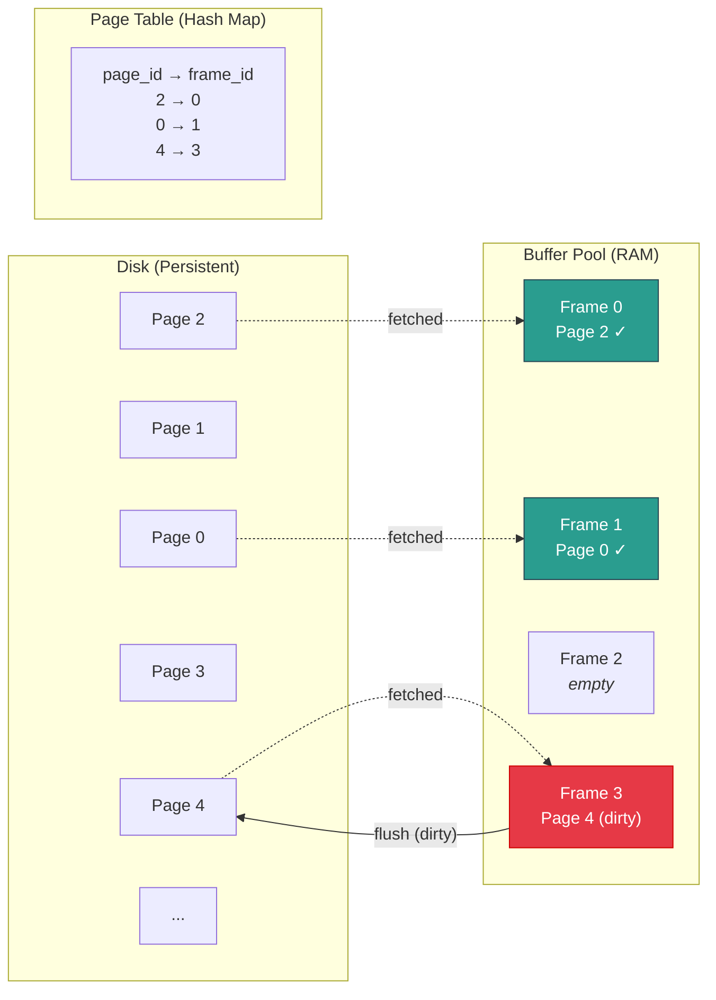
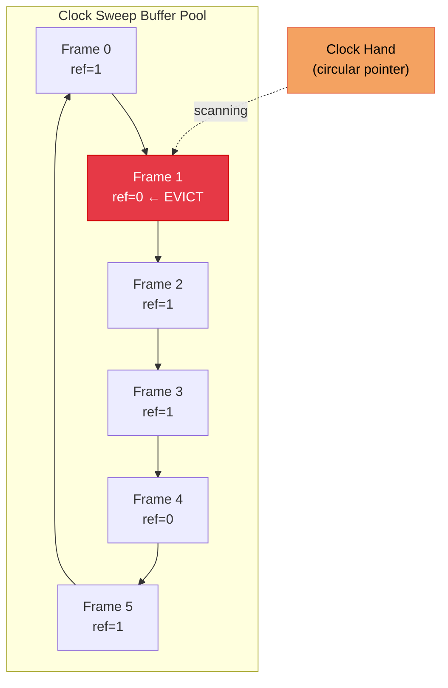
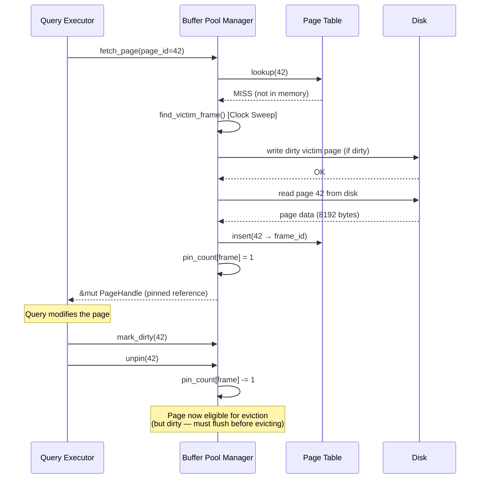

# 1. Pages, Slotted Pages, and the Buffer Pool 🟢

> **What you'll learn:**
> - Why databases manage their own memory instead of relying on the OS page cache.
> - The internal anatomy of a database page and the slotted page layout for variable-length records.
> - How the Buffer Pool Manager orchestrates page movement between disk and memory.
> - Eviction policies (LRU vs. Clock Sweep) and why getting this wrong destroys performance.

---

## Why Disk is the Enemy

Before we touch a single line of database code, you must internalize one brutal fact about computer hardware:

| Operation | Latency | Relative Cost |
|---|---|---|
| L1 Cache Reference | ~1 ns | 1× |
| L2 Cache Reference | ~4 ns | 4× |
| Main Memory (DRAM) | ~100 ns | 100× |
| SSD Random Read (4 KB) | ~16 μs | 16,000× |
| SSD Sequential Read (1 MB) | ~1 ms | 1,000,000× |
| HDD Random Read (4 KB) | ~4 ms | 4,000,000× |
| HDD Sequential Read (1 MB) | ~20 ms | 20,000,000× |

A single random disk read is **four million times** slower than reading from L1 cache. This asymmetry is the reason databases exist as specialized software. A naive program that reads rows from a file one at a time will spend 99.99% of its time waiting for disk. Every design choice in a storage engine — pages, buffer pools, B+Trees, WAL — exists to minimize the number of disk I/Os.

### The Fundamental Unit: The Page

Databases don't read individual rows from disk. They read **pages** — fixed-size blocks (typically 4 KB, 8 KB, or 16 KB) that match the OS virtual memory page size and the storage device's block size.

Why fixed-size pages?

1. **Alignment with hardware:** SSDs read and write in 4 KB sectors. HDDs read in 512-byte sectors but transfer in much larger blocks. Aligning database pages to these boundaries avoids "read-modify-write" amplification.
2. **Simplified memory management:** Fixed-size pages mean the buffer pool can be a simple array of equally sized slots (frames). No fragmentation, no complex allocator.
3. **Predictable I/O cost:** Reading one page = one disk I/O. The optimizer can count pages to estimate query cost.

```
┌─────────────────────────────────────┐
│         Disk (Data File)            │
│  ┌──────┐ ┌──────┐ ┌──────┐        │
│  │Page 0│ │Page 1│ │Page 2│  ...    │
│  │ 8 KB │ │ 8 KB │ │ 8 KB │        │
│  └──────┘ └──────┘ └──────┘        │
└─────────────────────────────────────┘
```

PostgreSQL uses **8 KB** pages. MySQL/InnoDB uses **16 KB** pages. SQLite uses **4 KB** by default. The choice involves tradeoffs:

| Page Size | Pros | Cons |
|---|---|---|
| 4 KB | Matches SSD sector size, less wasted space for small rows | More pages to manage, more I/O for large scans |
| 8 KB | Good balance, Postgres default | — |
| 16 KB | Fewer pages, more rows per I/O, InnoDB default | Wasted space for small rows, more write amplification |

---

## The Slotted Page Layout

A page doesn't just hold raw bytes — it needs to store **variable-length tuples** (rows) efficiently, support insertions and deletions without rewriting the whole page, and allow the system to reference individual tuples by a stable identifier.

The **slotted page** layout, used by nearly every major database, solves this elegantly:

```
┌──────────────────────────────────────────────────────┐
│                     Page Header                       │
│  (Page ID, LSN, Checksum, Free Space Offset, ...)     │
├──────────────────────────────────────────────────────┤
│  Slot Array (grows →)          Free Space             │
│  ┌────┐┌────┐┌────┐┌────┐                            │
│  │ S0 ││ S1 ││ S2 ││ S3 │  ←── empty ──→            │
│  └────┘└────┘└────┘└────┘                            │
│                                                      │
│                    ←── empty ──→                      │
│                                                      │
│  ┌──────────┐┌─────────────┐┌───────┐┌──────────┐   │
│  │ Tuple 3  ││  Tuple 2    ││Tuple 1││ Tuple 0  │   │
│  └──────────┘└─────────────┘└───────┘└──────────┘   │
│              Tuple Data (grows ←)                     │
└──────────────────────────────────────────────────────┘
```

**Key design points:**

1. **Slot Array** at the top of the page grows downward (toward higher offsets). Each slot is a small struct: `(offset: u16, length: u16)` pointing to where the tuple lives in the page.
2. **Tuple Data** at the bottom of the page grows upward (toward lower offsets). Tuples are packed from the end of the page.
3. **Free Space** is the gap in the middle. When it's exhausted, the page is full.
4. **Stable Tuple IDs:** A tuple is identified by `(PageID, SlotNumber)`. Even if tuples are compacted/reorganized within the page, the slot number remains stable — only the offset in the slot array changes. This is why index entries can point to `(page, slot)` without breaking when pages are reorganized.

### The Naive Way vs. The ACID Way

```rust
// 💥 THE NAIVE WAY: Fixed-size records, no indirection
// Storing rows at fixed byte offsets within a page.
// Problem: Deleting a row leaves a hole. Variable-length strings waste space
// when padded. Updating a row that grows requires moving everything after it.

struct NaivePage {
    data: [u8; 8192],
}

impl NaivePage {
    fn read_row(&self, row_num: usize, row_size: usize) -> &[u8] {
        let offset = row_num * row_size; // 💥 FRAGILE: assumes fixed-size rows
        &self.data[offset..offset + row_size]
    }

    fn delete_row(&mut self, row_num: usize, row_size: usize) {
        let offset = row_num * row_size;
        // 💥 DATA CORRUPTION: Just zeroing out the bytes.
        // How do we know this slot is "free" vs. containing valid all-zero data?
        self.data[offset..offset + row_size].fill(0);
    }
}
```

```rust
// ✅ THE ACID WAY: Slotted page with indirection layer
use std::mem;

const PAGE_SIZE: usize = 8192;
const HEADER_SIZE: usize = 24; // Page header bytes
const SLOT_SIZE: usize = 4;    // 2 bytes offset + 2 bytes length

struct SlottedPage {
    data: [u8; PAGE_SIZE],
}

struct PageHeader {
    page_id: u32,
    num_slots: u16,
    free_space_start: u16, // End of slot array
    free_space_end: u16,   // Start of tuple data (grows downward from end)
    lsn: u64,              // Log Sequence Number for WAL recovery
}

struct Slot {
    offset: u16, // Byte offset of tuple within page (0 = deleted/empty)
    length: u16, // Byte length of tuple
}

impl SlottedPage {
    /// Insert a variable-length tuple into the page.
    /// Returns the slot number, or None if the page is full.
    fn insert_tuple(&mut self, tuple_data: &[u8]) -> Option<u16> {
        let header = self.read_header();
        let needed = tuple_data.len() + SLOT_SIZE; // Space for data + new slot entry
        let available = (header.free_space_end - header.free_space_start) as usize;

        if needed > available {
            return None; // ✅ Page is full — caller must allocate a new page
        }

        // Tuple goes at the bottom, growing upward
        let tuple_offset = header.free_space_end - tuple_data.len() as u16;
        self.data[tuple_offset as usize..tuple_offset as usize + tuple_data.len()]
            .copy_from_slice(tuple_data);

        // New slot entry goes at the top, growing downward
        let slot_num = header.num_slots;
        let slot = Slot {
            offset: tuple_offset,
            length: tuple_data.len() as u16,
        };
        self.write_slot(slot_num, &slot);

        // ✅ Update header atomically
        self.write_header(&PageHeader {
            num_slots: header.num_slots + 1,
            free_space_start: header.free_space_start + SLOT_SIZE as u16,
            free_space_end: tuple_offset,
            ..header
        });

        Some(slot_num)
    }

    /// Delete a tuple by zeroing its slot offset (tombstone).
    /// The space can be reclaimed during page compaction.
    fn delete_tuple(&mut self, slot_num: u16) {
        let mut slot = self.read_slot(slot_num);
        slot.offset = 0; // ✅ Mark as deleted — offset 0 is never valid for tuple data
        slot.length = 0;
        self.write_slot(slot_num, &slot);
        // ✅ Actual bytes are reclaimed during compaction, not immediately.
        // This avoids shifting all tuples and invalidating other slots.
    }

    fn read_header(&self) -> PageHeader { /* deserialize from self.data[0..HEADER_SIZE] */ todo!() }
    fn write_header(&mut self, h: &PageHeader) { /* serialize to self.data[0..HEADER_SIZE] */ todo!() }
    fn read_slot(&self, n: u16) -> Slot { /* read from slot array */ todo!() }
    fn write_slot(&mut self, n: u16, s: &Slot) { /* write to slot array */ todo!() }
}
```

---

## The Buffer Pool Manager

Reading pages from disk on every query is catastrophically slow. The **Buffer Pool** is the database's own memory cache — a large region of RAM divided into fixed-size **frames**, each of which can hold one page.



### Core Responsibilities

The Buffer Pool Manager mediates **all** access to pages. No component in the database reads disk directly. The workflow:

1. **Page Request:** Query executor calls `buffer_pool.fetch_page(page_id)`.
2. **Page Table Lookup:** The buffer pool checks its hash map. If the page is already in a frame → **buffer hit** (fast path, no disk I/O).
3. **Cache Miss:** If the page is not in memory, the buffer pool must:
   - Find a free frame (or **evict** an existing page).
   - Read the page from disk into the frame.
   - Update the page table.
4. **Pin Count:** The caller receives a pinned reference. While `pin_count > 0`, the page **cannot be evicted**. This prevents the buffer pool from yanking a page out from under an active query.
5. **Dirty Flag:** If the caller modifies the page, it marks the frame as **dirty**. Dirty pages must be written back to disk before eviction (or during checkpointing).
6. **Unpin:** When the caller is done, it calls `unpin(page_id)`. Once `pin_count` drops to 0, the frame becomes eligible for eviction.

### Why Not Just Use the OS Page Cache?

Operating systems already cache file pages in memory via the **page cache** (`mmap` or `read`/`write` with kernel buffering). Why does the database maintain its own?

| Capability | OS Page Cache | Database Buffer Pool |
|---|---|---|
| Eviction Policy | LRU (generic, no query context) | Custom (LRU-K, Clock, ARC — query-aware) |
| Dirty Page Flushing | OS decides when (unpredictable) | Database controls flush order (WAL protocol) |
| Page Prefetching | Sequential readahead (generic) | Query-aware prefetching (knows scan pattern) |
| Concurrency Control | None (no page-level locking) | Pin/unpin, latches, concurrent access control |
| Double Buffering | Data copied: disk → kernel cache → user buffer | `O_DIRECT` bypasses kernel: disk → buffer pool directly |
| Recovery | No WAL awareness | Integrates with WAL for crash recovery |

The critical issue is **write ordering**. The WAL protocol requires that log records be flushed **before** the corresponding dirty data pages. The OS page cache can flush pages in any order, violating this invariant and making crash recovery impossible. This is why production databases use `O_DIRECT` (Linux) or `F_NOCACHE` (macOS) to bypass the OS cache entirely.

```rust
// ✅ Opening a data file with O_DIRECT to bypass the OS page cache
// (Linux-specific; macOS uses fcntl F_NOCACHE)
use std::os::unix::fs::OpenOptionsExt;

fn open_data_file(path: &str) -> std::fs::File {
    std::fs::OpenOptions::new()
        .read(true)
        .write(true)
        .custom_flags(libc::O_DIRECT) // ✅ Bypass kernel page cache
        .open(path)
        .expect("Failed to open data file with O_DIRECT")
}
```

---

## Eviction Policies

When the buffer pool is full and a new page needs to be loaded, we must **evict** an unpinned page. The choice of eviction policy dramatically affects cache hit rates.

### LRU (Least Recently Used)

The simplest policy: evict the page that hasn't been accessed for the longest time. Implemented with a doubly-linked list — every access moves the page to the head; eviction removes from the tail.

**Problem: Sequential Flooding.** A full table scan reads every page exactly once. Under LRU, these scan pages evict frequently-accessed "hot" pages (like index root pages), only to be evicted themselves immediately after. A single `SELECT * FROM large_table` can destroy the entire cache for concurrent workloads.

### Clock Sweep (Second-Chance)

PostgreSQL uses **Clock Sweep**, a practical approximation of LRU that avoids the worst-case flooding problem:



**Algorithm:**
1. Each frame has a **reference bit** (initially 0).
2. When a page is accessed, set its reference bit to 1.
3. When eviction is needed, the clock hand sweeps circularly:
   - If `ref_bit == 1`: set it to 0 (second chance), move to next frame.
   - If `ref_bit == 0`: **evict this page**.
4. If the page is dirty, flush it to disk first, then evict.

This is cheaper than maintaining a sorted LRU list (no linked-list manipulation on every access) and naturally resists sequential flooding — scan pages only get one chance before eviction.

### Comparison of Eviction Policies

| Policy | Hit Rate (Mixed) | Scan Resistance | Overhead per Access | Used By |
|---|---|---|---|---|
| LRU | Good | Poor (flooding) | O(1) but linked-list pointer updates | Simple caches |
| Clock Sweep | Good | Moderate | O(1) amortized, single bit flip | PostgreSQL |
| LRU-K (K=2) | Excellent | Good | O(log n) — tracks K-th access | SQL Server, DB2 |
| ARC | Excellent | Excellent | O(1) — adaptive, two LRU lists | ZFS, some DBs |

---

## Putting It All Together: Page Lifecycle



---

<details>
<summary><strong>🏋️ Exercise: Implement a Clock Sweep Eviction Policy</strong> (click to expand)</summary>

**Challenge:** Implement a simplified Clock Sweep buffer pool that supports `fetch_page`, `unpin`, and eviction. Your implementation should:

1. Maintain a fixed-size array of frames.
2. Track `pin_count`, `dirty` flag, and `ref_bit` per frame.
3. On cache miss, use clock sweep to find a victim frame.
4. Correctly prevent eviction of pinned frames.

```rust
// Starter code — fill in the eviction logic
struct Frame {
    page_id: Option<u32>,
    pin_count: u32,
    dirty: bool,
    ref_bit: bool,
    data: [u8; 8192],
}

struct BufferPool {
    frames: Vec<Frame>,
    page_table: std::collections::HashMap<u32, usize>, // page_id → frame_index
    clock_hand: usize,
}

impl BufferPool {
    fn new(num_frames: usize) -> Self { todo!() }
    fn fetch_page(&mut self, page_id: u32) -> Option<&mut Frame> { todo!() }
    fn unpin(&mut self, page_id: u32, dirty: bool) { todo!() }
    fn find_victim(&mut self) -> Option<usize> { todo!() }
}
```

<details>
<summary>🔑 Solution</summary>

```rust
use std::collections::HashMap;

const PAGE_SIZE: usize = 8192;

struct Frame {
    page_id: Option<u32>,
    pin_count: u32,
    dirty: bool,
    ref_bit: bool,
    data: [u8; PAGE_SIZE],
}

impl Frame {
    fn new() -> Self {
        Frame {
            page_id: None,
            pin_count: 0,
            dirty: false,
            ref_bit: false,
            data: [0u8; PAGE_SIZE],
        }
    }
}

struct BufferPool {
    frames: Vec<Frame>,
    page_table: HashMap<u32, usize>,
    clock_hand: usize,
}

impl BufferPool {
    fn new(num_frames: usize) -> Self {
        BufferPool {
            frames: (0..num_frames).map(|_| Frame::new()).collect(),
            page_table: HashMap::new(),
            clock_hand: 0,
        }
    }

    fn fetch_page(&mut self, page_id: u32) -> Option<&mut Frame> {
        // ✅ Fast path: page already in buffer pool
        if let Some(&frame_idx) = self.page_table.get(&page_id) {
            let frame = &mut self.frames[frame_idx];
            frame.pin_count += 1;   // Pin so it can't be evicted while in use
            frame.ref_bit = true;    // Mark as recently accessed for clock sweep
            return Some(frame);
        }

        // Slow path: cache miss — need to load from disk
        // First, find a victim frame to evict
        let victim_idx = self.find_victim()?;

        // If victim is dirty, flush to disk BEFORE overwriting
        // (In real code, this is a disk write. Here we just clear the flag.)
        if self.frames[victim_idx].dirty {
            self.flush_page(victim_idx);
            // ✅ FIX: Must fsync to guarantee durability before reusing frame
        }

        // Remove old page from page table
        if let Some(old_page_id) = self.frames[victim_idx].page_id {
            self.page_table.remove(&old_page_id);
        }

        // Read new page from disk into the victim frame
        // (In real code: pread(fd, &mut frame.data, page_id * PAGE_SIZE))
        self.disk_read(page_id, &mut self.frames[victim_idx].data);

        // Update metadata
        self.frames[victim_idx].page_id = Some(page_id);
        self.frames[victim_idx].pin_count = 1;
        self.frames[victim_idx].dirty = false;
        self.frames[victim_idx].ref_bit = true;
        self.page_table.insert(page_id, victim_idx);

        Some(&mut self.frames[victim_idx])
    }

    fn unpin(&mut self, page_id: u32, dirty: bool) {
        if let Some(&frame_idx) = self.page_table.get(&page_id) {
            let frame = &mut self.frames[frame_idx];
            assert!(frame.pin_count > 0, "Cannot unpin a page with pin_count 0");
            frame.pin_count -= 1;
            if dirty {
                frame.dirty = true; // ✅ Caller signals the page was modified
            }
        }
    }

    /// Clock Sweep: scan frames in circular order.
    /// - If ref_bit is set and frame is unpinned: clear it (second chance).
    /// - If ref_bit is clear and frame is unpinned: this is our victim.
    /// - Skip pinned frames entirely.
    /// - If we complete two full rotations without finding a victim,
    ///   all frames are pinned — return None.
    fn find_victim(&mut self) -> Option<usize> {
        let n = self.frames.len();
        // Two full rotations: first clears ref bits, second finds victim
        for _ in 0..2 * n {
            let idx = self.clock_hand;
            self.clock_hand = (self.clock_hand + 1) % n;

            let frame = &mut self.frames[idx];

            // ✅ Never evict a pinned frame
            if frame.pin_count > 0 {
                continue;
            }

            // Empty frame — immediate win
            if frame.page_id.is_none() {
                return Some(idx);
            }

            if frame.ref_bit {
                // Second chance: clear the bit, move on
                frame.ref_bit = false;
            } else {
                // Victim found: unpinned, ref_bit is 0
                return Some(idx);
            }
        }

        None // All frames are pinned — buffer pool is exhausted
        // ✅ In production, this triggers a "no free buffer" error
    }

    fn flush_page(&self, _frame_idx: usize) {
        // Real implementation: pwrite + fsync
    }

    fn disk_read(&self, _page_id: u32, _buf: &mut [u8]) {
        // Real implementation: pread from data file
    }
}
```

**Key observations:**
- The clock hand survives across calls — it doesn't restart from frame 0 each time.
- Two full rotations guarantee finding a victim if any unpinned frame exists: the first pass clears ref bits, the second pass finds the cleared frame.
- `pin_count` is the safety mechanism preventing use-after-eviction. A frame is **never** evicted while pinned.
- Dirty pages must be flushed before eviction. In real databases, a background **page cleaner** proactively flushes dirty pages to reduce eviction latency.

</details>
</details>

---

> **Key Takeaways**
> - Databases read and write data in fixed-size **pages** (4–16 KB) to align with hardware and simplify memory management.
> - The **slotted page** layout uses a level of indirection (slot array → tuple offset) to support variable-length rows and stable tuple identifiers.
> - The **Buffer Pool Manager** is the database's own memory cache, bypassing the OS page cache (`O_DIRECT`) for control over eviction and write ordering.
> - **Clock Sweep** is a practical, low-overhead eviction policy that resists sequential scan flooding better than naive LRU.
> - A page's **pin count** prevents eviction while it's in use; the **dirty flag** ensures modified pages are written back before eviction.

> **See also:**
> - [Chapter 2: B+Trees and Indexing](ch02-btrees-indexing.md) — How indexes navigate the buffer pool to find pages efficiently.
> - [Chapter 4: Durability and the Write-Ahead Log](ch04-wal-durability.md) — Why dirty page flushing must follow WAL protocol.
> - [Hardcore Hardware Sympathy](../hardware-sympathy-book/src/SUMMARY.md) — Deep dive into CPU caches, TLB, and memory hierarchy.
